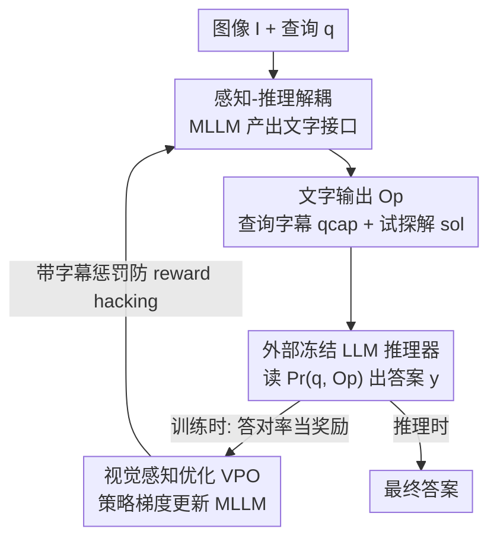

# Reasoning-Aligned Perception Decoupling for Scalable Multi-modal Reasoning

**会议**: ICLR 2026  
**OpenReview**: [https://openreview.net/forum?id=hlLXvyz5iP](https://openreview.net/forum?id=hlLXvyz5iP)  
**代码**: https://github.com/gyhdog99/RAPID/  
**领域**: 多模态VLM / LLM推理  
**关键词**: 多模态推理, 感知-推理解耦, 强化学习, 推理时扩展, 字幕生成

## 一句话总结
RAPID 把多模态大模型（MLLM）的角色重新定位成"感知器"——只负责把图像翻译成文字（查询相关字幕 + 试探性解答），再交给任意一个外部纯文本 LLM 去推理；并用一个名为 VPO 的强化学习算法，用"外部 LLM 最终答对没"来反向优化这些文字，从而让一次训练好的 MLLM 可以即插即用地搭配越来越强的 LLM 持续涨点，无需重做昂贵的视觉-语言对齐。

## 研究背景与动机
**领域现状**：以 OpenAI-o1、Qwen3 为代表的纯文本推理模型在数学、科学等复杂任务上靠"慢思考"取得了巨大进步（AIME 上超 30% 的提升）。但多模态领域明显落后：Qwen2.5-VL、InternVL3、Gemma3 这些 MLLM 内嵌的 LLM 往往是上一代、不具备慢思考能力的旧模型，因此在数学密集型的视觉推理上吃力。

**现有痛点**：要提升 MLLM 的推理能力，主流做法是对它做强化学习（VL-Rethinker、MM-EUREKA）或蒸馏（Vision-R1）。但这些方法的天花板被底座 LLM 死死锁住——底座是 Qwen2.5，再怎么 RL 也追不上 Qwen3。最直接的办法是把内部 LLM 换成最新最强的那个，但这意味着要在万亿级 token 上把视觉和语言重新对齐一遍，代价高到无法承受。

**核心矛盾**：MLLM 的"感知能力"和"推理能力"被绑死在同一个模型里。每当出现更强的推理 LLM，你就被迫连感知部分一起重训，造成大量重复的对齐成本；而对齐成本又高到让人不敢轻易升级推理底座。

**本文目标**：能不能在不重做视觉-语言对齐的前提下，替换掉 MLLM 内部的 LLM，从而高效地解锁先进推理能力？

**切入角度**：作者观察到，如果让 MLLM 只产出"文字"，那么文字天然就是感知模块和推理模块之间的通用接口——任何纯文本 LLM 都能读懂文字。于是把 MLLM 的职责收窄到"看图说话"，推理交给外挂的强 LLM，二者解耦后各自独立升级。

**核心 idea**：用"感知-推理解耦 + 用下游答对率当奖励来对齐字幕"代替"把整个 MLLM 一起重训"，让感知模块一次训练、永久复用，搭配任意 LLM 推理器都能涨点。

## 方法详解

### 整体框架
RAPID 把一次多模态推理拆成两段串行流程：**感知段**由 MLLM（如 Qwen2.5-VL）把图像 $I$ 和查询 $q$ 翻译成一组文字输出 $O_p$；**推理段**由一个冻结的、强大的纯文本 LLM 推理器（如 R1-Distilled-7B、Qwen3-8B）接收原始查询 $q$ 和经推理提示词 $P_r$ 组织好的 $O_p$，输出最终答案 $y = \text{LLM}(P_r(q, O_p))$。这里的文字输出 $O_p$ 是关键的"通用接口"，它让推理 LLM 可以被独立替换升级，而无需重训 MLLM。

但解耦本身有个隐患：MLLM 产出的文字并不是"为了让下游推理对"而优化的——它看图说话时收不到任何"这段描述有没有帮 LLM 答对"的反馈。RAPID 因此用 **VPO** 这个强化学习反馈回环来对齐：MLLM 对同一张图采样出一组字幕候选，每个候选喂给推理 LLM 跑一遍，按"最终答案对不对"给奖励，再用策略梯度更新 MLLM，使它学会生成"忠实且与查询相关、利于下游答对"的字幕。整套训练用极少数据（约 39K）即可，训练完的 MLLM 就能即插即用搭配任意 LLM。

### 关键设计

**1. 感知-推理解耦：把 MLLM 降级成"看图说话器"，让推理 LLM 可热插拔**

针对"换推理底座要重做对齐"这个痛点，RAPID 不再让 MLLM 端到端地"看图+推理"，而是把它的职责收窄到把多模态输入翻译成一段文字 $O_p$，推理彻底外包给一个独立的纯文本 LLM。这段文字就是感知和推理之间的**通用自然语言接口**——既然 LLM 只读文字，那任意一个更强的 LLM 都能直接接上来用，无需重训 MLLM 或重做视觉-语言对齐。这和以往"先描述再推理"（caption-then-reason）的两段式管线有一个关键区别：RAPID 的文字输出不只是一段图像字幕，还包含一个**试探性解答**（tentative solution），用来确保推理所需的关键视觉信息被完整捕获，而不是把视觉细节漏在字幕之外。论文用消融验证：仅这一步解耦（接上更强的 Qwen3-8B）就让 7B MLLM 的平均分从 42.0 涨到 47.5（+5.5%）。

**2. 文字输出的内容设计：标准字幕 + 试探解答互补，且为 VPO 留出潜力**

$O_p$ 到底该放什么？作者系统地比了六种组合：空集 `none`、标准字幕 `cap`、查询相关字幕 `qcap`、试探解答 `sol`，以及 `cap+sol`、`qcap+sol`。结论有两点：其一，**未经优化时标准字幕 `cap` 反而优于查询相关字幕 `qcap`**——因为 MLLM 在标准图像描述任务上训练充分，而查询相关描述能力还没被打磨；其二，**字幕与试探解答互补、组合最好**（`cap+sol` 在 Qwen3-8B 下比原始 MLLM 高约 +7%），因为字幕给推理 LLM 提供"解题所需的上下文"，试探解答提供"一个可参考的初步答案"。有意思的是，作者最终默认选了初始表现略差的 `qcap+sol`：因为一旦施加 VPO 优化（设计 3），查询相关字幕反超标准字幕——查询能引导 MLLM 聚焦相关视觉细节，使其更易被 RL 优化，潜力更大。

**3. 视觉感知优化 VPO：用"下游答对率"当奖励来对齐字幕**

这是论文的核心创新，针对"MLLM 看图说话时收不到下游反馈"的痛点。VPO 借鉴 GRPO 的组相对策略优化思路，把要优化的策略 $\pi_\theta$ 设为做视觉字幕的 MLLM。对一个输入对 $(I, q)$，旧策略采样出 $G$ 个字幕候选；难点在于字幕是中间产物、无法直接判对错，于是 VPO 把每个候选 $o_i$ 喂给推理 LLM 生成最终答案 $y_i$，再用"答案是否匹配真值"作为奖励：

$$\hat{R}_i = r(y_{gt}, y_i) = \mathbb{1}(y_{gt} = \text{parse}(y_i)),\quad y_i = \text{LLM}(P'_{reason}(q, o_i))$$

组内做标准化优势 $\hat{A}_i = \frac{R_i - \bar{R}}{\sigma(R)}$，再套 GRPO 的截断代理损失（clip 到 $[1-\epsilon_l, 1+\epsilon_h]$）加 KL 惩罚来稳定训练。这样一来，MLLM 不再只为"描述得像"而生成，而是为"让下游推理答对"而生成——字幕从单纯描述变成功能上对齐推理目标。更妙的是 VPO 是**LLM-agnostic** 的：MLLM 通过自然语言和推理器沟通，一次对齐即可即插即用搭配任意 LLM，无需为新 LLM 重跑 VPO。

**4. 字幕惩罚：堵住 reward hacking 这个后门**

只用答对率当奖励会出岔子：训练中观察到 **reward hacking**——MLLM 学会直接把题做了（在"字幕"里偷偷给出解答），而不是好好描述图像，结果它的字幕能力毫无长进。作者因此加了一个惩罚项：当候选 $o_i$ 既导致答对、又不含真正的字幕时扣分：

$$R_i = \hat{R}_i - \lambda\, \mathbb{1}\!\left(\hat{R}_i = 1 \wedge \neg\,\text{hasCap}(o_i)\right)$$

其中 $\text{hasCap}(\cdot)$ 由策略 MLLM 自己通过少样本提示判断 $o_i$ 是否含字幕，$\lambda$ 为惩罚因子（取 0.1）。这个惩罚对 VPO 至关重要：加了它，含有效字幕的 rollout 比例在 150 步前能稳定保持在 95% 以上；不加，这个比例会迅速塌缩。消融上，字幕惩罚单独贡献了 +1.0% 的平均分。此外作者还对试探解答用规则奖励的 GRPO 单独优化，实际训练采用"先 GRPO 再 VPO"的顺序方式，两者互补。

### 损失函数 / 训练策略
训练数据用 ViRL39K（38,870 条可验证的多模态问答对）。训练时统一用 R1-Distilled-7B 当推理器算奖励，评测时换 Qwen3-8B / GPT-OSS-120B。GRPO 的 rollout 数 3B/7B 取 8、32B/72B 取 4，去掉 KL 正则并用 Clip-Higher（$\epsilon_l=0.2,\epsilon_h=0.25$）；VPO 的 rollout 取 4、KL 系数 $\beta=10^{-3}$、惩罚常数 $\lambda=0.1$，在 200 步 GRPO 之后施加。全局 batch 256，rollout 温度 1.0，学习率 $10^{-6}$。值得注意 32B 模型已被 RL 调过，故不再加 GRPO 而直接做 VPO；3B 模型 VPO 后会轻微遗忘推理能力，故再补 100 步 GRPO 缓解。

## 实验关键数据

### 主实验
在七个多模态推理基准上比较平均准确率（AVG）：

| 模型 | 推理器 | 总规模 | AVG | 相对原模型 |
|------|--------|--------|-----|-----------|
| Qwen2.5-VL-7B | — | 7B | 42.0 | — |
| Qwen2.5-VL-7B + RAPID | Qwen3-8B | ~15B | 53.2 | +11.2 |
| Qwen2.5-VL-32B | — | 32B | 52.2 | — |
| Qwen2.5-VL-32B + RAPID | GPT-OSS-120B | — | 57.4 | +5.2 |
| Qwen2.5-VL-72B + RAPID | GPT-OSS-120B | — | 58.0 | +5.2 |
| InternVL3-78B | — | 78B | 54.6 | — |
| VL-Rethinker-72B | — | 72B | 54.7 | — |

关键结论：(i) 显著涨点，7B 模型 +11.2%；(ii) 更优的性能-规模权衡——15B 总规模的 RAPID-7B 超过了 MM-Eureka-32B、InternVL3-38B、Ovis2-34B 等更大模型，32B 版超过 VL-Rethinker-72B 和 InternVL3-78B；(iii) RAPID-72B 搭 GPT-OSS-120B 达到 58.0 的最高平均分，甚至超过 Claude-3.7-Sonnet、Gemini-2.0-Flash 等闭源模型。同时它也超过了 ECSO、OmniCaptioner 等此前的 caption-then-reason 方法。

### 消融实验
以 Qwen2.5-VL-7B 为基座，逐项叠加各组件（AVG）：

| 配置 | 解耦 | GRPO | VPO† | 字幕惩罚 | AVG | 说明 |
|------|------|------|------|---------|-----|------|
| A | | | | | 42.0 | 原始 MLLM |
| B | ✓ | | | | 47.5 | 仅解耦，+5.5 |
| C | ✓ | ✓ | | | 50.5 | 加 GRPO 优化试探解，+3.0 |
| D | ✓ | ✓ | ✓ | | 52.2 | 加 VPO（无惩罚），+1.7 |
| E | ✓ | ✓ | ✓ | ✓ | 53.2 | 完整模型，+1.0 |
| G | ✓ | | ✓ | ✓ | 51.1 | 去掉 GRPO，掉 2.1 |
| I | | ✓ | ✓ | ✓ | 44.7 | 去掉解耦，掉 8.5 |

### 关键发现
- **解耦是最关键的元素**：去掉解耦的配置 I（44.7）远落后于完整模型 E（53.2），说明把推理外包给强 LLM 才是涨点主力。
- **GRPO 与 VPO 互补**：去掉任一个（G 或 C）都不如完整 E；训练动态上，GRPO 涨势放缓后 VPO 提供了明显的二次提升。
- **字幕惩罚防 reward hacking**：不加惩罚时含字幕的 rollout 比例迅速塌缩，加了能稳定保持 95% 以上；它独占 +1.0% 的提升。
- **VPO 让 qcap 反超 cap**：未优化时 `cap+sol` 更好，VPO 后 `qcap+sol` 反超（E vs F），因为查询引导让 qcap 的训练奖励稳步上升、cap 则震荡不涨。
- **不伤通用能力**：在 MMBench、MMVet、SEED 等通用基准上，优化后的模型与原模型持平，说明 RAPID 是定向增强推理而非牺牲通用性。

## 亮点与洞察
- **把"文字"当成感知与推理之间的通用接口**，是这篇论文最"啊哈"的地方——它把"换底座要重训"这个死结，转化成"换一个能读文字的 LLM"这种零成本操作，由此催生了一种新的推理时扩展范式：一次对齐，搭配越来越强的 LLM 持续涨点。
- **用下游任务的最终答对率反向监督中间产物（字幕）**，把"描述得像不像"换成"有没有帮到推理"，这个奖励设计思路可迁移到任何"中间表示无法直接判对错"的两段式管线（如检索增强、工具调用的中间 query 生成）。
- **reward hacking 的识别与堵漏**很务实：当奖励只看终点时，模型会抄近道直接做题；用一个"是否真含字幕"的判别项加惩罚，是这类 RL 管线值得复用的防御 trick。

## 局限与展望
- 作者承认 VPO 单独并不能提升 MLLM 自身的推理能力（H vs I 甚至略降），其价值完全依赖外部强 LLM；3B 模型 VPO 后还会轻微遗忘，需要补 GRPO 救回。
- 方法聚焦于多模态数学和科学推理这类**有可验证答案**的任务（奖励靠答案匹配），对开放式、无标准答案的多模态任务如何设计奖励，论文未触及。
- 两段式管线在推理时要跑两次大模型（MLLM 出字幕 + LLM 推理），虽然性能-规模权衡好，但延迟和调用成本相比单模型可能更高，论文将计算效率分析放在附录，正文未充分展开。
- 感知段一旦漏掉关键视觉信息（字幕没描述到），下游再强的 LLM 也无从补救——这种"感知瓶颈"是解耦范式的固有风险。

## 相关工作与启发
- **vs VL-Rethinker / MM-EUREKA（对 MLLM 做 RL）**：它们直接对端到端 MLLM 做 GRPO，天花板被底座 LLM 锁死；RAPID 把推理外包给可替换的强 LLM，绕开了底座限制，且一次训练可复用。
- **vs ECSO / OmniCaptioner（caption-then-reason）**：以往两段式管线只优化字幕生成本身、不为最终答对率优化，且只产出字幕；RAPID 既加入试探性解答以捕获关键视觉信息，又用最终答对率作奖励来对齐字幕，因此显著超过它们。
- **vs 直接换强底座再重对齐**：理想方案是把 MLLM 内部 LLM 换成最新的，但要在万亿 token 上重做对齐，代价不可承受；RAPID 用自然语言接口实现了"零重训"的等价升级。

## 评分
- 新颖性: ⭐⭐⭐⭐⭐ 把感知-推理解耦 + 用下游答对率对齐字幕组合成"推理时扩展"新范式，思路清晰且实用。
- 实验充分度: ⭐⭐⭐⭐⭐ 七个基准、4 种规模、逐项消融、训练动态、通用能力验证都覆盖到位。
- 写作质量: ⭐⭐⭐⭐ 动机和方法叙述清楚，部分实现细节（GRPO 对试探解的优化、惩罚判别函数）下放到附录。
- 价值: ⭐⭐⭐⭐⭐ 解决了 MLLM 升级推理底座的核心痛点，即插即用范式有很强的工程落地价值。

<!-- RELATED:START -->

## 相关论文

- [\[ICML 2026\] Vision-aligned Latent Reasoning for Multi-modal Large Language Model](../../ICML2026/vlm_reasoning/vision-aligned_latent_reasoning_for_multi-modal_large_language_model.md)
- [\[ICLR 2026\] Perception-R1: Advancing Multimodal Reasoning Capabilities of MLLMs via Visual Perception Reward](perception-r1_advancing_multimodal_reasoning_capabilities_of_mllms_via_visual_pe.md)
- [\[ICLR 2026\] Perception-Aware Policy Optimization for Multimodal Reasoning](perception-aware_policy_optimization_for_multimodal_reasoning.md)
- [\[ICLR 2026\] VisionReasoner: Unified Reasoning-Integrated Visual Perception via Reinforcement Learning](visionreasoner_unified_reasoning-integrated_visual_perception_via_reinforcement_.md)
- [\[ICLR 2026\] MMR-Life: Piecing Together Real-life Scenes for Multimodal Multi-image Reasoning](mmr-life_piecing_together_real-life_scenes_for_multimodal_multi-image_reasoning.md)

<!-- RELATED:END -->
