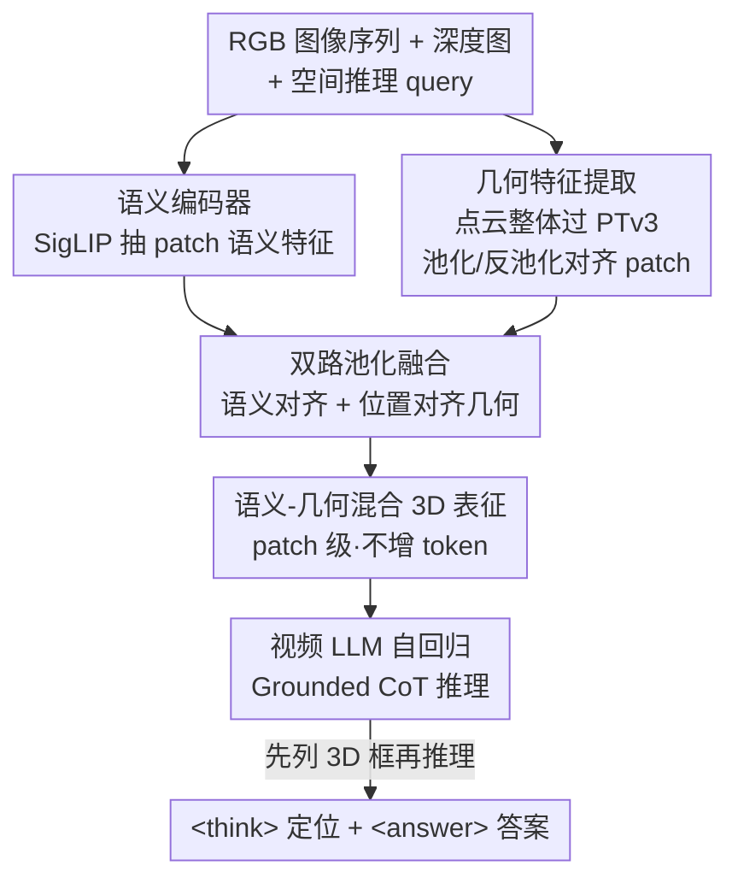

# Reasoning in Space via Grounding in the World

**会议**: ICLR 2026  
**OpenReview**: [https://openreview.net/forum?id=CfKi92bgnq](https://openreview.net/forum?id=CfKi92bgnq)  
**代码**: 有（Project Page / GitHub / HuggingFace）  
**领域**: 多模态VLM / 3D视觉 / 空间推理  
**关键词**: 3D视觉定位, 空间推理, 3D大模型, 语义-几何融合, Grounded CoT  

## 一句话总结
本文提出 GS-Reasoner，用一个"双路池化"机制把几何特征对齐到图像 patch 级的语义与位置特征上，构造统一的语义-几何混合 3D 表征，让 3D 大模型第一次能在**不依赖任何外部检测器/解码器**的情况下自回归地做 3D 视觉定位，并以定位结果作为思维链中间步骤来增强空间推理，在 VSI-Bench 等基准上取得 SOTA。

## 研究背景与动机
**领域现状**：把 3D 物体和文本描述对应起来（3D visual grounding）被视为空间推理的前置步骤——人也是先认出"哪个物体"再去推理它们的空间关系。近期的 3D LLM 已经能做 3D VQA、定位、captioning，但普遍要靠预训练好的 3D 检测器、mesh proposal 或外部 grounding 模块来完成定位。

**现有痛点**：这种"外挂定位"的范式有两个硬伤。其一，3D 数据本身复杂、点云携带丰富几何/深度线索但很难和 LLM 的语义空间对齐，加上大规模 3D 数据稀缺；以往要么用 Q-former 压缩点云、要么用 voxel 表征，都是拿几何保真度换 token 效率，提取出的点云特征语义信息有限，定位和推理都做不准。更新的一类工作把 3D 位置编码注入视觉基础模型的视频特征里，保住了泛化能力，但仅靠位置编码得到的几何线索太弱，定位性能受限。其二，缺少把 grounding 作为中间步骤嵌入空间推理的高质量数据集——现有 3D VQA 数据只有短答案，既无定位标注也无推理步骤，无法把"定位 + 推理"组合起来训练。

**核心矛盾**：缺少一个能**同时**承载语义信息和几何信息的统一 3D 表征。要么几何强但语义弱（纯点云编码器），要么语义强但几何弱（视觉特征 + 位置编码），二者割裂导致 3D LLM 要么定位差、要么被迫外挂模块，grounding 和 spatial reasoning 无法自然融为一体。

**本文目标**：(1) 设计一种不增加输入 token 数、又能联合编码语义+几何+位置的统一 3D 场景表征，让 LLM 自回归地直接吐出 3D 框；(2) 造一个把定位当作推理中间步骤的数据集，让模型学会"先定位、再推理"。

**切入角度**：作者主张 **3D visual grounding 是空间推理的基石**——既然几何对齐做好了能让模型准确定位，那定位结果就能天然充当推理的中间思维链。于是关键不在于换更大的外部检测器，而在于把几何特征**正确地对齐**到以图像 patch 为基本单元的语义-位置框架里。

**核心 idea**：用 patch 级的"双路池化"把几何特征分别对齐语义上下文和 3D 位置，融成统一混合表征；再用内含 3D 框标注与逐步推理路径的 GCoT 数据集训练，让模型把 grounding 写进 `<think>` 思维链，实现自包含的 3D 空间推理框架。

## 方法详解

### 整体框架
输入是一段 3D 场景的 RGB 图像序列 $\{I_i\}_{i=1}^N$ 加上一句空间推理 query $Q$（深度图、相机内外参可由 VGGT-SLAM 等视觉几何方法估计），输出是包含 `<think>` 推理块和 `<answer>` 最终答案的自回归文本，其中 `<think>` 里会先列出相关物体的 3D 包围盒。整个框架由三部分组成：语义编码器（SigLIP 视觉基础模型）、几何编码器（基于 PTv3 的 Sonata 点云编码器）、视频 LLM（LLaVA-Video 7B）。

流程是：语义编码器从 RGB 图像抽语义特征；深度图反投影成 point maps、聚合成场景点云后送进几何编码器抽几何特征，并对每个 patch 中心点做 3D 位置编码；三类特征（语义、几何、位置）经过**双路池化**的语义-几何融合，在不增加 token 数的前提下拼成 patch 级的混合 3D 表征；混合表征和文本 query 一起喂进视频 LLM，自回归地先做物体定位、再逐步推理，最后给出答案。模型输出严格遵循 CoT 格式：`<think>` 里先分析问题、再以 `OBJECT_NAME OBJECT_COUNT <bbox>(x1,y1,z1,x2,y2,z2)</bbox>` 列出世界坐标系下轴对齐 3D 框（单位米），若框对答题无益则省略，推理后用 `<answer>` 给简洁答案。

### 关键设计

**1. 语义-几何混合 3D 表征：以图像 patch 为基本单元统一三类信号**

针对"没有统一表征、几何与语义割裂"的核心矛盾，作者不另起炉灶，而是沿用视频 LLM 已经擅长的图像 patch 作为基本积木，把几何特征"塞进"每个 patch，从而既保住视觉-语义预训练带来的泛化能力，又补上几何线索，且**不增加输入 token 数**。具体地，先把 point maps 按与图像 patch 相同的 $p\times p$ 尺寸切块，每块均匀采样 $K$ 个点得到子采样点图 $\{P_i^{sub}\in\mathbb{R}^{3\times K\times H'\times W'}\}$（$H'=H/p,\,W'=W/p$）。这里有个关键选择：几何特征提取时**不是**在每个 patch 内孤立处理那几个点（点太少、上下文不足），而是把整张点云 $P=\cup_i P_i$ 当作整体送进 PTv3。PTv3 用空间填充曲线把点云序列化、分组，做 U-Net 式的序列化注意力，层间池化为 $f_i'=\text{MaxPool}(\{f_jU\}),\,p_i'=\text{MeanPool}(\{p_j\})$，再通过保存的映射关系反池化、逐层拼回原分辨率得到与输入对齐的几何特征图 $\{G_i\in\mathbb{R}^{C\times K\times H'\times W'}\}$。整体处理点云带来更大感受野和更准的几何特征，但也埋下了"对齐"隐患——这正是下一个设计要解决的。

**2. 双路池化：同时消除"语义-几何错位"和"位置-几何错位"**

把整张点云当整体编码虽然几何准，但若直接照搬 PTv3 的"几何 max pool + 点 mean pool"来得到 patch 表征，会出现两类错位，导致定位很差。第一类是**语义-几何错位**：patch 里的 3D 点在整体编码时几乎能和全场景所有点交互，而对应的语义特征只局限于当前图像可见的信息；max pooling 只挑最显著的几何特征、不顾 patch 的语义上下文，二者就对不上。第二类是**位置-几何错位**：传统点云编码器用 KNN 或序列化保证组内点空间相邻，naive 池化能保住组内几何；但一个图像 patch 内的点不满足这个条件，尤其当 patch 同时含前景和背景时点之间空间距离很大，max pool 几何会引入几何不一致，mean pool 算出的位置可能既远离前景也远离背景，直接拖垮 3D 框精度。

作者用一个轻量的双路融合模块同时治这两病。治语义-几何错位：用一个轻量 cross-attention，让**每个 patch 的语义特征当 query**、patch 内的 $K$ 个几何特征当 key/value，注意力机制自动挑出和该 patch 语义上下文最相关的几何特征，得到"语义对齐的几何特征"。治位置-几何错位：直接采样 patch **中心像素**对应的那个 3D 点来做位置编码，再依据该点位置对几何特征做插值，得到"位置对齐的几何特征"——这样保证位置和几何一致，如果中心点落在前景，插值特征就主要来自前景点，反之亦然。最后把语义对齐和位置对齐两路几何特征拼接、投影成 patch 级几何特征，再与投影后的语义特征、中心点的 3D 位置编码组合，构成最终 patch 级混合特征。正是这套对齐让 GS-Reasoner 成为首个**无需外部模块**就能自回归 3D 定位、且性能接近 SOTA 的 3D LLM。

**3. GCoT 数据集：把 grounding 写进推理思维链**

针对"缺少把定位当中间步骤的数据"这一痛点，作者构造了 Grounded Chain-of-Thought (GCoT) 数据集。出发点是：空间推理本质上扎根于相关物体的位置和尺寸关系，"先认物体再推理几何"就是一个 3D grounding 任务；把 grounding 作为中间步骤既提供更丰富的监督、也提升可解释性。构造管线分两步：先按已有 pipeline 生成不含 CoT 的空间 QA 对，并保留生成时用到的物体 3D 框信息；再用这些 QA、物体框和场景的鸟瞰图（BEV）去提示 GPT-4o 生成连贯的、导向最终答案的 CoT 推理路径。最终得到 156k QA 对，其中 79% 含 CoT 标注（Appearance Order、Object Counting、Room Size 三类任务因不需复杂空间推理而省略 CoT）。训练上模型端到端做 next-token prediction：先在 ScanRefer / Multi3DRef / SR3D / NR3D 等定位数据上预训练热身 grounding，再在 GCoT、剩余定位数据和其他 3D 任务上微调。这套数据让模型养成"先列出相关物体 3D 框、再推理空间关系"的习惯，更符合人类认知，也更可解释。

### 损失函数 / 训练策略
统一用自回归 next-token prediction 目标端到端训练，定位与推理共用同一套输出格式与监督。先在 3D 视觉定位数据子集上预训练以热身物体定位，再在 GCoT + 剩余定位数据 + 其他 3D 任务（ScanQA、SQA3D、Scan2Cap）上微调；数据增强对训练很关键。推理时每个场景均匀采样 32 张图像作为输入；定位任务提供 GT 深度和相机参数以求公平，空间推理任务则用 VGGT-SLAM 估计深度/相机参数并用 Moge2 做度量对齐。

## 实验关键数据

### 主实验
VSI-Bench 空间推理（>5000 QA，覆盖 8 类任务）：GS-Reasoner 在多数任务上 SOTA，用预测深度时排名第一，用 GT 深度时平均分破 70。

| 模型 | 平均分 | Abs. Dist. | Rel. Dir. | Appr. Order |
|------|--------|-----------|-----------|-------------|
| Gemini-1.5 Pro (API) | 45.4 | 30.9 | 46.3 | 34.6 |
| Spatial-MLLM-4B | 48.4 | 34.8 | 46.2 | 46.3 |
| VLM-3R-7B | 60.9 | 49.4 | 80.5 | 40.1 |
| **GS-Reasoner（预测深度）** | **64.7** | **61.9** | **88.9** | **52.3** |
| **GS-Reasoner（GT 深度）** | **70.1** | **73.6** | **90.5** | **52.6** |

3D 视觉定位（不用任何外部模块即可媲美外挂方案）：在 Multi3DRef F1@25 上达到 3D LLM 中的 SOTA，甚至超过依赖 proposal/外部 grounding 的方法；在 ScanRefer Acc@50、Multi3DRef F1@50 上追平带外部 grounding 模块的方法。

| 方法 | ScanRefer Acc@25 | Multi3DRef F1@25 | SR3D Acc@25 |
|------|------------------|------------------|-------------|
| LLaVA-3D（外部 grounding） | 54.1 | 54.3 | - |
| ROSS3D（mesh proposal） | 61.1 | 59.6 | - |
| **GS-Reasoner（无外部模块）** | 60.8 | **61.7** | 56.7 |

通用 3D 任务上，Scan2Cap 全指标刷新 SOTA（CIDEr 101.0 vs ROSS3D 81.3）；ScanQA / SQA3D 与 SOTA 相当但未领先（作者归因于这些数据集问题歧义多、答案分布有强偏置）。

### 消融实验
表 5：3D 表征 + 数据增强消融（ScanRefer，自回归预测 3D 框坐标）。

| 配置 | Acc@25 | Acc@50 | 说明 |
|------|--------|--------|------|
| LLaVA-NeXT（无任何 3D） | 0.0 | 0.0 | 完全无法自回归定位 |
| + 数据增强（Avg pos） | 53.2 | 29.8 | 数据增强是定位能起步的关键 |
| + Max 几何池化 | 57.5 | 35.7 | 朴素 max pool 已有提升 |
| + Cross-Attn（语义对齐） | 58.9 | 38.6 | 缓解语义-几何错位 |
| + Sample/Interpolate（位置对齐） | 59.3 | 40.2 | 缓解位置-几何错位 |
| **GS-Reasoner（双路池化全量）** | **60.8** | **42.2** | 两路对齐叠加，相对基线 +7.6 / +12.4 |

表 6：Grounded CoT 机制消融（只看含 CoT 标注的任务）。

| 配置 | 平均 | Abs. Dist. | Rel. Dir. | Route Plan |
|------|------|-----------|-----------|------------|
| LLaVA-NeXT-Video ft（无 CoT） | 52.3 | 45.1 | 60.7 | 32.5 |
| GS-Reasoner ft（无 CoT） | 57.7 | 50.8 | 79.3 | 30.4 |
| **GS-Reasoner ft（全量含 CoT）** | **66.1** | **61.9** | **88.9** | **44.3** |

### 关键发现
- **双路对齐两条腿缺一不可**：从 max pool（57.5）→ 加语义对齐 cross-attn（58.9）→ 加位置对齐插值（59.3）→ 两者合并的双路池化（60.8），两类错位分别修复后叠加，Acc@50 相对基线累计提升 +12.4，验证了"语义错位"和"位置错位"是两个独立且都需治理的问题。
- **Grounded CoT 收益巨大**：相比无 CoT 微调，加入 grounded CoT 让平均分从 57.7 涨到 66.1（+8.4），Relative Direction 这种既要复杂推理又要精确定位的任务从 79.3 涨到 88.9，说明"先定位再推理"确实把定位能力转化成了推理能力。
- **深度越准推理越好**：从预测深度（平均 64.7）换到 GT 深度（70.1）一致提升约 5 点，表明几何/深度质量是空间推理的上限因素之一。
- **LLM vs 专家模型分工**：GS-Reasoner 在 ScanRefer（复杂 query）上能媲美专家模型，但在 SR3D/NR3D（简单描述、要求精确定位）上落后，提示 LLM 类方法更擅长复杂语言查询，专家模型更擅长精确定位。

## 亮点与洞察
- **"定位即思维链中间步骤"的视角很漂亮**：把 3D grounding 从一个需要外挂的子任务，变成空间推理 `<think>` 块里自然产生的一步，让整个系统自包含、可解释，框 + 推理在同一自回归过程里产出。
- **双路池化是个低成本但点睛的对齐 trick**：用语义特征当 query 做 cross-attn、用 patch 中心点做插值，两步都很轻量却精准命中了"整体编码点云带来的两类错位"，可迁移到任何需要把点云几何对齐到图像 patch 的场景。
- **不增加 token 数实现几何注入**：把几何信息融进既有的 patch 表征而非新增 3D token，既省算力又保住视频 LLM 的语言理解能力，是工程上很实用的设计哲学。
- **GCoT 的数据合成思路可复用**：用"已有 QA + 物体框 + BEV"去提示 GPT-4o 反向生成 CoT，是给只有短答案的数据集"补推理链"的通用做法。

## 局限与展望
- 作者承认在 ScanRefer Acc@50、Multi3DRef F1@50 上仍落后于用 mesh proposal 的方法，原因是 mesh 点云更完整少噪、且传统检测器用 mask 监督比 bbox 监督更利于精确定位；GS-Reasoner 用的是带噪、不完整的传感器点云。
- ScanQA / SQA3D 未能领先，作者归因于数据集问题歧义、答案分布偏置导致模型过拟合文本模式而非真正用 3D token；并指出像 ROSS3D 那样加重建约束可能促使模型更用 3D token，留作未来工作。
- 依赖深度/相机参数（in-the-wild 时用 VGGT-SLAM 估计），从消融可见深度质量直接影响推理上限，几何估计误差会传导到定位与推理。
- 自定义指标方面，定位用 Acc@IoU、多物体用 F1@IoU，VSI-Bench 数值题与选择题混合评测，横向比较时需注意不同任务难度差异。

## 相关工作与启发
- **vs Q-former / voxel 类 3D LLM（3D-LLM、LL3DA、Scene-LLM）**：他们压缩点云或用 voxel 表征，拿几何保真度换 token 效率、语义信息有限；本文用 patch 级混合表征同时保住语义和几何，且不增 token。
- **vs 位置编码注入视觉特征类（LLaVA-3D、Video-3D LLM、ROSS3D）**：他们把 3D 位置编码注入视频特征，泛化好但仅靠位置编码几何线索弱、定位受限；本文额外引入点云几何编码器并用双路池化对齐，几何更强。
- **vs 外挂 grounding 的 3D LLM（Grounded 3D-LLM、ReGround3D）**：他们靠外部检测器/解码器定位，割裂了 grounding 与推理；本文首次无外部模块自回归定位，把定位嵌入推理思维链。
- **vs 专门空间推理模型（Spatial-MLLM、VLM-3R）**：他们用 VGGT 几何特征 + 大规模 QA 训练，但答案格式受限（单选/短数值）限制了对 3D 信息的利用；本文用 GCoT 提供带推理链的丰富监督，VSI-Bench 平均分大幅领先。

## 评分
- 新颖性: ⭐⭐⭐⭐⭐ 首个无外部模块自回归 3D 定位的 3D LLM，"定位即 CoT 中间步骤"视角 + 双路池化对齐都很有创见
- 实验充分度: ⭐⭐⭐⭐⭐ 覆盖定位、空间推理、通用 3D 任务 + 零样本 + 两组消融，证据链完整
- 写作质量: ⭐⭐⭐⭐ 动机与两类错位分析清晰，公式与图配合到位，部分附录细节需查原文
- 价值: ⭐⭐⭐⭐⭐ 给"grounding 与 spatial reasoning 融合"提供了自包含范式，VSI-Bench SOTA，工程可复用性强

<!-- RELATED:START -->

## 相关论文

- [\[ICLR 2026\] LLMs as Rules Oracles: Exploring Real-World Multimodal Reasoning in Tabletop Strategy Game Environments](llms_as_rules_oracles_exploring_real-world_multimodal_reasoning_in_tabletop_stra.md)
- [\[CVPR 2026\] From Indoor to Open World: Revealing the Spatial Reasoning Gap in MLLMs](../../CVPR2026/vlm_reasoning/from_indoor_to_open_world_revealing_the_spatial_reasoning_gap_in_mllms.md)
- [\[ICML 2026\] Temporal-Aware Reasoning Optimization for Video Temporal Grounding](../../ICML2026/vlm_reasoning/temporal-aware_reasoning_optimization_for_video_temporal_grounding.md)
- [\[ICML 2026\] Learning GUI Grounding with Spatial Reasoning from Visual Feedback](../../ICML2026/vlm_reasoning/learning_gui_grounding_with_spatial_reasoning_from_visual_feedback.md)
- [\[CVPR 2026\] Monet: Reasoning in Latent Visual Space Beyond Image and Language](../../CVPR2026/vlm_reasoning/monet_reasoning_in_latent_visual_space_beyond_image_and_language.md)

<!-- RELATED:END -->
