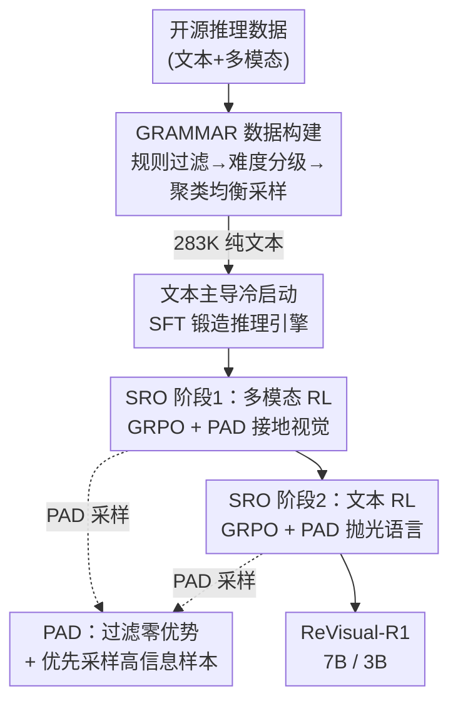

# ReVisual-R1: Advancing Multimodal Reasoning from Optimized Cold Start to Staged Reinforcement Learning

**会议**: ICLR 2026  
**OpenReview**: [https://openreview.net/forum?id=NTo6f6GENJ](https://openreview.net/forum?id=NTo6f6GENJ)  
**代码**: https://github.com/CSfufu/Revisual-R1  
**领域**: 多模态VLM / LLM推理  
**关键词**: 多模态推理, 冷启动, 强化学习, GRPO, 课程式训练

## 一句话总结
这篇论文系统拆解了多模态大模型（MLLM）的推理训练流水线，发现「纯文本高难度冷启动 + 多模态 RL + 文本 RL」三阶段课程才是激活复杂推理的关键，并针对多模态 GRPO 的「梯度停滞」提出 PAD 采样机制，最终让 7B 的 ReVisual-R1 在九个推理基准上拿下开源 SOTA，甚至超过 GPT-4o。

## 研究背景与动机

**领域现状**：DeepSeek-R1 用强化学习在纯文本任务上自发涌现出复杂推理能力后，大量工作试图把同样的 RL 范式搬到多模态大模型上，希望复刻这种「认知能力的跃迁」。

**现有痛点**：直接把文本中心的 RL 技术套到 MLLM 上收益递减——既要培养抽象的语言推理能力，又要把它锚定在连续高维的视觉感知空间里，朴素的联合训练往往两头不讨好，哪个模态的潜力都没发挥出来。更具体地，现有 MLLM 的冷启动阶段普遍依赖简单的图文预训练语料，导致后续 RL 阶段激发不出有深度的自我反思式推理。

**核心矛盾**：问题不在于网络架构怎么扩展，而在于训练流水线本身。作者认为多模态推理不能孤立地看「多模态 RL」这一步，而要把冷启动、模态接地、文本精修当成一条需要精心编排的课程；其中三个被忽略的环节决定成败。

**本文目标**：拆解 MLLM 训练流水线，找出真正卡住多模态推理的瓶颈，并把它们组装成一套可复用的训练课程。

**切入角度**：作者做了一个反直觉的对照实验——只用纯文本冷启动数据微调，多模态推理表现反而超过用多模态冷启动数据的模型。原因是文本数学题（如 DeepMath）的思维链平均长达 8200 token、通过率仅 75%，而多模态题（如 Vision-R1）平均仅 821 token、通过率高达 96%，说明现有多模态冷启动语料复杂度不足，激发不了深度推理。

**核心 idea**：用「高难度纯文本冷启动锻造推理引擎 → 多模态 RL 把引擎接地到视觉 → 纯文本 RL 抛光语言与逻辑」三阶段课程，配合 PAD 解决多模态 RL 的梯度停滞，系统性地解锁 MLLM 的推理潜力。

## 方法详解

### 整体框架

ReVisual-R1 把多模态推理训练拆成「一次数据构建 + 一次冷启动 + 两阶段强化学习」。先用多阶段清洗流水线构建 GRAMMAR 数据集（283K 纯文本冷启动样本 + 31K 文本 + 21K 多模态 RL 样本）；然后用纯文本数据做冷启动 SFT，把基座 Qwen2.5-VL 训成一个会长链反思的推理引擎；接着进入 Staged Reinforcement Optimization（SRO），先做多模态 RL（MRL）把推理能力接地到视觉输入，再做文本 RL（TRL）抛光语言流畅度与抽象推理。两个 RL 阶段都用 GRPO，并都套上作者提出的 PAD 采样机制来对抗梯度停滞。

### 关键设计

**1. 文本主导的高难度冷启动与 GRAMMAR 数据集：用对的数据点燃推理火种**

作者首先回答一个被现有工作默认错的问题——冷启动到底该喂什么数据。对照实验里，他们各采样 4 万条数据微调 Qwen2.5-VL-7B：纯文本冷启动（DeepMath / OpenR1-Math）在多模态和文本基准上都有大幅提升，而纯多模态冷启动（Vision-R1 / R1-One-Vision）两头收益都很有限。进一步分析发现，文本数学题的回答平均 8207 token、通过率 75%，多模态题平均仅 821 token、通过率 96%——后者太简单，无法逼出长链反思。结论是：当前多模态冷启动语料复杂度不够，**纯文本高难度数据反而是更好的推理火种**。

基于这一发现，作者构建了 GRAMMAR（Generalized Multimodal Reasoning Dataset）。它走一条多阶段清洗流水线：先汇集大量开源推理数据，用规则过滤掉证明题、难以验证答案的题目以保证可验证性；再用 Qwen2.5-VL-7B 剔除过简单/过复杂的题，用 Qwen2.5-VL-32B 把剩余样本分成十个难度等级；最后用 NV-Embedding-V2 编码、HDBSCAN 聚类、Qwen2.5-7B 为簇打主题标签，在主题和难度两个维度上做均衡采样以最大化多样性、降低冗余。最终冷启动阶段用 283K 纯文本样本，RL 阶段额外提供 31K 文本 + 21K 多模态样本，全部带可验证的标准答案。

**2. PAD（Prioritized Advantage Distillation）：让多模态 GRPO 不再「梯度停滞」**

把标准 GRPO 用到复杂多模态任务上时，作者观察到一个严重问题——梯度停滞（Gradient Stagnation）。GRPO 的优势是组内相对计算的：$\hat{A}(x,y_i) = \frac{r(x,y_i) - \text{mean}(r)}{\text{std}(r) + \epsilon}$。当一组生成的回答奖励全相同（全对或全错，这在稀疏二值奖励的多模态场景里很常见），优势信号就退化成零，策略梯度随之归零，这批样本的学习直接停摆，拖累训练稳定性与最终性能。

PAD 在每个 batch 估完优势后插入三步来抢救梯度质量。第一步「逐序列优势计算」：对每条序列算绝对优势 $|\hat{A}_i|$ 作为学习信号强度。第二步「有效样本过滤」：只保留 $|\hat{A}_i| \in [T_{low}, T_{high}]$ 的序列组成有效集 $E$，其中 $T_{low} > 0$ 把那些近零优势的停滞样本直接滤掉，保证候选都带有用信号。第三步「优先子采样」：从 $E$ 里按温度控制的 Softmax 抽出 $k' = \min(\rho|B|, |E|)$ 条组成蒸馏小批量，序列 $i$ 被选中的概率为

$$\Pr(i \mid i \in E) = \frac{\exp(\hat{A}_i / \tau)}{\sum_{j \in E} \exp(\hat{A}_j / \tau)}$$

温度 $\tau$ 在训练中从 1.0 线性退火到 0.3，前期探索、后期聚焦高信息样本。PAD 通过「先滤停滞 + 后优先高优势」的双机制，把算力集中到最有价值的样本上，既稳了训练又提升了样本效率。两个 RL 阶段都共用这一机制。

**3. SRO 分阶段强化优化：先视觉接地再文本抛光的训练课程**

作者把强化学习拆成有严格先后的两个阶段，而不是混在一起训。阶段一是多模态 RL（MRL）：冷启动后立刻用 GRAMMAR 的多模态样本做 GRPO，让模型把冷启动学到的文本推理能力接地到视觉信息上、学会跨模态推理；这一阶段去掉 GRPO 的 KL 约束以鼓励更大胆的策略探索。但密集的多模态训练会反噬纯文本能力，于是阶段二补上文本 RL（TRL）：冻结视觉塔、只在文本推理上发力，用高质量纯文本语料恢复语言流畅度，同时用复杂文本题逼模型把多步思维表达得更清晰；这一阶段加一个小的 KL 惩罚 + 熵退火来稳住训练。

「先 MRL 后 TRL」的顺序不是随意定的：消融显示这一顺序（CS+MRL+TRL）平均 49.6，明显优于反过来的 CS+TRL+MRL（45.5）和把两种数据混训的 Mixed-RL（47.6）。作者的解释是——先建立强视觉接地、再做密集文本精修，两阶段能力才能协同放大，而不是相互覆盖。

### 损失函数 / 训练策略
全程用规则奖励（答案对 $r=1$、错 $r=0$）。冷启动用 LLaMA-Factory 做纯文本 SFT；MRL 与 TRL 都用 Easy R1 跑 GRPO+PAD。基座为 Qwen2.5-VL-7B/3B-Instruct，全部在 8×A100-80G 上训练。冷启动约 283K 文本、MRL 约 26K 多模态、TRL 约 30K 文本。

## 实验关键数据

### 主实验
ReVisual-R1-7B 在十个基准上平均 53.1%，比 baseline 高 16.8 个点，九个基准拿下开源第一；平均分超过 GPT-4o（41.6%），在 MATH500 上（89.2%）甚至超过闭源 doubao-1.5-vision-pro（85.2%）和 GPT-4o（74.6%）。

| 模型 | MathVision | AIME24 | MATH500 | Avg |
|------|-----------|--------|---------|-----|
| OpenAI-GPT-4o | 31.1 | 9.3 | 74.6 | 41.6 |
| VLAA-Thinker-7B（开源前SOTA） | 26.4 | 0.8 | 30.8 | 33.0 |
| VL-Rethinker-7B | 28.4 | 2.9 | 47.0 | 33.6 |
| **ReVisual-R1-7B** | **48.8** | **53.3** | **89.2** | **53.1** |
| ∆ vs 开源最佳 | +18.6 | +43.3 | +22.0 | +16.8 |

3B 规模同样有效：ReVisual-R1-3B 全面超过 VLAA-Thinker-3B，平均提升 16.0 个点，验证了课程的可扩展性。

### 消融实验

训练阶段顺序消融（均在同一冷启动 CS 之上）：

| 配置 | 平均分 | 说明 |
|------|--------|------|
| CS only | 47.1 | 仅冷启动，已超不少现有模型 |
| CS + MRL | 47.7 | 加多模态 RL，视觉密集任务变强 |
| CS + TRL | 44.9 | 只加文本 RL，反而掉点 |
| **CS + MRL + TRL** | **49.6** | 完整三阶段，最优 |
| CS + TRL + MRL | 45.5 | 顺序反转明显变差 |
| CS + Mixed-RL | 47.6 | 混训不如分阶段 |

PAD 组件消融（CS+MRL 设定）：

| 配置 | 平均分 | 说明 |
|------|--------|------|
| Full PAD | 47.7 | 完整机制 |
| 去掉优先子采样（GRPO-Filter） | 46.0 | 只过滤不加权 |
| 去掉有效样本过滤（Random-Sampling） | 46.2 | 只随机抽 |
| GRPO-Baseline | 45.1 | 原始 GRPO |
| DAPO | 46.1 | 另一种采样策略，仍不如 PAD |

### 关键发现
- **纯文本冷启动就能反超多模态冷启动**：CS only 已达 47.1，仅靠精选文本数据就超过许多专门的多模态推理模型，是全文最反直觉的发现。
- **顺序比成分更重要**：同样三阶段，MRL→TRL（49.6）比 TRL→MRL（45.5）高 4.1 个点，说明「先接地视觉再精修文本」的协同效应是真实存在的。
- **PAD 两个组件缺一不可**：过滤和优先采样单独用都只到 46 左右，合起来才到 47.7，且收敛更快、奖励准确率更高。

## 亮点与洞察
- **「少即是多」的冷启动哲学**：用复杂度更高的纯文本数据，比堆图文数据更能逼出长链反思——这提示多模态推理的瓶颈可能在「思维深度」而非「视觉覆盖」，值得迁移到其他多模态 RL 任务。
- **梯度停滞是个被低估的 RL 病灶**：当奖励稀疏且二值时，组内全对/全错会让 GRPO 优势归零，PAD 用「过滤+温度退火加权」这种轻量手段就稳住了训练，思路可直接套到其他用 GRPO 的稀疏奖励场景。
- **课程顺序本身是超参**：论文用消融把「阶段顺序」证明成一个一等公民的设计选择，而不是随手排列，这种把流水线编排当研究对象的视角很有启发。

## 局限与展望
- 三阶段课程涉及三套数据 + 三轮训练，整体流程重、调参成本高，复现门槛不低。
- 奖励仍是规则化的二值答案对错，对开放式/无标准答案的多模态推理（如视觉解释、长文生成）是否适用尚未验证。
- 评测集中在数学与逻辑类推理，在更广义的常识/感知密集型多模态任务上的迁移性有待考察。
- PAD 的阈值 $[T_{low}, T_{high}]$、采样比 $\rho$、温度退火曲线都是关键超参，论文未给出在不同任务上的敏感性分析。

## 相关工作与启发
- **vs DeepSeek-R1**：R1 在纯文本上用 RL 自发涌现推理；本文把这套范式扩展到多模态，但指出不能直接照搬——多模态需要先文本冷启动再分阶段 RL，且要解决 GRPO 在多模态下的梯度停滞。
- **vs Vision-R1 / R1-One-Vision（多模态冷启动）**：它们用图文数据做冷启动，本文实验直接证明这类数据复杂度不足、收益有限，转而主张纯文本高难度冷启动。
- **vs DAPO（GRPO 改进采样）**：DAPO 也想改进 GRPO 的样本利用，但本文 PAD 在数学推理上表现更好，差距来自「有效样本过滤 + 温度控制的优先采样」这一双机制。

## 评分
- 新颖性: ⭐⭐⭐⭐⭐ 纯文本冷启动反超、梯度停滞诊断与 PAD、阶段顺序消融，三个洞察都有反直觉价值
- 实验充分度: ⭐⭐⭐⭐⭐ 十个基准 + 3B/7B 双尺度 + 阶段顺序与 PAD 双消融，证据链完整
- 写作质量: ⭐⭐⭐⭐ 三阶段叙事清晰，但 GRAMMAR 与 PAD 部分超参细节略简
- 价值: ⭐⭐⭐⭐⭐ 开源 7B 超 GPT-4o，给多模态推理训练提供了可复用的课程范式

<!-- RELATED:START -->

## 相关论文

- [\[ICLR 2026\] Perception-R1: Advancing Multimodal Reasoning Capabilities of MLLMs via Visual Perception Reward](perception-r1_advancing_multimodal_reasoning_capabilities_of_mllms_via_visual_pe.md)
- [\[ICLR 2026\] VisionReasoner: Unified Reasoning-Integrated Visual Perception via Reinforcement Learning](visionreasoner_unified_reasoning-integrated_visual_perception_via_reinforcement_.md)
- [\[ICLR 2026\] VTool-R1: VLMs Learn to Think with Images via Reinforcement Learning on Multimodal Tool Use](vtool-r1_vlms_learn_to_think_with_images_via_reinforcement_learning_on_multimoda.md)
- [\[ICLR 2026\] MedVR: Annotation-Free Medical Visual Reasoning via Agentic Reinforcement Learning](medvr_annotation-free_medical_visual_reasoning_via_agentic_reinforcement_learnin.md)
- [\[ICLR 2026\] DeepEyes: Incentivizing "Thinking with Images" via Reinforcement Learning](deepeyes_incentivizing_thinking_with_images_via_reinforcement_learning.md)

<!-- RELATED:END -->
