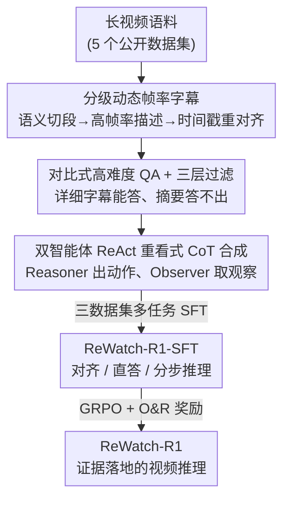

# ReWatch-R1: Boosting Complex Video Reasoning in Large Vision-Language Models through Agentic Data Synthesis

**会议**: ICLR 2026  
**OpenReview**: [https://openreview.net/forum?id=xindJJLSr1](https://openreview.net/forum?id=xindJJLSr1)  
**代码**: 项目页见论文（Project Page）  
**领域**: 多模态VLM / 视频理解 / LLM推理  
**关键词**: 视频推理, RLVR, 智能体数据合成, ReAct, 过程奖励

## 一句话总结
针对复杂视频推理缺乏高质量训练数据这一瓶颈，本文用一条多阶段「智能体数据合成」流水线造出 ReWatch 数据集（分级字幕 + 高难度 QA + 重看式 CoT），再用 SFT + 带「观察与推理（O&R）」奖励的 RLVR 把 Qwen2.5-VL-7B 训成 ReWatch-R1，在五个高难视频推理基准上拿下同尺寸 SOTA。

## 研究背景与动机
**领域现状**：把「SFT + 可验证奖励强化学习（RLVR）」这套范式用到图像推理上已经很成熟，社区也开始往视频推理迁移——典型做法是先用现成的简单视频 QA 数据集合成一批 CoT 去做 SFT 冷启动，再上 RLVR。

**现有痛点**：作者指出主流开源视频推理数据有三个硬伤：(1) 字幕是「整段、无时间戳」的笼统描述，把时序结构抹平了；(2) QA 太简单、偏感知，看几帧短片段甚至靠文本常识就能答；(3) 合成的 CoT「视觉不忠实」，靠常识和排除法蒙答案而不是真去看视频。结果 SFT 根本教不会「基于视频内容的推理」，后续 RL 又因为只有「最终答案对不对」这一个奖励信号，没法惩罚中间步骤里的幻觉。

**核心矛盾**：视频推理的根基是「reasoning grounded in video content」，但现有数据和奖励都只盯最终答案，模型学到的是「编一条看起来合理的推理链」而非「真的去视频里检索证据并核对」。数据瓶颈和奖励瓶颈是一对耦合的死结。

**本文目标**：拆成两件事——(a) 造一个时序密集、难度高、且推理链真正落在视频证据上的数据集；(b) 设计一个能同时奖励「过程忠实」和「结果正确」的 RL 奖励。

**切入角度**：作者观察到人类回答复杂视频问题时会「重看（re-watch）」——带着问题反复定位、检索、核对片段。于是用多智能体 ReAct 框架去显式模拟这个「检索 + 验证」过程，把人类的重看行为变成可合成的、带 `<action>/<observation>` 标签的推理轨迹。

**核心 idea**：用「智能体合成的高保真数据」补数据瓶颈，用「观察与推理双重奖励」补奖励瓶颈，让模型学会先在视频里取证、再据证推理。

## 方法详解

### 整体框架
方法分两大块。第一块是 **ReWatch 数据集构建**：一条三阶段流水线，从原始长视频出发，依次产出 ReWatch-Caption-10k（时间戳密集的分级字幕）、ReWatch-QA-170k（对比生成 + 三层过滤的高难度 QA）、ReWatch-CoT-135k（双智能体 ReAct 合成的重看式推理链）。第二块是 **两阶段后训练**：先用三个子数据集做多任务 SFT，让模型同时具备视频-文本对齐、直接作答（non-thinking）和分步推理（thinking）三种能力；再以 GRPO + 新设计的 O&R 奖励做 RLVR，把「会写推理链的形」升级为「会基于证据推理的神」，最终得到 ReWatch-R1。

整条流水线四个贡献节点串成：分级字幕给后续一切提供高保真的文本底座 → 高难度 QA 提供「短片段答不出来」的难题 → 多智能体 CoT 把答题过程拆成可核对的检索-观察轨迹 → O&R 奖励在 RL 阶段拿这些轨迹算「观察是否落在视频上、推理是否足以导出答案」。

### 关键设计

**1. 分级动态帧率字幕：把长视频拆成时序精确又不幻觉的文本底座**

直接让 LVLM 一口气描述一整段长视频，要么丢时序、要么编内容（幻觉）。作者用 Hierarchical Dynamic Frame-Rate Generation 解决：先用一个分段模型 $M_{seg}$ 在低帧率下把视频按语义切成 $k$ 段 $S=\{s_1,\dots,s_k\}=M_{seg}(V)$，只对超过 10 分钟的长视频做切分，且每段约 10 分钟、保证叙事完整（不像定长切分会割裂事件）；再用强力 LVLM $M_{cap}$ 对每段 $s_i$ 在高帧率下生成带相对时间戳的细粒度描述 $D^{rel}_i=\{(c_{ij},\tau_{ij})\}_{j=1}^{m_i}$；最后用 $t_{ij}=t^{start}_i+\tau_{ij}$ 把段内相对时间戳还原成全局绝对时间戳，合并成整段字幕 $C_{detail}(V)$。「低帧率粗切、高帧率细描、再对齐时间戳」这套分级流程，既拿到了密集时序，又避免了 LVLM 直接处理长视频时的幻觉，给后面所有阶段提供了可信文本代理。

**2. 对比式高难度 QA + 三层过滤：逼出「看短片段答不出来」的真难题**

简单 QA 是 SFT/RL 学不会推理的根源，所以这一阶段专门造难题并把「能走捷径的题」全过滤掉。对比生成是关键 trick：先用轻量 LLM 把详细字幕压成摘要 $C_{sum}=M_{sum}(C_{detail})$，再让生成器 $M_{qa}(C_{detail},C_{sum})$ 专门造「详细字幕能答、但光看摘要答不出」的题，天然指向细粒度细节而排除掉琐碎题。接着是三层级联过滤：F1 答案核验，验证器确认答案在 $C_{detail}$ 下事实正确；F2 文本偏置消除，用一组探针 LLM $M_{probe}$ 直接问，只有当 $\frac{1}{|M_{probe}|}\sum_M \mathbf{1}(M(Q)\approx A)<\theta_{text}$（即靠常识答不出）才通过；F3 摘要偏置消除，同理要求 $\frac{1}{|M_{probe}|}\sum_M \mathbf{1}(M(Q,C_{sum})\approx A)<\theta_{sum}$（即靠摘要也答不出）。通过三层的 85k 题再被改写成多选题，最终得到 170k QA。这套设计把「文本先验」「摘要捷径」两条偷懒路径都堵死，保证问题真正依赖视频。

**3. 双智能体 ReAct 重看式 CoT 合成：把人类「带问题反复定位核对」的过程变成可训练轨迹**

要让 CoT「视觉忠实」，就得让推理链显式记录「去哪取证、看到了什么」。作者设两个智能体：Reasoner $A_R$ 负责产出思考 $T$ 和动作 $Act$，Observer $A_O$ 负责在字幕上执行动作、返回观察 $Obs$。每一步 $(T_t,Act_t)=A_R(H_{t-1})$ 依据历史决定下一步，$Obs_t=A_O(Act_t,C_{detail})$ 取回信息，循环直到给出答案。两个核心动作正是对「重看」的模拟：`segment_retrieval(query)` 用自然语言查某事件的时间戳，`segment_query(timestamp)` 按时间戳取该事件的细节描述。关键工程取舍是：Observer 从 Stage 1 的高保真字幕（而非原始像素）取证——人工核查确认分级字幕已足够细粒度，可当作视觉内容的高保真代理，这让数据合成的效率和可扩展性远高于逐像素方法。最后结构化轨迹 $T=\{(T_1,Act_1,Obs_1),\dots,(A_{final})\}$ 由 $M_{convert}$ 转成带 `<action>/<observation>` 标签的自然语言 CoT，直接可用于 SFT 和 O&R 奖励计算。

**4. 观察与推理（O&R）奖励：同时奖励「观察落在视频上」和「推理足以导出答案」**

只用最终答案准确率 $r_{acc}=M_{judge}(A,A_{gt})$ 当奖励，会放任模型用幻觉蒙对答案。作者把视频问答建模成「Video+Question → Observations+Reasoning → Answer」的序列流，拆出两路过程奖励。观察奖励：先 $\{Act_i,Obs_i\}_{i=1}^N=\text{Parse}(R)$ 解析出动作与观察，再 $r_{obs}=\text{mean}(\{M_{judge}(C_{detail},\{Act_i,Obs_i\})\}_{i=1}^N)$ 拿每条观察和详细字幕比对，度量「观察是不是真有视频依据」。推理奖励：用一个 LLM $A_{ao}=M_{infer}(Q,\{Act_i,Obs_i\}_{i=1}^N)$ 只凭动作和观察去答题，$r_{rea}=M_{judge}(A_{ao},A_{gt})$——如果光靠这些观察就能答对，说明推理过程有效且充分。最终奖励为
$$r_{O\&R} = r_{acc}\times(1+r_{obs}+r_{rea})+r_{fmt}$$
其中 $r_{fmt}$ 是格式奖励（标签齐全为 1，否则 0）。乘性结构很讲究：只有答对（$r_{acc}=1$）时过程奖励才被放大，避免了「过程编得好看但答错」也拿高分；同时显式惩罚幻觉、强化证据链，比纯结果奖励更能逼出逻辑一致的推理。优化用 GRPO 完成。

### 损失函数 / 训练策略
SFT 阶段是多任务复合损失 $L_{SFT}=L_{Cap}+L_{QA}+L_{CoT}$：$L_{Cap}=-\mathbb{E}[\log\pi_\theta(C_{detail}|V)]$ 学视频-文本对齐；$L_{QA}=-\mathbb{E}[\log\pi_\theta(A|V,I_{direct},Q)]$ 学直接作答（non-thinking）；$L_{CoT}=-\mathbb{E}[\log\pi_\theta(R|V,I_{think},Q)]$ 学分步推理（thinking）。三任务并行优化，并用不同指令提示让模型在「直答 / 思考」两种模式间切换。RL 阶段在 ReWatch-QA 上用 GRPO + O&R 奖励微调该 SFT 策略。数据规模：10k 字幕 / 170k QA / 135k CoT。

## 实验关键数据

### 主实验
在 Qwen2.5-VL-7B 上训练，于五个视频推理基准上对比同尺寸 LVLM（192 帧设置，Thinking 模式）。

| 模型 | VCR-Bench | MINERVA | Video Holmes | VideoMathQA | CG-AV-Counting | 平均 |
|------|-----------|---------|--------------|-------------|----------------|------|
| Qwen2.5-VL-7B（base, 直答） | 36.75 | 33.19 | 38.87 | 24.76 | 19.96 | 30.71 |
| Video-R1 | 32.69 | 32.36 | 41.97 | 25.95 | 22.01 | 31.00 |
| GLM4.1V-9B | 34.53 | 33.75 | 38.98 | 27.38 | 21.32 | 31.19 |
| LongVideoReason-RL† | 35.30 | 35.01 | 43.49 | 23.57 | 20.55 | 31.58 |
| ReWatch-R1-SFT | 35.78 | 35.43 | 39.52 | 30.00 | 25.51 | 33.25 |
| ReWatch-R1 | 40.14 | 35.70 | 43.00 | 30.71 | 24.73 | 34.86 |
| **ReWatch-R1 + O&R** | **40.43** | **36.05** | **43.88** | **31.67** | **25.51** | **35.51** |

要点：(1) 仅 SFT 的 ReWatch-R1-SFT（33.25%）就超过同配置的 Video-R1-SFT（29.74%）和 LongVideoReason-SFT（26.31%），说明 CoT 数据质量本身就是分水岭；(2) RL 把 33.25% → 34.86%，O&R 奖励再加到 35.51%，逐级抬升；(3) 对未训练的 base 开 Thinking 反而掉点（27.54% vs 直答 30.71%），证明「会思考」必须先「学会怎么思考」。

### 消融实验
CoT 数据与 QA 数据质量的消融（综合「All / Reasoning / Understanding」准确率）：

| 配置 | All | Reasoning | Understanding | 说明 |
|------|-----|-----------|---------------|------|
| ReWatch-R1（完整） | 43.3 | 34.9 | 53.9 | 完整模型 |
| 用 Video-R1-CoT 做 SFT | 39.8 | 30.3 | 51.7 | 换低质 CoT，掉 3~4.6 点 |
| w/o SFT（直接 RL） | 38.9 | 30.1 | 50.0 | 去掉 SFT 冷启动 |
| w/o SFT & RL（base） | 35.5 | 26.4 | 46.9 | 原始 base |
| RL on 我们的 QA | 42.8 | 34.8 | 52.8 | 高难 QA 给的奖励信号更强 |
| RL on baseline QA | 42.0 | 34.3 | 51.7 | 简单 QA 信号弱 |

### 关键发现
- **SFT 是 RL 的必要前提**：去掉 SFT 直接 RL 出现灾难性掉点，RL 需要一个强初始策略，光靠 RL 起不来。
- **CoT 数据质量决定上限**：把自家 ReWatch-CoT 换成 Video-R1-CoT，Reasoning 从 34.9% 掉到 30.3%，验证多智能体框架产出的语料确实更适合复杂推理。
- **高难 QA 提供更强奖励信号**：QA 复杂度分析显示 ReWatch-QA 平均 3.31 个 `<action>`、响应更长（398.75 vs 205.74），且「纯文本（不看视频）正确率」仅 29.4%，而 Video-R1-QA 高达 68.9%——后者大量题靠文本就能答，几乎给不了有效的视频推理奖励。
- **O&R 的乘性结构**：过程奖励只在答对时放大，既奖励忠实观察又不奖励「编得好看却答错」的链。

## 亮点与洞察
- **用文本字幕当视觉代理来合成轨迹**：Observer 在高保真字幕（而非像素）上检索，让「重看式」CoT 合成的成本和可扩展性都大幅下降，这是把 ReAct 用到视频数据合成上的关键工程取舍——而且作者指出这些 Thought-Action-Observation 轨迹可为未来「直接 query 视觉编码器」的 thinking-with-video 模型打底。
- **对比生成 + 三层过滤是一套可迁移的「难题构造器」**：「详细能答、摘要答不出」加上「文本/摘要双偏置过滤」，本质是系统化剔除走捷径的题，这个思路可直接迁到任何需要造高难度、强依赖证据 QA 的模态。
- **过程奖励的「可恢复性」定义很巧**：用「只给观察能否答对（$r_{rea}$）」来定义推理是否充分，把抽象的「推理质量」转成可验证信号，比纯启发式打分更扎实。

## 局限与展望
- **合成全程基于文本字幕**：Observer 取证、O&R 算观察奖励都依赖 Stage 1 字幕的保真度，字幕一旦漏掉或编错事件，下游 QA/CoT/奖励会一路被污染；作者也承认当前是 text-based 模拟，尚未直接 query 视觉。
- **依赖多个外部大模型当裁判/探针**：$M_{seg}/M_{cap}/M_{qa}/M_{verify}/M_{probe}/M_{judge}/M_{infer}$ 串成长链，过滤阈值 $\theta_{text},\theta_{sum}$ 与裁判一致性都会影响数据质量，复现成本高、对裁判偏差敏感。
- **只在 7B（Qwen2.5-VL）上验证**：O&R 与数据在更大或异构骨干上的增益是否保持、对超长视频（>10 分钟切段策略）的鲁棒性，文中着墨有限。

## 相关工作与启发
- **vs Video-R1 / 用简单 QA 冷启动的方法**：它们直接拿现成简单视频 QA 合成 CoT 再 RL，受限于数据「无时序、偏感知、视觉不忠实」三大硬伤；本文从源头重造时序密集字幕、高难度 QA 和重看式 CoT，SFT-only 就已反超它们的 SFT/RL 版本。
- **vs 只用答案准确率的 RLVR**：传统 $r_{acc}$ 只看最终答案、纵容幻觉；O&R 用乘性结构把「观察忠实度 + 推理可恢复性」并入奖励，显式惩罚编造、强化证据链。
- **vs LongVideoReason 等长视频推理方法**：本文不是单纯堆长视频，而是用分级动态帧率字幕在「保时序」和「防幻觉」间取平衡，并把人类重看行为产品化成可合成轨迹。

## 评分
- 新颖性: ⭐⭐⭐⭐⭐ 把多智能体 ReAct「重看」用于视频 CoT 合成 + O&R 双过程奖励，两条创新都直击数据/奖励双瓶颈。
- 实验充分度: ⭐⭐⭐⭐ 五推理 + 四理解基准、192/384 帧双设置、CoT/QA/SFT 多维消融，但仅单一 7B 骨干。
- 写作质量: ⭐⭐⭐⭐ 流水线与公式交代清晰，图 2/3/4 把数据对比和框架讲得直观。
- 价值: ⭐⭐⭐⭐⭐ 数据集（10k/170k/135k）+ 奖励范式可直接复用，对推动视频推理有实打实的工程价值。

<!-- RELATED:START -->

## 相关论文

- [\[ICLR 2026\] Composition-Grounded Data Synthesis for Visual Reasoning](composition-grounded_data_synthesis_for_visual_reasoning.md)
- [\[CVPR 2026\] Boosting Reasoning in Large Multimodal Models via Activation Replay](../../CVPR2026/vlm_reasoning/boosting_reasoning_in_large_multimodal_models_via_activation_replay.md)
- [\[ICLR 2026\] Agentic Jigsaw Interaction Learning for Enhancing Visual Perception and Reasoning in Vision-Language Models](agentic_jigsaw_interaction_learning_for_enhancing_visual_perception_and_reasonin.md)
- [\[ICLR 2026\] VidGuard-R1: AI-Generated Video Detection and Explanation via Reasoning MLLMs and RL](vidguard-r1_ai-generated_video_detection_and_explanation_via_reasoning_mllms_and.md)
- [\[CVPR 2026\] VAST: Video Ability-Stratified Taxonomy for Data-Efficient Video Reasoning](../../CVPR2026/vlm_reasoning/vast_video_ability-stratified_taxonomy_for_data-efficient_video_reasoning.md)

<!-- RELATED:END -->
