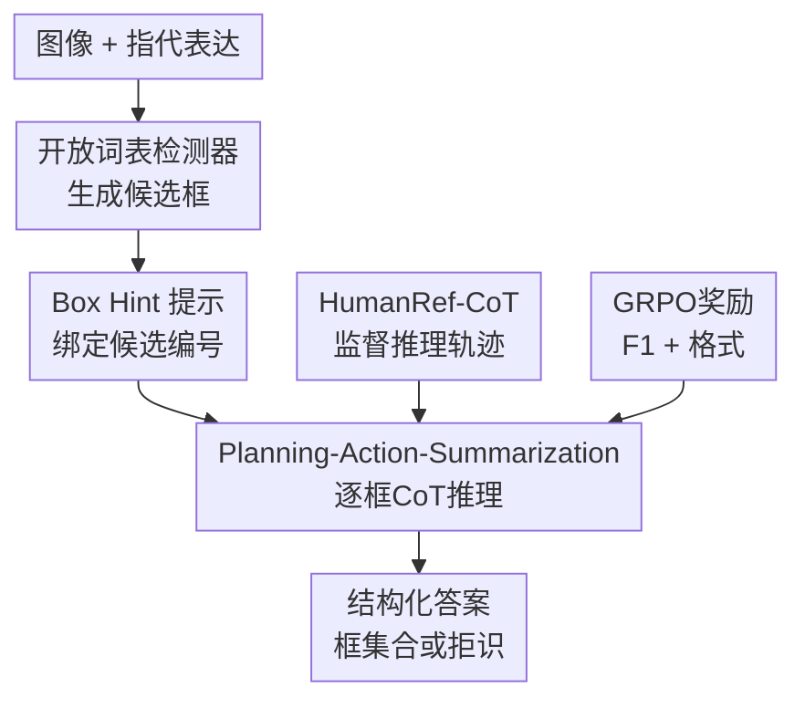

# Rex-Thinker: Grounded Object Referring via Chain-of-Thought Reasoning

**会议**: ICLR 2026  
**OpenReview**: [https://openreview.net/forum?id=btWHQoSZZ1](https://openreview.net/forum?id=btWHQoSZZ1)  
**代码**: https://github.com/IDEA-Research/Rex-Thinker  
**领域**: 多模态VLM / 视觉语言推理 / 指代表达理解  
**关键词**: 指代表达理解, 视觉定位, Chain-of-Thought, 候选框检索, GRPO  

## 一句话总结
Rex-Thinker把 grounded object referring 从“直接吐框”改写成“先由开放词表检测器给候选框，再由多模态大模型按 Planning-Action-Summarization 逐框推理并可拒识”的任务，在 HumanRef 上同时提升定位准确率、可解释性和无目标表达的拒绝能力。

## 研究背景与动机
**领域现状**：指代表达理解（Referring Expression Comprehension, REC）要求模型根据一句自然语言描述，在图像中找出所有匹配对象。近年的多模态大模型通常有两条路线：一类把边界框坐标当作文本 token 直接生成，另一类先给出候选框，再让模型选择匹配的候选区域。前者端到端但定位压力大，后者把定位和语义匹配拆开，已经在一些 referring benchmark 上取得不错效果。

**现有痛点**：这篇论文关心的不是“能不能框到一个差不多的目标”这么简单，而是模型是否 grounded。一个可靠的 object referring 系统至少要满足两点：第一，预测过程可检查，用户能看出模型为什么选这个框；第二，当图中根本没有满足描述的对象时，模型应该输出空，而不是硬 hallucinate 一个框。现有直接坐标预测或候选检索方法大多只给最终框，缺少显式推理链，也不擅长处理 rejection case。

**核心矛盾**：检测器擅长提出候选区域，但不擅长理解复杂语言关系，例如“两个成年人中间的人”“拿着字母 H 的人”；MLLM 擅长语言和视觉推理，却容易在精确定位上受限，直接生成坐标时会有像素级误差和漏检。REC 恰好需要两者都强：既要候选区域准，又要逐个候选地解释“为什么是/不是”。

**本文目标**：作者把目标拆成三个子问题：先让模型有一组可靠候选框；再让模型围绕候选框执行可追踪的分步推理；最后让训练目标同时奖励最终框正确和输出格式可信，尤其要能在无匹配对象时拒绝输出。

**切入角度**：作者观察到人类做 referring 时通常不会直接报坐标，而是先找候选类别，再按属性、位置、交互或常识条件逐个排除。例如“坐在乌龟上的人”会先找人和乌龟，再检查每个人是否真的坐在乌龟上。Rex-Thinker将这个自然过程显式编码为 Chain-of-Thought，并把每一步绑定到输入候选框提示上。

**核心 idea**：用“开放词表检测器给候选框 + MLLM 按候选框逐步推理 + SFT/GRPO 两阶段训练”替代隐式坐标预测，让 object referring 的答案既可定位、可验证，也能在无目标时拒绝。

## 方法详解

### 整体框架
Rex-Thinker采用两阶段系统：第一阶段用开放词表检测器根据指代表达中的目标类别提出候选框；第二阶段把图像、候选框提示、指代表达和系统提示一起输入 Qwen2.5-VL-7B，让模型在 `<think>` 中生成 Planning-Action-Summarization 推理链，并在 `<answer>` 中输出最终框集合。训练上，作者先用 HumanRef-CoT 做冷启动监督微调，让模型学会固定推理格式；再用 GRPO 后训练，用任务奖励鼓励更准确、更可泛化的候选选择。

这个框架的关键是“候选框不是最终答案，而是推理坐标系”。模型在推理时说的 Person 1、Person 2、Fish 3 都对应输入里的具体框，因此推理链可以回看图像区域；最终答案又从这些候选中选择，避免让 MLLM 独自承担精确坐标回归。

### 关键设计
**1. 候选框检索式 referring：把定位难题变成逐框验证**

Rex-Thinker不直接让 MLLM 从图像中生成任意坐标，而是先用开放词表检测器抽取与目标类别相关的候选框。例如表达是“person holding letter H”，检测器先给出所有 person 框；表达是“fish of manta ray”，则用目标类别得到 fish 相关候选。随后这些框以 box hint 的形式写进提示，模型需要在固定候选集合里判断哪些满足描述。

这个设计解决了两类模型各自的短板。单独检测器召回可以很高，但面对关系、属性、否定和常识推理时 precision 很差；单独 MLLM 理解力强，却容易生成不精确坐标。候选框检索把“在哪里”交给检测器，把“是不是”交给 MLLM，使最终选择既受视觉候选约束，又能利用语言推理。论文的消融也验证了这一点：无 box hint 的 fine-tuned Qwen2.5-VL 平均 Precision/Recall/DF1 为 74.1/69.4/69.6，而带 box hint 的 Rex-Thinker-Plain 达到 85.8/82.6/81.4。

**2. Planning-Action-Summarization：让每一步判断都能追溯到候选区域**

Rex-Thinker的 CoT 不是泛泛地“解释一下”，而是被固定成三个阶段。Planning 先把表达拆成若干子目标，例如先找穿黄色领带的人，再找其右侧所有人；Action 按候选框逐个检查当前子目标，把每个候选标成匹配、参考实体或不匹配；Summarization 最后重新核对中间结论，并把匹配候选转换成答案框。

这个结构的作用是把复杂 referring 中最容易出错的“跳步”显性化。对于多目标表达，普通模型可能只找到最显眼的一个对象；Rex-Thinker被训练成逐个候选过一遍，因此更不容易漏掉符合条件的多个目标。对于 rejection case，模型也会在总结阶段确认所有候选都不满足描述，从而输出空答案，而不是为了迎合问题硬选一个区域。

**3. HumanRef-CoT 数据引擎：用 GPT-4o 生成可监督的 grounded 推理轨迹**

为了训练这种结构化推理，作者基于 HumanRef 构建了 HumanRef-CoT，共 90,824 条样本。HumanRef 原本提供人类相关的指代表达、候选人框和答案，覆盖 attribute、position、interaction、reasoning、celebrity、rejection 六类子集。作者用 Set-of-Mark 策略给候选人加编号，再向 GPT-4o 提供图像、候选框、表达、正确答案和少量人工示例，让它生成 Planning-Action-Summarization 形式的推理链。

这里的关键不是简单让 GPT-4o 自己做 benchmark，而是把它当作带答案参考的标注器。生成后作者还做两阶段自动过滤：先检查 Action 阶段和 Summarization 阶段的匹配/不匹配符号是否一致，再检查最终答案是否完全等于 ground truth。过滤后又抽样 600 条人工评估，未发现错误总结或 Action-Summarization 矛盾，只剩 7/600 的局部事实错误。这说明数据主要提供的是“如何把正确答案解释成可执行推理链”的监督信号。

**4. SFT + GRPO：先学会结构，再用任务奖励释放推理策略**

训练分两步。第一步是 CoT SFT cold start：用 HumanRef-CoT 对完整输出做 token-level cross entropy，包括 `<think>` 推理链和 `<answer>` 最终框。这个阶段的目标是让模型学会候选框编号、逐步检查、总结核对和 JSON 风格框输出等基本格式。

第二步是 GRPO post-training。对同一图像和表达，模型采样 $G$ 个完整回答，每个回答都有推理链和最终框集合。奖励由准确率奖励和格式奖励组成：准确率使用候选框集合上的 F1，只有预测框与真值框完全重合（因为候选框已给出，等价于选对候选）才算匹配；格式奖励检查是否正确使用 `<think>...</think>` 和 `<answer>...</answer>`。总奖励写作 $r_i=\lambda r^{F1}_i+(1-\lambda)r^{fmt}_i$，其中 $\lambda=0.9$，说明作者更强调检测正确，同时保留对可解释格式的约束。

GRPO的意义在于，SFT会让模型模仿固定标注轨迹，但不一定找到最优推理路径；GRPO让模型在已有结构基础上探索不同推理写法，并用最终 F1 反馈强化更好的答案。消融显示，没有 CoT cold start 直接做 GRPO 的模型平均 DF1 只有 77.8，而先 CoT SFT 再 GRPO 可达 83.5，说明“先会说清楚，再用奖励变强”比直接奖励优化更稳定。

### 一个完整示例
以问题“请检测坐在乌龟上的人”为例，系统首先从图中检测出所有 person 候选框，同时图像中也可由视觉上下文看到乌龟区域。Rex-Thinker的 Planning 会把任务拆成两步：先找到乌龟，再检查每个人是否坐在乌龟上。

进入 Action 后，模型不直接说“答案是某个框”，而是逐个候选检查：Person 1 和 Person 2 坐在秋千上，不满足；Person 3 穿红衣红帽，位于绿色乌龟上，满足；Person 4 在船上钓鱼，不满足；Person 5 靠近蜂巢，不满足。Summarization 再把这些中间结论复核一次，只把 Person 3 标为最终目标，并在 `<answer>` 中输出 Person 3 对应的候选框坐标。

这个例子体现了论文想要的 verifiability：如果模型错了，用户至少能看出错在“乌龟识别”“候选人关系判断”还是“最终答案汇总”。这比只给一个框更容易调试，也更适合需要高可靠性的视觉交互场景。

### 损失函数 / 训练策略
SFT 阶段使用 token-level cross entropy，同时监督推理链和最终答案。训练设置上，基础模型是 Qwen2.5-VL-7B，训练时冻结视觉编码器和 MLP projector，只更新 LLM 参数；学习率为 $2\times10^{-5}$，weight decay 为 0.01，最大生成长度为 2048。

GRPO 阶段对每个输入采样 $G=8$ 个回答，使用组内奖励归一化得到优势：

$$
A_i=\frac{r_i-\mathrm{mean}(r_1,\ldots,r_G)}{\mathrm{std}(r_1,\ldots,r_G)}
$$

再用 PPO 风格 clipped objective 和 KL penalty 更新策略。论文设置学习率为 $1\times10^{-6}$，KL 系数 $\beta=0.04$，采样温度为 1.0。为了让模型不要只记住 SFT 中的候选顺序，GRPO 训练时会随机打乱 box hint 的顺序，迫使模型在新的候选编号配置下重新组织推理。

准确率奖励使用候选框层面的 F1：

$$
\mathrm{Precision}=\frac{|M|}{|\hat{B}|},\quad
\mathrm{Recall}=\frac{|M|}{|B^*|},\quad
r_{F1}=\frac{2\cdot \mathrm{Precision}\cdot \mathrm{Recall}}{\mathrm{Precision}+\mathrm{Recall}}
$$

其中 $M=\hat{B}\cap B^*$，由于答案应从候选框中选择，匹配要求预测框与真值框完全重合。这种奖励设计把“选对候选”作为核心目标，而不是鼓励模型自由生成近似坐标。

## 实验关键数据

### 主实验
作者主要评估两个场景：HumanRef in-domain 评测和 RefCOCOg out-of-domain 评测。HumanRef 使用 Recall、Precision、DensityF1，并对 rejection 子集单独报告模型正确输出空框的比例；RefCOCOg 使用 IoU 0.5 下的 accuracy。

| 数据集 / 设置 | 方法 | 核心指标 | 本文结果 | 对比基线 | 提升 / 结论 |
|--------|------|------|------|----------|------|
| HumanRef in-domain | Rex-Thinker-GRPO | 平均 R / P / DF1 | 86.6 / 86.8 / 83.5 | RexSeek-7B: 85.9 / 85.8 / 82.3 | 平均 DF1 +1.2，Precision 和 Recall 都更高 |
| HumanRef rejection | Rex-Thinker-GRPO | Rejection Score | 68.2 | RexSeek-7B: 54.1 | +14.1，显著减少无目标表达的 hallucination |
| HumanRef CoT收益 | Rex-Thinker-CoT vs Plain | 平均 R / P / DF1 | 85.2 / 85.9 / 82.3 | Plain: 82.6 / 85.8 / 81.4 | CoT 主要提升 Recall 和拒识能力 |
| RefCOCOg zero-shot | Rex-Thinker-GRPO | val / test accuracy | 83.2 / 83.3 | CoT SFT: 81.2 / 80.3 | GRPO 后训练带来跨类别泛化提升 |
| RefCOCOg fine-tuned | Rex-Thinker-GRPO* | val / test accuracy | 89.2 / 88.8 | ChatRex-7B: 89.8 / 90.0 | 接近强监督 SOTA，但仍略低 |

HumanRef 表里最值得看的是 rejection。Rex-Thinker-Plain 的 rejection score 为 53.5，加入 CoT SFT 后升到 67.3，再经 GRPO 到 68.2。这说明结构化推理不仅提升普通定位，也让模型更会“承认没有目标”。

在 out-of-domain RefCOCOg 上，Rex-Thinker只用 HumanRef-CoT 训练时 zero-shot 结果不如已经在 RefCOCOg 上训练过的 ChatRex 或 Qwen2.5-VL，但能维持结构化推理，并在未知类别上进行候选验证。进一步用 RefCOCOg 做 GRPO 后，val/test 到 89.2/88.8，说明该范式可以迁移到更一般对象类别。

### 消融实验
| 配置 | 关键指标 | 说明 |
|------|---------|------|
| 无 box hint 的 fine-tuned Qwen2.5-VL | 平均 P / R / DF1 = 74.1 / 69.4 / 69.6 | 只靠 MLLM 直接定位，Recall 和 DF1 明显受限 |
| Rex-Thinker-Plain（带 box hint，无 CoT监督） | 平均 P / R / DF1 = 85.8 / 82.6 / 81.4 | 候选框提示本身已经大幅提升 REC 准确率 |
| Rex-Thinker-CoT | 平均 P / R / DF1 = 85.9 / 85.2 / 82.3，Rejection 67.3 | CoT 主要提升 Recall 和拒识，说明逐框验证能减少漏检和 hallucination |
| Rex-Thinker-GRPO | 平均 P / R / DF1 = 86.8 / 86.6 / 83.5，Rejection 68.2 | GRPO 在 CoT 基础上继续提升任务级指标 |
| GRPO without CoT cold start | 平均 P / R / DF1 = 82.0 / 81.2 / 77.8，Rejection 66.4 | 没有 SFT 冷启动时，推理链更不稳定，最终性能明显下降 |
| DeepEyes-7B | 平均 R / DF1 = 36.0 / 38.7 | 通用 think-with-image 工具推理容易只检查少数显著区域，不适合多实例 referring |

### 关键发现
- CoT 的收益主要体现在 Recall 和 rejection，而不是只把 Precision 往上推。论文给出的细粒度分析显示，Reasoning 子集 Recall 相比 Plain 提升约 5.29，Attribute 子集提升约 4.48，符合“逐个候选系统检查能减少漏检”的直觉。
- 两阶段架构是必要的。开放词表检测器虽然召回高，但 Precision 很低；MLLM 虽能理解语言，但直接定位不稳定。Rex-Thinker把检测器作为候选生成器，把 MLLM 作为候选验证器，正好避开两边的主要短板。
- CoT 冷启动是 GRPO 的前提。直接用 GRPO 并不能自然学出清晰推理格式，论文中的失败示例显示模型可能生成不完整、不可验证的 reasoning trace；先 SFT 后 GRPO 则能在格式稳定的基础上优化准确率。
- 代价是推理速度。Rex-Thinker-Plain 平均每图 1.13s，而 Rex-Thinker-GRPO 因为输出长推理链，平均 6.68s，约慢 5.9 倍。这是可解释性和准确率换来的推理时开销。

## 亮点与洞察
- 把 CoT 真正接到视觉区域上，而不是只做语言解释。很多视觉 CoT 只是给最终答案配一段自然语言理由，Rex-Thinker通过 box hint 让 Person 1、Person 2 这种符号对应具体候选框，因此推理链可以被人工验证。
- Rejection 被当成一等公民。论文没有只追 RefCOCO 式“总有一个答案”的设置，而是强调无目标表达下应该输出空框，这对真实应用很重要，因为用户描述错、图像缺目标、检测器候选噪声都很常见。
- 数据构建思路比较实用。作者没有要求人工逐条写 CoT，而是利用已有 HumanRef 的真值答案约束 GPT-4o 生成推理，再用符号一致性和答案一致性过滤。这种“带答案的 LLM rationale distillation”可以迁移到其他 grounded reasoning 数据集。
- GRPO 奖励设计简洁但抓住核心。因为最终答案应从候选框中选，所以 F1 reward 可以直接在候选集合上计算，不需要复杂 IoU 近似奖励；格式奖励也让模型保留 `<think>` 和 `<answer>` 的可解析结构。
- 对多实例 referring 特别有启发。许多 grounding 方法默认表达只指一个对象，但真实语言经常指向一组对象。Rex-Thinker的逐候选检查天然适合“所有穿眼镜的人”“右侧所有人”“所有背景人物”这类集合输出。

## 局限与展望
- 推理开销明显增加。完整 CoT 输出让平均推理时间从 1.13s 增到 6.68s，若部署在实时交互、机器人或移动端场景，需要引入短推理、早停或只在困难样本触发 CoT 的机制。
- 仍可能出现 reasoning-answer 不一致。论文观察到模型有时在推理中说找到了 9 个对象，但最终答案只输出 8 个框。这说明当前 GRPO 奖励主要看最终框和格式，并没有显式检查“总结文本中的对象数”和 `<answer>` 框数是否一致。
- 交互关系仍是难点。Interaction 子集上 CoT 带来的提升不如属性和位置明显，甚至在细粒度分析中有轻微 Recall 下降。原因可能是多人拥挤、遮挡、候选框重叠时，单独评估一个候选框不足以判断“谁抱着谁”“谁和谁互动”。
- 候选生成质量仍是上限瓶颈。如果开放词表检测器漏掉目标，后续 MLLM 再会推理也无法选择不存在的候选。未来可以考虑多类别候选、关系候选、分割 mask hint，或者让模型在发现候选不全时请求补充检测。
- HumanRef-CoT 以人类目标为主，泛化到任意物体依赖后续 GRPO 或更多数据。RefCOCOg 实验说明范式可迁移，但 zero-shot 性能仍低于在目标数据集上监督训练过的强基线。

## 相关工作与启发
- **vs 直接坐标生成式 MLLM**: Shikra、Ferret、Qwen2.5-VL 等可以直接输出框坐标，流程简单，但最终答案缺少候选级解释，也容易受坐标生成误差影响。Rex-Thinker把最终预测约束在候选框上，牺牲一点端到端自由度，换来更稳定定位和更可追踪的推理。
- **vs 检索式 referring 方法**: Groma、ChatRex、RexSeek 等已经使用候选区域或检索式框选择，但通常只输出匹配框，不强制模型说明逐个候选为何匹配。Rex-Thinker的区别在于把候选检索和 CoT 绑定起来，尤其强调 rejection 和 verifiability。
- **vs LLaVA-CoT / LlamaV-o1 等通用视觉推理**: 通用视觉 CoT 关心复杂问答和推理过程，未必要求每一步落到候选框。Rex-Thinker更窄，但也更工程化：它把 CoT 限定在 REC 的候选检查流程里，因此奖励和评估都更清楚。
- **vs Think-with-image / 工具调用范式**: DeepEyes 这类模型可以 crop、zoom 等，但在多实例 referring 中容易只检查一个显著候选后提前结束。Rex-Thinker不依赖交互式工具，而是用固定候选列表强制全量审查，更适合要求高召回的集合定位。
- **启发**: 对其他 grounded tasks，可以考虑类似的“候选提示 + 结构化推理 + 集合级奖励”。例如视觉问答中的证据区域选择、医学图像中的病灶候选确认、机器人抓取中的目标筛选，都可以让模型先围绕候选区域逐步排除，再输出最终动作或框。

## 评分
- 新颖性: ⭐⭐⭐⭐☆ 把 CoT、候选框检索和 GRPO 组合到 REC 上并不完全是从零发明，但 Planning-Action-Summarization 与 box hint 的绑定很清晰，问题定义也抓住了可信 referring 的痛点。
- 实验充分度: ⭐⭐⭐⭐☆ HumanRef、RefCOCOg、拒识、box hint、cold start、DeepEyes 对比和速度分析都覆盖到了；如果能补更多非人物类别的大规模训练评测会更完整。
- 写作质量: ⭐⭐⭐⭐☆ 论文主线清楚，图例能直观看出方法优势；部分附录示例较长且格式噪声较多，但不影响核心理解。
- 价值: ⭐⭐⭐⭐⭐ 对需要可解释视觉定位和低 hallucination 的 VLM 系统很有参考价值，尤其适合多实例 referring、开放世界视觉问答和安全敏感的视觉交互场景。

<!-- RELATED:START -->

## 相关论文

- [\[CVPR 2026\] Chain-of-Thought Guided Multi-Modal Object Re-Identification](../../CVPR2026/vlm_reasoning/chain-of-thought_guided_multi-modal_object_re-identification.md)
- [\[CVPR 2026\] Grounded Chain-of-Thought for Multimodal Large Language Models](../../CVPR2026/vlm_reasoning/grounded_chain-of-thought_for_multimodal_large_language_models.md)
- [\[ICLR 2026\] ThinkMorph: Emergent Properties in Multimodal Interleaved Chain-of-Thought Reasoning](thinkmorph_emergent_properties_in_multimodal_interleaved_chain-of-thought_reason.md)
- [\[ICLR 2026\] CoPRS: Learning Positional Prior from Chain-of-Thought for Reasoning Segmentation](coprs_learning_positional_prior_from_chain-of-thought_for_reasoning_segmentation.md)
- [\[CVPR 2026\] Reinforcing Structured Chain-of-Thought for Video Understanding](../../CVPR2026/vlm_reasoning/reinforcing_structured_chain-of-thought_for_video_understanding.md)

<!-- RELATED:END -->
