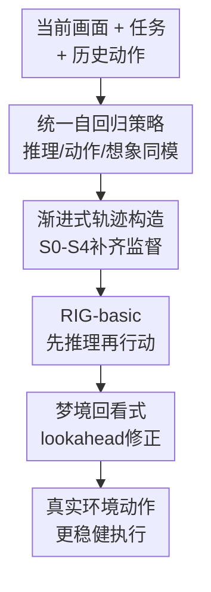

# RIG: Synergizing Reasoning and Imagination in End-to-End Generalist Policy

**会议**: ICLR 2026  
**OpenReview**: [https://openreview.net/forum?id=LQv9LU2Ufg](https://openreview.net/forum?id=LQv9LU2Ufg)  
**代码**: 未公开（论文称补充材料包含训练/推理代码与 checkpoint）  
**领域**: VLM推理 / 具身智能 / 通用策略  
**关键词**: 具身智能, 世界模型, 多模态推理, lookahead, Minecraft  

## 一句话总结
RIG 把文本推理、低层动作预测和未来画面生成放进同一个自回归 Transformer，并通过逐步构造的 Minecraft 轨迹数据让策略先“想一想、试着想象结果、再修正动作”，在少得多的环境交互数据下同时提升控制、生成和推理表现。

## 研究背景与动机
**领域现状**：开放世界具身智能通常有两条路线：一类是 VLM/LLM agent，先根据画面和任务做语言推理，再调用低层控制器执行动作；另一类是世界模型或视频预测模型，学习“当前状态 + 动作会导致什么未来画面”，再把这种想象用于规划。前者擅长解释目标、拆解任务，后者擅长对物理环境做前瞻模拟。

**现有痛点**：这两种能力在很多系统里是分离的。VLM-based agent 会说“应该砍树”，但未必知道自己离树干是否足够近；world model 能预测下一帧，却往往只把环境动力学当成像素序列来学，缺少显式的任务意图和行动理由。混合系统如把 VLM、视觉生成模型和低层控制器拼起来，虽然能同时拥有推理和想象，但模块之间难以端到端优化，错误也容易在接口处累积。

**核心矛盾**：具身任务里的动作不是孤立 token，而是由“当前观察、任务目标、为什么这么做、这么做以后会发生什么”共同决定。只学动作会缺少可解释的中间意图，只学未来图像又缺少任务约束；如果推理、动作和想象不能在同一模型里联合建模，策略很难真正利用三者之间的相关性。

**本文目标**：作者希望训练一个端到端的 generalist policy，使它在单个模型内同时输出 textual reasoning、keyboard/mouse 级低层动作和下一帧视觉想象，并进一步支持 test-time lookahead：先在内部 rollout 若干步“梦境轨迹”，再根据想象中的失败或风险修正真实动作。

**切入角度**：论文的观察是，Minecraft 这类开放世界任务里，人类行动往往会先形成理由，再预估结果，再决定是否执行。作者因此不把 reasoning 视作额外解释，也不把 imagination 视作单独的视频生成器，而是把它们都编码为自回归序列里的可预测 token，让同一个 Transformer 学到 reasoning、action 与 environment dynamics 的联合分布。

**核心 idea**：用一个统一的多模态自回归策略，把“推理 → 动作 → 想象 → 回看修正”串成同一条训练和推理链，替代过去多模型拼接的具身 agent 系统。

## 方法详解

### 整体框架
RIG 的输入是当前视觉观察、任务文本和历史交互，输出不是单一动作，而是一段结构化序列：先生成文本推理，再生成低层动作 token，最后生成下一帧或未来多帧的视觉 token。训练时，作者先从已有 Minecraft 人类/agent 轨迹出发，逐步补上 reasoning、review 和 temporal alignment 数据；推理时，RIG-basic 直接根据当前观察行动，RIG-lookahead 则会先用 `<Imagine:>` 标记生成内部梦境轨迹，再回看这些想象结果并修正动作。

从实现上看，RIG 建在 Janus-1.3B 这类统一理解/生成多模态模型之上，用 SigLIP-L/16-384 编码图像，用 VQ tokenizer 把视觉帧离散化成视觉 token，再把图像 token、文本 token、动作文本 token 混在同一个 4096 上下文窗口里建模。动作空间仍然是人类式的键盘鼠标控制，例如 `forward`、`attack`、`camera:[0,10]`，不是高层 API，因此模型学到的是较细粒度的 embodied policy。

### 关键设计
**1. 统一自回归策略：把推理、动作和想象变成同一条序列**

传统 generalist policy 多半只预测动作，世界模型则单独预测未来状态。RIG 的关键变化是让模型在同一个条件分布里生成三个对象：文本推理 $Y$、低层动作 $A$ 和视觉预测 $P$。论文把这个过程写成 $(Y,A,P)=F(X)$，其中 $X=\{x_{IMG},x_{TXT}\}$ 包含视觉与文本输入。这样一来，模型不是先由一个 VLM 解释画面、再交给另一个 controller，而是在下一 token 预测里同时学习“为什么要这么做、具体怎么做、这么做会看到什么”。

这种设计的好处在 Minecraft 任务里很直接：例如砍树时，合理动作不仅取决于树在画面里出现，还取决于距离、准星、地形坑洞和任务阶段。把 reasoning 放在 action 之前，相当于给动作预测加上显式语义中间态；把 image prediction 放在 action 之后，又迫使模型检查动作是否真的会改变环境。三者共享同一个 Transformer 后，reasoning 不再只是可读日志，imagination 也不只是独立视频生成，而是动作学习的监督信号和推理上下文。

**2. 渐进式轨迹构造：从“只有动作和画面”补成“画面-理由-动作-未来”**

论文面对的现实问题是，现成 Minecraft 数据通常没有完整的推理文本，也没有与动作、未来帧严格对齐的 review 轨迹。RIG 因此没有直接等待一个完美数据集，而是设计了 S0 到 S4 的数据流水线。S0 使用 MineRL-V0 的人类轨迹并把连续相机动作量化为 5 度间隔的离散文本 token；S1 用 STEVE-1 收集高分辨率 image-action pair，保证低层控制和画面对齐；S2 再让 GPT-4o 作为 Reasoner，根据画面和动作补写行动理由，形成 vision-reasoning 数据。

这一步的核心不是简单“给数据加 CoT”，而是把原本隐含在动作里的意图显式化。比如一个 `forward, sprint, camera:[0,10]` 动作，模型需要看到它对应的是“树在右前方、当前距离不够、需要调整视角并靠近”。经过 S0-S2 后训练出的 RIG-basic 已经能在真实交互中先解释再行动，但它的推理仍主要基于当前观察和历史，并没有真正把自己想象出的未来作为输入来回看。

**3. 梦境回看式 lookahead：保留失败轨迹，让模型学会先犯错再修正**

RIG-lookahead 的最有意思部分是 S3 的 vision-reviewing。作者让 RIG-basic 和 STEVE-1 在相同初始状态下并行 rollout，并用 state-wise advantage filter 只保留 STEVE-1 预期回报更高、RIG-basic 表现较差的状态。这样得到一组局部可比较的负轨迹 $X^-,Y^-,A^-$ 和正轨迹 $X^+,A^+$，再让 GPT-4o Reviewer 解释为什么原来的动作不对、应该怎样改，形成形如 $Y=\{Y^-,\text{“Wait! Let’s re-observe...”},Y^+\}$ 的纠错推理。

这个设计比普通 imitation learning 更贴近 lookahead 的使用场景：模型不是只看正确答案，而是看见自己可能怎么误判、想象中的结果为什么暴露了问题、修正动作如何避免失败。训练时，负轨迹主要作为上下文，不作为优化目标；正向修正推理和动作才进入 loss，类似把 rejection sampling fine-tuning 引入具身 agent。推理时，固定的 `<Imagine:>` token 把内部想象和真实观察分开，使模型可以生成若干步梦境轨迹，再基于这些梦境做 review。

**4. 时间对齐的视觉想象：让未来帧不只是好看的图片，而是能服务控制**

只有会生成下一帧并不足够，因为生成图像如果和真实交互结果偏离，lookahead 反而会误导策略。S4 因此做 temporal alignment：模型先自回归生成多步 imagined visual predictions $P$，同时把相同动作路径在真实环境里 rollout，得到真实下一帧 $x_{IMG}$，再把 $P_{i+1}$ 与 $x^{IMG}_{i+1}$ 对齐。这个阶段让模型学习“梦境流”和“真实流”之间的对应关系，降低多步想象的漂移。

论文的推理公式可以理解为：最终动作不只来自当前 $X_i$，还会条件化在若干步 imagined frames 和 reasoning 上，即 $(Y^*_{i+1},A^*_{i+1},P^*_{i+1}) \leftarrow F(X_i,P_{i+1},Y_{i+1},...,P_{i+n},Y_{i+n})$。这使 test-time scaling 变得自然：多给一点推理/想象步数，就能让 agent 更充分地检查当前动作的后果；但步数过多时也会出现误差累积，因此实验里 3 到 5 步呈现不同任务上的收益和方差变化。

### 一个完整示例
以论文里的砍树案例为例，当前画面中树干似乎在前方，任务是 chop a tree。一个没有可靠 lookahead 的强模型可能直接输出 `attack`，并想象树干出现裂纹；但真实情况是距离还不够，攻击会打空，接下来很容易卡在“我已经在砍树”的错误假设里。

RIG-lookahead 会先生成下一步行动和想象帧，然后用 “Wait! Let’s re-observe...” 触发回看。它发现想象帧里树干并没有变化，说明当前距离不足；同时右侧树更近、地形更平，适合先靠近再砍。于是最终动作从 `attack` 改成 `forward, sprint, camera:[0,10]` 这类移动与视角调整。这个例子体现了 RIG 的核心差异：想象不是为了生成漂亮画面，而是为了发现“这个动作在未来不会产生预期效果”。

### 损失函数 / 训练策略
训练目标很朴素，主要是统一 token 序列上的交叉熵：$L=-\sum_i \log P_\theta(x_i\mid x_{<i})$。所有模态，包括推理文本、动作文本和视觉离散 token，都被纳入同一个 next-token prediction 框架。这样做的优点是工程上简单，也能直接复用大语言模型的 SFT/RFT 训练范式。

训练分成两个层次。RIG-basic 使用 S0、S1、S2，学习从真实观察中生成 reasoning、action 和视觉预测；RIG-lookahead 在此基础上加入 S3、S4，利用失败轨迹回看和 temporal alignment 学会 dream-review。论文报告总共只收集 111 小时交互数据，其中包含 42 小时 MineRL-V0 和 69 小时 S1-S4 数据；相比 STEVE-1/VPT 系列接近 2000 小时的视频或交互数据，这个数据量很小。训练成本方面，RIG-basic 使用 64 张 A100 80GB 约 704 GPU 小时，lookahead 阶段额外约 280 GPU 小时。

## 实验关键数据

### 主实验
论文在 Minecraft/MineRL 环境中评估三类能力：具身控制任务、视觉生成质量、理解/推理能力。具身任务分为 Collect（Wood、Seeds/Grass、Dirt）和 Explore（Dig、Explore、Tower），并设置 Manual（徒手）与 Tool（铁工具）两种难度。主结果最重要的信息是：完整 RIG-lookahead 同时在收集数量、探索成功率和生成质量上最强，而且训练数据远少于许多基线。

| 对比项 | 训练/交互数据 | 视觉想象 | 文本推理 | Lookahead | 代表结果 |
|--------|---------------|----------|----------|-----------|----------|
| STEVE-1 | 约 2000h | 否 | 否 | 否 | 低层 Minecraft policy，推理和世界模型能力缺失 |
| MineDreamer | 约 2101h | 是 | 是 | 部分依赖系统拼接 | world model 与控制器分离，推理/生成不能端到端共训 |
| RIG-basic | 111h | 是 | 是 | 否 | Tool setting 达到 101.1 collected samples、93.4% 探索准确率 |
| RIG-lookahead | 111h | 是 | 是 | 是 | Tool setting 达到 246.6 collected samples、94.1% 探索准确率 |

| 能力维度 | RIG-basic / 相关变体 | RIG-lookahead | 结论 |
|----------|----------------------|---------------|------|
| 具身任务 collected samples（Tool） | 101.1 | 246.6 | lookahead 对收集效率提升非常明显 |
| 探索成功率（Tool） | 93.4% | 94.1% | 已接近高位，lookahead 继续带来小幅增益 |
| 生成 FID | 156.5（Action+Gen+Reason） | 77.6 | 回看式训练显著改善未来帧质量 |
| 生成 PSNR | 17.9 | 18.4 | temporal alignment 后视觉预测更贴近真实帧 |
| Reasoning Score-Env. | 7.3 | 8.5 | lookahead review 提升环境相关推理 |

### 消融实验
消融实验围绕四种能力组合：Action、Generation、Reasoning、Lookahead。结果显示，单独加入 generation 或 reasoning 都有帮助，但完整组合提升最大；尤其在 Tool setting 的收集任务中，从 action-only 到完整模型的平均 collected samples 从 33.4 增加到 246.6。

| 配置 | Manual collected avg. | Manual explore avg. | Tool collected avg. | Tool explore avg. | 说明 |
|------|-----------------------|---------------------|---------------------|-------------------|------|
| Action only | 7.7 | 8.4 | 33.4 | 12.6 | 只学动作，缺少显式推理和未来预测 |
| Action + Gen | 13.2 | 30.3 | 34.7 | 35.3 | 生成能力改善部分导航和目标对齐 |
| Action + Reason | 21.4 | 34.6 | 42.6 | 28.6 | 推理减少重复/无效动作，但无视觉前瞻 |
| Action + Gen + Reason | 35.6 | 44.1 | 101.1 | 93.4 | RIG-basic，推理与想象共同带来大幅提升 |
| Action + Gen + Reason + Lookahead | 80.2 | 79.6 | 246.6 | 94.1 | 完整 RIG-lookahead，收益最大 |

| 配置 | FID ↓ | PSNR ↑ | 静态理解 Score-Stc. ↑ | 环境理解 Score-Env. ↑ | 环境推理 Score-Env. ↑ |
|------|-------|--------|--------------------------|--------------------------|--------------------------|
| Action only | 214.5 | 16.4 | - | - | - |
| Action + Gen | 225.6 | 16.3 | - | - | - |
| Action + Reason | - | - | 9.0 | 7.8 | 6.1 |
| Action + Gen + Reason | 156.5 | 17.9 | 9.4 | 8.4 | 7.3 |
| Full + Lookahead | 77.6 | 18.4 | 9.6 | 8.1 | 8.5 |

### 关键发现
- 最核心的增益来自三者协同，而不是某一个模块单独变强。Action+Generation 有时甚至让 FID 变差，说明“会生成”本身不等于对控制有帮助；只有推理和 review 加进来后，生成质量和控制表现才一起提升。
- Lookahead 的收益具有 test-time scaling 特征。增加 dream trajectory 步数会改善表现，Tool 设置的探索准确率在 3 步附近达到 94.12%，Manual 任务则在更长 lookahead 下继续受益；但步数过多会引入视觉预测误差和方差上升。
- 数据效率是论文最强卖点之一。RIG 在 111 小时数据下达到强结果，而 VPT、STEVE-1、MineDreamer 相关体系通常依赖约 2000 小时量级数据，这支持了“显式推理 + 想象监督能提高样本效率”的主张。
- 通用 VQA 能力没有明显崩掉。RIG 在 VQAv2、GQA、MMMU、MM-Vet 上与 Janus-1.3B 大体持平或小幅提升，说明 embodied finetuning 没有严重破坏原模型的通用多模态理解。

## 亮点与洞察
- RIG 最巧妙的地方是把 world model 从“外接模块”变成 policy 的一部分。它不需要一个 VLM 规划、一个 VGM 想象、一个 controller 执行，而是在统一 token 流里学习三者的因果关系，这让端到端优化和推理时的自我修正都更自然。
- 论文没有把 reasoning 当成装饰性 CoT，而是把它用于动作学习和失败回看。尤其是 S3 中保留 RIG-basic 的失败轨迹，再让 Reviewer 写出“为什么错、怎么改”的过程，比只模仿成功轨迹更能教模型处理边界状态。
- `<Imagine:>` 这个固定分隔符看似简单，但对多轮推理很关键。它明确告诉模型：下面的画面/理由是内部模拟，不是真实环境观测，因此后续 review 可以比较“想象是否符合目标”，而不是把幻觉帧当成事实。
- 这篇论文对 VLA/机器人策略也有启发：未来端到端 policy 可能不应只输出动作，而应同时输出可检查的中间意图和预测结果。即使在真实机器人里不能生成高保真视频，也可以生成低维状态、接触结果或风险标签来承担类似的 imagination 角色。
- 另一个启发是数据管线比模型架构更关键。RIG 的主干是相对常规的统一多模态 Transformer，真正让它具备 lookahead 的，是 S0-S4 对轨迹语义、失败样本和时间对齐的逐步补齐。

## 局限与展望
- 实验环境仍局限在 Minecraft 模拟器。虽然 Minecraft 足够开放、动作粒度也接近人类输入，但与真实机器人控制相比，它没有真实传感噪声、动力学误差和安全约束，不能直接证明方法能迁移到物理世界。
- 视觉想象的可靠性仍是瓶颈。论文自己也观察到 lookahead 步数增加后方差会上升，说明多步 dream trajectory 会累积误差；如果模型把错误想象当作证据，review 机制也可能强化错误决策。
- 数据标注依赖 GPT-4o 作为 Reasoner/Reviewer，开放性和可复现性会受到外部闭源模型影响。附录中 Qwen3-VL-8B-Instruct 的对比也说明，较弱开源 VLM 会产生视角错误、物体幻觉和冗长无关推理，当前管线还不能轻松完全替换为开源标注器。
- 成本上，RIG 相比 STEVE-1 这类低层策略每步 FLOPs 更高。论文报告 reasoning+action+prediction 约 $6.38\times10^{12}$ FLOPs，虽然比 MineDreamer 这类混合世界模型低两个数量级，但对实时控制仍需要考虑延迟和部署优化。
- 后续可以探索更轻量的想象表示，例如预测可达性、碰撞风险、目标距离变化，而不是完整下一帧；也可以把 review 机制和安全约束结合，让模型在真实机器人中先否决高风险动作，再提交控制指令。

## 相关工作与启发
- **vs VPT / STEVE-1**: VPT 和 STEVE-1 主要学习从视频或文本到 Minecraft 行为的低层策略，动作执行能力强，但没有显式的文本推理和未来想象。RIG 保留低层 keyboard/mouse action 的粒度，同时加入 reasoning 与 visual prediction，因此在复杂场景中更容易解释和修正动作。
- **vs Voyager / Jarvis-1**: 这些 LLM-based agent 擅长高层规划、记忆或技能调用，但常依赖外部 low-level controller 或代码/API。RIG 更像一个端到端 VLA policy，直接从像素和任务文本到低层动作，不需要把高层规划和底层执行拆成多个系统。
- **vs MineDreamer**: MineDreamer 已经尝试用 imagination 支持 simulated-world control，但 world model 与 policy controller 是分开的。RIG 的区别在于把 reasoning、action、generation 放在一个 Transformer 内联合训练，使视觉想象能直接服务动作推理和 test-time review。
- **vs Dreamer / DreamerV3**: Dreamer 系列也使用世界模型做想象 rollout，但主要在 latent dynamics 和 reward/value 学习框架下工作，缺少显式自然语言推理。RIG 的 novelty 在于把语言推理纳入世界模型式控制，使 agent 可以用文本解释、比较和修正 imagined trajectory。
- **vs Janus / Show-o / Emu3 等统一理解生成模型**: 这些模型证明了图文理解和生成可以统一到自回归或混合框架中，但不直接面向 embodied action。RIG 借用统一多模态建模的能力，把 action token 和环境交互轨迹也纳入同一序列，展示了统一模型走向具身策略的一种路径。

## 评分
- 新颖性: ⭐⭐⭐⭐⭐ 首次系统地把显式 reasoning、视觉 imagination 和低层 generalist policy 端到端协同起来，lookahead review 的训练闭环很有辨识度。
- 实验充分度: ⭐⭐⭐⭐☆ Minecraft 任务、生成、理解、推理、消融和 scaling 都覆盖较全，但真实机器人或跨环境迁移还没有验证。
- 写作质量: ⭐⭐⭐⭐☆ 主线清楚，图表能支撑论点；不足是部分指标命名和表格说明略密，读者需要来回对照正文与附录。
- 价值: ⭐⭐⭐⭐⭐ 对 VLA、世界模型和 embodied reasoning 都有启发，尤其是“想象作为动作前自检信号”这个方向很值得继续发展。

<!-- RELATED:START -->

## 相关论文

- [\[ICLR 2026\] Synergizing Understanding and Generation with Interleaved Analyzing-Drafting Thinking](synergizing_understanding_and_generation_with_interleaved_analyzing-drafting_thi.md)
- [\[ICLR 2026\] Perception-Aware Policy Optimization for Multimodal Reasoning](perception-aware_policy_optimization_for_multimodal_reasoning.md)
- [\[ICLR 2026\] Unlocking the Essence of Beauty: Advanced Aesthetic Reasoning with Relative-Absolute Policy Optimization](unlocking_the_essence_of_beauty_advanced_aesthetic_reasoning_with_relative-absol.md)
- [\[ICML 2026\] Imagination Helps Visual Reasoning, But Not Yet in Latent Space](../../ICML2026/vlm_reasoning/imagination_helps_visual_reasoning_but_not_yet_in_latent_space.md)
- [\[CVPR 2026\] Think with 3D: Geometric Imagination Grounded Spatial Reasoning from Limited Views](../../CVPR2026/vlm_reasoning/think_with_3d_geometric_imagination_grounded_spatial_reasoning_from_limited_view.md)

<!-- RELATED:END -->
