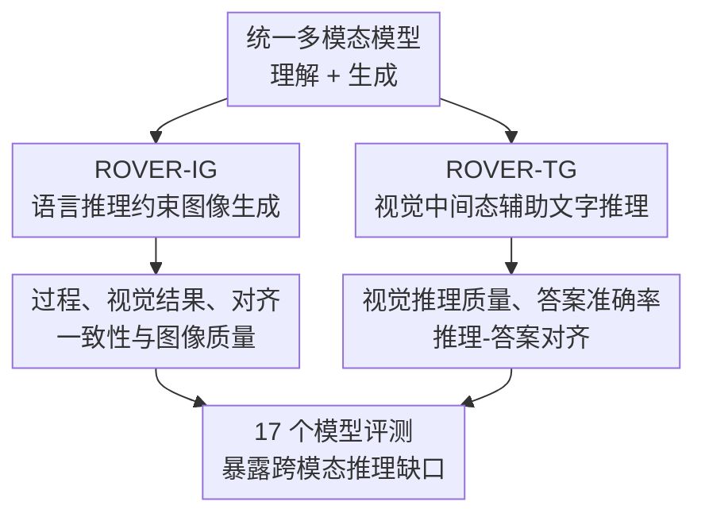

# ROVER: Benchmarking Reciprocal Cross-Modal Reasoning for Omnimodal Generation

**会议**: ICLR 2026  
**OpenReview**: [https://openreview.net/forum?id=gu3DRaDWiI](https://openreview.net/forum?id=gu3DRaDWiI)  
**论文**: https://roverbench.github.io  
**代码**: 未在缓存中确认  
**领域**: 多模态VLM / 跨模态推理评测 / 全模态生成  
**关键词**: 跨模态推理、统一多模态模型、图像生成评测、视觉中间推理、VLM-as-Judge  

## 一句话总结
ROVER 提出一个面向统一多模态模型的 reciprocal cross-modal reasoning benchmark，用 1,312 个任务和 1,876 张图像同时考察“语言推理能否约束图像生成”与“视觉中间结果能否帮助文字推理”，并发现当前模型在具象物理视觉推理上有收益、在抽象符号视觉化上仍明显失灵。

## 研究背景与动机
**领域现状**：统一多模态模型（Unified Multimodal Models, UMMs）正在把图像理解、文本理解、文本生成和图像生成放进同一个模型接口里。理想状态下，这类模型不只是“能看图、能说话、能画图”，而是可以在不同模态之间来回切换：用文字推理规划图像变化，用图像中间态帮助回答问题，再把两者对齐成一个可验证的推理过程。

**现有痛点**：已有评测大多把能力拆开看。VQA 或多模态理解 benchmark 主要看模型能不能从图像得到文字答案；图像生成和图像编辑 benchmark 主要看输出图片是否符合指令、是否保留原图结构。这样会漏掉一个关键问题：当任务本身需要“推理过程”和“生成结果”彼此支持时，模型到底是在跨模态推理，还是只是把一个单模态能力套在另一个任务外面。

**核心矛盾**：统一模型的卖点是理解与生成共享内部表征，但评测却常常只验证单向能力。文字指标看不到图像是否真的体现了推理链，图像指标也无法判断模型是否按正确的因果、空间、时间或数学逻辑生成了结果。尤其在全模态生成场景里，一个看似漂亮的图像可能推理完全错误，一个看似流畅的文字答案也可能没有真正利用生成的视觉中间结果。

**本文目标**：作者想把评测对象从“单模态输出质量”推进到“跨模态互相验证的推理质量”。具体说，ROVER 要回答两个问题：第一，给定图像和复杂文字约束，模型能否先做语言推理，再把推理落实到正确图像里；第二，面对需要解题的问题，模型能否生成有用的视觉中间表示，并让这些中间表示真正提高最终文字答案。

**切入角度**：论文把这种能力定义为 reciprocal cross-modal reasoning，即一种模态用于指导、验证或修正另一种模态的输出。这个角度比“理解”和“生成”更贴近 UMM 的核心承诺，因为它要求模型内部的文本链路与视觉链路不是并列共存，而是可以互相提供证据。

**核心 idea**：ROVER 用一套人工标注、可验证的双向任务体系，把“语言辅助图像生成”和“视觉辅助文字生成”放在同一 benchmark 下，并用过程、结果、对齐三类指标判断统一多模态模型是否真的具备跨模态推理能力。

## 方法详解

### 整体框架
ROVER 本质上不是一个新模型，而是一套面向全模态生成的评测基准。它把 reciprocal cross-modal reasoning 拆成两个互补方向：ROVER-IG 评测 verbally-augmented reasoning for visual generation，要求模型用语言推理链指导图像生成；ROVER-TG 评测 visually-augmented reasoning for verbal generation，要求模型生成视觉中间过程来辅助最终文字答案。

整个 benchmark 的设计逻辑是先定义任务分类，再构建带有参考信息和验证目标的实例，最后用自动 VLM judge 加专家校准的方式同时评价过程和输出。这样做的重点不是简单增加题量，而是让每道题都能追问“模型为什么这样生成/回答”以及“这个理由和最终产物是否一致”。

ROVER-IG 包含 908 个视觉生成任务，涉及 1,009 张图像。每个任务通常给定输入图像、文字指令、目标描述、领域关键词，有些任务还提供目标参考图像。它覆盖自然科学、文化艺术、常识、逻辑数学 4 个领域，并拆出时间、空间、因果、想象、数量、谜题、几何等 7 类推理子任务。

ROVER-TG 包含 404 个文字生成任务，面向需要视觉中间步骤的问题求解。它覆盖物理世界建模、逻辑与数学、视觉感知 3 个场景和 6 类子任务，例如机器人操作轨迹、物理状态变化、几何辅助线、拼图、多视角理解等。这里的“生成图像”不是装饰，而是被设计成推理过程的一部分。

### 关键设计
**1. 双向评测：把跨模态推理拆成互为镜像的两类任务**

ROVER 最重要的设计是把“文字指导图像”和“图像辅助文字”同时纳入评测。ROVER-IG 关注从语言推理到视觉生成的方向：模型需要理解输入图像和文字约束，例如“一个物体经过 3 秒会怎样”“从红色地图针位置生成真实景观”“按几何约束标注答案”，然后生成能体现推理结论的图像。这里模型不能只做风格化编辑，因为正确性来自时间、空间、因果、数量或几何关系。

ROVER-TG 反过来考察从视觉生成到文字答案的方向。模型在回答前要生成中间视觉表示，例如机器人手臂的轨迹、物理过程的中间帧、几何题的辅助图、拼图补全图或多视角合成图。这个设置很关键：如果生成的视觉中间态只是好看但不支持解题，最终答案不会变好；如果视觉中间态错误，它甚至会把文字推理带偏。

**2. 可验证实例设计：让每道题同时绑定输入、过程目标和输出目标**

普通图像生成评测常常只问“图片像不像提示词”，但 ROVER 需要评估的是推理是否成立。因此 ROVER-IG 的每个实例不只保留 prompt，还包含 target description、domain-specific keywords，以及可选 reference image。target description 告诉评测器正确结果应该出现哪些视觉变化，keywords 约束推理应使用哪些领域概念，例如氧化、扩散、透视、数量变化或几何关系。

ROVER-TG 的实例结构也强调“视觉中间态必须有用”。数据来自机器人、物理仿真、逻辑题、感知题等来源，样本包括上下文图像、渐进式推理步骤和已验证答案。附录还说明，逻辑任务收集了超过 1,000 个带 ground-truth visual CoT 的候选，并用 GPT-5 做 sanity check，筛出视觉 CoT 会显著影响预测的案例；物理和视觉感知任务则使用机器人视频、仿真 rollout 或拼图目标图作为视觉证据。

**3. 多维评测协议：分别看推理过程、结果质量和跨模态对齐**

ROVER 的评测没有把所有东西压成一个“是否正确”。ROVER-IG 使用 5 个维度：Reasoning Process（RP）评价文字推理的逻辑结构、领域知识和完整性；Reasoning Visual（RV）评价最终图像是否体现目标描述和正确推理原则；Reasoning Alignment（Align.）评价文字推理和图像结果是否一致；Visual Consistency（VC）检查非目标元素是否被不必要地改变；Image Quality（IQ）评价图像技术质量和视觉连贯性。

ROVER-TG 使用 3 个维度：Interleaved Reasoning Quality（IR）评价中间视觉表示是否物理/逻辑正确、是否对任务有帮助；Final Answer Accuracy（Acc.）评价最终答案是否匹配 ground truth；Reasoning-Answer Alignment（Align.）评价生成图像是否真正推动了正确答案。这组指标把“生成了图像”和“图像有助于推理”分开，能识别出视觉中间过程看起来合理但实际误导答案的情况。

这些分数由 GPT-4.1 作为 VLM judge 自动打分，并用 1 到 5 分归一到 0 到 100。作者还给 judge 提供 rubric cards、reference assets 和任务特定说明，并在 8 名专家、10 个 UMM、1,000 个实例上做一致性验证。附录报告显示，GPT-4.1 与专家在 ROVER-IG 的 RV、VC、IQ 等维度有较强相关性，在推理相关维度上误差更大但仍处可接受范围；ROVER-TG 的 IR 和 Align. 也显示出较高可靠性。

**4. 对照分析：区分内部跨模态推理和外部级联提示优化**

论文没有只停留在排行榜，还专门比较了统一模型、图像编辑模型、语言模型和级联系统。一个关键对照是 BAGEL / BAGEL-Think 与 FLUX / FLUX+GPT：外部 GPT-4o 可以改写提示词，让图像编辑任务在某些指标上变好，但在 ROVER 这种需要内部跨模态推理的任务上，级联提示优化无法替代统一模型内部的视觉-语言协同。

这个设计帮助论文排除一个常见解释：也许只要把文字推理写得更好，再喂给强图像模型就够了。ROVER 的结果显示并非如此。跨模态推理需要模型在生成过程中把语言约束、视觉输入和视觉输出放在同一个闭环里，而不是先由一个语言模型生成一段解释，再让另一个图像模型机械执行。

### 一个完整示例
以 ROVER-IG 的时间/因果任务为例，输入可能是一束新鲜郁金香，指令要求“展示一周疏于照料后的状态”。正确模型需要先在文字推理中说明水分减少、花茎失去支撑、叶片和花瓣变黄或下垂，再把这些变化落实到图像里：花朵不应只是换个滤镜，而应出现下垂、卷曲、颜色变暗等符合生物过程的视觉证据。

再看 ROVER-TG 的几何题。模型可能需要先生成带辅助线的几何图，再根据相似三角形或圆周角关系给出数值答案。如果视觉中间图没有画出关键高度或辅助线，文字答案就很容易变成凭空猜测。论文中的失败案例显示，当前模型在物理和感知任务里还能通过“直接画出变化”获得帮助，但在几何、谜题这类符号任务里，经常无法把抽象关系正确视觉化。

## 实验关键数据

### 主实验
论文评测了 17 个统一多模态模型和相关基线，包括闭源模型 Nano Banana、Gemini 2.0 Flash、GPT-5，开源统一模型 BAGEL-Think、BAGEL、UniCoT、BLIP3o-NEXT、Ovis-U1、OmniGen2 等，以及 Qwen-Image-Edit、FLUX.1 Kontext、UltraEdit、VAREdit、Step1X-Edit 等图像编辑模型。

ROVER-IG 的主结果表明，闭源统一模型在推理过程、对齐和视觉结果上明显领先。Nano Banana 的 Overall RP / Align. / RV 分别达到 67.0 / 82.3 / 73.2，Gemini 2.0 Flash 为 64.8 / 78.6 / 62.3，GPT-5 为 64.2 / 76.4 / 63.7。相比之下，BAGEL-Think 的 Overall RP / Align. / RV 为 54.3 / 64.4 / 52.7，普通 BAGEL 只报告 RV 40.5。

| 设置 | 代表模型 | Overall RP | Overall Align. | Overall RV / Acc. | 主要含义 |
|------|----------|------------|----------------|-------------------|----------|
| ROVER-IG 闭源统一模型 | Nano Banana | 67.0 | 82.3 | 73.2 RV | 推理链、图像结果和对齐都最强 |
| ROVER-IG 闭源统一模型 | GPT-5 | 64.2 | 76.4 | 63.7 RV | 文字推理强，但逻辑数学图像生成仍弱 |
| ROVER-IG 开源统一模型 | BAGEL-Think | 54.3 | 64.4 | 52.7 RV | think 机制有帮助，但与闭源模型差距明显 |
| ROVER-IG 开源统一模型 | BAGEL | - | - | 40.5 RV | 没有显式推理时视觉结果明显下降 |
| ROVER-TG 闭源统一模型 | Nano Banana | 38.8 IR | 60.0 Align. | 43.6 Acc. | 视觉中间推理质量最高但绝对值仍低 |
| ROVER-TG 闭源统一模型 | GPT-5 | 36.2 IR | 60.9 Align. | 43.4 Acc. | 视觉辅助带来很小提升 |
| ROVER-TG 开源统一模型 | BAGEL-Think | 21.4 IR | 38.6 Align. | 28.4 Acc. | 中间视觉表示质量限制最终答案 |

ROVER-TG 的结果更尖锐。即便最好的 Nano Banana，整体 IR 也只有 38.8，Acc. 为 43.6；GPT-5 的整体 IR 为 36.2，Acc. 为 43.4。与纯文字推理相比，视觉增强在世界模型和视觉感知上通常有小幅帮助，但在逻辑数学上提升很不稳定，有时几乎没有收益。

图像编辑模型在 ROVER-IG 上也明显落后于统一模型。以 Overall RV 为例，Nano Banana、GPT-5、Gemini 2.0 Flash 分别达到 79.6、74.9、72.1（表 4 的视觉质量汇总口径），而 Qwen-Image-Edit、FLUX.1 Kontext、UltraEdit、VAREdit、Step1X-Edit v1.1 分别为 47.1、40.9、34.6、37.5、42.1。这说明 ROVER 测到的不是普通编辑保真度，而是推理驱动的视觉生成能力。

### 消融实验
论文没有传统训练消融，因为 ROVER 是 benchmark；更接近消融的是对推理模式、模型类型和视觉中间物的控制分析。BAGEL 与 BAGEL-Think 的比较显示，显式思考机制能显著改善 ROVER 上的表现，其中视觉一致性提升约 11.9%。但 FLUX+GPT 这种外部级联在 EditWorld 上可以带来小幅 CLIP-T 改善，却会降低 ROVER 上的视觉一致性和图像质量，说明“先让语言模型优化提示词”不是跨模态推理的充分替代。

| 分析项 | 对照设置 | 观察结果 | 解释 |
|--------|----------|----------|------|
| 显式思考机制 | BAGEL vs BAGEL-Think | think 版本在 ROVER 上更强，VC 提升约 11.9% | 内部推理与生成耦合能改善推理依赖图像生成 |
| 外部级联推理 | FLUX vs FLUX+GPT | EditWorld 有小幅收益，ROVER 的 VC/IQ 反而下降 | 文字提示优化无法替代模型内部跨模态闭环 |
| 视觉中间物是否有用 | VLM w/o vs w/ UMM visual rationale | 世界模型 +3.5%，视觉感知 +3.8%，逻辑推理 -1.4% | 视觉中间物质量决定其是证据还是噪声 |
| 推理类型相关性 | 时间、空间、因果、数量、几何、谜题 | 物理类推理相关性强，抽象推理与物理推理相关弱 | 具象视觉变化和符号视觉化可能依赖不同能力 |

### 关键发现
- ROVER-IG 中，跨模态推理质量和最终图像质量高度相关。闭源模型的推理过程约比开源模型高 38%，对齐表现约高 31%，这些差距会传导到约 39% 的视觉生成表现差距。
- 支持交错图文生成的模型明显优于只能单轮或单模态输出的模型。论文报告开源模型中具备 interleaved generation 能力的模型在 RV 上比非交错模型高约 38.1%。
- ROVER-TG 暴露了“坏的视觉推理不如不用视觉推理”。当中间图像能表达物理状态或感知补全时，答案会变好；当任务需要把符号逻辑转成图形结构时，错误图像会误导最终答案。
- 模型在时间、空间、因果这类具象推理上相对更稳定，在抽象和数学推理上更弱。附录的相关性分析显示，物理类推理之间相关性高，而抽象推理与物理推理相关性较弱，说明后者不是简单扩大视觉生成能力就能自然获得。

## 亮点与洞察
- ROVER 的价值在于把“生成质量”拆成了可解释的跨模态链条。它不是只问图片好不好看，而是追问文字推理是否正确、图像是否体现推理、二者是否互相一致，这对评价统一模型比单一美学或 VQA 分数更有诊断力。
- 论文抓住了 UMM 评测里的一个盲点：理解和生成如果只是共存，模型未必具备 reciprocal reasoning。ROVER 用双向任务证明，真正困难的是让一种模态成为另一种模态的证据，而不是简单拼接两个强模块。
- ROVER-TG 的结论尤其值得注意：视觉中间过程不是天然有益。对物理世界和视觉感知，画图能提供额外证据；对几何、谜题、数学抽象，如果模型不会构造正确符号图，视觉 CoT 可能变成高置信度噪声。
- 对后续模型训练而言，这篇论文提示了一个明确方向：只提升图像美观度或文字 CoT 流畅度不够，训练数据和奖励信号需要显式约束“推理过程—视觉中间态—最终输出”之间的一致性。

## 局限与展望
- ROVER 依赖 GPT-4.1 作为自动 judge，虽然有专家一致性验证，但复杂推理维度仍可能受到 VLM judge 幻觉、偏好和 rubric 解释差异的影响。特别是 RP、IR 这类过程性指标，自动评测很难完全等价于人类专家审查。
- benchmark 规模为 1,312 个任务，质量和验证深度较高，但对训练或大规模统计分析而言仍不算大。不同文化、不同领域知识、长程多步交互、视频和音频模态还没有被充分覆盖。
- ROVER 主要围绕文本和图像两种模态讨论“omnimodal generation”，音频、视频、3D、动作控制等更广义模态尚未进入核心评测闭环。未来如果要真正评测全模态智能，需要把 reciprocal reasoning 扩展到更多输出形式。
- 当前评测更多揭示能力缺口，而不是直接给出训练方案。后续可以基于 ROVER 构建偏好数据、过程监督数据或强化学习奖励，让模型学习何时生成视觉中间物、如何验证中间物、何时放弃错误视觉假设。

## 相关工作与启发
- **vs ReasonPix2Pix / ReasonEdit / KRIS-Bench**: 这些工作主要面向 reasoning-guided image editing 或图像编辑质量评测，关注指令理解和编辑结果。ROVER 的区别是把中间推理过程、生成结果和二者对齐一起评估，并且不只看图像生成，还看视觉中间物能否反向帮助文字答案。
- **vs RISEBench / WorldGenBench**: 这些 benchmark 已经开始关注视觉合理性或世界知识驱动生成，但 ROVER 更强调 reciprocal cross-modal reasoning。它要求一种模态在另一个模态输出中发挥可验证作用，而不是只用相似度或视觉合理性评价结果。
- **vs Unified-Bench / MetaQuery**: 这类工作关注统一理解与生成能力是否共存或互相迁移。ROVER 更像诊断工具，专门检查理解、推理、生成之间是否形成闭环，因此能区分“接口统一”和“推理真正统一”。
- **启发**: 未来多模态模型评测应更多采用过程可审计的任务设计。一个有用 benchmark 不只是给出排行榜，还应该能回答模型失败在哪里：是不会推理、不会画、不会对齐，还是错误地相信了自己生成的中间图像。

## 评分
- 新颖性: ⭐⭐⭐⭐⭐ 首次把 reciprocal cross-modal reasoning 系统化成双向 benchmark，问题定义清楚且切中统一多模态模型的核心盲点。
- 实验充分度: ⭐⭐⭐⭐ 覆盖 17 个模型、23 类任务和多组对照分析，自动 judge 也做了专家校准；不足是任务规模和模态覆盖仍有限。
- 写作质量: ⭐⭐⭐⭐ 论文结构清晰，图例和表格能支撑主要结论；但附录评测 prompt 较长，部分结果口径需要读者在不同表之间来回对照。
- 价值: ⭐⭐⭐⭐⭐ 对 UMM、图文交错推理、视觉 CoT 和推理驱动生成都有直接参考价值，尤其适合作为后续训练和评测闭环的诊断基准。

<!-- RELATED:START -->

## 相关论文

- [\[ICLR 2026\] MMReD: A Cross-Modal Benchmark for Dense Context Reasoning](mmred_a_cross-modal_benchmark_for_dense_context_reasoning.md)
- [\[ICLR 2026\] Evaluating Cross-Modal Reasoning Ability and Problem Characteristics with Multimodal Item Response Theory](evaluating_cross-modal_reasoning_ability_and_problem_characteristics_with_multim.md)
- [\[ICLR 2026\] Synergizing Understanding and Generation with Interleaved Analyzing-Drafting Thinking](synergizing_understanding_and_generation_with_interleaved_analyzing-drafting_thi.md)
- [\[CVPR 2026\] CogniVerse: Revolutionizing Multi-Modal Retrieval-Augmented Generation with Cognitive Reflection and Geometric Reasoning](../../CVPR2026/vlm_reasoning/cogniverse_revolutionizing_multi-modal_retrieval-augmented_generation_with_cogni.md)
- [\[CVPR 2026\] CRIT: Graph-Based Automatic Data Synthesis to Enhance Cross-Modal Multi-Hop Reasoning](../../CVPR2026/vlm_reasoning/crit_graph-based_automatic_data_synthesis_to_enhance_cross-modal_multi-hop_reaso.md)

<!-- RELATED:END -->
