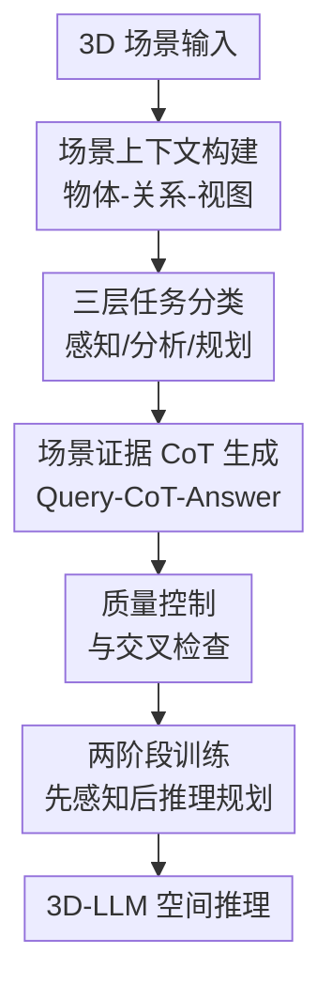

# SCoT: Teaching 3D-LLMs to Think Spatially with Million-scale CoT Annotations

**会议**: ICLR 2026  
**OpenReview**: [https://openreview.net/forum?id=5Tph6wFMOm](https://openreview.net/forum?id=5Tph6wFMOm)  
**代码**: https://github.com/WHU-USI3DV/SCoT  
**领域**: VLM推理 / 3D-LLM空间推理  
**关键词**: 3D-LLM, 空间推理, Chain-of-Thought, 场景理解, 具身规划  

## 一句话总结
SCoT 构建了一个 110 万规模的 3D 场景 Chain-of-Thought 数据集，把任务分成感知、分析、规划三个层级，并用场景证据标记 `<SI>` 约束推理链，让 3D-LLM 在复杂空间分析和规划上更可解释、更忠实，但也提醒简单感知任务不应滥用 CoT。

## 研究背景与动机
**领域现状**：3D-LLM 的目标是让语言模型理解三维环境，并能围绕真实场景回答问题、定位物体、解释布局乃至规划行动。过去的训练集大多把 3D 场景转成问答、描述或 grounding 样本，让模型学习“问题到答案”的映射；一些较新的 3D-VL 数据集已经扩展到多任务和更大规模，但监督信号仍主要停留在最终答案。

**现有痛点**：只给答案的训练方式会把模型变成一个难以检查的黑箱。尤其在机器人、具身智能、室内导航等场景里，用户不仅想知道“答案是什么”，还需要知道模型依据了哪些物体、空间关系和场景约束。如果模型靠语言先验猜出一个看似合理的回答，却没有真正引用 3D 证据，那么这种回答在真实环境中并不可靠。

**核心矛盾**：CoT 在文本和 2D 多模态任务中常常能增强推理透明度，但直接搬到 3D 场景并不安全。简单感知问题本来只需要看清颜色、数量、位置，强行要求模型长篇推理反而可能让语言先验覆盖视觉证据；复杂空间分析和规划又确实需要显式推理链，否则模型难以解释“为什么这个布局适合会议”或“从当前位置能否完成某个任务”。因此，关键不是“要不要 CoT”，而是“什么任务需要 CoT，以及 CoT 如何绑定到场景事实”。

**本文目标**：作者希望解决三个子问题：第一，建立一个能区分 3D 任务复杂度的任务体系；第二，为需要推理的任务构建大规模、场景 grounded 的 Query-CoT-Answer 数据；第三，验证这种监督是否真的提升 3D-LLM 的分析、规划、解释性和泛化能力，同时避免在简单感知任务上造成副作用。

**切入角度**：本文的观察很直接：3D 推理的可信度来自可核查的场景证据。于是作者不是只让模型“说出思考过程”，而是要求推理链在使用物体属性、相对位置、距离、布局等信息时显式插入 `<SI>` 标签，让每一步推理都有对应的场景来源。

**核心 idea**：用“任务层级 + 场景证据标记的 CoT”代替无差别问答监督，让 3D-LLM 在该直接看时直接答，在该推理时沿着可验证的 3D 证据一步步推。

## 方法详解
### 整体框架
SCoT 的整体流程可以看成一条从“3D 场景结构化”到“推理监督训练”的流水线。作者先把 ScanNet 场景拆成物体、关系、BEV 图和局部/全局视觉证据，再用这些场景上下文驱动 VLM 生成问题、推理链和答案；随后通过 `<SI>` 检查、多模型交叉检查和人工抽检过滤样本；最后用这些数据训练多个 3D-LLM，并额外提出 SCoT-Reasoner 作为支持点云、视频帧和文本输入的统一验证模型。

这篇论文的贡献不是单一网络层，而是把数据构建、推理标注和训练策略连成了一个一致系统。三层任务分类决定哪些样本写 CoT，`<SI>` 决定 CoT 是否必须引用场景事实，质量控制决定这些引用是否可信，训练阶段则把简单感知和复杂推理分开学习，避免“所有问题都想太多”。

### 关键设计
**1. 三层空间任务体系：把 CoT 用在真正需要推理的地方**

SCoT 把 3D 任务分成 Spatial Perception、Spatial Analysis 和 Spatial Planning 三层。Spatial Perception 回答“有什么”，包括物体属性、物体关系、场景属性和显式 visual grounding；这类任务多数只需要直接观察，所以主训练设置中使用 answer-only 监督。Spatial Analysis 回答“这意味着什么”，例如根据物体布局判断功能、根据坐标计算距离、根据隐式描述找到目标物体；这类任务需要把视觉事实、空间几何和常识结合起来，因此加入 CoT。Spatial Planning 回答“应该怎么做”，要求模型从场景约束中生成可执行步骤，例如判断当前位置能不能坐下、如何在房间中完成休息或清洁任务，也必须使用 CoT。

这个分类的价值在于它不是为了整理数据而整理数据，而是直接控制监督形式。论文中一个关键实验表明，在简单感知任务上加入 CoT 会让 SCoT-Reasoner 的多项指标下降，例如 ScanRefer Acc@0.50 从 53.4 降到 51.3，SQA3D EM 从 55.8 降到 47.4。也就是说，CoT 不是免费的解释性增强器；在 3D 场景中，错误的推理步骤会制造额外幻觉。三层体系正是用任务复杂度来决定“直接看”还是“先推理”。

**2. 场景上下文构建：把点云、关系和视图压成可被 VLM 使用的证据包**

为了让 VLM 生成的 CoT 不只是在语言上自圆其说，SCoT 先为每个 3D 场景构建丰富的 multi-modality scene context。具体来说，场景被分割成 object proposals，每个物体带有 bounding box、语义标签和中心坐标；这些物体再组成 scene graph，边表示邻近、支撑、相对方向等空间关系。同时，作者还生成带物体编号和框的 BEV map，并提供局部物体 crop 与全局场景图像，作为视觉证据补充。

这些信息会被序列化为结构化文本，例如“Object-3 是 chair，坐标为 $(0.2, 0.4, 0.5)$，位于 Object-1 desk 左侧 $0.8$m”。这种表达给了数据生成模型一个明确的信息边界：它可以引用颜色、尺寸、方向、距离、布局和功能线索，但这些线索需要来自给定场景，而不是来自对“厨房通常有什么”的泛化猜测。对于 3D-LLM 来说，这也把原本稀疏难读的点云转成了更适合语言推理的数据形态。

**3. `<SI>` 场景证据标记：把 CoT 从“看起来合理”变成“可以追溯”**

普通 CoT 最大的问题是它可能写出漂亮但不忠实的理由。SCoT 要求在推理链中只要使用了场景信息，就在对应句子前插入 `<SI>` 标记，例如“`<SI>` 桌子宽度为 $0.8$m，所以无法容纳六把椅子”。这种格式有两个作用：一方面，它在生成阶段强迫 VLM 明确哪些推理来自场景证据；另一方面，它在过滤阶段提供了可检查的锚点，缺少 `<SI>` 或 `<SI>` 使用错误的样本可以被剔除。

这个设计特别适合 3D 场景，因为很多结论都依赖空间证据的组合：隐式检测需要把“深色矩形、用于观看内容、放在圆形表面附近灯光源”映射到某个 monitor；关系分析可能需要计算欧氏距离；规划任务需要同时考虑当前位置、通道是否被占用、物体能否被使用。`<SI>` 不是简单的格式装饰，而是把“推理步骤”和“场景事实”绑在一起，使最终答案更容易被开发者和用户复核。

**4. 数据质量与训练分离：用严格过滤和两阶段学习避免推理监督反噬**

SCoT 的生成过程由 VLM 完成，但作者没有直接信任生成结果。除 `<SI>` 检查外，论文还使用 ChatGPT-4.1、Qwen 和 DeepSeek 三个独立 agent 做交叉检查，只要任一模型发现问题不清、CoT 误导、答案歧义或与场景事实冲突，样本就会被标记并移除。之后作者又在每个任务中随机抽取 50 个样本人工检查，总计 500 个样本中保留 447 个，人工验收率约 90%。

训练上，模型先学习感知样本，建立物体属性、关系和场景结构的基本 grounding；第二阶段再学习分析与规划样本，生成有场景证据支撑的显式推理链。这种两阶段训练和任务层级是一致的：基础感知先稳住，复杂推理再展开。否则模型可能在基础颜色、数量、定位都没学扎实时，就开始编长链条解释，反而让答案变得更不可靠。

### 一个完整示例
假设场景中有一张沙发、一个咖啡桌、一个灯和一段被家具占用的空地。普通 3D-QA 可能只问“咖啡桌在哪里”，答案是“在沙发前方”。SCoT 的分析样本会进一步问：“这个空间布局主要支持什么活动？”模型不能只答“休息”，而要在 CoT 中说明：`<SI>` 沙发和椅子围绕咖啡桌形成会话区域，`<SI>` 咖啡桌可用于放置饮料或临时物品，`<SI>` 房间里没有明显餐桌或办公桌，因此主要支持休闲交流而不是正式用餐或工作。

规划任务会再往前走一步。例如用户站在宽沙发附近，想先坐下休息，再在旁边支起折叠桌。SCoT 式 CoT 需要分别判断两个动作：`<SI>` 沙发本身提供足够支撑，所以坐下可行；但 `<SI>` 沙发旁边已有垃圾桶和木桌占用空间，所以摆放折叠桌受限。最后答案不是笼统说“可以”，而是给出分条件结论：坐下可行，摆折叠桌可能困难。

### 损失函数 / 训练策略
论文没有把核心贡献放在新损失函数上，而是采用监督微调的方式比较“Full SCoT Setting”和“Answer-Only Setting”。Full SCoT Setting 使用完整的答案和结构化 CoT 序列，其中分析与规划样本包含 `<SI>` 标记的推理链；Answer-Only Setting 去掉 CoT，只保留最终答案，用于消融推理监督的贡献。

SCoT-Reasoner 基于 Vicuna-7B v1.5，加入场景 token 和图像 token，并支持最多 200 个物体。3D object proposals 由 Mask3D 获得，物体级 3D 特征用 Uni3D 编码；视频帧中的 2D proposals 由 DEVA 提取，再用 DINOv2 编码。随后，Object-Relationship-Scene refinement module 通过空间图和 Graph Transformer 融合物体中心、三维 offset 和邻接关系，得到包含物体、关系、场景三类线索的表示，再投影到 LLM embedding space。

训练细节上，作者使用 LoRA 微调 attention projection 和 feed-forward 组件，rank 为 64，$\alpha=16$，dropout 为 0.05；优化器为 AdamW，学习率 $5 \times 10^{-3}$，weight decay 为 0.02，并在前 10% epoch 使用 warm-up。两阶段训练分别约需 6 小时和 28 小时，在单张 NVIDIA A100 上完成。

## 实验关键数据

### 主实验
论文的主实验围绕三个问题展开：简单感知是否应该使用 CoT，复杂分析/规划是否从 CoT 中获益，以及这种推理监督能否泛化到新问法和新场景。最直接的结论是：感知任务上 CoT 有害，分析和规划任务上 CoT 尤其提升解释性、忠实性与可信度。

| 任务 / 指标 | Answer-only | Full SCoT / CoT | 变化 | 说明 |
|--------|------|------|------|------|
| ScanRefer Acc@0.50 | 53.4 | 51.3 | -2.1 | 简单 grounding 强行推理会引入额外错误 |
| Multi3DRefer F1@0.50 | 55.7 | 49.3 | -6.4 | 多目标感知同样受到 CoT 干扰 |
| ScanQA CIDEr | 87.9 | 73.4 | -14.5 | 简单问答更适合直接监督 |
| SQA3D EM | 55.8 | 47.4 | -8.4 | 位置相关短答不需要长链条 |

| 模型 / 任务 | 指标 | Answer-only | CoT | 提升 |
|--------|------|------|------|------|
| SCoT-Reasoner / Object Analysis | Faithfulness | 5.59 | 6.15 | +0.56 |
| SCoT-Reasoner / Relationship Analysis | Trustworthiness | 4.23 | 5.41 | +1.18 |
| SCoT-Reasoner / Scene Analysis | ROUGE-L | 22.59 | 23.48 | +0.89 |
| SCoT-Reasoner / Situated Planning | Explainability | 6.64 | 7.38 | +0.74 |
| SCoT-Reasoner / Un-situated Planning | Faithfulness | 6.93 | 7.29 | +0.36 |

从全表看，传统文本相似度提升并不总是巨大，例如 SCoT-Reasoner 在分析任务上的 ROUGE-L 平均只提升约 0.74%，METEOR 平均提升约 0.36%。但综合指标更能体现 CoT 的作用：分析和规划任务中，CoT 平均带来 6.21% explainability、11.74% faithfulness 和 10.02% trustworthiness 提升。这说明 CoT 未必让答案文字更像参考答案，却能让答案更有条理、更贴近场景证据。

### 消融实验
论文还细看了 CoT 里的 `<SI>` 信息到底应该绑定到什么层级。作者把 `<SI>` 中的 object-level 信息和 scene-level 信息分别移除，观察分析与规划任务的变化；关系分析因 CoT 多为数值计算，未纳入这项比较。

| 任务配置 | ROUGE-L | METEOR | Explainability | Faithfulness | Trustworthiness | 推理时间 |
|------|---------|--------|----------------|--------------|-----------------|----------|
| Object Analysis / No CoT | 27.34 | 15.62 | 6.67 | 5.59 | 5.89 | 6.51s |
| Object Analysis / w.o. Obj. in CoT | 26.85 | 15.34 | 6.43 | 5.37 | 5.72 | 11.71s |
| Object Analysis / Full CoT | 27.22 | 16.17 | 7.04 | 6.15 | 6.41 | 15.98s |
| Scene Analysis / No CoT | 22.59 | 14.68 | 7.82 | 7.32 | 7.45 | 5.08s |
| Scene Analysis / w.o. Sce. in CoT | 22.50 | 14.37 | 7.67 | 7.40 | 7.37 | 10.26s |
| Scene Analysis / Full CoT | 23.48 | 15.29 | 7.95 | 7.55 | 7.68 | 13.30s |
| Situated Planning / No CoT | 24.21 | 12.37 | 6.64 | 6.09 | 6.30 | 6.42s |
| Situated Planning / Full CoT | 25.13 | 13.06 | 7.38 | 6.94 | 7.14 | 13.95s |

另一个很有说服力的结果来自 implicit detection：查询不直接说物体名，而是用功能、颜色、位置或上下文角色描述目标。SCoT-Reasoner 从 answer-only 到 CoT 后，Acc@0.25 从 8.6 提升到 32.2，Acc@0.50 从 7.7 提升到 28.4。这个任务本质上需要“读懂描述 → 找场景证据 → 推断物体身份”，正好是 SCoT 设计的核心应用场景。

### 关键发现
- CoT 对 3D 任务不是单调有益：在简单 perception 上，长推理会放大语言先验和幻觉；在 analysis 与 planning 上，显式推理链显著改善解释性、忠实性和可信度。
- `<SI>` 的层级很重要：object-level reasoning 对物体分析更关键，scene-level reasoning 对场景分析和规划更关键，说明模型需要按任务类型引用不同粒度的场景证据。
- 泛化结果说明 SCoT 不只是记住 ScanNet 模板：在 MSQA-ScanNet 上，SCoT-Reasoner zero-shot 总分 54.4，超过 GPT-4o 的 52.3；在 MSQA-ARKitScenes 上总分 41.2，也略高于 GPT-4o 的 41.0 和 Qwen-VL 的 39.7。
- 与 3D-R1 相比，SCoT 训练的 Chat Scene 在 MSQA-ScanNet 上总分 47.6，高于 3D-R1 训练的 43.1，尤其 Navigation 类别高出 14.6，说明更大规模、更细任务层级的数据确实带来更可迁移的空间推理监督。
- 成本也很现实：Full CoT 推理时间通常增加到约 2.0 倍到 3.2 倍，例如 scene analysis 从 5.08s 增至 13.30s，因此它更适合离线规划、复杂分析或高风险决策，不一定适合所有实时机器人环节。

## 亮点与洞察
- 这篇论文最重要的洞察是“少想一点有时更准确”。很多 CoT 论文天然把更长推理当作更强能力，但 SCoT 用 3D 感知实验说明，简单可见事实不需要解释链；对 3D-LLM 来说，学会何时停止推理和学会推理同样重要。
- `<SI>` 标记是一个很实用的数据工程设计。它不需要修改大模型内部结构，却把 CoT 的每个场景断言变成可检查对象，这对构建可信 3D 数据集、调试机器人失败案例、审计 hallucination 都有迁移价值。
- 三层任务体系把 3D-LLM 的能力拆得比较清楚：感知是 grounding，分析是解释，规划是行动。这个划分可以直接迁移到其他具身数据集，比如室外驾驶场景可以对应“看到什么交通参与者”“这意味着什么风险”“接下来该如何避让”。
- 论文把数据集、训练模型和评估指标放在同一个逻辑闭环里。它不仅发布 1.1M 样本，还训练多个 baseline，设计 SCoT-Reasoner，并用 explainability、faithfulness、trustworthiness 评估推理质量，比只报告文本相似度更贴近空间推理任务本身。
- SCoT-Reasoner 的 ORS refinement module 也有启发性：空间推理不能只把物体当成独立 token，还需要显式建模 object relationship 和 scene layout。即便不采用这套模型，类似的物体图、offset bias、关系增强表示也可以用于 3D VQA、导航和室内布局评估。

## 局限与展望
- 数据主要基于 ScanNet 室内场景，真实开放环境、动态场景、户外或城市级 3D 场景还没有被充分验证。若用于移动机器人或自动驾驶，场景复杂度和传感器噪声都会更高。
- 数据生成依赖 VLM 与 LLM 交叉检查，虽然有 `<SI>` 和人工抽检，但仍可能存在系统性偏差：生成模型熟悉的室内常识会影响问题和答案分布，某些罕见布局或反常功能可能被过度“常识化”。
- CoT 带来的推理延迟明显增加。论文报告多个任务的推理时间提升到 2 倍以上，这对实时交互机器人是硬约束，后续需要 task-adaptive reasoning：简单任务直接答，复杂任务才开启长推理。
- `<SI>` 标记提供了可追溯性，但还不是严格的形式化验证。一个句子前有 `<SI>` 并不等于这句话一定被正确地绑定到具体物体、坐标或视图证据；未来可以考虑把 `<SI>` 扩展为显式引用对象 ID、关系 ID 或坐标片段。
- 评估中的 explainability、faithfulness、trustworthiness 由 LLM 打分，虽然使用了 ChatGPT、Qwen、DeepSeek 多评审平均，但仍然带有模型偏好。更强的自动验证器或人类评估协议会让结论更稳。

## 相关工作与启发
- **vs 3D-LLM / Chat-3D / Chat Scene**: 这些方法把 3D 场景接入语言模型，重点是让模型能对物体、关系和场景进行对话；SCoT 则更关注训练监督本身，强调复杂 3D 任务需要显式、场景 grounded 的推理链。
- **vs ScanRefer / ScanQA / SQA3D / Scan2Cap**: 这些数据集提供 grounding、问答或 caption 的基础监督，适合训练和评估感知能力；SCoT 在它们之上进一步扩展到分析和规划，并且对复杂任务加入 Query-CoT-Answer 标注。
- **vs 3D-CoT**: 3D-CoT 已经引入 3D 视觉语言中的 reasoning annotation，但更偏 object QA；SCoT 覆盖感知、分析、规划多个层级，并强调何时不用 CoT，任务范围和方法论都更完整。
- **vs 3D-R1 / SpaceR / Spatial-MLLM**: 这些工作也试图增强空间推理或多模态推理能力，但通常受限于规模、任务多样性或推理透明度。SCoT 的优势在于 1.1M 规模、三层任务体系和 `<SI>` 场景证据约束，能更系统地训练可解释 3D reasoning。
- **对后续研究的启发**: 如果要构建下一代 embodied agent 数据，不能只收集“动作是否成功”的答案，还应该收集“为什么这个动作可行/不可行”的场景证据链。SCoT 提供了一个可复用模板：先定义任务复杂度，再决定是否标注 CoT，最后让每个推理步骤绑定可核查证据。

## 评分
- 新颖性: ⭐⭐⭐⭐⭐ 不是简单给 3D-QA 加 CoT，而是提出了任务层级、场景证据标记和大规模推理监督的组合框架。
- 实验充分度: ⭐⭐⭐⭐ 覆盖多个 baseline、多个任务层级、泛化和消融，但真实动态环境和人类评估仍可加强。
- 写作质量: ⭐⭐⭐⭐ 论文主线清楚，图表能支撑核心结论；部分附录细节较多，数据生成偏工程化，读者需要来回对照。
- 价值: ⭐⭐⭐⭐⭐ 对 3D-LLM、具身智能和可信空间推理都有直接价值，尤其是“复杂任务用 CoT、简单任务别滥用 CoT”的结论很值得后续系统采用。

<!-- RELATED:START -->

## 相关论文

- [\[CVPR 2026\] Hear you are: Teaching LLMs Spatial Reasoning with Vision and Spatial Sound](../../CVPR2026/vlm_reasoning/hear_you_are_teaching_llms_spatial_reasoning_with_vision_and_spatial_sound.md)
- [\[CVPR 2026\] Think with 3D: Geometric Imagination Grounded Spatial Reasoning from Limited Views](../../CVPR2026/vlm_reasoning/think_with_3d_geometric_imagination_grounded_spatial_reasoning_from_limited_view.md)
- [\[CVPR 2026\] See, Think, Act: Teaching Multimodal Agents to Effectively Interact with GUI by Identifying Toggles](../../CVPR2026/vlm_reasoning/see_think_act_teaching_multimodal_agents_to_effectively_interact_with_gui_by_ide.md)
- [\[ICLR 2026\] Zebra-CoT: A Dataset for Interleaved Vision-Language Reasoning](zebra-cot_a_dataset_for_interleaved_vision-language_reasoning.md)
- [\[ICLR 2026\] Thyme: Think Beyond Images](thyme_think_beyond_images.md)

<!-- RELATED:END -->
