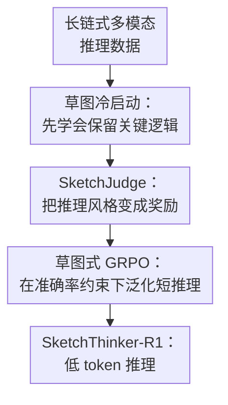

# SketchThinker-R1: Towards Efficient Sketch-Style Reasoning in Large Multimodal Models

**会议**: ICLR 2026  
**OpenReview**: [https://openreview.net/forum?id=ZSMDuKtYbt](https://openreview.net/forum?id=ZSMDuKtYbt)  
**代码**: https://github.com/Ruiyang-061X/SketchThinker-R1  
**领域**: VLM推理 / 高效推理 / 多模态大模型  
**关键词**: 草图式推理, 多模态推理, 强化学习, 推理效率, 奖励模型  

## 一句话总结
SketchThinker-R1 用“先把长推理压成草图式推理、再训练 SketchJudge 奖励模型、最后用 GRPO 强化学习”的三阶段流程，让多模态大模型在视觉问答和视觉逻辑/数学/物理推理中少写大量中间推理 token，同时保持甚至提升最终答案准确率。

## 研究背景与动机
**领域现状**：多模态大模型正在沿着 R1/o1 式路线发展：模型先生成较长的思考过程，再给出最终答案。对于数学图题、视觉逻辑题、物理常识题这类任务，长链式推理确实能让模型显式梳理图像线索、问题条件和求解步骤，因此不少 LMM 推理方法会鼓励模型“多想一点”。

**现有痛点**：长推理带来的收益并不是免费的。推理链越长，输出 token 成本和响应时间越高；更麻烦的是，冗长推理经常把无关线索也写进来，模型可能在后续步骤里被自己生成的枝节带偏。对于交互式多模态应用，用户并不总是需要完整的长篇解释，而是更需要模型抓住关键视觉证据并快速给出可靠答案。

**核心矛盾**：这篇论文瞄准的是“推理能力”和“推理开销”之间的矛盾。直接限制输出长度会让模型少想，但也容易把必要步骤一起砍掉；只做普通 R1-style 强化学习又会让模型形成越来越长的显式思考。作者认为更合适的目标不是单纯变短，而是学会一种类似人类草稿纸的 sketch-style reasoning：只保留能支撑答案的关键逻辑节点。

**本文目标**：作者希望训练一个多模态推理模型，使它在面对图像问题时能够自动生成短而集中的思考过程：保留关键视觉线索、关键计算或逻辑跳转，去掉冗余解释和重复确认，并在多领域 benchmark 上保持答案准确率。

**切入角度**：论文的切入点很直接：既然人类解题时常常只在草稿上写几行核心步骤，那么 LMM 也可以被训练成这种“草图式思考”模式。难点在于不能只靠 prompt 要求模型少写，因为 prompt-based 压缩会牺牲准确率；也不能只用长度惩罚，因为长度奖励容易诱导模型为了变短而忽略正确性。

**核心 idea**：SketchThinker-R1 用一个显式判断推理风格的 SketchJudge 奖励模型，把“草图式而非冗长”的推理风格作为 RL 奖励的一部分，从而让模型内化高信息密度的多模态推理方式。

## 方法详解

### 整体框架
SketchThinker-R1 是一个训练框架，而不是单个新解码算法。它从已有的长链式多模态推理数据出发，先构造草图式推理数据给基座 LMM 做冷启动；然后训练一个能判别“草图式/普通长推理”的 SketchJudge；最后把冷启动后的 LMM 放进 GRPO 强化学习，用准确率、格式和 SketchJudge 风格分数共同塑造模型输出。

整个流程的关键在于把“短”拆成了两个不同概念：一是冷启动阶段的数据压缩，让模型先见过高质量的短推理；二是 RL 阶段的风格奖励，让模型在新任务上继续倾向于写关键逻辑，而不是机械追求最短长度。

### 关键设计
**1. 草图冷启动：先把“少写”变成可学习的推理风格**

直接对一个基座多模态模型做 RL，让它自己探索草图式推理，论文发现学习很慢，最终 token 下降也有限。原因是模型一开始并不知道什么叫“只留下关键逻辑”：如果只给最终准确率奖励，长推理仍然是更容易探索到的策略；如果只给长度压力，又容易把必要线索一起删掉。因此作者先做 Sketch-Mode Cold Start，把 LLaVA-CoT-100K 和 Vision-R1-cold 里的长推理 $T_{Long}$ 转成草图式推理 $T_{Sketch}$。

转换过程由强 LLM 完成，规则不是简单摘要，而是要求保留解题所需的关键事实和逻辑顺序，去掉无关细节、冗长解释和具体展开，并把结果整理成编号列表。随后用这些样本对 Qwen2.5-VL-Instruct 这类基座 LMM 做监督微调，优化普通自回归 SFT 目标 $L_{SFT}=-\frac{1}{N}\sum_i\sum_t\log \pi_\theta(o_{i,t}\mid o_{i,<t},q_i)$。这一步的作用像给模型一个“推理书写格式”的初始坐标：它不是学会某个 benchmark 的答案，而是先学会在视觉问题里用更高密度的中间步骤表达推理。

**2. SketchJudge：把推理风格变成可训练的奖励信号**

只靠 SFT 冷启动会有分布外泛化问题：模型在冷启动数据上会写短，但到了新的数学、逻辑或物理图题上，不一定知道哪些步骤可以省、哪些不能省。为了解决这个问题，论文训练了 SketchJudge Reward Model。它输入一段 thinking process，输出 1 或 0：草图式推理记为 1，普通冗长推理记为 0。

这个奖励模型的训练数据来自同一批冷启动样本的两种版本：原始长推理 $T_{Long}$ 标为 0，转换后的 $T_{Sketch}$ 标为 1。这样做的好处是，RL 阶段不需要人工写复杂规则去衡量“是不是啰嗦”，而是把推理风格判断交给一个专门训练过的模型。论文还比较了“直接 prompt 一个现成 LLM 打分”和“对 LLM 做 SFT 后打分”，后者能给出更可靠的风格监督，最终的准确率和 token 效率都更好。

**3. 草图式 GRPO：用小权重风格奖励约束推理，而不是用长度硬砍**

最后阶段使用 GRPO 对冷启动后的 LMM 做强化学习。每个问题会采样一组候选回答，根据奖励计算组内优势 $A_i=\frac{r_i-mean(\{r_1,\cdots,r_G\})}{std(\{r_1,\cdots,r_G\})}$，再用带 clip 和 KL penalty 的 GRPO 目标更新策略。关键不是 GRPO 本身，而是奖励设计：

$$
R_i = 0.5R_{accuracy}(o_i)+0.4R_{format}(o_i)+0.1R_{thinking\text{-}style}(o_i)
$$

其中 $R_{thinking\text{-}style}$ 由 SketchJudge 判断 thinking 部分是否为 sketch-style，若是则为 1，否则为 0。这个权重设计很克制：风格奖励只有 0.1，准确率仍占最大比重。论文的消融说明，如果把 sketch reward 权重继续加大，token 会更短，但准确率会掉，出现模型为了拿风格分而忽略解题的 reward hacking。换句话说，SketchThinker-R1 不是训练模型“越短越好”，而是训练它在答案正确和格式合规的前提下，把推理写成关键步骤。

**4. 多源任务构造：让草图式推理跨领域迁移**

SketchColdStart-20K 从两个多模态推理数据源各采样 10K，RL 阶段的 SketchRL-1K 则从 MMStar、MathVista、LogicVista、SeePhys 各采样 250 个问题。这个设计让模型同时见到通用视觉理解、数学视觉推理、视觉逻辑和视觉物理问题，避免“短推理能力”只适配某一种题型。

消融结果也支持这个判断：只用 LLaVA-CoT-100K 或只用 Vision-R1-cold 构造冷启动数据，MMMU 上的准确率和 EoT 都低于两者混合。作者还做了 RL 数据规模扩展实验，从 1K 增到 5K 时，SketchThinker-R1-7B 的 MMMU 准确率从 62.8 提到 66.1，平均推理 token 从 64.3 降到 56.8，说明草图式推理不是靠单个小数据集偶然拟合出来的。

### 一个完整示例
可以把它想成一道带图的几何题。普通 Vanilla-R1 可能会先描述图像里每个点、每条线、可能的定理，再反复确认条件，最后才给出答案；其中很多文字只是把视觉信息复述了一遍。SketchThinker-R1 的目标输出更像草稿纸：

1. 识别图中关键形状和已知量。  
2. 选用与问题相关的公式或关系。  
3. 代入必要数值。  
4. 得到答案并匹配选项。  

这个例子里，模型并没有跳过推理，而是跳过了“解释自己为什么看到这条线”“反复复述每个选项”这类低信息密度内容。论文中的定性样例也显示，SketchThinker-R1 往往只围绕关键 cues 展开，因此比 Vanilla-R1 更短，同时人类和 LVLM 评价都认为它的推理 trace 更容易读。

### 损失函数 / 训练策略
冷启动和 SketchJudge 训练都使用 LLaMA-Factory。SketchThinker-R1-7B 的基座是 Qwen2.5-VL-7B-Instruct，3B 版本使用 Qwen2.5-VL-3B-Instruct；冷启动 LoRA rank 为 8，学习率 $1.0e^{-5}$，训练 10 个 epoch。SketchJudge 使用 Qwen2.5-7B-Instruct 做骨干，训练集由 20K 条长推理和 20K 条草图推理组成，共 40K 个带 0/1 标签的样本。

RL 阶段使用 Easy-R1 和 GRPO，默认最大 prompt 长度 2048，最大 response 长度 2048，KL 系数 0.01，AdamW 学习率 $1.0e^{-6}$，weight decay $1.0e^{-2}$。主实验中 rollout 采样次数为 5，温度为 1.0，训练 15 个 epoch，共 105 个训练 step。附录里还报告了动态奖励权重：训练前期更重视 sketch-style 奖励，后期逐渐提高准确率权重，在 MMMU 上能把 EoT 从固定权重的 0.977 提到 1.011。

## 实验关键数据

### 主实验
论文在 MMMU、MathVision、VisuLogic 和 PhyX 四个 benchmark 上评估准确率、平均推理 token 数和 EoT。EoT 定义为 $Acc/N_{token}$，用于衡量单位推理 token 带来的准确率收益。

| 模型 / 方法 | MMMU Acc. | MMMU #Token | MathVision Acc. | MathVision #Token | VisuLogic Acc. | PhyX Acc. | 结论 |
|-------------|-----------|-------------|-----------------|-------------------|----------------|-----------|------|
| Vanilla-R1-7B | 61.0 | 182.2 | 31.0 | 221.1 | 27.6 | 46.7 | 标准 R1 式训练，准确率尚可但推理很长 |
| Constrained CoT | 58.6 | 78.2 | 26.2 | 79.2 | 26.4 | 42.4 | prompt 限长显著省 token，但准确率掉得明显 |
| Chain-of-Draft | 58.9 | 86.3 | 27.4 | 85.4 | 26.5 | 42.2 | 每步变短，仍损失较多性能 |
| C3oT | 59.3 | 127.1 | 28.8 | 125.5 | 27.1 | 43.8 | SFT 短 CoT 泛化有限 |
| VeriThinker | 60.1 | 105.8 | 29.1 | 152.5 | 27.5 | 45.5 | 比 prompt 稳，但 token 仍偏多 |
| L1 | 59.5 | 136.8 | 29.5 | 146.7 | 27.2 | 45.1 | 长度奖励不等于高质量短推理 |
| ThinkPrune | 59.2 | 104.9 | 29.6 | 136.3 | 26.9 | 46.3 | 截断式奖励会损失部分推理信息 |
| SketchThinker-R1-7B | 62.8 | 64.3 | 31.7 | 65.5 | 27.8 | 48.6 | 准确率最高或接近最高，同时 token 最低 |

7B 主结果里，SketchThinker-R1 相比 Vanilla-R1 在四个 benchmark 上都大幅降低推理 token。以 MMMU 为例，平均 token 从 182.2 降到 64.3，准确率还从 61.0 提升到 62.8；在 MathVision 上 token 从 221.1 降到 65.5，准确率从 31.0 提到 31.7。论文总结为超过 64% 的 reasoning token cost reduction，且没有牺牲最终答案准确率。

| 模型 / 方法 | MMMU Acc. | MMMU #Token | MathVision Acc. | MathVision #Token | VisuLogic #Token | PhyX #Token | 结论 |
|-------------|-----------|-------------|-----------------|-------------------|------------------|-------------|------|
| Vanilla-R1-3B | 54.8 | 128.3 | 26.9 | 151.2 | 139.5 | 173.2 | 小模型本来就比 7B 更短，但仍有冗余 |
| Constrained CoT | 52.7 | 76.2 | 22.1 | 63.4 | 69.1 | 63.6 | 限长导致准确率下降 |
| C3oT | 54.1 | 107.5 | 24.1 | 105.1 | 104.3 | 93.2 | SFT 压缩不够彻底 |
| ThinkPrune | 53.2 | 95.2 | 23.8 | 92.3 | 73.3 | 82.2 | 有压缩，但准确率不稳 |
| SketchThinker-R1-3B | 55.9 | 54.5 | 25.3 | 72.7 | 36.9 | 67.3 | 3B 上同样显著减少 token，并保持较强准确率 |

3B 结果说明方法不是只对 7B 有效。由于 3B 模型原本推理链就更短，下降空间小一些，但 SketchThinker-R1-3B 仍把 MMMU token 从 128.3 降到 54.5，并把准确率从 54.8 提到 55.9；VisuLogic 的平均 token 更是从 139.5 降到 36.9。

### 消融实验
| 配置 | MMMU Acc. | #Token | EoT | 说明 |
|------|-----------|--------|-----|------|
| 只做 Sketch-Mode Cold Start | 61.4 | 114.5 | 0.536 | 能初步学短推理，但泛化不够 |
| 只做 Sketch-Thinking RL | 62.1 | 152.2 | 0.408 | 没有冷启动时探索效率低，token 降幅有限 |
| Cold Start + RL | 62.8 | 64.3 | 0.977 | 两阶段结合后准确率和效率最好 |
| SketchJudge 7B + SFT | 62.8 | 64.3 | 0.977 | 风格奖励最可靠 |
| SketchJudge 7B 不 SFT | 61.0 | 72.1 | 0.846 | 直接用现成模型判别风格，监督噪声更大 |
| Binary style reward | 62.8 | 64.3 | 0.977 | 0/1 风格奖励优于 dense 打分 |
| Dense style reward | 62.6 | 65.4 | 0.957 | 连续分数不如二值监督直接 |
| Dynamic reward weight | 63.2 | 62.5 | 1.011 | 前期重风格、后期重准确率，进一步提升 EoT |

### 关键发现
- Sketch-Mode Cold Start 和 Sketch-Thinking RL 是互补关系。前者给模型一个草图式推理的初始能力，后者让这种能力迁移到新的 benchmark；任一单独使用都会留下明显短板。
- 奖励里不能过度强调“像 sketch”。当 sketch-style reward 从 0.1 提到 0.4 时，token 继续变短，但准确率从 62.8 降到 60.8，说明太强的风格奖励会诱导模型为短而短。
- 冷启动数据的来源和生成质量会影响最终模型偏向。GPT-5 生成的 sketch 数据带来最高 EoT；开源 LLM 生成的数据更短，但准确率更低，说明“短推理数据”本身也有质量-效率取舍。
- 解释性分析是这篇论文比较有意思的补充。5 名人类评价者给 SketchThinker-R1 的平均解释性分数为 4.25，高于 Vanilla-R1 的 3.95；Qwen3-VL-Plus 大规模评价也得到 4.33 vs 4.12 的同向结论。

## 亮点与洞察
- **把推理压缩从长度问题改写成风格学习问题**。论文没有简单规定“最多写多少 token”，而是训练模型识别并偏好关键逻辑流。这比长度惩罚更贴近实际需求：简单题少写，难题仍可相对多写。
- **SketchJudge 是一个很实用的中间监督器**。很多高效推理工作只能靠最终答案或 token 数做奖励，信号太粗；这里额外引入推理风格奖励，让 RL 能区分“短但漏步骤”和“短且保留关键步骤”。
- **0.1 的小风格权重很关键**。这说明效率优化最好不要压过准确率目标。真正可用的短推理不是越短越好，而是把冗余 token 从正确推理中剥离出来。
- **草图式数据可能不只适合后训练**。附录讨论了把 condensed reasoning data 用到预训练阶段的可能性：短推理样本 token 更少、信息密度更高，理论上可以在同等算力下暴露更多不同推理模式。

## 局限与展望
- 论文主要在四个视觉推理 benchmark 上验证，覆盖了通用、多模态数学、逻辑和物理，但还没有充分说明在真实长上下文 GUI agent、视频推理、多轮交互任务中是否仍能保持同样收益。
- Sketch-style 数据依赖强 LLM 转换，主设置里使用 GPT-5。虽然论文做了不同 LLM 的消融，但这意味着方法质量部分取决于外部教师模型；如果教师压缩时漏掉关键步骤，学生模型可能学到错误的“省略”。
- SketchJudge 只做二分类风格判断，不能细粒度指出哪一步冗余、哪一步缺失。未来可以把 reward model 做成过程级反馈，比如按步骤标注“必要/可删/缺失”，给 RL 更细的监督。
- 论文没有深入分析失败样例。比如哪些题需要长推理、SketchThinker-R1 是否会在复杂组合推理中提前收束、是否存在看似简洁但实际跳步的答案，这些都值得进一步展开。
- 目前奖励仍需要解析模型输出里的 thinking process。对于不显式暴露思考过程或采用隐藏 reasoning 的模型，如何迁移 SketchJudge 监督还需要额外设计。

## 相关工作与启发
- **vs Vanilla-R1 / Vision-R1**: 这类方法强调用 RL 激发多模态长推理能力，往往默认“多想”有益；SketchThinker-R1 承认推理能力重要，但进一步要求模型把推理写得更像关键步骤草稿。
- **vs Constrained CoT / Chain-of-Draft**: prompt-based 方法在推理时直接要求模型少写，部署简单但容易牺牲准确率；本文通过训练让模型内化短推理风格，因此在相近甚至更少 token 下保留更高准确率。
- **vs C3oT / VeriThinker**: SFT 型短推理方法依赖静态短 CoT 数据，泛化容易受训练分布限制；SketchThinker-R1 额外用 RL 和 SketchJudge 在多领域数据上继续优化，让风格能力更可迁移。
- **vs L1 / ThinkPrune**: 长度奖励或截断奖励直接对 token 数施压，可能诱导模型漏掉推理；SketchThinker-R1 的 reward 明确包含 accuracy、format 和 thinking-style，强调“关键逻辑保留”而不是机械缩短。
- **启发**: 对多模态 agent、具身智能和交互式视觉助手来说，高效推理不一定要靠更小模型或更短上下文，也可以通过训练“推理表达方式”来节省延迟和成本。

## 评分
- 新颖性: ⭐⭐⭐⭐☆ 把 sketch-style reasoning 显式做成 LMM 的训练目标和奖励信号，思路清晰且区别于单纯限长。
- 实验充分度: ⭐⭐⭐⭐☆ 主实验、模型规模、阶段消融、奖励权重、数据规模和解释性评价都比较完整，但失败案例分析还可以更细。
- 写作质量: ⭐⭐⭐⭐☆ 论文结构直接，方法容易复现；部分实现细节和附录实验很丰富，但对 sketch-style 的边界定义仍略依赖经验描述。
- 价值: ⭐⭐⭐⭐⭐ 对需要低延迟、低 token 成本的多模态推理系统很有实际意义，也给“如何训练模型少想但不乱答”提供了可复用范式。

<!-- RELATED:START -->

## 相关论文

- [\[ICLR 2026\] ReVisual-R1: Advancing Multimodal Reasoning from Optimized Cold Start to Staged Reinforcement Learning](revisual-r1_advancing_multimodal_reasoning_from_optimized_cold_start_to_staged_r.md)
- [\[ICLR 2026\] Perception-R1: Advancing Multimodal Reasoning Capabilities of MLLMs via Visual Perception Reward](perception-r1_advancing_multimodal_reasoning_capabilities_of_mllms_via_visual_pe.md)
- [\[ICLR 2026\] ReWatch-R1: Boosting Complex Video Reasoning in Large Vision-Language Models through Agentic Data Synthesis](rewatch-r1_boosting_complex_video_reasoning_in_large_vision-language_models_thro.md)
- [\[ICLR 2026\] VisuRiddles: Fine-Grained Perception is a Primary Bottleneck for Multimodal Large Language Models in Abstract Visual Reasoning](visuriddles_fine-grained_perception_is_a_primary_bottleneck_for_multimodal_large.md)
- [\[ICLR 2026\] Efficient Multimodal Spatial Reasoning via Dynamic and Asymmetric Routing](efficient_multimodal_spatial_reasoning_via_dynamic_and_asymmetric_routing.md)

<!-- RELATED:END -->
