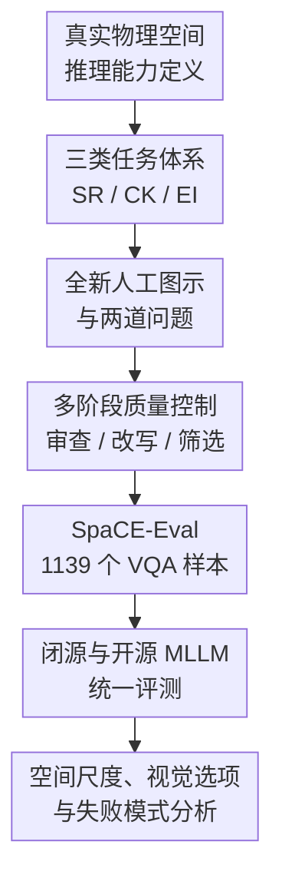

# SpaCE-Eval: A Benchmark for Real-World Multi-Modal Reasoning

**会议**: ICLR 2026  
**OpenReview**: [https://openreview.net/forum?id=VAEkLS9VBr](https://openreview.net/forum?id=VAEkLS9VBr)  
**代码**: https://github.com/xuyou-yang/SpaCE-Eval  
**领域**: 多模态推理 / VLM评测  
**关键词**: 真实世界推理, 空间推理, 多模态大模型, VQA基准, 环境交互  

## 一句话总结
SpaCE-Eval 构建了一个由人类全新绘制图示组成的真实物理空间多模态推理 VQA 基准，用空间推理、常识知识和环境交互三类任务系统检验 MLLM，结果显示当前最强模型在总体准确率和空间推理上都仍远低于人类。

## 研究背景与动机
**领域现状**：多模态大语言模型已经在一般 VQA、文档理解、图表问答、数学视觉推理等任务上取得很强表现，很多模型也开始被放进机器人、导航、具身智能和空间决策等应用场景里。对这些应用来说，模型不只是要识别画面里有什么，还要理解空间关系、物理约束、文化和材料常识，并能判断下一步怎么和环境交互。

**现有痛点**：已有评测往往把“视觉推理”压缩成较小尺度的问题，比如物体计数、左右上下、距离远近、网格或迷宫导航。这样的任务当然有价值，但和真实空间仍有明显距离：真实环境会从桌面物体扩展到房间、建筑、街区和城市；关系也不只是“左边/右边”，而可能涉及视角切换、平立剖关联、可见性分析、结构稳定性、交通移动、气候条件下的空间选择等。

**核心矛盾**：当前 MLLM 在许多 benchmark 上看起来“会推理”，但这种能力可能依赖语言线索、常见图像模式或数据中见过的题型；一旦题目要求模型在新绘制的图示中做抽象空间模拟，模型是否真的理解物理世界就变得不确定。评测缺口不在于缺少 VQA 数据，而在于缺少能把空间尺度、常识背景和环境行动放在一起考察的真实世界推理数据。

**本文目标**：作者希望回答三个具体问题：第一，MLLM 能否在复杂的真实世界空间中完成跨尺度空间推理；第二，模型是否能把材料、结构、建造、地域文化等常识和视觉上下文结合起来；第三，模型能否像空间使用者或决策者一样比较选项、预测 affordance，并为环境交互做决策。

**切入角度**：论文没有从互联网现成图片中抽样，而是让具备设计和建筑背景的人类贡献者为每个子类重新绘制信息图式图示，并配套写多选 VQA 问题。这个选择很关键：一方面降低了数据污染风险，另一方面把任务重心从自然图像识别转向“读懂抽象但真实可解释的空间表达”。

**核心 idea**：用全新人工绘制的多尺度空间图示和严格质量控制的 VQA 问题，构造一个专门测量 MLLM 真实世界多模态推理短板的 benchmark。

## 方法详解

### 整体框架
SpaCE-Eval 本身不是一个新模型，而是一个 benchmark 设计与评测流程。它先定义真实世界多模态推理需要覆盖的三类能力，再由设计背景贡献者绘制全新图示并编写问题，随后经过同伴反馈、外部审查、对抗式改写和作者筛选，最终形成 701 张图示与 1139 个单选 VQA 问题。评测阶段把同一套题给多个闭源和开源 MLLM，并从类别、空间尺度、选项模态和失败案例等维度分析模型短板。

这个流程的重点是把“测什么”和“怎么保证题目真的测到它”连起来。三类任务体系决定了 benchmark 的能力边界；全新图示和质量控制降低了泄漏与语言捷径；大规模模型评测则展示这个基准是否真的能暴露当前模型在真实物理世界推理上的弱点。

### 关键设计

**1. 三类任务体系：把真实世界推理拆成空间、常识和交互三条主线**

SpaCE-Eval 的第一个设计是能力划分。作者没有把所有题目都笼统称为“空间推理”，而是分成 Spatial Reasoning、Commonsense Knowledge 和 Environment Interaction 三个主类，每个主类再拆成四个子类。Spatial Reasoning 关注模型能不能读懂多尺度空间配置，包括视角/透视解释、平面图与立面/剖面关联、复杂场景中的可见性分析，以及在显式或隐式规则下的形态变换。这里考察的不是简单相对位置，而是人类在建筑、房间、街区中常做的空间想象。

Commonsense Knowledge 则考察空间相关背景知识，包括材料与结构、建造与制作、地方生活方式、文化语境。它补上了很多纯空间 benchmark 忽略的一点：真实世界里的图示往往不是纯几何，判断一个结构是否稳定、某个构造是否合理、某种居住方式对应什么文化背景，都需要把视觉信息和世界知识结合起来。Environment Interaction 进一步把问题推到行动层面，要求模型从使用者或决策者视角比较方案，例如在天气条件下选择空间、为了设计目标布置环境、为不同主体规划移动路径、理解可持续环境策略。三类合在一起，才更接近具身智能和现实空间应用中的多模态推理需求。

**2. 全新人工绘制图示：降低数据污染并逼迫模型阅读抽象空间表达**

第二个设计是数据来源。论文让 51 名具有设计或建筑相关背景的大学生贡献图示，这些贡献者来自不同国家、文化和设计传统。每张图都不是从公开网页抓取，而是围绕子类别从零绘制的 info-graphic。这样做的直接好处是减少 benchmark 被预训练数据记住的风险，因为模型很难在训练中见过完全相同的图示和题目。

更深一层的价值在于，这些图示不是普通照片，而是带有抽象表达的空间信息图。模型必须理解平面、视角、剖面、材料构造、路径、局部-整体关系等视觉符号，而不是只依靠自然图像中的纹理和物体类别。作者还要求贡献者遵循专业表达标准，同时保留个人绘图风格，因此数据既有较强可读性，又有视觉风格多样性。对 MLLM 来说，这种图示迫使它从“看见物体”转向“解释空间表达”。

**3. 多阶段质量控制：把歧义、语言捷径和不可答题目筛出去**

第三个关键设计是质量控制。原始数据包含 742 张图示和 1484 个问题，但最终只保留 701 张图示和 1139 个问题，中间经历了多轮筛选。数据创建阶段，贡献者每周和 meta-annotator 讨论部分图示-问题对，用具体例子校准 rubric；随后不同背景的志愿者审查所有样本，指出表达不清、逻辑错误或其他可答性问题；外部 reviewer 再从独立视角发现隐藏偏差或系统性问题。

最后几轮由 meta-annotator 和作者完成，重点是确认每个问题必须依赖视觉输入、答案唯一且清晰、题目和类别相关，并尽量去掉语言或位置捷径。论文提到有 50 个问题被对抗式改写，例如修掉某个选项因为长度、情绪色彩或措辞而看起来更像正确答案的问题；41 张图和 345 个问题被最终剔除。这个过程说明 SpaCE-Eval 并不是简单“画图+出题”的集合，而是试图让每道题真正测到视觉-空间-常识推理，而不是测语言猜题技巧。

**4. 诊断式评测维度：不仅给总分，还定位模型为什么失败**

SpaCE-Eval 的评测设计也不是只报一个平均准确率。论文按主类、子类、空间尺度、选项模态和是否提供图像来分析模型表现。空间尺度被分成 object、room space、building space、spatial structure、urban space、abstract geometry 等组别，用来观察模型是否随着空间尺度变大而退化；选项又分为文本选项和纯视觉选项，用来检查模型是否更依赖语言而非视觉理解。

这种诊断维度让 benchmark 的结论更可解释。比如模型在 Commonsense Knowledge 上相对高，在 Spatial Reasoning 上显著低，说明它们可能记住了很多知识，但不会稳定地做空间模拟；纯视觉选项表现低于文本选项，说明模型在视觉选项比较和抽象图形解释上仍弱；去掉图像后准确率明显下降，说明题目确实需要视觉输入，而不是纯文本常识题。换句话说，SpaCE-Eval 的价值不只在于“模型得分低”，还在于指出低分来自哪些能力断层。

### 一个完整示例
可以想象一道 Spatial Reasoning / Space Association 类型题：图中给出一个建筑平面或村落全局图，并标出观察点与朝向；四个选项是不同局部视角的图像。一个只会识别图中元素的模型可能会看到“门、窗、道路、树”后选择最像的选项，但真正答对需要先在全局图中定位观察点，再沿箭头方向进行视角模拟，判断哪些物体应当在左侧、右侧、前方或被遮挡，最后和四个视觉选项逐一比对。

这类题对应论文中提到的 global-to-local 与 local-to-global 失败模式。人类通常可以把平面位置、朝向和局部视野连起来，哪怕图示很抽象也能做 mental rotation 或 perspective taking；当前 MLLM 则容易停留在局部视觉相似度上。例如模型可能选择像素距离更近或图形元素更相似的选项，却忽略虚线、比例、路径和视角约束所表达的真实空间关系。

### 损失函数 / 训练策略
本文不提出模型训练方法，因此没有损失函数或训练策略。评测时，所有问题都是单答案四选一 VQA；部分题目提供四个文本选项，部分题目提供纯视觉选项且选项直接在图像中呈现。为降低位置偏置，A/B/C/D 四个位置的正确答案比例被随机打散到接近均匀，分别约为 25.46%、25.37%、25.46% 和 23.71%。

模型评测覆盖闭源和开源 MLLM。多数模型通过 OpenRouter API 调用；不支持 OpenRouter 的模型使用 VLLM 部署并采用默认推理超参。当模型输出不是精确的 A/B/C/D，而是与某个选项语义相同的自然语言回答时，作者使用 GPT-4o-mini 判断预测是否正确。这个自动判分环节提高了评测效率，但也引入了一个需要注意的变量：少量语义判别误差可能影响边界样本，不过总体趋势仍由大规模准确率差距支撑。

## 实验关键数据

### 主实验
SpaCE-Eval 的主结果非常直观：最强模型 GPT-5 总体只有 56.37%，空间推理均值只有 42.25%；人类平均总体为 79.00%，空间推理为 84.18%。这说明当前模型在常识类题目上已有一定积累，但在需要真实空间模拟和跨尺度推理时仍有巨大差距。

| 模型 | Overall Mean | Spatial Reasoning | Commonsense Knowledge | Environment Interaction |
|------|--------------|-------------------|------------------------|--------------------------|
| Human Avg. | 79.00 | 84.18 | 71.83 | 81.34 |
| GPT-5 | 56.37 | 42.25 | 66.08 | 61.63 |
| GPT-5-mini | 52.15 | 37.00 | 61.27 | 59.30 |
| claude-sonnet-4 | 48.64 | 31.75 | 59.24 | 56.10 |
| gemini-2.5-flash | 47.50 | 28.50 | 57.72 | 57.85 |
| Llama-4-Maverick | 45.92 | 27.75 | 55.19 | 56.40 |
| llava-onevision-7b | 42.41 | 31.00 | 49.62 | 47.38 |
| Qwen2.5-VL-72B | 37.84 | 25.75 | 45.57 | 43.02 |

一个值得注意的反差是，人类在 Spatial Reasoning 和 Environment Interaction 上强于 Commonsense Knowledge，而模型正好相反：模型在知识密集的 Commonsense Knowledge 上相对更接近人类，在 reasoning-intensive 的 Spatial Reasoning 上大幅落后。这支持了论文的核心判断：当前 MLLM 的短板不是“不会背常识”，而是不能稳定把视觉结构、空间尺度和行动后果推演起来。

| 对比维度 | 观察到的现象 | 论文给出的含义 |
|----------|--------------|----------------|
| 主类别差异 | 最佳模型 Commonsense Knowledge 达 66.08%，Spatial Reasoning 仅 42.25% | 模型知识召回强于空间推理 |
| 人类-模型差距 | 人类 Spatial Reasoning 为 84.18%，最佳模型为 42.25% | 真实空间推理仍远未接近人类 |
| 模型规模 | Gemma、Qwen 系列中大模型通常优于小模型 | 参数规模有帮助，但不能解决根本短板 |
| 文本 vs 视觉选项 | 纯视觉选项表现显著低于文本选项 | 模型更擅长语言化选项，不擅长视觉选项比较 |
| 空间尺度 | 从 object 到 room/building/urban/abstract geometry 表现下降 | 大尺度与抽象空间模拟是主要难点 |

### 消融实验
严格来说，SpaCE-Eval 是 benchmark 论文，没有模型模块消融；论文的“分析实验”更像数据与评测维度消融。最有信息量的是视觉输入/选项模态/空间尺度三组诊断，它们共同说明低分不是偶然，而是来自具体能力缺口。

| 分析设置 | 关键指标或趋势 | 说明 |
|----------|----------------|------|
| 有图像输入 | 各类模型在完整 VQA 设置下表现明显更好 | 说明题目确实依赖视觉信息 |
| 去掉图像输入 | 准确率显著下降 | 排除了大量题目只靠文本猜答案的可能 |
| 文本选项 | 模型整体准确率更高 | 语言选项更容易被 LLM 语义能力利用 |
| 纯视觉选项 | 各类别表现显著更低 | 暴露视觉比较、视角模拟和图示理解短板 |
| 小尺度空间 | object / spatial structure 相对更容易 | 更接近已有数据中的物体级或结构模式 |
| 大尺度与抽象空间 | room、building、urban、abstract geometry 明显更难 | 需要跨尺度、局部-整体转换和抽象关系推理 |

### 关键发现
- 最强闭源模型仍没有真正解决空间推理。GPT-5 总体第一，但 Spatial Reasoning 只有 42.25%，与人类 84.18% 的差距几乎是“半个 benchmark”。
- 模型对常识类题目更有优势。GPT-5 在 Commonsense Knowledge 达到 66.08%，甚至在 Cultural Context 子类超过人类平均，但这并不能转化为复杂空间模拟能力。
- 视觉理解明显落后于文本推理。纯视觉选项比文本选项难得多，说明模型往往把视觉内容转成粗粒度语言描述后再推理，而不擅长直接比较抽象图示。
- 空间尺度扩大后性能下降。模型在对象尺度相对较好，但在房间、建筑、城市和抽象几何中更容易失败，尤其在 global-local 视角关联题中准确率很低。
- 失败模式具有一致性。模型会偏向表层像素距离、视觉相似度或选项措辞，而忽略图中虚线、比例、视角、路径和结构约束表达的抽象空间关系。

## 亮点与洞察
- 数据设计的亮点在于“全新图示 + 真实空间任务”。很多 benchmark 说自己避免数据污染，但 SpaCE-Eval 通过人类从零绘制图示，把污染风险和网页图像记忆问题同时压低，也让任务更贴近建筑、城市和环境交互中的抽象表达。
- 三类任务划分很有启发。空间推理、常识知识和环境交互分别对应“看懂空间”“知道世界如何运作”“决定如何行动”，这比只测 VQA 准确率更适合评估未来具身智能或空间智能系统。
- 论文最有价值的发现是人类和模型的能力曲线不同。人类在推理密集任务上更强，模型在知识密集任务上更接近人类，这说明 MLLM 的能力瓶颈更可能在动态空间表征、抽象图示理解和 mental simulation，而不是知识库大小。
- 视觉选项设计可以迁移到其他 benchmark。很多多模态题目最终还是让模型读文本选项，SpaCE-Eval 的纯视觉选项迫使模型比较候选图示，这个思路可以用于 UI 操作、机器人导航、医学影像选择、遥感变化检测等任务。
- 质量控制流程值得复用。周会校准、外部审查、对抗式改写、作者最终筛选构成了一个相对完整的 benchmark 生产线，特别适合那些人工设计题目、容易出现歧义和捷径的评测场景。

## 局限与展望
- 数据规模仍然不大。1139 个问题足以做诊断评测，但如果要训练或细分到更多文化、地域、建筑类型、交通场景，规模还需要继续扩大。
- 数据来源有专业背景偏向。贡献者主要来自设计/建筑相关背景，这有助于图示质量，但也可能让题目更偏建筑表达体系；普通用户照片、真实传感器输入和动态视频环境没有被充分覆盖。
- 评测形式仍是四选一 VQA。真实环境交互往往需要连续规划、开放式语言解释、动作执行和反馈修正，单轮多选题只能测一部分能力。
- 自动判分依赖 GPT-4o-mini 处理非标准输出。虽然这是实际评测中常见做法，但在少量边界回答上可能引入判分模型偏差；未来可以提供更严格的输出约束或人工抽检协议。
- 图示是静态的，无法直接评估时间变化和真实物理交互。环境交互类别涉及预测和决策，但数据本身不是动态仿真，后续可以扩展到视频、3D 场景或可交互 simulator。
- 对模型失败原因的解释还可以更机制化。论文给出了典型失败案例，但没有深入到视觉 token、attention、链式推理轨迹或中间表征层面；未来可以结合可解释性分析定位模型到底在哪一步丢失空间关系。

## 相关工作与启发
- **vs SpatialVQA / SpatialRGPT / SpatialEval**: 这些工作主要关注物体相对位置、距离、高度、网格或迷宫等空间问题，SpaCE-Eval 则把空间范围扩展到房间、建筑、城市和抽象几何，并强调复杂空间表达与视角模拟。
- **vs PIQA / GRASP / VisualCOMET / CulturalVQA**: 这些 benchmark 分别覆盖物理常识、视觉常识或文化理解，但往往缺少空间 grounding；SpaCE-Eval 把常识放回具体空间图示中，要求模型把背景知识和可视化上下文结合起来。
- **vs CLEVRER**: CLEVRER 强调物体轨迹、碰撞和物理可行性，是偏受控合成环境的物理推理；SpaCE-Eval 更接近人类日常建筑和城市空间中的抽象图示推理，任务更偏真实空间表达而非物体动力学。
- **vs embodied-agent benchmarks**: ALFRED、TEACh、MineDojo 等更关注指令执行或开放环境交互，SpaCE-Eval 不训练 agent，也不要求执行动作，而是用可控 VQA 形式诊断模型是否具备进行环境交互前所需的空间理解和决策判断。
- **启发**: 如果未来要构建更可靠的空间智能评测，可以沿 SpaCE-Eval 的路线继续扩展：使用原创数据降低污染，用视觉选项减少语言捷径，用空间尺度和失败模式拆分能力，并把 benchmark 从“模型会不会答题”推进到“模型是否能形成可操作的世界模型”。

## 评分
- 新颖性: ⭐⭐⭐⭐☆ 论文没有提出新算法，但把真实世界空间、多模态常识和环境交互整合成原创图示 benchmark，问题定义很有辨识度。
- 实验充分度: ⭐⭐⭐⭐☆ 覆盖大量闭源和开源 MLLM，并做了类别、尺度、视觉选项和失败案例分析；不足是仍以静态四选一评测为主。
- 写作质量: ⭐⭐⭐⭐☆ 结构清晰，benchmark 构建、评测结果和失败模式都讲得明白；部分数据细节和自动判分误差讨论还可以更细。
- 价值: ⭐⭐⭐⭐⭐ 对评估 MLLM 是否真正具备真实物理世界推理能力很有价值，也为具身智能、导航和空间决策类模型提供了明确诊断工具。

<!-- RELATED:START -->

## 相关论文

- [\[ICLR 2026\] Reasoning in Space via Grounding in the World](reasoning_in_space_via_grounding_in_the_world.md)
- [\[ICLR 2026\] LLMs as Rules Oracles: Exploring Real-World Multimodal Reasoning in Tabletop Strategy Game Environments](llms_as_rules_oracles_exploring_real-world_multimodal_reasoning_in_tabletop_stra.md)
- [\[ICLR 2026\] MMR-Life: Piecing Together Real-life Scenes for Multimodal Multi-image Reasoning](mmr-life_piecing_together_real-life_scenes_for_multimodal_multi-image_reasoning.md)
- [\[ICLR 2026\] MMReD: A Cross-Modal Benchmark for Dense Context Reasoning](mmred_a_cross-modal_benchmark_for_dense_context_reasoning.md)
- [\[ICLR 2026\] Reasoning-Aligned Perception Decoupling for Scalable Multi-modal Reasoning](reasoning-aligned_perception_decoupling_for_scalable_multi-modal_reasoning.md)

<!-- RELATED:END -->
