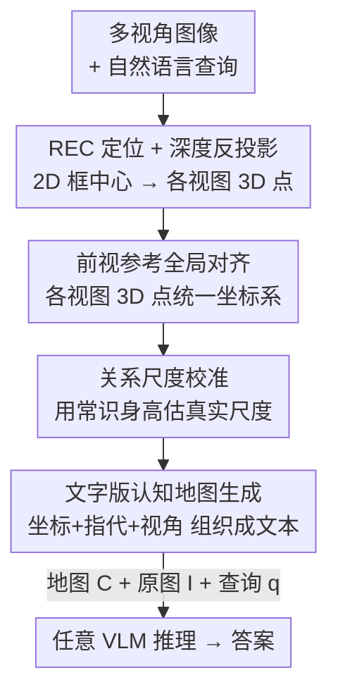

# Spatial Reasoning with Vision-Language Models in Ego-Centric Multi-View Scenes

**会议**: ICLR 2026  
**OpenReview**: [https://openreview.net/forum?id=fqehqG4WvL](https://openreview.net/forum?id=fqehqG4WvL)  
**代码**: 有（论文项目页 / 补充材料）  
**领域**: 多模态VLM / 空间推理 / 具身智能  
**关键词**: 自我中心多视角、3D空间推理、认知地图、训练无关、VLM benchmark

## 一句话总结
针对自动驾驶/机器人这类「多摄像头同时看前后左右」的自我中心多视角场景，本文建了第一个户外 3D 空间推理基准 Ego3D-Bench（8.6K QA），并提出一个**训练无关、即插即用**的框架 Ego3D-VLM：把被问到的物体在 3D 全局坐标里定位、生成一张紧凑的「文字版认知地图」喂给任意 VLM，让多选 QA 平均涨 12%、绝对距离 RMSE 平均降 56%。

## 研究背景与动机

**领域现状**：让 VLM 理解 3D 空间关系是具身智能的核心能力。现有空间推理基准基本两类——要么基于**单张图像**（SpatialVLM、SpatialRGPT 等），要么基于**室内静态视频**（VSI-Bench，一台相机在房间里移动拍出视频再问空间关系）。

**现有痛点**：真实的具身智能体（自动驾驶车、移动机器人）靠的是**自我中心多视角**观测——多个摄像头同时拍前/侧/后视图。这些视图不是可互换的纯视觉信息，它们带有绑定到智能体自身参考系的**方向语义**：「左」「右」是相对车身固定的方向，且随智能体移动在动态场景里要保持时序一致。现有室内视频基准既不具备这种结构化、有方向、随时间演化的多视角性质，也没有评测 VLM 跨这些空间锚定视角的推理能力。

**核心矛盾**：要补 3D 信息，之前的做法要么先重建**点云**、要么渲染**鸟瞰图（BEV）**。这两者信息确实丰富，但在动态场景里难重建、对稀疏多视角输入很脆弱，而且推理时间暴涨 10 倍以上——这与具身智能体对实时性的要求直接冲突。

**本文目标**：拆成两件事——(1) 造一个真正面向自我中心多视角户外场景的评测基准；(2) 设计一个既不用训练、又不引入点云/BEV 那种重表示的轻量方法来增强任意 VLM 的 3D 空间推理。

**切入角度**：作者假设 VLM 在多视角下的关键瓶颈是**无法把多张视图整合成一个连贯的世界模型**——而人类天然会把左/右/前视图融成统一空间表示，从而实时推理与导航。

**核心 idea**：用一张**只聚焦被问到物体**的「文字版认知地图」（textual cognitive map）替代点云/BEV——把每个被指代物体的 3D 全局坐标和它来自哪个视角写成紧凑文本，token 量极小，可拼在 prompt 里喂给任何现成 VLM。

## 方法详解

### 整体框架
Ego3D-VLM 是一个训练无关的推理期框架：输入是一组多视角图像 $I=\{I^{(v)}\}_v$ 加一句自然语言查询 $q$，输出是 VLM 给出的答案 $a$。它不改 VLM 权重，而是在 prompt 里额外塞进一张「文字版认知地图」$C$ 作为结构化空间锚点。

整条管线是：先用指代表达理解（REC）模型在每个视图里框出 prompt 提到的物体，拿到 2D 框中心；再用度量深度估计器给每个中心点取深度值，把 2D 像素点反投影成相机坐标系下的 3D 点，并以**前视相机坐标系为全局参考**把各视图的 3D 点统一到一起（模拟人以正前方为基准搭建 3D 世界）；接着用「关系尺度校准」把坐标缩放到物理合理的真实尺度；最后由认知地图生成函数 $F_{cog}$ 把所有物体的「3D 全局坐标 + 指代表达 + 来源视角」组织成一段文字地图 $C$，连同原始多视角图像和查询一起送进 VLM。文字地图给 3D 锚定，原图给外观/颜色/细粒度线索，两者互补。

### 关键设计

**1. REC + 度量深度 → 前视参考的全局 3D 对齐：把多视角像素拼成一个统一世界**

这一步直击「VLM 无法把多视图融成连贯世界模型」的痛点。对每个视图 $v$，REC 模型（用 Grounding-DINO）返回 prompt 中被指代物体的 2D 框 $b_i^{(v)}$ 及其匹配的指代表达 $c_i^{(v)}$，取框中心像素 $u_i^{(v)}=(x_i,y_i)$。再用度量深度估计器（Depth-Anything-V2-Metric）预测稠密深度图 $D^{(v)}$，取中心点深度 $d_i^{(v)}=D^{(v)}(x_i,y_i)$，借相机内参 $K^{(v)}$ 把像素点反投影到相机坐标系：

$$p_{cam,i}^{(v)} = d_i^{(v)} \cdot \big(K^{(v)}\big)^{-1}\begin{bmatrix}x_i\\ y_i\\ 1\end{bmatrix}$$

然后用旋转 $R^{(v)}$、平移 $T^{(v)}$ 把各视图的 3D 点统一到**前视相机坐标系**这个全局系：

$$p_{global,i}^{(v)} = \begin{bmatrix}R^{(v)} & T^{(v)}\\ 0 & 1\end{bmatrix}\cdot \begin{bmatrix}p_{cam,i}^{(v)}\\ 1\end{bmatrix}$$

选「前视为参考」是刻意模仿人以正前方为基准搭建 3D 世界的感知机制。这样得到的不是重点云、而是少量关键物体的全局坐标，既避开了点云/BEV 在动态稀疏场景下的重建难题，又把多视角信息归并到了同一个空间表示里。

**2. 关系尺度校准：靠常识参照物把坐标拉回物理尺度**

单目深度估计出来的尺度往往不准，会让 3D 坐标整体放缩失真。作者借鉴人「知道成年人约 1.7m 高，就能推断旁边物体大小」的方式：在所有相机的若干代表帧里识别熟悉类别（轿车、人、自行车），算出它们观测到的平均高度 $h_{est}$，再用常识标准高度 $h_{cs}$（如人取 1.7m）算缩放因子 $s = h_{cs}/h_{est}$，把所有 3D 点统一缩放 $p_{scaled,i}^{(v)} = s\cdot p_{global,i}^{(v)}$。这样在**没有真值深度**的情况下也能得到物理上合理的尺度——消融里它把 RMSE 又压低了 2.5 米（v3→v4），是绝对距离任务能大幅逼近人类的关键一环。

**3. 文字版认知地图生成：只装被问到的物体，token 小、可插任意 VLM**

这是全文的灵魂设计，针对点云/BEV「重、慢、token 多」的痛点。作者定义认知地图生成函数 $F_{cog}$，输入是所有视图所有被检测物体的 3D 全局坐标与指代表达，输出一段文字地图：

$$C = F_{cog}\Big(\big\{p_{scaled,i}^{(v)},\, c_i^{(v)}\big\}_{i,v}\Big)$$

$F_{cog}$ 以智能体为中心构建世界模型，把每个被指代物体链接到它的空间位置和来源视角，组织成一段紧凑、人可读的文本。与点云/BEV 不同，它**只关注 prompt 里提到的物体**，因此输入 token 量极小、推理高效。最终 VLM 的回答是 $a = \mathcal{V}(C, I, q)$——文字地图提供结构化空间锚定，原始多视角图像 $I$ 补上外观/颜色等地图里没有的视觉线索，两者协同引导 VLM 作答。一个有意思的发现是：把同一张地图喂给纯文本 LLM（盲 LLM）反而比喂给 VLM 差，因为 VLM 能用图像忽略地图里的误检（false positive）、在漏检（false negative）时也更鲁棒，而纯 LLM 在这两种错误下都会掉点。

### 一个完整示例
以一句典型查询「前视图里的红帽行人，离右视图里的白色 SUV 有多远？」为例：REC 在前视框出行人、在右视框出 SUV，各取框中心像素；深度估计器给出两者深度，反投影成各自相机坐标系的 3D 点；以前视为参考把 SUV 的点旋转平移到前视全局系；用关系尺度校准把坐标缩放到真实米制；$F_{cog}$ 把这两个物体写成类似「[前视：红帽行人 @ (x,y,z)]，[右视：白色 SUV @ (x',y',z')]」的文字地图，连同原图与问题送进 VLM，VLM 据此算出米制距离。整张地图只装这两个被问物体，而不是整场景点云。

## 实验关键数据

### 主实验
基准 Ego3D-Bench 含 8.6K QA、5 类任务（绝对距离、相对距离、定位、运动推理、行程时间），从 nuScenes / Waymo / Argoverse 1 三个户外多视角数据集构建，分自我中心与物体中心两种视角；多选题用准确率、两项绝对距离用 RMSE(米)。评测了 16 个 SOTA VLM。Ego3D-VLM 全程用 Grounding-DINO-Base 作 REC、Depth-Anything-V2-Metric-Large 作深度估计。

| 模型 | 多选平均 Acc↑ | 绝对距离平均 RMSE↓ |
|------|------|------|
| 人类水平 | 85.3 | — |
| GPT-4o | 56.7 | 19.2 |
| **Ego3D-VLM + GPT-4o** | **73.2** | **7.4** |
| Gemini-1.5-Pro | 57.5 | 19.6 |
| **Ego3D-VLM + Gemini-1.5-Pro** | **73.1** | **7.2** |
| InternVL3-78B | 59.9 | 13.8 |
| **Ego3D-VLM + InternVL3-78B** | **71.8** | **7.4** |
| Qwen2.5-72B | 58.0 | 16.2 |
| **Ego3D-VLM + Qwen2.5-72B** | **69.5** | **7.5** |

整体上：小模型（3B/8B）接近随机水平，说明多视角 3D 推理能力很弱；大模型明显高于随机但仍离人类有差距。叠加 Ego3D-VLM 后，各尺寸、各任务全面提升（平均 RMSE 相对降 56%、Acc 相对升 12%）。在物体中心绝对距离任务上，加了 Ego3D-VLM 的 VLM 甚至**超过人类**——因为人在没有显式 3D 信息时估物体中心距离误差很大。

### 消融实验
以 InternVL3-8B 为底逐步叠加组件：

| 配置 | 多选 Acc↑ | 绝对距离 RMSE↓ | 说明 |
|------|------|------|------|
| v0 基线 | 43.1 | 27.2 | 原始 VLM |
| v1 +认知地图(估计 R,T,K) | 56.0 | 10.8 | 仅靠估计相机参数就大涨 |
| v2 +真实 K | 56.3 | 10.1 | 用真内参 |
| v3 +真实 R,T | 58.4 | 10.4 | 用真外参 |
| v4 +关系尺度校准 | 60.1 | 8.0 | 完整 Ego3D-VLM，RMSE 再降 2.5m |
| v5 +物体名列表 | 61.8 | 6.5 | 给 REC 喂物体名，上界探针 |
| v6 真值认知地图 | 79.4 | 1.3 | 用真 3D 坐标，离人类仅差 ~5% |

另有对照实验：VLM 直接挂 Depth+REC 工具（把「物体+框+深度」列成清单）也能涨，但仍明显不如把信息整合进统一地图的 Ego3D-VLM（如 InternVL3-8B：+Depth+REC 得 51.6/13.1，Ego3D-VLM 得 60.1/8.0）。

### 关键发现
- **认知地图本身贡献最大**：v0→v1 仅引入估计参数的文字地图，多选就从 43.1 跳到 56.0、RMSE 从 27.2 砍到 10.8；关系尺度校准（v4）再贡献 2.5 米 RMSE 降幅。
- **即便相机参数全靠估计也很有效**：v3（真 R,T,K）相对 v1（估计 R,T,K）多选只高 2.4%、RMSE 相当，说明方法对真值外参不敏感，利于部署。
- **VLM 比纯 LLM 更能容错**：盲 LLM 吃同一张地图会因地图里的误检/漏检掉点，而 VLM 能借原图过滤误检、补偿漏检。
- **跨基准泛化**：在并非自我中心设定的 All-Angle-Bench 与 VSI-Bench 上，Ego3D-VLM 仍稳定超过对应基线。
- **最难的任务**：行程时间、定位、物体中心绝对距离仅 40%–45% 平均准确率，定位即便加了地图仍追不上人类。

## 亮点与洞察
- **用「文字地图」替代点云/BEV** 是最巧的一招：把昂贵的 3D 表示退化成 prompt 里几行文本，既保留 3D 锚定又几乎不增 token、不改模型、可插任意 VLM——典型的「用轻表示换重表示」。
- **只装被问物体而非整场景**：认知地图的稀疏性正好契合 QA 的局部性，避免了点云在稀疏多视角下的重建脆弱性。
- **关系尺度校准** 把「常识身高」当锚点解尺度歧义，是单目深度无真值时拿回物理尺度的廉价 trick，可迁移到任何需要绝对距离的单目 3D 任务。
- **盲 LLM vs VLM 的对比** 给出一个反直觉但重要的结论：结构化文本不是越纯越好，保留图像能让模型对地图错误更鲁棒。

## 局限与展望
- **强依赖上游 REC 与深度估计的质量**：误检/漏检和深度误差会传进地图；v5/v6 的上界（给真物体名/真坐标分别到 61.8/79.4）说明现实管线离上界还有不小空间。
- **定位任务仍远逊人类**：即便有认知地图，需要从「物体二号视角」推断「物体一号位置」这类需要复杂心理地图重定向的任务依旧吃力。
- **只评测户外驾驶场景**：基准来自 nuScenes/Waymo/Argoverse，室内具身/室内多视角是否同样受益未充分验证。
- **改进方向**：把 REC/深度做成可端到端校正的反馈回路、或让认知地图带不确定度，可能进一步逼近 v6 上界。

## 相关工作与启发
- **vs 点云 / BEV 类 3D-VLM（如 GPT4Scene、各类 3D-LLM）**：他们重建点云或渲染 BEV，信息丰富但动态/稀疏场景难重建、推理慢 10 倍以上；本文用稀疏文字地图，训练无关、即插即用、token 极小。
- **vs SpatialVLM / SpatialRGPT / MM-Spatial**：这些靠合成数据或区域提案**训练**专用空间 VLM；本文不训练、可套到任意现成 VLM 上，并在自我中心多视角推理上更强（叠加到 3D 专用模型 SpaceThinker 上仍能再涨 ~3% Acc、降 >4m RMSE）。
- **vs VSI-Bench / All-Angle-Bench**：前者是室内单相机移动视频、后者是多相机环视同一场景（类似监控/动捕）；Ego3D-Bench 是首个动态户外、自我中心多视角基准，更贴近自动驾驶与机器人的真实感知。

## 评分
- 新颖性: ⭐⭐⭐⭐⭐ 首个自我中心多视角户外 3D 基准 + 用文字认知地图替代点云/BEV 的轻量思路，角度新。
- 实验充分度: ⭐⭐⭐⭐⭐ 16 个 VLM、5 类任务、多组消融与上界探针、跨基准泛化都有覆盖。
- 写作质量: ⭐⭐⭐⭐ 方法与公式清晰，盲 LLM 等对照实验讲得有洞见。
- 价值: ⭐⭐⭐⭐⭐ 训练无关、即插即用、对具身 AI 直接可用，基准与方法都能复用。

<!-- RELATED:START -->

## 相关论文

- [\[ICLR 2026\] Seeing Across Views: Benchmarking Spatial Reasoning of Vision-Language Models in Robotic Scenes](seeing_across_views_benchmarking_spatial_reasoning_of_vision-language_models_in_.md)
- [\[ICLR 2026\] Spatial-DISE: A Unified Benchmark for Evaluating Spatial Reasoning in Vision-Language Models](spatial-dise_a_unified_benchmark_for_evaluating_spatial_reasoning_in_vision-lang.md)
- [\[ICLR 2026\] OmniSpatial: Towards Comprehensive Spatial Reasoning Benchmark for Vision Language Models](omnispatial_towards_comprehensive_spatial_reasoning_benchmark_for_vision_languag.md)
- [\[ICLR 2026\] MMR-Life: Piecing Together Real-life Scenes for Multimodal Multi-image Reasoning](mmr-life_piecing_together_real-life_scenes_for_multimodal_multi-image_reasoning.md)
- [\[ICLR 2026\] SpatiaLab: Can Vision-Language Models Perform Spatial Reasoning in the Wild?](spatialab_can_vision-language_models_perform_spatial_reasoning_in_the_wild.md)

<!-- RELATED:END -->
