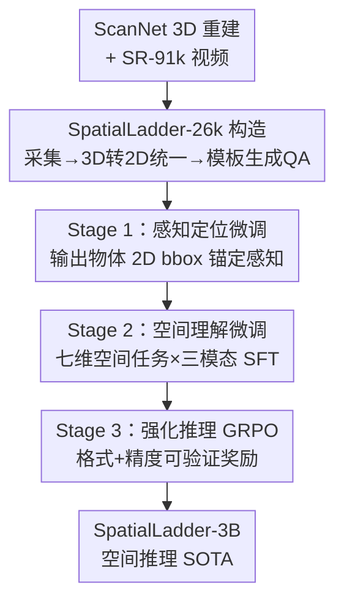

# SpatialLadder：用渐进式训练为视觉-语言模型构建空间推理能力

**会议**: ICLR 2026  
**OpenReview**: [https://openreview.net/forum?id=KtrFXlvgrK](https://openreview.net/forum?id=KtrFXlvgrK)  
**代码**: https://github.com/ZJU-REAL/SpatialLadder  
**领域**: 多模态VLM / LLM推理  
**关键词**: 空间推理, 渐进式训练, GRPO, 课程学习, VLM

## 一句话总结
本文提出 SpatialLadder，先用 ScanNet 重建构造覆盖定位/单图/多视角/视频的 26k 空间数据集，再用"感知定位 → 空间理解 → 强化推理"三阶段渐进式训练，把一个 3B 的 Qwen2.5-VL 训成空间推理 SOTA，整体比 base 提升 23.4%，超过 GPT-4o 20.8%。

## 研究背景与动机
**领域现状**：VLM 在常规视觉任务上已经很强，但"空间推理"——判断物体的相对方位、距离、朝向、跨视角对应——仍然是老大难。当前主流做法要么直接拿问答对做强化学习（R1-Zero-VSI、SpaceR），要么外挂 3D 表示（Spatial-MLLM）来给模型补空间知识。

**现有痛点**：作者指出两个根本问题。其一，现有空间数据集碎片化、范围窄，要么只管 2D 图像、要么只管 3D 场景，缺乏跨模态的系统覆盖和标准化标注流程，导致训练信号不完整。其二，现有方法把空间推理当成一个"整体能力"，试图直接从问答对里端到端学出来，跳过了"先看见物体 → 再理解空间关系 → 最后做逻辑推断"这条天然的层级路径，结果模型只是记住了答题模式，遇到新空间配置就泛化崩盘。

**核心矛盾**：作者做了个关键的对照实验来定位瓶颈——拿 200 道空间方位题，逐步给模型加感知提示：只给位置提示（bounding box）准确率涨 5.0%，再加方向线索又涨 4.5%，总共 9.5% 的提升。这说明模型**本身具备潜在的推理能力，缺的是把推理激活的感知锚点**。瓶颈不在推理容量，而在感知与推理之间的衔接。

**本文目标**：与其直接优化推理输出，不如按空间智能的层级结构，把"感知 → 理解 → 推理"分阶段一级一级搭起来。

**核心 idea**：用一个统一标准化构造的多模态数据集，配合"感知定位打地基 → 多维空间理解搭骨架 → 可验证奖励 RL 强化推理"的三阶段渐进训练，让空间能力像爬梯子一样逐级长出来。

## 方法详解

### 整体框架
SpatialLadder 由两块拼成：一套数据集 **SpatialLadder-26k**，和一套**三阶段渐进训练框架**。数据集负责提供从基础感知到复杂推理的完整"学习课程"，训练框架负责让模型按层级顺序逐级吸收这条课程。输入是一个普通的 Qwen2.5-VL-3B 基座模型，输出是一个在空间推理上达到 SOTA 的同尺寸模型——全程不改架构、不外挂 3D 编码器，只靠数据组织和训练顺序。

数据集这边，作者以 ScanNet 的 3D 场景重建为底料，经过"采集 → 3D-to-2D 统一化 → 模板生成问答对"三步流水线，产出四类互补任务（物体定位、单图、多视角、视频），覆盖七个空间维度。训练这边，三个阶段严格串行、各管一层：Stage 1 用定位任务建立感知地基，Stage 2 用多模态多维任务发展空间理解，Stage 3 用 GRPO 强化链式推理。每一阶段都建立在前一阶段打好的基础上。

### 关键设计

**1. SpatialLadder-26k：用标准化流水线把感知到推理铺成一条完整课程**

针对"数据碎片化、缺跨模态系统覆盖"的痛点，作者不是简单拼几个现成数据集，而是从 ScanNet 的 3D 重建出发，自建一条标准化流水线，保证四类模态用同一套标注口径生成。流水线分三步：先采集 ScanNet 重建场景（供定位、单图、多视角用）并从 SR-91k 采样 9,000 个视频；再做 3D-to-2D 变换与统一化，一次性导出 3D/2D bounding box、3D 绝对位置、相对相机的 2D 位置、可见性比例、物体尺寸等丰富信息；最后用改编自 VSI-Bench 的模板批量生成问答对。最终得到 26,610 个样本：物体定位 5,929、单图 5,929、多视角 5,752、视频 9,000，跨越相对方向、相对距离、绝对距离、物体尺寸、计数、房间大小、出现顺序七个维度。这套设计的关键在于"层级递进"——定位任务建立感知地基，单图给静态场景推理入口，多视角要求跨八个视点整合做隐式 3D 理解，视频（1–4 分钟、24fps）再叠加时序动态，让能力从基础感知一路爬到复杂时空推理。

**2. 三阶段渐进训练：先看见、再理解、最后会推理，逐级搭梯子**

这是全文的核心论点对应的设计，直击"把空间推理当整体能力直接学导致泛化差"的痛点。三个阶段对应空间智能层级的三层。Stage 1 感知定位微调：在约 6k 定位样本上做 SFT，让模型把视觉输入和空间查询挂钩，输出包含物体身份和 2D bbox 的 JSON，培养"从背景中分辨出空间相关物体、面向空间推理的鲁棒检测、语言描述到视觉区域的映射"三种基础能力，先把感知锚点钉牢。Stage 2 空间理解微调：引入七个空间维度的综合任务，跨单图/多视角/视频三模态做 SFT——单图建立基本空间关系、多视角逼模型做跨视角整合与隐式 3D、视频再加时序与运动跟踪；同时要在选择题（测离散概念）和数值题（测精确测量）之间灵活切换，长出超越单一任务类型的空间理解。Stage 3 才上强化学习，把前两阶段沉淀的理解转成显式的链式推理。三阶段严格building upon，前一层是后一层的地基，这正是和"直接端到端学"路线的本质区别。

**3. 任务专属的可验证奖励 + GRPO：让 RL 阶段不刷出"听着对其实错"的推理链**

Stage 3 的奖励设计要解决一个具体问题：纯优化答案正确率，模型容易生成"看起来很合理但实际错误"的推理链。作者用双成分奖励 $R(o, y) = r_{\text{format}}(o) + r_{\text{accuracy}}(o, y)$。格式奖励检查是否规范使用 `<think>` 和 `<answer>` 标签，逼模型显式吐出推理过程；精度奖励则任务专属——选择题用二值奖励（对就 1），数值题用基于相对误差阈值的渐进奖励 $r_{\text{accuracy}} = \frac{1}{|\mathcal{T}|}\sum_{\tau\in\mathcal{T}} \mathbb{I}\!\left(\frac{|\hat{y}-y|}{y} < \tau\right)$，越接近真值给分越高。优化用 GRPO：对每个问题 $q$ 从旧策略采样一组候选 $\{o_1,...,o_G\}$，优势 $A_i = \frac{r_i - \text{mean}(r)}{\text{std}(r)}$ 由组内归一化算出，再用带裁剪的目标函数加 KL 正则更新策略：

$$J_{\text{GRPO}}(\theta) = \mathbb{E}_{q,o_i}\!\left[\frac{1}{G}\sum_{i=1}^{G}\min\!\left(\frac{\pi_\theta(o_i|q)}{\pi_{\theta_{old}}(o_i|q)}A_i,\ \text{clip}\!\left(\frac{\pi_\theta(o_i|q)}{\pi_{\theta_{old}}(o_i|q)}, 1\pm\varepsilon\right)A_i\right) - \beta\,\text{KL}[\pi_\theta\|\pi_{ref}]\right]$$

组内归一化的优势不需要单独的 value 网络，配合格式+精度双奖励，既稳定又能把推理质量和答案正确性一起约束住。

### 损失函数 / 训练策略
基座为 Qwen2.5-VL-3B。Stage 1、2 用监督微调（SFT），Stage 3 用 GRPO 强化学习，三阶段按渐进 schedule 各用阶段专属超参。

## 实验关键数据

### 主实验

In-domain（六类指标综合 Overall，单位 %）：

| 模型 | VSI-Bench | SPBench-SI | SPBench-MV | Overall |
|------|-----------|------------|------------|---------|
| GPT-4o | 34.0 | 42.4 | 48.2 | 41.5 |
| Gemini-2.0-Flash | 45.4 | 54.7 | 51.4 | 50.5 |
| Spatial-MLLM-4B | **47.3** | 43.7 | 61.8 | 50.9 |
| Qwen2.5-VL-3B (base) | 29.4 | 40.3 | 36.6 | 35.4 |
| **SpatialLadder-3B** | 45.7 | **70.2** | **70.9** | **62.3** |
| Improvement vs base | +16.3 | +29.9 | +34.3 | **+23.4** |

3B 的 SpatialLadder 整体 62.3%，不仅超过所有开源/闭源 baseline，还反超 7B 的 SpaceR（50.8）和 VILASR（51.1）。尤其值得注意：Spatial-MLLM 靠专用 3D 编码器在 VSI-Bench 拿 47.3%，SpatialLadder 用标准 VLM 架构拿到相当的 45.7%，证明**渐进训练可以替代架构改造**。

Out-of-domain 泛化（Overall）：

| 模型 | CV-Bench | SPAR | ViewSpatial | MMSI | MindCube | Overall |
|------|----------|------|-------------|------|----------|---------|
| GPT-4o | 75.4 | 36.4 | 32.6 | 30.3 | 38.8 | 42.7 |
| Qwen2.5-VL-3B (base) | 70.6 | 24.6 | 35.6 | 26.5 | 33.2 | 38.1 |
| **SpatialLadder-3B** | 73.7 | 34.4 | 44.2 | 29.2 | 43.4 | **45.0** |
| Improvement | +3.1 | +9.8 | +8.6 | +2.7 | +10.2 | +6.9 |

域外整体 45.0%，超过 GPT-4o（42.7%），比 base 平均涨 6.9%。其中 ViewSpatial（+8.6，视角依赖理解）和 MindCube（+10.2，空间心智建模）涨幅最大，说明学到的是可迁移的通用空间智能而非过拟合。

### 消融实验

| 配置 | 掉点 | 说明 |
|------|------|------|
| Full model | — | 完整三阶段 |
| w/o Stage 2 | -9.4% | 空间理解微调，最关键的基石 |
| w/o Stage 3 | -2.1% | 去掉 RL 推理强化 |
| w/o Stage 1 | -1.8% | 去掉感知定位 |
| w/o 单图+多视角数据 | -16.4% | 掉点最惨，且连累 VSI-Bench |
| w/o 链式推理(CoT) | -0.8% | CoT 稳定带来正收益 |

### 关键发现
- **Stage 2（空间理解）是训练基石**：去掉它掉 9.4%，远超 Stage 1（-1.8）和 Stage 3（-2.1），说明显式的空间认知是整条管线的核心。
- **多模态多样性最不可或缺**：抽掉单图+多视角数据掉 16.4%，是所有消融里最惨的，而且不只伤对应 benchmark，连视频类的 VSI-Bench 也跟着掉——印证跨模态多样性是鲁棒空间推理的根本。
- **RL 阶段涌现语义一致性**：用 semantic entropy 量化不确定性，Stage 1-2 阶段熵从 1.24 升到 1.47（能力扩展、突破初始误判），到 Stage 3 RL 优化后语义一致性才收敛。
- CoT 推理带来稳定的 +0.8%，并让训练 reward 方差更小、收敛更平滑。

## 亮点与洞察
- **用对照实验定位瓶颈**：先做"逐步加感知提示"的 200 题对照实验（+5.0% 位置提示、+4.5% 方向线索），干净利落地证明"瓶颈在感知-推理衔接而非推理容量本身"，给整篇方法立了个有说服力的靶子。
- **渐进训练替代架构改造**：3B 标准 VLM 不外挂 3D 编码器，靠训练顺序就追平了带专用 3D 编码器的 Spatial-MLLM，这是个很值得迁移的结论——很多"必须改架构"的需求也许只是训练课程没排对。
- **数据流水线吃 3D 重建红利**：从 ScanNet 重建一次性导出 3D/2D bbox、可见性、尺寸等多种标注，让四类模态共享同一标注口径，这套"3D 重建 → 多模态统一标注"的思路可复用到任何需要空间真值的数据构造。

## 局限与展望
- 强依赖 ScanNet 室内重建场景，七个空间维度和任务模板也围绕室内场景设计，向室外/开放世界（自动驾驶、大尺度导航）迁移能力未验证。
- 模型规模锁定在 3B，渐进训练在更大模型上是否仍有同样增益、还是会被基座原生能力稀释，未做 scaling 分析。
- 三阶段严格串行、各阶段超参手工配置，阶段切换点和数据配比对结果的敏感性没有系统消融，复现时这部分可能是隐性成本。
- VSI-Bench 上仍略低于带 3D 编码器的 Spatial-MLLM（45.7 vs 47.3），纯架构无关路线在最依赖几何精度的任务上仍有上限。

## 相关工作与启发
- **vs SpaceR / R1-Zero-VSI**: 它们直接用 RL 优化空间推理输出，本文认为这跳过了感知地基，改成"先 SFT 打感知和理解、再 RL 强化"的三阶段课程，泛化更稳。
- **vs Spatial-MLLM**: 它外挂专用 3D 表示作为桥接知识，本文用标准 VLM 架构 + 渐进训练达到可比效果，证明训练课程可以替代架构改造。
- **vs Video-R1 / VideoChat-R1**: 同样把 RL 引入 VLM，但它们聚焦时序理解/视频定位，本文专门针对空间推理设计了七维任务和任务专属可验证奖励。

## 评分
- 新颖性: ⭐⭐⭐⭐ 渐进式"感知→理解→推理"课程 + 标准化多模态数据集，思路清晰但 GRPO/SFT 组件本身是现成的。
- 实验充分度: ⭐⭐⭐⭐⭐ 六 benchmark 域内外双评 + 组件/数据消融 + 语义熵分析，论证链条完整。
- 写作质量: ⭐⭐⭐⭐ 动机用对照实验立靶，逻辑顺，方法表述清晰。
- 价值: ⭐⭐⭐⭐⭐ 3B 反超 GPT-4o、证明训练课程可替代 3D 架构改造，对实践很有启发。

<!-- RELATED:START -->

## 相关论文

- [\[ICLR 2026\] More Thought, Less Accuracy? On the Dual Nature of Reasoning in Vision-Language Models](more_thought_less_accuracy_on_the_dual_nature_of_reasoning_in_vision-language_mo.md)
- [\[ICLR 2026\] Game-RL: Synthesizing Multimodal Verifiable Game Data to Boost VLMs' General Reasoning](game-rl_synthesizing_multimodal_verifiable_game_data_to_boost_vlms_general_reaso.md)
- [\[ICLR 2026\] MetaSpatial: Reinforcing 3D Spatial Reasoning in VLMs for the Metaverse](metaspatial_reinforcing_3d_spatial_reasoning_in_vlms_for_the_metaverse.md)
- [\[ICLR 2026\] Reasoning-Driven Multimodal LLM for Domain Generalization](reasoning-driven_multimodal_llm_for_domain_generalization.md)
- [\[ICLR 2026\] We-Math 2.0: A Versatile MathBook System for Incentivizing Visual Mathematical Reasoning](we-math_20_a_versatile_mathbook_system_for_incentivizing_visual_mathematical_rea.md)

<!-- RELATED:END -->
