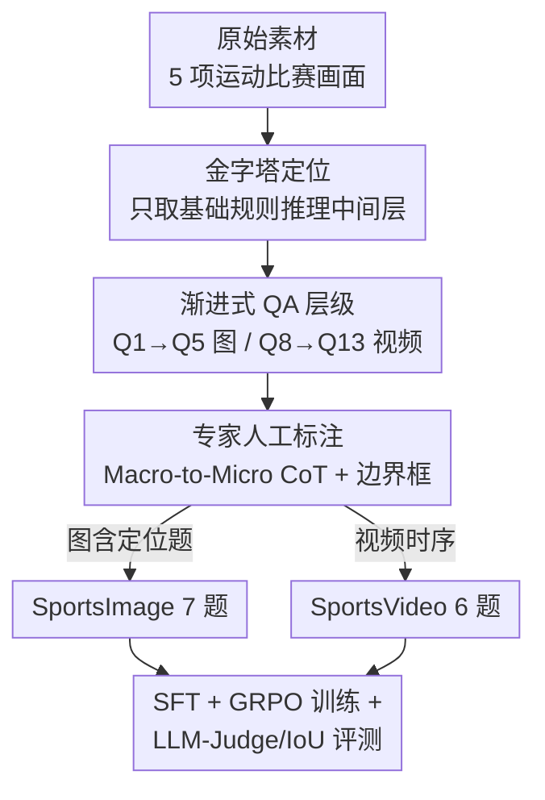

# SportR: A Benchmark for Multimodal Large Language Model Reasoning in Sports

**会议**: ICLR 2026  
**OpenReview**: [https://openreview.net/forum?id=cPCGB402ff](https://openreview.net/forum?id=cPCGB402ff)  
**代码**: https://github.com/chili-lab/SportR  
**领域**: 多模态VLM / LLM推理 / 评测基准  
**关键词**: 体育理解、规则推理、视觉定位、思维链标注、跨模态泛化

## 一句话总结
SportR 是首个面向"体育规则推理"的多运动大规模多模态基准：用 4,789 张图 + 2,052 段视频、覆盖 5 项球类运动的 50 类犯规与 12 类战术，配上 6,841 条**纯人工撰写**的思维链（CoT）和精确边界框标注，按"从识别犯规到预测判罚到定位证据"的递进 QA 层级评测 MLLM，结果显示即便 GPT-5 也只能拿到很低的分数，视觉定位 IoU 普遍 <7%。

## 研究背景与动机

**领域现状**：体育分析正从早期的动作识别、比分预测，演进到用 MLLM 去"理解比赛为什么这样发生"——自动裁判、战术分析等应用都依赖模型把**细粒度视觉感知**和**抽象规则知识**结合起来做判断。要做对一次判罚，模型不仅要看出球员之间发生了什么交互，还得精确指出那一瞬间的违规接触点，并把这个视觉证据连接到对应的规则条款。

**现有痛点**：现有体育基准要么只覆盖单一运动，要么缺少做这种推理评测所必需的两样东西。一类是多运动基准（如 SPORTU），它给了解释文本但不是细粒度、可用于训练推理的 CoT 轨迹，且主要用选择题 + 慢动作回放，难以反映模型真实能力；另一类是单运动深度基准（SoccerNet-XFoul 之于足球、FSBench 之于花滑），分析够深但无法评估跨运动泛化。更关键的是，这些工作普遍**缺少精确的视觉定位标注**——无法验证模型的判断到底是不是建立在正确的视觉证据上，还是在"蒙对答案"。

**核心矛盾**：体育智能的真正瓶颈在于把"看到的画面"映射到"抽象规则"这一步。研究已表明模型在基础感知任务（如识别这是什么运动）上几乎满分，但一旦要求真正的规则理解就大幅掉分。然而现有数据既没有教模型一步步推理的监督信号，也没有验证推理是否落地到证据的手段。

**本文目标**：作者把体育理解抽象成一个金字塔——底层是感知（已基本解决）、顶层是精英级别的疑难判例（当前能力和标注水平都够不着）、而中间层是任何资深参与者都该掌握的**基础犯规与战术**。SportR 专攻这个中间层，目标是同时提供能**训练**推理、又能**评测**"推理是否绑定到正确视觉证据"的资源。

**核心 idea**：用"递进 QA 难度层级 + 全人工 CoT + 显式边界框定位任务"三件套，造一个多运动、可训练、可验证证据落地的基准，把当前 MLLM 在体育规则推理上的真实差距暴露出来。

## 方法详解

### 整体框架

SportR 不是一个模型，而是一套**基准构建 + 评测协议**。它先用"体育理解金字塔"圈定评测范围（只做中间的基础推理层），再把这一层拆成一个从浅到深的 13 题 QA 层级，分别落在两个互补组件上：**SportsImage**（4,789 张静态图，7 个问题 Q1–Q7，唯一带显式边界框定位任务）和 **SportsVideo**（2,052 段视频，6 个问题 Q8–Q13，把推理扩展到时序域）。每张图/每段视频的核心是一条由 16 位运动专家**纯手工撰写**的 CoT 推理链，它既是判罚预测、战术识别的"金标准推理路径"，又直接充当自由问答解释题的标准答案。最终从 6,841 条 CoT 派生出 20,000+ 条结构化 QA。评测端对定位题用 IoU、对其余文本题用"三个闭源模型当裁判取平均"的 LLM-as-Judge，并在 Qwen-2.5VL-7B 上做 SFT + GRPO 强化学习，验证这套数据确实能训练出更强的推理能力。

### 关键设计

**1. 渐进式 QA 难度金字塔：把"体育理解"拆成可分层诊断的 13 道题**

作者先用一个三层金字塔界定评测的"野心边界"：底层感知（识别球员、动作、是什么运动）当前模型已近满分，不值得测；顶层精英判例（疑难争议规则、复杂战术组合）超出当前标注和模型能力；SportR 只锚定中间的**基础犯规与战术理解**层。在这个范围内，它实例化出 13 道递进问题，难度逐级加深：从"画面里有没有违规"（Q1/Q8）→"具体是哪类犯规"（Q2/Q9）→"该判什么罚"（Q3/Q10，需多步推理）→"自由解释为什么违规"（Q4/Q11）→进攻/防守战术识别（Q6-Q7/Q12-Q13），其中图像组还多一道最难的显式定位题（Q5）。这种分层让评测不再是一个笼统的准确率，而能精确定位模型在"感知—分类—判罚—解释—定位"链条的哪一环断裂——实验里就能看到模型在 Q1 还行、到 Q2/Q5 就崩，正是这种粒度的价值。

**2. 全人工 Macro-to-Micro 思维链标注：给规则推理提供可训练的金标准路径**

针对现有基准"只有答案没有推理过程、或推理粗糙不可训练"的痛点，SportR 坚决**放弃任何模型辅助生成**，由 16 位运动专家（含 2 名 NCAA 一级运动员、12 年+ 竞技经验）全手工撰写 6,841 条 CoT。为保证推理链质量统一，标注遵循严格的"宏观到微观"三步逻辑流：(1) 先定位具体场区与涉事方；(2) 再描述导致事件的动作细节与动态过程；(3) 最后精确锁定接触点或关键视觉证据。同一条 CoT 被一物多用——它既是判罚预测（Q3）的标准推理路径，又是战术识别（Q6/Q7）的解释依据，还直接当自由解释题（Q4）的金标准答案，甚至可作为提示去引导/训练模型推理。质量上还加了双盲复核：任何标注者不确定的样本转交第二位专家独立审，达不成共识就直接丢弃，宁缺毋滥地压低误标风险。这套"专家驱动、可作训练信号"的 CoT 正是 SportR 区别于 SPORTU 这类基准的核心。

**3. 显式视觉定位任务：用边界框 + IoU 逼问"推理到底有没有落到证据上"**

这是 SportR 最独特、也最难的设计，专治"模型答对了但其实没看对证据"这一验证盲区。在图像组的 Q5，模型必须输出违规发生处的**精确边界框坐标**（例如两名球员手臂发生违规接触的那一点），用 IoU 直接度量预测框和专家手绘的最紧致真值框的重合度。作者特意把坐标级评测放在静态图上，因为犯规往往由离散、局部的事件（某个物理接触点）定义，在单帧里能被无歧义地标注，提供干净高精度的真值；视频里跨多帧定义一致的时空坐标本身是个大研究问题，故 SportsVideo 暂不含定位题。据作者所知，这是体育理解领域**首个**显式定位任务——它把"抽象规则知识能否落地到精确空间证据"变成一个可量化的硬指标，而实验显示这一项即便 SOTA 也 IoU<7%，是整个基准最难啃的骨头。

**4. SFT + GRPO 训练验证与跨模态泛化：证明数据不只是评测、还能教会推理**

光建基准还不够，作者要证明这套人工 CoT 是有效的训练资源。他们在开源 Qwen-2.5VL-7B 上做两阶段训练：先监督微调（SFT），再用 GRPO 强化学习算法继续优化，且**只在 SportsImage 图像数据上训练**。结果不仅图像任务大幅提升（犯规分类 Q2 从 14.4% 跳到 50.7%），更出现一个有意思的现象：这个从未见过视频的模型，在视频违规识别（Q8）上从 25.49% 暴涨到 59.52%，反超包括 GPT-5 在内的所有模型——说明在图像上学到的细粒度规则推理能力可以**跨模态迁移**到视频。这一设计把 SportsImage 坐实为构建通用体育推理能力的基础资源，同时也诚实地暴露上限：即便训练后，定位题平均 IoU 也只从 4.61% 爬到 9.94%，差距依然巨大。

## 实验关键数据

### 主实验

评测覆盖 GPT-5、Claude 4 Sonnet、Gemini 2.5 Pro 等闭源模型与 Qwen-VL、LLaVA、DeepSeek-VL、GLM-4.5V 等开源模型，全部零样本（temperature=0.7）；文本题用 GPT-5/Gemini 2.5 Pro/Claude 4 三裁判取平均（与人工评分 Pearson r>0.65），定位题用 IoU。

SportsImage 七题表现（%，Q5 为 IoU）：

| 模型 | Q1 有无违规 | Q2 犯规分类 | Q3 判罚预测 | Q4 自由解释 | Q5 定位IoU | Q6 进攻战术 | Q7 防守战术 |
|------|------|------|------|------|------|------|------|
| GPT-5 | 69.19 | 44.21 | 44.49 | 41.34 | 5.70 | 65.75 | 58.82 |
| Gemini 2.5 Pro | 58.79 | 17.54 | 19.54 | 35.16 | 3.67 | 21.12 | 45.23 |
| Qwen-2.5VL-72B | 49.97 | 22.92 | 32.61 | 14.64 | 6.93 | 18.83 | 66.96 |
| Qwen-VL-7B (Base) | 48.29 | 14.43 | 21.69 | 12.32 | 4.61 | 24.66 | 21.81 |
| Qwen-VL-7B (SFT) | 69.82 | 50.71 | 33.13 | 32.94 | 2.88 | 55.08 | 76.56 |
| **Qwen-VL-7B (SFT+RL)** | **84.19** | **51.54** | **52.34** | 27.44 | **9.94** | 60.89 | **87.07** |

SFT+RL 后在 7 类里 5 类拿到最高分；Q2 从 14.43% → 51.54%，Q1 → 84.19%，定位 IoU 翻倍到 9.94%（但仍极低）。

### 跨模态泛化（SportsVideo，仅用图像数据训练）

| 模型 | Q8 视频违规识别 | Q9 分类 | Q10 判罚 | Q11 解释 | Q12 进攻 | Q13 防守 |
|------|------|------|------|------|------|------|
| GPT-5 | 59.17 | 34.39 | 41.83 | 24.02 | 60.82 | 8.42 |
| Gemini 2.5 Pro | 64.93 | 25.69 | 26.71 | 17.81 | 44.18 | 17.87 |
| Qwen2.5-VL-7B (Base) | 25.49 | 15.06 | 11.63 | 8.27 | 33.41 | 3.64 |
| **Qwen2.5-VL-7B (SFT+RL)** | **59.52** | 17.53 | 19.71 | 14.89 | 9.37 | 12.88 |

只在图像上训练的模型，在从未见过的视频 Q8 上从 25.49% → 59.52%，反超 GPT-5，验证规则推理能力可跨模态迁移；但战术类（Q12）反而下降，泛化并非全面。

### 错误分析（1,500 个失败样本，6 个代表模型）

将错误归为五类：视觉幻觉、领域知识缺口、推理错误、格式违规、视觉感知错误。关键发现：

- **视频任务**：视觉感知错误 + 视觉幻觉两类合计常占 60–70%，说明视频的主要障碍是无法解析细粒度时序动态，模型根本走不到规则裁决那一步。
- **图像任务**：去掉时序歧义、感知变易后，**领域知识缺口骤增**——GPT-5 的领域知识缺口从视频的 20.00% 升到图像的 36.00%。这恰恰"揭穿"了真正的短板：即便 SOTA 看清了证据，也很难把证据映射到正确的抽象规则。

## 亮点与洞察
- **同一条 CoT 一物多用**：人工写的推理链同时充当判罚预测的推理路径、战术识别的解释、自由解释题的标准答案、以及训练用的提示——一份昂贵标注被榨干价值，是数据成本与覆盖度之间很巧妙的折中。
- **把"证据落地"做成硬指标**：用边界框 + IoU 量化"模型是否真看对了违规点"，直接戳破了"答对≠看对"这个评测盲区，这个思路可迁移到任何需要验证 MLLM 推理是否 grounded 的领域（医学、工业质检）。
- **图像训练泛化到视频**的现象提示：细粒度规则推理可能是一种相对模态无关的能力，先在更干净的静态图上学，再迁移到嘈杂的时序场景，可能是个更省标注的训练路径。
- **错误分布随模态翻转**很有启发：图像揭示"知识/推理缺口"、视频揭示"感知/幻觉缺口"，说明评测体育推理必须图+视频双管齐下，单一模态会系统性低估某类缺陷。

## 局限与展望
- **视频缺定位题**：作者坦承时序场景下一致标注精确时空坐标是独立的大难题，故 SportsVideo 没有 grounding 任务——这也意味着"视频里推理是否落到证据"目前仍无法量化。
- **只覆盖 5 项球类/拍类运动**，且聚焦"基础且广为人知"的犯规与战术，刻意回避精英级疑难判例；对真实裁判最棘手的争议判罚，基准还够不着。
- **训练验证只在一个 7B 模型上**：SFT+GRPO 仅在 Qwen-2.5VL-7B 上做，且只用图像数据，未系统探究更大模型、视频训练或不同 RL 配方的上限。
- **定位仍是天花板**：训练后 IoU 只到 9.94%，说明当前 MLLM 的空间证据落地能力距离可用还很远，是最值得后续攻关的方向。

## 相关工作与启发
- **vs SPORTU**：同为多运动基准，SPORTU 提供解释文本但非细粒度可训练 CoT，主要用选择题+慢动作，且无定位标注；SportR 用全人工 CoT + 自由生成式问答 + 显式边界框，专为"训练推理 + 验证证据落地"设计。
- **vs SoccerNet-XFoul / FSBench / SoccerBench**：这些是单运动深度基准（足球点球、花滑评分），分析深但无法评测跨运动泛化；SportR 用多运动统一层级换取泛化评测能力。
- **vs ActionAtlas / Sports-QA / Ego-Exo4D**：早期体育 QA 偏动作识别与描述性/时序问题，不聚焦规则裁决；SportR 把核心放在"为什么违规/判什么罚"的规则推理上。

## 评分
- 新颖性: ⭐⭐⭐⭐ 首个多运动体育规则推理基准 + 首个显式视觉定位任务，定位精准填补空白。
- 实验充分度: ⭐⭐⭐⭐ 覆盖大量闭源/开源模型、SFT+RL 训练、跨模态泛化、1500 样本错误分析，较为完整。
- 写作质量: ⭐⭐⭐⭐ 金字塔框架与 13 题层级叙述清晰，错误分析的模态翻转洞察到位。
- 价值: ⭐⭐⭐⭐ 提供可训练+可验证证据落地的稀缺资源，且暴露了 MLLM 体育推理的真实差距，社区价值明确。

<!-- RELATED:START -->

## 相关论文

- [\[CVPR 2026\] PointThinker: Point-Incentivized Parallel Thinking for Multimodal Large Language Model](../../CVPR2026/vlm_reasoning/pointthinker_point-incentivized_parallel_thinking_for_multimodal_large_language_.md)
- [\[ICLR 2026\] LENS: Multi-level Evaluation of Multimodal Reasoning with Large Language Models](lens_multi-level_evaluation_of_multimodal_reasoning_with_large_language_models.md)
- [\[ICLR 2026\] PuzzleWorld: A Benchmark for Multimodal, Open-Ended Reasoning in Puzzlehunts](puzzleworld_a_benchmark_for_multimodal_open-ended_reasoning_in_puzzlehunts.md)
- [\[ICLR 2026\] MathNet: A Global Multimodal Benchmark for Mathematical Reasoning and Retrieval](mathnet_a_global_multimodal_benchmark_for_mathematical_reasoning_and_retrieval.md)
- [\[ICLR 2026\] Vision-SR1: Self-Rewarding Vision-Language Model via Reasoning Decomposition and Multi-Reward Policy Optimization](vision-sr1_self-rewarding_vision-language_model_via_reasoning_decomposition_and_.md)

<!-- RELATED:END -->
