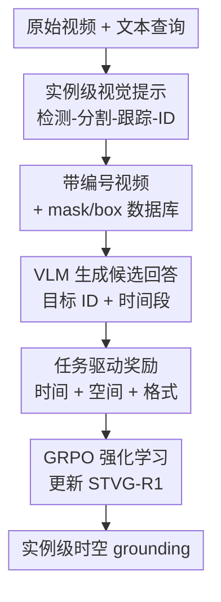

# STVG-R1: Incentivizing Instance-Level Reasoning and Grounding in Videos via Reinforcement Learning

**会议**: ICLR2026  
**OpenReview**: [https://openreview.net/forum?id=zuPxAZgT9F](https://openreview.net/forum?id=zuPxAZgT9F)  
**论文**: [Project Page](https://stvg-r1.github.io/)  
**代码**: 未公开  
**领域**: 多模态VLM / 视频时空定位 / 强化学习  
**关键词**: 视频时空定位, 实例级推理, 视觉提示, GRPO, 视频目标 grounding

## 一句话总结

STVG-R1 把视频时空 grounding 中难学的逐帧坐标回归改写成“看带编号的视频并回答目标 ID + 时间段”的实例识别问题，再用 GRPO 和任务奖励训练 VLM，在 HCSTVG、ST-Align、MeViS 等多个视频 grounding/segmentation 基准上显著提升空间一致性与跨任务泛化。

## 研究背景与动机

**领域现状**：视频时空 grounding（Spatial-Temporal Video Grounding, STVG）要求模型根据文本描述同时找出事件发生的时间段和对应目标在视频中的空间位置。传统路线多依赖 CLIP/I3D/InternVideo 等视觉编码器加任务特定融合模块；近年的 VLM 路线则尝试直接让大模型输出时间戳、逐帧框坐标，或者输出 segmentation token 后交给额外 decoder 生成 mask。

**现有痛点**：直接输出坐标看似自然，但对 VLM 很不友好。文本 token 里的数字坐标和图像里的真实位置不是同一种表示，模型容易产生越界时间戳、无意义框、跨帧不一致框等 hallucination。另一类 decoder-based 方法绕开坐标生成，但要新增可训练 decoder 或特殊 token，训练成本高，且对新任务和多目标场景泛化不稳定。

**核心矛盾**：STVG 的评价本质上关心“是不是同一个目标、是不是在正确时间段内”，而不是非要让 VLM 逐帧吐出一串连续坐标。现有做法把这个判别问题包装成密集坐标生成，使模型必须同时学视觉-文本对齐、数字坐标格式、跨帧目标一致性，难度被人为放大。

**本文目标**：作者希望把空间预测从连续坐标空间搬回 VLM 更擅长的离散符号空间：先在视频画面中给每个实例叠加一个时间一致的数字 ID，再让模型回答目标 ID 和时间范围。这样空间 grounding 由“生成每帧 box”变成“在带标号视频里选实例”。

**切入角度**：视觉提示（visual prompt）已经在图像和多视角场景理解里证明过价值：一个简单的红圈、数字、字母标记，能让 VLM 用语言稳定指代视觉实体。本文把这个思路扩展到视频，并进一步用强化学习奖励直接优化 STVG 的时间 IoU、空间 ID 正确性和输出格式。

**核心 idea**：用时间一致的实例 ID 替代逐帧坐标输出，把视频 grounding 转化为可验证的实例级推理任务，再用 GRPO 让 VLM 学会围绕这些 ID 做时间-空间联合决策。

## 方法详解

### 整体框架

STVG-R1 分成两层：第一层是 training-free 的 object-centric visual prompting pipeline，把原视频变成带红色数字 ID 的 prompted video，并维护每个 ID 对应的 mask/box 数据库；第二层是 RL 训练的 VLM policy，输入 prompted video 和文本 query，输出 `<think>` 推理过程以及 `<answer>` 中的目标 ID 与时间段。关键变化在于，VLM 不再直接预测每一帧的 box，而是选择一个可解释、可追踪的实例 ID。

形式化地，给定视频 $V=\{I_1,\ldots,I_T\}$，每帧先叠加该帧的 visual prompts $P_t=\{p_t^1,\ldots,p_t^{K_t}\}$，得到 $\tilde I_t = I_t \oplus P_t$，整段 prompted video 记作 $\tilde V$。模型 $\pi_\theta$ 接收 $\tilde V$ 与查询 $q$，输出预测时间段 $[t_s,t_e]$ 和目标实例 ID $\hat{i}$。为了控制显存，视频以 2 FPS 均匀采样，总像素量约束在 $R=1.6\times 10^6$ 左右，长视频会降低每帧分辨率。

### 关键设计

**1. 实例级视觉提示：把坐标回归改成离散 ID 选择**

论文最核心的设计是把 STVG 的空间输出从连续坐标转成实例 ID。具体流程是：先在第一帧用 YOLOv12-x 一类检测器找候选实例，再把检测框作为 SAM2 的提示得到 mask，并向后跟踪到后续帧；每个实例在画面中心叠加一个红色数字，数字在时间上尽量保持一致。这样 VLM 看到的不是裸视频，而是一个可以用自然语言引用的实例表盘：目标不再是“左上角 $x_1,y_1,x_2,y_2$ 的框”，而是“ID 2 那个飞盘/人/兔子”。

这种改写直接绕过了 VLM 的坐标对齐短板。坐标 hallucination 往往来自模型必须把视觉位置翻译成精确数字，而 visual prompt 让位置先由外部检测/分割/跟踪系统显式落到图像上，VLM 只需要做语义匹配、时间判断和 ID 选择。即使检测器把 fish 错分类成 bird，只要同一个物体的 ID 连贯，监督目标仍然有效，因为本文关心的是 instance identity 而不是类别标签。

**2. Prompted video 构建：用重检测、双向跟踪和投票抵抗视频中的漏检与换 ID**

只在第一帧检测并跟踪会漏掉后面才出现的目标，也会在遮挡、快速运动时产生 ID 断裂。因此作者在固定间隔做 periodic re-detection：新检测框会和当前已跟踪 mask 比 IoU 与重叠比例，只有当它和已有对象几何重叠持续较低时，才被当作新实例。新实例出现后，SAM2 会从发现帧向前、向后双向传播，尽量恢复完整轨迹。

训练标签也按这种实例化表示重构。对 ground-truth 时间段内的每一帧，论文计算真值框 $gt$ 与候选框 $b_k^t$ 的 IoU，取重叠最高的 ID：$i_t=\arg\max_k \mathrm{IoU}(gt,b_k^t)$。整段视频的目标 ID 再通过多数投票得到：$A=\arg\max_i \sum_{t=1}^{T} \mathbf{1}[i_t=i]$。这个 majority voting 很关键，它承认单帧检测/跟踪可能有噪声，但把监督目标定义为跨时间最一致的实例，从而更适合视频 grounding。

**3. 任务驱动奖励：时间、空间、格式三种信号分别约束模型行为**

STVG-R1 没有只用 token-level SFT 学答案格式，而是把评测目标拆成可验证奖励。时间奖励 $r_t(o)$ 是预测区间 $[t_s,t_e]$ 与真值区间 $[t'_s,t'_e]$ 的 IoU：$r_t(o)=\frac{[t_s,t_e]\cap[t'_s,t'_e]}{[t_s,t_e]\cup[t'_s,t'_e]}$。空间奖励 $r_s(o)$ 是稀疏的 0/1 信号：只有当预测 ID 等于真值 ID，且该 ID 出现在预测时间段内时才给 1，否则为 0。格式奖励 $r_f(o)$ 则要求回答包含 `<think>...</think>` 和 `<answer>...</answer>`。

这个奖励拆法比把所有东西揉成一个连续 vIoU 奖励更稳。空间上，模型的动作其实是“选择哪个实例 ID”，不是生成一个连续 box，所以稀疏 ID 正确性比逐帧 IoU 更贴近决策变量；时间上，区间 IoU 可以提供连续梯度式反馈，告诉模型预测早了、晚了还是覆盖不足。总奖励为 $R(o)=r_t(o)+r_s(o)+r_f(o)$，既让模型学会找对时间，也避免只靠时间模式投机而忽略空间目标。

**4. GRPO 训练：用组内相对优势强化实例级推理链**

训练时，每个 prompted video-query pair 会由旧策略生成 $n=8$ 个候选回答，每个回答按上面的奖励打分。然后在同一组候选内做标准化优势：$A_i=\frac{R(o_i)-\mathrm{mean}(\{R(o_j)\}_{j=1}^n)}{\mathrm{std}(\{R(o_j)\}_{j=1}^n)}$。模型更新采用 GRPO 的 clipped objective，并用 KL 项约束当前策略不要偏离 reference policy 太远。

这套训练策略的意义不只是“把 RL 加到 VLM 上”。由于 visual prompt 已经把空间目标变成可验证 ID，RL 才有了明确的空间奖励入口；如果仍让模型直接输出逐帧坐标，奖励解析和信用分配会复杂得多。论文中的可视化也显示，模型在 `<think>` 中会先识别 query 里的实体、映射到 ID，再判断事件开始和结束时间，这正是实例级 reasoning 被奖励塑形后的表现。

### 一个完整示例

以论文图中的查询“穿浅灰西装的卷发男子走向红西装男子，并把左手放到对方左肩上”为例，原始任务如果要求逐帧坐标，模型需要在每一帧输出两个互动人物的位置，还要判断动作何时真正发生。STVG-R1 先把视频中的人都标成 ID，例如浅灰西装男子是 ID 2，红西装男子是 ID 3。模型读到 query 后，不必生成 ID 2 的每帧框，只需要在推理中确认“ID 2 走向 ID 3 并伸手接触左肩”的事件片段。

最终回答可以是：`<think>` 中说明 ID 2 的行为从静止、接近到伸手接触 ID 3；`<answer>` 中给出 `Target ID: 2, Time range: 5.00 to 11.00`。随后系统可从 mask/box 数据库取出 ID 2 在 5.00 到 11.00 秒内的轨迹，换算成 STVG 需要的空间定位结果。这个例子说明，模型输出虽然更短，但并没有丢掉空间信息，而是把空间信息交给显式实例数据库承载。

### 损失函数 / 训练策略

STVG-R1 基于 Qwen2.5-VL-7B 初始化，优化器为 AdamW，学习率 $1.0\times10^{-6}$，每设备 batch size 为 1，训练 1 个 epoch，使用 8 张 A100。训练数据来自 HCSTVG v1/v2 合并后的训练集和 VidSTG，且会移除验证/测试集中出现过的样本。检测器为 YOLOv12-x，置信度阈值 0.25；分割/跟踪模型为 SAM2.1-large；每 15 帧重检测一次，新实例判定条件包括与已跟踪对象 IoU 低于 0.4 且重叠比例低于 0.6。

GRPO 目标可理解为：提高组内高奖励回答的概率，压低低奖励回答的概率，同时用 clipping 和 KL 防止策略漂移过大。论文写成：

$$
J_{GRPO}(\theta)=\mathbb{E}\left[\frac{1}{n}\sum_{i=1}^{n}\left(\min\left(\frac{\pi_\theta(o_i|q)}{\pi_{\theta old}(o_i|q)}A_i,\mathrm{clip}\left(\frac{\pi_\theta(o_i|q)}{\pi_{\theta old}(o_i|q)},1-\epsilon,1+\epsilon\right)A_i\right)-\beta D_{KL}(\pi_\theta\|\pi_{ref})\right)\right].
$$

推理/评测时还加入一个 ID-repair 机制：如果预测时间段内某些帧缺少目标 ID，会先尝试用历史 correction set 替换断裂 ID，再找附近包含目标 ID 的参考帧，通过 IoU 或面积重叠把同一实例修回目标 ID；仍找不到时才退化到最大面积框。这是为缓解检测和跟踪偶发断裂，不是模型本身的新输出头。

## 实验关键数据

### 主实验

| 数据集 / 任务 | 指标 | STVG-R1 | 之前强基线 | 提升 |
|--------|------|------|----------|------|
| HCSTVG-v1 STVG | m vIoU / vIoU@0.3 / vIoU@0.5 | 39.1 / 66.7 / 38.6 | SpaceVLLM-7B: 39.3 / 66.6 / 36.9 | vIoU@0.5 +1.7，m vIoU 基本持平 |
| HCSTVG-v2 STVG | m tIoU / m vIoU / vIoU@0.3 / vIoU@0.5 | 61.3 / 40.8 / 67.9 / 38.8 | SpaceVLLM-7B: 58.0 / 34.0 / 56.9 / 24.7 | +3.3 / +6.8 / +11.0 / +14.1 |
| ST-Align STVG | tIoU@0.5 / m tIoU / vIoU@0.5 / m vIoU | 43.6 / 45.1 / 25.9 / 23.4 | LLaVA-ST-7B: 44.6 / 43.8 / 21.1 / 22.8 | 空间指标 +4.8 / +0.6，时间@0.5 略低 |
| ST-Align 视频空间 grounding | vIoU@0.3 / vIoU@0.5 / m vIoU | 60.3 / 53.9 / 48.6 | LLaVA-ST-7B: 47.2 / 30.9 / 32.5 | +13.1 / +23.0 / +16.1 |
| MeViS 多目标 RVOS | J / F / J&F | 44.7 / 50.0 / 47.3 | VideoGLaMM: 42.1 / 48.2 / 45.2 | J&F +2.1 |
| Charades-STA 零样本 VTG | tIoU@0.3 / tIoU@0.5 | 73.2 / 52.5 | LLaVA-ST: 63.1 / 44.8 | +10.1 / +7.7 |
| TVGBench 零样本 VTG | tIoU@0.3 / tIoU@0.5 | 42.5 / 27.4 | Time-R1 zero-shot: 41.8 / 29.4 | @0.3 +0.7，@0.5 -2.0 |

主结果有两个层次。第一，纯 visual prompt 已经能让多个通用 VLM 在零样本 STVG 中获得明显空间提升，例如 Qwen2.5-VL-7B 在 HCSTVG-v1 上 vIoU@0.3 从 28.2 提到 40.7，Qwen3-VL-8B 从 28.2 提到 56.5。第二，加入 GRPO 后，STVG-R1 在 HCSTVG-v2 和 ST-Align 空间 grounding 上建立了非常强的结果，说明 ID 化表示和 RL reward 是互补的。

| 模块配置 | HCSTVG-v1 m tIoU | HCSTVG-v1 m vIoU | HCSTVG-v1 vIoU@0.5 | HCSTVG-v2 m tIoU | HCSTVG-v2 m vIoU | 说明 |
|------|---------|------|------|------|------|------|
| Qwen2.5-VL-7B | 40.3 | 19.7 | 7.9 | 45.1 | 19.3 | 原始 VLM 两阶段评测 |
| +VisualPrompt | 38.7 | 24.8 | 13.4 | 44.7 | 19.2 | 空间提升明显，时间略受遮挡影响 |
| +GRPO | 57.5 | 24.7 | 17.6 | 61.4 | 24.2 | 主要提升时间定位 |
| +VisualPrompt-SFT | 50.9 | 34.3 | 28.0 | 54.4 | 36.5 | SFT 能提升，但不如 RL 稳定 |
| +VisualPrompt-GRPO | 56.9 | 39.1 | 38.6 | 62.0 | 40.2 | 完整组合，空间与时间最均衡 |

### 消融实验

| 配置 | 关键指标 | 说明 |
|------|---------|------|
| 红色数字 prompt，字号 20 | HCSTVG-v1 m vIoU 24.9，vIoU@0.3 40.6 | 默认配置，空间识别和遮挡之间较平衡 |
| 字号 10 / 30 / 40 | m vIoU 24.6 / 24.1 / 23.2 | 字号过大更容易遮挡细节，过小可见性下降有限 |
| 大写字母 / 小写字母 / 数字 | m vIoU 24.4 / 24.0 / 24.9 | 字母时间略好，数字空间略好，差距不大 |
| 数字+字母混合 | m vIoU 15.7，vIoU@0.3 20.0 | 不一致的编码反而明显伤害识别 |
| mask 过滤阈值 $\theta=1/3$ | zero-shot m vIoU 24.9，vIoU@0.3 40.6 | 过滤小目标能减少视觉噪声，是较好折中 |
| w/o re-detection | m vIoU 27.8，vIoU@0.5 17.4 | 漏掉后出现对象，空间性能大幅下降 |
| w/o backward tracking | m vIoU 28.4，vIoU@0.5 37.1 | 影响小于去掉重检测，但完整轨迹仍更好 |
| Full preprocessing pipeline | m vIoU 39.1，vIoU@0.5 38.6 | 重检测 + 双向跟踪 + 修复带来最稳结果 |
| coupled spatial reward | HCSTVG-v1 m vIoU 38.3 | 把时空奖励耦合后略低于完整设计 |
| continuous spatial reward | HCSTVG-v1 m vIoU 38.6 | 连续 IoU 空间奖励不如稀疏 ID 奖励 |
| 去掉 format reward $r_f$ | 训练曲线几乎相同 | Qwen2.5-VL 已天然会输出 think/answer，格式奖励边际收益小 |

### 关键发现

- Visual prompt 的最大价值在空间一致性：它让 VLM 从“凭语言生成坐标”变成“在画面标号中选实例”，因此 vIoU@0.3、vIoU@0.5 通常提升更明显；但在 temporal-only 任务中，标号可能遮挡细节，零样本时间定位会有小幅下降。
- GRPO 的最大价值在时序与推理：不加 visual prompt 的 GRPO 已能把 HCSTVG-v1 m tIoU 从 40.3 提到 57.5；和 visual prompt 结合后，空间指标进一步跃升到 m vIoU 39.1。
- 简单一致的 ID 编码比复杂编码更好。混合数字和字母没有增强表达力，反而让 VLM 的识别分布更混乱。
- MeViS 结果很有说服力：模型只在单目标 STVG 数据上训练，却能零样本迁移到多目标 referring video object segmentation，说明实例 ID 表示确实比 task-specific decoder 更容易跨任务复用。

## 亮点与洞察

- 最巧妙的点是把“空间 grounding”拆成外部视觉系统负责实例轨迹、VLM 负责语义-实例匹配。这样并没有逃避空间问题，而是把连续空间预测换成 VLM 更容易做、也更容易验证的离散选择。
- STVG-R1 的 RL 奖励设计很克制：时间用连续 IoU，空间用稀疏 ID 正确性，格式只做基本约束。消融显示这比看似更细的连续空间 reward 更有效，提示我们在 RLVR 中奖励不一定越密越好，关键是要对齐 action space。
- 论文对 visual prompt occlusion 做了专门验证，在 MME-VideoOCR 上总分从 59.4 到 58.9，细粒度文字识别 TR 仅从 69.6 到 69.3。这说明红色编号确实会带来轻微干扰，但没有严重破坏视频 OCR 类能力。
- 这个范式可以迁移到很多“VLM 需要指代视觉实体”的任务：视频问答、多人物 caption、交互事件理解、机器人场景理解都可以先建立可见 ID，再让语言模型围绕 ID 进行推理。

## 局限与展望

- 方法依赖检测器、SAM2 和跟踪 pipeline 的覆盖率。论文报告全局检测失败少于 1%，但这主要是在自然视频域；到医学、遥感、工业检测、低光或强遮挡视频时，现成 detector/SAM2 的可靠性可能明显下降。
- Visual prompt 会占用画面空间。虽然 OCR benchmark 上影响较小，但对于小目标密集场景、细粒度读表、显微视频等任务，数字标记可能遮挡关键信息，需要更自适应的 prompt 位置、透明度或按需显示策略。
- 当前空间 reward 是 ID 级稀疏奖励，适合“选中某个实例”的任务；如果目标是非刚性区域、部件级区域或多个对象之间的关系区域，单 ID 表示可能不够，需要扩展到 ID 集合、部件 ID 或关系图。
- 训练仍需构建 prompted video 数据和 mask/box 数据库，预处理成本被转移到了外部视觉 pipeline。未来可以研究端到端或半端到端地联合优化 ID 生成质量与 VLM 推理策略。
- 论文主模型基于 Qwen2.5-VL-7B，虽然展示了多模型零样本 prompt 增益，但 RL 训练的跨 backbone 可复现性还可以更系统地验证。

## 相关工作与启发

- **vs LLaVA-ST / SpaceVLLM**: 这些方法直接增强 VLM 的时空坐标对齐能力，通常需要额外 token 或 trainable alignment module；STVG-R1 不让 VLM 直接吐坐标，而用 visual prompt 将空间输出离散化，训练和迁移更轻。
- **vs SA2VA / SAMA / VideoGLaMM**: 这类方法让 VLM 产生 segmentation token，再由 decoder 输出 mask，适合像素级输出但引入专门 decoder；STVG-R1 的输出仍是普通文本 ID，可以借外部数据库还原空间结果，跨任务接口更简单。
- **vs Time-R1 / Video-R1**: Time-R1 更聚焦视频时间 grounding，奖励主要围绕时间边界；STVG-R1 把 R1/GRPO 思路推进到时空联合 grounding，并用实例 ID 解决空间奖励可验证性。
- **vs Set-of-Mark / VIP-LLaVA / GPT4Scene**: 这些工作证明视觉标记能帮助 VLM 指代图像或多视角场景中的实体；STVG-R1 的贡献在于把标记扩展为跨时间一致的实例 ID，并把它接入 STVG 的 RL 训练闭环。

## 评分

- 新颖性: ⭐⭐⭐⭐⭐ 把 STVG 坐标预测改成实例 ID 选择并接入 GRPO，问题重构非常清晰，且抓住了 VLM 的能力边界。
- 实验充分度: ⭐⭐⭐⭐⭐ 覆盖 HCSTVG、ST-Align、MeViS、Charades-STA、TVGBench 和 OCR 干扰分析，消融也比较细。
- 写作质量: ⭐⭐⭐⭐☆ 主线清楚、图例直观，但方法细节和表格很多，部分 appendix 机制需要读者自己串起来。
- 价值: ⭐⭐⭐⭐⭐ 对视频 grounding、VLM-RL、visual prompting 都有直接启发，尤其适合需要可验证实例级输出的场景。

<!-- RELATED:START -->

## 相关论文

- [\[ICLR 2026\] DeepEyes: Incentivizing "Thinking with Images" via Reinforcement Learning](deepeyes_incentivizing_thinking_with_images_via_reinforcement_learning.md)
- [\[ICLR 2026\] ReVisual-R1: Advancing Multimodal Reasoning from Optimized Cold Start to Staged Reinforcement Learning](revisual-r1_advancing_multimodal_reasoning_from_optimized_cold_start_to_staged_r.md)
- [\[CVPR 2026\] Incentivizing Versatile Video Reasoning in MLLMs via Data-Efficient Reinforcement Learning](../../CVPR2026/vlm_reasoning/incentivizing_versatile_video_reasoning_in_mllms_via_data-efficient_reinforcemen.md)
- [\[ICLR 2026\] VTool-R1: VLMs Learn to Think with Images via Reinforcement Learning on Multimodal Tool Use](vtool-r1_vlms_learn_to_think_with_images_via_reinforcement_learning_on_multimoda.md)
- [\[CVPR 2026\] Thinking With Videos: Multimodal Tool-Augmented Reinforcement Learning for Long Video Reasoning](../../CVPR2026/vlm_reasoning/thinking_with_videos_multimodal_tool-augmented_reinforcement_learning_for_long_v.md)

<!-- RELATED:END -->
