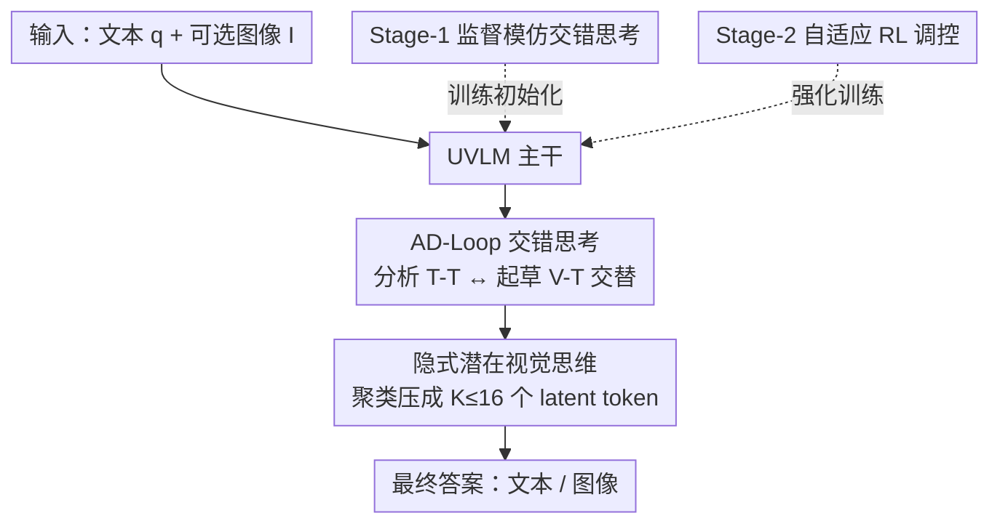

# Synergizing Understanding and Generation with Interleaved Analyzing-Drafting Thinking

**会议**: ICLR 2026  
**OpenReview**: [https://openreview.net/forum?id=GtqmPJf00A](https://openreview.net/forum?id=GtqmPJf00A)  
**代码**: 项目页 AD-Loop.io  
**领域**: 多模态VLM / LLM推理  
**关键词**: 统一视觉语言模型, 理解与生成协同, 交错思考, 潜在视觉思维, 强化学习

## 一句话总结
针对统一视觉语言模型（UVLM）把"理解"和"生成"当成两个并行技能、解题时彼此不互动的问题，本文提出 **AD-Loop**——让模型在思考过程中交错产出"文本思维（分析）"和"潜在视觉思维（起草）"，并用 SFT + 自适应 RL 两阶段训练，使模型学会按需在两种能力间来回切换，理解平均 +2.3%、GenEval 总分达 86%。

## 研究背景与动机

**领域现状**：统一视觉语言模型（Unified Vision-Language Models, UVLM）希望用一个框架同时支持多模态理解（看图回答）和生成（按指令出图）。主流路线有三类：把两者都当成自回归的 next-token 预测、用解耦编码器加多头输出减少表示冲突、以及混合 AR-扩散架构兼顾效率与保真。

**现有痛点**：这些工作几乎全在"架构层面"做文章——怎么把两个能力塞进一个网络。但它们忽略了一个关键事实：在真正解题的推理过程中，理解模块和生成模块之间**几乎没有显式互动**。模型把理解和生成当成两个可以独立调用的技能并排放着，谁也帮不上谁。

**核心矛盾**：理解和生成本应是互补的——稳健的理解为忠实的生成提供语义基础，而成功的生成结果反过来又是"看懂了"的有力证据。可现有模型只做到了"共处一框"（co-locate），没做到"相互强化"（mutual reinforcement）。例如指令有歧义时，理解模块本可以先提几个候选答案，再调用生成模块画草图来"验证"这些候选；反过来生成出初稿后，又可以反问理解模块要属性、空间布局等高层指引来逐步精修。这种来回互动，现有模型做不到。

**本文目标**：不再把理解与生成当成"共存的技能"，而是把它们**编织进一个解题循环**里，让模型在分析和起草之间动态交替。

**切入角度**：作者借鉴认知科学里"内部表象是示意性的、而非像素级精确的"（Shepard & Metzler）观察——人脑推理时脑补的画面是粗糙轮廓，不是高清图。于是思考阶段不需要渲染完整图像，只需一组紧凑的"潜在视觉思维"来承载推理所需的视觉线索。

**核心 idea**：用交错的 **A**nalyzing（分析，产出文本思维 T-T）-**D**rafting（起草，产出潜在视觉思维 V-T）解题循环（AD-Loop）替代"理解、生成各管各"的并行调用，让模型在一段 `<think>` 思维链里反复在两种模式间切换、迭代精炼，从而把理解与生成真正拧成协同。

## 方法详解

### 整体框架

给定输入 $x=(q, I)$（$q$ 是文本，$I=\{I_m\}_{m=1}^{M}$ 是可选的图像集合，$M\geq 1$），模型经视觉编码器与 LLM 主干处理后，输出一段被 `<think></think>` 包裹的思维轨迹，再给出最终答案：

$$\texttt{<think>}\ [\text{T-T}]\ [\text{V-T}]\ [\text{T-T}]\ [\text{V-T}]\ \dots\ \texttt{</think>}\ [\text{Answer}]$$

其中 `[T-T]` 是文本思维（语义抽象、推理），`[V-T]` 是视觉思维（草图、空间布局），用两个特殊 token 标记起止；`[Answer]` 是最终文本或图像。关键在于：思考阶段的视觉思维**不是渲染整张图**，而是一组紧凑的潜在视觉思维 token $\{v_j\}_{j=1}^{K}$，$K$ 远小于渲染一张图所需的 token 数（实现里 $K\leq 16$）。

整个方法是"一个推理范式 + 两阶段训练"。推理时模型在 AD-Loop 里交替分析与起草；训练上先用 SFT 让模型**学会**交错思考的格式，再用自适应 RL 让模型**学会判断**何时该启用 AD-Loop、何时纯文本思考就够了。该框架与具体 UVLM 架构无关（architecture-agnostic），既能套在连续 embedding 路线（BAGEL）上，也能套在离散 token 路线（Janus-Pro）上。

### 关键设计

**1. AD-Loop：把理解与生成编织成交错解题循环**

这针对的痛点是现有 UVLM 解题时理解、生成两个模块零互动。AD-Loop 的做法是把一次解题展开成一段 `<think>` 思维链，让模型在两种"思维"间动态交替：文本思维 T-T 负责分析（语义抽象、逻辑推理、提候选假设），视觉思维 V-T 负责起草（脑补草图、空间布局、可视化假设）。比如"识别水壶、炉子、杯子的功能关系"这种题，模型先文本分析列出两种候选关系，再用视觉思维分别可视化 Draft A / Draft B，再回到文本验证哪个更符合常识——分析和起草来回多轮，最后给答案。这种交替不是简单地"先理解后生成"，而是把生成结果当成可被理解模块继续审视的中间证据，从而让两种能力在同一条推理链上相互校正、迭代收敛。

**2. 隐式潜在视觉思维：用聚类把整图压成少量 latent token**

如果思考阶段每次"起草"都要吐出完整图像（离散 codebook 几百个 image token，或扩散几十步），延迟极高，还会把推理和与决策无关的像素细节纠缠在一起。本文据此把思考期的视觉思维换成一小撮潜在 token $\{v_j\}_{j=1}^{K}$（$K\ll N$，$N$ 是整图 latent grid 数）。构造方式是：复用生成侧的编码器把图像编成 latent grid $\{z_i\}_{i=1}^{N}$，再用**密度峰值聚类（density peaks clustering）**把这些 token 按语义邻近度聚成 $K$ 个簇，每个簇取成员均值作为代表 token $v_j=\frac{1}{|C_j|}\sum_{i\in C_j} z_i$，并按簇中心坐标（左上到右下）排成确定序列。相比朴素的空间池化，聚类得到的目标更稳定、按语义聚合，既保留了粗略轮廓又过滤了像素噪声。一个有意思的现象（RQ-2）是：视觉思维必须来自**生成编码器**而非理解编码器——生成编码器预训练充分、同时承载语义和像素信息，模型收敛更快、效果更好。

**3. Stage-1 监督模仿：先把"会交错思考"教进去**

直接上冷启动 RL 训推理很不稳，所以第一阶段先做 SFT 给个强初始化。难点在于现成数据（多模态 CoT、GoT 生成数据等，理解侧 20K、生成侧 22K 条交错样本）提供的是**显式的像素图**作为视觉思维，而本文的格式要的是**潜在**视觉思维。解决办法就是用设计 2 的冻结生成编码器 + 聚类把每张显式视觉思维图转成 gold 潜在 token 序列 $V^\star$。训练目标三项相加：

$$\mathcal{L}_{S1}=\mathcal{L}_{CE}(\hat{T}, T^\star)+\alpha\,\mathcal{L}_{vis}(\hat{V}, V^\star)+\mathcal{L}_{out}(\hat{o}, o^\star)$$

其中文本思维用交叉熵 $\mathcal{L}_{CE}$ 监督，潜在视觉思维 $\mathcal{L}_{vis}$ 用均方误差（MSE）监督，$\mathcal{L}_{out}$ 是原任务损失，$\alpha$ 是权重系数。这样模型在引导下学会"该插文本思维就插文本、该插视觉思维就插一组 latent token"的交错节奏。

**4. Stage-2 自适应 RL：让模型学会"何时才需要 AD-Loop"**

SFT 后模型会交错思考了，但有些题用单一能力（只理解或只生成）就能自信解出，强行 AD-Loop 反而冗余。第二阶段用基于组相对偏好优化（GRPO 风格）的 RL 让策略对每个输入自适应：对每个 query $q$ 同时采两组轨迹——启用 AD-Loop 的 $\{o_i^{+}\}$ 和不启用的 $\{o_i^{-}\}$，共 $G$ 条。奖励由格式项 + 内容项构成 $r_{base}(o)=r_{format}+r_{content}$（生成任务用对齐/质量打分，理解任务用规则判对错）。为了**只在真有用时**才鼓励 AD-Loop，给 $V^{+}$ 加一个 margin 加成：仅当它答对、确实用了 AD-Loop、且超过最强 $V^{-}$ 候选至少 $\delta$ 时才给奖励：

$$r(o_i^{+})=r_{base}(o_i^{+})+\lambda\,\mathbb{1}(\text{AD-Loop}\mid a)\max\big(0,\ r_{base}(o_i^{+})-\max_j r_{base}-\delta\big)$$

$\delta$ 这个 margin 过滤掉偶然性的"虚假胜出"，没有实质收益时就偏向更简单的纯文本模式。优化时把组内优势 $A_{intra}$（按本组奖励归一化）和指示哪种模式最优的组间优势 $A_{inter}$ 加权合并 $A_i=A_{intra}+\gamma A_{inter}$，再配 KL 正则和 clipping 更新策略。最终模型学到一个"节俭"策略：空间/机械推理这类题主动调 AD-Loop，表格/序列/符号推理这类纯文本链就够的题则不调。

### 一个完整示例

以"识别水壶、炉子、杯子三者的功能关系"为例走一遍 AD-Loop：① 文本思维（T-T）做初始分析——"水壶是金属的，杯子是陶瓷的且空着，存在两种可能关系"；② 文本思维提出候选——关系 A：水壶放在炉子上烧水；关系 B：杯子直接放炉子上加热液体；③ 视觉思维（V-T）分别可视化 Draft A、Draft B 两个假设；④ 文本思维做验证分析——"Draft A 符合常识用法，Draft B 不合理因为陶瓷杯很少直接放炉灶上"；⑤ 给最终答案——"水壶在炉子上加热，随后把热水倒进杯子"。整个过程分析与起草交替进行，生成出的草图成了理解模块判断的"证据"，这正是协同的体现。

## 实验关键数据

骨干为 BAGEL-7B（理解侧用 SigLIP2-so400m/14 编码，生成侧用 FLUX 预训练 VAE）。Stage-1 全局 batch 256、初始学习率 $1\times10^{-5}$、潜在视觉思维上限 $K=16$；Stage-2 用 VERL 框架做 RL，AdamW、学习率 $2\times10^{-6}$、每 prompt 8 次 rollout、KL 权重 0.01。

### 主实验

理解（多模态理解 benchmark）：

| 模型 | #Params | POPE↑ | MME-P↑ | MMB↑ | SEED↑ | GQA↑ | MMMU↑ | MM-Vet↑ |
|------|---------|-------|--------|------|-------|------|-------|---------|
| Janus-Pro | 7B | 87.4 | 1567.1 | 79.2 | 72.1 | 62.0 | 41.0 | 50.0 |
| BAGEL | 7B | – | 1687.0 | 85.0 | – | – | 55.3 | 67.2 |
| **AD-Loop（本文）** | 7B | **90.1** | **1696.0** | **87.6** | **74.4** | **63.8** | **57.3** | **69.7** |

生成（GenEval）：

| 模型 | Single↑ | Two↑ | Counting↑ | Colors↑ | Position↑ | Attri.↑ | Overall↑ |
|------|---------|------|-----------|---------|-----------|---------|----------|
| Janus-Pro | 0.99 | 0.89 | 0.59 | 0.90 | 0.79 | 0.66 | 0.80 |
| BAGEL | 0.99 | 0.94 | 0.81 | 0.88 | 0.64 | 0.63 | 0.82 |
| MindOmni（仅文本思考） | 0.99 | 0.94 | 0.71 | 0.90 | 0.71 | 0.71 | 0.83 |
| **AD-Loop（本文）** | 0.98 | 0.94 | **0.83** | 0.90 | **0.80** | **0.74** | **0.86** |

理解平均 +2.3%，GenEval 总分 86%，且在位置（Position）、属性（Attri.）这类细粒度项上提升最明显——正是需要"推理"的维度。相比只用文本思考的 MindOmni，加入视觉思维带来稳定增益。

### 消融实验

不同思考策略对比（T：仅分析思考；T+I：显式交错；T+eI：隐式交错；T / T+eI：自适应）：

| 思考策略 | MathVista↑ | LogicVista↑ | SAT↑ | WISE-Cultural↑ | WISE-Space↑ | WISE-Biology↑ |
|----------|-----------|-------------|------|----------------|-------------|----------------|
| Isolated（孤立思考） | 61.5 | 40.2 | 0.63 | 0.44 | 0.68 | 0.44 |
| T（仅文本思考） | 68.3 | 44.1 | 0.74 | 0.67 | 0.69 | 0.56 |
| T + I（显式交错） | 72.9 | 46.6 | 0.81 | 0.73 | 0.74 | 0.64 |
| T + eI（隐式交错） | 73.6 | 47.2 | 0.84 | 0.75 | 0.77 | 0.65 |
| T / T + eI（自适应） | **75.8** | **49.5** | **0.89** | **0.79** | **0.78** | **0.68** |

视觉思维来源对比（RQ-2）：

| 视觉思维来源 | MMStar | MathVista | LogicVista | GenEval | WISE-Cultural | WISE-Biology |
|--------------|--------|-----------|------------|---------|---------------|--------------|
| 生成编码器 | **54.9** | **75.8** | **47.5** | **0.86** | **0.79** | **0.68** |
| 理解编码器 | 51.6 | 70.9 | 44.3 | 0.84 | 0.71 | 0.61 |

### 关键发现
- **从"无思考→文本思考→交错思考→自适应"逐级递增**：加文本思考已大幅超过孤立思考，再加视觉思维进一步涨，自适应策略最好——证明视觉线索补充了文本说不清的细粒度信息，且按需调用比一刀切更优。
- **显式 vs 隐式视觉思维差距很小**，但隐式（潜在 token）更省、且过滤了像素噪声；两者混合互补效果最佳。
- **视觉思维该来自生成编码器**：生成编码器预训练充分、同时含语义与像素信息，模型收敛更快、各项指标全面更高。
- **架构无关可迁移**（RQ-1）：同时套在 Janus-Pro（离散 token）和 BAGEL（连续 embedding）上都涨点，如 MM-Vet 上 Janus-Pro +9.4、BAGEL +1.5。
- **视觉思维按需激活**（RQ-4）：旋转、复杂 OCR、3D 感知等空间/机械推理任务激活率高、增益大；表格、序列、符号推理则倾向纯文本链。

## 亮点与洞察
- **把"生成"当成推理的中间证据**：最"啊哈"的点是让模型生成草图来验证自己提出的候选假设，再回头用理解去判断——生成不再只是终点产物，而成了推理链上可被审视的一步，这才是真正意义上的理解↔生成协同。
- **潜在视觉思维这招很巧**：借"人脑表象是示意性而非像素级"的认知直觉，把昂贵的整图渲染换成 $K\leq16$ 个聚类 latent token，既保留推理够用的视觉线索，又把延迟和像素噪声砍掉，可迁移到任何需要"脑补但不需要出图"的多模态推理场景。
- **margin-based 奖励是个可复用的 RL trick**：只有当带某能力的轨迹**显著**超过不带的最强基线时才给加成，能有效防止策略为了拿奖励而滥用昂贵能力，适用于任何"可选但有成本的推理动作"的自适应调控。

## 局限与展望
- 视觉思维被设计成"示意性"的紧凑 latent（$K\leq16$），对需要精确像素级证据的任务（如细密 OCR、精确计数）可能不够，论文也观察到表格等任务更依赖文本链。
- 强依赖一个高质量的奖励模型来打内容分（生成侧用偏好/对齐打分），奖励噪声会直接影响 Stage-2 自适应策略的学习，文中未深入分析奖励鲁棒性。
- 交错思考引入额外的视觉思维 token 与多轮分析-起草，虽比渲染整图省，但相对纯文本思考仍有推理开销，论文未给出系统的推理成本/延迟对比。
- 可探索把"何时插视觉思维、插几个"也做成可学习的动态预算，而非固定 $K=16$。

## 相关工作与启发
- **vs 自回归统一 / AR-扩散混合架构（Janus-Pro、BAGEL、Show-o 等）**：它们在架构层面统一理解与生成，但解题时两模块仍是并行独立调用；本文不改架构、改"思考范式"，让两者在一条 `<think>` 链里交错互动，且 architecture-agnostic 可直接套在它们上面涨点。
- **vs 仅文本思考的多模态推理（MindOmni、纯 CoT 类）**：它们只用文本 rationale 推理；本文交错进潜在视觉思维，在细粒度属性、空间/机械推理上更强，证明视觉思维提供了文本说不清的线索。
- **vs 工具增强 / 显式生成视觉轨迹的交错推理**：相比调外部工具或渲染显式图像，本文用聚类得到的隐式 latent 视觉思维，更省、更稳定，避免像素噪声纠缠推理。

## 评分
- 新颖性: ⭐⭐⭐⭐⭐ 把理解-生成协同从"架构统一"重新定义为"交错解题循环"，并用潜在视觉思维 + 自适应 RL 落地，视角新颖。
- 实验充分度: ⭐⭐⭐⭐ 理解/生成多 benchmark + 思考策略消融 + 跨架构迁移 + 5 个 RQ 分析较全，但缺推理成本对比与奖励鲁棒性分析。
- 写作质量: ⭐⭐⭐⭐ 动机清晰、图示直观（AD-Loop 示例、潜在视觉思维可视化），公式记号稍密。
- 价值: ⭐⭐⭐⭐⭐ 架构无关、即插即用，为统一多模态模型提供了通用的"理解↔生成协同"机制，迁移性强。

<!-- RELATED:START -->

## 相关论文

- [\[CVPR 2026\] Thinking with Drafts: Speculative Temporal Reasoning for Efficient Long Video Understanding](../../CVPR2026/vlm_reasoning/thinking_with_drafts_speculative_temporal_reasoning_for_efficient_long_video_und.md)
- [\[ICLR 2026\] ThinkMorph: Emergent Properties in Multimodal Interleaved Chain-of-Thought Reasoning](thinkmorph_emergent_properties_in_multimodal_interleaved_chain-of-thought_reason.md)
- [\[ICLR 2026\] DeepEyes: Incentivizing "Thinking with Images" via Reinforcement Learning](deepeyes_incentivizing_thinking_with_images_via_reinforcement_learning.md)
- [\[ICLR 2026\] Medical Thinking with Multiple Images](medical_thinking_with_multiple_images.md)
- [\[CVPR 2026\] Thinking with Programming Vision: Towards a Unified View for Thinking with Images](../../CVPR2026/vlm_reasoning/thinking_with_programming_vision_towards_a_unified_view_for_thinking_with_images.md)

<!-- RELATED:END -->
