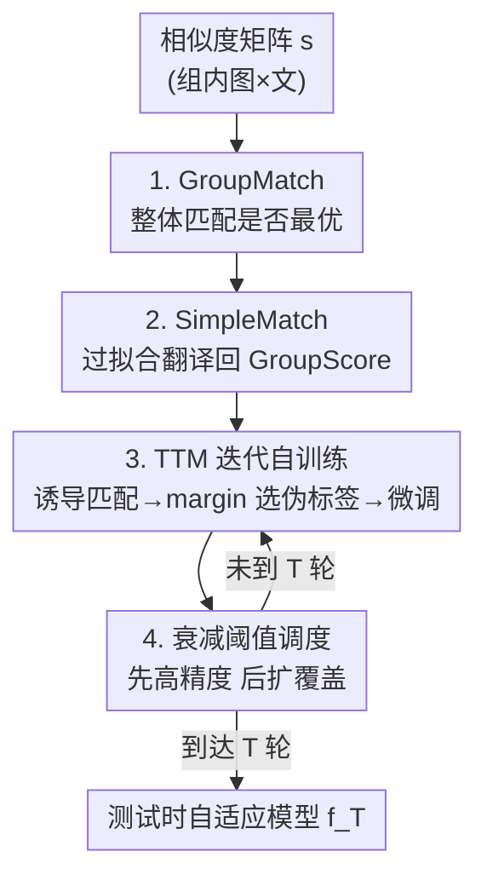

# Test-Time Matching: Unlocking Compositional Reasoning in Multimodal Models

**会议**: ICLR 2026  
**OpenReview**: [https://openreview.net/forum?id=wWxdT6LB2D](https://openreview.net/forum?id=wWxdT6LB2D)  
**代码**: https://github.com/yinglunz/test-time-matching （有）  
**领域**: 多模态VLM / 组合推理 / 测试时自训练  
**关键词**: 组合推理, 评估指标矫正, 测试时匹配, 伪标签自训练, GroupMatch

## 一句话总结
本文指出多模态模型在组合推理基准上"接近随机猜测"很大程度是**评估指标人为压低**造成的假象，提出更忠实的 GroupMatch 指标 + 把它翻译回标准指标的 SimpleMatch，再叠加一个无需外部监督、迭代自训练的 Test-Time Matching（TTM）算法，让 SigLIP-B16 在 MMVP-VLM 上反超 GPT-4.1、GPT-4.1 在 Winoground 上首次超过人类估计水平。

## 研究背景与动机
**领域现状**：组合推理（把物体、属性、关系等基本元素系统地组合起来理解新配置）被视为检验前沿 AI 模型的硬指标。主流基准（Winoground、MMVP-VLM、ColorSwap、SugarCrepe、WhatsUp 等）把样本组织成小组：一组里有 $k$ 张图和 $k$ 条文字，它们只在细微而系统的地方不同（如 Winoground 的两条 caption 用词完全相同、只是语序不同），模型必须把组内图文正确对齐。

**现有痛点**：在这些基准上，无论是对比式视觉-语言模型（CLIP、SigLIP）还是多模态大模型（GPT-4 系列），被反复报告为"等于甚至低于随机猜测"。Winoground 上人类估计水平是 85.5，而此前 SOTA 只有 58.75（靠 scaffolding + prompt tuning GPT-4V）。这与现代多模态系统在实际应用中的强表现严重矛盾。

**核心矛盾**：作者怀疑问题不在模型，而在**评估指标本身**。被广泛使用的 GroupScore 要求每个对角相似度 $s_{ii}$ 同时是其所在行和列的最大值——对 $k\times k$ 组这是 $2k^2-2k$ 个约束，极其苛刻。在随机猜测下，$P(\text{GroupScore}=1)=\frac{(k-1)!}{(2k-1)!}$，$k=2$ 时仅 $1/6$，把本来"匹配判断正确"的模型也大量误判为错。

**本文目标**：(1) 设计一个不引入额外苛刻约束、能忠实反映模型能力的指标；(2) 在不引入外部监督的前提下，进一步把测试集上的真实能力压榨出来。

**切入角度**：评判组合推理本质是"图文整体匹配"问题，而不是"逐对孤立比较"。只要模型给出的**整体匹配**（一个双射）让真值配对的总相似度最大，就该算它会做。

**核心 idea**：用"整体匹配是否最优"（GroupMatch）替代"逐对都要碾压"（GroupScore）来度量能力；再用模型自己诱导的匹配当伪标签、在测试时迭代自训练，把隐藏能力进一步放大。

## 方法详解

### 整体框架
方法分两层。**第一层是评估矫正**：对每组图文，模型先算出相似度矩阵 $s$，用 GroupMatch（看整体匹配是否最优）替代 GroupScore，立刻揭示出被旧指标埋没的大量能力；再用 SimpleMatch 的一个"过拟合"小步，把 GroupMatch 下的正确性等价地转回标准 GroupScore，使结果可与历史 SOTA 直接对比。**第二层是测试时自提升**：把模型在每组上诱导出的最优匹配当伪标签，按置信度（margin）筛选后微调模型，迭代 $T$ 轮，并用一个**从高到低衰减的阈值调度**在"精度"和"覆盖率"之间动态平衡。整个 TTM 全程不碰任何外部标注，最后还能推广到没有分组结构的全局匹配设定。

### 关键设计

**1. GroupMatch：用整体最优匹配替代逐对碾压**

GroupScore 的苛刻来自它要求对角元在行、列双向都最大，等价于强加 $2k^2-2k$ 个约束，导致随机基线被压到 $\frac{(k-1)!}{(2k-1)!}$ 这种极低值，从而系统性地低估模型。GroupMatch 换一个视角：只考虑所有从图到文的双射 $\pi$，看真值匹配 $\pi^\star:i\mapsto i$ 的总相似度是不是严格最大：

$$\text{GroupMatch}(s)=\mathbb{1}\Big[\sum_{i=1}^{k}s_{i,\pi^\star(i)}>\sum_{i=1}^{k}s_{i,\pi(i)},\ \forall\pi\neq\pi^\star\Big]$$

$k=2$ 时这就简化成一条直观条件 $s_{11}+s_{22}>s_{12}+s_{21}$。因为 $k!$ 种匹配在随机猜测下等可能成为最优，所以随机基线变成 $P(\text{GroupMatch}=1)=1/k!$，对所有 $k>1$ 都严格高于 GroupScore（$k=2$ 从 $1/6$ 升到 $1/2$）。这说明 GroupMatch 去掉了"逐对都要赢"这类不必要约束，只保留"整体对齐是否正确"这个真正该考的能力。它还能自然推广到 $m\times k$ 矩形组（用单射匹配），并且在 $1\times k$ 组上与 GroupScore 完全重合——这一点很关键，意味着后面 TTM 在 $1\times k$ 上的提升不是指标红利，而是真实能力提升。

**2. SimpleMatch：一步过拟合把 GroupMatch 翻译回标准指标**

GroupMatch 虽更忠实，但和历史结果不可比（大家都用 GroupScore 报数）。作者观察到一个等价性：只要模型在 GroupMatch 下选对了匹配 $\pi^\star$，那么**在测试时把模型过拟合到这个匹配上**，就能保证它在 GroupScore 下也拿满分。也就是说，"GroupMatch 正确"可以无损地转成"GroupScore 正确"。SimpleMatch 就是这两步：(i) 用 GroupMatch 选出最可能的匹配，(ii) 过拟合到该匹配以转移收益。它不需要任何额外数据，却把大量隐藏能力直接变现：SigLIP-B16 在 Winoground 从 10.25→67、MMVP-VLM 从 22.96→81.48、ColorSwap 从 30.33→88；GPT-4.1 在 Winoground 从 69.75→91.38，**首次越过 85.5 的人类估计水平**。这一步证明此前"低于随机"的结论很大程度是指标制造的假象。

**3. TTM：用模型自己诱导的匹配做伪标签，迭代自训练**

SimpleMatch 揭示了隐藏能力，但模型权重本身没变好。TTM（Algorithm 1）进一步在测试时迭代自提升、全程零外部监督。第 $t$ 轮中，当前模型 $f_{t-1}$ 为每组诱导最优匹配 $\pi_{f_{t-1}}(G)=\arg\max_\pi s(\pi;G,f_{t-1})$ 当伪标签（2×2 组就是比 $s_{11}+s_{22}$ 与 $s_{12}+s_{21}$ 谁大；$1\times k$ 组就是选相似度最高的 caption）。它不盲信所有伪标签，而是用**匹配 margin**衡量置信度——最优匹配总分与次优匹配总分之差：

$$\Delta(G;f_{t-1})=s(\pi_{f_{t-1}}(G);G,f_{t-1})-\max_{\pi\neq\pi_{f_{t-1}}(G)}s(\pi;G,f_{t-1})$$

只有 $\Delta\geq\tau_t$ 的组才进入伪标签集 $S_t$，然后在 $S_t$ 上微调得到 $f_t$，重复 $T$ 轮。这样模型在测试集上逐步自我增强，把 SimpleMatch 之上的剩余能力也挖出来：SigLIP-B16 反超 GPT-4.1 在 MMVP-VLM 上建立新 SOTA。该思想还能推广到无分组数据——把整个数据集当成一个全局匹配问题，用匈牙利算法解 $\pi_f=\arg\max_\pi\sum_i s_{i,\pi(i)}$，并把阈值从"组级 margin"改成"单对相似度分位"，迭代逻辑保持一致。

**4. 衰减阈值调度：先保精度、后扩覆盖**

任何伪标签方法都要在两类错误间权衡：阈值低→选得多但假阳性多（精度差），阈值高→干净但假阴性多（覆盖少、收益早早饱和）。TTM 的关键经验是采用**衰减调度** $\tau_{t+1}<\tau_t$：开局用高阈值只收高置信、几乎无假阳性的伪标签，随着模型变强再逐步放低阈值扩大覆盖、消化假阴性。作者对比了三种调度——上升（早期混入大量假阳性，第一轮就把模型带偏，几乎无增益）、恒定（避开早期假阳性但后期假阴性堆积、过早 plateau）、衰减（最优）。实践配方是：初始 $\tau_1$ 让约 15%–30% 的组被匹配，末轮 $\tau_T$ 让 >90% 测试集被覆盖；cosine 和线性衰减都好用。运行开销为 $O(T\cdot C_{f_t})$，$T=3$ 或 $10$ 这种小迭代数即可见显著提升，与常规 test-time training 量级相当。

### 一个完整示例
以 Winoground 上一个 2×2 组为例：模型先算出 $2\times2$ 相似度矩阵。**旧指标视角**：GroupScore 要求 $s_{11}>s_{12},s_{21}$ 且 $s_{22}>s_{12},s_{21}$ 全部成立，稍有一项不满足就判 0——这就是"看起来像随机"的来源。**GroupMatch 视角**：只需 $s_{11}+s_{22}>s_{12}+s_{21}$，模型其实大概率满足，于是判对。**SimpleMatch**：把模型过拟合到 $(1\!\to\!1,2\!\to\!2)$ 这个匹配，让它在 GroupScore 下也拿满分。**TTM**：把全数据集里 margin $\Delta\geq\tau_1$（高阈值，约 15%–30% 组）的诱导匹配收为伪标签微调一轮；下一轮模型更强、阈值降低，覆盖到 >90% 的组；几轮后 SigLIP-B16 在 Winoground 的 GroupMatch 成绩从 67 升到 72.5。

### 损失函数 / 训练策略
TTM 微调用的是模型原生的对齐目标：对比式模型（CLIP/SigLIP）直接在伪标注的正确图文配对上微调；生成式 MLLM（SmolVLM-256M）则用 VQAScore（prompt 形如"`<image> Does this image show "<text>"? answer Yes/No`"）计算相似度，伪标签里同时包含 "Yes"（匹配对）和 "No"（同组内错配图文构成的硬负例），无需额外数据源。关键超参是迭代轮数 $T$（如 3 或 10）和阈值调度 $\{\tau_t\}$（衰减，初始覆盖 15%–30%、末轮 >90%）。

## 实验关键数据

### 主实验
覆盖 16 个数据集变体（2×2、1×k、无分组三类结构），所有结果跑 4 次随机取均值。三大 2×2 基准（SigLIP-B16，GroupScore→SimpleMatch→TTM）：

| 数据集 / 模型 | Raw | SimpleMatch | TTM | TTM vs SimpleMatch |
|--------------|-----|-------------|-----|--------------------|
| Winoground / GPT-4.1 | 69.75 | 91.38 | — | 首超人类 85.5 |
| Winoground / SigLIP-B16 | 10.25 | 67.00 | 72.50 | +5.5（误差↓16.7%） |
| MMVP-VLM / GPT-4.1 | 68.15 | 88.52 | — | — |
| MMVP-VLM / SigLIP-B16 | 22.96 | 81.48 | 89.44 | +8.0（误差↓43.0%），反超 GPT-4.1 |
| ColorSwap / SigLIP-B16 | 30.33 | 88.00 | 94.25 | +6.3（误差↓52.1%） |
| ColorSwap / SigLIP-L16 | 37.00 | 91.33 | 96.08 | +4.8（误差↓54.8%），追平 GPT-4.1 |

此前 SOTA：Winoground 58.75、MMVP 70.7（GPT-4o 多智能体+工具）、ColorSwap 87.33（无训练集）。SimpleMatch 一步就把 SigLIP-B16 推过所有历史 SOTA。

无指标红利的 1×k 基准（GroupScore 与 GroupMatch 重合，提升纯靠 TTM）：SugarCrepe（1×2）四个子集均提升（如 Replace Relation 70.5→76.2，Add Attr 83.7→89.0）；WhatsUp（1×4）相对增益高达 **+85.7%**（CLIP-B32 在 WhatsUp A 30.6→56.8）。把 WhatsUp 转成 2×2 方向变体后，TTM 相对增益最高 135.1%、相对误差降低 95.5%。

### 消融实验

| 配置 | 关键发现 | 说明 |
|------|---------|------|
| Decay 阈值调度 | Winoground 67.0→72.5（最佳） | 先高精度后扩覆盖 |
| Constant（固定 τ=2.0） | 67.0→70.1 | 早期无假阳性，但后期假阴性多、过早 plateau |
| Ascend（0→2.0 递增） | 67.0→67.0（无增益） | 首轮即过拟合到全部伪标签，被假阳性带偏 |
| Baseline（无 TTM） | 67.0 | GroupMatch 起点 |

生成式模型 SmolVLM-256M：TTM 在 MMVP-VLM（76.30→81.67）、ColorSwap（80.00→85.17）上较 SimpleMatch 仍有明显增益，说明方法不限于对比式模型。无分组全局变体（SigLIP-B16）：即便丢掉分组结构、用全局匈牙利匹配，也显著超过原始 GroupScore（如 ColorSwap 30.33→88.00），叠加全局 TTM 进一步到 92.00（相对误差降低 33.3%）。

### 关键发现
- **指标是主要"假象来源"**：同一模型同一数据集，换指标结果天差地别——GroupScore 把组合推理能力系统性压到接近随机，GroupMatch 一矫正就揭示大量隐藏能力。
- **阈值调度方向是 TTM 成败关键**：必须衰减；上升调度因早期假阳性几乎零增益，恒定调度后期饱和。
- **TTM 的增益是真本事**：在 1×k 这种无指标红利的设定下仍有最高 85.7% 相对提升，且对生成式模型、无分组全局设定都有效。
- **绝对增益看似小、实则显著**：TTM 在 Winoground 上对 SimpleMatch 的 +5.5 远超历史上 scaffolding GPT-4V 的 +1.25。

## 亮点与洞察
- **"模型没那么差，是尺子有问题"**：把一个长期被当作"模型能力缺陷"的现象，重新归因到评估指标的过度约束，并给出可证明的随机基线对比（$\frac{(k-1)!}{(2k-1)!}$ vs $1/k!$），这种"重新审视评测"的视角极具启发性。
- **指标可翻译性很巧**：GroupMatch 正确性能通过一步过拟合无损转成 GroupScore 正确性，使新指标既忠实又能和历史结果直接比较，避免"换个尺子刷分"的质疑。
- **margin 选伪标签 + 衰减阈值**这套自训练配方可迁移：任何"模型能诱导出结构化预测、且预测置信度可量化"的测试时自提升任务（不止组合推理）都能套用——先收高 margin 的干净伪标签、随模型变强再放低门槛扩覆盖。
- 用同组内错配图文当生成式模型的硬负例，零成本造负样本，是个实用 trick。

## 局限与展望
- **本质是 test-time / transductive**：TTM 在测试集上自训练，得到的 $f_T$ 是对当前测试分布的自适应模型，论文未充分讨论其对全新分布的泛化与是否会过拟合测试集统计量。
- **依赖"组内有唯一正确匹配"的结构假设**：全局变体要求 $|S_I|\leq|S_C|$ 且一一对应，现实开放检索中图文非一一对应时如何处理尚不明确。
- **指标矫正的边界**：GroupMatch 在 1×k 上与 GroupScore 重合，意味着"指标红利"只在 $k\times k$ 组存在；对真正困难、整体匹配也判错的样本，矫正无能为力，仍需 TTM 这类自训练补足。
- **阈值配方偏经验**：初始覆盖 15%–30%、末轮 >90% 是实验调出来的，缺乏自动选取阈值调度的理论指导。作者也指出两个未来方向：重新校准评测协议、把 TTM 推广到组合推理之外的多模态/语言任务。

## 相关工作与启发
- **vs GroupScore（Thrush et al. 2022 等）**：旧指标要求逐对双向碾压，强加 $2k^2-2k$ 约束、随机基线极低；本文 GroupMatch 只看整体匹配最优，去掉冗余约束、更忠实，且可翻译回 GroupScore，本文优势是既矫正又可比。
- **vs scaffolding / prompt tuning GPT-4V（Wu et al.；Vaishnav & Tammet）**：他们靠提示工程在 Winoground 上从 50.75 提到 52（+1.25），本文 SimpleMatch 直接把 GPT-4.1 推到 91.38、首超人类，且无需额外数据，提升幅度与机制都更本质。
- **vs 标准 test-time training（Sun et al. 2020；Akyürek et al. 2025）**：同属测试时自适应，但本文创新在于伪标签来自"匹配诱导"而非辅助自监督任务，并用 margin + 衰减阈值控制伪标签质量，运行开销与常规 TTT 同量级。

## 评分
- 新颖性: ⭐⭐⭐⭐⭐ 把"组合推理失败"重新归因到评测指标，并给出可证明、可翻译的矫正 + 测试时匹配自训练，视角与方法都新。
- 实验充分度: ⭐⭐⭐⭐⭐ 覆盖 16 个数据集变体、对比/生成两类模型、含调度消融与无分组全局变体，4 次随机取均值。
- 写作质量: ⭐⭐⭐⭐⭐ 命题与随机基线推导清晰，主图直观，三层方法（GroupMatch→SimpleMatch→TTM）层层递进。
- 价值: ⭐⭐⭐⭐⭐ 既刷新多个 SOTA、首超人类，又给评测协议与测试时自提升提供可迁移范式。

<!-- RELATED:START -->

## 相关论文

- [\[ICLR 2026\] ProxyThinker: Test-Time Guidance Through Small Visual Reasoners](proxythinker_test-time_guidance_through_small_visual_reasoners.md)
- [\[ICLR 2026\] Unleashing Perception-Time Scaling to Multimodal Reasoning Models](unleashing_perception-time_scaling_to_multimodal_reasoning_models.md)
- [\[CVPR 2026\] UniT: Unified Multimodal Chain-of-Thought Test-time Scaling](../../CVPR2026/vlm_reasoning/unit_unified_multimodal_chain-of-thought_test-time_scaling.md)
- [\[ICLR 2026\] CompoDistill: Attention Distillation for Compositional Reasoning in Multimodal LLMs](compodistill_attention_distillation_for_compositional_reasoning_in_multimodal_ll.md)
- [\[CVPR 2026\] Scaling Test-Time Robustness of Vision-Language Models via Self-Critical Inference Framework](../../CVPR2026/vlm_reasoning/scaling_test-time_robustness_of_vision-language_models_via_self-critical_inferen.md)

<!-- RELATED:END -->
