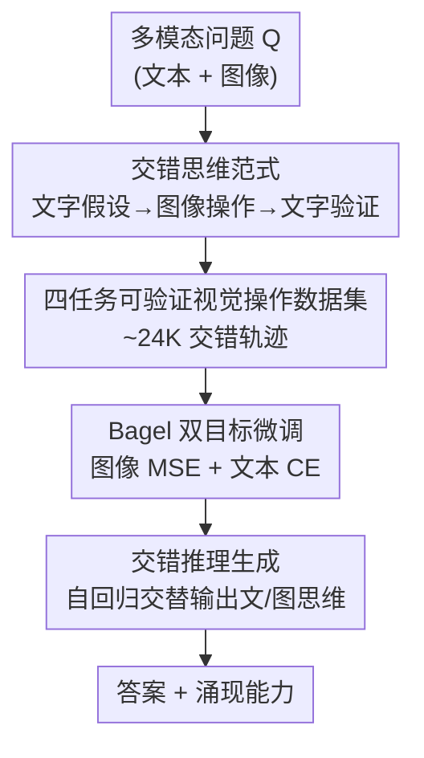

# ThinkMorph: Emergent Properties in Multimodal Interleaved Chain-of-Thought Reasoning

**会议**: ICLR 2026  
**OpenReview**: [https://openreview.net/forum?id=mB3vxfrQZM](https://openreview.net/forum?id=mB3vxfrQZM)  
**代码**: https://github.com/ThinkMorph/ThinkMorph  
**主页**: https://thinkmorph.github.io  
**领域**: 多模态VLM / LLM推理  
**关键词**: 交错思维链, 多模态推理, 统一模型, 视觉操作, 涌现能力

## 一句话总结
ThinkMorph 提出"文本与图像应当是互补而非同构的思维模态"这一原则，在一个统一多模态模型（Bagel-7B）上用约 24K 条精心构造的交错推理轨迹微调，让模型学会"先文字假设→再具体操作图像→再文字验证"的交错推理，视觉密集任务上平均比基座提升 34.7%，并涌现出训练中未见的视觉操作、自主切换推理模式、测试时扩展更优等高阶多模态智能。

## 研究背景与动机

**领域现状**：多模态推理不是一次性的感知任务，而是需要语言与视觉反复协同的迭代过程。纯文本思维链（text CoT）虽然推进了语言推理，但对"必须动手摆弄视觉内容"的任务（空间推理、拼图、精细识别）几乎没有帮助——模型只会描述图片，不会"在脑子里画草图"。

**现有痛点**：为了模拟人类"边想边画"（think-and-sketch）的能力，已有两类做法都不理想。一类是**工具增强**：调用外部裁剪工具或专门的草图模型，推理过程间接、脆弱，依赖外部模块拼接。另一类是**统一模型**自己生成图像思维，但还没有一套能让文字推理和图像推理"互相促进"的通用配方。典型反例是 MVoT：它在走迷宫任务里引入交错的动作表示，但文字部分只是和生成图像**同构**（isomorphic）的简单动作标签，换个领域就失效。

**核心矛盾**：什么才算"有意义的交错思维链"始终没说清。如果文字和图像只是同一信息的两种等价表达（同构），交错就是冗余；只有当两种模态各自提供对方给不了的线索时，交错才真正推进推理。

**本文目标**：构造一种文字与图像**互补**的交错推理范式，让模型既保持连贯的语言逻辑，又能具体地操纵视觉内容，并且能泛化到训练领域之外。

**切入角度**：作者假设文本思维和图像思维应当像人类解题时那样分工——文字负责抽象假设与验证，图像负责把假设"画出来"提供整体空间上下文。围绕这个原则去**设计数据**，而不是堆数据量。

**核心 idea**：用"互补而非同构"的原则构造约 24K 条交错轨迹（文字假设→视觉操作→文字验证），在统一模型上做双目标微调，把文字推理和视觉操作绑成"手拉手往前走"的解题过程。

## 方法详解

### 整体框架

ThinkMorph 把一个统一多模态模型 $P_\theta$ 用于交错推理。对一个可能同时含文本和图像的多模态问题 $Q=(Q_\text{text}, Q_\text{img})$，模型生成一串交错的思维 token 序列 $T=(\hat{m}_1, \hat{m}_2, \dots, \hat{m}_n)$，其中每个 $\hat{m}_i \in \{\hat{t}_i, \hat{v}_i\}$ 要么是文本 token 要么是图像 token，由分隔符 token（`<image_start>` / `<image_end>`）控制模态切换。和只输出文本 token 的常规 CoT 不同，ThinkMorph 还能在推理中途生成图像 token，真正"画"出中间状态。

整条管线分三步：先依照"互补而非同构"的交错思维范式确定轨迹结构（文字假设→图像操作→文字验证）；据此在四类视觉参与度不同的任务上构建约 24K 条高质量交错轨迹数据集；最后在 Bagel-7B 基座上用图像/文本双目标微调。推理时模型自回归地交错生成文本与图像思维，最终给出答案。

### 关键设计

**1. 交错思维范式：文字与图像互补而非同构**

针对"什么才算有意义的交错"这一根本痛点，作者把每条交错轨迹固定成"**文字假设 → 视觉操作 → 文字验证**"的三段式分工，让两种模态各干各的活、互相补位，而不是互为翻版。以四个任务为例：拼图（Jigsaw Assembly）里，开头的 $\hat{t}$ token 逐块描述每块拼图的局部内容，随后的 $\hat{v}$ token 按当前排列假设 $\sigma$ 把重排后的拼图**画出来**，提供文字给不了的整体空间上下文，最后的 $\hat{t}$ token 对重建结果做一致性验证；空间导航里，文字先建立粗粒度全局抽象，图像渲染出路径 $\pi^\star$ 的轨迹（红线+箭头叠加在迷宫上），文字再逐步复核移动序列；视觉搜索里，文字先假设目标区域，图像画出红色边界框作显式锚点，文字再确认目标属性。这种安排的关键在于：图像 token 承担的是"文字单独表达不了的步骤"（重排后的拼图暴露错位、叠加箭头验证路线、边界框定位物体），所以交错才有信息增益。实验也证实，当文字已能识别解题关键元素时（如 ChartQA），后续视觉高亮只是锦上添花；而当线索是文字说不清的空间朝向时（如 MMVP 判断"鸭子朝左还是朝右"），视觉操作就从可选变成必需。

**2. 四任务可验证视觉操作数据集：把"视觉思维"落到可验证的具体操作上**

视觉思维难以外显，是数据难以规模化的根源。作者的解法是只选**支持具体、可验证的中间视觉操作**的四类任务来造数据：拼图装配（可视化重排后的碎片）、空间导航（用红线和箭头叠加路径）、视觉搜索（红框高亮区域）、图表重聚焦（红框/叠加高亮相关数据）。每类各约 6K 条，合计 24,990 条。拼图和导航的题目由自定义合成流水线生成；视觉搜索和图表重聚焦则走"MLLM + 人在回路"的过滤流程。质量控制相当激进——以视觉搜索为例，作者发现已有 Visual CoT 数据集（GQA、VSR）里大量题目表述含糊、答案有误或高亮了无关物体，于是强制约束"目标物体的边界框面积必须占整图的 1%–30%"，把数据从 144K 筛到 6,990 条高质量样本。正因每个视觉操作都对应一个可核验的中间结果，"互补"才不会沦为乱画。此外还从交错轨迹派生出两条单模态基线：纯文本思维（用 GPT-4.1 逐步求解）和纯视觉思维（只取交错轨迹的图像输出），用于后续模态对比。

**3. Bagel 双目标微调：在统一模型上同时优化文本与图像 token**

要让一个模型既生成连贯文字又生成有意义的图像，必须对两类 token 用不同的监督。作者以 Bagel 为基座，按其官方实现训练，优化**双目标**：图像 token 用均方误差损失 $L_\text{img}$（MSE），文本 token 用负对数似然 $L_\text{text}$（CE）。这样同一序列里，文字部分按语言建模优化、图像部分按重建优化，两路梯度共同塑造出"文字逻辑+视觉操作"协同的统一表示。值得注意的是，作者刻意**只用 24K 数据**做轻量微调——之所以小数据也能大幅泛化，是因为视觉操作的"原始能力"来自 Bagel 大规模多模态预训练，交错微调起的是**对齐**作用：把这些零散的操作能力激活并引导到结构化的解题步骤里（预训练供给原料，交错微调指明方向）。

### 一个完整示例：图表数值差计算（Chart Refocus）

以问题"图中最高和第二高的柱子数值差是多少？"为例走一遍流程：① 文字假设阶段——模型先识别出三个国家的可支配收入柱按降序排列，锁定 Austria（最高 24,770.5）和 Norway（次高 24,688.3）这两个解题关键元素；② 视觉操作阶段——模型生成一张把 Austria 和 Norway 两根柱子用红框高亮的图，把注意力锚定到相关数据点；③ 文字验证阶段——基于高亮图复核数值并计算 $24770.5 - 24688.3 = 82.2$，给出答案 82.2。这个例子恰好展示了"互补"的一种极端形态——**前置视觉参与**（front-loaded visual engagement）：关键信息在文字阶段就已识别，视觉高亮是补充而非必需。对照之下，在 MMVP 判断"鸭子嘴朝左还是朝右"时，文字无法表达朝向线索，视觉高亮就成了主导推理的必需环节。

## 实验关键数据

### 主实验：泛化到广域视觉中心任务（vs 各类大模型）

在 24K 全任务交错数据上微调后，ThinkMorph-7B 与十个主流模型对比（★为域外基准），相对基座 Bagel-7B 在九项任务上平均提升 20.74%：

| 基准 | Bagel-7B | ThinkMorph-7B | Δ vs Bagel | 对照 |
|------|----------|---------------|-----------|------|
| VSP | 0.83 | 75.83 | +75.00 | 基座几乎失败 |
| VisPuzzle | 35.00 | 79.00 | +44.00 | 域内拼图 |
| ChartQA | 61.82 | 78.10 | +16.28 | — |
| VStar ★ | 55.49 | 67.02 | +11.53 | — |
| BLINK-J ★ | 67.33 | 72.00 | +4.67 | — |
| MMVP ★ | 70.33 | 80.33 | +10.00 | 持平 Gemini 2.5 Flash (80.33) |
| SAT ★ | 44.67 | 52.67 | +8.00 | 超 InternVL3.5-38B (49.33) |
| BLINK ★ | 47.66 | 60.07 | +12.41 | — |
| CV-Bench ★ | 76.03 | 80.82 | +4.79 | — |

仅用 7B 参数 + 24K 数据，ThinkMorph 在 SAT 空间推理上（52.67）超过大得多的 InternVL3.5-38B（49.33），在 MMVP 感知（80.33）追平 Gemini 2.5 Flash；相比同为统一模型的 Janus-Pro-7B、Chameleon-7B（VStar 仅 38.22 / 28.27，SAT 接近 0），优势达 28.8%–42.7%。

### 模态对比实验：交错 vs 纯文本 vs 纯视觉

在同一基座上分别用三种模式微调（★为域外）：

| 模式 | VSP | VStar★ | VisPuzzle | BLINK-J★ | ChartQA | MMVP★ |
|------|-----|--------|-----------|----------|---------|-------|
| Bagel-7B（基座） | 0.83 | 55.49 | 35.00 | 67.33 | 62.05 | 70.33 |
| 纯文本 | 49.17 | 56.02 | 63.50 | 68.67 | **81.66** | 76.33 |
| 纯视觉 | 85.50 | 58.63 | 61.25 | 47.33 | 73.08 | 73.00 |
| 交错（ThinkMorph） | **86.67** | **63.87** | **73.75** | **73.33** | 79.78 | **82.66** |

交错推理在视觉中心任务上几乎全面领先，平均比基座提升 34.74%，比次优模式高 5.33%。最戏剧性的是空间导航：基座 0.83% 几近全错，交错推理拉到 86.67%（+85.84%）。唯一例外是域内 ChartQA，纯文本反超交错 1.88%——因为文字已能识别关键数据，验证了"需不需要交错取决于任务是否真的需要视觉线索"。

### 关键发现（三大涌现能力）

- **涌现能力 1——未见过的视觉操作**：模型在域外任务上自发产生训练数据里没有的视觉操作，作者识别出八类（zoom-in 最常见，还有 inpainting、多框、运动预测、透视变换、区域裁剪等），在某些基准上可占推理时全部视觉操作的 10%。这些操作不是随机噪声而是任务有效的：问"灯笼椒是红还是黄"时模型会自动放大局部以分辨细微色差。统计上特定文字线索可靠触发特定操作（"examine closely"/"focus on"→zoom-in，"restore"/"reconstruct"→inpainting）。
- **涌现能力 2——自主切换推理模式**：尽管只在交错数据上训练，模型在约 5.3% 的推理样本上自主切回纯文本推理；这些切换样本准确率 81.25%，比强行用交错推理同批样本（73.96%）高 7.29%，且若强制继续交错会多消耗约 75% token（156 vs 89）。说明模型隐式学会"初始视觉编码已够用时就走文字、省算力"。
- **涌现能力 3——测试时扩展更优**：Best-of-N 采样下交错推理因轨迹多样性更高而扩展更稳，分布偏移越大优势越明显——在最难的 BLINK-J 上从 65.33% 涨到 73.33%（+8.0%），同时纯视觉反而掉 2.0%、纯文本只涨 2.67%，交错与纯视觉拉开约 10 个点。

## 亮点与洞察
- **"互补而非同构"是一句能落地的原则**：它不仅是口号，而是直接决定了数据轨迹该长成"文字假设→视觉操作→文字验证"的样子，也解释了为何 MVoT 式同构标签泛化不了——这种"原则驱动数据设计"的思路很值得迁移到其他需要多模态协同的任务。
- **小数据微调能激活预训练里的"沉睡技能"**：24K 数据就让模型涌现出 8 类未见过的视觉操作，作者的解释（预训练供原料、交错微调指方向）把"涌现"落到了机制层面，比单纯报告分数更有说服力。
- **自主切换模式同时带来准确率和效率双赢**：切回文本不仅更准还省 75% token，这提示"何时该用哪种模态"本身可以是一种被学到的元能力，可迁移到 agent 的工具/模态调度上。
- **用可验证视觉操作约束数据质量**：强制 bbox 占图 1%–30%、把 144K 砍到 6,990，这种"宁缺毋滥"的过滤方式是高质量多模态推理数据的可复用 trick。

## 局限与展望
- **任务范围仍偏视觉中心**：四类训练任务都强依赖具体可视化操作，对"无明显视觉操作可言"的抽象推理（如纯数学、常识）能否同样受益尚未验证。
- **域内 ChartQA 上交错反被纯文本超越**：说明交错并非万灵药，对视觉信息冗余的任务反而增加开销；如何让模型更早判断"该不该交错"仍有空间（涌现能力 2 只是部分解决）。
- **依赖统一模型的图像生成能力**：双目标微调建立在 Bagel 既有的图像 token 生成能力上，换到不具备强生成能力的基座上效果可能打折。
- **涌现能力的可控性有限**：未见过的视觉操作虽然多数有效，但作者也承认是"自发"产生，缺乏对其触发与正确性的显式控制，可靠性在高风险场景存疑。

## 相关工作与启发
- **vs MVoT**：MVoT 在迷宫任务引入交错动作表示，但文字部分是与图像同构的简单动作标签，换领域即失效；ThinkMorph 强调文字与图像互补、各自承担不同推理职责，因此能泛化到大量域外基准。
- **vs 工具增强的交错推理（如裁剪/草图模型）**：那类方法靠外部视觉模块拼接，过程间接脆弱；ThinkMorph 在单一统一模型内端到端生成图像思维，避免了外部依赖。
- **vs 纯文本 CoT**：文本 CoT 只能描述图像、无法操纵视觉内容，在空间/精细识别任务上几乎无增益；ThinkMorph 让图像 token 承担"文字表达不了的步骤"，从根本上补齐了视觉操作环节。

## 评分
- 新颖性: ⭐⭐⭐⭐⭐ "互补而非同构"的原则清晰且能落地，三大涌现能力的发现有启发性
- 实验充分度: ⭐⭐⭐⭐ 模态对比 + 域外泛化 + 测试时扩展三层验证扎实，但任务范围偏视觉中心
- 写作质量: ⭐⭐⭐⭐⭐ 原则—数据—训练—涌现层层递进，案例图文并茂
- 价值: ⭐⭐⭐⭐⭐ 为统一模型的多模态交错推理提供了可复制的配方和分析视角

<!-- RELATED:START -->

## 相关论文

- [\[CVPR 2026\] Grounded Chain-of-Thought for Multimodal Large Language Models](../../CVPR2026/vlm_reasoning/grounded_chain-of-thought_for_multimodal_large_language_models.md)
- [\[ICLR 2026\] CoPRS: Learning Positional Prior from Chain-of-Thought for Reasoning Segmentation](coprs_learning_positional_prior_from_chain-of-thought_for_reasoning_segmentation.md)
- [\[CVPR 2026\] UniT: Unified Multimodal Chain-of-Thought Test-time Scaling](../../CVPR2026/vlm_reasoning/unit_unified_multimodal_chain-of-thought_test-time_scaling.md)
- [\[CVPR 2026\] Reinforcing Structured Chain-of-Thought for Video Understanding](../../CVPR2026/vlm_reasoning/reinforcing_structured_chain-of-thought_for_video_understanding.md)
- [\[CVPR 2026\] When Visualizing is the First Step to Reasoning: MIRA, a Benchmark for Visual Chain-of-Thought](../../CVPR2026/vlm_reasoning/when_visualizing_is_the_first_step_to_reasoning_mira_a_benchmark_for_visual_chai.md)

<!-- RELATED:END -->
