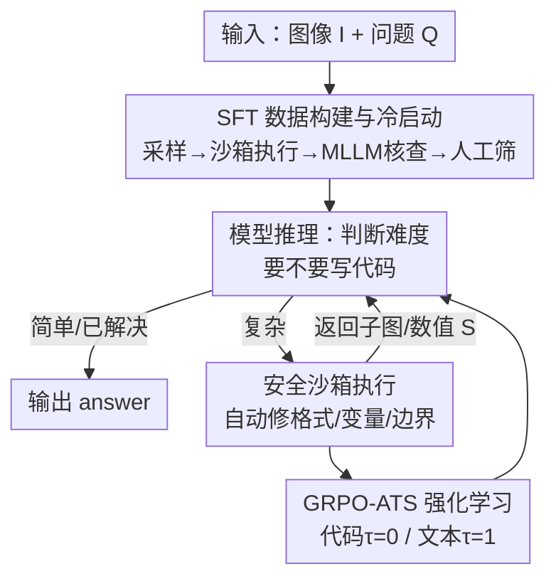

# Thyme: Think Beyond Images

**会议**: ICLR 2026  
**OpenReview**: [https://openreview.net/forum?id=gCWLkqK45O](https://openreview.net/forum?id=gCWLkqK45O)  
**领域**: 多模态VLM / LLM推理  
**关键词**: 视觉思考, 代码执行, 图像操作, 强化学习, 自适应温度采样

## 一句话总结
Thyme 让多模态大模型在推理过程中自主**生成并执行代码**来完成裁剪、旋转、对比度增强等图像操作和数学计算，通过「50 万 SFT 冷启动 + GRPO-ATS 强化学习」两阶段训练激活这一能力，在近 20 个 benchmark（尤其高分辨率感知与复杂推理）上稳定超过 Qwen2.5-VL 基线。

## 研究背景与动机

**领域现状**：在 OpenAI 提出「thinking with images」后，让多模态大模型（MLLM）把视觉信息纳入推理过程成为热点。现有开源方案大致分两类：一类是 **thinking with generated images**——先生成一张辅助图（如画辅助线）再推理；另一类是 **thinking with cropping**——训练模型输出 bounding box 选出关键区域，由外部裁剪后再喂回模型。

**现有痛点**：生成图像类方法受制于生成质量，难以保留原图细粒度细节，对核心感知任务帮助有限，且生成开销大、推理延迟高；裁剪类方法功能太单一，只能「输出框→裁剪」，做不了旋转、对比度增强、更做不了代码计算，远不及 OpenAI O3 那种「想怎么操作图就怎么操作、还能写代码算数」的丰富度。

**核心矛盾**：开源世界缺一套既**功能丰富**（多种图像操作 + 数学计算）又**高度自主**（模型自己决定要不要操作、用什么操作、参数取多少）的范式。而把「写代码操作图像」直接塞进训练又有两个现实障碍：代码对采样随机性极敏感（变量名里多一个空格就执行失败），以及图像操作数据远多于数学数据导致模型几乎学不会算数代码。

**本文目标**：用低成本端到端训练，让 MLLM 学会**按需自主生成可执行代码**来操作图像与做计算，并在 RL 阶段保证代码可执行率，避免模型退化成「干脆不写代码」。

**核心 idea**：把「thinking with images」升级为「**think beyond images**」——不再局限于裁剪，而是让模型把任意图像处理/数学运算写成 Python 代码、交给安全沙箱执行、再把结果喂回继续推理；并为代码生成单独设一套采样策略（温度 0），把探索性留给自然语言推理（温度 1）。

## 方法详解

### 整体框架

Thyme 的运行时由两个组件构成：**模型**与**沙箱**。给定图像 $I$ 和问题 $Q$，模型先产出一段思考 $T$，并据问题的类型与难度自主判断是否需要写代码：简单问题（或前几轮代码已解决）直接给 `<answer>`；复杂问题则自主生成 `<code>` 块（可在一次执行里同时做裁剪+缩放+对比度增强等多种操作，所有参数如裁剪坐标、缩放比、增强系数都由模型自己决定）。代码送入外部**安全沙箱**，沙箱在严格时限内执行，并借 Python 的 `ast`/`autopep8` 等模块自动做格式修正、变量属性纠正、边界条件处理——**只修琐碎细节、不改语义**，从而降低模型的「代码负担」、提升可执行率。沙箱把结果 $S$（一张或多张子图、或一个数值）返回，模型基于结果进入下一轮，直到产出最终答案 $a$。一条训练样本因此表示为 $X=\{(I,Q);([T_0,C_0,S_0],\dots,[T_t,a])\}$。

能力的获得靠两阶段训练：先用约 50 万样本做 **SFT 冷启动**教会模型「怎么写代码做各种操作」（仅约 200 GPU 小时即可激活），再用 **GRPO-ATS 强化学习**精修「何时该写、写得对不对」的决策与执行精度。

### 关键设计

**1. SFT 数据构建与训练策略：用可执行性+一致性双重过滤造出 50 万「代码操作图像」冷启动数据**

裁剪类方法的功能单一，根因在于训练数据只教模型「输出框」。Thyme 要让模型学会写任意操作代码，第一步就是从 400 万原始数据里造出约 50 万覆盖六类场景的高质量样本：(a) 无需写代码的图像操作/计算、(b) 复杂或高分辨率图的裁剪、(c) 大角度旋转矫正、(d) 低对比度增强、(e) 需借代码计算来辅助理解的复杂运算、(f) 多轮交互（如迭代放大）。构建管线是「采样数据→按目标功能构造 prompt→MLLM 生成思考与代码→沙箱执行筛掉**不可运行**的代码→另一个 MLLM 核查执行结果是否与思考一致且真能答题→人工复审去低质」，层层过滤保证冷启动数据干净。

训练上针对两个实测坑做专门处理。其一，两轮对话样本里模型常「第一轮写错、第二轮纠正」，导致首轮无效——于是采用 **Train on the Last Round Only**：对两轮及以上样本，把最后一个 `<sandbox_output>` 之前的内容（即所有 $[T_{t-1},C_{t-1},S_{t-1}]$）全部 mask 掉，只学最后一轮的逻辑与结果。其二，沙箱输出本是外部观测而非模型该预测的内容，故 **Sandbox Content Exclusion**：所有 $S_{i=1\dots t}$ 与 `<sandbox_output>` 标记在所有训练阶段都被 mask，防止模型去「背」沙箱结果污染梯度。其三，数学数据远少于图像操作数据、联合训练时几乎学不到计算代码，于是用 **Math Data Annealing**：先在全部图像类数据上训练，再用更低学习率单独在数学数据上退火微调（这一阶段因数学多轮代码轮间相关性弱，改为联合学习所有轮次而非只学最后一轮）。

**2. RL 数据构建：手工标注 3 万张超高分辨率难图，把任务难度顶上去**

公开数据集图像分辨率和感知复杂度都偏低，喂给 RL 时 Thyme 的「放大看清小目标」能力根本用不上、学不动。为此作者一方面从 V*、arXivQA、ThinkLite-VL 等公开源筛感知+推理混合数据（并人工剔除图文不匹配样本），另一方面**手工从互联网收集 3 万张高分辨率图**（宽或高超过 2048 像素以保证复杂度），再由 15 人标注团队为每张图针对**占图 ≤5% 的小而难辨认目标**设计问题——读者必须放大图才能看清，从而强制模型学会调用图像操作。所有标注至少经一轮交叉校验，再由三位多模态专家统一验收。

**3. GRPO-ATS：给代码和文本设不同采样温度，既保代码可执行又保推理多样**

这是本文 RL 阶段的核心算法创新，直击「代码对采样随机性极敏感」的痛点。作者发现代码生成稍有随机扰动（变量名里多个空格、采到非法字符）就整段执行失败；而自然语言推理恰恰需要高温度来鼓励探索。GRPO-ATS（Group Relative Policy Optimization with Adaptive Temperature Sampling）就是一个**上下文感知的温度开关**：模型一旦进入 `<code>` 块就固定采样温度 $\tau=0$ 保证确定性与可执行，其余文本推理则用 $\tau=1$ 鼓励多样探索；这是无额外参数的轻量规则切换。它带来两个收益：一是**提升样本效率**——很多 rollout 因代码混乱不可用、反复生成失败直到耗尽交互步数，降低代码温度能把这些样本救回来变有效；二是**防止模型坍缩成完全不写代码**——写代码本就比文本易错，不调温度时训练 rollout 里多数代码无效，久而久之模型会变保守干脆放弃写代码，降温提高可执行率正好缓解这一退化。

底层 RL 用全 on-policy 的 GRPO：对每个 $(I,Q)$ 采一组轨迹 $\{\tau_1,\dots,\tau_G\}$，按下式更新策略

$$J_{\text{GRPO}}(\theta)=\mathbb{E}\!\left[\frac{1}{\sum_i|\tau_i|}\sum_{i=1}^{G}\sum_{j=1}^{|\tau_i|}\big(A_{i,j}-\beta D_{\text{KL}}[\pi_\theta\|\pi_{\text{ref}}]\big)\right]$$

其中优势 $A_{i,j}=\dfrac{r_i-\text{mean}(\{r_i\})}{\text{std}(\{r_i\})}$ 在组内按最终奖励归一化。关键点是：轨迹长度 $|\tau_i|$ 与 token 求和都**排除沙箱内容** $S_{i,k}$，因为它们是外部观测而非策略模型的输出。

**4. 安全沙箱 + 奖励设计：降低代码负担、并用乘法式奖励防一致性「刷分」**

沙箱不仅是执行器，还主动「兜底」：在严格时限内执行模型代码，用 `ast`/`autopep8` 自动修格式、纠正输入输出变量属性、修边界条件，在不改语义的前提下显著提升可执行率，让模型不必纠结琐碎代码细节。配套还有 Rabin-Karp 滚动哈希的**早停机制**——统计输出中固定长度子串的重复，若某子串累计长度超过总输出 50% 即判为「复读」并立刻中止该样本采样，再加上手动的最大对话轮数上限，控制多轮交互的算力开销。

奖励由三部分组成：**Formatting Reward**（强制 `<think>`/`<answer>` 结构）、**Result Reward**（先规则匹配，规则失败再用 Qwen-2.5-VL-72B 判语义等价，适配开放式问答）、**Consistency Reward**（判最终答案是否逻辑地由推理推出）。若三者简单相加会出问题：模型可能答错但靠「答案与推理自洽」照样拿高分。为此最终奖励设计成乘法门控

$$r = \text{Result}\times\big(1+0.5\times\text{Consistency}\big)+0.5\times\text{Formatting}$$

这样一致性奖励只有在**答案正确**（Result 非零）时才生效，避免模型牺牲正确率去换自洽。

### 一个完整示例

以一道几何相似题为例：图中四边形 OABC 以原点 O 为位似中心缩成 OA₁B₁C₁，已知 $A(6,0)$ 对应 $A_1(4,0)$、OABC 面积为 27，求 OA₁B₁C₁ 面积。Thyme 先思考「这是位似，面积按比例平方缩放」，然后**写代码算比例** $k=4/6$，沙箱返回 `0.6666`；模型据此继续推理 $k^2\times 27=(2/3)^2\times 27$，**再写一段代码**算出 `12.0`，最后给出 `<answer>12</answer>`。整个过程把「易错的人脑算术」外包给确定性代码（$\tau=0$），而把「该用什么数学关系」的推理留给自然语言（$\tau=1$）——正是 GRPO-ATS 想要的分工。感知类则相反：面对「图(f)里参数 ρ 表示什么」这种小图细节题，模型先思考要看清 figure (f)，于是写裁剪+放大代码把右下角子图抠出来，沙箱返回子图后再据清晰细节作答。

## 实验关键数据

### 主实验

主结果（Table 4 / Figure 1）显示 Thyme-7B 在感知、推理、通用三大类近 20 个 benchmark 上稳定超过 Qwen2.5-VL-7B 基线，感知任务上甚至优于更大的 Qwen2.5-VL-32B，说明单纯放大模型规模解决不了感知难题，而 Thyme 的「test-time 写代码操作图像」更有效；推理任务则因把复杂计算转成可执行代码而提升。下表为 MME-Realworld 上的细分对比：

| 任务（MME-Realworld） | 指标 | Qwen2.5-VL-7B | Thyme-VL-7B | 提升 |
|--------|------|------|------|------|
| 感知-Monitoring | Acc | 38.75 | 49.27 | +27.14% |
| 感知-Autonomous Driving | Acc | 22.70 | 37.46 | +64.99% |
| 感知-Remote Sensing | Acc | 45.40 | 53.93 | +18.80% |
| 感知-Overall | Acc | 60.94 | 67.10 | +10.10% |
| 推理-Monitoring | Acc | 26.10 | 47.39 | +81.57% |
| 推理-Autonomous Driving | Acc | 24.25 | 32.29 | +33.16% |
| 推理-Overall | Acc | 38.59 | 48.38 | +25.37% |

可以看到：基线已经很强的子任务（OCR ~88%、Diagram and Table ~80%）Thyme 提升有限（仅 1.5%~2.6%），但在基线偏弱的难任务（监控、自动驾驶）上提升超过 25%，且推理任务提升比感知更明显——印证「先用代码把图看清，再做推理」的增益主要落在高难度场景。

### 消融实验

消融在附录中给出，主文概括了关键结论：

| 配置 | 结论 | 说明 |
|------|------|------|
| SFT 训练策略 | 有效 | mask 沙箱内容 + 只学最后一轮 + 数学退火均被验证有用 |
| RL 奖励设计 | Consistency 最关键 | 一致性奖励（乘法门控形式）收益最大 |
| vs Deepeyes-7B / 直接 RL | 显著更优 | 相对并行工作与直接 RL 基线均有明显提升 |

### 关键发现
- **难任务才是 Thyme 的主场**：基线已饱和的 OCR/表格几乎没提升，而监控、自动驾驶这类基线很差的高分辨率感知任务提升 25%+，说明增益来自「放大看清原本看不清的细节」。
- **代码温度必须压到 0**：若代码不降温，rollout 里大量代码无效，模型会逐渐「学会」不写代码而坍缩——GRPO-ATS 的核心价值就是阻止这种退化。
- **数学数据要单独退火**：图像操作数据占绝对多数，不做退火模型几乎学不到计算代码。
- **一致性奖励要门控**：直接相加会让模型「答错但自洽」也拿高分，乘法式 $r=\text{Result}\times(1+0.5\,\text{Consistency})$ 才能让一致性只在答对时加分。

## 亮点与洞察
- **把「写代码」当成一等公民的视觉操作接口**：相比裁剪类只能输出 bounding box，Thyme 用可执行代码统一了裁剪/缩放/旋转/对比度/数学计算，一次执行可组合多种操作，功能丰富度直逼闭源 O3——这是范式层面的扩展。
- **GRPO-ATS 的「分而治之采样」很可迁移**：任何「同一序列里既有需要确定性的结构化输出（代码/JSON/公式）、又有需要多样性的自由文本」的 RL 训练，都可借鉴「按 token 类型切换温度」这一零参数 trick。
- **沙箱主动纠错降低学习难度**：让环境自动修格式/变量/边界，相当于把「写出能跑的代码」这件难事的门槛降低，模型只需把语义写对——这种「环境兜底」思路对 tool-use 训练普遍适用。
- **乘法门控奖励防刷分**：用 `Result×(1+Consistency)` 而非加法，巧妙保证辅助奖励只在主目标达成时生效，是奖励工程里值得复用的设计。

## 局限与展望
- **受限于基座能力**：Thyme 的表现被基座模型的目标定位与代码生成能力卡住，偶尔会裁错区域或生成不可执行代码，换更强基座能显著提升可靠性。
- **评测覆盖不足**：现有 benchmark 多为日常高质量图像，缺乏对旋转矫正、对比度增强等高级操作的专门评测，需要针对性 benchmark 才能全面衡量这些能力。
- **自评发现**：训练流程偏重，依赖 50 万 SFT 数据 + 3 万手工标注难图 + 15 人标注团队，复现成本不低；代码执行带来的多轮交互在推理时也会增加延迟（虽比生成图像类轻），实时性场景仍需权衡。

## 相关工作与启发
- **vs thinking with generated images（如 Thinking with Generated Images）**：他们先生成辅助图再推理，长于「想象类」线索但受生成质量与高延迟拖累，难保留原图细节；Thyme 不生成新图，而是用代码直接操作原图、保真度更高、且能做数学计算。
- **vs thinking with cropping（如 ZoomEye / Chain-of-Focus）**：他们训练模型输出 bounding box 做裁剪，功能单一；Thyme 用可执行代码把裁剪只当其中一种操作，还支持旋转、对比度、计算等，并由模型自主决定参数。
- **vs DeepEyes / 直接 RL**：作为并行的「thinking with images via RL」工作，Thyme 凭 GRPO-ATS 的代码可执行性保障与高难标注数据，在代表性 benchmark 上明显超过 DeepEyes-7B 与直接 RL 基线。

## 评分
- 新颖性: ⭐⭐⭐⭐ 把「视觉思考」从裁剪扩展到「自主写可执行代码做任意图像操作+计算」，并配套 GRPO-ATS 解决代码采样脆弱性，范式与算法都有新意。
- 实验充分度: ⭐⭐⭐⭐ 覆盖近 20 个 benchmark、三大任务类，主结果与细分（MME-Realworld）均有对比，但核心消融与完整对比表放在附录，主文呈现略简。
- 写作质量: ⭐⭐⭐⭐ 动机—痛点—设计链条清晰，训练坑与对策讲得具体，公式与符号定义完整。
- 价值: ⭐⭐⭐⭐ 给开源社区提供了一套功能丰富、可复现的「代码驱动视觉思考」范式，高分辨率感知与工具使用方向均可借鉴。

<!-- RELATED:START -->

## 相关论文

- [\[ICLR 2026\] VTool-R1: VLMs Learn to Think with Images via Reinforcement Learning on Multimodal Tool Use](vtool-r1_vlms_learn_to_think_with_images_via_reinforcement_learning_on_multimoda.md)
- [\[ICLR 2026\] DeepEyes: Incentivizing "Thinking with Images" via Reinforcement Learning](deepeyes_incentivizing_thinking_with_images_via_reinforcement_learning.md)
- [\[ICLR 2026\] Medical Thinking with Multiple Images](medical_thinking_with_multiple_images.md)
- [\[ICLR 2026\] GIR-Bench: Versatile Benchmark for Generating Images with Reasoning](gir-bench_versatile_benchmark_for_generating_images_with_reasoning.md)
- [\[CVPR 2026\] Fast Reasoning Segmentation for Images and Videos](../../CVPR2026/vlm_reasoning/fast_reasoning_segmentation_for_images_and_videos.md)

<!-- RELATED:END -->
