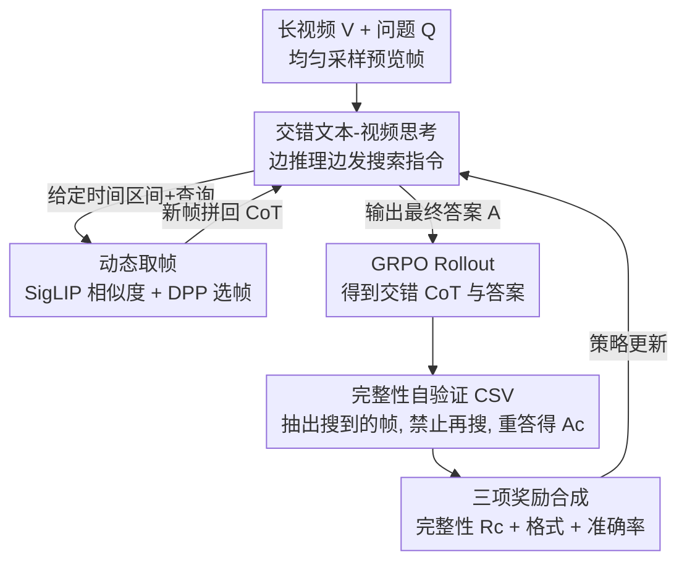

# TimeSearch-R: Adaptive Temporal Search for Long-Form Video Understanding via Self-Verification Reinforcement Learning

**会议**: ICLR 2026  
**OpenReview**: [https://openreview.net/forum?id=gqb1hvuGcj](https://openreview.net/forum?id=gqb1hvuGcj)  
**代码**: https://github.com/Time-Search/TimeSearch-R  
**领域**: 多模态VLM / 视频理解 / LLM推理  
**关键词**: 时序搜索, 长视频理解, 强化学习, 自验证, 交错文本-视频推理

## 一句话总结
TimeSearch-R 把长视频里的「时序搜索」重写成一个文本与视频检索交错进行的多轮推理过程，并用一种带「完整性自验证」的 GRPO（GRPO-CSV）做强化学习，让模型自己学会该看哪几帧、看够没看够，在时序搜索、长视频理解、复杂视频推理三类基准上全面超过手工搜索流程和纯文本推理模型。

## 研究背景与动机

**领域现状**：长视频理解要从几万帧里挑出与问题相关的少数关键帧，这件事被称为「时序搜索」（temporal search），是准确回答长视频问题的基础。当前主流的大视频语言模型（LVLM）要么静态均匀采样若干帧，要么走 VideoAgent / T* 这类「智能体工作流」——先用 LLM 抽出问题里的目标物体，再调 CLIP 检索、YOLO 检测、逐帧描述，最后把检索到的帧丢给模型回答。

**现有痛点**：这些智能体方案的搜索流程是**人手写死的**（hand-crafted workflow），各个工具的调用顺序、检索策略都是工程师拍脑袋定的启发式规则，没有端到端优化，导致搜索策略次优。更根本的是，模型可见的帧在推理开始前就被固定下来了——可人类看长视频是「先扫一遍、发现线索再回头细看」，这种基于中间发现动态调整注意力的能力，静态采样根本做不到。

**核心矛盾**：视频推理本质是个动态过程，时序搜索应该和推理交错进行（边想边找帧）；但现有方法把「能看哪些帧」从一开始就锁死，二者天然冲突，最终拖累推理。

**本文目标**：让模型直接从数据里学出最优的时序搜索策略，而不是靠人写规则；同时解决把强化学习直接套到视频推理上时暴露的两个失败模式。

**切入角度**：作者把时序搜索重新表述成「交错的文本-视频思考」（interleaved text–video thinking）——模型一边输出文字推理，一边发出搜索指令去取新帧，新帧拼进思维链继续推理，称之为 *Thinking with Videos*，是图像域 *Thinking with Images* 在长视频上的延伸。但直接用 GRPO 训练会出问题：GRPO 只奖励最终答案、不管中间的搜索决策，于是出现①**时序探索不足**（模型靠语言偏置或片面证据蒙对答案，漏掉关键帧）和②**推理逻辑不一致**（中间推理过程和最终答案对不上）。

**核心 idea**：用模型自己当裁判——把推理过程中搜到的所有帧抽出来，禁止再搜，让同一个策略模型只凭这些帧重新回答一遍，用「重答是否还对」来监督中间搜索是否充分、推理是否自洽，从而把稀疏的结果奖励变密。

## 方法详解

### 整体框架
TimeSearch-R 要解决的是「让模型自己学会在长视频里该搜哪段、搜够没搜够」。整体上分两条线：**推理时**，模型在一个交错的文本-视频思维链里循环，先看均匀采样的预览帧，每一步先输出文字推理，若决定搜索就给出时间区间和文本查询，视频环境据此返回新帧拼回思维链，直到给出答案；**训练时**，用 GRPO-CSV 做两阶段（SFT 冷启动 + RL 后训练），其中 RL 阶段在标准 GRPO rollout 之后追加一个「自验证 rollout」，用同一个模型只凭搜到的帧重答问题来算完整性奖励，再叠加格式奖励和准确率奖励一起更新策略。

### 关键设计

**1. 交错文本-视频思考：把时序搜索焊进推理链，让搜索策略可学**

针对「搜索流程人手写死、可见帧一开始就锁死」这个痛点，本文把时序搜索从一个外挂工作流改成推理链内部的动作。给定视频 $V$ 和问题 $Q$，先均匀采样一个预览 $\tilde{V}$。在第 $k$ 步，策略模型 $\pi_\theta$ 生成文字推理 $T_k$；若 $T_k$ 含搜索指令，视频环境就执行检索得到片段 $V_k$ 拼进思维链，第 $k$ 步的交错 CoT 记为 $C_k \triangleq \{(T_1,V_1),\dots,(T_k,V_k)\}$，循环到模型给出答案 $A$ 或耗尽预算。整条链可分解为时序搜索与答案预测两部分：

$$P_\theta(A, C \mid \tilde{V}, Q) = \underbrace{P_\theta(C \mid \tilde{V}, Q)}_{\text{时序搜索}} \cdot \underbrace{P_\theta(A \mid C, \tilde{V}, Q)}_{\text{答案预测}}.$$

这样一来，搜索区间 $[t_s^k, t_e^k]$、文本查询 $q_k$ 都成了模型自己的输出而非外部规则，整个搜索策略就能被 RL 端到端优化——这正是它区别于 VideoAgent / T* 的根本：后者的搜索是人写的，前者的搜索是学出来的。

**2. 动态取帧：用 SigLIP 相似度 + DPP 在指定区间里挑最有信息量的帧**

当模型在某步发出搜索指令并指定区间和查询后，需要一个高效的取帧接口。本文用一个小 VLM（如 SigLIP）在区间 $[t_s^k, t_e^k]$ 内同时计算帧间相似度和帧与文本查询 $q_k$ 的相关性，再用行列式点过程（DPP）从中采样出 $F$ 帧 $V_k = \text{search}(V; t_s^k, t_e^k, q_k, F)$。DPP 的好处是天然兼顾「相关」与「多样」——既挑和查询相关的帧，又避免选出一堆几乎相同的冗余帧，显著提升搜索效率。这个模块本身是通用工具，关键在于它把模型给出的「时间区间 + 查询」翻译成实际的几帧画面，让交错推理跑得起来。

**3. GRPO-CSV 完整性自验证：让模型自己检验搜到的帧够不够、推理对不对**

这是全文核心。原始 GRPO 只把奖励打在最终答案上，会放任两种失败：模型可能靠语言偏置蒙对（探索不足），或中间推理与答案脱节（逻辑不一致）。CSV 的做法是：在 GRPO rollout 拿到交错 CoT $C$ 和答案 $A$ 后，把 $C$ 里搜到的所有帧抽出来组成动态帧集 $V_c$，进入「CSV rollout」——**禁止任何进一步搜索**，让同一个策略模型只凭 $V_c$ 重新回答得到 $A_c$，期望 $P_\theta(A_c \mid V_c, Q) \approx P_\theta(A \mid C, \tilde{V}, Q)$。完整性奖励定义为：

$$R_c = \mathbb{1}[\text{Acc}(A, A^*) > 0.5] \cdot \text{Acc}(A_c, A^*),$$

只有当原始答案 $A$ 正确（指示函数激活）时才奖励 $A_c$ 的正确性。这个条件设计只对「有希望的轨迹」加监督，既验证搜到的帧是否提供了足够证据，又验证推理与答案是否自洽。作者从两个角度论证有效性：信息论上，只用结果奖励主要在最大化 $I(A;Q)$（答案过度依赖问题文本），而 $R_c$ 强制 $I(A;V_c)$ 高，把从 $V$ 到 $A$ 的路径打通，逼模型真去探索视频；优化上，纯结果奖励是稀疏二值信号、还有「蒙对也给同样奖励」的问题，$R_c$ 把它变成更密的信号，改善 credit assignment。最终总奖励 $R = R_c + R_{\text{fmt}} + R_{\text{acc}}$，三项分别约束探索充分、结构一致、答案正确。值得一提的是，消融显示去掉 CSV 后训练会**崩溃**——模型逐渐减少搜索次数直到完全不搜。

**4. 两阶段数据过滤 + SFT 冷启动：先筛掉「不靠看视频也能答」和「怎么搜都答不对」的样本**

RL 训练长视频推理的一大难题是现有数据集里大量样本靠纯语言偏置就能答对（削弱对搜索的依赖），还有些噪声样本即使理想搜索也答不对（阻碍有效探索）。本文用两阶段过滤构造高质量数据集：第一阶段，移除策略模型只用 4 帧均匀采样就能答对的样本（去语言捷径）；第二阶段，丢掉即使多次搜索、大量帧也答不对的样本（保证视频值得探索）。数据还混入 Haystack-Ego4D、VideoMarathon、CinePile 增加多样性。训练采用两阶段方案：先用 GPT-4o 在上述数据上生成交错推理过程做 SFT 冷启动（训练时**屏蔽搜索返回的视频帧 token**，逼模型学会输出有意义的时间窗口和文本查询，而非死记画面），再在此基础上用 GRPO-CSV 做 RL 后训练激发时序推理能力。

### 一个完整示例
以「我有没有把抽屉关上？」这个 Ego4D 问题为例：模型先看均匀采样的预览帧，文字推理「要判断抽屉是否关上，得先找到和抽屉交互的帧、再看它最后的状态」，于是发出第一条搜索 `{start:0, end:606, query:"drawer interaction"}`；环境用 SigLIP+DPP 在 0–606 秒里取回若干帧，模型看到 72s、80s…593s 都有交互，但还不确定结尾状态，于是收窄区间再搜 `{start:580, end:606, query:"drawer"}`；拿到结尾片段后看到 590–594s 抽屉仍是开着、没有关上的证据，给出 `<answer>No</answer>`。整个过程「先粗扫定位、再细看确认」就是模型自己学出来的搜索策略；若在 CSV 阶段把这两段搜到的帧抽出来重答仍能答对，说明探索充分、推理自洽，会得到完整性奖励。

### 损失函数 / 训练策略
SFT 阶段最小化推理 token 上的标准交叉熵，被屏蔽的视频 token 不参与梯度。RL 阶段用 GRPO-CSV，AdamW 优化器，学习率 1e-6，KL 惩罚系数 $\beta=0.005$，batch size 4、每个 prompt 采 8 个 rollout；单次搜索最多取 8 帧、总共最多 8 步搜索；基座为 Qwen2.5-VL-7B-Instruct，在 32 张 A100 上训练。推理时通过 system prompt 控制目标帧数，报告实际平均用帧数。

## 实验关键数据

### 主实验

时序搜索（Haystack-LVBench / Haystack-Ego4D），8 帧预算下时序相似度 F1 是之前 SOTA 的三倍多：

| 方法 | 基座 | 时序 F1 | 视觉 F1 | LVBench QA | Ego4D QA |
|------|------|---------|---------|------------|----------|
| Uniform | GPT-4o (32帧) | 2.7 | 67.3 | 50.5 | 45.5 |
| VideoAgent | GPT-4 | 2.1 | 64.7 | – | – |
| T* | GPT-4o (32帧) | 3.1 | 67.8 | 53.1 | 46.5 |
| **TimeSearch-R** | Qwen2.5-VL-7B (7.8帧†) | **8.4** | 69.0 | 52.4 | **53.3** |
| **TimeSearch-R** | Qwen2.5-VL-7B (30.7帧†) | 7.0 | **71.2** | – | – |

长视频理解（†为模型自适应帧数），8 帧下超基座 Qwen2.5-VL 4.4 个点（VideoMME），且学到的搜索策略可迁移到 GPT-4o / LLaVA-OV：

| 模型 | 帧数 | VideoMME overall | MLVU | LVB |
|------|------|------------------|------|-----|
| Qwen2.5-VL-7B（基座） | 32 | 61.2 | 58.1 | 58.2 |
| Video-R1-7B（纯文本推理） | 32 | 59.9 | 61.6 | 56.4 |
| **TimeSearch-R-7B** | 31.9† | 64.1 | 71.3 | 61.6 |
| **TimeSearch-R-7B + GPT-4o**（策略迁移） | 31.9† | **73.1** | 69.2 | 63.4 |

复杂视频推理 Video-Holmes，比基座 Qwen2.5-VL 提升约 11.8 个点（768 帧 43.9 vs 32.1），甚至超过 GPT-4o（42.0）和 Gemini-2.0-Flash-Thinking（43.1）。

### 消融实验

GRPO-CSV 组件消融（Haystack-LVBench / VideoMME，Comp.=完整性，Cons.=一致性，Acc.=准确率）：

| 配置 | 时序 F1 | Comp. | Cons. | Acc. |
|------|---------|-------|-------|------|
| Qwen2.5-VL w/ search | 0.0 | 44.2 | 59.4 | 51.8 |
| + SFT 冷启动 | 7.8 | 60.5 | 69.2 | 59.2 |
| + GRPO（崩溃前） | 7.4 | 57.2 | 69.3 | 65.1 |
| + GRPO-CSV w/o Acc. 奖励 | 8.2 | 61.2 | 75.3 | 64.8 |
| + GRPO-CSV w/ Acc. 奖励 | 8.1 | 60.2 | 71.8 | **66.6** |

### 关键发现
- **SFT 解锁搜索能力**：纯 zero-shot CoT 几乎不会搜（时序 F1=0.0），SFT 把 F1 拉到 7.8、完整性从 44.2% 提到 60.5%——搜索这件事得先「教会格式」。
- **RL 主要提升的是理解而非搜索精度**：RL 对时序相似度提升有限，但把推理一致性提了 2.6%，进而把 QA 准确率从 59.2% 拉到 66.6%，说明 CSV 的价值在「让推理和答案对齐」。
- **CSV 是防训练崩溃的关键**：去掉 CSV，模型会逐渐减少搜索调用直到完全不搜（训练动态曲线塌到 0），完整性也从 60.5% 跌回 57.2%——结果奖励太稀疏，模型学会了「干脆不搜也能蒙对」的捷径。
- **搜索策略可迁移**：把 TimeSearch-R 学到的动态帧集喂给 GPT-4o，VideoMME 直接到 73.1，说明学到的是一套通用的「该看哪几帧」的策略，而非绑死在基座上。

## 亮点与洞察
- **用同一个模型当裁判，无需帧级标注**：CSV 把「搜到的帧够不够」转化成「只凭这些帧能不能重新答对」，绕开了昂贵的帧级标注，又天然嵌进 RL 训练，这个「自验证当中间监督」的思路可迁移到任何「检索-推理」交错的任务（文本 RAG、工具调用智能体）。
- **条件指示函数的奖励设计很巧**：$R_c$ 只在原始答案正确时才激活，避免给「本来就答错的轨迹」乱发奖励，把监督精准打在有希望的推理路径上。
- **信息论视角点透了 RL 的病根**：纯结果奖励最大化 $I(A;Q)$ 让模型依赖语言偏置，CSV 通过强制 $I(A;V_c)$ 把答案重新焊回视频内容，这个解释让「为什么会蒙答案」变得可量化。
- **「先粗扫再细看」是学出来而非设计出来的**：模型自发学到了人类式的「broad scanning → targeted inspection」搜索行为，验证了端到端学习能逼近人类视觉搜索的直觉。

## 局限与展望
- **依赖外部取帧模块的质量**：动态取帧靠 SigLIP 相似度 + DPP，若小 VLM 的相关性判断出错，模型再会搜也取不到对的帧，搜索能力上限被这个接口卡住。
- **CSV 重答带来额外算力开销**：每条轨迹要多跑一次「只凭搜到的帧重答」的 rollout，训练成本相比纯 GRPO 翻倍，文中也用了 32 张 A100。
- **完整性奖励依赖答案正确性作触发**：$R_c$ 以「原始答案对」为前提，对那些「推理过程其实很好但最终答错」的轨迹无法给出正向信号，可能错过有价值的搜索行为。
- **时序相似度 F1 绝对值仍低**（8.4），说明「精确命中关键帧」这件事远未解决，当前更多是靠「搜对一片区域」而非「精准定位单帧」取胜。

## 相关工作与启发
- **vs VideoAgent / T\***: 它们用 LLM 当中枢、人工编排 CLIP/YOLO/captioning 的搜索工作流，策略是人写死的启发式；本文把搜索动作焊进推理链用 RL 端到端学出来，时序 F1 从 2.5 翻到 8.4，证明「学出来的搜索」胜过「设计出来的搜索」。
- **vs Video-R1（纯文本推理）**: Video-R1 把视频转成文本后只做文字推理，可见帧固定；TimeSearch-R 让推理和取帧交错、动态扩展可见帧，在三个长视频基准上全面更优，说明「边想边看」比「先看完再想」更适合长视频。
- **vs Thinking with Images**: 本文是图像域「以图思考」在长视频上的延伸，把空间搜索换成时序搜索，并针对视频特有的「探索不足/逻辑不一致」失败模式补上了 CSV 监督。

## 评分
- 新颖性: ⭐⭐⭐⭐⭐ 把时序搜索重写成可学的交错推理，并用自验证给中间步骤加监督，思路新且自洽
- 实验充分度: ⭐⭐⭐⭐⭐ 覆盖时序搜索/长视频理解/复杂推理三类任务，含策略迁移和训练崩溃的关键消融
- 写作质量: ⭐⭐⭐⭐ 失败模式和信息论解释讲得清楚，部分指标定义需翻附录
- 价值: ⭐⭐⭐⭐⭐ 「自验证当中间监督」对检索-推理交错类任务有普适借鉴意义

<!-- RELATED:START -->

## 相关论文

- [\[ICLR 2026\] VideoZoomer: Reinforcement-Learned Temporal Focusing for Long Video Reasoning](videozoomer_reinforcement-learned_temporal_focusing_for_long_video_reasoning.md)
- [\[CVPR 2026\] REVISOR: Beyond Textual Reflection, Towards Multimodal Introspective Reasoning in Long-Form Video Understanding](../../CVPR2026/vlm_reasoning/revisor_beyond_textual_reflection_towards_multimodal_introspective_reasoning_in_.md)
- [\[CVPR 2026\] Thinking with Drafts: Speculative Temporal Reasoning for Efficient Long Video Understanding](../../CVPR2026/vlm_reasoning/thinking_with_drafts_speculative_temporal_reasoning_for_efficient_long_video_und.md)
- [\[CVPR 2026\] VideoARM: Agentic Reasoning over Hierarchical Memory for Long-Form Video Understanding](../../CVPR2026/vlm_reasoning/videoarm_agentic_reasoning_over_hierarchical_memory_for_long-form_video_understa.md)
- [\[ICLR 2026\] DeepEyes: Incentivizing "Thinking with Images" via Reinforcement Learning](deepeyes_incentivizing_thinking_with_images_via_reinforcement_learning.md)

<!-- RELATED:END -->
