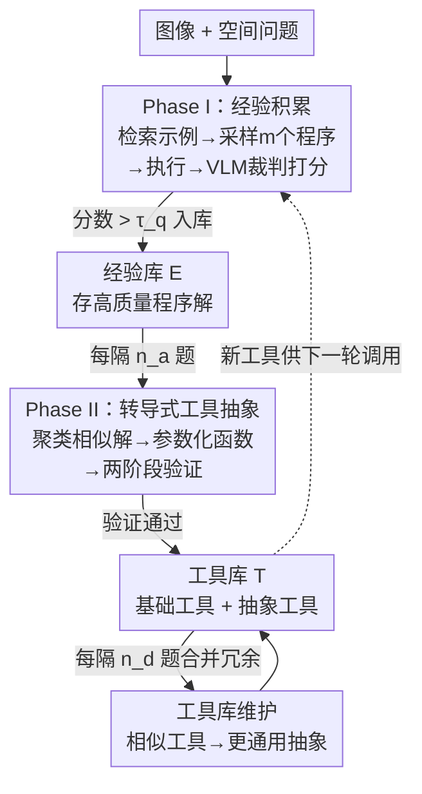

# Transductive Visual Programming: Evolving Tool Libraries from Experience for Spatial Reasoning

**会议**: ICLR 2026  
**OpenReview**: [https://openreview.net/forum?id=XCW1l9qcxy](https://openreview.net/forum?id=XCW1l9qcxy)  
**代码**: https://transductive-visualprogram.github.io/  
**领域**: 多模态VLM / 视觉编程 / 空间推理  
**关键词**: 视觉编程, 空间推理, 工具抽象, 自进化智能体, 双库系统

## 一句话总结
TVP 让视觉编程智能体先用基础工具实打实地解题、把高质量程序攒进"经验库"，再从这些**真正跑通过**的程序里聚类抽象出可复用的高层工具放进"工具库"，形成"程序→工具→更好程序"的闭环；在 Omni3D-Bench 上比 GPT-4o 高 22%、比上一代视觉编程系统高 11%，且抽象出的工具能零样本迁移到未见过的空间推理基准。

## 研究背景与动机

**领域现状**：真实场景里的 3D 空间推理（如"要叠几个柜子才和沙发加电视一样高")需要精确的几何计算，单体 VLM 即便经过空间微调也很难算准（GPT-4o 在浮点计算题上只有 8.2% 准确率）。视觉编程（VisProg、ViperGPT、VADAR）通过把问题拆成调用专用工具（深度估计、目标检测、几何函数）的离散步骤，用程序逻辑组合中间结果来逼近这种精度。

**现有痛点**：视觉编程系统的好坏取决于它的工具库怎么发展起来。早期方法（VisProg、ViperGPT）用**固定的预定义工具集**，无法适应新任务；更近的 VADAR 走"归纳"路线，**在解题之前**仅凭问题描述去推测"哪些函数可能有用"并提前造好。后者的致命问题是：这些凭空臆测出来的工具理论上看着有用，实践中却简化不了问题——VADAR 高达 94.2% 的程序仍然只用基础工具，新造的工具几乎没人用。

**核心矛盾**：工具开发的正确顺序应该是"经验→抽象"——像人类程序员那样，先用基础工具解决具体问题、识别反复出现的模式、再把它们抽象成高层函数。VADAR 把这个顺序**倒过来**了（先抽象后解题），造成一个**开环**系统：工具从"创造"单向流向"应用"，中间没有任何解题经验来指导抽象，于是抽象出的东西脱离真实需求。

**本文目标**：把工具创造**锚定在解题经验上**，让每个新工具都源自被验证过的真实程序，而不是臆测。

**切入角度**：作者引入"转导(transductive)"视角——直接把**具体的程序解**转化为参数化函数，而不是从抽象规则演绎。这要求系统先有"经验"再做"抽象"，天然形成闭环。

**核心 idea**：用两个互相喂养的库（经验库 + 工具库）搭一个"程序→工具→程序"的闭环：先用基础工具解题、把好程序存进经验库，再从经验库聚类抽象出新工具存进工具库，新工具又让未来的程序更简单更准。

## 方法详解

### 整体框架

TVP（Transductive Visual Programming）维护两个相互连接的库——**经验库 $E$**（积累程序解作为经验记忆）和**工具库 $T$**（保存从程序中抽象出的函数，初始只含 5 个基础视觉工具）。给定图像-问题数据集 $D=\{(I_i,q_i)\}_{i=1}^N$，系统在两个阶段间交替循环：**Phase I** 用当前工具库解题、把高质量解存进经验库；**Phase II** 每隔一段就从经验库挖掘模式、抽象出新工具加进工具库。随着处理的问题越来越多，两个库一起增长——更丰富的经验和更强的工具让程序变得更简单、更精确。整个过程跑 $T$ 轮（实验用 $T=3$）。

### 关键设计

**1. 双库闭环：让工具源自被验证过的程序，而非臆测**

这一设计直击 VADAR 开环系统的根本缺陷——工具脱离真实需求、严重闲置。TVP 用两个库把"程序"和"工具"绑成循环：经验库 $E$ 把成功的程序解当作经验记忆存起来，工具库 $T$ 从这些经验里抽象出函数。循环是这样转的：解题时从 $E$ 检索相似示例当 few-shot 演示、用 $T$ 里的函数生成程序候选；高质量程序回流进 $E$；相似的程序解被聚类、抽象成新的参数化函数加进 $T$；新工具又让未来的程序更好。这就形成了"程序解指导工具开发 → 工具又催生更好的程序"的转导式闭环。

之所以有效，是因为每个工具都**有真实解题经验背书**：它抽象的是反复出现的、已经跑通并通过质量评判的解题模式，而不是凭问题文本空想。实验里这一点很直接——TVP 转导学到的工具被当作核心程序依赖使用的频率是归纳方法的 5 倍，36.3% 的程序只需调用抽象工具就能解决（VADAR 仅 5.8%）。

**2. Phase I 解题与经验积累：四步筛出高质量解**

针对"如何保证存进经验库的程序确实可靠"这一痛点，Phase I 把每道题的求解拆成四步严格筛选。**① 示例检索**：给定问题 $q_i$，从 $E$ 里检索文本嵌入相似度超过阈值 $\tau_{sim}$ 的至多 $k_{max}$ 个历史解作为 in-context 演示（相似的问题往往需要相似的解题逻辑）；若没有达标的就无演示生成。**② 程序生成**：生成器拿到问题、检索到的 0–$k_{max}$ 个示例及其解、以及当前工具库 $T$ 的签名和文档串，采样 $m$ 个候选程序——因为视觉推理问题常有多种有效解法，多采样能提高命中高质量解的概率。**③ 程序执行**：在 Python 里带着图像 $I_i$ 和完整工具库实现执行每个候选，产出最终答案和完整的中间计算 trace，执行失败或无结果的被过滤掉。**④ 质量评判**：一个 VLM 裁判看着程序实现、执行 trace 和答案，对照问题与图像作为视觉证据打分；最高分候选成为最终解，分数若超过质量阈值 $\tau_q$ 才进入 $E$。

跨 $T$ 轮迭代时，同一问题的新程序若拿到更高质量分，可以**替换**掉旧解——这会随着 TVP 抽象出更强工具、写出更简单程序而自然发生。正是这套"执行可行性 + trace 分析 + 编码逻辑 + 工具使用 + 视觉证据 + 常识"的多维评判，保证了 $E$ 里积累的是真正高质量的经验。

**3. Phase II 转导式工具抽象：聚类→参数化→两阶段验证**

针对"如何从一堆具体程序里提炼出真正可复用的工具"，Phase II 把抽象做成转导式的——直接把具体程序解转成参数化函数，让每个工具都扎根于真实解题经验。流程分三步。**模式挖掘（聚类）**：先按嵌入相似度对 $E$ 里所有问题聚类，对相似度超 $\tau_{sim}$、规模超 $\tau_{cluster}$ 的簇，让 LLM 分析簇内程序解、评估"抽象潜力"（是否存在反复出现的计算模式，如重复的比例计算、相对相机距离），潜力分超 $\tau_{potential}$ 才触发造工具。**创建参数化工具**：工具抽象器拿到簇内所有问题、程序解、执行结果和当前 $T$，造出一个捕获该簇共享计算模式的参数化函数——例如反复算 3D 尺寸比例的簇会催生 `compute_3d_ratio`，反复找最靠近相机物体的簇催生 `find_closest_obj`，这些函数把多步编程逻辑换成单次函数调用。

**两阶段严格验证**是关键防线：Stage 1（执行验证）把簇内每个程序改写成调用新工具的版本并运行，**必须 100% 全部执行成功**，任何一个失败就立刻否决；Stage 2（正确性验证）当改写后结果与原结果不同时，VLM 裁判判断新结果是否"等价或更优"——因为几何计算涉及浮点运算，多个答案可能在数值精度内都对。只有总体正确率超 $\tau_{correct}$ 才接受。验证通过后，新工具入 $T$，且 $E$ 里相关示例被改写成调用新工具。这套验证保证了入库工具既能跑、又不损失解题质量，是迁移泛化能力的根本来源。

**4. 工具库维护：合并冗余，让工具滚雪球式变通用**

随着不断处理问题、定期抽象，不同的簇可能产出功能相似的工具，造成冗余、增加生成器选工具的负担。因此每隔 $n_d$ 题，TVP 识别并合并相似工具：例如 `compute_3d_ratio`（两个物体的比例）和 `compute_3d_group_size_ratio`（两组物体的比例）会合并成更通用的 `compute_objects_size_ratio`（任意物体集合的比例）。合并后的工具要在**所有用过原始工具的示例**上重跑同样的两阶段验证，确保不丢任何功能。

这一维护让工具库保持精简有组织，更重要的是让工具**层级式地向更通用方向进化**：实验里总共造了 61 个工具，但周期性合并后只保留 11 个活跃工具——这种选择性留存既覆盖了真正可复用的抽象、又把冗余压到最低。工具层级的进化也带来量化收益：用越进化的工具，程序准确率越高、复杂度越低。

### 一个完整示例

以图 10(a) 的查询为例——"给定沙发的参考高度，算电视和电视柜合起来的 3D 总高"。在 TVP 的迭代里，同一个问题被**逐渐更通用的工具**解决：起初用基础的 `compute_3d_object_height` 多次调用、手工拼装；随着工具进化，变成统一处理多维度的 `compute_3d_object_size`；最终收敛到最通用的 `estimate_3d_sizes_from_reference`，一次调用就能聚合多个目标物体。多步解法逐步坍缩成一次便捷的函数调用，程序的圈复杂度从中位数 3.0 降到 1.0，而正确性保持不变。这就把"经验→抽象→更简单程序"的闭环具象化了。

## 实验关键数据

### 主实验

在 Omni3D-Bench（501 道真实场景非模板化空间推理题）上，TVP 用 GPT-4o 作生成器和裁判、跑 3 轮、每步都做工具抽象与合并（$n_a=n_d=1$）：

| 方法 | Yes/No | 多选 | 计数 | Float MRA | Float(±10%) | Overall |
|------|--------|------|------|-----------|-------------|---------|
| GPT-4o | 65.3 | 60.5 | 18.6 | 26.7 / 8.2 | — | 27.2 |
| SpaceMantis（空间微调） | 53.3 | 30.2 | 4.3 | 21.4 / 8.2 | — | 18.2 |
| VADAR（上代视觉编程SOTA） | 56.0 | 57.6 | 21.7 | 35.5 / 15.9 | — | 29.9 |
| **TVP（本文）** | 60.0 | **61.6** | **24.3** | **36.5 / 19.3** | — | **33.3** |
| TVP w/o 工具库 | 60.0 | 61.6 | 21.4 | 35.5 / 17.0 | — | 31.7 |

TVP 总体准确率 33.3%，比 VADAR 高 +11%、比 GPT-4o 高 +22%。值得注意的是单体 VLM 在感知型任务上还行（GPT-4o Yes/No 65.3%），但在需要多步几何推理的浮点计算上崩盘（8.2%），空间微调模型（SpaceMantis）也毫无改善，印证了组合式方法对精确空间推理的必要性。

### 消融实验

| 配置 | Overall | 说明 |
|------|---------|------|
| TVP（完整） | 33.3 | 经验库 + 工具库双库闭环 |
| TVP w/o 工具库（仅经验库） | 31.7 | 只给检索示例，生成器限制为 5 个基础工具 |
| 完整版跨 3 轮 | 31.3 → 31.9 → 33.3 | 持续提升 |
| 仅经验库跨 3 轮 | 31.7 → 31.5 → 31.5 | 基本停滞 |

只用经验库（31.7%）就已超过所有基线，证明积累的经验质量很高；但加上主动造工具后，完整系统随迭代持续爬升，而仅经验库版本停滞不前——说明工具创造是自进化循环的关键引擎。

### 关键发现

- **工具抽象在难题上贡献最大**：用 GPT-5 把题目按 1–10 难度分成 Easy/Medium/Hard 三档。在最难档上，TVP(Full) 相对仅经验库版本第 1 轮还落后 −4.5%，到第 3 轮反超 +6.7%——抽象工具把复杂的代码逻辑封装成简单函数调用，显著降低了难题的推理负担。
- **闭环带来三重可量化收益**：圈复杂度（CCN）中位数从 3.0 降到 1.0；程序从基础工具切到抽象工具时准确率 +3.4%；用抽象工具的程序跨迭代准确率从 22.4% 涨到 31.0%（+38% 相对增益），而只用基础工具的程序保持平稳。
- **零样本迁移强**：只用 Omni3D-Bench 建好的库，不做任何 testset 特定修改，在 SpatialScore-Hard（256 样本，来自 3DSR-Bench / SpatialSense / VG-Bench）上拿到 52.3% 总体准确率，远超 VADAR 的 32.8%——而 VADAR 还是专门针对这些测试集造的工具。3D 位置关系（59.2%）和深度距离（43.8%）类别尤其强。
- **对骨干 LLM 鲁棒、有清晰 scaling 趋势**：换成开源 Qwen2.5-Coder（7B→14B→32B），性能随规模单调上升；32B 模型达到 30.7%，逼近 GPT-4o 版的 31.3%，并超过用 GPT-4o 的 VADAR（29.9%），说明方法是 model-agnostic 的。

## 亮点与洞察

- **"转导 vs 归纳"的对照设计极其干净**：图 2 那个 94.2% vs 5.8% 的工具使用率对比一图胜千言——直接量化了"先解题后抽象"相比"先抽象后解题"在工具复用上的 5 倍差距，把一个看似哲学层面的顺序问题落到了可测的指标上。
- **两阶段验证是泛化能力的隐形功臣**：工具入库前必须在整个簇上 100% 执行成功 + 正确性达标，这等于强迫每个抽象"在多样化样本上被证伪过"，所以它编码的是基础推理模式而非查询特定细节——这正是零样本迁移到未见基准还能领先的根因。
- **工具会"滚雪球"式进化**：合并机制让 `compute_3d_ratio` → `compute_objects_size_ratio` 这样的层级不断向更通用方向演化（61 个造、最终留 11 个活跃），这个"造得多、留得精"的思路可迁移到任何需要自动积累技能库的 agent 系统（web 导航、机器人控制等）。
- **可直接迁移的 trick**：用"聚类 + LLM 评估抽象潜力 + 严格验证"三件套来从经验中自动提炼可复用技能，是一种通用的 self-evolving agent 配方，不限于视觉编程。

## 局限与展望

- **依赖强裁判 VLM**：质量评判和正确性验证都靠 VLM judge，裁判本身的偏差会传导到经验库和工具库的质量；论文未深入分析裁判误判对闭环的累积影响。
- **抽象触发阈值多**：$\tau_{sim}$、$\tau_{cluster}$、$\tau_{potential}$、$\tau_q$、$\tau_{correct}$ 等多个阈值需要设定，论文未系统报告其敏感性（仅在附录提到对随机数据顺序鲁棒），实际部署到新领域可能需要调参。
- **领域局限于 3D 空间推理**：所有验证都在空间几何任务上，工具抽象本质上吃的是"几何计算可参数化、浮点结果可数值容忍"这一特性；迁移到语义更开放、答案更难数值验证的视觉任务（如开放式 VQA）时，Stage 2 的正确性验证可能不再适用。
- **改进方向**：可探索把转导式工具创造与更强的形式化验证结合，或让裁判与生成器联合优化，进一步压低对昂贵闭源模型的依赖。

## 相关工作与启发

- **vs VADAR**：VADAR 走纯归纳——仅凭问题文本臆测有用函数、在解题前提前造工具，导致开环系统和工具严重闲置（94.2% 程序只用基础工具）。TVP 走转导——先用基础工具解题、积累经验、再从被验证过的程序里抽象工具，闭环让工具有真实需求背书，复用率高 5 倍，且零样本迁移反超 VADAR 专门为测试集造的工具。
- **vs VisProg / ViperGPT**：二者都用**静态预定义**工具集（VisProg 用 DSL 组合视觉专家，ViperGPT 生成 Python 调用视觉 API），无法适应新任务。TVP 的工具库会从经验中持续进化扩展。
- **vs LILO / Alita 等自进化 agent**：LILO 通过把程序压缩成 λ 表达式来抽象工具，Alita 创建专门的 MCP 连接 web；TVP 的差异在于把抽象**严格锚定在聚类后的真实解题经验**上并做两阶段验证，强调"经验先行"的转导范式，使抽象出的工具兼具复用性与跨任务泛化性。

## 评分
- 新颖性: ⭐⭐⭐⭐⭐ "转导式工具创造"把"经验→抽象"的顺序问题落成可测指标，对照归纳方法的设计极干净。
- 实验充分度: ⭐⭐⭐⭐⭐ 主结果 + 难度分档 + 跨迭代演化 + 零样本迁移 + 骨干 scaling，多角度论证闭环价值。
- 写作质量: ⭐⭐⭐⭐ 逻辑清晰、图表有力，但阈值/算法细节散落附录，正文略依赖图引用。
- 价值: ⭐⭐⭐⭐⭐ 为构建自进化视觉编程 agent 提供了可复用范式，工具从经验中持续积累的思路有广泛迁移潜力。

<!-- RELATED:START -->

## 相关论文

- [\[CVPR 2026\] SpaceTools: Tool-Augmented Spatial Reasoning via Double Interactive RL](../../CVPR2026/vlm_reasoning/spacetools_tool-augmented_spatial_reasoning_via_double_interactive_rl.md)
- [\[ICLR 2026\] Pursuing Minimal Sufficiency in Spatial Reasoning](pursuing_minimal_sufficiency_in_spatial_reasoning.md)
- [\[ICLR 2026\] AdaReasoner: Dynamic Tool Orchestration for Iterative Visual Reasoning](adareasoner_dynamic_tool_orchestration_for_iterative_visual_reasoning.md)
- [\[ICLR 2026\] Spatial CAPTCHA: Generatively Benchmarking Spatial Reasoning for Human-Machine Differentiation](spatial_captcha_generatively_benchmarking_spatial_reasoning_for_human-machine_di.md)
- [\[CVPR 2026\] Thinking with Programming Vision: Towards a Unified View for Thinking with Images](../../CVPR2026/vlm_reasoning/thinking_with_programming_vision_towards_a_unified_view_for_thinking_with_images.md)

<!-- RELATED:END -->
