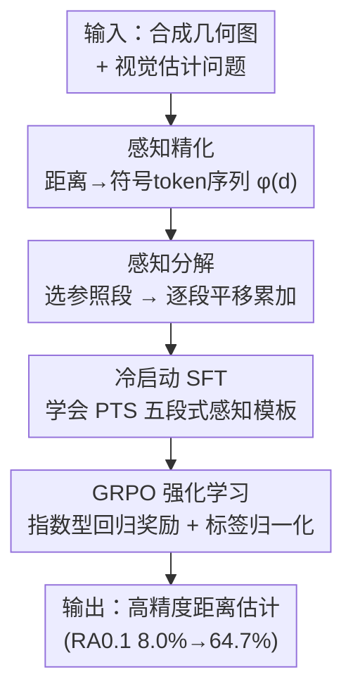

# Unleashing Perception-Time Scaling to Multimodal Reasoning Models

**会议**: ICLR 2026  
**OpenReview**: [https://openreview.net/forum?id=WGIcXH9rk9](https://openreview.net/forum?id=WGIcXH9rk9)  
**代码**: https://github.com/RUCAIBox/PTS  
**领域**: 多模态VLM / LLM推理  
**关键词**: 感知时间扩展, 视觉估计, RLVR, 符号化token, GRPO

## 一句话总结
针对"推理时间扩展（inference-time scaling）只让 LVLM 想得更长、却没让它看得更准"这一现象，本文提出 **Perception-Time Scaling（PTS）**：把感知本身改写成一段 token 密集、可分解的显式过程（符号化距离 + 逐段累加），再用 SFT 冷启动 + GRPO 强化，把模型在自建感知基准 DisTANCE 上的高精度准确率从 8.0% 拉到 64.7%，并能泛化到域外几何与真实多模态任务。

## 研究背景与动机
**领域现状**：RLVR（带可验证奖励的强化学习）已经成为提升大视觉语言模型（LVLM）推理能力的主流范式，它鼓励模型生成更长的思维链，在数学、多学科等"推理密集"的多模态任务上取得了明显增益。这类做法统称为推理时间扩展。

**现有痛点**：这些增益几乎都停留在"推理"阶段，对"感知"是否有帮助一直没人讲清楚。更糟的是，已有研究发现带推理的 LVLM 反而更容易产生幻觉。为了系统检验这个问题，作者构造了一个纯感知基准 **DisTANCE**（合成几何图 + 长度/周长/面积的视觉估计题），结果发现：开源 LVLM 的 RA$_{avg}$ 很少超过 35%，面积估计大多低于 20%；而推理增强模型（Vision-R1 22.7%、R1-OneVision 21.1%）和基座 Qwen2.5-VL-7B（21.5%）几乎打平。也就是说，推理时间扩展把思维链拉长了，却没把感知做对。

**核心矛盾**：作者把根因归结为当前 LVLM 的 **Fast Perception（快感知）** 范式——视觉理解被当成一次性输出（"这个圆的半径是 2.5 单位"），没有建模中间的感知过程。两个量化证据支撑这一点：① 在推理模型的长回答里，感知相关 token 占比极低（perception ratio 只有 12%–17%）；② 随着待估目标距离变大（真值从 [1,2) 到 [5,∞)），相对误差从 0.45 单调升到 1.66，说明模型完全没有像处理推理那样把复杂感知"分步拆解"。

**本文目标**：让感知也能享受到推理时间扩展的红利——既要让模型在感知上"多写 token"，又要让它把复杂感知拆成可控的小步。

**切入角度**：人类用尺子量长度时，是"以一段为参照、一段段平移累加"，而不是一眼报出数字。把这种"过程化感知"显式地写进思维链，奖励信号就能作用到每一个中间感知步骤上。

**核心 idea**：用"符号化 + 可分解的显式感知过程"替代"一次性数值输出"，让感知与推理时间扩展对齐，从而在 RL 中被逐步优化。

## 方法详解

### 整体框架
PTS 要解决的是"感知不可扩展"的问题：既然推理可以靠 RL 把每一步优化到位，那就把感知也改写成一条由多个中间步骤组成、可被奖励逐步打磨的链路。整体上，给定一张图和一道视觉估计题，PTS 先用 **感知精化（Perception Elaboration）** 把抽象的距离用一串符号 token 表示出来（让感知变得 token 密集、可解释），再用 **感知分解（Perception Decomposition）** 把"估一个大距离"拆成"以参照段为单位、一段段累加"的局部子目标；这两步共同定义了一种结构化的感知推理模板。训练上分两阶段：先用 SFT **冷启动** 让模型学会这套 PTS 模板，再用 **GRPO 强化学习** 配合为回归任务定制的连续奖励，让模型在中间感知步骤上不断试错精化，最终输出高精度估计。

### 关键设计

**1. 感知精化：用符号 token 把"一次性报数"变成 token 密集的可视化表示**

针对"快感知只吐一个数值 token、感知信息在思维链里占比极低"这个痛点，PTS 不让模型直接写出距离数值，而是定义一个符号编码函数 $\phi$，把目标距离 $d_t$ 映射成一串离散符号 token。每个完整 token 组渲染成 `<==========>` 代表 1.0 单位距离，尖括号是分隔符，中间每个 `=` 代表固定长度 $\delta=0.1$ 单位。给定 $d_t$，先拆成整数段数 $k=\lfloor d_t/1.0 \rfloor$ 和残差 $r=d_t-k$，编码序列为

$$\phi(d_t)=\underbrace{\texttt{<==========>}\cdots\texttt{<==========>}}_{k\ \text{次}}\ \|\ \phi_{res}(r),$$

其中残差部分 $\phi_{res}(r)=\texttt{<}\underbrace{=\cdots=}_{m\ \text{次}}\texttt{>}$，$m=\lfloor r/\delta \rfloor$。这样做的好处是：模型不再用单个数字 token 草草交代感知结果，而是被迫"一格一格"地把距离搭出来，既显著抬高了输出中感知 token 的占比（实测 Length 子任务的 perception ratio 从 base 的 20.4% 升到 PTS 的 30.2%），又在视觉与语言之间建立了更强的 grounding——符号长度直接对应图像里的物理长度，比一个孤立的数值更"接地气"也更可解释。

**2. 感知分解：以参照段为单位逐段累加，把复杂感知拆成可控局部步骤**

针对"目标距离越大、相对误差越大、模型却始终一次性出答案"的失败模式，PTS 引入分解策略：不直接预测 $d_t$，而是先在图中选一条参照段 $d_r$ 并把它定义为 1.0 单位，然后让模型模拟"拿这把尺子沿目标距离一段段平移、累加"的过程：

$$\text{初始化}:\ L=0,\ k=0;\qquad \text{当}\ L+d_r\le d_t:\ L\leftarrow L+d_r,\ k\leftarrow k+1.$$

每一步都只是"在已覆盖长度上再贴一段参照段"这种简单、局部的判断，从而把整体难题切成一连串可控小步。这正好对应人类用尺子量长物的方式。更关键的是，把感知变成"分步过程"之后，它就和推理时间扩展兼容了——奖励信号可以落到每一个中间感知步骤上，RL 才有空间去逐步优化感知精度（这也是 PTS 与普通 CoT 的本质差别：CoT 的链路里几乎没有感知内容，RL 阶段无从精化）。

**3. 两阶段训练：SFT 冷启动 + 为回归定制的 GRPO 奖励**

光有 PTS 模板还不够，要让模型既学会这套模式、又能在强化阶段把精度顶上去。第一阶段是**冷启动 SFT**：作者把 PTS 推理链固化为五个阶段——Review（复述任务）、Hint（给出符号编码与分解策略的定义）、Reference（选定参照段）、Estimation（把其他段与参照段视觉比较）、Calculation（套公式算最终结果），并通过"少量人工示例 + GPT-4o 扩写"为长度/周长/面积各合成 2000 条、共 6000 条 PTS 风格链路（`<think>...</think>` 包推理、`<answer>...</answer>` 包答案），所有图像用随机种子新合成以避免与评测集重叠。第二阶段是 **GRPO 强化**，并针对回归任务做了两处改造：① **连续指数奖励**——二值奖励无法刻画"差多少"，于是用 $r(o)=e^{-\alpha\,|o-d_t|/d_t}$，相对误差越小奖励越高，指数形式对小误差特别敏感，能激励细粒度精度（消融显示指数奖励收敛最快，最终相对误差不到 $\tau=0.5$ 二值奖励的一半）；② **标签归一化**——同一相对误差阈值在不同尺度标签上对应的绝对容差天差地别（0.1 阈值在 0.02 上只允许 ±0.002，在 50 上却允许 ±5），会让奖励在训练初期混淆模型，于是先在目标值 <1 的归一化样本上训练，再引入随机分布的数据。

### 一个完整示例
以"估计线段 B 的长度"为例走一遍 PTS：模型先在图里选一条参照段并令其为 1.0 单位（Reference）；然后把目标线段拆成"第一段 `<==========>` … 第二段 `<==========>` … 第三段 `<===>`"，用符号 token 一格格搭出来（Perception Elaboration + Decomposition）；按 $k=2$ 个完整组（=2.0 单位）加残差 $m=3$ 个 `=`（=0.3 单位）累加（Estimation），最后 Calculation 得到 `<answer>2.3 units</answer>`。在 GRPO 阶段，policy 会对同一道题采样多条回答（如 2.5 / 3.7 / 4.6 / 2.3 units），用指数奖励 $r=e^{-\alpha|o-d_t|/d_t}$ 算出组内相对优势，把更接近真值的那条往上推——感知的每一步都被纳入了优化范围。

### 损失函数 / 训练策略
GRPO 目标为标准的带 KL 惩罚的裁剪策略梯度：

$$J(\theta)=\frac{1}{N}\sum_{i=1}^{N}\Big[\min\big(\tfrac{\pi_\theta(o_i|q)}{\pi_{\theta_{old}}(o_i|q)}A_i,\ \text{clip}(\tfrac{\pi_\theta(o_i|q)}{\pi_{\theta_{old}}(o_i|q)},1-\epsilon,1+\epsilon)A_i\big)-\beta D_{KL}(\pi_\theta\|\pi_{ref})\Big],$$

其中组内优势 $A_i=(r_i-\text{mean}(\{r\}))/\text{std}(\{r\})$，单条奖励 $r=\lambda r_{acc}+(1-\lambda)r_{format}$，准确率项 $r_{acc}$ 即上文的连续指数奖励。骨干模型为 Qwen2.5-VL-3B / 7B。

## 实验关键数据

### 主实验
DisTANCE 上不同数据范式 × 训练策略的对比（Qwen2.5-VL-7B，RA$_{avg}$ 为多阈值平均、RA$_{0.1}$ 为高精度）：

| 配置 | Length RA$_{0.1}$ | Perimeter RA$_{0.1}$ | Area RA$_{0.1}$ | Average RA$_{0.1}$ | Average RA$_{avg}$ |
|------|------|------|------|------|------|
| Qwen2.5-VL-7B (base) | 11.0 | 11.0 | 2.0 | 8.0 | 21.5 |
| + Direct (SFT+RL) | 46.0 | 51.0 | 25.0 | 40.7 | 70.7 |
| + CoT (SFT+RL) | 38.0 | 48.0 | 27.0 | 37.7 | 71.3 |
| **+ PTS (SFT+RL)** | **70.0** | **74.0** | **50.0** | **64.7** | **88.3** |

PTS 把平均 RA$_{avg}$ 从 21.5% 拉到 88.3%、高精度 RA$_{0.1}$ 从 8.0% 拉到 64.7%，且最难的面积子任务 RA$_{0.1}$ 也达到 50.0%——全程不用任何空间数据或外部工具，只靠把感知过程内化进思维链。

域外泛化（Qwen2.5-VL-7B，SFT+RL）：

| 配置 | Length$_{ood}$ RA$_{avg}$ | Perimeter$_{ood}$ RA$_{avg}$ | Geo-LHC Acc | LEGO-Height Acc |
|------|------|------|------|------|
| base | 22.2 | 23.6 | 59.8 | 30.0 |
| + CoT | 39.6 | 55.6 | 72.2 | 30.0 |
| **+ PTS** | **43.2** | **71.4** | **78.7** | **33.0** |

未见过的几何形状、几何细粒度感知（Geoperception-LHC）乃至 3D 场景（LEGO-Puzzles 高度判断）上 PTS 都领先，说明这套"过程化感知"能力可迁移。

通用多模态（Qwen2.5-VL-7B + 数学推理数据 Geo3K）：

| 配置 | MathVision | MMBench | HalluBench | CV-Bench(Full) | BLINK |
|------|------|------|------|------|------|
| base | 25.3 | 83.28 | 51.2 | 73.36 | 46.6 |
| + Geo3K | 26.8 | 83.82 | 52.2 | 74.30 | 52.6 |
| **+ PTS, Geo3K** | **27.2** | **85.68** | **53.0** | **75.68** | **53.4** |

值得注意：PTS 数据全是合成几何图，把它和数学推理数据一起训，竟在数学推理、通用 VQA、幻觉、感知中心任务（CV-Bench / BLINK）上同时带来一致增益。

### 消融实验

| 配置 | Average RA$_{0.1}$ | 说明 |
|------|------|------|
| PTS + SFT only | 16.3 | 只 SFT，PTS 与 CoT/Direct 接近甚至略低 |
| Direct + SFT+RL | 40.7 | 直接数值 + RL |
| CoT + SFT+RL | 37.7 | 普通思维链 + RL |
| **PTS + SFT+RL** | **64.7** | 完整方法，RL 阶段拉开差距 |

奖励函数消融（GRPO 100 步，验证集相对误差）：二值奖励 $\tau=0.1$ 最差（阈值太严、大部分样本无有效反馈，剧烈震荡）；$\tau=0.5$ 平滑但收敛慢；连续指数奖励收敛最快，终态相对误差不到 $\tau=0.5$ 二值奖励的一半。

### 关键发现
- **差距出现在 RL 而非 SFT**：PTS 与 CoT 在仅 SFT 时表现相近（16.3 vs 13.7），但进入 GRPO 后 PTS 飙到 64.7%、CoT 只到 37.7%——因为 PTS 链路里嵌入了大量可被精化的中间感知步骤，CoT 几乎没有感知内容可优化。
- **PTS 抬高了对图像的注意力**：相比原始 Qwen2.5-VL，PTS 训练后的模型在 transformer 早期和末期层对图像 token 的注意力比例都更高，说明它在输入端强化了低层 grounding、在解码端强化了 image-conditioned 推理。
- **单纯堆数据会饱和**：Direct/CoT/PTS 在 2k→12k 数据规模上初期都涨、随后趋平，说明"光扩数据量"对视觉估计不够，关键在于感知范式本身。

## 亮点与洞察
- **把"看"也做成"想"**：核心洞察是当前 RLVR 只 scale 了 reasoning、没 scale perception，而 scale 的前提是"过程化"。PTS 用符号 token + 逐段累加把一次性感知拆成可优化的链路，这个"让感知变得可被 RL 打磨"的视角很有迁移价值。
- **符号 token 是巧妙的 grounding 手段**：用 `<==========>` 这种长度可数的视觉化 token 表示距离，既天然增加感知 token 占比，又把"语言长度 ↔ 图像长度"绑在一起，比直接回归一个数字更稳——可迁移到任何"连续量估计"任务（角度、面积、计数）。
- **合成数据迁移到真实任务**：纯合成几何图训练，却在 LEGO 3D、CV-Bench、BLINK 等真实感知任务上涨点，提示"过程化感知"学到的是可迁移的元能力而非具体形状记忆。
- **连续指数奖励 + 标签归一化**：回归型 RLVR 的两个实用 trick——指数奖励对小误差敏感、归一化消除尺度对阈值的干扰，可直接复用到其他数值回归的 RL 微调。

## 局限与展望
- **任务域偏窄**：DisTANCE 与训练数据都是合成几何图上的距离/周长/面积估计，符号编码 $\phi$ 也是为"距离"量身设计；对非度量类感知（语义、纹理、关系）能否照搬这套符号化分解，文中未充分验证。
- **依赖参照段假设**：感知分解需要在图中选到一条可靠的参照段并定义为 1.0 单位，若图中缺乏清晰可参照的结构（如自然场景），逐段累加可能失效。
- **符号粒度是超参**：$\delta=0.1$、$\alpha$ 等都需调，附录虽有消融但最优粒度可能随任务而变；过细会拉长序列、过粗会损失精度。
- **改进思路**：把符号编码从"等距尺子"推广到自适应/可学习的视觉计量单元，或让模型自己选参照与粒度，可能进一步提升对真实复杂场景的鲁棒性。

## 相关工作与启发
- **vs 推理增强 LVLM（Vision-R1 / R1-OneVision / MM-Eureka 等）**: 它们把 RLVR 直接套到多模态推理上、拉长思维链，但感知仍是一次性输出，在 DisTANCE 上与基座几乎打平；本文指出 scale 错了对象，主张显式 scale perception。
- **vs 工具增强 LVLM（Visual Sketchpad / DetToolChain）**: 它们靠外部视觉专家/Python 代码补充感知信息；PTS 不调外部工具，把感知过程内化进思维链端到端优化，反而在 DisTANCE 上大幅领先（PTS 64.7% vs GPT-4o+Sketchpad 19.0% RA$_{0.1}$）。
- **vs 空间感知 LVLM（Spatial-R1 / SpaceThinker）**: 它们专门为真实场景物体尺寸估计设计；PTS 用纯合成数据训练却能泛化到 3D/真实感知，思路更通用。

## 评分
- 新颖性: ⭐⭐⭐⭐⭐ "scale perception 而非 reasoning"的视角清晰，符号化+分解的实现也巧妙
- 实验充分度: ⭐⭐⭐⭐⭐ 自建基准 + 域内/域外/通用多模态三层评测 + 奖励/数据规模消融，证据链完整
- 写作质量: ⭐⭐⭐⭐ 动机与方法叙述清楚，DisTANCE 与 PTS 的因果链讲得到位
- 价值: ⭐⭐⭐⭐⭐ 揭示并修复了 RLVR 在感知上的盲区，符号化回归奖励等 trick 可复用

<!-- RELATED:START -->

## 相关论文

- [\[ICLR 2026\] Perception-R1: Advancing Multimodal Reasoning Capabilities of MLLMs via Visual Perception Reward](perception-r1_advancing_multimodal_reasoning_capabilities_of_mllms_via_visual_pe.md)
- [\[ICLR 2026\] Perception-Aware Policy Optimization for Multimodal Reasoning](perception-aware_policy_optimization_for_multimodal_reasoning.md)
- [\[CVPR 2026\] UniT: Unified Multimodal Chain-of-Thought Test-time Scaling](../../CVPR2026/vlm_reasoning/unit_unified_multimodal_chain-of-thought_test-time_scaling.md)
- [\[ICLR 2026\] Test-Time Matching: Unlocking Compositional Reasoning in Multimodal Models](test-time_matching_unlocking_compositional_reasoning_in_multimodal_models.md)
- [\[CVPR 2026\] Scaling Test-Time Robustness of Vision-Language Models via Self-Critical Inference Framework](../../CVPR2026/vlm_reasoning/scaling_test-time_robustness_of_vision-language_models_via_self-critical_inferen.md)

<!-- RELATED:END -->
