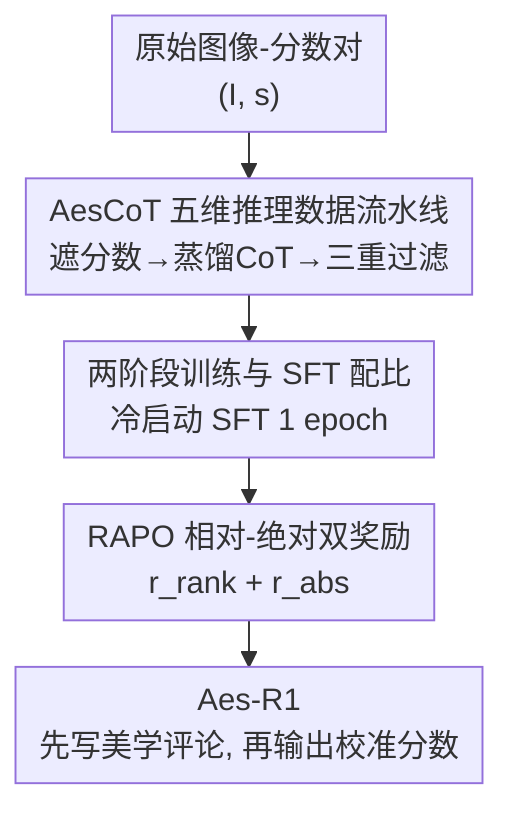

# Unlocking the Essence of Beauty: Advanced Aesthetic Reasoning with Relative-Absolute Policy Optimization

**会议**: ICLR 2026  
**OpenReview**: [https://openreview.net/forum?id=or3ZukbrKw](https://openreview.net/forum?id=or3ZukbrKw)  
**代码**: https://github.com/ssssmark/AesR1  
**领域**: 多模态VLM / 图像美学评估 / 强化学习  
**关键词**: 图像美学评估, 多模态推理, 相对-绝对奖励, 冷启动SFT, GRPO

## 一句话总结
本文提出 Aes-R1 框架，先用自动化数据流水线 AesCoT 蒸馏出五维度美学推理语料做冷启动 SFT，再用同时优化"绝对分数回归 + 相对排序"的强化学习算法 RAPO，让多模态大模型在只用 15K 训练样本的情况下把图像美学评估的平均 PLCC/SRCC 相对 backbone 提升 47.9%/34.8%，超过同规模 SOTA。

## 研究背景与动机
**领域现状**：图像美学评估（Image Aesthetic Assessment, IAA）要捕捉构图、色彩、光影、情绪等高层主观感受，而不只是像素级清晰度。当前主流做法是在带分数标签（Mean Opinion Score, MOS）的数据集上做监督微调（SFT），让多模态大模型（MLLM）直接回归一个美学分数。

**现有痛点**：纯分数监督存在两个硬伤。一是缺乏可解释性——模型只会吐一个数字，无法把视觉元素和多维美学准则对齐；想加入"先解释后打分"的推理，又苦于没有艺术家级别的高质量推理标注，人工标注昂贵且难规模化。二是 SFT 本身会过拟合：作者在 Tab. 3 中观察到，随着 SFT epoch 增加，模型 token 熵从 0.921→1.609 后又快速塌缩到 0.705，模型学到数据集偏置、探索空间收窄，后续优化举步维艰。

**核心矛盾**：强化学习（RL）数据高效、泛化好，是 SFT 的有力替代，但直接把 RL 套到 IAA 上会撞两堵墙。其一，没有美学推理语料预训练，端到端 RL 虽能拿到不错的分数，却激发不出真正的美学推理，生成的解释空洞通用（即 Aes-R1-Zero 现象），存在 reward hacking 风险。其二，美学没有统一评判标准，奖励代理（reward proxy）难设计：作者复现发现 VisualQuality-R1 用排序奖励能区分高低质量图（SRCC 高）但分数校准失败（PLCC 仅 0.4429），Q-Insight 用标量奖励则出现分布峰值错配。

**本文目标**：拆成两个子问题——(1) 如何低成本地造出可靠的美学推理数据来做冷启动；(2) 如何设计一个既能校准绝对分数、又能对齐相对偏好的奖励机制。

**切入角度**：作者借康德"没有任何客观的趣味规则能用概念决定何为美"的论断，主张人类美学判断本质上是**情境依赖**的——既有绝对的内在质量评估，也有相对的横向比较。因此 IAA 奖励应当包含两个互补维度：相对维度按图像比较吸引力排序，绝对维度评估内在美学价值。

**核心 idea**：用"AesCoT 冷启动注入美学推理先验 + RAPO 双奖励同时管住绝对分数与相对排序"来解决直接 RL 既不会推理、又校准不准的问题。

## 方法详解

### 整体框架
Aes-R1 是一条"先教会推理、再用强化学习对齐人类偏好"的两阶段流水线。输入是图像-分数对数据集 $\mathcal{D}=\{(I_i,s_i)\}$，输出是一个对任意图像都能"先写结构化美学评论 $c$、再给出 $[0,1]$ 区间打分 $s$"的策略模型 $\pi_\theta$。整条管线分三块串行推进：先由 **AesCoT 数据流水线**把原始图像-分数对蒸馏成带五维美学解释的推理语料；这批语料喂给 SFT 做**冷启动**，让模型养成"先解释后打分"的认知习惯；最后进入 **RAPO 强化学习**，用相对-绝对双奖励微调策略，把每张图的打分精度和跨图偏好判断一起拉高。

### 关键设计

**1. AesCoT：把图像-分数对自动蒸馏成五维美学推理语料**

冷启动的前提是有高质量美学推理数据，但艺术家级别的推理标注稀缺且昂贵。AesCoT 是（作者称的）首个自动化美学推理数据构建流水线，核心思路是"反向利用已有分数"：对每个图像-分数对 $(I_i,s_i)$，先把连续分数**从输出中遮蔽**，再让强闭源 MLLM 沿五个美学维度（光影、情绪与叙事、构图、色彩、曝光）写批评式分析。为了凸显美学差异，分数被分成 bad（0–0.4）、fair（0.4–0.7）、good（0.7–1.0）三档来引导分析的语气与结论。生成的分析再和真实分数拼接，得到推理轨迹 $\mathcal{D}_{CoT}=\{(P,I_i,c_i,s_i)\}$。

光蒸馏还不够可靠，所以流水线最后做**三重过滤** $\mathcal{D}_{AesCoT}=\mathcal{F}(\mathcal{D}_{CoT})=\{(P,I_i,c_i,s_i)\mid \|E_i\|=0\}$，通过自动检查 + 人工审核剔除三类错误 $E_i=(e^{leak}_i, e^{align}_i, e^{fact}_i)$：分数泄漏（评论里暴露了被遮的分数）、推理与分数不一致、事实性错误。这一步保证了语料"评论真的支撑那个分数"，避免冷启动学到看似有理实则对不上的推理。作者据此发布 AesCoT-3K 和 AesCoT-10K。

**2. RAPO：相对排序 + 绝对误差的双奖励强化学习**

针对单目标奖励要么校不准、要么排不对的痛点，RAPO 在 GRPO 框架上为每个图像-提示输入采样一组 $K$ 个输出，并同时计算两个互补奖励。

*相对排序奖励* $r_{rank}$ 基于 FRank，连续、有界、可微，直接对齐成对排序一致性。它假设图像美学分服从高斯分布 $s\sim\mathcal{N}(\mu,\sigma^2)$，于是两图分差 $s_i-s_j\sim\mathcal{N}(\mu_i-\mu_j,\sigma_i^2+\sigma_j^2)$，第 $k$ 个预测分 $o_{ik}$ 相对图像 $j$ 的成对比较概率为

$$p_{ik}(I_i,I_j)=\Phi\!\left(\frac{o_{ik}-\mu_j}{\sqrt{\sigma_i^2+\sigma_j^2+\gamma}}\right),\quad i\neq j$$

其中 $\Phi$ 是标准正态 CDF，$\mu_j$ 用图像 $j$ 的 $K$ 个预测分均值估计，$\gamma$ 是防除零小常数。排序奖励再用真实 MOS 给出的二元偏好标签 $p_c$（$s_i\ge s_j$ 取 1，否则 0）来做交叉项加权：$r_{rank}(o_{ik})=\frac{1}{N-1}\sum_{j\neq i}\sqrt{p_c\,p_{ik}}+\sqrt{(1-p_c)(1-p_{ik})}$。

*绝对误差奖励* $r_{abs}$ 负责把分数校准到真实 MOS，弥补排序奖励"会排序但不校准"的短板：

$$r_{abs}(o_{ik})=\exp\!\left(-\frac{1}{2}\left(\frac{|o_{ik}-s_i|}{\sigma}\right)^2\right)+\epsilon$$

总奖励就是两者相加 $r=r_{rank}+r_{abs}$，再按 GRPO 方式做组内归一化得到优势 $\hat A_{k,t}=\frac{r_k-\mu(R_i)}{\sigma(R_i)}$。两个奖励一相加，相对维度保证跨图偏好排得对、绝对维度保证单图分数贴得准，正好对应作者主张的"美学判断的相对+绝对两条互补轴"。

**3. 两阶段训练与熵视角的 SFT 配比**

为什么必须先 SFT 再 RL，而且 SFT 不能多做？作者用熵给出了量化答案。先用 AesCoT 语料做冷启动 SFT，目标是最大化推理轨迹与最终分数的对数似然 $\mathcal{L}_{sft}(\theta)=\mathbb{E}_{(P,I,c,s)\sim\mathcal{D}_{CoT}}[-\log\pi_\theta(c,s\mid P,I)]$；随后接 RAPO，并沿用 DAPO 的做法采用更高的裁剪上界、削弱 KL 惩罚来鼓励探索。

关键在 SFT 该做几轮。直接跳过 SFT（Aes-R1-Zero）能拿到合理分数，但解释空洞、有 reward hacking 风险；而 SFT 做太多则过拟合、token 熵塌缩、探索空间收窄，RL 增益所剩无几。Tab. 3 显示：0/1/2/10 epoch SFT 后再跑 RAPO，1 epoch 这档起始熵适中（1.609）、RL 后平均 PLCC/SRCC 最高（0.6337/0.6186）；10 epoch 时熵已塌到 0.705，RL 后反而退到 0.4624/0.4705。结论是"适度 SFT 提供先验并稳住输出格式、同时保留足够高的熵给 RL 探索"，本文最终定为 1 epoch 冷启动。

### 损失函数 / 训练策略
冷启动阶段用式 (8) 的负对数似然 $\mathcal{L}_{sft}$ 微调。RL 阶段最大化 RAPO 目标 $J_{RAPO}(\theta)$：在 GRPO 的 token 级裁剪目标上用双奖励算出的优势 $\hat A_{k,t}$，并加 $-\beta D_{KL}(\pi_\theta\|\pi_{ref})$ 的 KL 正则；采用 DAPO 式的非对称裁剪上下界 $\epsilon_{low}/\epsilon_{high}$ 与较小 KL 系数以放开探索。仅用 15K 组合训练样本（AVA:TAD66K:FLICKR-AES = 2:2:1），backbone 为 Qwen2.5-VL-7B。

## 实验关键数据

### 主实验
五个数据集（TAD66K、AVA、FLICKR-AES 为域内训练集，PARA、AADB 为 OOD）上的平均 PLCC/SRCC：

| 方法 | 类型 | 平均 PLCC | 平均 SRCC |
|------|------|-----------|-----------|
| Qwen2.5-VL-7B（backbone） | Vanilla MLLM | 0.4285 | 0.4589 |
| GPT-4.1 | Vanilla MLLM | 0.5171 | 0.5491 |
| Q-Align* | MLLM/SFT | 0.5120 | 0.5255 |
| Q-Insight* | MLLM/RL | 0.5954 | 0.5813 |
| VisualQuality-R1* | MLLM/RL（仅排序奖励） | 0.4429 | 0.5930 |
| **Aes-R1（本文）** | MLLM/RL | **0.6337** | **0.6186** |

\*为在 15K 组合训练集上重训的结果。Aes-R1 相对 backbone 把平均 PLCC/SRCC 提升约 47.9%/34.8%（绝对值均 +0.2 以上），在五个 benchmark 上取得最高平均分。VisualQuality-R1 SRCC 不低（0.5930）但 PLCC 只有 0.4429，印证了"只排序不校准"的偏科，正是 Aes-R1 双奖励要解决的问题。

### 消融实验

奖励组合消融（无冷启动直接 RL，平均 PLCC/SRCC）：

| 配置 | 平均 PLCC | 平均 SRCC | 说明 |
|------|-----------|-----------|------|
| 仅 Binary | 0.4255 | 0.4433 | 只监督"对/错"，信号最弱 |
| 仅 Error（绝对误差） | 0.5655 | 0.5600 | 连续信号，校准好 |
| 仅 Rank（相对排序） | 0.4542 | 0.5908 | 排序强（SRCC 高）但 PLCC 塌 |
| Binary + Rank | 0.5964 | 0.5825 | 即 VisualQuality-R1 式组合 |
| **Error + Rank（RAPO）** | **0.6297** | **0.6102** | 双目标互补，OOD 最稳 |

SFT 配比消融（不同 SFT epoch 起步再跑 RAPO，含起始 token 熵）：

| SFT epoch | RL | 起始熵 | 平均 PLCC | 平均 SRCC |
|-----------|-----|--------|-----------|-----------|
| 0 | RAPO | 0.961 | 0.6297 | 0.6102 |
| **1** | **RAPO** | **1.626** | **0.6337** | **0.6186** |
| 2 | RAPO | 1.391 | 0.6027 | 0.5903 |
| 10 | RAPO | 0.716 | 0.4624 | 0.4705 |

奖励权重消融（相对:绝对系数）显示 0.5:0.5 取得最佳平均 PLCC 0.6297，权重过偏向纯相对（1.0:0）或纯绝对（0:1.0）都明显掉点。

### 关键发现
- **双奖励是核心增益来源**：单用排序奖励 PLCC 只有 0.4542，单用误差奖励 SRCC 只有 0.5600，二者相加才同时把两项指标顶上去，且在 OOD 数据集上泛化更稳。
- **SFT 存在"甜点区"**：1 epoch 冷启动效果最好；做到 10 epoch 时熵塌缩到 0.716，RL 后性能反而大幅退化，说明"过度 SFT 收窄探索"是真实瓶颈，熵是个很好的诊断量。
- **RL 起步熵越高、RL 增益越大**：低性能但高熵的 checkpoint 经 RAPO 后提升最显著，与"维持较高熵促进探索、缓解熵塌缩"的观察一致。
- **跳过 SFT 会推理空洞**：Aes-R1-Zero 分数尚可但解释通用，存在 reward hacking 风险，凸显冷启动注入美学先验的必要性。

## 亮点与洞察
- **"遮分数反向蒸馏"很巧**：已有数据集只有分数没有推理，AesCoT 把分数遮掉让强模型先盲写五维分析、再拼回真分，配合三重过滤（泄漏/不一致/事实错误），低成本造出"评论真支撑分数"的推理语料——这个把"标签当答案、让模型补理由"的思路可迁移到任何"有标量标签缺推理"的任务。
- **把人类美学判断拆成相对+绝对两条轴**，并分别用 FRank 排序奖励和高斯绝对误差奖励落地，理论动机（康德式趣味无客观规则）和工程实现对得很齐，不是拍脑袋拼奖励。
- **用 token 熵量化 SFT/RL 的配比 trade-off**，把"SFT 多了 RL 就没增益"这种经验直觉变成可测量、可调的指标，对其他"SFT 冷启动 + RL"的 recipe 设计有直接参考价值。

## 局限与展望
- 评估只用 PLCC/SRCC 两个相关性指标，未直接评测生成解释的质量（仅靠 Fig. 6 案例对比 Aes-R1-Zero），五维美学解释到底多"专家级"缺乏定量衡量。
- 美学分数被强行建模为高斯分布 $s\sim\mathcal{N}(\mu,\sigma^2)$ 来推导排序概率，对多峰/长尾的真实美学偏好分布是否成立未深入讨论；$\mu_j$ 用组内 $K$ 个采样均值估计，受采样数与方差影响。
- AesCoT 依赖强闭源 MLLM 蒸馏，其美学偏见会被继承进冷启动语料；五个美学维度由人工设定，可能不覆盖所有文化/题材的审美。
- 训练规模仅 15K、backbone 限于 Qwen2.5-VL-7B，更大模型上双奖励是否仍是最优配比、SFT 甜点区是否漂移，值得进一步验证。

## 相关工作与启发
- **vs Q-Insight**: 它用标量（绝对）奖励优化，会出现分数分布峰值错配（PLCC 偏低）；本文加上相对排序奖励校准跨图偏好，平均 PLCC 从 0.5954 升到 0.6337。
- **vs VisualQuality-R1**: 它靠排序奖励能分高低质量（SRCC 0.5930）但校准失败（PLCC 0.4429）；本文的误差+排序双奖励同时管住校准与排序，PLCC 大幅领先。
- **vs 纯 SFT 方法（Q-Align / ArtiMuse 等）**: SFT 在分数监督下易过拟合、熵塌缩、需逐数据集重训；本文用 RL + 冷启动只需 15K 样本就超过同规模 SFT SOTA，且 OOD 泛化更好。
- **vs DeepSeek-R1 范式**: 借鉴其"少量高质量推理数据冷启动 + RL 自学习"思路，但把通用推理换成五维美学推理，并针对美学主观性设计了相对-绝对双奖励，是该范式在 IAA 上的具体化。

## 评分
- 新颖性: ⭐⭐⭐⭐ 首个自动化美学推理数据流水线 + 相对-绝对双奖励 RL，组合新颖且动机清晰
- 实验充分度: ⭐⭐⭐⭐ 五数据集（含 OOD）、奖励/SFT 配比/权重三组消融齐全，但缺解释质量的定量评测
- 写作质量: ⭐⭐⭐⭐ 动机—方法—实验逻辑顺，公式与熵分析清晰
- 价值: ⭐⭐⭐⭐ 提供数据高效的 IAA 方案与可复用的"反向蒸馏 + 双奖励 + 熵诊断"工具箱，并开源 AesCoT 数据

<!-- RELATED:START -->

## 相关论文

- [\[ICLR 2026\] Perception-Aware Policy Optimization for Multimodal Reasoning](perception-aware_policy_optimization_for_multimodal_reasoning.md)
- [\[ICLR 2026\] Vision-SR1: Self-Rewarding Vision-Language Model via Reasoning Decomposition and Multi-Reward Policy Optimization](vision-sr1_self-rewarding_vision-language_model_via_reasoning_decomposition_and_.md)
- [\[ICLR 2026\] MM-HELIX: Boosting Multimodal Long-Chain Reflective Reasoning with Holistic Platform and Adaptive Hybrid Policy Optimization](mm-helix_boosting_multimodal_long-chain_reflective_reasoning_with_holistic_platf.md)
- [\[CVPR 2026\] CodeV: Code with Images for Faithful Visual Reasoning via Tool-Aware Policy Optimization](../../CVPR2026/vlm_reasoning/codev_code_with_images_for_faithful_visual_reasoning_via_tool-aware_policy_optim.md)
- [\[ICLR 2026\] Test-Time Matching: Unlocking Compositional Reasoning in Multimodal Models](test-time_matching_unlocking_compositional_reasoning_in_multimodal_models.md)

<!-- RELATED:END -->
