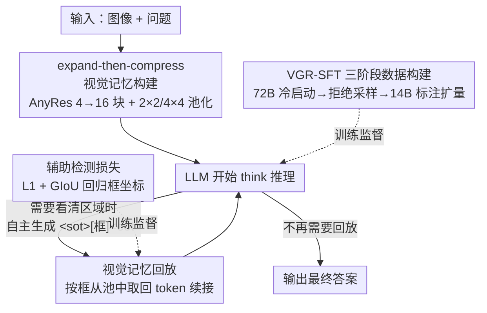

# VGR: Visual Grounded Reasoning

**会议**: ICLR 2026  
**OpenReview**: [https://openreview.net/forum?id=kDhAiaGzrn](https://openreview.net/forum?id=kDhAiaGzrn)  
**代码**: https://huggingface.co/BytedanceDouyinContent/VGR (数据公开)  
**领域**: 多模态VLM / LLM推理  
**关键词**: 多模态推理, 视觉接地, 视觉记忆回放, 思维链, SFT 数据构建

## 一句话总结
VGR 让多模态大模型在思考过程中像人一样"回放视觉记忆"——推理时自主框出关键区域并把该区域的高分辨率视觉 token 取回来续接思考，配合一套带 grounding 信号的 VGR-SFT 数据，在仅用 LLaVA-NeXT 30% 视觉 token 的前提下，于 ChartQA、AI2D、MMStar 等细粒度图像理解任务上大幅超过基线。

## 研究背景与动机
**领域现状**：受 OpenAI-o1、DeepSeek-R1 等推理 LLM 启发，多模态推理近来普遍走"把强 LLM 的思维链蒸馏进 MLLM"的路线，在数学、科学这类题目上拿到了不错的结果。

**现有痛点**：这些方法的推理几乎全发生在**纯语言空间**里——模型把图看一眼、转成文字描述后就只在文字上做链式推导。这带来两个问题：一是 **language bias**（语言先验偏置），模型过度依赖文字常识，在需要看清图像细节的感知密集型任务上反而系统性掉点，已有工作甚至发现 CoT prompting 会让感知任务表现**变差**；二是这种范式被局限在数学/科学领域，应付不了图表读数、文档 OCR、细粒度定位这类"答案就藏在图里某个小区域"的任务。

**核心矛盾**：推理过程需要反复回看图像的具体区域，但纯文字思维链一旦把图压成一段固定描述，后续推理就再也"看不到"原图细节了；而要保留细节就得堆视觉 token，又会让计算开销爆炸。细节保真与效率在传统架构里是对立的。

**本文目标**：让 MLLM 在推理途中能**按需、自主**地把注意力投向图像任意区域，并真正把该区域的视觉特征引入思考，而不是只输出一个框坐标了事。

**切入角度**：作者类比人类认知——人不仅用语言推理，还会在脑中"回放"和模拟视觉内容。于是把传统纯文本 CoT 扩展成图文交织的多模态推理轨迹，让模型在需要时**选择性地检索视觉记忆**。

**核心 idea**：用"先接地、再回答"（grounding-then-answering）取代纯语言 CoT——模型在思考中生成回放信号框出关键区域，系统据此从视觉记忆池里取回对应 token 拼回序列，让细粒度视觉细节直接参与后续推理。

## 方法详解

### 整体框架
VGR 的输入是一张图 + 一个问题，输出是一段**图文交织的思维链 + 最终答案**。整套系统围绕一个"视觉记忆池"运转：图像先用 AnyRes 策略切成高分辨率块编码，所有块特征拼成一张细粒度特征图 $S$ 存进**视觉记忆**；模型像普通 MLLM 一样开始 `<think>` 推理，当它判断"这里需要看清某个区域"时，就自己吐出一个回放信号 `<sot>[x1,y1,x2,y2]<eot>`；解析器一旦检测到 `<eot>`，就回头取出框坐标，从记忆池特征图 $S$ 上裁出对应区域、池化压缩后把这些视觉 token 紧跟在信号后面插入序列，模型带着这些"取回的视觉细节"继续往下推理，如此可多次触发。训练侧则有一条**三阶段数据流水线**专门生产带 grounding 信号的 SFT 数据来教会模型这套行为。

### 关键设计

**1. 动态视觉记忆回放：让模型在思考途中按需取回视觉细节**

这是 VGR 的核心机制，直接针对"纯文本 CoT 一旦把图压成文字就再也看不到原图细节"的痛点。作者预定义一个回放控制信号——区域以 `<sot>[x1, y1, x2, y2]<eot>` 记法表示，$[x_1,y_1]$ 为左上角、$[x_2,y_2]$ 为右下角。推理时模型被鼓励在需要扩充视觉线索时**自己生成**这种信号；系统实时监控输出，一旦解析到 `<eot>` 就回看前文抽出坐标，若合法就从视觉记忆特征图 $S$ 上裁出对应区域 $R_{x_1,y_1,x_2,y_2}$，经 $2\times2$ 池化展平成一维 token 序列，紧跟控制信号插入 LLM 输入。训练时实现非常直接：把取回的 token $R$ 加到回放信号之后的训练序列里，用标准 SFT 监督——信号 token 和文本 token 用交叉熵监督，**所有图像 token（原始输入 + 回放区域）都不计入 loss**。消融显示，如果只让模型输出框却不真正把区域特征拼回序列（w/o replay），提升非常有限，证明"把边界区域的图像特征真正引入推理"才是涨点关键，而非单纯定位。

**2. Expand-then-compress 视觉记忆构建：在保留高分辨率细节和控制 token 预算之间找平衡**

回放机制要好用，前提是记忆池里存的特征足够细——但细就意味着 token 多、开销大。作者用"先扩张再压缩"破解：把 LLaVA AnyRes 的最大切块数从 4 提到 **16** 块（扩张，支持分辨率提升 5×），再引入一个 2D 池化压缩层（压缩）。具体地，输入图先 resize 到 $H\times W$（$H,W$ 可被 $p=336$ 整除），切成不重叠的 $p\times p$ 块 $P_{ij}$，各块经视觉编码器与 adapter 得到语言空间 token $T_{i,j}=F_{adapter}(F_{vision}(P_{ij}))$，再把各块特征拼成统一特征图 $S$ 作为视觉记忆。压缩上对快照图（snapshot）用 $2\times2$ 池化、对高分辨率 AnyRes 块用 $4\times4$ 池化。结果是：基线每图最多 2880 token（576/块 × 5），VGR 快照只用 144 token、高分辨率块最多 720 token，**整体 token 减少约 70%，分辨率却扩了 5×**。这一设计让"细粒度可检索"和"低开销"同时成立，也是 VGR 反而比传统 MLLM 更省的原因。

**3. 辅助检测损失：用连续回归校准框坐标，绕开 token 量化误差**

回放区域准不准直接决定取回的视觉细节有没有用，但坐标在序列里其实是被 tokenize 成数字的，纯交叉熵在 token 化的框上容易受**量化误差和预测不连续**之苦。作者额外加一个检测损失 $L_{det}$，把它当成一个直接的回归任务来精确对齐空间位置：用一个小 MLP 把 `<eot>` 的隐状态映射成 4 维框，损失为 L1 与 GIoU 的组合 $L_{det}=\ell_1+\beta\ell_{GIoU}$（$\beta=2$）。其中 $\ell_1=|\hat{x}_c-x_c|+|\hat{y}_c-y_c|+|\hat{w}-w|+|\hat{h}-h|$ 度量框参数的绝对差，GIoU 损失 $\ell_{GIoU}=1-\big(\frac{\text{InterArea}}{\text{UnionArea}}-\frac{C-\text{UnionArea}}{C}\big)$ 在 IoU 基础上引入最小包围框 $C$ 以处理不相交情形。连续回归与离散生成结合，让定位既精确又稳定。

**4. VGR-SFT 三阶段数据构建：自动造出带 grounding 信号、且区域由模型自发产生的推理数据**

模型不会凭空学会"先接地再回答"，关键在数据。和此前要么纯文本 CoT、要么强制刚性多轮交互的工作不同，VGR 的数据里**所有 grounding 区域都由模型自发生成**，避免人工标注偏置。流水线分三阶段：① **冷启动**——用一个 72B 大 MLLM 对图+问题同时产出推理链、答案，并以 JSON 形式定位所有与答案相关的关键区域作为回放区域；② **拒绝采样**——做格式校验（答案可解析、框/标签合法 JSON）、正确性校验（闭集任务用 ANLS 比对、开放任务用 MLLM 语义对齐，错的丢弃、不准的改写）、视觉接地校验（裁出区域让 MLLM 核对内容与标签是否一致，并刻意外扩框以保留上下文）；③ **标注模型扩量**——冷启动 72B 拒绝率高、生成慢（通过率仅 14%），于是用通过拒绝采样的数据 + Open-R1 蒸馏数据训一个 14B 标注模型，把通过率提到 **40%**、标注提速 **3.2×**，从而低成本扩到 158K。最终数据严格只取自 LLaVA-NeXT 原始 SFT 数据、不引入额外数据，保证与基线的公平比较。

### 损失函数 / 训练策略
沿用 LLaVA-NeXT 的两阶段：预训练（LLaVA-558K，lr 1e-5）+ 监督微调（LLaVA-NeXT-770K 与自建 158K 合并，lr 2e-5，ViT 学习率取基座的 1/10）。视觉编码器 CLIP-ViT-L/14@336，基座 LLM 为 Vicuna-v1.5（7B/13B）。总损失 = 文本/信号 token 的交叉熵 + 辅助检测损失 $L_{det}$，全部图像 token 不计入语言损失。

## 实验关键数据

### 主实验
在 LLaVA-NeXT-7B（Vicuna-7B）设定下与多种视觉语言模型对比（部分代表性数值）：

| 方法 | #Vtoken | MMStar | ChartQA | AI2D | InfoQA | RWQA | POPE |
|------|---------|--------|---------|------|--------|------|------|
| LLaVA-NeXT-7B | 2880 | 37.6 | 54.8 | 66.6 | 37.1 | 57.8 | 86.5 |
| LLaVA-NeXT-7B†（复现+池化） | 864 | 37.2 | 58.7 | 68.5 | 34.7 | 56.8 | 87.8 |
| VGR-7B | 864 | 41.7 | 67.7 | 73.7 | 39.8 | 59.8 | 88.2 |
| VGR-7B | 3024 | 43.6 | 72.8 | 73.4 | 42.9 | 59.5 | 87.8 |

在相近甚至更少 token 下 VGR 全面领先；摘要口径下，相对基线用 0.3× 视觉 token 即取得 +4.1 MMStar、+7.1 AI2D、+12.9 ChartQA 的提升，且 token 越多差距越明显。

### 消融实验
数据成分消融（Table 4，VGR-7B 完整模型 MMStar 41.7 / ChartQA 67.7）：

| 配置 | MMStar | ChartQA | 说明 |
|------|--------|---------|------|
| VGR-7B（Full） | 41.7 | 67.7 | grounding + reasoning 缺一不可 |
| w/o Memory | 39.7 | 66.2 | 只留推理、去掉框与回放，MMStar 掉 2.0 |
| w/o Reasoning | 39.3 | 59.6 | 去掉推理过程，ChartQA 掉 8.1 |

跨骨干泛化（Table 3）：换 Qwen2.5+SigLIP、Qwen2.5+InternViT、Vicuna+CLIP 三种组合，加 VGR 后在 V\* Bench、HR-Bench8K 等高分辨率接地任务上分别有 +11~+14 的大幅提升，证明框架不绑定特定骨干。

### 关键发现
- **"框 + 回放"必须配合推理才有效**：单独去掉视觉记忆或去掉推理都会掉点，两者互补才达最优；尤其只输出框却不回放特征（w/o replay）提升极其有限——涨点来自真正把区域特征引入推理，而非定位本身。
- **聚焦关键区域 > 单纯堆 token**：VGR 用 0.3× 视觉 token 超过堆满 token 的基线，且 token 越多优势越大，说明"看对地方"比"看得多"更划算。
- **现成 CoT 数据反而有害**：直接用 LLaVA-CoT、MMPR 这类纯文本推理数据训练，ChartQA/DocVQA 甚至低于基线（language bias 累积），而 VGR 的区域引导数据能稳定涨点。
- **改写后的精简数据更好**：标注后的原始长数据上下文太长、易出错；总结压缩成较短的改写数据后，推理更清晰，接地推理能力更强。
- **回放区域要更细的池化**：基座图与回放记忆用 $2\times2$、局部块用 $4\times4$ 最优——RoI 比有冗余的局部裁块更需要保真。

## 亮点与洞察
- **把"视觉注意力"显式写进推理轨迹**：用 `<sot>...<eot>` 信号让模型在思考流里自己决定何时、看哪、取回什么，是把人类"回看图像"的认知行为做成可训练接口的巧妙落点。
- **expand-then-compress 让"更细"反而"更省"**：扩切块提分辨率、再用差异化池化压 token，打破了"细节保真 vs. 计算开销"的对立，是可直接迁移到其他高分辨率 MLLM 的工程 trick。
- **数据自驱、区域自发**：grounding 区域全由模型自己生成而非人工框，规避标注偏置；再用小标注模型把昂贵的 72B 冷启动数据放大 5 倍多，是低成本造高质量多模态推理数据的实用范式。
- **连续回归校准离散坐标**：在 `<eot>` 隐状态上挂一个 L1+GIoU 检测头，绕开 token 化坐标的量化误差，这个"生成 + 回归"双轨思路可用于任何需要 MLLM 输出精确数值/坐标的场景。

## 局限与展望
- **主要靠 SFT，未上 RL**：相关工作里 VLM-R1、Visual-RFT 等显示 RL 在开放式接地上常优于 SFT，VGR 走纯 SFT 路线，grounding 的探索性可能受限。
- **依赖大模型造数据**：冷启动需 72B MLLM，且冷启动通过率仅 14%，整条流水线对强标注模型与算力有较强依赖。
- **验证集中在 LLaVA-NeXT 谱系**：主结果以 7B/13B Vicuna + CLIP 为主，更大规模、更强基座（如原生多模态预训练模型）上的收益是否保持有待观察。
- **回放正确性受框预测制约**：若模型框错区域，取回的视觉细节反而可能误导推理，检测损失只能缓解而非杜绝。

## 相关工作与启发
- **vs 纯文本 CoT（LLaVA-CoT / MMPR）**：它们在语言空间做推理，VGR 把视觉特征按需拼回推理序列；实验中前者在感知任务上甚至低于基线，VGR 稳定涨点，说明关键在"推理时还能看到图"。
- **vs 刚性多轮视觉搜索（Zoomeye / Chain-of-Spot / V\* 系）**：这些方法靠人类式缩放或固定多轮交互探索区域，VGR 让模型在单条推理轨迹里**自主、任意次**地框区域并回放，更灵活、且区域由模型自发产生。
- **vs RL 接地（VLM-R1 / Visual-RFT）**：它们用 GRPO 做开放式 grounding，VGR 用带 grounding 信号的 SFT 数据 + 检测损失实现，作者将其定位为对现有路线互补的方法论。

## 评分
- 新颖性: ⭐⭐⭐⭐⭐ "视觉记忆回放"把视觉注意力做成推理轨迹里的可训练信号，范式清晰且少见
- 实验充分度: ⭐⭐⭐⭐ 多 benchmark、多骨干、丰富消融，但缺与 RL 路线的直接对照和更大规模验证
- 写作质量: ⭐⭐⭐⭐ 机制与数据流水线讲解清楚，公式完整；个别表述略有笔误
- 价值: ⭐⭐⭐⭐⭐ 用 0.3× token 大幅涨点，expand-then-compress 与自驱数据流水线都很实用易迁移

<!-- RELATED:START -->

## 相关论文

- [\[ICLR 2026\] Composition-Grounded Data Synthesis for Visual Reasoning](composition-grounded_data_synthesis_for_visual_reasoning.md)
- [\[CVPR 2026\] TerraScope: Pixel-Grounded Visual Reasoning for Earth Observation](../../CVPR2026/vlm_reasoning/terrascope_pixel-grounded_visual_reasoning_for_earth_observation.md)
- [\[CVPR 2026\] Thinking Diffusion: Penalize and Guide Visual-Grounded Reasoning in Diffusion Multimodal Language Models](../../CVPR2026/vlm_reasoning/thinking_diffusion_penalize_and_guide_visual-grounded_reasoning_in_diffusion_mul.md)
- [\[ICLR 2026\] IV-Bench: A Benchmark for Image-Grounded Video Perception and Reasoning in Multimodal LLMs](iv-bench_a_benchmark_for_image-grounded_video_perception_and_reasoning_in_multim.md)
- [\[CVPR 2026\] AV-Reasoner: Improving and Benchmarking Clue-Grounded Audio-Visual Counting for MLLMs](../../CVPR2026/vlm_reasoning/av-reasoner_improving_and_benchmarking_clue-grounded_audio-visual_counting_for_m.md)

<!-- RELATED:END -->
