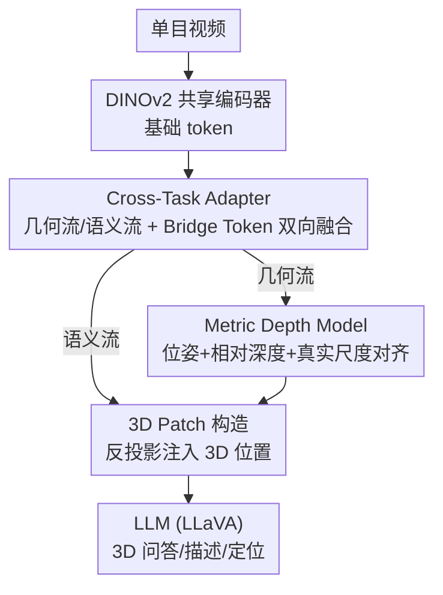

# Vid-LLM: A Compact Video-based 3D Multimodal LLM with Reconstruction–Reasoning Synergy

**会议**: ICLR 2026  
**OpenReview**: [https://openreview.net/forum?id=l1cLdEjESj](https://openreview.net/forum?id=l1cLdEjESj)  
**项目页**: https://chenhaijier.github.io/Vid-LLM/  
**代码**: 暂未公开（论文承诺开源）  
**领域**: 多模态VLM / 3D视觉  
**关键词**: 3D多模态大模型, 视频输入, 三维重建, 几何-语义对齐, 双教师蒸馏

## 一句话总结
Vid-LLM 只用单目视频作为输入，通过一个让"重建"和"推理"互相增强的 Cross-Task Adapter，把视频里直接重建出的几何先验注入到大语言模型中，在 3D 问答、稠密描述、视觉定位三类任务上达到了接近"吃 3D 点云"模型的水平，却不再需要任何外部点云、深度或位姿输入。

## 研究背景与动机
**领域现状**：把多模态大模型（MLLM）从 2D 扩展到 3D 场景理解，是当下的热门方向，催生了一批 3D-MLLM。它们把 3D 场景理解和视觉-语言推理统一在"语言接口"下，用语言去回答"沙发右边的椅子在哪""房间中央放了什么"这类需要空间感的问题。

**现有痛点**：几乎所有 3D-MLLM 都依赖显式的 3D 输入——点云、重建好的场景、多视角渲染图，或带语义标注的物体。要拿到这些输入，先得做一整套重建/配准/标注流水线，数据采集、预处理、显存和延迟成本都很高。这套刚性的输入要求和系统复杂度，从根本上限制了 3D-MLLM 的可扩展性和迁移性，让它很难真正部署到现实场景。

**核心矛盾**：3D-MLLM 想要好的空间推理，就得喂"昂贵且难获取的几何输入"；想要便宜可扩展，就只能退回纯 2D，丢掉几何，空间推理又上不去。几何质量与系统轻量之间存在直接的 trade-off。

**本文目标**：让模型只看视频，就能既"重建出几何"又"做好 3D 视觉-语言推理"，从而摆脱对外部深度、位姿、配准模块的依赖。这要解决两个子问题：一是怎么从视频里拿到带真实尺度的几何，二是怎么把这些几何先验紧凑地塞进 MLLM 而不破坏它的语言能力。

**切入角度**：作者抓住一个被忽视的观察——重建和推理本质上是互相依赖的：几何结构是语义理解的底座，而语义推理反过来又能给几何建模提供上下文先验。既然如此，不该把"重建"当成一个独立前处理模块拼在前面，而应该让两者在特征层面耦合、互相约束。

**核心 idea**：用一个 Cross-Task Adapter 把"几何流"和"语义流"双向打通，让视频驱动的重建分支和语言推理分支在同一套共享特征上互相强化，再配一个能恢复真实尺度的 Metric Depth Model 和两阶段蒸馏训练，把这套协同关系压进一个紧凑模型里。

## 方法详解

### 整体框架
Vid-LLM 要做的事是：输入一段单目视频，输出对 3D 场景的语言回答（问答 / 描述 / 定位坐标），中间不碰任何外部 3D 数据。整条管线可以这样转：视频帧先过一个共享视觉编码器 DINOv2 得到基础 token；Cross-Task Adapter（CTA）把这些 token 分成几何流和语义流，并用一组可学习的 Bridge Token 让两条流双向交换信息；几何流送进重建分支，由 Global-Frame Attention 主干预测相机位姿和相对深度，再由 Metric Depth Model 恢复真实尺度；语义流则结合重建出的几何，把每个 2D 特征反投影成带 3D 位置的"3D patch"，喂给 LLM 做空间推理。整套架构用两阶段训练（先双教师蒸馏、后联合优化）来收敛。

### 关键设计

**1. Cross-Task Adapter：在特征层把几何与语义双向焊死**

这一设计针对的痛点是：以往把重建当成上游模块、推理当成下游模块，几何先验只是单向"喂"给语言模型，两者并不互相约束，几何噪声会无脑传给推理、推理也无法反过来修正几何。CTA 的做法是先用两个轻量 MLP 投影头 $\phi_{geom}(\cdot)$ 和 $\phi_{lang}(\cdot)$ 把共享 token $T_{base}$ 拆成几何特征 $T_{geom}=\phi_{geom}(T_{base})$ 和语义特征 $T_{lang}=\phi_{lang}(T_{base})$，再引入一组可学习的 Bridge Token $T_{bridge}\in\mathbb{R}^{K\times C}$ 当作"共享记忆单元"，分别去注意几何和语义两条流：

$$T'_{bridge} = \mathrm{Attn}(T_{bridge}, T^{fused}_{geom}, T^{fused}_{geom}) + \mathrm{Attn}(T_{bridge}, T^{fused}_{lang}, T^{fused}_{lang})$$

更新后的 Bridge Token 再回写进两条流，得到增强后的 $T'_{geom}$ 和 $T'_{lang}$。Bridge Token 像一座桥，把几何信号和语义信号在训练中动态地来回搬运，让"几何约束语义、语义引导几何"这件事真正发生在特征层面，而不是事后拼接。和旧方法相比，它的关键区别是把两个任务做成了相互增强、相互约束的耦合体。

**2. Metric Depth Model 与真实尺度对齐：把"相对几何"校准到现实单位**

视频重建天然只能给出尺度未知的相对几何，但 3D 视觉定位要输出真实坐标，没有真实尺度就没法做。作者给 DINOv2 特征接了一个 DPT 风格解码器产出多尺度深度，每个像素的深度用 bin 化建模——对第 $k$ 个 bin 的概率 $p_i(k)$ 和精修后的中心 $c_i(k)$ 共同决定预测 $\hat{d}(i)=\sum_{k=1}^{N}p_i(k)\,c_i(k)$，并用一个顺序感知的归一化来保住相对深度的排序；bin 中心还会按解码器特征自适应精修 $c_i(k)=c_k+\Delta c_i(k)$。拿到 metric 深度 $\hat{D}_{metric}$ 后，关键一步是真实尺度对齐：通过加权最小二乘估计 DPT 头给出的相对深度 $\hat{D}_{rel}$ 与 $\hat{D}_{metric}$ 之间的缩放因子，每个场景随机采 16 帧算逐帧因子、取中位数当作场景级因子，再把相对深度和相机位姿一并换算到真实单位。值得注意的是作者并不直接把 metric 深度当最终输出，而是用它来"标定" DPT 深度——因为 DPT 头的纹理细节更准，metric 模型只负责提供稳健的全局尺度线索，两者分工互补。

**3. 3D Patch 构造：把几何坐标缝进语义 token，让 LLM"看见"空间**

CTA 给出的语义特征本身是 2D 的，LLM 拿到也只能做 2D 理解。这一步把重建出的几何缝回语义里：用估计的深度 $\hat{D}$、相机位姿 $(\hat{R},\hat{t})$ 和内参 $K$，把每个 2D 特征位置 $T'_{lang}(i,j)$ 反投影到相机坐标系：

$$P_v(i,j) = \hat{R}^{-1}K^{-1}[i,j,1]^\top \hat{D}(i,j) - \hat{R}^{-1}\hat{t}$$

再用一个 MLP 把坐标编码成与语义特征同维的位置嵌入 $P'_v(i,j)$，最后把几何和语义直接相加得到 3D patch token $T_{3D}(i,j)=T'_{lang}(i,j)+P'_v(i,j)$，送进 LLM。这等于把每个语义 token 都打上了"它在 3D 空间里的位置"标签，从而把空间感直接注入到语言模型的输入里，让它能回答带坐标、带方位的问题。

**4. 两阶段训练与单向梯度：先各自学会、再联合调，桥保持稳定**

直接端到端联合训练会让几何和语义互相干扰、收敛慢。作者拆成两阶段。Stage-1 双教师蒸馏：让 DINO 编码器和 CTA 同时跟两个老师学——几何老师是从 VGGT 初始化的 DINO 编码器，语义老师是从 LLaVA-3D 初始化的 CLIP 编码器，蒸馏损失为 $L_{distill}=L^{feat}_{geo}+L^{feat}_{lang}+\lambda L_{sc}$，其中几何用 patch 级 L2 损失、语义用池化特征的余弦损失，外加一个结构一致性损失 $L_{sc}=\frac{1}{M^2}\lVert S_{stu}-S_{tea}\rVert_F^2$（$S=ZZ^\top$ 是几何+语义拼接 token 的 Gram 矩阵），保证学生在"几何-语义关系结构"上也对齐老师。Stage-2 联合优化所有模块：$L_{joint}=L_{recon-task}+L_{VL-task}+L_{MD}$，其中 metric 深度损失 $L_{MD}=b^2+\frac{1}{K}\sum_{i=1}^{K}\frac{(e_i-b)^2}{1+\alpha|e_i-b|}$（$e_i$ 为对数深度误差、$b$ 为均值、$\alpha$ 控制对大残差的鲁棒下权）。关键的一笔是单向梯度：3D-VL 推理分支的损失不回传去优化重建模型，只有重建损失和 metric 深度损失更新重建分支，而共享的 CTA 同时被重建损失和 VL 损失优化。这样 CTA 才能当一座稳定的桥来做几何-语义交换，避免推理梯度把几何结构带歪。

### 损失函数 / 训练策略
两阶段总览：Stage-1 蒸馏 $L_{distill}=L^{feat}_{geo}+L^{feat}_{lang}+\lambda L_{sc}$ 让共享编码器同时具备几何与语义能力；Stage-2 联合损失 $L_{joint}=L_{recon-task}+L_{VL-task}+L_{MD}$，其中 $L_{recon-task}$ 含相机、深度、点图损失（沿用 VGGT），$L_{VL-task}$ 含指令跟随的交叉熵以及定位任务的框回归与匹配损失（沿用 LLaVA-3D）。整体靠"先蒸馏后联合 + 单向梯度"实现快速收敛与稳定训练。

## 实验关键数据

### 主实验
3D 问答（ScanQA / SQA3D），Vid-LLM 在纯视频输入下逼近甚至接近"吃 3D 几何"的模型：

| 任务/数据集 | 指标 | Vid-LLM | 视频类最强对手 3DRS† | 3D 输入类 SOTA 3DRS |
|------|------|------|------|------|
| ScanQA | CIDEr↑ | 101.9 | 94.7 | 104.8 |
| ScanQA | EM@1↑ | 27.6 | 23.9 | 30.3 |
| SQA3D | EM@1↑ | 57.3 | 54.5 | 60.6 |
| Scan2Cap（稠密描述）| CIDEr@0.5↑ | 80.6 | —（ChatScene* 58.1）| 85.0 |
| ScanRefer（视觉定位）| Acc@0.25↑ | 55.8 | —（ChatScene* 33.2）| 57.3 |

在视频类模型里 Vid-LLM 全面领先（ScanQA CIDEr 101.9 vs 3DRS† 94.7），且把和"吃点云"的 3D 类 SOTA 的差距压得很小（ScanQA 仅差约 2.9 CIDEr，ScanRefer Acc@0.25 仅差 1.5）。

### 消融实验
在 ScanQA 和 ScanRefer 上逐个加回三大组件（CTA：Cross-Task Adapter；MDM：Metric Depth Model；TSD：两阶段蒸馏）：

| 配置 | ScanQA C↑ | ScanQA EM@1↑ | ScanRefer Acc@0.25↑ | 说明 |
|------|------|------|------|------|
| 全部去掉 | 89.3 | 22.1 | 47.6 | 裸基线 |
| +CTA | 95.4 | 24.8 | 51.2 | 加几何-语义双向融合 |
| +CTA+MDM | 99.1 | 26.3 | 53.7 | 再加真实尺度恢复 |
| +CTA+MDM+TSD | 101.9 | 27.6 | 55.8 | 完整模型 |

### 关键发现
- CTA 贡献最大：单加 CTA 就让 ScanQA CIDEr 从 89.3 涨到 95.4（+6.1）、ScanRefer Acc@0.25 +3.6，说明"几何-语义双向耦合"本身就是涨点主力，印证了重建-推理协同的核心假设。
- MDM 对定位类任务尤其关键：加上真实尺度恢复后 ScanRefer 再 +2.5，因为视觉定位要输出真实坐标，没有真实尺度无从谈起。
- 两阶段蒸馏（TSD）是稳定收敛的最后一块拼图，叠加后三项指标继续上行（CIDEr +2.8），但增益小于前两项，说明它更多是"训练稳定/收敛"层面的助力而非新能力来源。
- 整体上模型在"几乎追平 3D 输入 SOTA"的同时只用视频，证明几何先验确实可以从视频里学出来并紧凑注入 MLLM。

## 亮点与洞察
- **把重建和推理做成"互相增强"而非"前后拼接"**：CTA + Bridge Token 的双向注意力，让几何流和语义流在特征层互通有无，这是全文最"啊哈"的点——它把一个工程化的前处理模块，变成了一个可学习的协同机制。
- **用 DPT 准、metric 稳，互相标定而非二选一**：不直接用 metric 深度当输出，而是用它的全局尺度去校准更精细的 DPT 深度，这个"分工互补"的小设计很巧，可迁移到任何"既要细节又要绝对尺度"的深度估计场景。
- **单向梯度保护共享桥**：让 VL 损失不回传重建分支，避免高层语义梯度污染底层几何，这种"保护性梯度隔离"思路在多任务共享 backbone 时很有借鉴价值。
- **3D patch = 语义 token + 反投影位置嵌入**：用最朴素的相加把空间坐标缝进语义，简单却有效，给"如何让 2D LLM 获得 3D 空间感"提供了一个轻量范式。

## 局限与展望
- 论文写作存在多处笔误（如 "sceen"、表述不一致），部分公式细节（如 Metric Bins 的精修项 $\Delta c_i(k)=r_k(F_i)$）描述较简略，复现时需对照原文与代码（⚠️ 以原文为准）。
- 重建质量受单目视频本身限制：遮挡严重、纹理缺失或相机运动微弱时，深度/位姿估计可能不准，进而拖累下游推理，论文未充分讨论这类失败场景。
- 与 3D 输入类 SOTA 仍有小幅差距（ScanQA、ScanRefer 上约差 1.5~3 个点），在对精度极敏感的定位任务上，纯视频路线尚未完全追平点云路线。
- 真实尺度依赖每场景采 16 帧取中位数的启发式标定，对帧采样和场景规模可能敏感，泛化到大场景或长视频时的稳健性有待验证。

## 相关工作与启发
- **vs VGLLM / Uni3DR2（视频类 3D-MLLM）**：它们也走视频路线（如借用 VGGT 几何编码器抽 3D 特征），但更偏"取出几何特征直接用"；Vid-LLM 的区别在于用 CTA 让几何与语义双向耦合、并显式恢复真实尺度，因此在视频类模型里全面领先。
- **vs LLaVA-3D / 3DRS（3D 输入类 SOTA）**：它们吃点云或 VGGT 生成的 3D 几何，精度更高但依赖显式 3D 输入；Vid-LLM 用纯视频换来了部署友好性，并把精度差距压到很小，是"可扩展性换少量精度"的务实权衡。
- **vs 显式几何注入类 VLM（喂深度/点云/场景图）**：那类方法把几何当额外模态注入；Vid-LLM 则是通过视频驱动的重建分支"自产"几何并与语义对齐，得到的是一种结构化、可复用的几何先验集成方式。

## 评分
- 新颖性: ⭐⭐⭐⭐ 重建-推理协同 + Bridge Token 双向融合是有想法的设计，但单个组件多基于已有工作（VGGT/DPT/LLaVA-3D）拼装。
- 实验充分度: ⭐⭐⭐⭐ 覆盖问答/描述/定位三类任务且消融清晰，但缺少效率/显存对比和失败案例分析。
- 写作质量: ⭐⭐⭐ 思路讲得清，但存在明显笔误和部分公式描述粗糙，影响阅读与复现。
- 价值: ⭐⭐⭐⭐ 纯视频逼近点云级 3D 推理，对真实部署很有意义，路线值得继续推进。

<!-- RELATED:START -->

## 相关论文

- [\[ICLR 2026\] Reasoning-Driven Multimodal LLM for Domain Generalization](reasoning-driven_multimodal_llm_for_domain_generalization.md)
- [\[CVPR 2026\] Self-Consistency for LLM-Based Motion Trajectory Generation and Verification](../../CVPR2026/vlm_reasoning/self-consistency_for_llm-based_motion_trajectory_generation_and_verification.md)
- [\[ICML 2026\] LIMSSR: LLM-Driven Sequence-to-Score Reasoning under Training-Time Incomplete Multimodal Observations](../../ICML2026/vlm_reasoning/limssr_llm-driven_sequence-to-score_reasoning_under_training-time_incomplete_mul.md)
- [\[CVPR 2026\] G$^2$VLM: Geometry Grounded Vision Language Model with Unified 3D Reconstruction and Spatial Reasoning](../../CVPR2026/vlm_reasoning/g2vlm_geometry_grounded_vision_language_model_with_unified_3d_reconstruction_and.md)
- [\[ICLR 2026\] MetaSpatial: Reinforcing 3D Spatial Reasoning in VLMs for the Metaverse](metaspatial_reinforcing_3d_spatial_reasoning_in_vlms_for_the_metaverse.md)

<!-- RELATED:END -->
