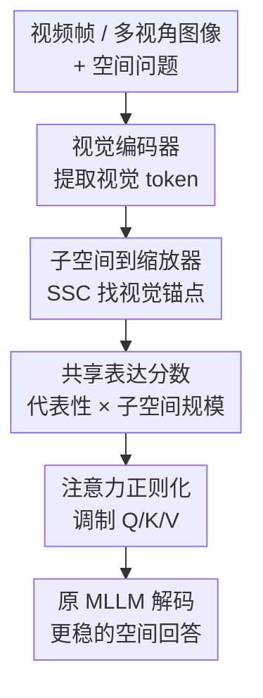

# VideoAnchor: Reinforcing Subspace-Structured Visual Cues for Coherent Visual-Spatial Reasoning

**会议**: ICLR 2026  
**OpenReview**: [https://openreview.net/forum?id=2JLPQbHABc](https://openreview.net/forum?id=2JLPQbHABc)  
**代码**: https://github.com/feufhd/VideoAnchor  
**领域**: 多模态 VLM / 视频视觉-空间推理  
**关键词**: 视频空间推理, 注意力增强, 稀疏子空间聚类, 测试时插件, 视觉锚点  

## 一句话总结
VideoAnchor 是一个无需训练的测试时插件，它用稀疏子空间聚类从视频或多视角图像 token 中找出跨帧稳定的“视觉锚点”，再把这些锚点转成 Q/K/V 注意力缩放因子，从而缓解 VLM 过度依赖文本先验的问题，并在 VSI-Bench、All-Angles-Bench、SPAR-Bench 和 Video-MME 的空间相关任务上稳定提升多种 MLLM。

## 研究背景与动机

**领域现状**：视频和多视角 VLM 已经能处理图像问答、视频描述、长视频理解等任务，但视觉-空间推理仍然是短板。这里的空间推理不是简单识别“有一张桌子”，而是要在多帧之间保持对象、房间结构、相对方位和共同参照物的一致理解，例如判断“站在电视旁面向入口时，壁炉在左边还是后面”。

**现有痛点**：主流 MLLM 在这类问题上常常会给出语言上顺滑、视觉上不可靠的回答。论文认为关键原因在注意力层：文本 token 在多模态上下文里往往占据更强的先验，单个视觉 token 的贡献太弱，模型很难稳定地把跨帧出现的同一类区域或同一对象当作共同参照。于是，即使画面里存在沙发、柜子、壁炉这类可作为空间锚点的结构，模型也可能在不同帧之间“看散了”。

**核心矛盾**：视频空间推理需要跨帧连续的视觉证据，但普通 patch/token 级注意力把视觉 token 当作相对独立的点处理，缺少一种把“属于同一语义结构、能相互解释的视觉 token”组织起来的机制。单纯提高分辨率、加更多视觉 token 或重新训练空间数据集可以缓解一部分问题，但会带来更高推理成本、额外训练成本，且不一定能泛化到不同 MLLM。

**本文目标**：作者希望在不重新训练 MLLM 的前提下，让模型在推理时更重视跨帧稳定的视觉结构。具体来说，方法要能从视觉 token 中找出共享区域或对象线索，把这些线索变成可插入 Transformer attention 的调制信号，并且对 InternVL、Qwen2.5-VL、LLaVA-Video 等不同骨干都适用。

**切入角度**：论文把稀疏子空间聚类（Sparse Subspace Clustering, SSC）的 self-expressiveness 性质和 Transformer attention 联系起来。SSC 假设同一子空间内的数据点可以由彼此线性重构；放到视觉 token 上，这意味着如果一批 token 反复出现在相似语义区域或跨帧共同结构中，它们应该能形成更稳定的子空间。这样的 token 就适合充当视觉锚点。

**核心 idea**：用 SSC 在测试时发现跨帧共享的视觉子空间，再把 token 的子空间代表性变成注意力缩放因子，让 MLLM 在生成答案时把更多注意力和表示容量分配给稳定视觉证据，而不是只沿着文本先验推理。

## 方法详解

### 整体框架
VideoAnchor 的输入是一段视频帧或多视角图片，加上用户问题；输出仍然由原始 MLLM 生成，模型参数不更新。它插在推理阶段：先从视觉编码器得到所有视觉 token，利用 SSC 构造 token 间的自表达矩阵和子空间标签，再为每个视觉 token 计算共享表达分数，最后把分数扩展成 Q/K/V 的缩放因子，注入每一层 self-attention。

整体上看，VideoAnchor 做的不是“再训练一个空间推理模型”，而是给已有注意力加一个视觉证据偏置：越像跨帧稳定锚点的视觉 token，越容易在 query-key 匹配和 value 聚合中被放大；文本 token 的缩放分数固定为 0，因此不会额外强化文本先验。

### 关键设计

**1. 子空间到缩放器：用自表达关系找跨帧视觉锚点**

VideoAnchor 的第一步是把所有视觉 token 展平成矩阵 $X_{Vis}\in\mathbb{R}^{N_{Vis}\times D}$，其中 $N_{Vis}$ 是视觉 token 数，$D$ 是特征维度。作者用 SSC 学一个自表达矩阵 $W\in\mathbb{R}^{N_{Vis}\times N_{Vis}}$：

$$
\min_W \lambda_e\|X_{Vis}-X_{Vis}W\|_1+\lambda_z\|W\|_1,\quad \text{s.t. }\mathrm{diag}(W)=0.
$$

这个式子的直觉很直接：如果某个 token 真属于一个稳定的视觉结构，它应当能由同一子空间里的其他 token 稀疏重构出来；$\|W\|_1$ 促使每个 token 只选择少量相关邻居，$\mathrm{diag}(W)=0$ 防止 token 偷懒地用自己重构自己。相比 k-Means 这类按欧氏距离硬切聚类的方法，SSC 更适合捕捉“不同帧里同一语义区域虽然视角变化，但仍可互相解释”的结构。

求出 $W$ 后，方法用 $W+W^\top$ 构造对称邻接矩阵，再做谱聚类得到每个视觉 token 的子空间标签 $c_i$。这些标签不是最终答案，而是告诉后续模块：哪些视觉 token 可能构成同一个跨帧共享区域，例如同一组沙发、地毯、柜子或房间边界。

**2. 共享表达分数：同时看“所在子空间有多稳定”和“自身有多能解释别人”**

只知道 token 属于哪个子空间还不够，因为有些小簇可能是噪声，有些大簇里也可能有边缘 token。VideoAnchor 因此定义 sharing expression score，把子空间规模和自表达强度合在一起。对 token $i$，先计算它所在子空间的 token 数 $\pi_i$，再计算它在自表达矩阵中的行和 $r_i$：

$$
\pi_i=\sum_{j=1}^{N} \mathbf{1}(c_j=c_i),\quad
r_i=\sum_{j=1}^{N} W_{ij},\quad
\hat{s}_i=\pi_i\cdot r_i.
$$

这里 $\pi_i$ 表示这个 token 所属结构是不是足够“群体化”，$r_i$ 表示它对重构其他 token 的贡献有多强。两者相乘后，高分 token 通常既处在较稳定的共享子空间中，又对同簇或相关 token 有较强解释力，更像可用于空间推理的视觉锚点。随后作者做 min-max 归一化：

$$
s_i=\frac{\hat{s}_i-\min(\hat{s})}{\max(\hat{s})-\min(\hat{s})+\epsilon}.
$$

这个归一化很重要，因为不同视频的 token 数、场景复杂度和自表达矩阵尺度都不一样；把分数压到 $[0,1]$ 后，后续 attention 调制才不会被少数异常大值支配。

**3. 注意力正则化：把视觉锚点变成 Q/K/V 的测试时偏置**

得到视觉 token 分数 $s$ 后，VideoAnchor 把它扩展到完整的文本-视觉序列。文本 token 位置填 0，得到 $\tilde{s}$，再转成三组乘法缩放器：

$$
\gamma_Q=1+\alpha_Q\tilde{s}^\top,\quad
\gamma_K=1+\alpha_K\tilde{s}^\top,\quad
\gamma_V=1+\alpha_V\tilde{s}^\top.
$$

这样做有两个效果。第一，文本 token 不会被额外放大，因为它们对应的 $\tilde{s}$ 为 0，缩放器仍接近 1；第二，视觉锚点分数越高，它在 query-key 相似度和 value 表示中的权重越大。注意力矩阵可写成：

$$
A=\frac{(\gamma_Q\gamma_K^\top)\odot \exp(QK^\top/\sqrt{d_h})}{\sum_j(\gamma_Q\gamma_K^\top)_{:,j}\odot \exp(QK^\top/\sqrt{d_h})_{:,j}},
$$

输出表示为：

$$
Y=A\left(\mathrm{Expand}_c(\gamma_V)\odot V\right).
$$

实现上，作者不需要改 softmax 本身，而是利用等价形式 $A=\mathrm{softmax}(QK^\top/\sqrt{d_h}+\log(\gamma_Q\gamma_K^\top))$。这让 VideoAnchor 更容易插入现有 Transformer 库：本质上只是给 attention logits 加一个由视觉子空间推出来的低秩偏置，再对 value 做逐 token 放大。

**4. 插件式推理：不训练模型，但在每层持续强化视觉证据**

VideoAnchor 的定位是 plug-and-play test-time module。它不改 MLLM 权重，不需要新标注数据，也不依赖人工框选区域；在实验中，作者把 Attention Regularization Unit 插入 MLLM 的每个 block，让视觉锚点的强化贯穿整个解码过程。

这种设计的代价是 SSC/ADMM 会带来额外推理开销，复杂度随视觉 token 数约为 $O(N^2)$。论文用 CuPy 做 GPU 加速，并指出 ADMM 收敛阈值可适当放宽；在 InternVL2-8B、8 帧 VSI-Bench 上，单样本推理从 6.0 秒增至 6.8 秒，换来平均分从 34.6 到 37.8 的提升。附录还说明 VideoAnchor 的 attention bias 可分解为 rank-2 形式，理论上能接入 FlashBias，避免构造 dense attention mask。

### 一个完整示例
假设输入是 6 个室内视频帧，问题是“站在电视旁并面向入口时，壁炉在我的左边、右边还是后面？”普通 VLM 可能主要沿着文本里的“电视、入口、壁炉”做语言先验匹配，却没有稳定地追踪这些物体在不同帧中的共同参照。

VideoAnchor 会先把 6 帧的视觉 token 放在一起做 SSC。若壁炉、墙面、电视柜和入口附近结构在多帧中反复出现，它们会被分到相对稳定的子空间；其中既处在大簇里、又能解释其他相关 token 的位置会得到更高 sharing expression score。进入 attention 后，这些视觉锚点的 Q/K/V 被放大，模型生成答案时更倾向于根据跨帧稳定结构判断“面向入口”后的左右关系，而不是只根据训练语料里常见的房间描述猜一个方向。

论文的可视化也展示了类似现象：baseline 的 text-to-image attention 往往更分散，而 VideoAnchor 会把注意力重新拉向与问题相关的柜子、鞋子、壁炉等区域；在示例中，baseline 答“back”，VideoAnchor 答“left”。

### 损失函数 / 训练策略
VideoAnchor 没有训练损失，因为它不训练 MLLM，也不做参数更新。唯一需要求解的是 SSC 的测试时优化问题，作者用 ADMM 迭代更新 coefficient matrix、稀疏近似矩阵和 residual，并在 $\|A-W_{iter}\|_\infty<\epsilon$ 时停止。主要超参包括 $\rho=300$、$\lambda_z=800$、$\lambda_e=800$、收敛阈值 $2e^{-4}$、最多 10000 次迭代、谱聚类子空间数 24。

推理时生成设置保持确定性：`do_sample=False`、`num_beams=1`。不同模型的 $\alpha_Q,\alpha_K,\alpha_V$ 需要手动设定，例如 InternVL2-4B 使用 $(2.5,2.0,3.0)$，InternVL2-8B 使用 $(4.0,9.5,2.5)$，但作者的敏感性分析显示在一定范围内性能波动不大。

## 实验关键数据

### 主实验
论文在四类基准上验证 VideoAnchor：VSI-Bench 面向视频空间智能，All-Angles-Bench 面向多视角空间理解，SPAR-Bench 覆盖单视角和多视角空间任务，Video-MME 用来观察一般视频理解中的空间相关子任务。总体结论是：无论是 InternVL、Qwen2.5-VL 还是 LLaVA 系列，加入 VideoAnchor 后平均分大多稳定上升。

| 基准 | 模型 / 设置 | Baseline | + VideoAnchor | 提升 |
|------|-------------|----------|---------------|------|
| VSI-Bench | InternVL2-8B, 8 frames | 34.6 | 37.8 | +3.2 |
| VSI-Bench | Qwen2.5-VL-7B, 16 frames | 31.8 | 33.3 | +1.5 |
| VSI-Bench | LLaVA-Video-72B, 16 frames | 39.4 | 40.9 | +1.5 |
| All-Angles-Bench | LLaVA-OneVision-7B | 44.1 | 46.7 | +2.6 |
| All-Angles-Bench | LLaVA-Video-72B | 49.9 | 53.0 | +3.1 |
| SPAR-Bench | InternVL2.5-4B | 30.5 | 33.1 | +2.6 |
| Video-MME spatial | Qwen2.5VL-72B, 16 frames | 75.4 | 80.0 | +4.6 |

VSI-Bench 的细分类结果比较有代表性。以 InternVL2-8B 为例，VideoAnchor 让平均分从 34.6 提到 37.8，其中 object counting 从 23.1 到 39.3，approaching order 从 29.9 到 36.1。All-Angles-Bench 上，LLaVA-Video-72B 从 49.9 提到 53.0，尤其在 counting、relative direction 和最后一项综合空间属性上都有明显增益。Video-MME 的完整平均分提升较小，但在 spatial perception / spatial reasoning 子集上更明显，说明方法主要击中的是空间相关能力，而不是泛化成所有视频任务的万能增强。

### 消融实验
| 配置 | 关键指标 | 说明 |
|------|----------|------|
| Baseline | 34.6 | InternVL2-8B 在 VSI-Bench、8 帧设置下的原始结果 |
| UniformBoost | 34.2 | 均匀提升视觉 token 反而下降，说明“多看视觉”不等于“看对视觉” |
| k-Means | 35.2 | 简单聚类能带来 +0.6，但无法稳定捕捉跨帧子空间结构 |
| SSC | 37.8 | 子空间聚类带来 +3.2，是完整 VideoAnchor 的核心收益来源 |
| Cluster number only | 35.6 | 只看簇规模有帮助，但容易把大簇噪声也当锚点 |
| Self-expression only | 35.0 | 只看自表达强度接近 baseline，缺少子空间稳定性信息 |
| Cluster number & self-expression | 37.8 | 两者结合最好，说明代表性和共享性互补 |

Q/K/V 位置消融也支持论文的机制解释。在 InternVL2-4B 上，只缩放 V 从 31.7 提到 33.6，说明放大 anchor token 的 value 已经能增强视觉证据；同时缩放 Q 和 V 到 33.9；Q/K/V 全部缩放达到 34.5。也就是说，value amplification 是主力，query-key gating 提供额外的注意力分配稳定性。

### 关键发现
- SSC 明显优于 k-Means：UMAP 和 overlay 可视化显示，SSC 更容易把沙发、地毯、椅子等跨帧一致区域聚成语义更纯的簇，而 k-Means 在高维欧氏距离下更碎。
- 共享表达分数必须同时包含子空间规模和自表达强度。只用一个维度会么偏向大簇、么偏向局部强连接，二者结合才能形成可靠视觉锚点。
- VideoAnchor 对帧数比较稳健。InternVL2-8B 在 8/16/32/64 帧下分别从 34.6/36.8/37.4/37.6 提到 37.8/38.1/39.2/39.8；Qwen2.5-VL-7B 在 16/32 帧下也保持提升。
- 提示词无法替代机制增强。给 InternVL2-8B 加“Please anchor common objects across frames for reference.” 只从 34.6 到 35.1，而 VideoAnchor 到 37.8，说明显式视觉 token 重加权比语言提示更有效。
- 代价可控但存在。InternVL2-8B 8 帧下 runtime 从 6.0 秒到 6.8 秒；FlashBias 版本在 Qwen2.5-VL-7B 上保持相同显存 38.7 GB，runtime 从 5.8 秒到 6.1 秒，但该比较预缓存了 SSC 结果。

## 亮点与洞察
- 把 SSC 的 self-expressiveness 和 Transformer attention 接起来是本文最有意思的地方。它不是又造一个空间数据集，而是把“同一子空间内点能互相表示”解释为跨帧视觉锚点的可计算信号。
- VideoAnchor 的分数设计很克制：$\hat{s}_i=\pi_i\cdot r_i$ 同时要求一个 token 所在结构足够稳定、自己又足够有代表性。这比简单给所有视觉 token 加权更可信，也解释了 UniformBoost 为什么会掉分。
- 注意力注入方式工程上比较友好。把乘法 gate 写成 $\log(\gamma_Q\gamma_K^\top)$ 的 additive bias 后，可以尽量复用标准 softmax/attention 实现；附录进一步讨论 FlashBias 兼容性，说明作者考虑了真实部署问题。
- 它提供了一种“训练后空间补丁”的思路。很多 MLLM 在语义理解上已经很强，但空间 grounding 容易失焦；这类测试时视觉结构增强可以作为轻量适配层，迁移到机器人导航、多视角三维理解、长视频事件定位等需要稳定参照物的任务。
- 论文的失败案例也有启发：如果问题依赖未采样到的瞬时事件，或者多个近似物体被 SSC 合成一个子空间，测试时 attention 调制无法凭空恢复缺失信息。这说明视觉锚点增强和更好的采样/实例分离仍然需要结合。

## 局限与展望
- 计算开销仍然是主要限制。SSC/ADMM 对视觉 token 数是近似 $O(N^2)$，长视频、高分辨率、多帧输入下会更贵；FlashBias 能缓解 attention bias 的实现成本，但 SSC 本身仍需要优化或缓存。
- 子空间数和缩放系数需要手动设定。论文显示 $\alpha_Q,\alpha_K,\alpha_V$ 在一定范围内鲁棒，但不同模型仍用不同配置；若部署到新 backbone，仍需要调参。
- SSC 可能合并高度相似的实例。失败案例中多个沙发被聚成相近结构，导致 counting 仍然错，这说明 VideoAnchor 更擅长找稳定区域，不一定擅长区分同类实例边界。
- 采样缺失无法解决。如果关键空间关系只在未采样帧中出现，VideoAnchor 只是增强已有 token，不能补回不存在的视觉证据。
- 实验主要证明 benchmark 提升，还缺少真实交互式 embodied 场景验证。未来可以在导航、机器人抓取、多摄像头监控等任务中测试，看看视觉锚点增强是否能稳定改善决策链路。

## 相关工作与启发
- **vs 高分辨率 / 多 token 感知增强**: LLaVA-UHD、Monkey 等方法通过更细视觉输入提升细节感知，VideoAnchor 则不改变输入分辨率，而是在已有 token 上重排注意力；前者补信息，后者补 grounding，两者可能互补。
- **vs training-free visual prompt / fusion 方法**: ControlMLLM、VisionFuse、DC2 等也试图在不训练或少训练的情况下增强视觉感知，但它们可能需要人工区域、多编码器或递归分块。VideoAnchor 的优势是自动从 token 子空间里找锚点，插入方式更接近 attention bias。
- **vs 视频空间推理数据集训练**: Video-R1、Spatial-MLLM 等方法通过 GRPO 或空间数据训练提升能力，特定设置下可能更强；VideoAnchor 不训练，因此更像泛化型测试时补丁。附录里 Qwen2.5-VL 32 帧设置下 VideoAnchor 超过 Video-R1，说明避免固定帧数训练过拟合是它的优势之一。
- **vs 普通 attention reweighting**: 简单提高所有视觉 token 权重会伤害性能，说明空间推理需要的是结构化视觉证据，而不是粗暴增加视觉占比。这个结论可迁移到其他 MLLM 调参：与其“让模型多看图”，不如先定义哪些视觉 token 真有跨帧解释力。

## 评分
- 新颖性: ⭐⭐⭐⭐☆ 把 SSC 子空间结构转成 attention 缩放信号很巧，连接点清晰，但整体仍属于测试时注意力调制范式。
- 实验充分度: ⭐⭐⭐⭐☆ 覆盖 VSI-Bench、All-Angles-Bench、SPAR-Bench、Video-MME 和多个 backbone，消融充分；真实 embodied 部署还可以更进一步。
- 写作质量: ⭐⭐⭐⭐☆ 方法公式、可视化和消融逻辑完整，appendix 对运行时、FlashBias、失败案例也交代较细；部分实验表格信息密度很高，读者需要来回对照。
- 价值: ⭐⭐⭐⭐☆ 对视频/多视角 VLM 的空间 grounding 有实用价值，尤其适合不能重新训练大模型、但可以接受轻微测试时开销的场景。

<!-- RELATED:START -->

## 相关论文

- [\[ICLR 2026\] MetaSpatial: Reinforcing 3D Spatial Reasoning in VLMs for the Metaverse](metaspatial_reinforcing_3d_spatial_reasoning_in_vlms_for_the_metaverse.md)
- [\[CVPR 2026\] Reinforcing Structured Chain-of-Thought for Video Understanding](../../CVPR2026/vlm_reasoning/reinforcing_structured_chain-of-thought_for_video_understanding.md)
- [\[ICLR 2026\] Unfolding Spatial Cognition: Evaluating Multimodal Models on Visual Simulations](unfolding_spatial_cognition_evaluating_multimodal_models_on_visual_simulations.md)
- [\[CVPR 2026\] VRR-QA: Visual Relational Reasoning in Videos Beyond Explicit Cues](../../CVPR2026/vlm_reasoning/vrr-qa_visual_relational_reasoning_in_videos_beyond_explicit_cues.md)
- [\[ICLR 2026\] Transductive Visual Programming: Evolving Tool Libraries from Experience for Spatial Reasoning](transductive_visual_programming_evolving_tool_libraries_from_experience_for_spat.md)

<!-- RELATED:END -->
