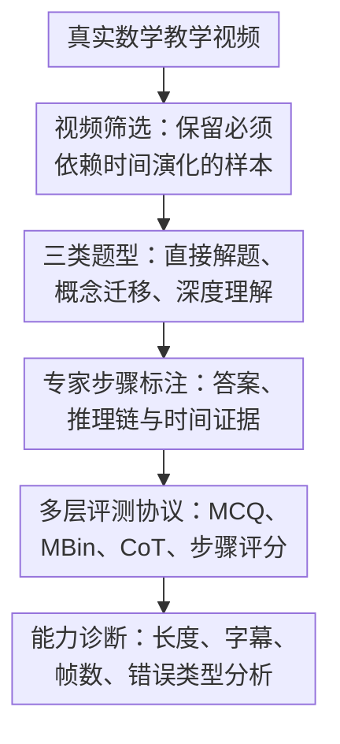

# VideoMathQA: Benchmarking Mathematical Reasoning via Multimodal Understanding in Video

**会议**: ICLR2026  
**OpenReview**: [https://openreview.net/forum?id=VI4kGUfPio](https://openreview.net/forum?id=VI4kGUfPio)  
**论文**: [Project Page](https://mbzuai-oryx.github.io/VideoMathQA)  
**代码**: 待确认  
**领域**: 多模态VLM / 视频推理 / 数学推理评测  
**关键词**: 视频数学推理, 多模态理解, 长视频问答, 逐步推理标注, benchmark  

## 一句话总结
VideoMathQA 构建了一个面向真实教学视频的数学推理 benchmark，用 420 个视频问答、2,945 条专家步骤标注和多层评测协议检验模型能否在视频、字幕、语音与数学知识之间做长程、多步、可诊断的推理。

## 研究背景与动机
**领域现状**：多模态数学推理评测已经有 MathVista、Math-V、MMMU 等静态图像或文本题集，视频理解领域也有 Video-MME、LongVideoBench、Video-MMMU 等长视频 benchmark。它们分别推动了视觉数学推理和视频问答的发展，但两条线通常是分开的：前者多看一张图或一页题，后者多考事件理解、叙事理解或通用知识问答。

**现有痛点**：真实教学视频里的数学问题不是把一张图截下来就能答。关键线索可能出现在黑板上逐步写出的公式、讲者口头补充的条件、几分钟前画过又被擦掉的示意图、动画图表中一闪而过的数值，甚至是“这个方法要迁移到下一个例子”这样的教学语境。只评 final answer 会把很多错误混在一起：模型到底是没看清数字、没找对时间段、公式选错、还是算术错，很难诊断。

**核心矛盾**：视频数学推理同时要求感知和推理。模型既要从长而嘈杂的视频流里找出关键视觉、字幕、语音证据，又要把这些证据转成可执行的数学步骤；而现有 benchmark 往往只覆盖其中一端，要么强调静态视觉题，要么强调泛视频理解，缺少“跨时间、多模态、可逐步验算”的数学任务。

**本文目标**：作者希望建立一个专门评测视频数学推理的基准，覆盖不同数学概念、视频长度和题型；同时给每道题提供专家级逐步推理标注，让评测不只停留在选项正确率，还能衡量模型的中间推理是否贴合视频证据。

**切入角度**：论文从真实教育视频入手，而不是合成短视频或静态教材图。这样的素材天然包含手写公式、动态图、口头讲解、图表切换和长程依赖，能逼模型处理“多模态草堆里找针”的问题。作者进一步把题型拆成直接解题、概念迁移和深度教学理解三类，使 benchmark 更接近人类看课、学方法、做题的实际过程。

**核心 idea**：用真实教学视频 + 专家逐步推理标注，把数学推理评测从“看图答题”推进到“在长视频中定位证据、理解讲解、迁移方法并完成多步解题”。

## 方法详解

### 整体框架
VideoMathQA 本质上是一个 benchmark 构建与评测框架。输入端是来自 YouTube 等来源的数学教学视频，作者先筛出必须依赖视频时间演化和多模态信息的问题片段，再由专家构造选择题、答案、逐步推理链和时间定位；评测端则用 MCQ、Multi-Binary、CoT 和步骤级评分共同衡量模型表现。

因为本文的贡献主要是数据集和评测协议，而不是一个新模型，方法部分可以理解为两条线并行：一条线保证样本确实需要视频数学理解，另一条线保证模型评测能把“答对”和“推理对”区分开。

### 关键设计

**1. 视频筛选：只保留静态帧或音频转写无法单独解决的数学问题**

VideoMathQA 的第一道门槛是样本选择。作者不是简单收集“数学视频 + 问题”，而是要求问题不能只靠少数静态截图或音频转写回答。入选视频需要包含有意义的时间演化，例如几何图形逐步构造、公式一步步推导、动态图表随时间展示多个数值，或者讲者先演示方法再让观众迁移到新例子。

这个筛选标准直接对应论文想测的能力：模型必须在视频流中定位和整合证据，而不是把视频退化成 OCR 文本题或单图题。作者还排除静态幻灯片和视觉变化很少的视频，并把片段裁剪到和问题相关的范围，降低无关噪声，但保留解题所需的长程上下文。最终 benchmark 包含 420 个视频-问题对，视频长度从 10 秒到超过 1 小时，覆盖短、中、长不同依赖范围。

**2. 三类题型：把“看懂视频数学”拆成直接解题、方法迁移和教学理解**

论文没有把所有问题都混成普通 VQA，而是定义了三种 reasoning type。Problem Focused 题要求模型直接从视频里的问题陈述、图形或数据中完成解题；Concept Transfer 题先让视频演示一个方法，再要求模型把方法应用到相似但新的问题；Deep Instructional Comprehension 题则要求模型跟随较长的讲解，理解上下文、部分完成的解法和后续需要补全的步骤。

这三类题的价值在于，它们把视频数学推理的难点分层了。直接解题偏向“找准证据 + 正确计算”，概念迁移偏向“从视频中抽象方法”，深度理解则偏向“长程记忆 + 教学语境建模”。因此，当模型在长视频或 hard 题上失败时，研究者可以更具体地判断失败来自感知、迁移、上下文保持还是数学执行。

**3. 专家步骤标注：把 final answer 评测扩展成可定位的推理诊断**

每道题不只给正确选项，还由独立专家写出 4 到 10 个推理步骤，并给关键步骤标注时间戳。整套数据共有 2,945 条专家标注步骤；质量控制也不是一次性完成，约 30% 的问题在步骤标注阶段被进一步修订，最后还有 788 条步骤在复审中被修改。

这种标注让 benchmark 能回答一个更细的问题：模型是否真的沿着合理的数学路径走到答案。若令一题的专家步骤数为 $N$，步骤级评分大致衡量模型生成推理中有多少步骤在数学目的上与参考步骤对齐，并将比例映射到 $0$ 到 $10$ 的分数；同时评测 rubric 允许不同但逻辑有效的替代解法获得满分。这样做避免了两个极端：既不只看选项是否蒙对，也不机械要求模型逐字复现参考解法。

**4. 多层评测协议：用 MCQ、MBin、CoT 和错误类型共同压低偶然性**

作者设计了四种互补评测。MCQ 是五选一，最直观且可复现；Multi-Binary（MBin）把正确答案分别与每个干扰项组成二选一，模型必须在所有二元比较中都选对才算正确，这能显著降低小模型随机猜中的空间。直接回答模式要求模型只输出选项，CoT 模式则要求模型先写推理，再用 Qwen3-4B 抽取最终选项。

更关键的是，CoT 输出还会进入步骤级评分与错误分析。Qwen3-4B 作为 judge 根据专家步骤、正确答案和模型推理给出 $0$ 到 $10$ 的分数，并进一步把错误归到七类：问题误解、信息检索失败、视觉解释错误、概念应用错误、策略或公式选择错误、回忆/记忆错误、计算错误。作者还用人工评分和不同大小的 Qwen3 judge 做稳健性检查，说明这个自动评分主要用于比较趋势，而不是把某个绝对分数当成不可争议的真值。

### 一个完整示例
以论文中的 Concept Transfer 题为例，视频先演示如何数由方格和对角线组成的三角形：每个独立方格可以按小三角形编号并得到 8 个三角形，相邻方格连接处还会形成额外三角形。题目随后给出一个新的三格竖向连接图，要求模型数出最终三角形总数。

一个真正看懂视频的模型需要先定位演示规则所在片段，再把“每个方格 8 个”迁移到新图形，得到 $3 \times 8 = 24$；然后识别两个连接处各贡献 2 个额外三角形，得到 $24 + 4 = 28$；最后还要发现三个方格整体形成的一个大三角形，因此答案是 $29$。如果模型只读字幕，可能漏掉图形连接方式；如果只看单帧，可能不知道前面演示过的计数规则；如果数学推理不稳，则容易停在 $28$。

这个例子说明 VideoMathQA 想测的不是单一能力，而是“定位视频证据 → 抽象方法 → 迁移到新图 → 完成计算”的连贯链条。

### 损失函数 / 训练策略
本文没有提出新模型或训练损失，而是提出评测数据与评测协议。模型推理评测的核心可以概括为两类分数：最终答案正确率和步骤级推理分数。

MCQ 准确率直接统计五选一是否命中；MBin 则把一题转成多个二选一比较，只有模型在正确答案与每个干扰项的比较中都选对，才记为该题正确。对于 CoT 输出，作者用 Qwen3-4B 非思考模式抽取最终选项；步骤级评测则用 Qwen3-4B thinking mode，根据专家步骤和模型推理输出 $0$ 到 $10$ 分，并附带 critique。所有 MLLM 评测采用贪心解码，温度为 $0$；不同模型按官方推荐帧数输入，例如 LLaVA-OneVision 为 32 帧，Qwen2.5-VL 可到 768 帧，Gemini 可访问 full video。

## 实验关键数据

### 主实验
论文评测了 5 个闭源多模态模型和 25 个开源模型，覆盖约 5B、9B、40B、80B 不同规模，并加入人类、随机、纯文本和单图基线。下表只摘取最能说明结论的代表性结果，指标来自带字幕的设置。

| 模型 / 参考 | 设置 | MCQ +Sub | MBin +Sub | CoT Eval | 说明 |
|--------|------|----------|-----------|----------|------|
| Human | 人类看视频答题 | - | 80.7 | - | 8 名标注者，20 分钟上限 |
| Random | 随机猜测 | 17.4 | 7.9 | - | MBin 明显压低随机命中 |
| GPT-o4-mini | CoT | 61.4 | 44.8 | 6.9 | 全部模型中最强，仍远低于人类 |
| Qwen2.5-VL-72B | CoT | 36.9 | 28.6 | 5.0 | 开源模型中代表性强结果 |
| InternVL3-78B | CoT | 37.1 | 27.9 | 4.9 | 规模扩大有帮助但仍不足 |
| Gemini-2.0-Flash | CoT | 38.8 | 24.8 | 4.7 | 闭源强模型之一 |
| Qwen2.5-VL-72B | Direct | 37.6 | 27.9 | - | 直接回答与 CoT 差异依模型而变 |
| InternVL3-38B | Direct | 35.7 | 29.5 | - | 小于 72B 但可超过部分更大旧模型 |

这些数字有两个直观信号。第一，人类 80.7 的 MBin 准确率证明任务不是不可解，但最强模型 GPT-o4-mini 只有 44.8，差距很大。第二，MCQ 分数普遍高于 MBin，说明五选一会放大偶然命中；MBin 更能暴露模型是否真的排除了每个干扰项。

| 分析维度 | 代表结果 | 论文结论 |
|------|----------|----------|
| 模型规模 | InternVL3 在 CoT MBin +Sub 中从 8B 的 20.0 提升到 38B 的 25.0、78B 的 27.9 | 更大模型通常更会保留长程上下文，但架构和训练同样关键 |
| 字幕作用 | GPT-o4-mini 从 42.1 提升到 44.8；Qwen2.5-VL-72B 从 24.5 提升到 28.6 | 字幕能补充音频语义，强推理模型收益更明显 |
| 帧数作用 | Qwen2.5-VL 从 16/64/256/768 帧增加时性能持续提升，长视频最多约 8 点收益 | 更多帧帮助捕捉分散视觉线索和长程依赖 |
| 数学概念 | 算术/微积分平均约 32%，图表、拓扑、图论、统计概率约 16-21% | 视觉读数和抽象结构类题更难 |
| 人类差距 | 人类平均比最佳模型高约 36 点；拓扑、计数、图表阅读差距约 35-50 点 | 当前模型最缺的是细粒度视觉证据和长程推理结合 |

### 消融实验
本文没有传统意义上的“去掉模块”消融，因为它不是训练模型论文；更接近消融的是输入模态、推理形式、帧数和 judge 稳健性分析。

| 配置 | 关键指标 | 说明 |
|------|---------|------|
| MCQ vs MBin | Random 从 17.4 降到 7.9 | MBin 把一题拆成多个正确-干扰项比较，减少猜测收益 |
| Video-only vs Video+Sub | 多数大模型和闭源模型在 +Sub 后提升 | 语音/字幕信息对数学讲解很关键，但小模型未必能用好 |
| Direct vs CoT | 闭源模型 CoT 收益明显，开源模型收益不稳定 | 让模型写推理不等于推理变强，还依赖模型本身能力 |
| 16/64/256/768 frames | Qwen2.5-VL 随帧数增加持续变好，长视频收益更大 | 视频数学题的证据常分布在多个时间点 |
| Qwen3-4B judge vs 人工 | 排名保持 GPT-o4-mini > InternVL3 > Qwen2.5-VL | 自动步骤评分的相对趋势与人工评分一致 |
| Qwen3 不同 judge 尺寸 | 4B、8B、14B、30B-A3 评分趋势接近 | 4B judge 足够复现实验趋势，便于低资源复现 |

### 关键发现
- 当前强模型仍远未达到人类水平。最强 GPT-o4-mini 在 CoT MBin +Sub 下为 44.8，而人类为 80.7，说明视频数学推理不是简单扩大现有 VLM 就能解决的任务。
- 错误最多来自问题误解：模型常常没理解题目指向视频里的哪个片段、图形或数量，或者漏掉关键口头/视觉线索。后续才是信息检索、视觉解释、概念应用、策略选择、记忆和计算错误。
- 中等长度视频反而常比长视频更容易，因为它们多对应概念迁移题，信息量适中；长视频对应深度教学理解，线索更分散，模型容易遗忘或找错上下文。
- 字幕和更多帧通常有帮助，但不是万能药。小模型即使拿到字幕也可能无法把语音线索和视觉帧对齐；更多帧也要求模型有足够上下文建模能力。
- 图表阅读、拓扑、图论、统计概率等类别更难，提示当前模型在细粒度视觉读数和抽象结构推理上仍有明显短板。

## 亮点与洞察
- VideoMathQA 的亮点不只是“把数学题放进视频”，而是明确要求问题无法由静态帧或音频转写单独回答。这个筛选标准让 benchmark 更接近真实多模态推理，而不是静态 benchmark 的视频包装版。
- 三类题型设计很有辨识度。Problem Focused、Concept Transfer、Deep Instructional Comprehension 分别对应直接解题、学会方法后迁移、长讲解补全解法，这比单纯按视频长度或数学领域分组更能解释模型失败原因。
- 步骤级标注和错误分类让 benchmark 有诊断价值。模型答错时，研究者可以看到它是没找对信息、读错图、公式选错还是算错，这对改进模型训练和检索式视频推理系统都更有用。
- MBin 是一个简单但有效的评测设计。它没有引入复杂 judge，却能显著降低选择题的随机性，尤其适合同时比较小模型和大模型。
- 这篇论文对后续视频 RAG 或教育 Agent 也有启发：真正有用的系统需要把“定位讲解片段、抽取公式/图表、跟踪上下文、执行数学推理”串起来，而不是只把整段视频塞进 VLM。

## 局限与展望
- 数据规模仍然偏小。420 个样本已经消耗约 920 人小时或 115 person-days，质量很高但覆盖面有限；要支持训练或更细粒度领域分析，仍需要半自动标注或更大规模扩展。
- 数据主要来自可公开获取的教学/科普视频，题型和讲解风格可能偏向英语教育资源、YouTube 内容和特定表达方式。跨语言、课堂实录、低清板书、无字幕视频等场景仍需进一步验证。
- 步骤级评测依赖 LLM judge。作者做了人工对齐和不同 Qwen3 尺寸的稳健性检查，但 judge 仍可能偏好某些表达方式，且 $0$ 到 $10$ 的绝对分数不能完全等同于人类数学教师评分。
- 选择题格式便于复现，却不能完全覆盖开放式证明、符号推导和长答案题。未来可以加入可执行数学验证、公式解析和开放生成答案评测。
- Benchmark 揭示了模型短板，但没有提出新的建模方案。后续工作可以围绕视频证据检索、帧级 OCR、字幕-视觉对齐、长程记忆和符号计算工具使用来构建专门模型。

## 相关工作与启发
- **vs MathVista / Math-V / MMMU**: 这些 benchmark 主要评测静态图像或多学科图文题，优势是题量和领域覆盖，本文则把数学问题放到时间展开的视频中，要求模型处理动态图形、讲解语音和长程上下文。
- **vs Video-MME / LongVideoBench / LVBench**: 这些工作推动了长视频理解评测，但多关注通用感知、事件、叙事或知识问答。VideoMathQA 更窄但更深，专门考数学推理，并提供逐步推理链。
- **vs Video-MMMU / Video-MMLU**: 这些 benchmark 开始涉及学科知识视频，但数学题只是其中一部分，且不一定强调细粒度数学步骤。本文把任务集中到数学视频推理，并设计了 MCQ、MBin、CoT、步骤评分的组合协议。
- **vs DynaMath**: DynaMath 关注视觉数学题在扰动下的鲁棒性，主要仍是静态视觉推理；VideoMathQA 则关注时间维度中的证据选择和概念迁移，两者可以互补，用来评估模型在静态鲁棒性与动态理解上的差异。
- **对未来模型的启发**: 一个强视频数学模型可能需要显式的“视频证据索引器 + OCR/公式识别 + 语音字幕对齐 + 数学推理器”。单纯增加上下文帧数有帮助，但如果没有面向问题的证据定位和步骤校验，长视频里仍然容易错过关键线索。

## 评分
- 新颖性: ⭐⭐⭐⭐☆ 题目不是第一个视频 benchmark，但把真实教学视频、数学推理和步骤级诊断结合得很清楚。
- 实验充分度: ⭐⭐⭐⭐⭐ 覆盖 30 个模型、多种输入设置、CoT/Direct、MCQ/MBin、帧数、字幕、难度、错误分析和 judge 稳健性，评测相当完整。
- 写作质量: ⭐⭐⭐⭐☆ 论文结构清晰，数据构建和实验结论充分；少数表格很大，读者需要主动抓重点。
- 价值: ⭐⭐⭐⭐⭐ 对视频 VLM、教育 AI、数学推理和可诊断 benchmark 都很有参考价值，尤其适合推动“看懂长教学视频后解题”的模型研究。

<!-- RELATED:START -->

## 相关论文

- [\[ICLR 2026\] MathNet: A Global Multimodal Benchmark for Mathematical Reasoning and Retrieval](mathnet_a_global_multimodal_benchmark_for_mathematical_reasoning_and_retrieval.md)
- [\[ICLR 2026\] ExpVid: A Benchmark for Experiment Video Understanding & Reasoning](expvid_a_benchmark_for_experiment_video_understanding_reasoning.md)
- [\[CVPR 2026\] Agentic Video Summarization via Self-Reflecting Multimodal Understanding](../../CVPR2026/vlm_reasoning/agentic_video_summarization_via_self-reflecting_multimodal_understanding.md)
- [\[ICLR 2026\] FRIEDA: Benchmarking Multi-Step Cartographic Reasoning in Vision-Language Models](frieda_benchmarking_multi-step_cartographic_reasoning_in_vision-language_models.md)
- [\[CVPR 2026\] Towards Sparse Video Understanding and Reasoning](../../CVPR2026/vlm_reasoning/towards_sparse_video_understanding_and_reasoning.md)

<!-- RELATED:END -->
