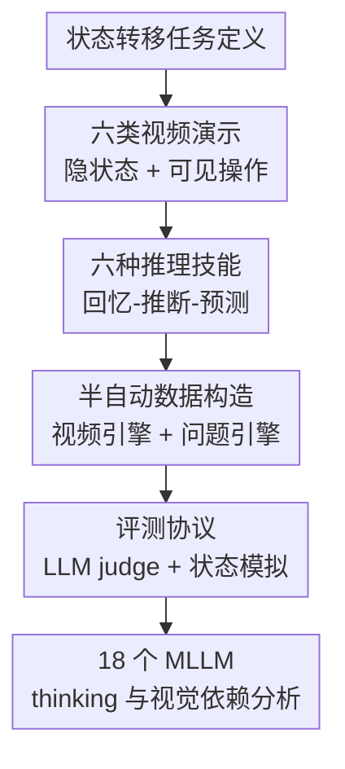

# VideoReasonBench: Can MLLMs Perform Vision-Centric Complex Video Reasoning?

**会议**: ICLR 2026  
**OpenReview**: [https://openreview.net/forum?id=1Mblo6U8kp](https://openreview.net/forum?id=1Mblo6U8kp)  
**代码**: https://llyx97.github.io/video_reason_bench/  
**领域**: 多模态VLM推理 / 视频理解评测  
**关键词**: 视频推理, MLLM评测, 长链式思考, 细粒度时序感知, 视觉中心基准  

## 一句话总结
VideoReasonBench 构造了一个以“可见操作 + 部分可见隐状态”为核心的视频复杂推理基准，证明当前多数 MLLM 在细粒度视频感知和多步状态推理上仍然很弱，而更长的 test-time thinking 对这类任务确实有明显帮助。

## 研究背景与动机
**领域现状**：多模态大语言模型已经在通用 VideoQA、长视频理解、知识密集型视频问答上取得了很强的表面成绩。与此同时，LLM 侧的长链式思考已经在数学、代码、科学推理等任务上展示出 test-time scaling 的收益：给模型更多推理 token，它往往能把复杂问题拆开、逐步检查并提高正确率。

**现有痛点**：视频理解领域还缺少能真正检验“长推理是否有用”的任务。许多流行视频基准的问题可以靠短时动作识别、常识判断、字幕线索或知识回忆回答；即便模型不开 thinking mode，也可能用十几个 token 给出正确选项。近期一些视频推理基准开始强调 CoT 或过程正确性，但不少任务仍偏知识驱动，或者只覆盖动作计数、时间顺序、短程定位这类较浅技能，无法迫使模型在视觉证据上做长链状态更新。

**核心矛盾**：视频复杂推理真正难的地方不是“知道某个概念”，而是要在连续视觉变化中精确记录一串操作，再把这些操作施加到一个并不总是完全可见的状态上。现有 benchmark 往往要么视觉信息不够密集，要么推理深度不够，因此无法区分模型是会看视频，还是会利用语言/知识捷径猜答案。

**本文目标**：作者希望建立一个视觉中心的复杂视频推理评测：视频中必须包含密集、顺序相关、不可随意跳过的视觉操作；问题要覆盖从回忆操作、推断隐藏状态到预测未来状态的递进能力；评测还要能分析 thinking budget、视觉输入缺失、视频复杂度等因素对模型表现的影响。

**切入角度**：论文把视频抽象成状态转移序列。某个隐状态 $S_t$ 在操作 $o_t$ 作用下变成 $S_{t+1}$，操作全过程可从视频中观察，但状态只在开头或结尾露出一部分。这样一来，模型不能只看单帧，也不能只答常识题；它必须先看清每一步操作，再在脑内维护和更新状态。

**核心 idea**：用“部分可见隐状态 + 全程可见操作序列”构造视频，让问题天然要求细粒度视觉感知和多步状态推理，从而检验 MLLM 是否真的能做 vision-centric complex video reasoning。

## 方法详解

### 整体框架
VideoReasonBench 不是提出一个新模型，而是提出一套可控的视频推理任务生成与评测框架。它先定义什么叫视觉中心复杂视频推理，再围绕这个定义生成 6 类视频演示和 6 种问题技能，最后用规则答案、LLM judge 与状态模拟器共同完成评测。

整体流程可以理解为：给定状态规模和操作次数，视频引擎生成一段状态转移脚本，并把脚本渲染成视频；问题引擎根据视频类别和技能模板生成问题与标准答案；评测时，模型只能看视频和问题，系统再判断回答是否和真实状态转移一致。

### 关键设计
**1. 状态转移式视频定义：把“看视频”变成必须维护隐状态的过程**

论文最关键的设计，是把每段视频形式化为一串状态转移：$\{S_t, o_t, S_{t+1}\}_{t=1}^{T-1}$。其中 $S_t$ 是棋盘、杯子、文件夹、牌堆或筹码杯中的当前状态，$o_t$ 是一次可见操作。视频会完整展示操作序列 $o_1, \ldots, o_{T-1}$，但状态只在开头或结尾显式展示：要么是 $\{S_1, o_1, \ldots, o_{T-1}\}$，要么是 $\{o_1, \ldots, o_{T-1}, S_T\}$。

这个设定很巧，因为它同时卡住了两个能力。只会“看见最后画面”的模型无法回答中间状态；只会语言推理但看不准操作顺序的模型也会在后续状态更新中一路错下去。比如滑块数字谜题里，数字初始可见，随后被遮住，只能看到哪个蓝色方块向哪个方向移动。模型若错过一次移动，最终棋盘就会全盘偏移。

**2. 三层六技能：用递进问题把感知错误和推理错误拆开**

VideoReasonBench 把视频推理分成三个层级，每层两个技能。Level 1 是 Recall Order 和 Recall Count，直接问操作顺序或某类操作发生次数；Level 2 是 Infer State 和 Compare State，要求根据已观察操作推断某一时刻的隐状态，或比较两个时刻的状态差异；Level 3 是 Predict State 和 Predict Operation，进一步要求在已推断状态上追加未来操作，或反推出达到目标状态所需的操作序列。

这个分层的好处是评测可诊断。模型如果 Level 1 都低，主要瓶颈是细粒度时序感知；如果 Level 1 还行但 Level 2/3 掉得很快，说明它能看见局部操作，却不能稳定维护状态。论文结果正好显示出这种递进难度：人类和模型的表现都从 Level 1 到 Level 3 逐步下降，说明 benchmark 的难度不是随机噪声，而是跟任务所需推理深度一致。

**3. 六类演示覆盖合成与真实场景：控制难度但避免单一玩具任务**

数据集包含 Number、Circle、Cup、File、Card、Chip 六类视频。Number 是滑块数字棋盘；Circle 是红圈在网格上移动并翻转当前位置及上下左右邻居的颜色；Cup 是杯子交换位置并隐藏硬币；File 是命令行里的创建、删除、复制、移动文件；Card 是牌堆顶部加牌、底部移牌；Chip 是杯中筹码的增加或移除。

这些任务共享“隐状态 + 操作序列”的骨架，但视觉形式不同：有 Matplotlib 合成动画，有命令行截图，也有手动录制的真实牌堆和筹码视频。状态大小和操作次数还可以调节，例如 $3 \times 3$ 到 $4 \times 4$ 棋盘、5 到 14 步操作。这样既能保证答案可由规则精确生成，又能避免模型只适应某一种画面模式。

**4. 评测协议区分唯一答案与多解操作：不把可行答案误判成错误**

大多数问题都有标准答案，论文用文本 LLM judge 接收问题、标准答案和模型答案，判断模型回答是否包含必要信息。这里使用 Qwen2.5-72B 作为默认 judge，并在附录中通过改写答案、替换 judge 模型检验鲁棒性，平均差异控制在 1% 以内。

Predict Operation 更特殊，因为达到同一目标状态可能有多条有效操作序列。论文没有强行规定唯一答案，而是先用文本 LLM 从模型回答中抽取操作，再把操作送回同一套状态转移函数中模拟，检查最终状态是否等于目标状态。这一点很重要：对多解任务，评测应验证“执行结果是否正确”，而不是只做字符串匹配。

### 一个完整示例
以 Number 类滑块谜题为例，视频开头给出一个 $3 \times 3$ 棋盘，比如空格记为 0。随后数字被蓝色遮罩盖住，视频只显示若干个相邻方块滑入空格的动作。模型面对 Recall Order 时，只需列出第 1 到第 10 次移动的方块坐标和方向；面对 Infer State 时，就要从初始棋盘开始，把每一次移动依次施加到当前棋盘上，得到最终排列。

Level 3 的 Predict State 会更进一步：题目先假设当前棋盘等于视频结束时的状态，再给出一串新操作，例如 leftward、upward、downward、leftward、rightward，要求输出执行后的完整棋盘。此时模型至少要完成三件事：看准初始状态，跟踪视频中的移动得到结尾状态，再把题目中的额外移动继续应用。任何一步的视觉错读或状态更新错误，都会导致最终答案不一致。

### 损失函数 / 训练策略
本文没有训练新模型，也没有提出新的损失函数。实验重点是离线评测现有 MLLM，并系统改变 thinking budget、视觉输入完整度、状态规模、操作次数和状态揭示时机，观察模型能力边界。

## 实验关键数据

### 主实验
论文评测了 18 个代表性 MLLM，包括 GPT-4o、o4-mini、Gemini 2.0/2.5、Seed1.5-VL、Qwen2.5-VL、InternVL3、LLaVA-OneVision、LLaVA-Video、MiniCPM、Kimi-VL 等。总体结论非常直接：除 Gemini-2.5-Pro 外，多数模型在 VideoReasonBench 上几乎不能可靠完成任务。

| 模型 | 是否 thinking | Level 1 代表表现 | Level 2 代表表现 | Level 3 代表表现 | Overall |
|------|---------------|------------------|------------------|------------------|---------|
| Human | 人工作答，平均 223.2s | Recall Order 87.5 / Recall Count 90.0 | Infer 80.0 / Compare 75.0 | Predict State 67.5 / Predict Operation 42.5 | 73.8 |
| GPT-4o | 否 | 14.2 / 15.8 | 4.2 / 6.2 | 0.8 / 0.0 | 6.9 |
| o4-mini | 是 | 14.2 / 20.4 | 7.1 / 11.7 | 6.2 / 4.6 | 10.7 |
| Seed1.5-VL | 是 | 24.2 / 27.1 | 3.8 / 7.9 | 3.8 / 2.1 | 11.5 |
| Gemini-2.5-Flash | 是 | 44.6 / 41.7 | 27.9 / 27.1 | 13.8 / 9.6 | 27.4 |
| Gemini-2.5-Pro-0506 | 是 | 69.2 / 70.4 | 63.3 / 56.7 | 42.1 / 34.6 | 56.0 |

另一个很有诊断价值的结果是 vid2txt：当作者把视频中的关键状态转移信息转成文本输入，Seed1.5-VL 从 11.5% 提升到 69.4%，Gemini-2.5-Flash 从 27.4% 提升到 72.2%。这说明很多模型不是完全不会做离散状态推理，而是卡在“从视频中稳定抽取操作序列”这一步。

### 消融实验
| 分析设置 | 关键数字 | 说明 |
|----------|----------|------|
| Gemini-2.5-Flash thinking budget 从 0 增加到 8192 | VideoReasonBench 准确率约提升 9% | 在现有 TempCompass、Video-MME、MMVU、Video-MMMU 上，同类增益均小于 2.5%，说明本文任务更能体现长思考收益 |
| Gemini-2.5-Flash 剪掉 50% 视频 | 27.4 降到 12.2，下降 55.5% | 相比其他视频基准小得多的下降，VideoReasonBench 对完整视觉操作序列高度依赖 |
| Gemini-2.5-Flash 单帧输入 | 27.4 降到 0.5，下降 98.2% | 单帧几乎无法恢复操作序列，证明任务不是静态图像问答 |
| Gemini-2.5-Flash text-only | 27.4 降到 1.0，下降 96.4% | 没有视觉内容时几乎随机，说明语言先验无法绕过视频证据 |
| 操作次数从 5-9 增到 10-14 | Gemini-2.5-Pro 58.2 降到 53.9 | 操作越多，状态跟踪越难；Seed1.5-VL 和 Gemini-2.0-Flash 下降也明显 |
| 状态在结尾而非开头揭示 | Gemini-2.5-Flash 35.3 降到 19.6 | 需要反向推断初始状态时，任务显著更难 |

### 关键发现
- 细粒度时序感知是首要瓶颈。大模型即使参数量很大，在 Recall Order / Recall Count 上也常常不到 30%，说明它们还不能稳定记录视频里的密集操作。
- 长链式思考确实有用，但前提是视觉证据被正确抽取。Gemini-2.5-Flash 开启 thinking 后从 18.8% 到 27.4%，但 vid2txt 后的提升更大，表明“会推理”和“看得准”缺一不可。
- VideoReasonBench 的难度设计有可控性。状态规模、操作次数、状态揭示时机都会系统影响准确率，未来可以用这些旋钮继续扩展难度。
- 人类也不是满分，尤其 Level 3 的 Predict Operation 只有 42.5%。这说明任务确实有认知负担，不是人为给模型设置无法验证的陷阱。

## 亮点与洞察
- 这篇论文最重要的洞察是：评测视频推理不能只看问题是否“听起来需要推理”，还要看答案是否真的依赖连续视觉证据。VideoReasonBench 用隐状态和可见操作把这种依赖写进任务定义里，因此比普通 VideoQA 更难被语言捷径绕过。
- 三层技能设计很有诊断性。Level 1 到 Level 3 的递进让研究者能判断模型到底是看不清、记不住，还是推不动，而不是只得到一个总体准确率。
- vid2txt 对照实验很漂亮。它把视觉感知瓶颈和符号推理瓶颈拆开：同一个模型看到文本状态转移后大幅变强，说明视频 token 到结构化操作的转换仍是 MLLM 的薄弱环节。
- thinking budget 的分析说明，长 CoT 在视频领域不是没有价值，而是之前很多基准没有足够的推理深度来“激活”它。VideoReasonBench 提供了一个更适合观察 test-time scaling 的场景。
- 评测 Predict Operation 时使用状态模拟而不是唯一标准字符串，这个设计很务实。多解规划问题如果只做文本匹配，会把合理答案误判为错；执行模拟更接近任务本质。

## 局限与展望
- 视频场景仍然相对干净。很多素材是合成动画或受控录制，尚未覆盖开放世界视频中的遮挡、运动模糊、镜头切换、多人交互、视角变化等复杂感知问题。
- 任务的状态转移规则比较离散和显式。它很适合诊断“操作序列 + 状态维护”，但和现实视频中的因果推理、意图理解、物理交互推断仍有距离。
- 当前工作主要是 benchmark，没有提出提升模型能力的新训练方法。后续可以基于同一生成引擎构造训练数据，研究如何把视频操作抽取、外部记忆、程序化状态更新或可验证推理结合起来。
- LLM judge 虽然做了鲁棒性检查，但仍可能在复杂格式答案上出现误判。更理想的方向是把更多问题都转成可执行状态验证，减少自然语言裁判的不确定性。
- 人类评测只抽样 240 个例子，虽然足够给出参考，但不同标注者的策略、复看次数、记笔记方式都会影响结果。未来若要作为长期 leaderboard，最好进一步规范人工上限评测。

## 相关工作与启发
- **vs Video-MME / TempCompass**: 这些基准覆盖通用视频理解和时间概念理解，但许多题目可以用短回答解决，thinking token 增加带来的收益很有限。VideoReasonBench 则把任务设计成连续状态追踪，强迫模型使用更长推理链。
- **vs MMVU / Video-MMMU**: 这两类 benchmark 更偏知识密集型视频理解，难点常常在专业知识或跨模态知识调用。VideoReasonBench 刻意降低外部知识依赖，把难点压到视觉操作感知和状态推理上。
- **vs VCR-Bench / MINERVA**: 它们也关注视频推理过程，但任务通常更接近一般视频理解中的动作计数、时序顺序、局部 grounding。本文的差异在于用隐状态转移制造更长跨度的因果链。
- **对模型训练的启发**: 未来 MLLM 可能需要显式的“视频事件抽取器 + 可更新状态记忆 + 推理控制器”。单纯把更多帧塞进上下文，未必能解决操作顺序错读和状态漂移问题。
- **对 benchmark 设计的启发**: 一个好的复杂推理基准应当能通过去掉视觉、缩短 thinking、增加状态规模等干预验证自己的属性。VideoReasonBench 的这些分析比单表主结果更有说服力。

## 评分
- 新颖性: ⭐⭐⭐⭐ 以隐状态转移定义视频复杂推理并系统构造 benchmark，概念并不花哨，但切中当前视频评测短板。
- 实验充分度: ⭐⭐⭐⭐⭐ 覆盖 18 个模型，并分析 thinking、视觉依赖、复杂度、状态揭示时机、judge 稳定性和案例错误，证据链很完整。
- 写作质量: ⭐⭐⭐⭐ 论文结构清楚，任务定义和实验结论都容易跟上；少数地方如数据构造细节需要读附录才能完全复现。
- 价值: ⭐⭐⭐⭐⭐ 对评估 MLLM 是否真的具备视频中心复杂推理能力很有价值，也为后续训练数据和可验证视频推理研究提供了清晰靶子。

<!-- RELATED:START -->

## 相关论文

- [\[ICLR 2026\] SpatiaLab: Can Vision-Language Models Perform Spatial Reasoning in the Wild?](spatialab_can_vision-language_models_perform_spatial_reasoning_in_the_wild.md)
- [\[ICLR 2026\] ReWatch-R1: Boosting Complex Video Reasoning in Large Vision-Language Models through Agentic Data Synthesis](rewatch-r1_boosting_complex_video_reasoning_in_large_vision-language_models_thro.md)
- [\[ACL 2026\] Can MLLMs Reason Beyond Language? VisReason: A Comprehensive Benchmark for Vision-Centric Reasoning](../../ACL2026/vlm_reasoning/can_mllms_reason_beyond_language_visreason_a_comprehensive_benchmark_for_vision-.md)
- [\[ICLR 2026\] OCR-Reasoning Benchmark: Unveiling the True Capabilities of MLLMs in Complex Text-Rich Image Reasoning](ocr-reasoning_benchmark_unveiling_the_true_capabilities_of_mllms_in_complex_text.md)
- [\[ICLR 2026\] Spatial Reasoning with Vision-Language Models in Ego-Centric Multi-View Scenes](spatial_reasoning_with_vision-language_models_in_ego-centric_multi-view_scenes.md)

<!-- RELATED:END -->
