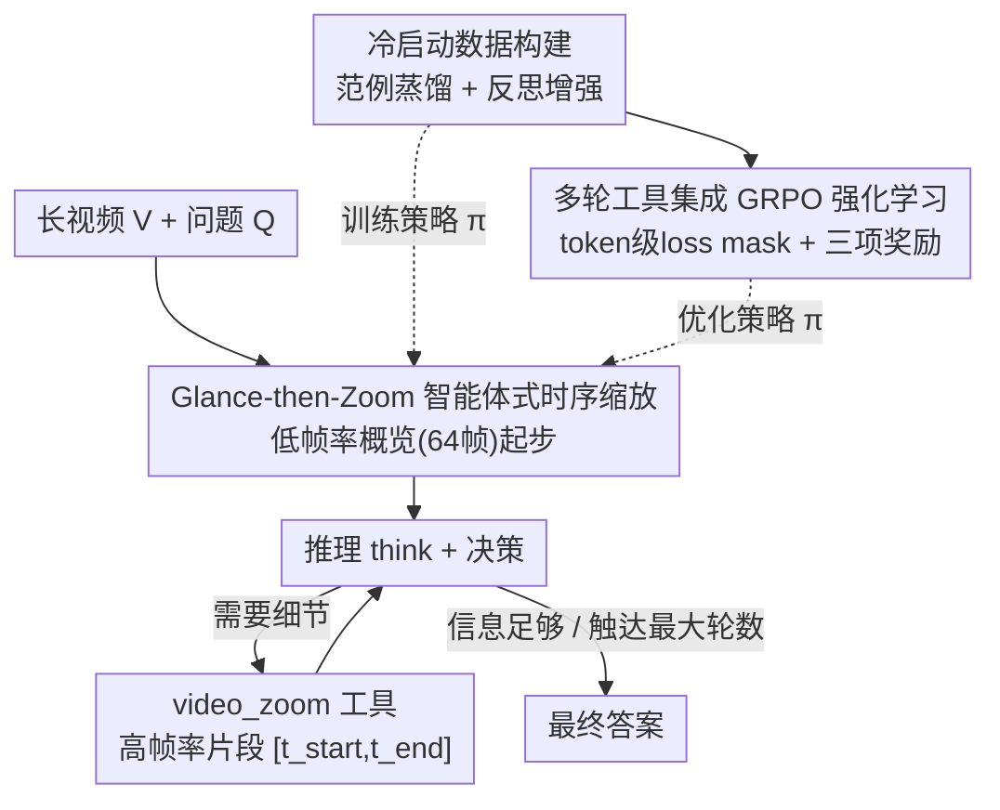

# VideoZoomer: Reinforcement-Learned Temporal Focusing for Long Video Reasoning

**会议**: ICLR 2026  
**OpenReview**: [https://openreview.net/forum?id=ARHCFvgx6G](https://openreview.net/forum?id=ARHCFvgx6G)  
**代码**: https://github.com/zsgvivo/VideoZoomer (有)  
**领域**: 多模态VLM / 长视频推理 / 强化学习  
**关键词**: 长视频理解, 智能体推理, 时序缩放, 多轮工具调用, GRPO

## 一句话总结
VideoZoomer 把长视频推理重构成一个"先扫一眼、再放大"的多轮工具调用任务，让 7B 的 MLLM 在推理过程中自主决定**何时、在哪个时间段**调用 `<video_zoom>` 工具抓取高帧率片段，再配合"冷启动 SFT + GRPO 强化学习"两阶段训练，用更小的帧预算在多个长视频理解/推理基准上超过开源模型、部分任务甚至追平闭源系统。

## 研究背景与动机

**领域现状**：多模态大模型（MLLM）在图像和短视频任务上已经很强，但受限于上下文窗口，处理长视频时只能塞进有限的帧。主流做法是**均匀采样**（uniform sampling，如每秒 2 帧）把视频压成一个能放进窗口的子集；进阶一点是**自适应帧选择**，用一个轻量选择器在推理前根据问题挑出"显著帧"。

**现有痛点**：均匀采样假设"每个时刻同等重要"，既可能漏掉短促但关键的事件（比如比赛里一记决定性动作），又把宝贵的上下文预算浪费在冗余片段上。帧选择器虽然比均匀采样好，但有两个硬伤：一是它被设计成**选固定数量的帧**，不管问题简单还是复杂都一刀切，效率低；二是选帧过程和推理过程是**解耦的、静态的、不可交互的**——一旦初始选帧选错或漏了关键细节，模型没有任何机制去纠错或回看视频。

**核心矛盾**：长视频推理本质上需要**迭代式地收集证据**，但现有方法把"看哪里"这个决策一次性冻结在推理之前，模型在推理中发现自己看错了也无法补救，这从根本上限制了它在复杂任务上的上限。

**本文目标**：让模型像人一样，带着明确任务在长视频流里**动态分配注意力**——先粗看全局，发现需要细节时再精准地"放大"特定时刻。

**切入角度**：作者把模型从"被动接收预选帧"改造成"主动探索的智能体"。这带来两个直接好处：(i) **高效**——智能体从低帧率概览起步，只有在它决定调用 `<video_zoom>` 工具时才消耗大量上下文预算，按需取用；(ii) **更强**——通过学习"何时何地请求高帧率片段"的策略，智能体能纠正初始疏漏、在真正需要的时刻收集细粒度证据，避免静态方法固有的关键信息丢失。

**核心 idea**：把长视频理解重构为**序列化的工具交互任务**，用"先扫一眼、再放大"（first glance, then zoom）的多轮范式，让 MLLM 在推理中自主控制视觉焦点；并用"冷启动 SFT + RL"两阶段训练把它从模仿者打磨成会泛化的自适应智能体。

## 方法详解

### 整体框架

VideoZoomer 要解决的是"在固定帧预算下高效理解长视频"。它的运行逻辑是"先扫一眼、再放大"：模型初始只拿到问题 $Q$ 和一段以低帧率 $f_{low}$ 均匀采样的视频 $V_{low}$（实现里是 64 帧），作为对整段视频廉价的粗略概览。要精确回答问题（尤其涉及细粒度时序事件或快速动作）时，模型会调用 `<video_zoom>` 工具，请求原视频里某个时间段 $[t_{start}, t_{end}]$ 的高帧率片段 $f_{high}$，环境返回高分辨率片段 $V_{clip}=T(V, t_{start}, t_{end}, f_{high})$。模型在 `<think>` 里推理、决定下一步缩放或给出答案，如此多轮交互直到信息足够、产出最终答案或触达最大轮数。每次工具调用受帧预算约束 $f_{high}\times(t_{end}-t_{start})\le B$，总共最多请求 $B\times N$ 帧（$N$ 为最大交互轮数）；非法请求或超预算时环境返回报错。

这个推理框架（设计 1）背后是一套两阶段训练在塑造策略 $\pi$：先用冷启动数据构建（设计 2）教会模型工具语法和多样推理模式，再用多轮工具集成的强化学习（设计 3）把策略调成高效且有效的智能体。

### 关键设计

**1. Glance-then-Zoom 智能体式时序缩放：把"看哪里"从一次性冻结改成多轮可纠错**

这一设计直击"静态帧选择无法纠错、且按固定帧数一刀切"的痛点。VideoZoomer 不再让模型被动接收预选帧，而是把它变成主动智能体：先以低帧率拿到全局概览，再通过 `<video_zoom>` 工具按需请求特定时间段的高帧率片段。关键在于它是**多轮交互**的——模型可以在第一轮缩放后发现"这段不是我要找的"，然后在下一轮换个时间段重新放大，或者在多个候选片段间逐个排查。论文展示了这种交互催生出的三种推理模式：**直接命中**（Direct-hit，一次缩放就锁定证据）、**渐进推理**（Progressive，逐步聚合多个片段的证据）、**自我修正**（Self-refine，发现缩放区间选错后自我纠正）。

效率上，由于上下文预算只在真正调用工具时才被消耗（$f_{high}\times(t_{end}-t_{start})\le B$，总量 $B\times N$ 封顶），模型能把帧预算花在刀刃上：实验里它在 MLVU 上平均只用 48 帧就超过基线用 128 帧的成绩。这与"先选固定帧再推理"的静态方法形成本质区别——证据收集和推理被拧成了一个动态闭环，而不是两个解耦的阶段。

**2. 冷启动数据构建：范例蒸馏 + 反思增强，治"浅策略"病**

从零开始在"生成结构化工具调用"这种高维动作空间上做 RL，样本效率低且不稳定。所以作者先用 SFT 冷启动，目标有二：教会基础模型 `<video_zoom>` 工具的正确格式，以及暴露给它多样的推理模式（这对后续 RL 探索至关重要）。数据分两部分构建：

其一是**范例轨迹蒸馏**——用 GPT-4o、Gemini-2.5-pro 等强闭源模型当专家示范者，给它们和智能体相同的系统提示与低帧率视频，让它们多轮调用工具直到答对，收集完整轨迹（初始提示 + 工具调用序列 + 高帧率片段观测 + 最终答案）作为"黄金"示例。但作者观察到：只在范例上 SFT 会让模型**过拟合专家的主导模式**，退化成"最多调用一次工具就立刻给答案"的浅层策略，不管那个片段是否真的有用。

为此引入**反思数据增强**：先用只在范例上训过的初始模型自己 rollout，挑出那些答错的轨迹，把这些错误轨迹反喂给专家模型，让它"反思"——指出错在哪、生成一条纠正后的、更鲁棒的推理路径（可能涉及额外的工具调用或不同的推理思路）。这种数据显式教会模型如何从错误中恢复、批判性评估工具返回的信息、以及何时该坚持继续探索。这种类 on-policy 的数据生成还缓解了分布漂移、稳定了从 SFT 到 RL 的过渡。最终冷启动数据集是范例轨迹 + 反思轨迹的混合，约 11,000 条，全部经过验证器把关质量。

**3. 多轮工具集成的 GRPO 强化学习：token 级 loss mask + 三项奖励**

冷启动之后用 GRPO 做 RL，把模型从模仿者优化成能泛化的自适应智能体。关键是把 GRPO 从单轮扩展到多轮工具调用场景：引入一个**token 级 loss mask**，只对模型自己生成的 token 计算损失，忽略工具返回的文本和图像 token（这些不是模型的动作，不该被算进策略梯度）。

奖励在每条轨迹末尾给出，由三项组成：

$$R(x, y) = R_{acc}(x, y) + R_{format}(y) + R_{tool}(y)$$

其中 $R_{acc}$ 是主任务奖励，答案正确给强正信号；$R_{format}$ 校验每轮输出格式（每个中间步骤必须把推理包进 `<think></think>`，后接合法的 `<video_zoom></video_zoom>` 或包在 `<answer></answer>` 里的最终答案），合规给正值否则为零。最巧的是 $R_{tool}$——训练早期模型不熟悉工具，倾向于直接猜答案而不调用，作者给"用工具"加一个 bonus 鼓励探索；但为防止模型学会刷无用的冗余调用，这个 bonus 是**有条件的：只有最终答案正确时才发放**。消融显示去掉 $R_{tool}$ 会导致"策略崩溃"，工具使用率在训练中趋向于零，因为模型没有明确激励就发现不了工具的价值。训练还借鉴了 DAPO 的 clip-higher 和动态采样来提升稳定性。

### 一个例子：Pac-Man 多选题

问题问"在哪个游戏里吃掉能量豆能让幽灵暂时变得脆弱？"，选项 A.Minecraft B.Pac-Man C.Counter Strike D.Call of Duty。模型先 Glance 拿到整段视频的低帧率概览，识别出这是个需要逐个核对游戏片段的问题。第 1 轮：`<video_zoom>` 放大 A 选项对应的 Minecraft 片段，推理"显示的是合成与探索，没有能量豆或幽灵"，排除 A。后续轮次继续逐个排查，当放大到 Pac-Man 片段时，模型看到"角色吃掉能量豆、追逐的幽灵变蓝逃跑"，与问题完美匹配，输出答案 B。这条轨迹正是"渐进推理"模式的体现——多轮缩放、逐步聚合证据、排除干扰项。

### 损失函数 / 训练策略

基座为 Qwen-2.5-VL-7B-Instruct。冷启动阶段用 LLaMA-Factory，学习率 $5\times10^{-6}$ 训 1 个 epoch；RL 阶段用 verl（作者扩展以支持多轮工具调用并针对长视频训练优化），学习率 $1\times10^{-6}$，rollout 数 16，batch size 128。推理配置：初始 64 帧均匀采样，最多 4 次后续工具调用、每次最多取 16 帧高分辨率片段（合计最多 128 帧）。训练数据用 LongVideoReason（52K 高质量问题-推理-答案对）。

## 实验关键数据

### 主实验

在长视频理解（MLVU/LongVideoBench/VideoMME/LVBench）和长视频推理（VideoMMLU/VideoMMMU/LongVideoReason）共 7 个基准上评测。模型以"首轮 64 帧 + 最多 4 轮每轮 16 帧"运行（总计最多 128 帧）。

| 基准 | 指标 | VideoZoomer-7B | 基座 Qwen2.5-VL-7B | 提升 |
|------|------|------|------|------|
| MLVU | dev | 68.8 | 58.3 | +10.5 |
| MLVU | test | 55.8 | 45.5 | +10.3 |
| LongVideoBench | val | 57.7 | 51.0 | +6.7 |
| LVBench | - | 41.5 | 36.9 | +4.6 |
| VideoMMLU | quiz | 67.9 | 61.0 | +6.9 |
| VideoMMMU | - | 52.2 | 48.1 | +4.1 |
| LongVideoReason | eval | 80.3 | 70.8 | +9.5 |

在 LongVideoReason-eval 上拿到 80.3，**超过闭源的 GPT-4o（60.7）和 Gemini-1.5-Pro（67.3）**；且优于在同一数据集上但用更大帧预算训练的 LongVILA-R1，凸显智能体策略的效率优势。MLVU 细分任务（表 2）显示提升集中在需要细粒度感知的任务上：dev 上 Ego Reasoning +19.1、Needle QA +15.2，尤其是 Action Count（计数快速动作）从 13.6 飙到 50.5——这直接得益于"能以更高帧率重采样关键时刻"的能力。

### 消融实验

| 配置 | MLVU-dev | LongVideoReason | 说明 |
|------|----------|------------------|------|
| VideoZoomer（完整） | 68.8 | 80.3 | 完整模型 |
| w/o RL（只 SFT） | 56.4 | 63.3 | 跨基准灾难性下降（LongVideoReason -17.0） |
| w/o cold-start（跳过 SFT） | 57.0 | 59.6 | 无法收敛到有意义策略 |
| w/o reflection（去反思数据） | 67.0 | 75.1 | 退化成浅策略，平均工具调用稳定在约 1.0 |
| w/o $R_{tool}$（去条件工具奖励） | 67.5 | 79.9 | "策略崩溃"，工具使用率趋向 0 |

### 关键发现
- **RL 和冷启动都不可或缺**：只做 SFT（w/o RL）跨基准崩盘，证明 RL 是学到有效工具使用策略的关键；跳过 SFT（w/o cold-start）则根本收敛不到有意义的策略，说明强初始化是必要前提。
- **反思数据决定推理深度**：去掉反思数据后，平均工具调用数稳定在约 1.0（浅层策略），而完整模型学会平均调用近 2 次工具，能做更深的迭代探索、验证集准确率更高。
- **条件工具奖励防崩溃**：$R_{tool}$ 的"仅答对才奖励"设计是防止刷无用调用、又避免模型不愿用工具的关键，去掉后工具使用率在训练中趋向零。
- **帧预算下的效率优势**：MLVU 上平均仅用 48 帧（准确率 0.64）就超过基线用 128 帧（0.581）；LVBench 上 77 帧超过基线 256 帧。LongVideoReason 上两者都在约 64 帧达到峰值，说明复杂推理任务未必受益于更多视觉信息（可能引入噪声），但在该最优帧窗内 VideoZoomer 峰值 0.803 显著高于基座 0.718。
- 与外部帧选择器（tspo）正交可叠加：Qwen2.5VL 在 MLVU 上 58.1 → +tspo 68.1，说明智能体策略可与帧选择器组合。

## 亮点与洞察
- **"何时何地放大"作为可学习策略**：把长视频里"看哪里"的决策从推理前的一次性冻结，变成推理中可多轮纠错的智能体动作，这是从"静态选帧"到"动态取证"的范式转变，可迁移到任何"信息源庞大、需按需取证"的任务（如长文档检索、网页探索）。
- **条件工具奖励的巧思**：用"仅当答案正确时才给工具调用 bonus"同时解决了两个相反的失败模式——既鼓励早期探索（别一上来就猜答案），又抑制后期刷无用调用，是奖励工程里很值得复用的一个 trick。
- **反思数据治"浅策略"**：发现纯模仿专家会让模型退化成"调一次就答"，于是用"错误轨迹反喂专家反思纠正"主动注入多轮、自纠错的推理模式——这种"用模型自己的失败 + 专家纠正"造数据的思路，本质是一种廉价的 on-policy 增强。
- **效率即性能**：48 帧打败 128 帧、77 帧打败 256 帧，证明"会挑地方看"比"多看"更重要，对部署时的算力/显存约束很友好。

## 局限与展望
- **依赖强闭源模型造冷启动数据**：范例蒸馏和反思纠正都靠 GPT-4o/Gemini-2.5-pro 当专家，数据质量受限于这些闭源模型的能力，且复现成本不低。
- **帧预算与轮数为固定超参**：初始 64 帧、最多 4 轮、每轮 16 帧是手工设定的，论文未充分探讨这些预算如何自适应不同长度/难度的视频。
- **复杂推理对更多帧无感甚至有害**：LongVideoReason 上两者都在 64 帧饱和，提示"更多视觉信息引入噪声"，但本文未深入分析如何在缩放时主动抑制噪声片段。
- **工具单一**：目前只有 `<video_zoom>` 一个时序缩放工具，是否能扩展到空间裁剪、音频检索等多工具协同仍待验证。

## 相关工作与启发
- **vs 均匀采样 / 自适应帧选择器（Tang et al., Hu et al.）**：它们在推理前一次性选定帧、选固定数量且与推理解耦；VideoZoomer 把选帧变成推理中可多轮纠错的智能体动作，按问题复杂度动态分配帧预算，本文优势是能纠错和省帧，代价是需要多轮交互的训练复杂度。
- **vs LongVILA-R1（Chen et al.）**：它靠继续在长视频上训练做直接上下文扩展、用更大帧预算；VideoZoomer 在同一 LongVideoReason 数据集上用更小帧预算反超它，凸显"会挑地方看"比"看更多"高效。
- **vs 训练无关的智能体框架（VideoDeepResearch、Deep Video Discovery）**：它们用 prompt 驱动 Deepseek-R1/GPT-4.1 等强闭源大模型迭代探索视频，验证了智能体方向的潜力但依赖重量级闭源模型、难优化难复现；本文则显式训练一个相对小的 7B 开源模型学到高效的智能体策略，更易部署。
- **vs 单轮图像工具方法（image cropping 等）**：多数已有"VLM + 外部工具"工作聚焦图像任务且只单轮交互；本文把 RL 驱动推理与多轮工具使用结合到长视频理解，填补了这块空白。

## 评分
- 新颖性: ⭐⭐⭐⭐⭐ 把长视频推理重构为多轮工具交互、让 MLLM 自主控制视觉焦点，是清晰且有说服力的范式转变。
- 实验充分度: ⭐⭐⭐⭐⭐ 7 个基准 + 细分任务 + 完整消融 + 帧预算扫描，每个组件的作用都有训练动态曲线佐证。
- 写作质量: ⭐⭐⭐⭐ 动机和方法讲得清楚，三种推理模式和奖励设计的直觉到位；部分实现细节（帧预算如何设定）略简。
- 价值: ⭐⭐⭐⭐⭐ 7B 开源模型在长视频推理上追平甚至超过闭源系统、且更省帧，部署友好，思路可迁移到其他按需取证任务。

<!-- RELATED:START -->

## 相关论文

- [\[ICLR 2026\] TimeSearch-R: Adaptive Temporal Search for Long-Form Video Understanding via Self-Verification Reinforcement Learning](timesearch-r_adaptive_temporal_search_for_long-form_video_understanding_via_self.md)
- [\[CVPR 2026\] Thinking with Drafts: Speculative Temporal Reasoning for Efficient Long Video Understanding](../../CVPR2026/vlm_reasoning/thinking_with_drafts_speculative_temporal_reasoning_for_efficient_long_video_und.md)
- [\[ACL 2026\] TemporalVLM: Video LLMs for Temporal Reasoning in Long Videos](../../ACL2026/vlm_reasoning/temporalvlm_video_llms_for_temporal_reasoning_in_long_videos.md)
- [\[CVPR 2026\] Thinking With Videos: Multimodal Tool-Augmented Reinforcement Learning for Long Video Reasoning](../../CVPR2026/vlm_reasoning/thinking_with_videos_multimodal_tool-augmented_reinforcement_learning_for_long_v.md)
- [\[ICLR 2026\] VisionReasoner: Unified Reasoning-Integrated Visual Perception via Reinforcement Learning](visionreasoner_unified_reasoning-integrated_visual_perception_via_reinforcement_.md)

<!-- RELATED:END -->
