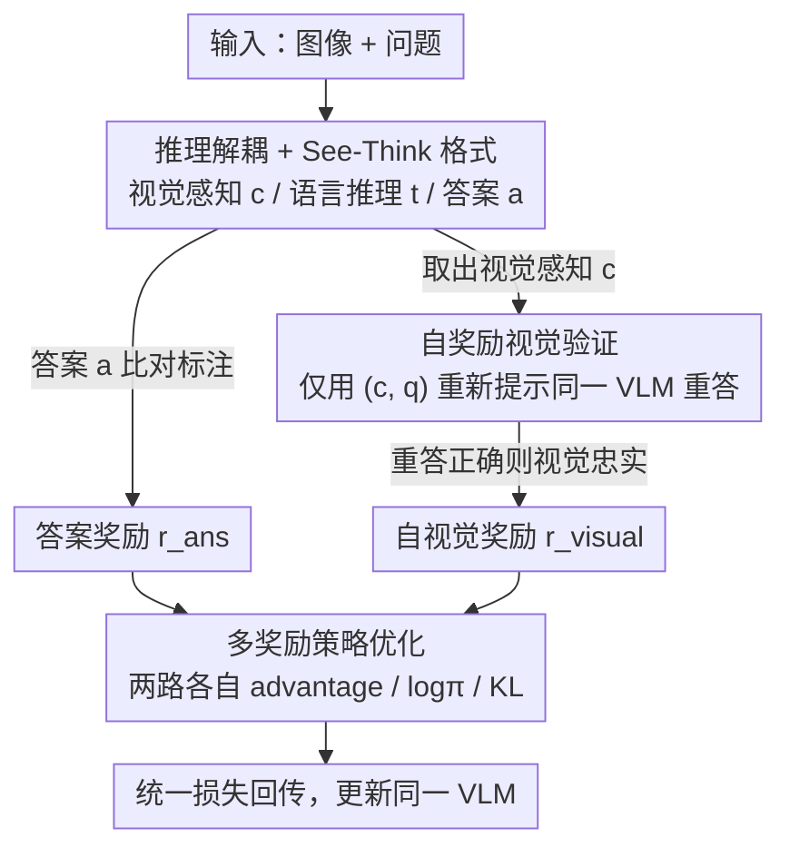

# Vision-SR1: Self-Rewarding Vision-Language Model via Reasoning Decomposition and Multi-Reward Policy Optimization

**会议**: ICLR 2026  
**OpenReview**: [https://openreview.net/forum?id=C1M4ETatgM](https://openreview.net/forum?id=C1M4ETatgM)  
**代码**: https://github.com/zli12321/Vision-SR1  
**领域**: 多模态VLM / LLM推理 / 强化学习  
**关键词**: 视觉幻觉, 语言捷径, 自奖励强化学习, 推理解耦, 多奖励策略优化

## 一句话总结
Vision-SR1 把 VLM 的推理拆成「视觉感知」和「语言推理」两段，让模型先写出一段**自洽到脱离原图也能答题**的视觉描述，再用同一个 VLM 仅凭这段描述重答来给视觉奖励，并用解耦的多奖励策略优化把两路信号分开回传——无需任何外部视觉监督或额外 GPU，就能缓解视觉幻觉、压住「不看图凭语言先验猜」的捷径行为。

## 研究背景与动机

**领域现状**：当下主流的 VLM 后训练（尤其是 R1 式强化学习）几乎都走「可验证答案匹配」这条路——只看最终答案对不对来给奖励，中间的视觉推理过程没有任何显式监督。

**现有痛点**：这种「只监督最终输出」的范式让视觉信号变得极其稀疏，模型于是学会了走捷径：要么产生**视觉幻觉**（描述图里根本不存在的内容），要么走**语言捷径**（直接绕过看图、靠文本先验猜答案）。更糟的是，RL 训练后指标看似「涨了」，很多时候只是把输出分布往训练/测试数据的风格上挪了一下，本质是 reward hacking，并没有真正学会看图。

**核心矛盾**：要给中间视觉推理加监督，现有做法要么靠**人工标注**（昂贵、难以在多模态任务上扩展），要么靠从外部大模型**蒸馏标签**（继承源模型的偏置和延迟，还会因为固定标签和持续更新的策略之间的分布漂移引发新的 reward hacking）。两条路都被「依赖外部监督」这个枷锁卡死了。

**本文目标**：在不引入任何外部视觉监督、不增加额外 GPU 的前提下，给 VLM 的中间视觉推理一个显式、可自我验证的奖励信号。

**切入角度**：作者的关键观察是——如果一段视觉描述真的「看懂了图」，那它应该是**自洽的**：把原图拿走，光凭这段文字描述加上问题，就足以推出正确答案。这就把「视觉推理质量」这个难评的东西，转化成了一个模型自己能验证的代理任务。

**核心 idea**：把 VLM 推理解耦成「自洽视觉感知 + 语言推理」两段，用同一个模型「仅凭描述重答」来自我打视觉奖励，再用解耦的多奖励策略优化把视觉奖励和答案奖励分开回传。

## 方法详解

### 整体框架
Vision-SR1 建立在 GRPO 之上，是一个三阶段的自奖励强化学习框架。一次训练对**同一个 VLM** 做两遍 rollout、一次目标优化：第一遍是标准 rollout，模型吃 (图像, 问题)，吐出一个结构化输出——`<visual reasoning>` 视觉感知、`<think>` 语言推理、`<answer>` 最终答案三段分明，答案和标注对比给出**答案奖励**；第二遍是自奖励 rollout，把原图拿掉，只用第一遍生成的视觉感知 `c` 加问题 `q` 重新提示同一个（冻结的）模型重答，如果还能答对，就说明这段视觉感知是「自洽 / 视觉忠实」的，给一个**自视觉奖励**。最后，两路奖励各自算 advantage、log 概率和 KL，组合成统一的多奖励损失再回传。整个过程不部署任何外部奖励模型，相比标准 GRPO 只多 10–20% 开销，且不占用额外 GPU。

### 关键设计

**1. 推理解耦 + See-Think 结构化生成格式：把「看」和「想」从源头分开**

问题的根子在于：标准范式里视觉推理和语言推理纠缠在一段 CoT 里，语言更强的 LLM 主干会主导生成、把看图这一步挤掉。Vision-SR1 要求模型对每个回答都遵循 See-Think 格式，吐出三段显式分隔的输出 $\langle\text{visual reasoning}\rangle\,c\,\|\,\langle\text{think}\rangle\,t\,\|\,\langle\text{answer}\rangle\,a$，其中 `c` 必须是一段**自洽的视觉感知**——捕获解题所需的全部视觉信息，以至于后续的语言推理 `t` 完全不需要再回头访问原图。这个「自洽」约束是整套方法的支点：它把抽象的「视觉推理好不好」变成了一个可操作、可验证的标准（脱离原图还能不能答题），也为下一步的自我打分提供了抓手。

**2. 自奖励视觉验证：让模型当自己的裁判，无需外部监督**

如何判断 `c` 是否真的自洽？作者的做法是把视觉感知当成图像的**纯文本代理**，用同一个 VLM 来验证：仅把 $(c, q)$ 喂回模型做语言推理，得到 $\hat{a}=f_\theta(c, q)$，再和标注答案 $a^*$ 比对——

$$r_{\text{visual}}(Q, c) = \mathbb{I}\left(\hat{a} = a^*\right)$$

如果光凭描述就能答对，就认定 `c` 视觉忠实，赋予视觉奖励 1。这一步完全用策略模型自身的推理能力做自评，不需要任何外部奖励模型，从而省掉了在独立 GPU 上托管裁判模型的开销，也避开了蒸馏标签那种「固定监督 vs 漂移策略」的 reward hacking。整体奖励由三部分对齐组合：格式奖励 $r_{\text{fmt}}$（同时作用于两路）、第一遍 rollout 的答案奖励 $r_{\text{ans}} = r_{\text{acc}} + \alpha\, r_{\text{fmt}}$（因为答案在 CoT 之后生成，它隐式也奖励了语言推理）、以及第二遍 rollout 的视觉奖励 $r_{\text{visual}} = r_{\text{vis\_acc}} + \alpha\, r_{\text{fmt}}$。

**3. 多奖励策略优化：解耦 advantage 与 KL，避免异质奖励纠缠**

如果只是把视觉奖励和答案奖励简单相加，得到的会是一个稀疏又纠缠的信号——策略根本分不清到底是哪一遍 rollout 立了功。Vision-SR1 的做法是让两遍 rollout（答案生成、视觉推理）在整个更新过程中**全程分开**：各自缓存 token 级 log 概率、各自按 GRPO 的组内 z-score 算 advantage $A_{\text{ans}}^{(i)} = (r_{\text{ans}}^{(i)} - \mu_{\text{ans}})/(\sigma_{\text{ans}}+\varepsilon)$ 和 $A_{\text{visual}}^{(i)}$，并把 $A_{\text{ans}}$ 广播到 caption token、$A_{\text{visual}}$ 广播到 answer token 形成两套 advantage mask。Actor 损失对两路加权求和（$\lambda_{\text{ans}}=\lambda_{\text{visual}}=0.5$）：

$$\mathcal{L}_{\text{actor}} = -\frac{1}{2B}\sum_{i,t}\left[A_{\text{ans},t}^{(i)}\log\pi_\theta(a_{\text{ans},t}^{(i)}) + A_{\text{visual},t}^{(i)}\log\pi_\theta(a_{\text{visual},t}^{(i)})\right]$$

KL 正则也对两路用独立系数 $\beta_{\text{ans}}$、$\beta_{\text{visual}}$ 分别约束，总损失 $\mathcal{L}_{\text{total}} = \mathcal{L}_{\text{actor}} + \mathcal{L}_{\text{KL}}$。这一解耦把「单个多奖励问题」拆成「两个共享参数的单奖励子问题」，给每个奖励到对应 token 之间建立了清晰的梯度路径，从而能独立优化视觉感知和语言推理两种能力——这正是作者理论分析里强调的：标准 RL 只看答案正确性，中间视觉推理 `t` 拿不到直接监督，强 LLM 主干就会主导生成、靠语言先验把答案蒙对。

### 损失函数 / 训练策略
基座用 Qwen2.5-VL-3B/7B 和 Mimo-VL-7B，用 GRPO 训练 200 步。数据是自建的 Vision-SR1-47K（约 47K 条，来自 24 个开源 VLM benchmark），覆盖数学推理（30.5%）、科学常识（30%）、通用视觉理解（39.5%）三大领域。两遍 rollout 期间策略模型都保持冻结，只在最后用组合损失更新参数。

## 实验关键数据

### 主实验
在三类任务（通用视觉理解、多模态数学、视觉幻觉）共 7 个 benchmark 上，Vision-SR1 在三种基座上都稳定超过用同样 47K 数据公平复现的 Vision-R1。

| 基座 | 方法 | MMMU-Pro | MMMU | MathVerse | HallusionBench | Avg. |
|------|------|----------|------|-----------|----------------|------|
| Qwen2.5-VL-3B | Zero-shot | 30.5 | 25.5 | 44.3 | 27.1 | 35.5 |
| Qwen2.5-VL-3B | Vision-R1 (47K) | 40.3 | 49.5 | 42.8 | 67.4 | 47.1 |
| Qwen2.5-VL-3B | **Vision-SR1** | 40.8 | 49.6 | 45.8 | 68.3 | **48.8** |
| Qwen2.5-VL-7B | Vision-R1 (47K) | 39.8 | 51.8 | 53.2 | 66.6 | 50.7 |
| Qwen2.5-VL-7B | **Vision-SR1** | 40.7 | 52.2 | 54.5 | 68.9 | **52.2** |
| Mimo-VL-7B | Vision-R1 (47K) | 38.7 | 47.3 | 35.3 | 74.3 | 46.0 |
| Mimo-VL-7B | **Vision-SR1** | 39.3 | 49.5 | 40.0 | 75.6 | **49.5** |

在 Mimo-VL-7B（非 Qwen 家族）上同样有效（44.4→49.5），说明方法能跨基座泛化。空间推理与语言捷径鲁棒性的额外评测里，Qwen2.5-VL-7B 上 OmniSpatial 从 27.3 提到 44.2、语言捷径数据集 ViLP(LS) 从 45.1 提到 52.6。

### 消融实验
去掉自视觉奖励（w/o self-reward）后，作者提出的语言捷径率（LSR，越低越好）整体上升，印证视觉奖励确实压住了捷径行为。

| 配置 | LSR 平均（7B） | 说明 |
|------|----------------|------|
| Vision-SR1 (7B) | 9.8 | 完整模型 |
| ⊢ w/o self-reward | 10.1 | 去掉视觉自奖励，捷径率上升 |
| Vision-SR1 (3B) | 9.4 | 完整模型 |
| ⊢ w/o self-reward | 10.4 | 去掉后捷径率上升约 1 个点 |

> LSR（Language Shortcut Rate）定义：用 Gemini-2.5-flash 当裁判，先抽出模型生成的视觉感知 $\hat{C}$，再仅凭 $\hat{C}$ 加问题让裁判重答；LSR = #{视觉感知不自洽 **但** 最终答案正确} / #{总样本}。LSR 越高说明模型越多在「不真看图、靠语言先验蒙对」。

### 关键发现
- **自视觉奖励是降捷径的关键**：去掉它 LSR 普遍上升，说明显式生成视觉描述确实逼模型依赖真实视觉内容而非文本先验。
- **视觉注意力被重新分配**：对比基座与 Vision-SR1 的逐层视觉注意力，后训练在早期层（0–7，Layer 6 +10.2%）和后期层（14–27，Layer 20 +9.2%）增强了对视觉 token 的关注，中间层（8–13）下降——是一种「早期多提特征、后期多再整合」的重分配，而非均匀增加。
- **效率几乎免费**：两遍 rollout 仅比标准 GRPO 多约 10–20%（7B 模型 20 步从 10.5h 到约 13h），且不需额外 GPU；相比之下用专有模型当外部裁判会触发 API 限流让训练时间翻倍，用本地开源裁判则要专占至少 1 张 GPU。

## 亮点与洞察
- **「自洽视觉描述」这个代理任务设计得巧**：把无法直接验证的「视觉推理质量」转化成「脱离原图还能否答对」这个可由模型自验的二值信号，一举绕开外部监督——是整篇论文最让人「啊哈」的地方。
- **解耦 advantage/KL 而非简单加和奖励**：把多奖励问题拆成两个共享参数的单奖励子问题，给每个奖励到对应 token 建立清晰梯度路径，这个思路可迁移到任何「多段输出、各段需独立奖励」的 RL 场景（如工具调用 + 推理、检索 + 生成）。
- **LSR 是个可复用的诊断指标**：它把「RL 到底是真学会看图还是只是唤醒了语言推理去猜」这个长期模糊的问题量化了，可作为后续 VLM RL 工作的标准探针。

## 局限与展望
- **视觉感知以离散 token 显式解码，开销不小**：作者也指出未来可把视觉推理当成「潜在思考」latent thinking，减少解码 token 数同时保留奖励归因。
- **自奖励的天花板受策略模型本身能力限制**：当基座模型自己就看不懂图时，「仅凭描述重答」这个验证信号也会失真，方法对很弱的基座可能收益有限（论文未深入探讨）。
- **数学增益可能仍含「伪相关」**：作者诚实承认，RL 在 VLM 上的部分数学提升可能来自重新校准 LLM 主干输出分布这类 spurious effect，而非真正的视觉 grounding，未来需要更多分析把视觉 grounding 和捷径学习真正解耦。

## 相关工作与启发
- **vs Vision-R1**: Vision-R1 是首个 R1 式 VLM RL，但只用答案奖励、只监督最终输出；Vision-SR1 在同样数据上加入自视觉奖励 + 解耦多奖励优化，区别在于给中间视觉推理建立了显式、可自验的监督，主实验各基座平均分都更高。
- **vs Perception-R1 / Visionary-R1**: 两者都靠**外部**信号——Perception-R1 用专有多模态 LLM 预抽的视觉标注当额外奖励，Visionary-R1 用外部纯文本 LLM 当监督；Vision-SR1 优势在于完全自奖励、零外部依赖、零额外 GPU，劣势是验证信号受策略模型自身能力上限约束。
- **vs Calibrated Self-Rewarding / ARES 等 VLM 自奖励工作**: 既有 VLM 自奖励多用 step-wise 视觉约束奖励 + DPO，或从注意力权重导出 shaped reward，但奖励大多不是端到端整合的；Vision-SR1 让策略在训练中**同时**接收视觉感知奖励和答案奖励，并通过解耦损失端到端回传，是更紧的一体化设计。

## 评分
- 新颖性: ⭐⭐⭐⭐⭐ 「自洽视觉描述当可自验代理任务」+ 解耦多奖励优化，思路清晰且自成一体
- 实验充分度: ⭐⭐⭐⭐ 三基座 × 7+ benchmark + 空间/捷径泛化 + 注意力分析齐全，但消融主要围绕自奖励一项
- 写作质量: ⭐⭐⭐⭐ 动机—方法—理论分析链条完整，个别公式排版有小瑕疵
- 价值: ⭐⭐⭐⭐⭐ 零外部监督、零额外 GPU 就能压视觉幻觉/语言捷径，工程落地性强，LSR 指标也有复用价值

<!-- RELATED:START -->

## 相关论文

- [\[ICLR 2026\] Perception-Aware Policy Optimization for Multimodal Reasoning](perception-aware_policy_optimization_for_multimodal_reasoning.md)
- [\[ICLR 2026\] Unlocking the Essence of Beauty: Advanced Aesthetic Reasoning with Relative-Absolute Policy Optimization](unlocking_the_essence_of_beauty_advanced_aesthetic_reasoning_with_relative-absol.md)
- [\[CVPR 2026\] Unified Generation and Self-Verification for Vision-Language Models via Advantage Decoupled Preference Optimization](../../CVPR2026/vlm_reasoning/unified_generation_and_self-verification_for_vision-language_models_via_advantag.md)
- [\[ICLR 2026\] Spatial Reasoning with Vision-Language Models in Ego-Centric Multi-View Scenes](spatial_reasoning_with_vision-language_models_in_ego-centric_multi-view_scenes.md)
- [\[ICML 2026\] Vision-aligned Latent Reasoning for Multi-modal Large Language Model](../../ICML2026/vlm_reasoning/vision-aligned_latent_reasoning_for_multi-modal_large_language_model.md)

<!-- RELATED:END -->
