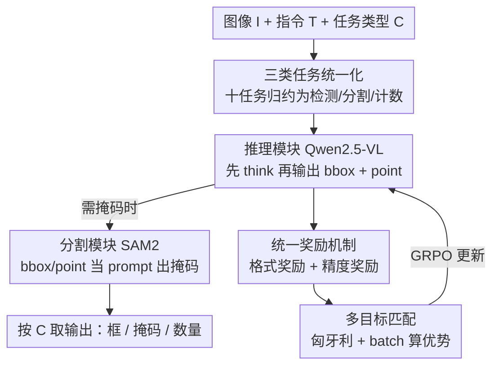

# VisionReasoner: Unified Reasoning-Integrated Visual Perception via Reinforcement Learning

**会议**: ICLR 2026  
**OpenReview**: [https://openreview.net/forum?id=QoDOwjsbAq](https://openreview.net/forum?id=QoDOwjsbAq)  
**代码**: 有（论文标注 Code，链接见 OpenReview）  
**领域**: 多模态VLM / LLM推理  
**关键词**: 视觉感知, 强化学习, GRPO, 多目标认知, 统一框架

## 一句话总结
VisionReasoner 把检测、分割、计数这十类视觉感知任务统一抽象成"多目标认知"问题，用一套统一奖励机制 + GRPO 强化学习训练单一 Qwen2.5-VL 模型，让它在输出结果前先生成结构化推理过程，在 COCO 检测、ReasonSeg 分割、CountBench 计数上相对基线分别提升 29.1% / 22.1% / 13.2%。

## 研究背景与动机

**领域现状**：大型视觉-语言模型（LVLM）展现出处理多样视觉任务的能力，研究者纷纷把它们用到视觉定位、推理分割等感知任务上。但主流做法是给每个任务单独配模块或单独训一套数据——检测一套、分割一套、计数一套，互不相通。

**现有痛点**：一方面，传统视觉模型（YOLO-World、Grounding-DINO、DINO-X 等）只能处理简单类别查询，遇到"如果我对海鲜过敏该避开什么"这种需要推理的复合指令就失败；另一方面，近期把强化学习引入 LVLM 的工作（VisualRFT、Seg-Zero）虽然能增强推理，却仍然是 task-specific 的——不同任务用不同数据分别训练，可扩展性和泛化性受限。

**核心矛盾**：感知任务表面上各不相同（框、掩码、数字），但作者观察到它们底层共享同一个结构——都是"在图像里认出多个目标物体"的多目标认知问题。既然底层相通，就不该用割裂的专用模型去硬拼。

**本文目标**：用**单一共享模型**同时解决检测、分割、计数等十类任务，且让模型在给答案前先做可解释的推理，而不依赖人工标注的推理数据。

**切入角度**：把任务归约（task reformulation）——先把十类任务统一重写成检测/分割/计数三种基本类型，再发现这三类都能转化为"预测一组 bbox + 中心点"的多目标认知，从而用一套奖励、一套 RL 流程通吃。

**核心 idea**：用 GRPO + 统一奖励机制训练一个会"先推理后定位"的 LVLM，把多任务视觉感知收敛成多目标 bbox/point 预测，并用匈牙利匹配解决 RL 里预测与真值的对齐难题。

## 方法详解

### 整体框架

VisionReasoner 接收一张图像 $I$、一段文本指令 $T$ 和一个任务类型 $C \in \{\text{detection}, \text{segmentation}, \text{counting}\}$，输出该任务期望的结果。模型由两个模块串联：**推理模块**（以 Qwen2.5-VL 初始化）负责理解图文、生成 `<think>...</think>` 推理过程，并在 `<answer>` 里吐出目标物体的边界框 $\{B_i\}_{i=1}^N$ 和中心点 $\{P_i\}_{i=1}^N$；**分割模块**（以 SAM2 初始化）在需要掩码时，把 bbox/point 当作 prompt 生成二值掩码 $\{M_i\}_{i=1}^N$。整体可写成 $(\{B_i, M_i\})_{i=1}^N = F(I, T)$，再按任务类型选输出：检测取框、分割取掩码、计数取数量 $N$。

训练侧才是真正的创新所在。模型用 GRPO 训练：对每个输入采样一组 rollout，用一套**统一奖励机制**（格式奖励 + 精度奖励）打分，再用组内相对优势 $A_i = \frac{r_i - \text{mean}(\{r\})}{\text{std}(\{r\})}$ 更新策略。由于 RL 用框和点（而非掩码）算奖励，而模型一次预测多个目标、真值也是多个，必须先把"预测的 $K$ 个目标"和"真值的 $N$ 个目标"做**最优一一匹配**才能算分——这一步用匈牙利算法 + batch 计算解决。

### 关键设计

**1. 三类任务统一化：把十类感知任务归约成同一个多目标认知问题**

这一步针对的是"每个感知任务都要单独建模、单独训练"的割裂痛点。作者分析了视觉定位、指代分割、推理分割、目标计数等十类任务后发现它们可以收进三种基本类型：检测（给图和文，输出一组定位框）、分割（用 detect-then-segment 范式，先出框再出掩码）、计数（用 detect-then-count 范式，先检测再数数）。三者的共性是都要"在图像里认出 $N$ 个符合指令的目标物体"，即多目标认知。归约之后，整个系统只需学会一件事——预测一组 bbox + 中心点，下游再按任务类型把这组结果转成框、掩码或数字。正是这个统一表征，让单一模型 + 单一奖励能同时通吃十类任务，也让框架可以零样本扩展到新感知任务。

**2. 统一奖励机制：用格式奖励 + 精度奖励同时约束"会推理"和"认得准"**

RL 的核心在奖励设计，而多任务感知既要模型输出结构规整、又要定位精确。作者把奖励拆成两组，全部基于 bbox 和中心点（而非掩码，因为框/点训练效率更高），总奖励为各项之和。**格式奖励**包含三项：思考格式奖励（输出含 `<think>` 和 `<answer>` 标签则 +1.0）、答案格式奖励（答案严格为 `[{'bbox_2d':[...], 'point_2d':[...]},...]` 列表则 +1.0）、非重复奖励（把推理切成句子检测重复模式，无重复则 +1.0，抑制冗余啰嗦的推理）。**精度奖励**包含三项：Bbox IoU 奖励（最优一一匹配后，每个 IoU>0.5 的框贡献 $\frac{1}{\max\{N,K\}}$）、Bbox L1 奖励（匹配后 L1 距离 <10 像素的框各贡献 $\frac{1}{\max\{N,K\}}$）、Points L1 奖励（点 L1 距离 <30 像素各贡献 $\frac{1}{\max\{N,K\}}$）。用 $\frac{1}{\max\{N,K\}}$ 做归一化既奖励召回、又惩罚多预测，从而强化精确的多目标定位。值得注意的是，模型在**没有任何标注推理数据**的情况下，仅靠这套奖励就自发学出了忠实可靠的推理过程（人类评估验证）。

**3. 多目标认知与最优匹配：用匈牙利算法 + batch 计算解决 RL 里的预测-真值对齐**

监督微调（如 Kosmos）用自回归交叉熵，天然按序列对齐；但 RL 算奖励时，模型预测的 $K$ 个目标和真值的 $N$ 个目标是无序的多对多关系，必须先求最优一一匹配才能算精度奖励——这是把 RL 用于多目标感知的关键障碍。作者的解法分两步。数据侧：从已有分割数据集（RefCOCOg、LISA++ 等）的掩码标注直接派生框和点（取掩码的最左/上/右/下像素得框、取质心得点），并把一图多物体的描述用"and"拼接、框点拼成列表，构造出多目标训练样本。匹配侧：构造代价矩阵 $C = (3 - (R_{\text{IoU}} + R_{\text{BL1}} + R_{\text{PL1}})) \in \mathbb{R}^{K \times N}$（三项命中指示之和越大代价越小），用匈牙利算法求最优指派，再算总奖励 $r = (3|r| - \sum_t C_{r_t,c_t})/L_{\max}$。所有成对距离用 batch 计算一次性算完，相比逐对匹配在 30 目标场景下从 $2\times10^{-3}$ 秒降到 $5\times10^{-4}$ 秒，**4 倍加速**，保证了 RL 训练的可行性。

### 损失函数 / 训练策略
训练目标为 GRPO 的裁剪式目标函数（含 KL 正则项 $\beta D_{\text{KL}}(\pi_\theta \| \pi_{\text{ref}})$）。模型用 Qwen2.5-VL + SAM2 初始化，batch size 16，学习率 1e-6，仅用约 7k 训练样本（LVIS / RefCOCOg / gRefCOCO / LISA++ 各约 1,800 条）。

## 实验关键数据

### 主实验

检测任务（AP / Acc，节选）：

| 数据集 | 指标 | Qwen2.5-VL-7B | VisionReasoner-7B |
|--------|------|---------------|-------------------|
| COCO | val AP | 29.2 | **37.7** |
| RefCOCO+ | val | 82.3 | **83.6** |
| RefCOCOg | test | 85.7 | **87.5** |
| 检测均值 | Avg. | 78.6 | **80.3** |

分割与计数任务（节选）：

| 任务 | 数据集 | Qwen2.5-VL-7B | VisionReasoner-7B |
|------|--------|---------------|-------------------|
| 分割 | ReasonSeg val | 56.9 | **66.3** |
| 分割 | ReasonSeg test | 52.1 | **63.6** |
| 分割 | 均值 | 67.7 | **71.0** |
| 计数 | CountBench test | 78.8 | **89.2** |
| 计数 | 均值 | 63.6 | **76.7** |

单一统一模型零样本评测下，全面超越同规模 Qwen2.5-VL 基线，分割上甚至超过专门的 Seg-Zero-7B（test 57.5 → 63.6）。

### 消融实验

| 配置 | ReasonSeg-val | RefCOCOg-val / Det | 说明 |
|------|---------------|---------------------|------|
| Full（4 数据集） | 66.3 | 86.1 | 完整模型 |
| 仅 RefCOCOg | 61.9 | 84.1 | 单数据集 |
| w/o reasoning | 60.1（test）| - | 去推理仍超基线，但推理段任务掉点明显 |
| w/o non-repeat reward | 61.4（RefCOCOg）| - | 去非重复奖励掉点且推理变冗长 |
| baseline（无 RL） | 52.1（test）| - | 起点 |

| 匹配方式 | 30 目标耗时 |
|----------|-------------|
| 仅匈牙利 | $2\times10^{-3}$ s |
| 匈牙利 + batch | $5\times10^{-4}$ s（4× 加速） |

### 关键发现
- **推理有用且自适应**：带推理的模型在复杂的 ReasonSeg 上增益最大；推理长度随查询复杂度动态变化（COCO 简单类名 62 词、ReasonSeg 推理密集 71 词），说明模型学会了"按需思考"。
- **非重复奖励一举两得**：既提升精度（ReasonSeg 61.9 vs 61.4），又让响应更短、消除推理中的重复啰嗦模式。
- **采样数过大反而过拟合**：sampling number 从小增大时先升后降，过度采样会过拟合训练分布、损害泛化。
- **VQA 能力不退反进**：虽未在 VQA 数据上训练，VisionReasoner 在 ChartQA / DocVQA / MMMU 等上仍略优于基线，说明统一感知训练没有损伤通用对话能力。
- **RL 算法鲁棒**：GRPO（61.9）与 DAPO（61.7）都能稳定带来增益，框架不挑算法。

## 亮点与洞察
- **任务归约思想优雅**：把看似异质的十类任务统一成"多目标 bbox+point 预测"，是整个方法能用单模型单奖励的根基——这种"找共性再统一"的思路可迁移到其他多任务场景。
- **无标注推理数据却自发学会推理**：仅靠思考格式奖励 + 非重复奖励，模型就生成了人类评估认为忠实可靠的推理过程，印证了 RL "结果监督诱导推理"的范式同样适用于视觉感知。
- **把匈牙利匹配搬进 RL 奖励计算**：用代价矩阵 + 匈牙利求最优指派解决多目标 RL 的对齐难题，并用 batch 计算拿到 4× 加速，是工程与算法结合的实用 trick。
- **7k 样本即可**：极小数据量就训出强多任务泛化，凸显 RL 在感知任务上的样本效率。

## 局限与展望
- **检测精度受评测协议拖累**：LVLM 不输出置信度，作者用 bbox 面积/图像面积近似，导致 COCO 的 AP 被低估，与专用检测模型（如 DQ-DETR 的 50.2）仍有差距。
- **分割依赖外部 SAM2**：分割质量受 detect-then-segment 范式与 SAM2 上限约束，框预测错了掩码也救不回来。
- **任务类型需人工指定**：推理时仍要用户给定 $C$（检测/分割/计数），尚非完全自动判别任务类型。
- **采样数与泛化的权衡**未给出自适应方案，目前靠经验选超参。

## 相关工作与启发
- **vs Seg-Zero**: 同样用 RL + 推理做感知，但 Seg-Zero 仅针对分割单任务；VisionReasoner 用统一奖励通吃检测/分割/计数十任务，且分割指标反超 Seg-Zero。
- **vs VisualRFT**: 都把 RL 引入 LVLM 感知，但 VisualRFT 是 task-specific（不同任务不同数据分别训）；本文强调单一共享模型的多任务统一。
- **vs Kosmos**: Kosmos 用交叉熵自回归对齐预测与真值；本文在 RL 框架下用匈牙利最优匹配解决多目标对齐，避免了序列顺序假设。

## 评分
- 新颖性: ⭐⭐⭐⭐ 任务归约 + 统一奖励 + RL 多目标匹配的组合在视觉感知统一化上有明确贡献。
- 实验充分度: ⭐⭐⭐⭐⭐ 十任务三领域 + 丰富消融（数据/奖励/算法/采样/推理）+ VQA + 人类评估，覆盖全面。
- 写作质量: ⭐⭐⭐⭐ 结构清晰、动机推导自然，个别图表命名（ReasonPerceiver vs VisionReasoner）略有不一致。
- 价值: ⭐⭐⭐⭐ 为"用单模型统一视觉感知"提供了可复现、样本高效的 RL 方案，实用性强。

<!-- RELATED:START -->

## 相关论文

- [\[ICLR 2026\] MedVR: Annotation-Free Medical Visual Reasoning via Agentic Reinforcement Learning](medvr_annotation-free_medical_visual_reasoning_via_agentic_reinforcement_learnin.md)
- [\[ICLR 2026\] ReVisual-R1: Advancing Multimodal Reasoning from Optimized Cold Start to Staged Reinforcement Learning](revisual-r1_advancing_multimodal_reasoning_from_optimized_cold_start_to_staged_r.md)
- [\[ICLR 2026\] DeepEyes: Incentivizing "Thinking with Images" via Reinforcement Learning](deepeyes_incentivizing_thinking_with_images_via_reinforcement_learning.md)
- [\[ICLR 2026\] Perception-R1: Advancing Multimodal Reasoning Capabilities of MLLMs via Visual Perception Reward](perception-r1_advancing_multimodal_reasoning_capabilities_of_mllms_via_visual_pe.md)
- [\[CVPR 2026\] Reading or Reasoning? Format Decoupled Reinforcement Learning for Document OCR](../../CVPR2026/vlm_reasoning/reading_or_reasoning_format_decoupled_reinforcement_learning_for_document_ocr.md)

<!-- RELATED:END -->
