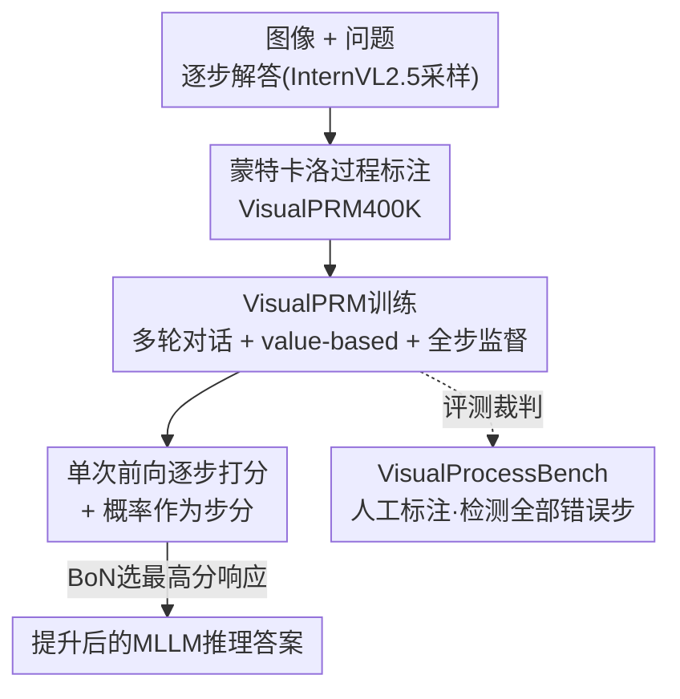

# VisualPRM400K: An Effective Dataset for Training Multimodal Process Reward Models

**会议**: ICLR 2026  
**OpenReview**: [https://openreview.net/forum?id=IHyY6vdYZw](https://openreview.net/forum?id=IHyY6vdYZw)  
**代码**: 模型、数据与基准承诺开源（论文中声明 will be released）  
**领域**: 多模态VLM / LLM推理  
**关键词**: 多模态过程奖励模型, 测试时扩展, Best-of-N, 蒙特卡洛标注, 过程监督基准

## 一句话总结
作者用蒙特卡洛自动标注流水线构建了首个约 40 万条的多模态过程监督数据集 VisualPRM400K，训练出 8B 的多模态过程奖励模型 VisualPRM 作为 Best-of-N 评测中的「裁判」，让 MiniCPM-V、Qwen2.5-VL、InternVL2.5 等不同家族、不同规模的 MLLM 推理能力普遍提升（78B 模型在七个推理基准上 +5.9 分），并配套发布了人工标注的过程评测基准 VisualProcessBench。

## 研究背景与动机
**领域现状**：测试时扩展（Test-Time Scaling, TTS）是提升大模型推理的重要手段——让策略模型采样 N 个候选答案，再用一个「裁判模型」（critic）挑出最好的那个（Best-of-N, BoN）。这条路在纯文本 LLM 上已经被证明有效，但在多模态大模型（MLLM）上几乎没人做。

**现有痛点**：把 TTS 搬到 MLLM 上有两个卡点。其一是**缺好的裁判模型**：现成的开源 MLLM 直接拿来当裁判，BoN 提升微乎其微，因为它们训练语料里几乎没有 critic 数据，倾向于把所有步骤都判成「对」。其二是**缺评测裁判的基准**：直接用 BoN 来评裁判，既贵（策略模型要生成 N 条完整推理，算力大头都耗在它身上），又不公平（BoN 成绩同时受策略模型影响，换个策略模型就没法横向比裁判好坏）。

**核心矛盾**：MLLM 的过程级评判能力没有被针对性训练过——既没有「逐步对错」的监督数据来训裁判，也没有干净的基准来量化裁判的过程判错能力。

**本文目标**：(1) 造出多模态的过程监督数据并训出能用的多模态 PRM；(2) 造一个能独立衡量裁判过程判错能力的基准。

**切入角度**：纯文本领域已有 MathShepherd / OmegaPRM 用蒙特卡洛采样自动估计每一步的「期望正确率」，省去了 PRM800K 那种纯人工标注的天价成本。作者把这套自动流水线迁移到多模态，再补一个人工标注的高质量评测基准。

**核心 idea**：用蒙特卡洛采样自动给每一步打「期望正确率」标签造出 VisualPRM400K，把过程评判建模成多轮对话的逐步对错预测训出 VisualPRM，作为 BoN 裁判挑选 MLLM 的最优推理。

## 方法详解

### 整体框架
整篇工作围绕「数据 → 模型 → 基准」三件套展开：先用一条自动流水线把图像-问题-解答标上逐步对错，得到训练集 VisualPRM400K；再把过程评判问题建模成多轮对话，训练 8B 的 VisualPRM 在每一步预测对错；推理时让 VisualPRM 一次前向给候选响应打分，在 Best-of-N 里选出最优答案；最后用人工标注的 VisualProcessBench 独立衡量各种裁判（含 VisualPRM 与现成 MLLM）的过程判错能力。

### 关键设计

**1. VisualPRM400K：用蒙特卡洛采样自动估计每一步的期望正确率**

PRM 训练最大的拦路虎是过程标注成本——PRM800K 全靠人工，多模态场景下不可能照搬。作者借鉴 MathShepherd 的思路，把「这一步对不对」转化为「从这一步往后采样，最终答对的概率有多高」。具体地，给定图像 $I$、问题 $q$ 和已有前缀 $s_{\le i}$，让模型采样若干条续写 $\tilde{s}_{>i} \sim M(\tilde{s}_{>i} \mid I, q, s_{\le i})$，则第 $i$ 步的期望正确率定义为续写中答对的比例：

$$mc_i = \frac{\text{num(correct completions)}}{\text{num(sampled completions)}}$$

当 $mc_i > 0$ 即视该步为正确。流水线参数上，每个图像-问题对采样 4 条解答、每条切成至多 12 步（超过就均匀合并以省成本），每步采样 16 条续写算 $mc_i$。最终得到约 40 万样本、200 万带过程监督的步骤，平均每条响应 126.9 词、5.6 步，每步 22.6 词，约 10% 的步骤为错误步。这套自动流水线让多模态过程监督数据第一次能规模化产出，而不必为每一步雇人标注。

**2. VisualPRM 建模：多轮对话 + value-based + 全步监督**

有了带 $mc_i$ 的数据，怎么训出 PRM 是第二个关键。作者把过程评判建成**多轮对话**任务，直接复用 MLLM 的生成能力：第一轮塞入图像、问题和首步 $s_0$，之后每一轮追加一个新步，模型在每轮预测该步质量 $y_i \sim M(y_i \mid I, q, s_{\le i})$。这里有两个刻意的选择。其一是采用 **value-based** 建模——让模型输出离散对错 $c_i \in \{+, -\}$（$mc_i>0$ 记为 $+$），类似强化学习里的价值函数；对照的 advantage-based 建模则预测 $mc_i - mc_{i-1}$ 的好/平/坏 $\{+, =, -\}$（类比优势函数）。消融显示 value-based 更优，作者归因于自动流水线产出的数据本身含噪，准确判断「某步是否让期望正确率上升」比判断「这步对不对」更难。其二是**全步监督**：不同于以往只监督到第一个错误步的做法，VisualPRM 对所有步都施加监督，实验证明这样效果更好（也契合现代模型会自我反思纠错的特性）。作者还试过加阈值过滤假正例，反而掉点，于是不加。

**3. 单次前向打分：用生成概率把逐步质量聚合成响应分**

推理阶段要把逐步预测变成可比较的响应级分数。VisualPRM 把每一步的分数定义为**离散对错 token 生成概率的加权和**：value-based 下 $\{+, -\}$ 权重取 $\{1, 0\}$，于是步分就近似等于模型输出「$+$」的概率；advantage-based 下 $\{+, =, -\}$ 权重取 $\{1, 0, -1\}$。默认把各步分数**取平均**作为整条响应的分数。这种做法的工程优势很大：VisualPRM 用一个「+」当占位符、一次前向就能读出所有步的概率分数，而让普通 MLLM 当裁判得对每一步自回归生成判断，又慢又容易把所有步判成对。聚合方式上，取平均/取最小都明显优于取最大——因为多数错误步出现在解答中段，而开头常有一个接近 1 的高分步，取最大会被这个开头步带偏；取平均相当于多步集成，最稳。

**4. VisualProcessBench：检测「全部」错误步的人工标注过程基准**

为了能脱离昂贵的 BoN、独立衡量裁判的过程判错能力，作者构建了 VisualProcessBench：从 MMMU、MathVision、MathVerse、DynaMath、WeMath 收集问题，用 GPT-4o、Claude-3.5-Sonnet、Gemini-2.0-Flash、QvQ-72B、InternVL2.5-78B 等多个领先 MLLM 生成多样化解答，再请至少本科学历的人工专家给每步标 positive/negative/neutral 三类标签（13 人标 3 天、39 人天，作者再抽检 10% 复核返修）。共 2866 样本、26950 个步级标签（正确 16585、错误 7691、中性 2674）。与以往只要求「找出第一个错误步」的基准不同，它要求模型**找出解答里所有的错误步**，以减少因模型反思纠错带来的假阴性。评测用 **macro F1**：分别算正确步和错误步的 F1 再取平均，以抵消正负步严重不均衡（仅约 10%/部分错误）的影响。

### 损失函数 / 训练策略
训练即在多轮对话框架下，对每一轮预测的离散对错 token 做标准语言建模监督；监督覆盖全部步（w/o early stop），不设阈值过滤。数据由自动流水线产出，约 40 万样本 / 200 万步。

## 实验关键数据

### 主实验
VisualPRM 作为 BoN（默认 N=8，温度 0.7）裁判，在七个多模态推理基准（MMMU、MathVista、MathVision、MathVerse-VO、DynaMath、WeMath、LogicVista）上稳定提升各家 MLLM：

| 策略模型 | Pass@1 (Overall) | +VisualPRM | 提升 |
|--------|------|------|------|
| MiniCPM-V2.6-8B | 29.5 | 37.5 | +8.0 |
| Qwen2.5-VL-7B | 41.4 | 45.1 | +3.7 |
| InternVL2.5-8B | 32.8 | 41.2 | +8.4 |
| InternVL2.5-26B | 36.9 | 45.8 | +8.9 |
| InternVL2.5-38B | 44.4 | 50.7 | +6.3 |
| InternVL2.5-78B | 46.0 | 51.9 | +5.9 |

提升跨家族、跨规模一致；即便对已经很强的 InternVL2.5-78B 仍有 +5.9 分。

在 VisualProcessBench 上，8B 的 VisualPRM 反超部分专有模型：

| 模型 | Overall macro F1 | 说明 |
|------|------|------|
| Random Guessing | 50.0 | 基线 |
| InternVL2.5-8B | 48.0 | 开源 MLLM 接近随机（正步 F1 76.8 / 负步仅 19.2） |
| GPT-4o | 60.3 | 专有 |
| Gemini-2.0-Flash | 62.3 | 专有 |
| **VisualPRM-8B (ours)** | **62.0** | 超过 GPT-4o，与 Gemini-2.0-Flash 持平 |

### 消融实验

| 配置 | BoN (InternVL2.5-8B) | VL-ProcessBench | 说明 |
|------|------|------|------|
| Pass@1 | 32.8 | - | 无 TTS 基线 |
| InternVL2.5-8B 当裁判 | 33.2 | 48.0 | 现成 MLLM 几乎无效 |
| Advantage-based (+Average) | 37.4 | 55.0 | 优势建模 |
| Value w. early stop (+Average) | 40.6 | 61.6 | 只监督到首个错误步 |
| Value w/o early stop (+Average) | **41.1** | **62.0** | 全步监督，最佳 |
| Value w/o early stop +Max | 35.9 | 62.0 | 取最大聚合明显掉点 |

### 关键发现
- **PRM > ORM > SC**：N=8 时 PRM 比 Self-Consistency、Outcome Reward Model 分别高 2.4、1.5 分；且差距随 N 增大而扩大，N=128 时拉到 3.1、4.3 分。ORM 在 N 增大后甚至不再稳定涨分（Best-of-128 反而不如 Best-of-64）。
- **value-based 优于 advantage-based**：自动流水线数据含噪，判断「某步是否提升期望正确率」比判断「对错」更难，故价值建模更稳。
- **全步监督优于早停监督**，**取平均/最小优于取最大**：错误步多在中段，开头常有近 1 的高分步会误导「取最大」。
- **泛化到纯文本**：VisualPRM 给 Qwen2.5 系列做文本 BoN 同样涨分，MATH-500 上 7B/32B/72B 分别 +6.1/+2.3/+2.1，GPQA 上 +5.0/+4.0/+6.6。

## 亮点与洞察
- **把「过程评判」建成多轮对话 + 占位符单次前向**：既复用了 MLLM 的生成能力来训裁判，又在推理时用一个「+」占位符一次读出所有步概率，绕开了 MLLM 逐步自回归当裁判又慢又偏正的双重短板，工程上极实用。
- **自动 MC 标注 + 人工基准分工**：训练侧用便宜的蒙特卡洛自动标注换规模，评测侧用昂贵的人工标注换可信度，把成本花在刀刃上——这套「自动造训练集 / 人工造测试集」的搭配可直接迁移到其他需要过程监督的任务。
- **「检测全部错误步 + macro F1」的基准设计**：针对模型会自我反思纠错的新特性，放弃「只找第一个错误步」以减少假阴性，并用 macro F1 抵消正负步不均衡，是一个考虑得很细的评测改进。
- **value vs advantage 的反直觉结论**：理论上 advantage（增量）信息更细，但在含噪自动标注下反而不如直接判对错的 value 建模——提醒做过程监督时要先评估标签噪声再选建模粒度。

## 局限与展望
- **数据正负严重不均衡**：仅约 10% 错误步，虽然 PRM 仍表现不错，但错误步本身的判别（负步 F1）仍是难点，未来或需更主动地采样难/错样本。
- **依赖自动流水线的标签质量**：$mc_i$ 由蒙特卡洛采样估计、本身含噪，作者也据此解释了 advantage 建模和阈值过滤为何失效；标签噪声的上限可能限制 PRM 的天花板。
- **续写采样成本**：每步 16 条续写、每问 4 条解答，构建 40 万数据的采样开销不小（虽比人工便宜）；max steps=12 的合并也可能损失细粒度。
- **裁判分数聚合较朴素**：默认简单平均，更聪明的聚合（如按步置信度或位置加权）可能进一步提升。

## 相关工作与启发
- **vs MathShepherd / OmegaPRM**: 它们在纯文本上用蒙特卡洛自动标注过程监督；本文把这套流水线首次迁移到多模态，并补齐了多模态过程评测基准这一空白。
- **vs PRM800K**: PRM800K 是首个开源过程监督数据集但全靠人工标注、成本极高；VisualPRM400K 用自动流水线换规模，把人工预算省下来花在评测基准上。
- **vs Outcome Reward Model / Self-Consistency**: ORM 只给整条响应打一个总分、SC 靠多数投票；PRM 先逐步评分再聚合，在 BoN 下稳定更优且随 N 扩展性更好。
- **vs ProcessBench 等文本过程基准**: 以往基准多只要求找第一个错误步；VisualProcessBench 面向多模态、要求找出全部错误步并用 macro F1 评测。

## 评分
- 新颖性: ⭐⭐⭐⭐ 首个多模态过程监督数据集 + 多模态 PRM + 配套基准，方法多沿用文本领域成熟思路但系统性补齐了多模态空白。
- 实验充分度: ⭐⭐⭐⭐⭐ 跨 3 家族 6 规模 7 基准的 BoN 验证，PRM/ORM/SC 对比、value/advantage 与聚合方式消融、纯文本泛化俱全。
- 写作质量: ⭐⭐⭐⭐ 结构清晰、图表充分，定义与流水线交代到位。
- 价值: ⭐⭐⭐⭐⭐ 数据/模型/基准全部承诺开源，直接推动多模态测试时扩展与 critic 模型研究。

<!-- RELATED:START -->

## 相关论文

- [\[CVPR 2026\] Improving Vision-language Models with Perception-centric Process Reward Models](../../CVPR2026/vlm_reasoning/improving_vision-language_models_with_perception-centric_process_reward_models.md)
- [\[CVPR 2026\] Hierarchical Process Reward Models are Symbolic Vision Learners](../../CVPR2026/vlm_reasoning/hierarchical_process_reward_models_are_symbolic_vision_learners.md)
- [\[ICLR 2026\] Perception-R1: Advancing Multimodal Reasoning Capabilities of MLLMs via Visual Perception Reward](perception-r1_advancing_multimodal_reasoning_capabilities_of_mllms_via_visual_pe.md)
- [\[ICLR 2026\] No Labels, No Problem: Training Visual Reasoners with Multimodal Verifiers](no_labels_no_problem_training_visual_reasoners_with_multimodal_verifiers.md)
- [\[ICLR 2026\] SophiaVL-R1: Reinforcing MLLMs Reasoning with Thinking Reward](sophiavl-r1_reinforcing_mllms_reasoning_with_thinking_reward.md)

<!-- RELATED:END -->
