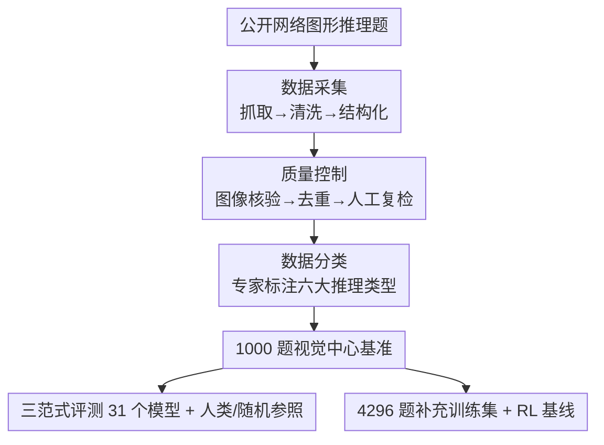

# VisuLogic：评测多模态大模型视觉推理能力的基准

**会议**: ICLR 2026  
**OpenReview**: [https://openreview.net/forum?id=mXuzDDVXxi](https://openreview.net/forum?id=mXuzDDVXxi)  
**代码**: https://visulogic-benchmark.github.io/VisuLogic  
**领域**: 多模态VLM / LLM推理  
**关键词**: 视觉推理, 评测基准, 多模态大模型, 语言捷径, 强化学习

## 一句话总结
VisuLogic 构造了一个 1000 题、人工核验、覆盖六大类的纯视觉逻辑推理基准，刻意堵死「把图转成文字再用语言推理」的捷径，结果显示绝大多数顶尖 MLLM 准确率不到 30%（仅略高于 25% 的随机基线、远低于人类 51.4%），并配套提供训练集与强化学习基线。

## 研究背景与动机

**领域现状**：随着 LLM 在数学、代码、逻辑等领域的推理能力快速提升（CoT 提示、o1/DeepSeek-R1 这类测试时计算扩展），把这些技术迁移到 MLLM 上、用强化学习增强多模态推理已经成为热门方向，也涌现出 R1-Onevision、MM-EUREKA、VLM-R1 等一批早期工作。

**现有痛点**：但这些工作普遍依赖已有的多模态基准来衡量「视觉推理」，而这些基准并不能真正测出模型以视觉为中心的推理能力。比如 VLM-R1 用指代表达理解（referring expression）来评估，本质只考目标定位这种基础感知；MathVista、MathVerse、MathVision 这类带图的数学题，模型往往把图里的视觉线索翻译成文字描述，然后退化成纯语言推理。

**核心矛盾**：根本问题在于现有基准没有把「视觉推理」和「文本推理」解耦——一道题如果 SOTA MLLM 只要描述一下图、再交给纯文本 LLM 就能答对，那它考的就不是视觉推理。论文用一个直观对比说明：在 MMMU 上，GPT-4o 把几何图描述清楚后，纯 LLM 就能算出四边形面积（描述足以保留关键信息）；但在 VisuLogic 上，即便 SOTA MLLM 也描述不清对称、旋转这类关键视觉线索，文字描述里会丢掉决定答案的信息。

**本文目标**：构造一个显式聚焦视觉中心推理、堵死语言捷径的基准，并系统分析当前模型在哪些类型上失败、差距有多大。

**切入角度**：从「人类视觉智能的核心」出发——抓取公开的图形推理题（类似公务员行测里的图形规律题），这类题天然要求在图像上做逻辑演绎，且很难用一段文字完整描述清楚。

**核心 idea**：用 1000 道经人工核验、覆盖数量/空间/位置/属性/样式/其它六大类的纯视觉逻辑题，构成一个语言捷径难以奏效、能真正暴露 MLLM 视觉推理短板的严格评测基准。

## 方法详解

### 整体框架

VisuLogic 本质是一套「构建 + 评测 + 助推」的完整基准工程：先用三阶段自动化管线从公开网络资源采集图形推理题，经过严格质控和专家分类，得到 1000 道单选视觉逻辑题（答案在 ABCD 上近乎均匀分布）；再用三种 prompt 范式（Non-CoT / CoT / Hint）评测 31 个模型（8 个 LLM + 23 个 MLLM），并以 100 名理工科研究生作为人类参照、以均匀随机猜测作为随机基线；最后还额外提供 4,296 题的补充训练集和一个基于 RLOO 的强化学习基线，给后续研究铺路。

数据构建阶段是清晰的三段式串行管线，画成框架图便于对照：

### 关键设计

**1. 视觉中心的六类推理任务：用「描述会丢信息」堵死语言捷径**

这是整个基准的灵魂，针对的正是前面「模型把图转文字就能答」的痛点。论文挑选的题型都是图形规律推理，要求在图像层面做逻辑演绎，而非识别图里的文字或物体。全部题目被专家按所需推理技能标注、归并成六大类：**数量推理**（Quantity，关注点/线/角等图形元素数量的变化与算术关系，占 35.3%）、**空间推理**（Spatiality，要求从二维图心算重建三维形状、折叠展开、立体拼合，占 23.1%）、**位置推理**（Position，平移/旋转/翻转等保持元素不变的变换，占 13.6%）、**属性推理**（Attribute，对称性、曲率、开闭等内在属性，占 8.2%）、**样式推理**（Style，叠加/相减、形状异同，占 9.0%）和**其它**（含字母数字符号等，占 10.8%）。

之所以这样设计能堵死捷径，关键在于这些题的视觉线索（对称轴、旋转角度、棋盘格的不规则缺口）**难以用一段文字无损描述**——论文展示的对比里，GPT-4o 对同一道 VisuLogic 题给出的描述彼此矛盾、丢掉了决定答案的对称信息，导致纯 LLM 无从下手。作者还实证：把图换成详细文字描述喂给纯文本 LLM 后，Doubao-1.5-Pro、Claude-3.7-Sonnet、Qwen2.5-72B 的准确率（26.6% / 25.9% / 28.0%）只比 24.9% 随机基线高一点点，反向证明了文字推理在这套题上根本不够用。

**2. 三阶段数据构建管线：保证规模、纯净度与标注一致性**

针对「基准要可靠才有评测价值」，论文设计了采集→质控→分类的自动化三段管线。**采集**用 Playwright 系统化爬取网页原始内容，配合自定义解析脚本抽取问答对，再去除噪声和无关 HTML 标记（如 `
`），最后把文本与图像统一结构化为 JSONL。**质控**是三道关卡：图像核验（检查每张图存在且格式正确，不合格的人工复审后剔除）、去重（文本层面检测词汇重叠，图像层面用感知哈希 pHash 识别视觉相似图）、人工复检（自动过滤后对每条剩余条目逐一人工确认有效性）。**分类**则由专家先按所需推理能力打标签，再归并成主类别，并对每道题做人工复核，模糊样本统一归入「其它」。最终得到 1000 道经严格核验的单选题，答案在 ABCD 上分布为 23.1% / 26.7% / 25.2% / 25.0%，接近均匀，避免选项偏置被模型钻空子。

**3. 三种 prompt 评测协议与 Hint 探针：把「能不能推理」和「会不会推理」分开测**

针对「要分清模型是没能力还是没被激发」，论文用三种提示范式评测同一批模型。**Non-CoT** 只要求直接给出 `\boxed{$LETTER}`；**CoT** 要求先逐步推理再作答；**Hint** 则用 GPT-4o 基于参考解法生成不泄露最终答案的解题提示，连同 CoT 一起喂给模型，相当于给模型「点一下思路」。对纯文本 LLM 则统一采用 GPT-4o 生成图像描述后前置到题干的评测协议。Hint 探针的意义在于：人类拿到提示后准确率从 51.4% 飙升到 83.6%，说明这些题对「被点拨者」并不难；但 MLLM 拿到同样的 hint 仍冲不破 50%，从而把模型的瓶颈定位在**构造可靠推理链的能力本身**，而非缺乏解题方向。

**4. 补充训练集 + RLOO 强化学习基线：给社区一个可复现的改进起点**

针对「光有评测、没有改进路径」，论文额外提供 4,296 题、与基准同源同质控但无重叠的补充训练集（类别比例与主基准对齐），并给出一个基于规则奖励的强化学习基线。算法选用免 critic 的 **RLOO（REINFORCE Leave-One-Out）**，计算开销低且对噪声和 KL 约束更鲁棒；奖励借鉴 DeepSeek-R1 的规则化思路，由**格式奖励**（强制把思考过程放进 `<think></think>`、答案放进 `<answer></answer>`，正则判定）和**准确率奖励**（提取答案与正确选项比对）两部分组成。在 Qwen2.5-VL-7B 和 InternVL2.5-38B 上分别训练，并用同数据集上的 SFT 作为对照来隔离 RL 本身的增益。

## 实验关键数据

### 主实验

评测 31 个模型（8 个 LLM + 23 个 MLLM），默认采用 CoT prompt。整体结论是：几乎所有模型都挣扎在随机基线附近，离人类有巨大差距。

| 类别 | 代表模型 | Overall 准确率 | 对比 |
|------|----------|----------------|------|
| 人类参照 | 100 名理工科研究生 | 51.4% | — |
| 随机基线 | 均匀猜测 | 24.9% | — |
| 最强 LLM（描述→LLM） | Qwen2.5-72B-Instruct | 28.0% | 仅高于随机 3.1 点 |
| 最强闭源 MLLM | OpenAI-o3 | 29.5% | 低于人类 21.9 点 |
| 主流闭源 MLLM | GPT-4o | 26.3% | 接近随机 |
| 最强开源 MLLM | InternVL3-78B | 27.7% | 落后 o3 |
| 表中最高 | Doubao-1.6-Vision | 34.9% | 仍低于人类 16.5 点 |

最强 MLLM（o3）也只有 29.5%，比人类低 21.9 个百分点；GPT-4o、Gemini-2.0-Pro 分别只有 26.3%、28.0%，开源最强 InternVL3-78B 为 27.7%，整体暴露出当前 MLLM 视觉推理的严重短板。

### 消融与分析

**CoT 几乎无效**：与「CoT 应能提升推理」的预期相反，CoT 提示带来的增益极小——GPT-4o-mini 受益最多也只涨 1.2 点，其余模型增益均低于 1.0 点。论文推测这是因为当前 CoT 训练基于纯文本语料，未必适配多模态视觉推理。

| 模型 | Non-CoT | CoT | 变化 |
|------|---------|-----|------|
| GPT-4o | 26.0% | 26.3% | ≈ 持平 |
| GPT-4o-mini | 23.1% | 24.3% | +1.2 |
| Qwen2.5-VL-7B | 25.9% | 26.0% | ≈ 持平 |

**Hint 有限提升但仍封顶 50%**：Claude-3.7-Sonnet、Gemini-2.0-Pro、Doubao-1.5-Vision-Pro 在 hint 下均提升 8 点以上、突破 35%，但即使有显式提示，模型仍构造不出连贯可靠的推理链，没有一个 MLLM 越过 50.0%（人类 83.6%）。这说明单纯用相似任务扩充训练数据不足以解决问题，后续重点应放在推理过程的可靠性与正确性上。

**模型规模与开闭源**：同系列内参数越大略好（InternVL2.5-78B 27.3% 高于 38B 25.5% 约 1.8 点；Qwen2.5-VL-72B 26.2% 仅微高于 7B 26.0% 0.2 点），但增益普遍很小，说明纯靠堆参数难以补齐视觉推理短板。开源最强（InternVL3-78B 27.7%）落后于闭源最强（o3 29.5%）。

**RL 基线有效**：经规则化 RLOO 训练后，Qwen2.5-VL-7B-RL 达到 28.0%（比非 RL 版提升 2.0 点），InternVL2.5-38B-RL 达到 31.1%（比原版提升 5.6 点，刷新 VisuLogic 上的最佳成绩），且增益明显大于在同数据集上做 SFT，验证了针对性 RL 对推进多模态视觉推理的潜力。定性上，RL 让模型更能捕捉状态转移（如棋子移动）、并学会像试错一样迭代修正中间假设。

## 失败模式分析
论文通过定性案例（Figure 7）总结了 MLLM 的典型失败：一类是模型能正确描述静态视觉内容，却无法推断形状间随序列演变的关系，转而依赖物体计数这类表面线索——它们能认出单个形状、能数数，却推不动元素间的相互关系；另一类是推理过程一旦偏离正确解，就容易产生幻觉或答非所问。hint 实验的结语补充指出：提示带来的增益集中在属性、其它、数量三类，而位置和样式两类反而可能退化，说明提示并未充分激发模型能力。

## 个人评价
这篇工作最有价值的一点是把「视觉推理」从「带图的文本推理」里干净地剥离出来：它没有发明复杂的方法，而是用一个简单却尖锐的反例（同一道题，描述→纯 LLM 能不能答对）作为基准设计的判据，从而构造出一套语言捷径失效的题库，让顶尖 MLLM 集体跌回随机基线附近。这种「用任务设计暴露能力边界」的思路，比单纯刷高难度更能推动领域认知。配套的训练集 + RL 基线也降低了后续改进的门槛。局限在于题型偏图形规律推理（接近行测风格），与开放世界的视觉推理仍有分布差异；且 1000 题规模虽经严格人工核验，但来源于公开网络题库，长期可能面临被训练数据污染的风险。

<!-- RELATED:START -->

## 相关论文

- [\[ICLR 2026\] Play to Generalize: Learning to Reason Through Game Play](play_to_generalize_learning_to_reason_through_game_play.md)
- [\[ICLR 2026\] LENS: Multi-level Evaluation of Multimodal Reasoning with Large Language Models](lens_multi-level_evaluation_of_multimodal_reasoning_with_large_language_models.md)
- [\[ICLR 2026\] Mixture-of-Visual-Thoughts: Exploring Context-Adaptive Reasoning Mode Selection for General Visual Reasoning](mixture-of-visual-thoughts_exploring_context-adaptive_reasoning_mode_selection_f.md)
- [\[ICLR 2026\] MedVR: Annotation-Free Medical Visual Reasoning via Agentic Reinforcement Learning](medvr_annotation-free_medical_visual_reasoning_via_agentic_reinforcement_learnin.md)
- [\[ICLR 2026\] Reasoning-Driven Multimodal LLM for Domain Generalization](reasoning-driven_multimodal_llm_for_domain_generalization.md)

<!-- RELATED:END -->
