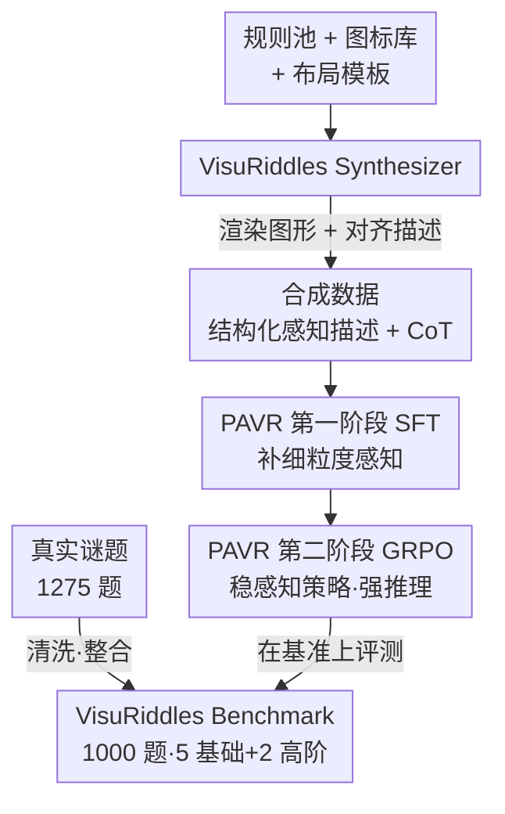

# VisuRiddles: Fine-Grained Perception is a Primary Bottleneck for Multimodal Large Language Models in Abstract Visual Reasoning

**会议**: ICLR 2026  
**OpenReview**: [https://openreview.net/forum?id=fGRwRnDVMX](https://openreview.net/forum?id=fGRwRnDVMX)  
**代码**: https://github.com/yh-hust/VisuRiddles (有)  
**领域**: 多模态VLM / LLM推理  
**关键词**: 抽象视觉推理, 细粒度感知, 视觉谜题基准, 数据合成, 强化学习

## 一句话总结
本文用一个真实谜题基准（VisuRiddles）和一个带结构化感知描述的合成器，系统证明了多模态大模型（MLLM）在抽象视觉推理（AVR）上栽跟头的根因不是推理能力弱，而是**细粒度感知缺失**；据此提出"先 SFT 补感知、再 GRPO 强推理"的两阶段训练范式 PAVR，让一个 7B 模型在 AVR 上反超 GPT-5、Gemini-2.5-Pro 等商用大模型。

## 研究背景与动机
**领域现状**：近两年 MLLM 在通用视觉理解、数学推理等任务上突飞猛进，主流提升路线是堆参数、加 CoT 提示、做 inference-time scaling（"think"模式）。这些手段在很多基准上确实有效。

**现有痛点**：可一旦切到抽象视觉推理（AVR）——也就是人类做的那种"看一组抽象图形找规律、选下一个"的智力题——再强的模型也集体翻车。即便是 Gemini-2.5-Pro，准确率也常常接近随机猜测，和人类约 62% 的水平差一大截。诡异的是，这些题对人来说并不难。

**核心矛盾**：作者把 AVR 的困难拆成两块——细粒度感知与逻辑推理。学界这两年几乎把全部精力压在"增强推理"上，却严重忽视了"感知抽象图形中位置、样式、属性等细微视觉结构"的能力。文中一个关键观察一锤定音：当把抽象图形**人工改写成结构化的感知描述**（如"3×3 网格、每格 8 个三角区、第 2/3/6/8 个填黑"）再喂给模型，原本做错的题立刻就能做对。这说明卡住模型的不是"想不明白规律"，而是"根本没看清图"。

**本文目标**：(1) 造一个能客观评估 AVR 能力、且不依赖外部知识的基准；(2) 解决现有数据集只有问答对、缺中间感知标注的问题，让感知能力可被显式监督；(3) 设计一套同时补齐感知与推理的训练方案。

**切入角度**：既然感知是被忽视的短板，那就先把感知能力训上去，再在此基础上优化推理——"先看清，再想对"。

**核心 idea**：用合成器自动生成"抽象图形 + 对齐的结构化感知描述 + CoT 解题链"，靠 SFT 把细粒度感知灌进模型，再用 GRPO 强化学习稳定感知策略选择并提升推理，得到 Perception-Augmented Visual Reasoner（PAVR）。

## 方法详解

### 整体框架
整篇工作由两大件组成：一个名为 **VisuRiddles** 的资源（评测用的 Benchmark + 训练用的 Synthesizer），和一个建立在该资源之上的两阶段训练范式 **PAVR**。Benchmark 负责"客观地把模型的 AVR 短板量出来"，Synthesizer 负责"批量造出带感知标注的训练题"，PAVR 则把合成数据先后用于 SFT 与 RL，最终在 Benchmark 上接受检验。

整体数据流是单向串行的：真实谜题经清洗整合成 Benchmark；Synthesizer 按"规则池 + 图标库 + 布局模板"渲染出抽象图形并同步吐出结构化感知描述，再经 API 标注挂上 CoT 解题链；这批合成数据先做 SFT 把感知能力灌进基座模型（得到 PAVR-SFT），再用 GRPO 强化学习把感知锚定与推理一起优化（得到 PAVR）。SFT 与 RL 是互补的——SFT 让模型"看清"，RL 让模型"想稳"。

### 关键设计

**1. VisuRiddles Benchmark：把"纯视觉逻辑"从知识里剥离出来评测**

现有逻辑推理基准（RAVEN、MARVEL、VisuLogic 等）有个通病：要么部分依赖外部知识，让模型靠"背的知识"蒙混过关，难以分离出真实的视觉推理能力；要么任务多样性和结构复杂度不足。VisuRiddles 直接取材自真实智力谜题，从 1275 道带专家解析的题里清洗、整合出 1000 道，覆盖五个基础感知维度——数量（Numerosity）、属性（Attribute）、样式（Style）、位置（Position）、空间（Spatiality），外加两类高阶推理任务：需要类比抽象推理的 RAVEN（8 选 1）和需要一致性逻辑推理的数独（开放符号输出，解空间巨大），再补一个含平面图形组合、字符语义模式的 Other 子集。基础题 800 道做成单选，四个选项分布刻意拉平（A/B/C/D 各约 25%）避免位置先验；高阶题 200 道要求模型输出**精确符号解**才算对，杜绝瞎猜。这套从基础感知到高阶推理的统一标尺，让"模型到底差在哪一环"第一次能被量化定位。

**2. VisuRiddles Synthesizer：给抽象图形配上"对齐的感知描述"以监督感知**

要训感知，就得有"图形 → 感知描述"的监督信号，可现有数据集只给问答对，既无法显式建模"感知到推理"的过程，又导致黑盒推理、归纳能力弱、泛化差；而让商用模型去标注感知过程效果很差，人工标注又太贵。Synthesizer 用一条统一流水线绕开这个困境，分两阶段：**Riddles Construction** 先从规则池选一条规则（如位置类的旋转、样式类的 OR/XNOR）及其子规则，再选图标、背景、布局模板并设定规则参数（规则数量、各规则作用范围），渲染出抽象图形——关键是渲染时"规则即已知"，所以能**天然吐出与图形严格对齐的结构化感知描述**（每个子图哪行哪列是什么元素、哪些区域被填充）；**API Labeling** 阶段再基于这些感知描述调用大模型生成 CoT 解题链，并用预测答案与 ground truth 比对做质量过滤。最终产出 7 类（5 感知 + 2 高阶）共带感知描述与 CoT 的训练样本。作者特意把合成题的**推理难度压得比真实谜题低**——因为它的使命是补感知而非练推理，难度过高反而干扰感知学习。

**3. PAVR 两阶段训练：先 SFT 补感知，再 GRPO 强推理**

有了带感知描述和 CoT 的合成数据，PAVR 以 Qwen2.5-VL-7B 为基座分两步走。**第一阶段 SFT**：用 2 万条合成 AVR 样本训 20 个 epoch，让模型学会从抽象图形里捕捉细粒度视觉线索（"看清"），为后续推理打地基。但纯 SFT 仍有两个顽疾：感知策略选择不稳（比如该看对称轴还是该看直角结构，模型拿不准）、难题上推理能力不足。**第二阶段 RL**：用 GRPO（Group Relative Policy Optimization）继续优化，奖励设计很朴素——答案奖励（对得 1、错得 0）加格式奖励（鼓励输出严格匹配 `<think>...</think><answer>...</answer>` 模板），GRPO 数据同样由 Synthesizer 生成（4K 样本、40 epoch、rollout=5、KL 系数 0.01）。两阶段互补的本质是：SFT 把"感知"从短板补成地基，GRPO 再在感知锚定之上把"感知策略 + 推理"一起拧稳。一个有意思的副产物是 PAVR 表现出"rethink"现象——即便偶尔感知出错，模型会自我复查、纠正并把推理轨迹拉回正确方向。

### 损失函数 / 训练策略
SFT 阶段：20K 合成样本、20 epoch、AdamW、batch size 16、学习率 $5\times10^{-7}$。GRPO 阶段：4K 样本、40 epoch、学习率 $1\times10^{-6}$、rollout 数 5、KL Loss 系数 0.01、CLIP Ratio 1.0。奖励 $R = R_{\text{answer}} + R_{\text{format}}$，其中答案奖励为 0/1、格式奖励约束 think/answer 模板。全程 8×A800 80G。

## 实验关键数据

### 主实验
VisuRiddles 上，7B 的 PAVR 全面碾压一众更大的开源与商用模型（上标数字表示选项数，Sudo 为开放解空间）：

| 模型 | 参数 | Num | Styl | Attr | Posit | Spat | Sudo | Rav | Other | Avg |
|------|------|-----|------|------|-------|------|------|-----|-------|-----|
| Human | - | 61.3 | 60.9 | 67.5 | 67.9 | 58.8 | - | - | 61.9 | - |
| Qwen2.5VL-72B | 72B | 23.6 | 23.1 | 19.6 | 30.2 | 26.9 | 0.0 | 62.0 | 23.9 | 25.9 |
| Gemini2.5-pro | - | 31.6 | 31.6 | 48.5 | 26.1 | 30.1 | 39.0 | 30.0 | 44.9 | 33.9 |
| GPT-5 | - | 30.8 | 30.8 | 38.1 | 32.4 | 30.8 | 2.0 | 29.0 | 31.9 | 28.7 |
| Qwen3-VL-235B-Thinking | 235B | 31.2 | 29.9 | 44.3 | 33.3 | 30.1 | 33.0 | 49.0 | 39.1 | 34.9 |
| Baseline (Qwen2.5VL-7B) | 7B | 24.4 | 28.2 | 23.7 | 22.5 | 25.0 | 0.0 | 48.0 | 24.6 | 24.6 |
| PAVR-SFT | 7B | 31.2 | 31.6 | 44.3 | 31.5 | 45.5 | 43.0 | 61.0 | 39.1 | 39.5 |
| **PAVR** | 7B | **39.6** | **39.3** | **50.5** | **39.6** | **51.9** | **46.0** | **65.0** | **55.1** | **46.8** |

PAVR 平均 46.8%，比基座 7B（24.6%）几乎翻倍，也大幅超过 Gemini2.5-Pro（33.9）、Qwen3-VL-235B-Thinking（34.9）和 GPT-5（28.7）。值得注意的是：堆参数（72B 不如 PAVR）、加 CoT 提示、开"thinking"模式都**无法**有效解决 AVR，证明问题根子不在推理算力。

### 消融实验

**瓶颈归因（感知 vs 推理，Tab.3）**：把同一批题分别以"原始抽象图（V）"和"结构化感知描述（P）"两种输入喂给冻结的大模型，看准确率变化。

| 模型 | Num | Styl | Attr | Posit | Spat | Sudo | Rav | Avg |
|------|-----|------|------|-------|------|------|-----|-----|
| GPT-4o (V) | 35.0 | 32.0 | 38.0 | 36.0 | 32.0 | 0.0 | 20.0 | 27.6 |
| GPT-4o (P) | 62.0 | 53.0 | 80.0 | 68.0 | 100.0 | 15.0 | 25.0 | **60.1** (+32.5) |
| Qwen2.5VL (V) | 41.0 | 43.0 | 50.0 | 32.0 | 40.0 | 0.0 | 10.0 | 30.9 |
| Qwen2.5VL (P) | 73.0 | 83.0 | 80.0 | 79.0 | 100.0 | 65.0 | 35.0 | **73.6** (+42.7) |

只换输入形式、不动模型权重，平均分就暴涨 32~43 个点——这是"感知才是瓶颈"最有力的直接证据。数独尤为典型：从近乎 0% 跳到 15%/65%，因为数独图小数字密、缺语义线索，模型根本"看不清"，而人靠快速视觉扫描就能轻松解析。

**训练组件消融（Tab.4）**：

| 配置 | Avg | 说明 |
|------|-----|------|
| Baseline (Qwen2.5-VL) | 24.6 | 基座 |
| Baseline + Caption | 33.3 (+8.7) | 仅感知描述 SFT，泛化弱 |
| Baseline + GRPO | 29.4 (+4.8) | 仅强化推理，提升有限 |
| Baseline + CoT (PAVR-SFT) | 39.5 (+14.9) | 感知描述 + CoT 标注 |
| Baseline + CoT + GRPO (PAVR) | 46.8 (+22.2) | 完整模型 |

### 关键发现
- **感知是地基，推理增强只是锦上添花**：脱离感知单上 GRPO 只涨 4.8 点，而补上感知（+CoT SFT）就涨 14.9 点，再叠 GRPO 才到 +22.2——顺序不能反。
- **纯感知描述 SFT 泛化弱**：只用 Caption 监督涨 8.7 点但泛化差，加上 MLLM 生成的 CoT 标注后才同时获得细粒度感知与部分推理能力。
- **scaling 与 CoT 对 AVR 基本无效**：更大模型不一定更强，CoT 只在个别任务上小幅有用，说明 inference-time scaling 补不上感知缺口。
- **PAVR 会"rethink"自纠**：感知偶尔出错时模型能复查纠正，把推理轨迹拉回正轨，而 QVQ-72B 的"think"模式常陷入冗长却自相矛盾的死循环。

## 亮点与洞察
- **用"换输入不换权重"的对照实验做归因**，干净利落地把"感知瓶颈"从"推理瓶颈"里分离出来——这是全文最让人"啊哈"的设计，比任何性能数字都更有说服力。
- **合成器让感知监督信号"免费"产生**：因为是按规则先生成再渲染，感知描述天然与图形对齐，绕开了"商用模型标不准、人工标太贵"的死结，这个"先有答案再造题"的思路可迁移到任何需要中间过程标注的合成数据任务。
- **刻意调低合成题的推理难度**是个反直觉但正确的取舍：训练目标决定数据难度——补感知就别让推理难度来干扰，分工明确。
- **7B 反超 GPT-5/Gemini-2.5-Pro** 强烈提示：在 AVR 这类任务上，对症补短板比盲目堆规模性价比高得多。

## 局限与展望
- 作者承认：受时间与人力限制，数据合成所用的规则设计、图标库规模有限，制约了合成数据的多样性与丰富度；未来计划扩大资源池、提升复杂度。
- 自己发现的局限：合成题推理难度被刻意压低，模型在真实高阶题（RAVEN/数独）上虽领先但绝对分仍不高（46~65%），离人类水平尚有差距；GRPO 奖励只用答案 + 格式两项，未对感知过程本身给奖励，感知策略稳定性可能仍有提升空间。
- 改进思路：可考虑给中间感知描述也设过程奖励（process reward），或引入更难、更长尾的真实规则扩充合成器，把"看清"的边界继续往复杂结构推。

## 相关工作与启发
- **vs 逻辑推理基准（RAVEN / VisuLogic / MARVEL）**：它们多少依赖外部知识、推理覆盖面有限；VisuRiddles 取材真实谜题、统一覆盖基础感知到高阶推理，且高阶题要求精确符号输出杜绝瞎猜。
- **vs inference-time scaling / CoT 类方法（LLaVA-CoT、R-CoT、QVQ "think"模式）**：这些只在"推理"侧加码，本文实验证明缺了感知锚定，加再多 think 也会陷入冗长自相矛盾的死循环；PAVR 反其道先补感知再强推理。
- **vs 视觉 RL 方法（Visual-RFT、VLM-R1、MM-EUREKA）**：同样用 GRPO，但本文强调 RL 必须建立在"感知已被 SFT 补好"的地基上才有效，单独上 RL 收益甚微——这是对"RL 万能论"的一个清醒注脚。

## 评分
- 新颖性: ⭐⭐⭐⭐⭐ "换输入不换权重"的瓶颈归因实验干净有力，把被忽视的感知短板坐实
- 实验充分度: ⭐⭐⭐⭐⭐ 覆盖 20+ 开源/商用模型，含瓶颈归因、训练组件、VisuLogic 跨基准验证
- 写作质量: ⭐⭐⭐⭐ 论证链条清晰，benchmark/synthesizer/PAVR 三件套层层递进
- 价值: ⭐⭐⭐⭐⭐ 既给社区一个干净的 AVR 评测标尺，也给出"先感知后推理"的可复用训练范式

<!-- RELATED:START -->

## 相关论文

- [\[CVPR 2026\] Breaking the Regional Perception Bottleneck of Multimodal Large Language Models via External Reasoning Framework](../../CVPR2026/vlm_reasoning/breaking_the_regional_perception_bottleneck_of_multimodal_large_language_models_.md)
- [\[CVPR 2026\] Chart-FR1: Visual Focus-Driven Fine-Grained Reasoning on Dense Charts](../../CVPR2026/vlm_reasoning/chart-fr1_visual_focus-driven_fine-grained_reasoning_on_dense_charts.md)
- [\[ICLR 2026\] VisionReasoner: Unified Reasoning-Integrated Visual Perception via Reinforcement Learning](visionreasoner_unified_reasoning-integrated_visual_perception_via_reinforcement_.md)
- [\[CVPR 2026\] ReasonMap: Towards Fine-Grained Visual Reasoning from Transit Maps](../../CVPR2026/vlm_reasoning/reasonmap_towards_fine-grained_visual_reasoning_from_transit_maps.md)
- [\[ICLR 2026\] Perception-R1: Advancing Multimodal Reasoning Capabilities of MLLMs via Visual Perception Reward](perception-r1_advancing_multimodal_reasoning_capabilities_of_mllms_via_visual_pe.md)

<!-- RELATED:END -->
