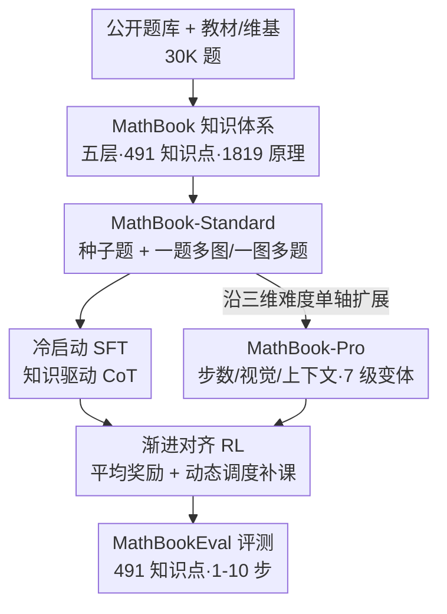

# We-Math 2.0: A Versatile MathBook System for Incentivizing Visual Mathematical Reasoning

**会议**: ICLR 2026  
**OpenReview**: [https://openreview.net/forum?id=I7fTPLT8A9](https://openreview.net/forum?id=I7fTPLT8A9)  
**代码**: https://we-math2.github.io/ (项目主页)  
**领域**: 多模态VLM / LLM推理  
**关键词**: 视觉数学推理, 知识体系, 难度建模, 课程式强化学习, GRPO

## 一句话总结
We-Math 2.0 把一套五层、491 个知识点、1819 条原理的「数学知识体系」，和一套以模型为中心的三维难度数据空间（MathBook-Standard/Pro），以及两阶段强化学习（冷启动 SFT + 渐进对齐 RL）串成一个完整系统，只用约 9.8K 训练样本就让 Qwen2.5-VL-7B 在四个主流视觉数学基准上平均提升 6.1 分。

## 研究背景与动机

**领域现状**：提升多模态大模型（MLLM）数学推理能力的主流路线有三条——堆数据集、做偏好优化、上强化学习。近年来 RL + 课程式训练成为热点，在复杂推理任务上确实有收益。

**现有痛点**：作者指出当前工作普遍漏掉两件根本性的事。其一，缺乏系统化的知识体系：现有数据集对知识点的覆盖零散、领域不均衡，导致模型在数学各子领域表现参差不齐（代数能做、几何拉胯）。其二，难度标注方式不对：现有数据集大多按「人类学段」标难度，但研究表明 MLLM 的学习规律并不和人类学段对齐，按人类难度排课程对模型未必有效。

**核心矛盾**：训练范式偏向「题目记忆」而非「推理泛化」——模型能解复杂题，却在对应的子问题、同类型题上翻车。根因在于知识监督不成体系、难度建模不以模型为中心，使得训练只是在背题，而非真正掌握可迁移的知识。

**本文目标**：拆成三个子问题——(1) 建一套覆盖全面、层级清晰的数学知识体系作监督骨架；(2) 用以模型为中心的方式重新定义题目难度并据此造数据；(3) 设计能沿难度渐进对齐、强调泛化的训练范式。

**切入角度**：作者认为难度应该由「模型实际会在哪里出错」来刻画，而不是人类觉得哪里难。于是把难度拆成「推理步数、视觉复杂度、上下文复杂度」三个正交维度，每道种子题沿单维扩展出 7 个渐进变体；再让 RL 沿这条难度轨迹走，出错时针对性补课。

**核心 idea**：用「结构化知识体系 + 模型中心的三维难度数据 + 沿难度渐进对齐的两阶段 RL」三件套，把视觉数学推理从「背题」拉向「知识驱动的泛化」。

## 方法详解

### 整体框架

We-Math 2.0 是一个端到端系统，可以拆成「造骨架 → 造数据 → 训模型 → 建评测」四段。先用人机协同搭出五层 MathBook 知识体系（491 知识点、1819 原理），作为后续所有标注和监督的统一坐标系；再围绕知识点造种子题、做双向扩展（一题多图 / 一图多题）得到 MathBook-Standard，并沿三维难度空间把每道种子题扩成 7 级变体得到 MathBook-Pro；然后用 MathBook-RL 两阶段训练——先冷启动 SFT 灌入「知识驱动的思维链」范式，再做渐进对齐 RL（先在 Standard 上用平均奖励对齐类比推理，再在 Pro 上沿难度课程动态调度补课）；最后用覆盖全部 491 知识点的 MathBookEval 系统评测。

### 关键设计

**1. MathBook 知识体系：给数学推理一套统一可监督的坐标系**

针对「现有数据集知识点覆盖零散、领域不均衡」这个痛点，作者先搭一套五层层级体系，按「定义—定理—应用」范式组织，核心是知识点集合 $K=\{k_1,\dots,k_N\}$（$N=491$，从小学到大学数学），每个知识点 $k_i$ 关联一组基础原理 $P_i=\{p_{i1},\dots,p_{im_i}\}$（$m_i\in[1,7]$），全体原理 $|P|=1819$。构建走人机协同：人类专家先依据教材/维基/课标搭出初版结构 $K_{human}$，同时从已有数据集采样 30K 题、用 GPT-4o 打多级主题标签后做层次聚类得到 $K_{auto}$，两者再由专家整合校验成最终 $K$。原理标注则是先让 GPT-4o 把每道题解题链的每一步映射到对应知识点（$M_1: q_j\mapsto(k_{i1},k_{i2},\dots)$），再对每个知识点汇总其所有解题路径用到的定理原理（$M_2: k_i\mapsto\{p_{i1},\dots\}$），最后与专家手写原理交叉核对。这套坐标系的价值在于：之后造题、标难度、设计 CoT、做评测全都挂靠在同一套知识点上，监督信号不再是松散的题目，而是结构化、可追溯到具体知识与原理的。

**2. MathBook-Standard & Pro：以模型为中心的三维难度数据空间**

针对「按人类学段标难度不对模型胃口」这个痛点，作者把造数据拆成广度和深度两层。广度层 MathBook-Standard 用「模型起草、专家主导」流程造种子题：给定知识点和原理集，LLM 先生成题目草稿和 GeoGebra 的 XML 脚本，渲染出参考图后由专家用 GeoGebra 重做（实际仅 1.2% 草稿被直接采用，以避免依赖表面视觉线索）；再做两种正交扩展——「一题多图」（固定题面、变 GeoGebra 参数得到锐角/钝角/直角等不同几何实例，答案随之变）和「一图多题」（复用高质量图、针对不同知识点出多道新题）。深度层 MathBook-Pro 则定义一个三维难度空间：步数复杂度 $\phi_s$（用涉及的知识点数量度量推理深度，最复杂变体至少 6 个知识点，递推关系 $K_{i+1}=K_i+1$）、视觉复杂度 $\phi_v$（加辅助线/改几何构型但保留核心结构）、上下文复杂度 $\phi_c$（从简洁数学描述变到真实情境或抽象语言场景）。每道种子题当作原点，每次只动单维生成变体，多轮叠加可组合出最难变体 $(q^*,a^*,I^*)=\phi_s\circ\phi_v\circ\phi_c(q_0,a_0,I_0)$，每道种子题共扩出 7 级。这样难度不再是「人类觉得难」，而是「沿模型真正会出错的三个轴可控加码」，为后续课程式 RL 铺好阶梯。

**3. MathBook-RL：两阶段「冷启动 + 渐进对齐」训练**

针对「训练偏向背题、缺泛化」这个痛点，作者设计两阶段框架。第一阶段冷启动 SFT：从覆盖全部 491 知识点的 Standard 中取初始集 $D_{init}$，用 GPT-4o 把每个样本改写成显式引用相关知识的自然语言解释，再做标准 SFT，目标 $L_{SFT}(\theta)=\mathbb{E}_{(x,y)\sim D_{init}}[-\log P_\theta(y\mid x)]$，目的是灌入「知识驱动的 CoT 范式」而非死记。第二阶段渐进对齐 RL 又分两步：先在 Standard 的「一题多图」子集上做预对齐 RL，用平均奖励——对同一知识原理的一组变体，把每道题的 rollout 奖励先排序、再按排序位置跨题取均值用于优势 $A_i$（单题奖励 $r^{(t)}$ 取 0.9/0.1/0 对应答对/仅格式对/全错），这样 critic 是「整组同原理题的综合表现」而非孤立单题，鼓励跨形式的一致鲁棒；再在 Pro 上沿难度主轨迹 $x_0\to\phi_s(x_0)\to\phi_s\circ\phi_v(x_0)\to\phi_s\circ\phi_c(x_0)\to\phi_s\circ\phi_v\circ\phi_c(x_0)$ 做课程训练，整体用 GRPO 优化（从组内得分估计 baseline，省掉独立 critic）。这套设计把「先学知识范式、再沿难度阶梯对齐」串成一条线，正面回应了泛化诉求。

**4. 动态调度补课：在难度跃迁处对症下药**

这是渐进对齐 RL 里最巧的一环，单独拎出来讲。课程沿难度轨迹推进时，每个跃迁 $x\to\phi(x)$ 都可能让模型「会做 $x$、却栽在 $\phi(x)$」。作者据此引入增量学习：定义增量集 $\Delta(x,\phi)$，专门隔离出 $\phi$ 新引入的那点知识或模态难度，先在 $\Delta(x,\phi)$ 上训练，再回头重试 $\phi(x)$。具体分两类——知识增量调度：$x_0\to\phi_s(x_0)$ 失败时，构造针对新知识点的辅助题 $\Delta(x_0,\phi_s)$；模态增量调度：$\phi_s(x_0)\to\phi_s\circ\phi_v(x_0)$（或 $\phi_c$）失败时，构造隔离新视觉/上下文复杂度的样本。换句话说，模型在哪一维卡住，就被精准导回该维的「单点小题」补课，再回主轨迹。这比一刀切按固定课程喂题更有效，因为补课内容是依据模型当前的真实失败原因动态确定的，正好对上了「以模型为中心」的难度建模思路。

### 损失函数 / 训练策略
冷启动 SFT 用标准交叉熵 $L_{SFT}(\theta)=\mathbb{E}_{(x,y)\sim D_{init}}[-\log P_\theta(y\mid x)]$。RL 阶段用 GRPO，目标含裁剪比率项与 KL 正则：

$$J(\theta)=\mathbb{E}\Big[\frac{1}{G}\sum_{i=1}^{G}\frac{1}{|o_i|}\sum_{t}\min\big(\rho_{i,t}\hat A_{i,t},\ \mathrm{clip}(\rho_{i,t},1-\epsilon,1+\epsilon)\hat A_{i,t}\big)-\beta D_{KL}[\pi_\theta\|\pi_{ref}]\Big]$$

其中 $\rho_{i,t}$ 为新旧策略概率比、$\hat A_{i,t}$ 为组内归一化优势。三阶段数据量分别为 SFT 1K、预对齐 RL 5.8K、动态调度 RL 4K，合计约 9.8K（基座为 Qwen2.5-VL-7B / 3B）。

## 实验关键数据

### 主实验
四个主流基准（MathVista/MathVision/We-Math/MathVerse）上，MathBook-7B 相对 Qwen2.5-VL-7B 全面提升，且只用 9.8K 训练数据：

| 模型 | #Data | Avg. | MathVista | MathVision | We-Math | MathVerse |
|------|-------|------|-----------|------------|---------|-----------|
| GPT-4o-latest | - | 54.0 | 71.6 | 43.8 | 50.6 | 49.9 |
| Qwen2.5-VL-7B（基座） | - | 42.6 | 68.2 | 25.1 | 36.0 | 41.1 |
| WeThink-7B | 120K+20K | 47.5 | 71.6 | 26.0 | 48.0 | 44.2 |
| MM-Eureka-7B | 15K | 45.2 | 73.0 | 26.9 | 34.5 | 46.2 |
| **MathBook-7B（本文）** | **1K+9.8K** | **48.7** | **73.0** | **28.0** | **48.4** | **45.2** |
| Δ(vs 基座) | - | +6.1 | +4.8 | +2.9 | **+12.4** | +4.1 |

We-Math 上 +12.4 的大幅提升尤为关键——该基准要求同时解复杂多步题及其子问题，说明渐进对齐 RL 确实在知识泛化上见效，而非只会做整题。

### 消融实验
按训练阶段消融（MVt=MathVista, MVs=MathVision, WM=We-Math）：

| 配置 | SFT | RL-Pre | RL-Dyn | MVt | MVs | WM |
|------|-----|--------|--------|-----|-----|-----|
| M0 完整 | ✓ | ✓ | ✓ | 73.0 | 28.0 | 48.4 |
| M1 去动态调度 | ✓ | ✓ | - | 72.4 | 27.0 | 47.2 |
| M2 去预对齐 | ✓ | - | ✓ | 72.0 | 26.3 | 43.3 |
| M3 去 SFT | - | ✓ | ✓ | 71.5 | 26.3 | 46.7 |
| M4 仅 SFT | ✓ | - | - | 65.8 | 25.7 | 38.3 |

### 关键发现
- **两个 RL 阶段都有显著贡献**：M1–M3 相对 M4（仅 SFT）均有提升，其中预对齐 RL（去掉它的 M2 在 We-Math 上从 48.4 掉到 43.3）作用最突出，印证知识学习对数学推理的关键性。
- **SFT 单独收益有限，但是解锁 RL 的钥匙**：仅 SFT 的 M4（65.8/25.7/38.3）相对基座提升微弱，但一旦叠加 RL 就大幅起飞，说明 SFT 的价值在于把模型推理范式切换过来、为 RL 铺路。
- **少即是多**：把 SFT 数据从 1K 扩到 15K 并不带来提升，小而精的数据反而更好；自然语言 CoT 也优于结构化分步 CoT，更利于培养灵活推理。
- **MathBookEval 上的规律**：模型准确率随所需知识点数量上升而下降（7–10 知识点题准确率跌破 50%）；普遍代数强、几何弱（空间推理仍是难点）；模型越大各维度提升越一致。

## 亮点与洞察
- **难度的「模型中心」重定义**：把难度拆成步数/视觉/上下文三个正交轴、沿单轴可控加码，比按人类学段标难度更贴合模型真实失败分布——这是全文最核心的观念转变，可迁移到任何「课程式训练」场景。
- **失败驱动的动态补课**：增量集 $\Delta(x,\phi)$ 隔离出跃迁新引入的那一点难度先补课再重试，把「课程」从静态预设变成依模型即时失败原因动态生成，思路很可复用。
- **平均奖励对齐类比推理**：对同一知识原理的一组「一题多图」变体跨题取均值算优势，把 critic 从单题视角抬到「整组同原理」视角，直接服务于「鲁棒泛化而非背单题」的目标。
- **数据效率惊人**：9.8K 样本就能让 7B 模型逼近甚至在 We-Math 上接近闭源模型水平，证明结构化知识体系带来的高质量监督比堆量更值钱。

## 局限与展望
- **系统重、依赖人机协同**：知识体系搭建、GeoGebra 造图、原理标注都需大量专家介入（草稿仅 1.2% 直接可用），复现/扩展成本高。
- **几何仍是短板**：即便专门建了知识体系，MathBookEval 上几何依旧明显弱于代数，说明空间视觉推理的瓶颈未被本方法根本解决。
- **绝对分数并非全面领先**：MathBook-7B 在 MathVision 等基准上仍低于部分基线，主要优势集中在 We-Math 这类强调知识泛化的设置；横向比较时各基准评测协议/难度不同，不宜直接比大小。
- **依赖 GPT-4o 做标注与改写**：知识标注、CoT 改写都用 GPT-4o，监督质量受其能力与潜在偏差影响。

## 相关工作与启发
- **vs 按人类学段标难度（如 MathV360K 等）**：他们用人类学习阶段定难度，本文改用模型中心的三维难度空间，区别在于难度刻画「以谁为准」；本文优势是更贴合模型失败分布、利于课程式 RL，劣势是造数据更复杂。
- **vs 纯 RL/课程式 RL（如 MM-Eureka、R1-VL）**：他们直接上 RL 或固定课程，本文在 RL 前加了知识体系 + 冷启动 SFT 范式切换，并在课程跃迁处做失败驱动的动态补课，强调的是「知识监督 + 渐进对齐」而非单纯堆 RL。
- **vs 知识标注类基准（We-Math、GeoSense）**：前作仅做 benchmark 级的知识标注，本文把知识体系同时用作训练数据与评测，且首次给到原理级标注 + 8 个难度等级，是「体系→数据→训练→评测」的闭环。

## 评分
- 新颖性: ⭐⭐⭐⭐⭐ 把知识体系、模型中心难度建模与两阶段渐进 RL 系统化整合，三维难度 + 失败驱动补课的设计有原创性
- 实验充分度: ⭐⭐⭐⭐ 四基准 + 自建 MathBookEval + 分阶段消融较完整，但绝对分数并非全面领先、几何短板未解
- 写作质量: ⭐⭐⭐⭐ 系统庞大但脉络清晰，知识体系/数据/训练/评测四块层次分明
- 价值: ⭐⭐⭐⭐⭐ 9.8K 数据撬动 6+ 分提升，知识体系与难度建模思路对整个视觉数学推理社区有可复用价值

<!-- RELATED:START -->

## 相关论文

- [\[CVPR 2026\] Incentivizing Versatile Video Reasoning in MLLMs via Data-Efficient Reinforcement Learning](../../CVPR2026/vlm_reasoning/incentivizing_versatile_video_reasoning_in_mllms_via_data-efficient_reinforcemen.md)
- [\[ICLR 2026\] GIR-Bench: Versatile Benchmark for Generating Images with Reasoning](gir-bench_versatile_benchmark_for_generating_images_with_reasoning.md)
- [\[ICLR 2026\] DeepEyes: Incentivizing "Thinking with Images" via Reinforcement Learning](deepeyes_incentivizing_thinking_with_images_via_reinforcement_learning.md)
- [\[ICLR 2026\] Math Blind: Failures in Diagram Understanding Undermine Reasoning in MLLMs](math_blind_failures_in_diagram_understanding_undermine_reasoning_in_mllms.md)
- [\[ICLR 2026\] MathNet: A Global Multimodal Benchmark for Mathematical Reasoning and Retrieval](mathnet_a_global_multimodal_benchmark_for_mathematical_reasoning_and_retrieval.md)

<!-- RELATED:END -->
