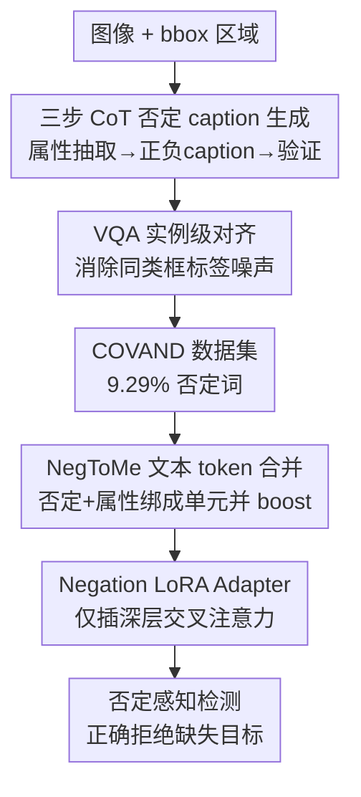

# What "Not" to Detect: Negation-Aware VLMs via Structured Reasoning and Token Merging

**会议**: ICLR 2026  
**论文**: Published as a conference paper at ICLR 2026  
**代码**: 暂未提供  
**领域**: 多模态VLM / 描述式目标检测 / 否定理解  
**关键词**: 否定感知、肯定偏置、token 合并、描述式目标检测、LoRA

## 一句话总结
针对视觉-语言模型在描述式目标检测里"看不懂否定"（把"戴帽子的人"和"没戴帽子的人"当成同一目标）的肯定偏置问题，本文用一条 CoT+VQA 流水线造出否定密集的 COVAND 数据集，再配上一个在 tokenization 层面把"not + 属性"合并成单一语义单元并放大否定信号的 NegToMe 模块 + 深层交叉注意力 LoRA，仅改 <0.1% 参数就在 OVDEval 的 NMS-AP 上提升最高 +10.8 mAP。

## 研究背景与动机

**领域现状**：当前最强的 VLM（如 Grounding-DINO、APE、Qwen-2.5-VL）在描述式目标检测（Described Object Detection, DOD）上已能根据自然语言描述定位物体。DOD 是 OVD（开放词汇检测）和 REC（指代表达）的超集，既要检测"存在的属性"也要拒绝"缺失的属性"，需要细粒度的组合推理能力。

**现有痛点**：这些模型普遍存在**肯定偏置（affirmative bias）**——倾向于关注名词、忽略否定线索。于是"person with skateboard"和"person without skateboard"被当成语义等价，给出相同且错误的检测；遇到"not + un-"这类双重否定（"banana that is not unpeeled"）更是直接崩掉。这在安全攸关场景（如医学影像里"非恶性肿瘤"vs"恶性肿瘤"）会造成严重误判。

**核心矛盾**：作者把否定失明归因为两个根因。其一是**数据层面**：大规模预训练语料里否定词极度稀缺——LAION-400M 仅约 0.08%、Flickr30k 仅 0.04%，而真实语言中否定词比例高得多（科技论文 13.76%、小说 22.23%）。其二是**架构层面**：标准 tokenizer 会把短语切碎，把否定线索（"not"）和它修饰的属性（"lying"）拆成独立 token，而孤立的否定 token 拿到的注意力权重极低，于是模型结构性地把"not lying"当成"lying"。

**本文目标**：同时修复这两个根因——既要补否定数据，又要在结构上保住否定的极性（polarity）。

**切入角度**：作者观察到，仅靠"喂否定数据微调"只能部分缓解，因为它没碰到 tokenization 把否定信息切散这一更底层的缺陷；必须在输入表示层面把否定与属性绑成一个不可分的语义单元，并显式放大否定信号。

**核心 idea**：用结构化的 CoT+VQA 流水线造高质量、实例级 grounding 的否定数据（COVAND），再用一个否定感知的文本 token 合并模块（NegToMe）在 tokenization 后把"否定+属性"合并并 boost，配合只插在深层交叉注意力的 LoRA，轻量地教会模型"什么不该检测"。

## 方法详解

### 整体框架
方法由两条互补的主线组成：**数据侧**先离线构建否定密集的 COVAND 数据集；**模型侧**在冻结 backbone 的检测器上，前向时让文本经过 NegToMe 合并增强，再通过插在深层跨模态融合层的 Negation LoRA Adapter 完成定位。输入是图像 + 否定查询（如"cat not lying on the skateboard"），输出是被否定查询正确筛选过的检测框——关键是能**拒绝**那些不满足否定条件的实例。

COVAND 的构建是一条多阶段流水线：视觉提示（在图上画 bbox 标记）→ 三步 CoT 生成成对的正/负否定 caption → VQA 对齐消除实例级标签噪声。训练侧则是 NegToMe（token 合并 + 否定 boost）与 Negation LoRA 串联在冻结的双 backbone 之上。

### 关键设计

**1. 三步 CoT 否定 caption 生成：让否定落到属性级而非物体级**

现有否定数据多是物体级模板（"图里没有狗"），粒度太粗，训不出细粒度组合推理。本文用 GPT-4o 走一条显式三步 CoT，把"造否定 caption"拆成有序子任务以提升事实性。**Step 1 属性抽取**：对每个被视觉提示（红框）标出的区域，抽取两类属性——可见的"在场属性"$A_{pres}$（颜色、动作、关系等）和合理但缺失的"缺席属性"$A_{abs}$；这个属性池是产生**属性级否定**的关键novelty。**Step 2 成对 caption 生成**：负样本 $C_{neg}$ 把某个在场属性错误描述为缺失（如帽子∈$A_{pres}$ 却说"a man without a hat"），正样本 $C_{pos}$ 把缺席属性正确描述为缺失（"a woman without a red hoodie"，红卫衣∈$A_{abs}$），否定线索覆盖 no/not/never/without/un-/n't 等以保持语言自然多样。**Step 3 验证**：再让 GPT-4o 核查 $C_{pos}$ 确实贴合区域、$C_{neg}$ 与之矛盾，并检查 caption 真的含否定词和 Step 1 的属性，不合格就重生成直到通过或达重试上限。这条 CoT 把"否定该挂在哪个属性上"显式化，远比直接灌模板否定更可控。

**2. VQA-based 实例级对齐：把 caption 锁到唯一那个框**

CoT 阶段对随机选的目标框生成了 $C_{pos}$/$C_{neg}$，但同一短语类型（如多个"person"）里别的物体也可能恰好满足 caption，造成标签噪声。作者加了一步区域级 VQA 对齐：给所有与目标同类型的框画上字母标签（A、B、C…），唯独已通过 in-context 验证的目标框不标，然后问 VQA 模型两个问题"哪个带标签的框对应 $C_{pos}$/$C_{neg}$？"，模型直接用图上叠的字母作答。这比此前只做图像级、粗粒度 VQA 验证的工作更进一步——它强制模型把每条 caption 匹配到一个具体的、被可视化标注的 bbox，从而给出真正实例级的 ground truth。最终 COVAND 含 23,876 图、91,110 caption，否定词频约 9.29%，是 Flickr30k（0.04%）的约 100 倍。

**3. NegToMe 否定感知 token 合并：在 tokenization 层把"not+属性"焊成一个语义单元**

这是直击架构根因的核心模块。标准 tokenizer 把 caption 切成子 token $T=\{t_1,\dots,t_n\}$ 后，否定线索被切散、注意力被稀释。NegToMe 先用现成 parser（spaCy）把 token 分成不相交的短语集 $P=\{P_1,\dots,P_m\}$（$m<n$），对每个短语 $P_i$ 用固定重要性权重 $\gamma_j$ 做归一化加权平均得到一个代表 embedding 替换原向量。关键在**否定感知 boost**：设含否定线索的短语为 $P_{neg}$，给否定 cue 的权重放大到 $\beta>1$（其余为 1）：

$$\bar{t}_{neg}=\frac{\sum_{j\in I_{neg}}\gamma_j t_j}{\sum_{j\in I_{neg}}\gamma_j},\quad \gamma_j=\begin{cases}\beta & t_j\text{ 是否定 cue}\\ 1 & \text{否则}\end{cases}$$

作者还给出 boost 为何有效的理论刻画：vanilla mean pooling 下否定 cue $h_c$ 对线性探针 $v$ 的贡献只有 $s_{single}=\langle v,h_c\rangle/n$；经 NegToMe 合并后否定短语表示变成 $h_{neg}=\frac{\beta h_c+h_p}{\beta+1}$，贡献被放大为 $\frac{s_{merge}}{s_{single}}\ge\frac{\beta}{\beta+1}\cdot\frac{n}{m}$。也就是说，否定信号的影响至少被放大 $\frac{\beta}{\beta+1}\cdot\frac{n}{m}$ 倍，且不增加序列长度。这是首个用"带 boost 的 token 合并"来保住 VLM 检测语义极性的工作。

**4. 深层交叉注意力 LoRA：把适配插在"决策真正发生"的地方**

逐层注意力分析发现，否定信号在到达最终决策块之前就已耗散，所以单纯微调浅层无济于事。作者把 LoRA 只插到**深层跨模态融合的交叉注意力层**（多模态组合理解的核心）。具体地，对冻结的 $W_q,W_v\in\mathbb{R}^{d\times d}$ 注入带 ReLU 激活 $\sigma(\cdot)$ 的并行低秩适配器（$r=4$）：$q=W_qx+\alpha B_q\sigma(A_qx)$、$v=W_vx+\alpha B_v\sigma(A_vx)$。消融显示深层放置（blocks 3–5）一致优于浅层（0–2）和跨步（1,3,5），因为深层能在决策形成的后段维持对否定 token 的高注意力。整套方案只改 <0.1% 参数。

### 损失函数 / 训练策略
所有模型仅用 COVAND 数据集训练，冻结全部 backbone、只训 LoRA 层，优化器 AdamW。Grounding-DINO 训 5000 iter、batch 24，lr $5\times10^{-4}$；APE-Ti 训 6000 iter、batch 4；Qwen-2.5-VL 训 1 epoch、batch 32、lr $5\times10^{-5}$。NegToMe 用 spaCy 作 parser，否定 boost 因子 $\beta=2.0$。在两块 A6000 上混合精度训练。

## 实验关键数据

### 主实验
D3 基准（按描述长度 S/M/L/XL 拆分；Abs 为缺席子集）：

| 模型 | Full | Pres | Abs | XL |
|------|------|------|-----|----|
| G-DINO-B 基线 | 20.7 | 20.1 | 22.5 | 16.5 |
| G-DINO-B + Ours | **27.3** (+6.6) | 26.4 (+6.3) | **29.7** (+7.2) | 21.3 (+4.8) |
| APE-Ti 基线 | 29.1 | 29.9 | 26.9 | 21.4 |
| APE-Ti + Ours | **32.5** (+3.4) | 32.9 | 31.5 (+4.6) | 25.4 |
| Qwen-2.5-VL-3B 基线 | 18.6 | 18.5 | 19.2 | 16.0 |
| Qwen-2.5-VL-3B + Ours | 22.2 (+3.6) | 22.8 | 20.6 | 17.8 |

OVDEval-Negation 子集（NMS-AP 严格惩罚把矛盾查询塌成同一框的肯定偏置）：

| 模型 | AP | NMS-AP |
|------|----|--------|
| G-DINO-B† | 54.0 | 36.8 |
| G-DINO-B + Ours | 57.2 (+3.2) | **47.6 (+10.8)** |
| Qwen-2.5-VL-3B | 34.6 | 31.3 |
| Qwen-2.5-VL-3B + Ours | 41.9 (+7.3) | 35.1 (+3.8) |

### 消融实验
Table 3（OVDEval-Negation；训练数据 / LoRA 位置 / NegToMe / β 逐项消融）：

| 训练数据 | LoRA 位置 | NegToMe | β | NMS-AP | ↓FPR |
|---------|----------|---------|---|--------|------|
| Pretrained | — | — | — | 36.8 | 63.2 |
| Flickr30k | deep | ✘ | – | 31.8 | 59.9 |
| COVAND-S | shallow | ✘ | – | 31.5 | 56.0 |
| COVAND-S | deep | ✘ | – | 41.8 | 48.6 |
| COVAND-S | deep | ✔ | 1.0 | 43.8 | 50.8 |
| COVAND-S | deep | ✔ | 2.0 | **44.5** | 48.5 |

### 关键发现
- **数据与 NegToMe 贡献几乎对半**：在 D3 上，单用 COVAND 比基线 +2.2 mAP，再加 NegToMe 又 +2.0 mAP——token 合并策略和数据集本身同等重要。
- **LoRA 必须放深层**：深层放置（blocks 3–5）一致优于浅层，因为否定信号在决策块前就耗散，浅层适配作用太早消失；用通用 Flickr30k caption 训反而可能掉点（NMS-AP 31.8 < 基线 36.8），说明数据质量比数量关键。
- **否定 boost 有效**：β 从 1.0 提到 2.0，NMS-AP 44.5、FPR 降到 48.5%，验证放大否定 cue 确实提升极性推理。
- **数据可扩展性**：COVAND 从 S→L 扩展，NMS-AP 从 44.5→47.6、FPR 从 48.5%→44.1%（较基线总降 19.1 点），NMS-AP 升与 FPR 降同步发生。
- **大模型不等于会否定**：强大的 Qwen-2.5-VL-7B（NMS-AP 35.9）反而不如小得多的 Grounding-DINO 基线，凸显任务难度——单纯堆大模型解决不了否定。

## 亮点与洞察
- **把否定失明拆成"数据 + 架构"双根因并各个击破**：很多工作只补数据，本文指出 tokenization 切碎否定才是更底层的病，NegToMe 直接在输入表示层动手术，这个诊断很到位。
- **NegToMe 不增序列长度还给出理论增益**：合并把"否定+属性"压成一个 token、再 boost，既保极性又零额外开销，且有 $\frac{\beta}{\beta+1}\cdot\frac{n}{m}$ 的放大界——是个可复用的轻量 trick。
- **VQA 实例级对齐**：用"在同类框上画字母让 VQA 选"的方式把 caption 锁到唯一实例，巧妙地把图像级验证升级成实例级 grounding，可迁移到任何需要消歧的弱标注数据构建。
- **<0.1% 参数 + 仅 COVAND 训练却能跨架构泛化**（G-DINO/APE/Qwen 都涨），说明问题确实出在表示与少量适配，而非需要大规模重训。

## 局限与展望
- **依赖 GPT-4o 造数据**：COVAND 的质量受 GPT-4o 的否定理解与视觉提示效果约束，CoT/VQA 多次调用成本不低，且可能继承其偏差。
- **仍会漏检**：作者承认有时检不出全部目标实例（如"pizza that is not complete"），只是相比基线"两个查询都完全不可靠"已是明显改善。
- **NegToMe 依赖现成 parser（spaCy）**：短语切分若出错（复杂嵌套否定、跨语言）合并可能失效，且 β 为固定超参，未自适应不同否定强度。
- **MLLM 上仍属初步**：Qwen 上的提升被作者称为 preliminary，NMS-AP 增益（+3.8）小于检测器（+10.8），大模型上的否定推理仍有大空间。

## 相关工作与启发
- **vs 仅灌否定数据的方法（如 Alhamoud et al. 2025 / Park et al. 2025）**：他们停在数据/caption 级否定，本文做属性级否定 + 架构级 token 合并，区别在于直击 tokenization 这一根因，并把 VQA 从图像级验证推进到实例级对齐。
- **vs 标准 LoRA 微调**：通用 LoRA 哪层都插，本文基于逐层注意力分析只插深层交叉注意力，把有限的可训参数用在"否定信号即将耗散"的关键位置。
- **vs 大规模重训的否定方法（Zhao et al. 2024a / Park et al. 2024b）**：本文用 <0.1% 参数达到可比增益，主打轻量与可移植。

## 评分
- 新颖性: ⭐⭐⭐⭐⭐ 首个用"带 boost 的 token 合并"在 tokenization 层保住否定极性，诊断与解法都新。
- 实验充分度: ⭐⭐⭐⭐ 跨 3 类架构 + 2 个否定基准 + 数据可扩展性/消融齐全，但 MLLM 上仍偏初步。
- 写作质量: ⭐⭐⭐⭐ 根因分析清晰、图示到位，理论刻画为 boost 提供了依据。
- 价值: ⭐⭐⭐⭐⭐ 否定理解是安全攸关检测的真实痛点，轻量可插拔方案实用性强。

<!-- RELATED:START -->

## 相关论文

- [\[ICLR 2026\] ARES: Multimodal Adaptive Reasoning via Difficulty-Aware Token-Level Entropy Shaping](ares_multimodal_adaptive_reasoning_via_difficulty-aware_token-level_entropy_shap.md)
- [\[ICLR 2026\] MMR-V: What's Left Unsaid? A Benchmark for Multimodal Deep Reasoning in Videos](mmr-v_whats_left_unsaid_a_benchmark_for_multimodal_deep_reasoning_in_videos.md)
- [\[ICLR 2026\] Perception-Aware Policy Optimization for Multimodal Reasoning](perception-aware_policy_optimization_for_multimodal_reasoning.md)
- [\[ICLR 2026\] Not Search, But Scan: Benchmarking MLLMs on Scan-Oriented Academic Paper Reasoning](not_search_but_scan_benchmarking_mllms_on_scan-oriented_academic_paper_reasoning.md)
- [\[ICLR 2026\] SpinBench: Perspective and Rotation as a Lens on Spatial Reasoning in VLMs](spinbench_perspective_and_rotation_as_a_lens_on_spatial_reasoning_in_vlms.md)

<!-- RELATED:END -->
