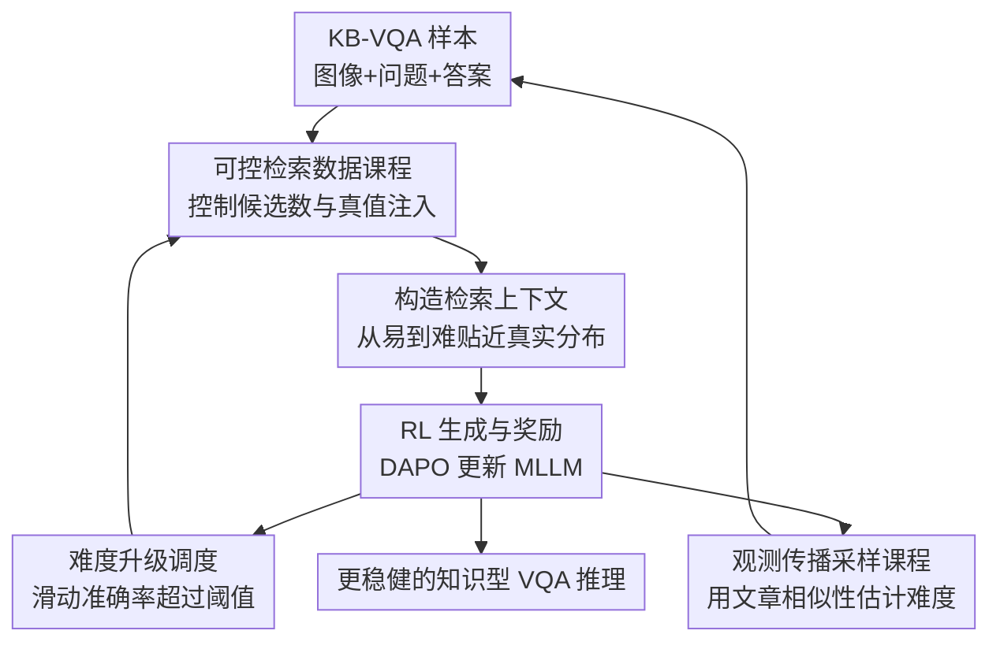

# Wiki-R1: Incentivizing Multimodal Reasoning for Knowledge-based VQA via Data and Sampling Curriculum

**会议**: ICLR2026  
**OpenReview**: [https://openreview.net/forum?id=TH1Tgbjkm7](https://openreview.net/forum?id=TH1Tgbjkm7)  
**代码**: 待确认  
**领域**: VLM推理  
**关键词**: 知识型VQA, 多模态推理, 课程强化学习, 检索增强生成, 观测传播

## 一句话总结
Wiki-R1 针对知识型 VQA 中“检索噪声大、奖励稀疏、RL 学不到推理”的问题，用可控检索难度生成从易到难的数据课程，再用观测传播挑出最有训练信号的样本，让 Qwen2.5-VL 在 Encyclopedic VQA 和 InfoSeek 上刷新检索增强 KB-VQA 结果。

## 研究背景与动机
**领域现状**：知识型视觉问答（KB-VQA）要求模型不只看图回答，还要把图像中的实体、文本问题和外部知识库里的百科信息连起来。近年的主流范式是 Retrieval-Augmented Generation（RAG）：先从 Wikipedia 这类知识库里检索相关图文条目，再把检索结果连同图像和问题交给多模态大语言模型生成答案。

**现有痛点**：这个范式的难点不在“能不能接上检索器”，而在检索结果往往很脏。图像实体可能只召回到相似但错误的页面，文本检索可能抽到和问题无关的段落，知识库本身又是百科式、结构化、长尾分布的内容。直接 SFT 能让模型记住训练实例上的证据格式，但面对错误检索或未见问题时，模型仍容易把噪声当证据，或者在没有完整证据时给出不稳答案。

**核心矛盾**：强化学习本来适合把“答对得 1、答错得 0”的任务奖励转成推理能力，但 KB-VQA 的初始分布太难。作者把 DAPO 直接用于 KB-VQA 后发现，超过 80% 样本在训练中是 zero-advantage，训练准确率长期只有约 10%。也就是说，模型不是“缺一点优化”，而是大量样本要么全错、要么不给梯度，RL 更新看不到有区分度的学习信号。

**本文目标**：Wiki-R1 要解决三个子问题：第一，怎么把真实 KB-VQA 的难分布拆成模型能逐步跨过去的训练分布；第二，怎么在 RL 过程中动态判断模型什么时候该接触更难检索噪声；第三，怎么在奖励极稀疏时估计样本难度，避免采样器只重复已见样本或随机撞运气。

**切入角度**：作者的关键观察是，检索噪声是造成分布差距和稀疏奖励的重要来源。若把 ground-truth Wikipedia 条目显式放进检索结果，DAPO 的 zero-gradient 和低准确率都会缓解。因此，与其在固定数据上做课程选择，不如直接操控检索器，让训练样本的难度从“只给正确证据”逐步过渡到“真实推理时不保证正确证据”。

**核心 idea**：Wiki-R1 用“数据课程 + 采样课程”共同塑造 RL 分布：前者通过控制检索候选数和是否强制包含真值条目来生成不同难度，后者用观测奖励和知识文章相似性传播估计未观测样本难度，从而持续采样最可能产生非零 advantage 的训练样本。

## 方法详解

### 整体框架
Wiki-R1 的输入是一批 KB-VQA 训练样本，每个样本包含问题 $q$、图像 $I_q$、答案 $y$，外部知识库 $B$ 则由 Wikipedia 文章和对应视觉内容组成。框架先根据当前 gap level 修改检索结果，构造某一难度的检索上下文，再让 MLLM 采样答案、计算二值奖励、用 DAPO 这类 RL 算法更新策略；与此同时，系统根据滑动窗口准确率决定是否升级检索难度，并用观测传播把少量已见奖励扩散到未见样本，反过来指导下一轮采样。

这套流程的核心不是换一个更强检索器，而是把“检索难度”当成训练分布控制旋钮。最容易的分布只给 ground-truth snippet，模型先学会读正确百科证据；中间分布逐步加入噪声候选；最难分布取消真值注入，让训练条件贴近真实推理。采样课程则保证模型主要训练在“有挑战但还可能答对”的样本上，而不是被全错样本淹没。

### 关键设计
**1. 可控检索数据课程：把 KB-VQA 的真实难分布拆成可攀爬的台阶**

直接在真实检索结果上做 RL 时，模型一开始常常既看不懂百科证据，也无法从噪声里分辨相关信息，导致二值奖励大面积为 0。Wiki-R1 把这个问题转成检索分布控制：定义离散 gap level $g \in \{0,1,\ldots,G\}$，每个等级对应一个检索修改函数 $\phi_g(k,\gamma)$。其中 $k$ 是返回候选数，$\gamma$ 表示是否强制把 ground-truth snippet 放进检索结果。

最容易的 $g=0$ 设为 $k=1, \gamma=1$，模型只看到正确证据，训练目标更像“读懂百科段落并回答”。中间等级保持 $\gamma=1$，同时把 $k$ 增大到当前 gap level，让正确证据旁边出现越来越多干扰项。最难的 $g=G$ 则设为 $\gamma=0, k=G-1$，检索器不再保证真值条目出现，训练分布和推理时的 noisy retrieval 对齐。这个设计很具体地对应了 KB-VQA 的主要难点：不是抽象地从简单题到难题，而是沿着“正确证据是否可见、噪声候选有多少”这条轴逐步增加难度。

**2. 基于训练准确率的 gap 调度：只在模型掌握当前检索条件后加噪声**

如果课程难度固定，太简单会停留在 teacher-forcing 式证据阅读，太难又回到 zero-advantage 的老问题。Wiki-R1 因此维护最近 $w$ 个样本的滑动窗口奖励，把平均训练准确率作为当前分布是否被模型掌握的信号。当窗口均值超过阈值 $\tau$ 时，系统执行 $g \leftarrow g+1$，并清空历史观测，重新在更难的检索分布上积累信号。

论文默认使用 $w=300$、$\tau=0.55$、最大 gap $G=6$。这个阈值的含义很直观：模型不需要在当前等级接近满分才升级，否则会过拟合容易分布；但也不能在刚有一点进展时立刻升级，否则训练会快速坠回 sparse reward。附录的敏感性分析显示，$\tau$ 在有效区间内变化时最终性能相近，说明课程调度不依赖非常脆弱的超参搜索。

**3. 围绕 0.5 准确率的采样课程：优先挑会产生梯度的样本**

数据课程能生成不同难度，但生成出来的样本未必真的匹配预期。有些样本即使在低 gap 下也很难，有些样本在高 gap 下仍很容易。Wiki-R1 的采样课程把“样本是否有训练价值”放在 RL 更新角度衡量：已有研究和本文实验都指出，训练准确率接近 0.5 的样本最可能带来有效 advantage，因为模型对它们既不是完全不会，也不是已经稳定答对。

因此，采样分布 $\mu$ 不再是均匀从训练集里抽样，而是围绕历史估计准确率 0.5 的高斯分布选择样本。直观地说，系统会避开两类低效样本：一类是当前模型几乎必错、只会产生全 0 奖励的样本；另一类是模型已经很熟、多个 rollout 都答对的样本。这样做的目标不是追求训练集平均难度，而是最大化每个 batch 中的有效 RL 信号。

**4. 观测传播：用知识文章相似性把稀疏奖励扩散到未见样本**

采样课程的难点在于样本级准确率本身很稀疏。RL 每轮只观测少量样本的 rollout 奖励，若只相信已观测样本，采样器会反复抽同一小撮数据；若对未观测样本全当未知，又会退化成随机采样。Wiki-R1 用 label propagation 解决这个信息稀缺问题：把每个 VQA 样本看成图中的节点，边权来自其关联 Wikipedia 文章之间的文本相似性，默认用 TF-IDF 构图并为每个节点保留 top-100 近邻。

给定观测奖励向量 $A$ 和传播图 $K$，算法先对 $K$ 做行归一化，再迭代更新 $A_{new}=\alpha K A_{pred} + (1-\alpha)A$，直到收敛或达到最大迭代数。这个公式的含义是，未见样本的难度可以从“百科文章语义接近的已见样本”那里借信号，同时保留真实观测奖励不被完全冲淡。论文默认 $\alpha=0.8$、最大迭代 $T=10$、收敛阈值 $\epsilon=10^{-4}$。这一步让采样课程真正能覆盖大训练集，而不是只在已经跑过 reward 的小集合里打转。

### 一个完整示例
假设训练集中有一个关于鸟类图片的 KB-VQA 样本，问题问“图中这种鸟主要分布在哪个地区？”，答案需要从对应 Wikipedia 文章中找到。普通 RAG 训练可能直接返回 6 个视觉相似鸟类页面，其中正确页面不一定排在前面，模型一开始读到这些噪声后多半答错，RL 只能得到 0。

在 Wiki-R1 的早期阶段，$g=0$ 时检索上下文只包含 ground-truth snippet，模型先学会把图像实体、问题中的“分布地区”和百科段落里的 geographic range 对齐。滑动窗口准确率超过阈值后，系统进入中间 gap，例如 $k=3, \gamma=1$，上下文里会有正确页面加两个相似鸟类页面；模型必须学会过滤不匹配实体的段落。到最高 gap 时，检索器不再强制放入正确页面，模型面对的就是推理时会遇到的真实噪声。

与此同时，若另一个样本也关联到相近的鸟类或同一类生物百科文章，即使它尚未被 RL rollout 观测过，观测传播也会根据文章相似性给它一个预估准确率。如果这个预估值接近 0.5，它会被优先抽到下一批；如果预估太低，系统会等模型能力提升后再让它进入训练。这样，数据难度和采样难度形成闭环。

### 损失函数 / 训练策略
Wiki-R1 在训练目标上沿用 post-training RL 设置。对样本 $(q,I_q,y)$，检索修改函数 $\phi$ 产生上下文 $S_\phi$，策略模型 $\pi_\theta$ 采样答案 $\hat{y}$，奖励函数 $r(\hat{y},y)$ 是规则二值信号：答案完全匹配 ground truth 得 1，否则得 0。论文把梯度写成

$$
\nabla_\theta J(\pi_\theta,\mu,\phi)=\mathbb{E}_{(q,I_q,y)\sim\mu}\mathbb{E}_{\hat{y}\sim\pi_\theta(\cdot|q,I_q,S_\phi)}[\nabla_\theta \log \pi_\theta(\hat{y}|q,I_q,S_\phi) r(\hat{y},y)].
$$

这里真正新增的是 $\mu$ 和 $\phi$ 的课程控制：$\phi$ 决定检索上下文的难度，$\mu$ 决定下一批训练样本来自哪些难度区域。实现上，作者基于 VERL 框架和 DAPO 算法训练 Qwen2.5-VL 3B/7B；每个样本 rollout 数为 4，学习率为 $1\times10^{-6}$。训练集从 Encyclopedic VQA 和 InfoSeek 各采 20k 个实体均衡样本，总计 40k，3B 训练约 9 小时，7B 训练约 12 小时，均使用 4 张 A100。

检索系统由视觉和文本两路组成：视觉侧用 EVA-CLIP 8B 计算查询图和知识库图像的相似度，文本侧用 ColBERT V2 从文章 chunk 中抽取与问题相关的段落。最终检索分数为 $s_r=\lambda V+(1-\lambda)T$，其中 $V$ 是视觉相似度，$T$ 是文本相关性；由于两者尺度不同，$\lambda$ 在 EVQA 和 InfoSeek 上分别取 0.985 和 0.997。

## 实验关键数据

### 主实验
论文主要在 Encyclopedic VQA 和 InfoSeek 上评估 KB-VQA 表现，并额外在 ViQuAE 上做零样本迁移。主结果里最重要的对比是：Wiki-R1 使用同一个视觉+文本检索系统，在两个 benchmark 上都超过了以前依赖不同检索模式的 RAG 方法。

| 数据集 / 划分 | 指标 | Wiki-R1 7B | 之前最好结果 | 提升 |
|--------|------|------|----------|------|
| Encyclopedic VQA Overall | Accuracy / BEM | 37.1 | ReflectiVA 35.5 | +1.6 |
| Encyclopedic VQA Single-hop | Accuracy / BEM | 41.0 | ReflectiVA 35.5 | +5.5 |
| InfoSeek Overall | Accuracy | 44.1 | ReflectiVA 40.1 | +4.0 |
| InfoSeek Unseen-Q | Accuracy | 47.8 | ReflectiVA 40.4 | +7.4 |
| InfoSeek Unseen-E | Accuracy | 42.3 | ReflectiVA 39.8 | +2.5 |
| 两数据集平均 | Accuracy | 40.6 | ReflectiVA 34.7 | +5.9 |

在 ViQuAE 零样本迁移上，Wiki-R1 的提升更明显。它不是针对 ViQuAE 训练的模型，却超过了既有 MLLM baseline，甚至超过了阅读理解（RC）semi-oracle 配置，说明课程 RL 学到的并非只适配某个固定 benchmark 的检索格式。

| 方法 | F1 | Exact Match | 说明 |
|------|---------|------|------|
| RC Few-shot semi-oracle | 44.10 | 40.32 | 给定较强半 oracle 条件 |
| LLaVA-v1.5 | 15.1 | 26.6 | 通用 MLLM baseline |
| Wiki-LLaVA (InfoSeek) | 12.7 | 21.8 | KB-VQA SFT/RAG baseline |
| ReflectiVA | 23.2 | 38.1 | 自反 token KB-VQA 方法 |
| Wiki-R1 3B | 53.8 | 48.6 | 本文 3B |
| Wiki-R1 7B | 55.6 | 50.3 | 本文 7B |

### 消融实验
消融在 Qwen2.5-VL 3B 上逐步加入组件。可以看到，朴素 SFT 提升有限，DAPO 本身已经强于 SFT；数据课程能进一步提升，尤其是 EVQA；但单独加采样课程反而退步，只有配合观测传播后才恢复并超过各个中间版本。

| 配置 | Data Cur. | Samp. Cur. | Obs. Prop. | EVQA Overall | InfoSeek Overall | 说明 |
|------|------|------|------|------|------|------|
| Zero-shot | - | - | - | 18.8 | 19.6 | 未做任务适配 |
| SFT | - | - | - | 25.1 | 29.5 | 监督微调有提升但有限 |
| DAPO | × | × | × | 31.4 | 41.5 | 直接 RL 明显优于 SFT |
| DAPO + Data Cur. | ✓ | × | × | 34.5 | 43.0 | 可控检索课程提升两个数据集 |
| Data Cur. + Samp. Cur. | ✓ | ✓ | × | 32.1 | 40.0 | 观测稀疏导致采样不稳 |
| Wiki-R1 Full | ✓ | ✓ | ✓ | 35.9 | 42.2 | 观测传播让采样课程有效 |

论文还报告了 oracle Wikipedia entity 设置：当直接给定 ground-truth 实体页面、只在页面内检索 passage 时，Wiki-R1 7B 在 EVQA Single-hop 达到 69.2，在 InfoSeek Overall 达到 68.2。这个实验说明模型本身已经能较好利用正确知识，真实设置下的主要瓶颈确实来自实体级检索噪声。

| 方法 | LLM | EVQA Single-hop | InfoSeek Unseen-Q | InfoSeek Unseen-E | InfoSeek Overall |
|------|------|------|------|------|------|
| Wiki-LLaVA | LLaMA-3.1-8B | 46.8 | 51.2 | 50.6 | 50.9 |
| ReflectiVA | LLaMA-3.1-8B | 75.2 | 57.8 | 57.4 | 57.6 |
| Wiki-R1 3B | Qwen2.5-VL-3B | 68.5 | 64.0 | 65.9 | 65.3 |
| Wiki-R1 7B | Qwen2.5-VL-7B | 69.2 | 65.5 | 69.5 | 68.2 |

### 关键发现
- 数据课程是稳定 RL 的第一道门槛。DAPO 直接训练已经能带来收益，但在 EVQA 这种检索更噪的集合上后期会退化；逐步增加检索噪声后，Wiki-R1 的最佳性能出现在课程达到最高难度时，和真实推理条件更一致。
- 采样课程不能孤立使用。只按已观测准确率采样会导致信息不足，表现从 EVQA 34.5 / InfoSeek 43.0 掉到 32.1 / 40.0；加入观测传播后，采样器才有足够的未见样本难度估计，最终回到 35.9 / 42.2。
- Wiki-R1 的数据效率较高。相比 Wiki-LLaVA 约 90 万级训练样本、ReflectiVA 数百万级训练样本，Wiki-R1 每个 benchmark 只采 20k 样本，总训练代价为 36 A100 GPU hours（3B）或 48 A100 GPU hours（7B），仍获得更高结果。
- 检索召回仍是上限因素。附录中 Wiki-R1 的视觉+文本检索在 EVQA R@1 为 16.7、R@20 为 47.5，在 InfoSeek R@1 为 46.9、R@20 为 77.2；EVQA 的实体召回明显更难，也解释了为什么该数据集总体准确率低于 oracle entity 设置。

## 亮点与洞察
- Wiki-R1 最巧妙的地方是把“课程学习”落到了 KB-VQA 最核心的噪声来源上。它不是按题目长度或人工难度标签排序，而是直接操控检索上下文中 ground-truth 是否存在、噪声候选有多少，因此课程轴和真实错误来源高度一致。
- 观测传播是一个很实用的 RL 工程设计。二值 reward 场景里样本难度估计常常不够用，本文用 Wikipedia 文章相似性把已观测 reward 扩散出去，虽然方法简单，却正好利用了 KB-VQA 样本天然绑定知识实体这一结构。
- 论文把“生成课程数据”和“选择课程样本”分开建模，这一点值得迁移。很多 RAG+RL 任务也有类似问题：可以通过控制检索深度、噪声比例、工具返回质量来生成难度，再用 reward history 选择最有学习信号的样本。
- 实验里的反例很有价值：单独加 curriculum sampling 会变差。这提醒后续做 RL 数据选择时，不能只设计一个漂亮的难度分布，还要问“难度估计从哪里来、未见样本怎么估”。
- 对知识型 VQA 来说，本文证明了提升 generator 推理能力和提升 retriever 并不是二选一。即便检索系统不专门 fine-tune，只要训练时让模型系统性经历噪声检索，它也能学会更稳健地利用不完美证据。

## 局限与展望
- 论文承认，操控检索器只是一种间接的数据生成控制方式。它能改变候选数和真值注入，但无法完全控制每个问题的语义难度、证据冲突程度或噪声类型，因此“gap level”只是近似难度。
- 奖励函数使用 exact match 二值信号，简单稳定，但对别名、同义表达、多跳解释质量不够宽容。KB-VQA 里的答案常有实体别名或描述性短语，未来可以引入更细粒度的答案等价判断或引用证据一致性奖励。
- 课程主要围绕检索噪声展开，对视觉识别错误本身的控制较少。如果图像实体识别就错了，正确 Wikipedia 文章也未必能弥补，后续可以把视觉实体置信度或候选实体混淆度也纳入课程。
- 观测传播依赖知识文章相似性，适合 Wikipedia 实体密集任务，但迁移到开放网页、非实体型知识或动态图谱时，如何构图会更复杂。论文验证了 TF-IDF 和 Sentence Transformer 两种相似度，但还没有系统讨论图质量很差时的鲁棒性。
- 实验集中在 KB-VQA 和 ViQuAE 迁移，尚不清楚 Wiki-R1 对更长链条的多跳检索、多图像问答或带工具调用的多模态 agent 任务是否同样有效。不过它给出了一个清晰方向：先定义可控分布差距，再让 RL 在分布差距上逐步爬坡。

## 相关工作与启发
- **vs Wiki-LLaVA**: Wiki-LLaVA 通过层次化检索和监督训练把外部多模态知识接入 MLLM，重点是让模型学会使用检索到的知识。Wiki-R1 则更关注 post-training RL 阶段如何在噪声检索下形成稳健推理能力，训练数据规模更小，且在 EVQA/InfoSeek 上整体更强。
- **vs ReflectiVA**: ReflectiVA 用 self-reflective tokens 判断检索内容可靠性，属于在模型内部加入可靠性判断机制。Wiki-R1 不显式增加反思 token，而是通过课程 RL 让模型经历从正确证据到 noisy retrieval 的过程，优势是训练目标更直接对齐最终答案奖励，劣势是仍依赖大量 rollout 和课程调度。
- **vs EchoSight / retriever-centric 方法**: EchoSight 等方法更多从检索质量入手，不同 benchmark 上常需要不同 retrieval mode。Wiki-R1 使用视觉+文本融合检索作为基础，但主要贡献在 generator 侧的训练课程，说明在检索不完美时也可以通过训练分布设计提升下游鲁棒性。
- **vs ADARFT / DUMP 等 RL curriculum**: 这些方法通常在固定数据分布上根据 reward history 调整样本或分布权重。Wiki-R1 更进一步，把数据生成过程本身纳入课程，通过检索修改函数产生不同 gap level；同时用观测传播补足 sparse reward 下的难度估计。
- **对后续研究的启发**: 在任何 RAG 任务里，如果直接 RL 出现大量 zero-advantage，可能不该只调 PPO/GRPO/DAPO 超参，而应先检查训练分布是否离预训练能力太远。把检索质量、证据完整度、上下文噪声比例做成课程，往往比盲目增大训练数据更有效。

## 评分
- 新颖性: ⭐⭐⭐⭐☆ 把可控检索生成和观测传播采样结合到 KB-VQA RL 中，问题抓得很准，组件本身朴素但组合有新意。
- 实验充分度: ⭐⭐⭐⭐☆ 覆盖 EVQA、InfoSeek、ViQuAE、oracle entity、消融、训练动态和超参敏感性，仍可补充更多复杂多跳或开放域场景。
- 写作质量: ⭐⭐⭐⭐☆ 主线清楚，动机实验很有说服力；部分算法细节如采样高斯分布的精确定义和难度分数更新可以写得更形式化。
- 价值: ⭐⭐⭐⭐⭐ 对 RAG+RL 和多模态知识推理都有直接参考价值，尤其适合奖励稀疏、检索噪声大的后训练场景。

<!-- RELATED:START -->

## 相关论文

- [\[ICLR 2026\] STVG-R1: Incentivizing Instance-Level Reasoning and Grounding in Videos via Reinforcement Learning](stvg-r1_incentivizing_instance-level_reasoning_and_grounding_in_videos_via_reinf.md)
- [\[CVPR 2026\] Incentivizing Versatile Video Reasoning in MLLMs via Data-Efficient Reinforcement Learning](../../CVPR2026/vlm_reasoning/incentivizing_versatile_video_reasoning_in_mllms_via_data-efficient_reinforcemen.md)
- [\[ICLR 2026\] SketchThinker-R1: Towards Efficient Sketch-Style Reasoning in Large Multimodal Models](sketchthinker-r1_towards_efficient_sketch-style_reasoning_in_large_multimodal_mo.md)
- [\[ICLR 2026\] ReWatch-R1: Boosting Complex Video Reasoning in Large Vision-Language Models through Agentic Data Synthesis](rewatch-r1_boosting_complex_video_reasoning_in_large_vision-language_models_thro.md)
- [\[ICLR 2026\] Perception-R1: Advancing Multimodal Reasoning Capabilities of MLLMs via Visual Perception Reward](perception-r1_advancing_multimodal_reasoning_capabilities_of_mllms_via_visual_pe.md)

<!-- RELATED:END -->
