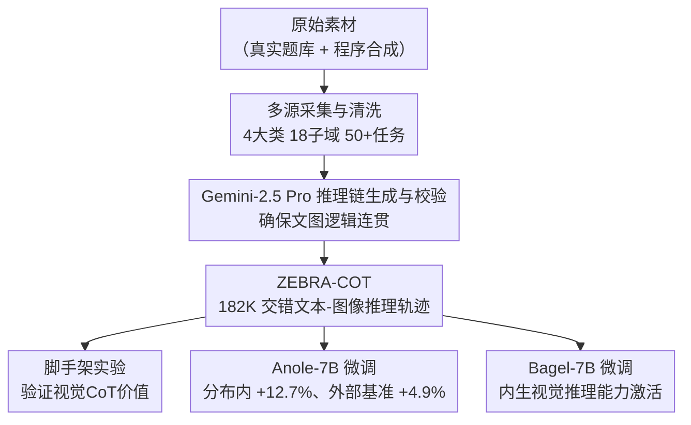

# Zebra-CoT: A Dataset for Interleaved Vision-Language Reasoning

**会议**: ICLR 2026  
**OpenReview**: [https://openreview.net/forum?id=c6XIVI3TiQ](https://openreview.net/forum?id=c6XIVI3TiQ)  
**代码**: https://github.com/multimodal-reasoning-lab/Bagel-Zebra-CoT  
**领域**: 多模态VLM  
**关键词**: 视觉思维链、交错文本图像推理、多模态数据集、视觉CoT、VLM推理

## 一句话总结
构建了首个大规模多样化交错文本-图像推理数据集 ZEBRA-COT（182K 条推理轨迹，覆盖 18 个领域），通过脚手架实验证明视觉 CoT 对前沿模型有高达 +43% 的提升潜力，并通过微调让 Anole-7B 和 Bagel-7B 获得内生视觉推理能力。

## 研究背景与动机

**领域现状**：人类在解决几何、物理等复杂问题时，天然会借助画图、手绘草图等视觉辅助手段。视觉思维链（Visual Chain of Thought，Visual CoT）旨在让多模态模型同样在推理过程中生成和利用视觉中间步骤，而非仅输出纯文本推理链。近期前沿 VLM（GPT-5、Gemini、Claude）已能处理多模态输入，但推理轨迹仍几乎全是文字。

**现有痛点**：现有方法有两条路：一是"视觉编程"，让模型调用外部 Python 工具来生成草图；二是"内生视觉推理"，让模型直接在思考过程中输出视觉 token。前者依赖外部工具链，难以端到端训练；后者由于缺乏高质量训练数据，始终只停留在合成迷宫等单一任务的专用小模型阶段。现有交错数据集（OmniCorpus、MINT-1T）是大规模网页爬取的图文语料，图文语义对齐弱、没有推理结构，无法用于训练视觉推理能力；仅有的开源交错推理数据集 Visual-CoT 也只覆盖"视觉搜索"单一任务。

**核心矛盾**：想让模型学会内生视觉推理，就需要"逻辑连贯、文图高度对齐、任务多样"的交错推理训练数据——而这恰恰是现有数据集最欠缺的。没有数据，强化学习路径也走不通：off-the-shelf visual CoT 质量太差，无法提供可靠的 RL 初始化。

**核心 idea**：精心策划一个兼顾真实场景采集与合成生成的数据管道，以 Gemini-2.5 Pro 作为"推理链生成与质检"引擎，将科学推理、2D/3D 视觉推理、视觉逻辑游戏等多领域原始素材统一转化为结构化的文本-图像交错推理轨迹，形成首个通用视觉 CoT 训练数据集。

## 方法详解

### 整体框架

ZEBRA-COT 是一个数据集构建与验证项目，核心产出是 182,384 条结构化交错推理轨迹，统一格式为：

$$\text{<question>} \to \text{<text}_1\text{>} \to \text{<image}_1\text{>} \to \text{<text}_2\text{>} \to \text{<image}_2\text{>} \to \cdots \to \text{<answer>}$$

每条轨迹中，文字步骤阐述推理逻辑，视觉步骤生成辅助图像（如几何辅助线、棋盘状态、机器人动作帧），二者交替呈现、高度互补。整个项目围绕三个支柱展开：多源数据构建流水线、视觉 CoT 价值的脚手架验证、以及在两个模型上的微调实验。

### 关键设计

**1. 四大类多域构建策略：真实采集与合成生成并举**

数据覆盖四大类任务，每类采用针对性的构建策略。**科学推理**（几何、物理、化学、图算法、竞程）：从开放授权教材和数据集中提取原始题目，用 Gemini-2.5 Pro 解析成结构化视觉 CoT；竞赛编程题则构建了基于 GPT-4.1 的 agent，产出带可视化步骤的完整解题轨迹。**2D 视觉推理**（视觉搜索、拼图）：改编 Visual-CoT 数据集，引入"画框"和"区域缩放"两种视觉辅助形式；拼图任务从 ImageNet 裁图生成，视觉 CoT 以逐块填补或整体复原的方式呈现。**3D 视觉推理**（具身规划、机器人规划、多跳物体计数）：将 ALFRED 和 RoboMIND 基准重新格式化为图像目标条件规划任务，模型需根据初始状态和目标状态图像生成高层动作计划；多跳计数基于 CLEVR 风格设计，场景历经多步增删物体，要求模型逐步视觉化每次变换。**视觉逻辑与策略游戏**（国际象棋、跳棋、四子棋、迷宫、Tetris、ARC-AGI）：将棋局搜索和反事实推演过程渲染为图像序列，使模型学会在视觉空间直接进行长程规划，而非把棋盘符号化成文字后丢失空间结构。

这种"真实+合成"混合策略的核心价值在于：真实题目保证任务难度和分布真实性，合成数据（程序渲染+Gemini 填充）保证覆盖度和视觉 CoT 逻辑链的完整性。Gemini-2.5 Pro 同时承担降噪、格式化、逻辑连贯性校验三重角色，是保证最终数据质量的核心引擎。

**2. 脚手架实验：量化视觉 CoT 的独立贡献**

为了证明视觉 CoT 的真实价值（而非只是"数据更多"带来的提升），论文设计了一个精巧的脚手架实验：对前沿模型（GPT-5、Claude Sonnet 4、Gemini 2.5 Pro）以三种模式提问——仅问题（Q）、问题+第一轮文图推理步（1MT）、问题+前两轮文图推理步（2MT）。即使给出前两步作为上下文，模型仍需自主完成余下大量推理（部分题目多达 20 张中间图），因此提供的是"引导"而非"答案泄露"。

论文还进行了关键消融：去掉推理链中的视觉步骤仅保留文本，发现文本 CoT 的提升远小于完整视觉 CoT，部分任务甚至出现性能下降——因为这些任务的文字链中大量引用了视觉中间步骤，去掉图像后文字链在逻辑上变得不完整，模型反而被误导。这直接说明性能增益主要来自视觉推理本身，而非文字 CoT。

**3. Bagel-7B 内生视觉推理激活**

在 Anole-7B（原生支持交错生成）之外，论文还在 Bagel-7B（更强的图像理解基座但原生不支持交错输出）上做了更有挑战性的验证。原始 Bagel 实现不支持交错文本-图像输出，论文对训练循环做了改造：在 `<|vision start|>` token 处引入额外 loss 项，使模型学会在推理时自主切换到图像生成模式。推理时，每当遇到 `<im end>` 就采样下一个 token——若预测为 `<|vision start|>` 则无缝进入图像生成流程，整个交错生成过程持续至 `<answer>` token 才结束。

在 8×H200 上仅训练 1000 步，Bagel-Zebra-CoT 就能在分布外任务上自发生成有意义的视觉辅助步骤，表明 ZEBRA-COT 能有效激活模型的内生视觉推理能力——这正是后续 RL 微调所需要的高质量初始化。

### 训练策略

Anole-7B 在 8×H200 上全参数微调 10k 步，学习率 $1\times10^{-5}$，余弦衰减，batch size 8，最大序列长度 12288 token，推理时生成长度上限 16384。Bagel-7B 则仅训练 1000 步，学习率 $2\times10^{-5}$，采用打包序列（每个 packed 序列约 60000 token），图像最小边压缩至 512 像素（约 1024+ 视觉 token/张）。两个模型均以 `<think>...</think>` 包裹推理文本、`<answer>...</answer>` 包裹最终答案。

## 实验关键数据

**数据集规模**：182,384 条交错推理轨迹，4 大类、18 子域、50+ 任务类型；其中迷宫占 11.0%、视觉拼图占 12.0%、具身 CoT 占 12.4%为最大子域。

**前沿模型脚手架实验**（Q → 1MT → 2MT 均值）：
- GPT-5：41.98% → 52.06% → 65.10%（+23.12%）
- Claude Sonnet 4：27.61% → 42.82% → 51.89%（+24.28%）
- Gemini 2.5 Pro：24.93% → 42.47% → 52.31%（+27.38%）
- 三模型均值：31.51% → 47.99%（+16.48%）→ 56.70%（**+25.19%**）
- 迷宫任务最大提升：平均 52.59% → 96.36%（**+43.77%**）

**Anole-7B 微调**：
- 分布内测试集：4.2% → 16.9%（+12.7%，相对提升 4×）
- 7 个外部视觉推理基准均值：+4.9%，其中 VisuLogic 8.50% → 21.80%（**+13.3%**）

**与现有数据集的核心差距**：Visual-CoT 是唯一覆盖交错推理的开源数据集，但仅限视觉搜索单一任务；LLaVA-CoT、MAmmoTH-VL、R1-OneVision 等均为纯文字推理链，无法用于视觉 CoT 训练。ZEBRA-COT 首次在广度（18 子域）、深度（每条链多达 20 张中间图）、质量（Gemini-2.5 Pro 校验逻辑连贯性）三个维度上同时做到最强。

**文本 CoT 消融**：在视觉 CoT 推理链中去掉所有图像仅保留文字，性能提升显著低于完整视觉 CoT，部分任务甚至下降，直接证明图像步骤是增益的主要来源而非文字链的副产品。

## 相关工作对比

| 数据集 | 推理链模态 | 是否适合视觉CoT训练 |
|--------|-----------|-------------------|
| LLaVA-CoT | 纯文本 | 否 |
| MAmmoTH-VL | 纯文本 | 否 |
| R1-OneVision | 纯文本 | 否 |
| Visual-CoT | 图像+文本 | 有限（仅视觉搜索） |
| OmniCorpus | 无推理结构 | 否（网页噪声预训练数据） |
| **ZEBRA-COT** | **图像+文本** | **是（多样化交错视觉CoT）** |

Visual-CoT 是论文中唯一具有可比性的开源对标数据集，但它仅覆盖视觉搜索这一单一任务，且视觉辅助形式固定为画框/缩放；ZEBRA-COT 在任务多样性、推理深度（多达 20 张中间图）和领域覆盖上均有质的飞跃。MM-PhyQA 虽然引入了物理推理视觉 CoT，但未开源。CoT-VLA 面向机器人操作（动作序列），没有文字推理链，与本文定位不同。

## 局限与展望

数据集构建依赖 Gemini-2.5 Pro 作为推理链生成器，质量上限受单一专有模型制约，且部分合成数据（图算法、竞赛编程）的视觉推理链正确性难以自动验证。论文承认 Bagel-Zebra-CoT 目前尚未进行 RL 微调，只提供了强初始化；真正发挥视觉 CoT 在强化学习中的潜力还需后续工作。此外，182K 样本相较文本推理数据集仍属中等规模，探索 scaling 规律是自然的下一步方向。作者展望的最直接后续研究是：基于 Bagel-Zebra-CoT 的强初始化，用带可验证奖励的 RL（类似 RLVR）进一步提升视觉推理的一致性和正确率，让 AI 像人类草图推理一样自然地"边想边画"。

<!-- RELATED:START -->

## 相关论文

- [\[ICLR 2026\] InternSpatial: A Comprehensive Dataset for Spatial Reasoning in Vision-Language Models](internspatial_a_comprehensive_dataset_for_spatial_reasoning_in_vision-language_m.md)
- [\[CVPR 2026\] ViRC: Enhancing Visual Interleaved Mathematical CoT with Reason Chunking](../../CVPR2026/vlm_reasoning/virc_enhancing_visual_interleaved_mathematical_cot_with_reason_chunking.md)
- [\[ICLR 2026\] Synergizing Understanding and Generation with Interleaved Analyzing-Drafting Thinking](synergizing_understanding_and_generation_with_interleaved_analyzing-drafting_thi.md)
- [\[ICLR 2026\] ThinkMorph: Emergent Properties in Multimodal Interleaved Chain-of-Thought Reasoning](thinkmorph_emergent_properties_in_multimodal_interleaved_chain-of-thought_reason.md)
- [\[ICLR 2026\] VisualPRM400K: An Effective Dataset for Training Multimodal Process Reward Models](visualprm400k_an_effective_dataset_for_training_multimodal_process_reward_models.md)

<!-- RELATED:END -->
