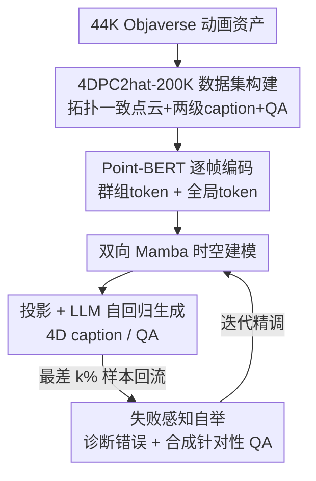

# 4DPC$^2$hat: Towards Dynamic Point Cloud Understanding with Failure-Aware Bootstrapping

**会议**: ICML 2026  
**arXiv**: [2602.03890](https://arxiv.org/abs/2602.03890)  
**代码**: 待确认  
**领域**: 3D视觉 / 多模态VLM  
**关键词**: 动态点云, 4D理解, 多模态大模型, 双向Mamba, 失败感知自举

## 一句话总结
4DPC$^2$hat 是第一个面向"动态点云序列"（4D 点云）理解的多模态大模型：作者先用拓扑一致的构建流水线把 4.4 万个动画资产做成 20 万条跨模态 QA 数据集，再用"保留群组 token + 全局 token + 双向 Mamba"的时空架构避免把一帧压成单一向量，最后用"失败感知自举"反复挖出模型答错的题、合成针对性 QA 补训，使动作理解与时序推理大幅超越把视频逐帧喂给静态 3D 模型的做法。

## 研究背景与动机
**领域现状**：点云是 3D 几何的原生、稀疏且高效的表示，近年被接入多模态大模型（MLLM），在 3D 识别、跨模态对齐、交互理解上取得进展（PointLLM、ShapeLLM、MiniGPT-3D 等）。

**现有痛点**：这些工作几乎全部停留在**静态单帧点云**——训练数据和架构都是为单帧设计的。但真实世界的感知需要理解随时间演化的点集序列（动态点云），才能刻画动作、状态转移和复杂时空交互。没有显式时序建模，现有 3D MLLM 根本不具备这种能力。

**核心矛盾**：推进 4D 点云理解卡在两件事上。其一，**缺数据**——文本与 4D 物体配对的大规模跨模态数据集极其稀缺，因为 4D 采集要求逐帧时序对齐、稳定跟踪和帧间对应，比静态采集复杂得多；现有 4D 数据集（Diffusion4D、DeformingThings4D）又只服务姿态估计/动作分类这类单模态任务，没有语言监督。其二，**时空建模难**——每帧本身就是不规则 3D 结构，还要在帧间推理持续变化的几何、拓扑和局部空间关系，必须捕捉长程时序依赖。

**本文目标**：从零造出第一个动态点云 MLLM，同时解决"没数据"和"建不动"两个子问题，并让能力在五类问答（计数/时序关系/动作/空间关系/外观）上均衡提升。

**切入角度**：动态语义本质上是**局部化**的（某个肢体在动、某个部件在变），所以不能像现有时序适配那样把一整帧聚合成单个全局 token——那会丢掉局部运动线索、模糊动作阶段。作者称这个瓶颈为"空间过度压缩（spatial over-compression）"。

**核心 idea**：用"逐帧保留多个群组 token + 一个全局 token + 双向 Mamba 线性时序建模"替代"逐帧压成单向量 + 后聚合"，再叠加一套用模型自身错误驱动的数据自举循环，把短板逐轮补齐。

## 方法详解

### 整体框架
4DPC$^2$hat 把"动画资产 → 时序一致点云序列 → 逐帧 Point-BERT 编码 → 双向 Mamba 时空建模 → 投影进 LLM → 自回归生成 caption/QA"串成一条主干，并在主干外挂一个"失败感知自举"反馈回环：模型答完一遍题后，按语义相似度挑出最差的一批，交给教师模型诊断并合成针对性 QA 回流补训。整体既是一个"造数据 + 建模型"的工程，也是一个"边训边补漏"的迭代系统。

### 关键设计

**1. 4DPC$^2$hat-200K：拓扑一致构建 + 两级描述 + 多类 QA 的数据流水线**

这一步直接补"没数据"的洞。作者从 Objaverse / Objaverse-XL 聚合超过 4.4 万个动画资产，最终得到 700K 时序有序点云帧和 200K 高质量 QA 对，是第一个**同时支持 4D captioning 与 4D QA**的资产级数据集（见数据集对比表）。难点在于"拓扑一致"：动画里顶点会动，若每帧各自重采样点云，帧间就没有点对点对应、时序也就乱了。作者的做法是**只在第一帧采样**——用 Poisson Sampling 按表面积比例铺 $N$ 个点，记录每个点落在哪个三角面（顶点索引）以及它的重心坐标；后续帧不再重采，而是用同一组重心坐标去"评估"更新后的顶点位置，把点重建出来。这样每个点在整段序列里身份不变，得到统一的 $(T,N,6)$ 表示（坐标+颜色，颜色保持一致）。再配合"动画少于 16 帧丢弃、超过 200 帧截断、等距抽 $T=16$ 帧、基于帧间几何差的运动滤除静止/异常资产"等清洗，以及拓扑发生变化的序列直接排除。语言侧用 Qwen2.5-VL 生成**两级描述**：简短描述只做整体几何与语言的粗对齐（用于编码器-LLM 的潜空间对齐），复杂描述写清运动模式、时序演化、动态状态（用于细粒度指令微调），并人工校正遮挡等错误；最后把复杂描述喂回 LLM 生成覆盖动作/计数/外观/时序关系/空间关系五类的 QA。

**2. 抗"空间过度压缩"的时空架构：群组+全局 token × 双向 Mamba**

这是模型侧的核心。作者明确指出当前时序适配的瓶颈是把一帧聚合成单个全局 token、丢掉局部运动。对策是**每帧保留多个空间群组 token 加一个全局 token**。每帧 $P_t\in\mathbb{R}^{N\times d}$ 经共享的 Point-BERT 编码器 $\mathcal{E}$，按标准 tokenization 切成 $G$ 个局部群组、每组一个可学习群组 token，再加一个聚合该帧全局上下文的全局 token，得到 $F_t=\{f_{t,1},\dots,f_{t,G},f_{t,\text{global}}\}$。把所有帧的 token 拼成序列后，用**双向 Mamba**做时空建模：相比单向 Mamba，双向版在线性复杂度下同时吃前向 $F_f$ 和后向 $F_b$ 上下文，

$$F_f=\text{SSM}_f(\sigma(\text{MLP}_f(\text{LN}_f(F)))),\quad F_b=\text{flip}[\text{SSM}_b(\sigma(\text{MLP}_b(\text{flip}[\text{LN}_b(F)])))]$$

再用一条门控支路 $F_g=\text{MLP}_1(\text{LN}_1(F))$ 把前后向融合并残差回写 $\tilde F=F+\text{MLP}_2(F_f\odot F_g+F_b\odot F_g)$。堆 $K$ 个这样的块，既能看到"动作怎么发起"，也能看到"动作怎么收尾终止"——这对判断动作阶段至关重要。增强后的 $\tilde F$ 经投影模块 $f_{\text{proj}}$ 映射到 LLM 隐空间维度 $c'$，得到点 token $F_{\text{proj}}\in\mathbb{R}^{T\times(G+1)\times c'}$，与文本 token 拼接后送进 decoder-only LLM 自回归生成。用 Mamba 而非自注意力，是为了在长序列（$T\times(G+1)$ 个 token）上保住线性复杂度。

**3. 失败感知自举学习：用模型自己的错误当训练信号**

作者观察到：用均匀权重数据做 SFT，并不能让各类时空推理能力均衡提升——总有某些题型拖后腿。于是把"模型失败"当作诊断信号做三步循环。**失败识别与筛选**：SFT 后的模型 $\mathcal{M}$ 在参考集 $\mathcal{D}$ 上大规模推理出 $\hat y=\mathcal{M}(P,q)$，用预训练语义编码器 $\phi$ 算预测与标准答案的余弦相似度 $S(y,\hat y)=\frac{\phi(y)\cdot\phi(\hat y)}{|\phi(y)||\phi(\hat y)|}$，按 $S$ 排序取最差的 $k\%$ 作为失败集 $\mathcal{D}_{\text{fail}}$（这里模型有明显时空误解）。**针对性纠错合成**：对每个失败样本，用高能力教师模型 Qwen-3，按一个诊断 prompt 把错误归到 **12 类预定义错误分类**之一，并生成一条**直接戳该短板**的新 QA 对 $(q',a')$。**迭代精调**：把这些纠错样本喂回去继续微调，反复进行。关键在于它是"哪儿弱补哪儿"，而不是无差别数据增广——论文称在相当监督预算下，这种定向补训比朴素增广收益大得多。

### 损失函数 / 训练策略
训练分三阶段课程，逐步从"对齐"走到"补漏"：

- **时序-语言特征对齐**：冻结点云编码器和 LLM，只训双向 Mamba 模块和投影器，用 11K 条简短动态指令做分布级粗对齐，建立基础时序感知。
- **综合指令微调**：联合微调投影器、双向 Mamba 和 LLM 主干，用 44K 动态序列 + 145K QA + 44K 详细描述，让语言回复扎根在演化的几何上下文里；点云编码器仍冻结以保几何先验稳定。
- **失败感知精修**：施加上面的自举策略，为防过拟合与灾难性遗忘，冻结编码器和 LLM，只在 12K 定向样本上精修 Mamba 和投影器，该过程**迭代两次**。

## 实验关键数据

评测混用传统语言指标（BLEU-1 / ROUGE-L / METEOR）、嵌入语义相似度（Sentence-BERT / SimCSE）和 GPT-4 评判；4,000 个物体 ID 作测试集，GPT-4 因成本只在随机 200 个上评。

### 主实验
4D 物体描述（captioning）上，4DPC$^2$hat 全面碾压把每帧当静态输入再用 Qwen3 做时序汇总的 3D-aware 基线：

| 模型 | 输入 | GPT-4 | S-BERT | SimCSE | BLEU-1 | ROUGE-L | METEOR |
|------|------|------|--------|--------|--------|---------|--------|
| PointLLM-13B | 3D+时序汇总 | 49.53 | 51.35 | 49.07 | 16.35 | 15.21 | 12.58 |
| ShapeLLM-13B | 3D+时序汇总 | 53.34 | 57.44 | 62.80 | 20.83 | 20.77 | 15.44 |
| MiniGPT-3D | 3D+时序汇总 | 54.70 | 58.60 | 58.58 | 20.47 | 20.41 | 15.46 |
| **4DPC$^2$hat** | **3D 点云序列** | **73.27** | **79.08** | **82.03** | **38.40** | **43.31** | **36.29** |

GPT-4 比最强基线 MiniGPT-3D 高 18.57 分，说明"逐帧处理 + 后聚合"无法生成连贯且时序扎实的描述。

4D 物体问答（QA，GPT-4 为总分，分项用 SimCSE）上五类全面领先：

| 模型 | GPT-4 | 计数 | 时序关系 | 动作 | 空间关系 | 外观 |
|------|------|------|----------|------|----------|------|
| ShapeLLM-13B | 56.17 | 56.95 | 60.48 | 52.32 | 61.64 | 52.38 |
| MiniGPT-3D | 59.08 | 57.29 | 60.61 | 64.83 | 61.19 | 51.35 |
| **4DPC$^2$hat** | **78.01** | **77.03** | **76.52** | **76.98** | **76.46** | **76.11** |

### 与 2D 视频 MLLM 对比
在 4D-Bench 上以相同物体的点云序列为输入直接 PK 2D 视频 MLLM，显式 4D 几何在动作/计数上优势最明显：

| 任务 | 之前(2D 视频) | 4DPC$^2$hat |
|------|--------------|-------------|
| 4D 描述 GPT-eval（/5） | 3.258 | 3.662 |
| 动作准确率 | 60.75% | 74.30% |
| 物体计数 | 54.33% | 66.14% |

### 关键发现
- **直接建模 4D 远胜逐帧聚合**：静态 3D 模型即便配上时序汇总器，在 captioning 上仍落后近 20 个 GPT-4 分——碎片化的帧间线索拼不出动作级语义。
- **保留局部 token 是关键**：作者把"空间过度压缩"定位为瓶颈，群组 token + 双向 Mamba 正是针对它，QA 动作分项达到 76.98（基线多在 50–65）。
- **定向自举 > 朴素增广**：相同监督预算下，按 12 类错误诊断合成的针对性 QA 比无差别加数据收益大得多，且把能力提均衡（五类分项都压到 76 上下，不再偏科）。

## 亮点与洞察
- **"只在首帧采样 + 重心坐标重建"**是个干净的拓扑一致 trick：一次采样定下点的身份，后续帧靠重心坐标跟着网格变形走，天然保证帧间点对点对应，避免逐帧重采带来的时序错乱。可迁移到任何需要稳定 4D 对应的网格动画处理。
- **把"空间过度压缩"显式命名并对症下药**，比泛泛说"建模时序"更有指导性——保留 $G$ 个群组 token 让局部运动不被抹平，是这篇能在动作题大涨的根因。
- **用模型自身错误闭环造数据**：语义相似度排序挑最差 $k\%$ + 教师按 12 类错误归因合成针对性 QA，是一种很可复用的"哪弱补哪"数据飞轮，思路可迁移到任何被偏科困扰的指令微调。

## 局限与展望
- **数据来源受限于合成动画资产**（Objaverse 系列），与真实传感器采集的动态点云（带噪声、缺失、非刚性形变）存在域差，泛化到真实场景仍待验证。
- **强依赖拓扑不变假设**：明确排除了拓扑发生变化的序列（如撕裂、合并），对这类真实动态无能为力。
- **自举依赖教师模型与语义编码器**：12 类错误分类和 Qwen-3 教师的质量直接决定补训方向，错误归因若有偏会把模型带偏；$k\%$ 阈值与迭代次数（这里固定两次）的敏感性论文未充分展开。

## 相关工作与启发
- **vs PointLLM / ShapeLLM / MiniGPT-3D**：它们是静态 3D MLLM，本文把它们逐帧处理 + 时序汇总当基线，差距说明静态架构补不出时序；本文优势是原生序列建模，劣势是工程更重、依赖 4D 数据集。
- **vs 2D 视频 MLLM**：视频 MLLM 靠时序 2D token，受几何歧义/遮挡/跨视角不一致困扰；本文用显式 4D 几何，动作与计数大幅领先，但放弃了 2D 纹理外观的丰富先验。
- **vs 单向 Mamba**：本文用双向 Mamba 同时抓动作的发起与终止，比单向更适合判断动作阶段，且保住线性复杂度。

## 评分
- 新颖性: ⭐⭐⭐⭐⭐ 第一个动态点云 MLLM + 第一个 4D captioning/QA 联合数据集，方向开拓性强
- 实验充分度: ⭐⭐⭐⭐ 对比静态 3D 与 2D 视频两条线、五类 QA 分项齐全，但缺组件级消融表
- 写作质量: ⭐⭐⭐⭐ "空间过度压缩"等问题定位清晰，流水线讲得明白
- 价值: ⭐⭐⭐⭐⭐ 数据集 + 架构 + 自举三件套为 4D 点云理解打了地基，社区可复用

<!-- RELATED:START -->

## 相关论文

- [\[CVPR 2026\] Deformation-based In-Context Learning for Point Cloud Understanding](../../CVPR2026/3d_vision/deformation-based_in-context_learning_for_point_cloud_understanding.md)
- [\[CVPR 2026\] Mamba Learns in Context: Structure-Aware Domain Generalization for Multi-Task Point Cloud Understanding](../../CVPR2026/3d_vision/mamba_learns_in_context_structure-aware_domain_generalization_for_multi-task_poi.md)
- [\[AAAI 2026\] Point Cloud Quantization through Multimodal Prompting for 3D Understanding](../../AAAI2026/3d_vision/point_cloud_quantization_through_multimodal_prompting_for_3d_understanding.md)
- [\[CVPR 2025\] PMA: Towards Parameter-Efficient Point Cloud Understanding via Point Mamba Adapter](../../CVPR2025/3d_vision/pma_towards_parameter-efficient_point_cloud_understanding_via_point_mamba_adapte.md)
- [\[ECCV 2024\] DG-PIC: Domain Generalized Point-In-Context Learning for Point Cloud Understanding](../../ECCV2024/3d_vision/dg-pic_domain_generalized_point-in-context_learning_for_point_cloud_understandin.md)

<!-- RELATED:END -->
