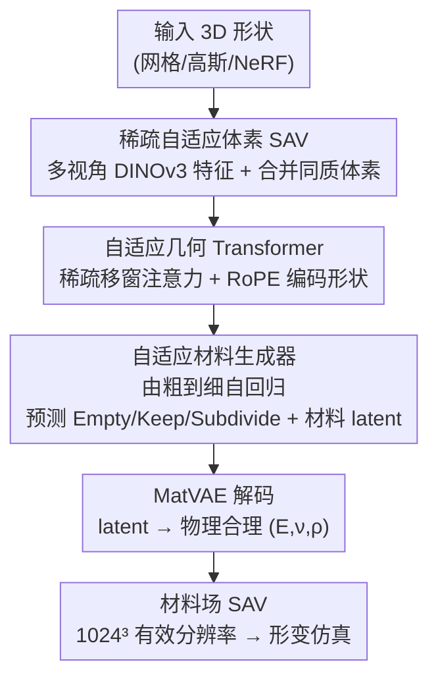

# Adaptive Volumetric Mechanical Property Fields Invariant to Resolution

**会议**: ICML 2026  
**arXiv**: [2606.18231](https://arxiv.org/abs/2606.18231)  
**代码**: [项目页](https://research.nvidia.com/labs/sil/projects/adavomp/)  
**领域**: 3D视觉  
**关键词**: 体积材料场, 稀疏自适应体素, 自回归生成, 物理仿真, 稀疏 Transformer  

## 一句话总结
AdaVoMP 用一种"稀疏自适应体素树 (SAV)"同时表示输入形状和输出材料场，再用稀疏 Transformer 编码器–解码器自回归地为每个 3D 物体逐层生成杨氏模量/泊松比/密度，把可仿真材料场的有效分辨率从 $64^3$ 拉到 $1024^3$（高 $16^3$ 倍），且在更低测试算力下就超过此前 SOTA。

## 研究背景与动机
**领域现状**：机器人、数字孪生等应用需要"可仿真"的 3D 场景，而形变仿真依赖每个物体体积内逐点的力学参数——杨氏模量 $E$、泊松比 $\nu$、密度 $\rho$。但绝大多数 3D 资产（建模/生成/拍照重建得到的）都不带这些参数，手工标注几乎不可能，逐物体实测又无法规模化。

**现有痛点**：近期前馈方法（VoMP、Pixie）学会从形状+外观直接预测体积材料，但都跑在**固定分辨率的稠密体素网格**上（$64^3$）。要提升分辨率，所有活跃体素都得在最细层处理，显存和算力呈立方暴涨，因此被卡死在低分辨率，材料边界和细小部件（如 GPU 内部、家具接缝）糊成一片。

**核心矛盾**：日常物体的材料分布是**大片同质区 + 少量尖锐边界**（金属床架是一整块均质金属，沙发扶手内部恒定），固定网格却对同质区和边界一视同仁地消耗等量算力——算力浪费在没信息的地方，真正需要细化的边界反而分辨率不够。

**本文目标**：(1) 找一种自适应结构，让算力按材料异质度分配；(2) 把这种结构做成可端到端学习、可微、能自回归生成的形式；(3) 在远高于 $64^3$ 的分辨率下保持甚至降低推理开销。

**切入角度**：作者观察到自适应体素结构（八叉树思想）天然契合"大片同质 + 局部异质"的材料分布——只在材料变化处递归细分，同质区用一个粗体素就够。

**核心 idea**：用一个**为材料预测而学习细分**（而非按几何阈值细分）的稀疏自适应体素树 SAV，配一个**自回归、由粗到细**的稀疏 Transformer 生成器，逐层决定"哪里该细化 + 该填什么材料"。

## 方法详解

### 整体框架
AdaVoMP 的输入是任意 3D 形状（网格 / 高斯泼溅 / NeRF 都行，只要能体素化并多视角渲染），输出是覆盖整个物体体积的 $(E,\nu,\rho)$ 场，以一棵 SAV 材料树 $\mathcal{T}^{\mathcal{M}'}$ 的形式表达，有效分辨率 $G^3=1024^3$，但**从不实例化稠密网格**。

整条管线分四步：先把输入形状离散到 $G=2^{10}$ 的基网格，聚合多视角 DINOv3 特征并合并相似体素，得到输入 SAV $\mathcal{T}^{\mathrm{in}}$；再用**自适应几何 Transformer** $\mathbf{E}$ 把它编码成上下文 latent；这些 latent 条件化一个**自适应材料生成器** $\mathbf{G}$，它从最粗层 $\ell=L_{\max}$ 一路自回归到最细层 $\ell=0$，每层只在"细化前沿"的候选体素上预测结构动作（Empty/Keep/Subdivide）和 2D 材料 latent；最后冻结的 MatVAE 把材料 latent 解码成物理合理的 $(E,\nu,\rho)$。

### 关键设计

**1. SAV 稀疏自适应体素：用一棵多分辨率体素树同时表示形状与材料**

针对"固定网格在同质区浪费算力、在边界分辨率不足"的痛点，SAV 让叶子体素**同时存在于不同分辨率层级**：同质区用单个粗体素覆盖（不管空间多大），异质区和材料边界才递归细分到细层。对有界域 $\Omega$（如 $[-0.5,0.5)^3$），每个体素记录层级 $\ell\in\{0,\dots,L_{\max}\}$（0 最细，$L_{\max}=\log_2 G$）和整数索引 $\mathbf{i}$，并映射到统一坐标 $\mathbf{u}_{\ell,\mathbf{i}}:=2^{\ell}\mathbf{i}$，把不同层级的体素都对齐到最细网格，从而让 Transformer 能跨分辨率做注意力；还用八分体 id $o(\mathbf{i}):=(i_x\bmod 2)+2(i_y\bmod 2)+4(i_z\bmod 2)$ 编码它在父体素内的相对位置。每个叶子存常量特征向量，诱导一个可直接查询的分片常量场 $\mathcal{T}(\mathbf{x}):=\mathbf{e}_{\ell',\mathbf{i}'}$。和八叉树/OpenVDB 按几何阈值细分不同，SAV 的细分是**为材料预测而学习**的——构造真值材料树时，仅当某体素内材料变化超过容差 $\bm{\tau}$（在其最细层后代上计算）才细分，否则保留并存后代均值 $\mathbf{m}_V=\frac{1}{|\mathrm{desc}(V)|}\sum_{U\in\mathrm{desc}(V)}\mathbf{m}_U$。这一性质让"部分指定的树"也良定义：缺失的细体素直接返回该区域的粗均值，天然支持逐层监督。

**2. 自适应几何 Transformer：把混层级的形状 SAV 编码成可跨分辨率注意的上下文**

输入形状先体素化到 $G=2^{10}$，聚合多视角 DINOv3 patch-token 特征（$d_{\mathrm{in}}=1280$）。这里作者做了一个关键改动：用**深度衰减加权平均**而非此前的均匀平均来投影特征，避免远近特征被平均后冲淡细节；再把特征相似的体素逐步合并成自适应的 $\mathcal{T}^{\mathrm{in}}$。编码器 $\mathbf{E}$ 把 $\mathcal{T}^{\mathrm{in}}$ 的混层级叶子当作稀疏 token 集，初始嵌入为 $\mathbf{h}^0_{\ell,\mathbf{i}}=W_{\mathrm{in}}\mathbf{e}_{\ell,\mathbf{i}}+\mathbf{e}^{\mathrm{lvl}}_{\ell}$（线性投影 + 可学习层级嵌入），并在自注意力里对统一坐标 $\mathbf{u}_{\ell,\mathbf{i}}$ 施加 RoPE 注入位置信息，随后做**稀疏 3D 移窗自注意力**（在统一坐标系下，借鉴 Swin/TRELLIS）+ FFN。产出的上下文 latent $\mathbf{E}(\mathcal{T}^{\mathrm{in}})$ 会在所有生成层级上条件化下游生成器。

**3. 自适应材料生成器：由粗到细自回归，显式预测空/留/分三动作**

生成器 $\mathbf{G}$ 跨层级共享参数，从 $\ell=L_{\max}$ 到 $\ell=0$ 自回归生成材料树。它**不枚举** $G_\ell^3$ 的整网格，而是只在显式稀疏候选集 $\mathcal{C}_\ell$（细化前沿）上计算：对每个候选体素，$\mathbf{G}$ 输出 (i) 三类结构 logit——**Empty / Keep / Subdivide**，(ii) 非空体素的 2D 材料 latent $\mathbf{z}_{\ell,\mathbf{i}}\in\mathbb{R}^2$。其中显式的 Empty 动作让模型能主动预测空白区，这是此前工作没有的。每个候选除了自己的 $(\ell,\mathbf{i})$，还携带父节点隐状态 $\mathbf{h}_{\ell+1,\lfloor\mathbf{i}/2\rfloor}$——因为 $\mathcal{C}_\ell$ 只含细化前沿，否则细层候选会在那些"被父级 Keep 住没继续分"的区域看到空洞，破坏空间连贯性。候选初始 query 为 $\mathbf{q}_{\ell,\mathbf{i}}=\mathbf{e}^{\mathrm{lvl}}_{\ell}+W_{\mathrm{oct}}\mathbf{e}^{\mathrm{oct}}_{o(\mathbf{i})}+W_{\mathrm{par}}\mathbf{h}_{\ell+1,\lfloor\mathbf{i}/2\rfloor}$，先对输入 latent 做交叉注意力、再在候选间做带 RoPE 的稀疏移窗自注意力；被判 Subdivide 的体素把 8 个子节点连同父隐状态放进下一层 $\mathcal{C}_{\ell-1}$，Empty 丢弃，Keep 成为最终叶子。这种自回归结构天然支持**测试时算力缩放**：少跑几层就得到良定义的低分辨率输出。最后冻结的 **MatVAE**（取自 VoMP）把 $\mathbf{z}_{\ell,\mathbf{i}}$ 映射到 $(E,\nu,\rho)$，保证生成的物理量落在合理流形上。

**4. 自回归训练公式：教师强制 + 多尺度加权 + 显式空白负样本**

$\mathbf{E}$ 和 $\mathbf{G}$ 端到端联合训练。用**教师强制**把细分调度固定成真值的广度优先顺序——训练时把预测的细分决策替换成真值 $s^\star_{\ell,\mathbf{i}}$，从 $\mathcal{C}_{L_{\max}}$ 出发按式 $\mathcal{C}_{\ell-1}:=\bigcup_{(\ell,\mathbf{i})\in\mathcal{C}_\ell:\,s^\star=\textsc{Subdivide}}\mathrm{Children}(\ell,\mathbf{i})$ 展开。关键是**展开每个细分体素的全部 8 个子节点**，把空白子节点也作为显式负样本喂进去，逼模型学会判 Empty。总损失 $\mathcal{L}=\lambda_{\mathrm{struct}}\mathcal{L}_{\mathrm{struct}}+\lambda_{\mathrm{mat}}\mathcal{L}_{\mathrm{mat}}$：结构损失是按候选数归一化、层级加权 $\omega_\ell:=\gamma^\ell\,(\gamma>1$，让粗体素贡献更大$)$ 的负对数似然；材料损失只惩罚真值非空的候选，把预测 latent 经 MatVAE 解码成归一化三元组后与目标算马氏 L2：$\mathcal{L}_{\mathrm{mat}}\propto\sum_\ell\omega_\ell\sum\|\hat{\mathbf{m}}_{\ell,\mathbf{i}}-\mathbf{m}^\star_{\ell,\mathbf{i}}\|^2_{\bm{\Lambda}}$，$\bm{\Lambda}=\mathrm{diag}(\lambda_E,\lambda_\nu,\lambda_\rho)$ 平衡三个量纲差异巨大的物理量。训练数据复用 VoMP 的 VLM 自动标注管线，无需新标注。

## 实验关键数据

### 主实验
评测三个物理量：杨氏模量 $E$（用对数域误差 ALDE/ALRE）、泊松比 $\nu$ 与密度 $\rho$（用 ADE/ARE，绝对/相对误差）。误差先按物体算再跨物体平均，避免大物体主导。Ours-H 是 0.6B 参数版本。

| 分辨率 | 方法 | $E$ ALDE↓ | $\nu$ ADE↓ | $\rho$ ADE↓ |
|--------|------|-----------|------------|-------------|
| $64^3$ | Pixie | 0.3986 | 0.0259 | 141.78 |
| $64^3$ | VoMP（前 SOTA） | 0.3793 | 0.0241 | 142.69 |
| $64^3$ | **AdaVoMP-H** | **0.3278** | **0.0205** | **127.31** |
| $1024^3$ | Pixie | 1.2264 | 0.0413 | 248.67 |
| $1024^3$ | VoMP | 1.1371 | 0.0289 | 191.63 |
| $1024^3$ | **AdaVoMP-H** | **0.8841** | **0.0215** | **158.46** |

要点：即便降到 $64^3$ 的低测试算力，AdaVoMP 也已全面超过所有 baseline；而在它独有的 $1024^3$ 高分辨率下优势进一步拉大（$E$ 的 ALDE 比 VoMP 低约 22%）。NeRF2Physics、PUGS、Phys4DGen 这类基于表面特征场/VLM 的方法误差大一个量级，且很多无法预测体积内部的 $\nu$。

### 消融 / 难例分析
论文在 GVT-Hard（材料更异质的挑战子集）上单独评测，并在附录做了大量模型设计与规模消融。

| 配置 | $E$ ALDE↓ @ $1024^3$ | 说明 |
|------|----------------------|------|
| VoMP（固定 $64^3$） | 1.6680 | 固定网格基线 |
| Pixie | 1.8950 | 另一固定网格前馈法 |
| **AdaVoMP-H** | **1.2440** | 自适应结构在难例上优势更明显 |

### 关键发现
- **自适应结构是主要增益来源**：把固定网格换成 SAV 后，同样算力预算下边界与细小部件的预测显著更准，且能扩到 $16^3$ 倍分辨率。
- **测试时算力可调**：自回归由粗到细让用户用更少迭代换取低分辨率快速输出，反之亦然——这是固定网格方法做不到的。
- **越难越赚**：在材料更异质的 GVT-Hard 上，AdaVoMP 相对 VoMP 的领先幅度比整体测试集更大，说明优势确实来自"把算力花在异质边界"。

## 亮点与洞察
- **把"自适应网格"从几何重建迁到材料预测**，并指出材料分布"大片同质 + 少量边界"的统计特性正好适合自适应细分——这个观察是整篇文章的支点，巧妙且可迁移。
- **结构与材料一起自回归生成**：用 Empty/Keep/Subdivide 三动作让模型自己决定"哪里该细化"，而不是预设网格，等于把分辨率分配也变成可学习的预测目标。
- **显式空白负样本**：训练时强制展开全部 8 个子节点把空区当负样本，解决了自适应生成最容易塌掉的"该停不停 / 该分不分"问题，这个 trick 可复用到任何由粗到细的稀疏生成任务。
- **测试时算力缩放**作为副产品自然出现，对部署很友好——同一模型既能出快速预览也能出高保真材料场。

## 局限与展望
- 训练依赖 VoMP 的 VLM 自动标注数据，**材料真值本身的精度上限**会传导到本方法；高质量物理材料数据仍稀缺。
- 利益冲突：作者来自 NVIDIA，而对比基线 VoMP 也由 NVIDIA 主导，需留意评测立场（论文已声明）。
- 输入要求物体能体素化且多视角可渲染，对**透明/反光/极薄结构**的特征聚合可能仍困难。
- 自回归逐层生成虽支持算力缩放，但**最细层的串行依赖**可能限制吞吐；可探索并行化或跳层细化。

## 相关工作与启发
- **vs VoMP / Pixie**：它们用固定 $64^3$ 稠密网格、所有活跃体素都在最细层处理；本文用稀疏自适应 SAV + 自回归生成，把分辨率提到 $1024^3$ 且更省算力，优势在异质边界与细小部件。
- **vs 八叉树 / OpenVDB 等通用空间结构**：通用结构按几何阈值细分；SAV 专为材料预测**学习**细分，且提供可微的构造参数化，能端到端训练。
- **vs Deng et al. 的八叉树自回归（序列化成 1D token）**：他们把结构序列化成离散 token 序列生成；本文**全程保持显式 3D 空间结构**，便于跨分辨率注意力与空间连贯。

## 评分
- 新颖性: ⭐⭐⭐⭐⭐ 把自适应体素 + 自回归生成首次系统用于体积材料预测，结构与材料联合生成
- 实验充分度: ⭐⭐⭐⭐☆ 多分辨率主表 + 难例子集 + 附录大量消融，但缺真实仿真的定量评估
- 写作质量: ⭐⭐⭐⭐☆ 方法推导严谨、公式完整，个别排版有 typo
- 价值: ⭐⭐⭐⭐⭐ 直接服务"3D 资产 → 可仿真环境"的刚需，对机器人仿真有实用意义

<!-- RELATED:START -->

## 相关论文

- [\[CVPR 2025\] Event Fields: Capturing Light Fields at High Speed, Resolution, and Dynamic Range](../../CVPR2025/3d_vision/event_fields_capturing_light_fields_at_high_speed_resolution_and_dynamic_range.md)
- [\[CVPR 2026\] Turbo-GS: Accelerating 3D Gaussian Fitting for High-Resolution Radiance Fields](../../CVPR2026/3d_vision/turbo-gs_accelerating_3d_gaussian_fitting_for_high-quality_radiance_fields.md)
- [\[CVPR 2026\] InfiniDepth: Arbitrary-Resolution and Fine-Grained Depth Estimation with Neural Implicit Fields](../../CVPR2026/3d_vision/infinidepth_arbitrary-resolution_and_fine-grained_depth_estimation_with_neural_i.md)
- [\[ECCV 2024\] MeshFeat: Multi-Resolution Features for Neural Fields on Meshes](../../ECCV2024/3d_vision/meshfeat_multi-resolution_features_for_neural_fields_on_meshes.md)
- [\[AAAI 2026\] Pb4U-GNet: Resolution-Adaptive Garment Simulation via Propagation-before-Update Graph Network](../../AAAI2026/3d_vision/pb4u-gnet_resolution-adaptive_garment_simulation_via_propagation-before-update_g.md)

<!-- RELATED:END -->
