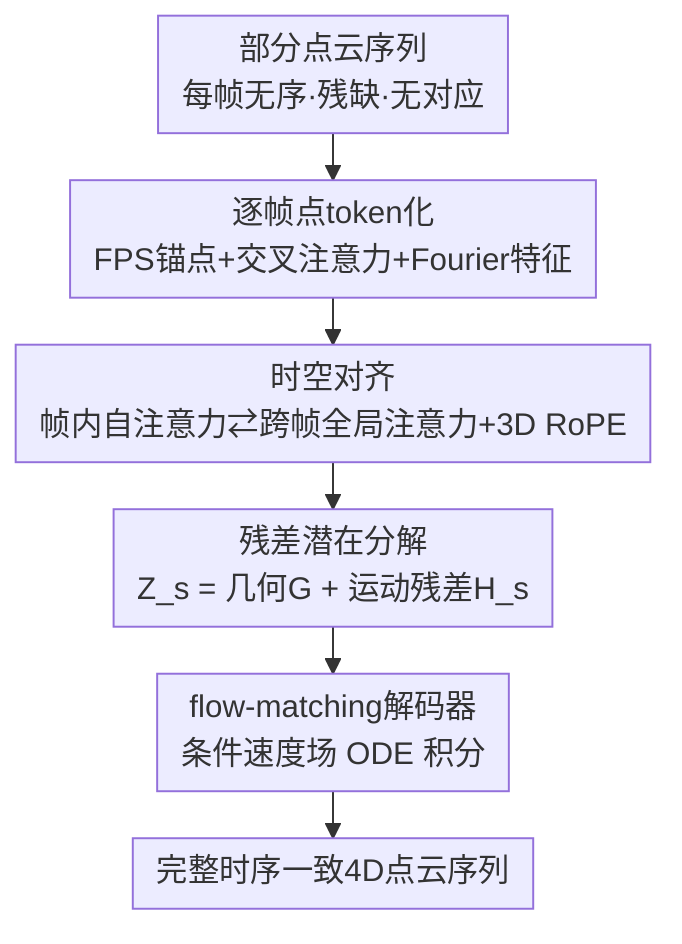

# DynaTok: Token-Based 4D Reconstruction from Partial Point Clouds

**会议**: ICML2026  
**arXiv**: [2606.12189](https://arxiv.org/abs/2606.12189)  
**代码**: 项目页 https://wrchen530.github.io/dynatok/（代码计划录用后开源）  
**领域**: 3D视觉 / 4D重建  
**关键词**: 4D重建, 部分点云, 时序聚合, 潜在token, flow matching

## 一句话总结
DynaTok 把每帧不完整、无序、无对应关系的部分点云编码成一组紧凑潜在 token，用时空 Transformer 跨帧聚合互补观测，再用「参考帧几何 + 残差运动」的统一潜空间解耦形变，最后接一个 flow-matching 解码器重建出时序一致的完整 4D 点云序列。

## 研究背景与动机
**领域现状**：4D 重建（随时间变化的动态 3D 场景重建）近年主要由基于图像/视频的方法推动，靠稠密视觉观测、丰富纹理和外观线索来恢复动态几何。而点云是深度传感器的原生输出，不依赖纹理和表面连通性，更贴近真实机器人/AR 的感知方式。

**现有痛点**：现有基于点云的学习方法大多只能处理静态场景或单物体的形变，且通常假设输入相对完整、需要显式的点到点对应、甚至要求 watertight mesh 监督。这些假设在真实深度传感场景里几乎都不成立。

**核心矛盾**：真实测试时拿到的是**部分点云序列**——因传感器覆盖有限、遮挡、视角变化而严重残缺，点是无序的，跨帧没有身份对应。这带来三重困难：(i) 单帧可能整块缺失（尤其动态物体），逐帧重建根本不够；(ii) 没有外观/跟踪线索时，缺失点到底来自遮挡、运动还是视角变化无从分辨，静态背景与动态物体难以区分；(iii) 点身份不跨帧保留，朴素时序融合会得到几何和运动都不一致的结果。

**本文目标**：在「部分 + 无序 + 无对应」的纯几何输入下，恢复一个时序一致、完整的 4D 场景表示，并且即使某个区域/物体在单帧里完全不可见也能补出来。

**切入角度**：作者押注于**时序聚合**——既然单帧残缺，那就让不同帧的互补观测在一个共享的潜空间里相互补全。关键观察是：与其在原始点层面对齐（无对应可用），不如把每帧压成固定数量的潜在 token，在 token 层面做跨帧注意力，时序一致性会隐式涌现。

**核心 idea**：用一组跨帧共享、时序对齐的潜在 token 表示整个序列，并在**同一个**统一模型里用「参考几何 token + 残差运动 token」显式解耦形状与运动，再用 flow-matching 解码器在仅点云监督下重建完整几何。

## 方法详解

### 整体框架
输入是一段部分点云序列 $\mathcal{X}=\{\mathbf{X}_s\}_{s=1}^{S}$，每帧 $\mathbf{X}_s\in\mathbb{R}^{N_{\text{in}}\times 3}$（默认 8192 点），输出是完整、时序一致的 4D 序列 $\mathcal{Y}=\{\mathbf{Y}_s\}$。整条管线分四步：先把每帧点云**token 化**成 $M=512$ 个潜在 token；再用时空 Transformer 把各帧 token **跨帧聚合**、互相补全；接着用**残差分解** $\mathbf{Z}_s=\mathbf{G}+\mathbf{H}_s$ 把参考帧几何与逐帧运动拆开（不引入第二个网络）；最后把 $\mathbf{Z}_s$ 喂给 **flow-matching 解码器**，逐时间步采样出完整点云。全部组件从零训练，仅用每帧全局点云做监督。

### 关键设计

**1. 逐帧点 token 化：把无序残缺点云压成固定数量的规整表示**

跨帧聚合的前提是有个稳定、可对齐的载体，而原始部分点云无序、数量不定，没法直接对齐。作者对每帧用最远点采样（FPS）选出 $M$ 个点查询作为锚点，这些查询通过一层交叉注意力去 attend 整帧原始点云（原始点位置作 key/value）；注意力前先把 3D 坐标用 Fourier 特征升维以增强空间表达，再用若干自注意力层细化局部几何上下文。输出是每帧 $M\times D_{\mathcal{Z}}$ 的潜在 token $\mathbf{F}_s$。这一步把「变化无常的原始点」压成「数量固定、排列不变」的紧凑表示，既降低了输入波动，又保留关键几何结构，为后续跨帧、跨时间的一致处理铺平道路。

**2. 时空对齐：在 token 层面跨帧互补，免对应地恢复缺失区域**

单帧整块缺失，只能靠别的帧补。作者用一个 Transformer 联合处理所有帧的 token，每层交替做两种注意力：**帧内自注意力**保持单帧内部的空间一致性，**跨帧全局注意力**让 token 在潜空间里跨时间传播信息——某一帧观测到的几何证据可以影响其它帧的潜在表示，从而补出那些帧里缺失的区域。整个聚合完全在 token 层面进行，**不假设任何跨帧点对应**；时序一致性靠共享注意力和对互补观测的反复曝光隐式涌现。为编码空间关系，作者把旋转位置编码（RoPE）扩展到 3D，用 token 查询位置注入，让模型在聚合时能推理相对几何。

**3. 残差潜在分解：单一网络内显式解耦几何与运动**

以往方法常用两个分离网络分别做形状重建和形变建模，参数冗余且两路难协调。DynaTok 把第一帧（$s=1$）的 token 当作参考表示 $\mathbf{G}$（充当序列的 canonical anchor），其余帧写成残差形式：

$$\mathbf{Z}_s=\mathbf{G}+\mathbf{H}_s,\qquad \mathbf{H}_1=\mathbf{0}.$$

所有帧共享同一个潜空间，不引入额外 token 或专门的运动空间。$\mathbf{G}$ 承载随时间不变的持久结构，$\mathbf{H}_s$ 捕捉逐帧的时变变化。模型端到端训练、只用每帧全局点云监督，就会自动把持久几何分配给参考分量、把时间变化分配给残差，**不需要任何运动标签**。这种「参考–残差」参数化用最简单的方式在共享潜空间里实现了时不变结构与时变成分的分离。

**4. 条件 flow-matching 解码器：免对应地重建任意密度完整点云**

拿到聚合后的 $\mathbf{Z}_s$，解码器把全局重建建模为条件分布 $p(\mathbf{Y}_s\mid\mathbf{Z}_s)$，用条件 flow matching 把一个简单先验连续变换到目标场景几何。给定目标点云 $\mathbf{x}_1$ 与噪声 $\boldsymbol{\epsilon}$，定义线性插值路径 $\mathbf{x}_t=(1-t)\boldsymbol{\epsilon}+t\mathbf{x}_1$，解码器学习条件速度场 $\Phi_{\text{dec}}(\mathbf{x}_t,t,\mathbf{Z}_s)$，目标速度为 $\mathbf{v}_{\text{target}}=\mathbf{x}_1-\boldsymbol{\epsilon}$，训练损失为

$$\mathcal{L}_{\mathrm{FM}}=\mathbb{E}_{t,\mathbf{x}_1,\boldsymbol{\epsilon},\mathbf{Z}_s}\big[\big\|\Phi_{\mathrm{dec}}(\mathbf{x}_t,t,\mathbf{Z}_s)-(\mathbf{x}_1-\boldsymbol{\epsilon})\big\|_2^2\big].$$

之所以选 flow matching：它天然支持可变点数、不需要显式点对应，正好契合「无对应」的设定；推理时从均匀立方体先验 $\boldsymbol{\epsilon}\sim\mathcal{U}([-1,1]^3)$ 出发，把学到的 ODE 从 $t=0$ 积分到 $t=1$ 即得重建点云，且可在推理时输出任意密度的点云。整个解码器**只用这一项 flow-matching 损失**，无需额外监督。

### 损失函数 / 训练策略
全模型只用式 $\mathcal{L}_{\mathrm{FM}}$ 一项损失从零训练。PyTorch 实现，8×H100，AdamW，学习率 $10^{-3}$ + 线性 warm-up，训练 250k 步、每 GPU batch 8 个序列；训练时每序列随机采 $S=8$ 帧、评测用 16 帧；输入/目标点云用基于中位数的尺度归一化，默认每帧 8192 输入点、$M=512$ token。

## 实验关键数据

### 主实验
在物体级（DeformingThings4D-Animals，1972 段形变人/动物序列）与场景级（Kubric MOVi-F，含静动物体交互、相机运动）两类基准上评测，输入为深度图反投影得到的部分点云。指标用单边 Chamfer 距离定义的 Accuracy（预测→GT）和 Completeness（GT→预测），以及 Normal Consistency（法向一致性）。

物体级 DT4D（两种泛化设置）：

| 方法 | 类型 | Acc↓ (Unseen Motion) | Comp↓ | NC↑ | Acc↓ (Unseen Indiv.) | Comp↓ | NC↑ |
|------|------|------|------|------|------|------|------|
| Shape2VecSet | 3D 逐帧 | 0.022 | 0.174 | 0.703 | 0.030 | 0.167 | 0.696 |
| TripoSG | 3D 逐帧 | 0.051 | 0.165 | 0.740 | 0.048 | 0.143 | 0.732 |
| TRELLIS | 3D 逐帧 | 0.026 | 0.190 | 0.813 | 0.049 | 0.194 | 0.787 |
| Motion2VecSets | 4D | 0.055 | 0.060 | 0.856 | 0.061 | 0.065 | 0.824 |
| **DynaTok（本文）** | 4D | **0.023** | **0.021** | **0.914** | **0.027** | **0.026** | **0.877** |

场景级 Kubric：

| 方法 | Acc↓ (前景) | Comp↓ | NC↑ | Acc↓ (前景+背景) | Comp↓ | NC↑ |
|------|------|------|------|------|------|------|
| Shape2VecSet | 0.008 | 0.027 | 0.680 | 0.009 | 0.026 | 0.724 |
| TripoSG | 0.012 | 0.023 | 0.711 | 0.042 | 0.020 | 0.783 |
| TRELLIS | 0.009 | 0.029 | 0.829 | 0.011 | 0.025 | 0.874 |
| Motion2VecSets | 0.061 | 0.063 | 0.545 | – | – | – |
| **DynaTok（本文）** | **0.008** | **0.010** | **0.835** | **0.010** | **0.014** | **0.888** |

逐帧 3D 基线虽然单帧 Accuracy 不差，但 Completeness 极差（缺失补不回来）；Motion2VecSets 受限于固定 512 点、单物体假设，无法用于全场景（前景+背景列缺失）。DynaTok 在 Completeness 和 NC 上大幅领先，正说明时序聚合的价值。

### 消融实验

| 配置 | Acc↓ | Comp↓ | NC↑ | 说明 |
|------|------|------|------|------|
| Per-frame Only（仅逐帧编码） | 0.276 | 0.301 | 0.531 | 去掉时序聚合，几何彻底崩坏 |
| Geometry-Motion（完整） | 0.027 | 0.026 | 0.877 | 残差解耦的几何-运动编码 |
| $M=128$ tokens | 0.030 | 0.032 | 0.869 | token 太少略掉点 |
| $M=256$ tokens | 0.027 | 0.026 | 0.877 | 折中 |
| $M=512$ tokens | 0.026 | 0.030 | 0.881 | token 更多 NC 最高 |

### 关键发现
- **时序聚合是命门**：去掉跨帧聚合、退化成逐帧编码后，Acc 从 0.027 暴涨到 0.276、Comp 0.026→0.301、NC 0.877→0.531，几乎全崩——证明本文核心假设「靠跨帧互补补全缺失几何」成立。
- **token 数量是平滑的容量旋钮**：$M$ 从 128 增到 512，指标稳步改善但不剧烈，$M=256$ 已接近饱和，说明潜在表示对 token 数不敏感、可按算力权衡。
- **逐帧 3D 基线的失败模式很清晰**：它们 Accuracy（已观测点的局部精度）能打，但 Completeness（补全未观测区域）灾难性差，凸显「单帧完整性」与「跨帧补全」是两个不同能力。

## 亮点与洞察
- **token 层面对齐绕开了「无对应」死结**：原始点无身份、无法逐点对齐，但把每帧压成固定数量 token 后，跨帧注意力天然就能做软对齐，时序一致性隐式涌现——这是把难题从「点匹配」搬到「潜空间聚合」的漂亮转换。
- **残差参数化 $\mathbf{Z}_s=\mathbf{G}+\mathbf{H}_s$ 一招省掉第二个网络**：以往「形状网络 + 形变网络」两套结构，这里只用一个共享潜空间和置零残差的参考帧就实现了几何-运动解耦，而且无需任何运动标签，训练时模型自己学会分配——简单到可以直接迁移到别的序列建模任务。
- **flow matching 与点云的契合点被点透**：可变点数 + 免对应正是点云生成最头疼的两点，flow matching 恰好天然支持，这个匹配选型本身就是可复用的洞察。

## 局限与展望
- **依赖第一帧作 canonical 参考**：把 $s=1$ 当 anchor、其余写残差，若首帧本身观测极度残缺，参考几何可能不稳（作者用一阶段联合聚合缓解，但残差仍锚在首帧）。
- **仅几何、无语义/外观**：纯点云输入虽贴近深度传感，但放弃了纹理线索，对外观高度相关的区分（如同形状不同物体）天然没有信息。
- **评测仍偏合成数据**：DT4D 与 Kubric 都是合成/扫描数据，真实深度传感器的噪声、动态模糊、多传感器标定误差未充分验证；代码尚未开源，复现性待确认。
- **可改进方向**：把参考帧从「固定首帧」换成「learnable canonical token」或多参考融合，或许能进一步抗首帧残缺；引入轻量语义先验辅助静动分离也值得一试。

## 相关工作与启发
- **vs Motion2VecSets**：二者都做点云 4D，但 M2VS 只从**第一帧**推断 canonical 形状、后续帧作其形变，且限单物体、固定 512 点；DynaTok 用一阶段对齐**联合**跨帧聚合几何，能扛首帧残缺、支持无对应部分序列，并可扩到全场景（前景+背景）。
- **vs 逐帧 3D VAE（Shape2VecSet / TripoSG / TRELLIS）**：它们逐帧独立重建、无时序整合，Accuracy 尚可但 Completeness 崩；DynaTok 把缺失区域靠跨帧聚合补回，正是时序聚合相对逐帧生成的核心增益。
- **vs 基于图像/视频的 4D 方法（如 GVFD）**：图像方法靠稠密外观线索且常需显式对应/完整形状，无法直接用于纯几何、无对应的部分点云设定；本文专攻这一被忽视但更贴近真实传感的输入域。

## 评分
- 新颖性: ⭐⭐⭐⭐⭐ 首次正面定义并解决「部分+无序+无对应」点云 4D 重建，token 聚合 + 残差解耦 + flow matching 的组合干净有力
- 实验充分度: ⭐⭐⭐⭐ 物体级与场景级双基准、消融到位，但仅合成数据、缺真实传感与代码复现
- 写作质量: ⭐⭐⭐⭐⭐ 问题动机层层递进，方法四步清晰，三大挑战与解法一一对应
- 价值: ⭐⭐⭐⭐ 直击深度传感真实痛点，残差解耦与 token 聚合范式对动态点云建模有迁移价值

<!-- RELATED:START -->

## 相关论文

- [\[CVPR 2026\] Vista4D: Video Reshooting with 4D Point Clouds](../../CVPR2026/3d_vision/vista4d_video_reshooting_with_4d_point_clouds.md)
- [\[AAAI 2026\] TOSC: Task-Oriented Shape Completion for Open-World Dexterous Grasp Generation from Partial Point Clouds](../../AAAI2026/3d_vision/tosc_task-oriented_shape_completion_for_open-world_dexterous_grasp_generation_fr.md)
- [\[CVPR 2026\] V-DPM: 4D Video Reconstruction with Dynamic Point Maps](../../CVPR2026/3d_vision/v-dpm_4d_video_reconstruction_with_dynamic_point_maps.md)
- [\[CVPR 2026\] Edges Compete for Trust: Group Relative Edge Optimization for Building Reconstruction from Point Clouds](../../CVPR2026/3d_vision/edges_compete_for_trust_group_relative_edge_optimization_for_building_reconstruc.md)
- [\[CVPR 2026\] Aligning Text, Images and 3D Structure Token-by-Token](../../CVPR2026/3d_vision/aligning_text_images_and_3d_structure_token-by-token.md)

<!-- RELATED:END -->
