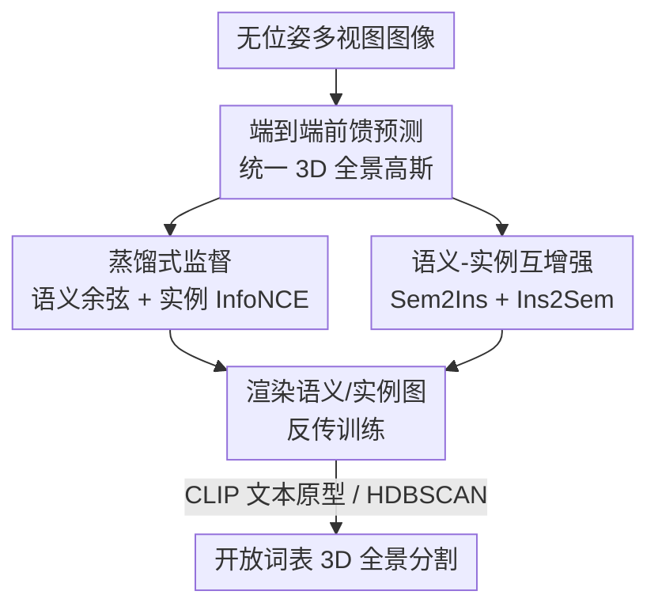

# EPS3D: End-to-End Feed-Forward 3D Panoptic Segmentation

**会议**: ICML2026  
**arXiv**: [2606.08980](https://arxiv.org/abs/2606.08980)  
**代码**: https://github.com/Runsong123/EPS3D  
**领域**: 3D视觉（开放词表 3D 全景分割 · 前馈高斯）  
**关键词**: 开放词表、3D全景分割、前馈重建、3D高斯、语义实例互增强

## 一句话总结
EPS3D 是首个端到端前馈的开放词表 3D 全景分割框架：从无位姿多视图图像一次前向直接预测带语义/实例属性的统一 3D 全景高斯，靠 2D 基础模型蒸馏监督摆脱 3D 标注，并用语义-实例互增强模块让两路预测相互校正，在 Replica 上语义 mIoU 比 SOTA 高约 13%、每个场景仅需 1 秒。

## 研究背景与动机
**领域现状**：开放词表 3D 全景分割（OV3DPS）要在一个 3D 场景里同时给出不受限的语义类别、实例身份，还要保证跨视图 3D 一致，是机器人、具身智能、VR/AR 的关键能力。由于 3D 标注昂贵稀缺，主流做法是把 2D 基础模型（CLIP 管语义、SAM 管实例）的结果"抬升"进 3D 辐射场（如 3D 高斯）。

**现有痛点**：两条路线都不理想。一是**逐场景优化**派——把 2D 结果融进 3D 表征要对每个场景单独优化（Feature-3DGS 要 18 分钟、Unified-Lift 要 5 分钟），慢且缺乏场景级鲁棒性，没法实时。二是较新的**前馈两阶段**派（LSM、Uni3R）——先用预训练 2D 模型逐视图抽语义特征，再用前馈 3D 网络去融合；效率上去了，但中间这些 2D 特征是**视图相关、彼此不一致**的，后续多视图融合会把不一致逐步累积放大（error accumulation）。而且它们大多只做语义、不用对象级结构线索，边界糊、撑不起实例级的下游应用（编辑、机器人抓取）。

**核心矛盾**：两阶段范式里，"先独立抽 2D 特征"这一步从源头注入了跨视图不一致，再怎么融合都是在补救误差；同时语义和实例被当成两件独立的事各做各的，丢掉了它们本可以互相帮忙的互补性。

**本文目标**：要一个既高效又准确的端到端方法——(1) 消除两阶段的误差累积；(2) 在 3D 里联合输出准确的语义和对象级实例预测。

**切入角度**：与其"先抽视图相关特征再融合"，不如让网络**直接从多视图图像一步预测统一的 3D 表征**，让一致性在特征提取和解码阶段就被鼓励出来，而不是事后修补。

**核心 idea**：用一个前馈网络把无位姿多视图图像直接映射成统一的 3D 全景高斯（几何+外观+语义+实例），训练时只把 2D 基础模型当"老师"做蒸馏监督，并引入语义-实例互增强模块让两路预测彼此校正。

## 方法详解

### 整体框架
EPS3D 学习一个映射 $f_\theta:\{C_i\}_{i=1}^N \mapsto \mathcal{G}$，把 $N$ 张无位姿 RGB 图直接变成一组统一的 3D 全景高斯 $\mathcal{G}=\{(I_g,S_g),(\boldsymbol\mu_g,\sigma_g,\boldsymbol r_g,\boldsymbol s_g,\boldsymbol c_g)\}_{g=1}^G$——每个高斯既带标准的几何/外观参数（中心、不透明度、旋转、缩放、球谐颜色），又带与文本对齐的语义特征 $S_g\in\mathbb{R}^{512}$ 和实例特征 $I_g\in\mathbb{R}^{32}$。流程是：几何 transformer（基于 VGGT）把多视图图像 patch 化并跨视图自/交叉注意力聚合成 3D 感知 token；再用多个 DPT 头解码——一个头出深度反投影成高斯中心、一个头出其余几何外观、两个头分别出语义和实例特征。把这些全景高斯渲染成语义图/实例图后，用 2D 老师做蒸馏监督，并叠加语义-实例互增强（Sem2Ins + Ins2Sem）。推理时语义靠 CLIP 文本原型取 argmax、实例靠 HDBSCAN 聚类。整条链路一次前向完成，没有"先独立抽 2D 特征"的中间环节。

### 关键设计

**1. 端到端前馈统一全景高斯：从源头消灭误差累积**

针对两阶段范式"先逐视图抽视图相关特征、再融合"导致的跨视图不一致累积，EPS3D 不再设这道中间工序，而是让一个前馈网络直接吃多视图 RGB、吐统一 3D 表征。具体地，几何 transformer（VGGT 架构）先把每张图 patch 成 token，经 $L$ 层自注意力+交叉注意力聚合成 3D 感知 token $\hat t^i$；随后一个基于 DPT 的双头回归高斯几何（一头出深度图反投影成中心 $\{\boldsymbol\mu_g\}$，另一头出 $\sigma,\boldsymbol r,\boldsymbol s,\boldsymbol c$），再加两个 DPT 头 $F_I,F_S$ 直接从同一批 3D 感知 token 预测实例特征和文本对齐语义特征 $\{I_g,S_g\}=F_I(\hat t^i),F_S(\hat t^i)$。关键在于语义/实例特征是**从已经跨视图聚合过的 3D 感知 token 里出来的**，天然被鼓励多视图一致，而不是各视图独立预测后再硬融合——这就把不一致从"事后补救"变成了"源头规避"。

**2. 蒸馏式监督：把 2D 基础模型当老师，绕开 3D 标注**

3D 全景标注昂贵稀缺，没法直接监督。EPS3D 把 2D 基础模型只当外部老师提供蒸馏信号（它们不属于模型本身）。语义上，渲染出的文本对齐语义特征 $S^i$ 与 LSeg 老师特征 $\hat S^i$ 用余弦相似度对齐：$\mathcal{L}_{sem}=1-\frac{\hat S^i\cdot S^i}{\|\hat S^i\|\|S^i\|}$。实例上麻烦在于 SAM 的 2D 分割 ID 跨视图会乱序，监督必须对 ID 置换不变，于是用单视图对比学习——对渲染出的实例特征施加 InfoNCE：

$$\mathcal{L}_{\text{ins}}=-\frac{1}{|\Omega|}\sum_{\Omega_j\in\Omega}\sum_{u\in\Omega_j}\log\frac{\exp(\operatorname{sim}(I_u,\bar I_j))}{\sum_{\Omega_l\in\Omega}\exp(\operatorname{sim}(I_u,\bar I_l))},$$

让同一实例 ID 的像素特征向其质心 $\bar I_j$ 靠拢、不同实例彼此推开。这样不依赖任何 3D 真值、也不怕 2D 实例 ID 跨视图不一致，就能学出有判别力、视图一致的 3D 实例特征。

**3. 语义-实例互增强：让两路预测互相校正**

基础训练里语义和实例用各自的目标独立优化，表征基本不相干，浪费了二者的互补性（语义给类别级上下文、实例给对象级边界）。互增强模块用两个方向耦合它们。**Sem2Ins**（语义引导实例）：把语义特征 $S_g$ 和初始实例特征 $I_g$ 各自投影后拼接再融合，得到语义精修的实例特征 $\{I_g^{\text{sem}}\}=F_{\text{fusion}}(\operatorname{concat}(F_{\text{proj1}}(I_g),F_{\text{proj2}}(S_g)))$，用它当最终实例属性去渲染、受 $\mathcal{L}_{\text{ins}}$ 监督，相当于让类别上下文稳住实例分组。**Ins2Sem**（实例增强语义）：每轮随机选 $M$ 个锚点高斯，对每个锚点按实例特征相似度取 top-$K$ 邻居（假设属同一 3D 物体），强制它们语义一致：$\mathcal{L}_{\text{Ins2Sem}}=\frac{1}{K}\frac{1}{M}\sum_{m=1}^{M}\sum_{k=1}^{K}(1-\frac{S_k^m\cdot S_m}{\|S_k^m\|\|S_m\|})$，相当于用实例的边界/对象线索去锐化语义、消除同一物体内部的语义抖动。总损失 $\mathcal{L}_{\text{total}}=w_1\mathcal{L}_{rgb}+w_2\mathcal{L}_{ins}+w_3\mathcal{L}_{sem}+w_4\mathcal{L}_{\text{Ins2Sem}}$。消融显示这种专门设计的双向耦合明显优于把它换成普通的语义-实例 cross-attention。

### 损失函数 / 训练策略
在 ScanNet 与 ScanNet++ 上、8 张 A800 训练；几何外观用标准 RGB 渲染 L1 损失加常规正则。四项损失权重 $w_1=10^{-1},\ w_2=10^{-3},\ w_3=10^{-1},\ w_4=10^{-4}$。语义特征维度 $D_S=512$（CLIP）、实例特征维度 $D_I=32$。

## 实验关键数据

### 主实验
在 ScanNet 和 Replica 上评测开放词表语义/实例分割，2 视图与 8 视图设置下均优于 2D 模型、逐场景优化方法和前馈两阶段 SOTA，且推理只需约 0.7–1 秒/场景（逐场景优化派需数分钟到十几分钟）。

| 数据集·设置 | 指标 | EPS3D | 之前 SOTA | 提升 |
|-------------|------|-------|-----------|------|
| ScanNet · 8视图 · Novel 语义 | mIoU | 0.6169 | 0.5215 (Uni3R) | +0.095 |
| Replica · 8视图 · Novel 语义 | mIoU | 0.4833 | 0.3216 (Uni3R) | +约13% |
| ScanNet · 2视图 · Context 语义 | mIoU | 0.6323 | 0.5233 (Uni3R) | +0.109 |
| ScanNet · 2视图 · Context 实例 | F-score | 0.4552 | 0.1150 (SAM) | 大幅领先 |
| ScanNet · 重建耗时 | 时间 | 0.73s | 18min (Feature-3DGS) | 数量级加速 |

**完整全景指标（PQ/SQ/RQ，Novel-view）**：由于已有 3D 方法只做语义或只做实例，作者构造两个集成基线对比——EPS3D 在 ScanNet 上 PQ 0.5304 vs LSeg+SAM 0.3803、vs Uni3R+Unified-Lift 0.4013；Replica 上 PQ 0.3539 vs 0.2617/0.2716，全面领先，证明统一全景预测的优势。

### 消融实验（Replica · Novel-view）

| 配置 | 语义 mIoU | 实例 mIoU | 说明 |
|------|-----------|-----------|------|
| EPS3D 完整 | 0.4833 | 0.3468 | 完整模型 |
| 去掉特征 splatting 监督 | 0.4533 | 0.2519 | 实例掉最多，splatting 监督最关键 |
| 去掉 Ins2Sem | 0.4531 | 0.3388 | 语义明显下降 |
| 去掉 Sem2Ins | 0.4821 | 0.3210 | 实例下降 |
| 互增强换成 cross-attention | 0.4677 | 0.3230 | 不如专门的互增强设计 |

### 关键发现
- **特征 splatting 监督最关键**：直接监督语义/实例头的预测、而不经渲染（splatting）监督，实例 mIoU 从 0.3468 暴跌到 0.2519、F-score 从 0.3106 到 0.1510，说明"渲染回 2D 再监督"是端到端框架里实现视图一致的核心机制。
- **互增强两向各司其职**：去 Ins2Sem 主要伤语义（0.4833→0.4531），去 Sem2Ins 主要伤实例（0.3468→0.3210），与"语义边界靠实例锐化、实例分组靠语义稳住"的设计动机一一对应。
- **专用耦合 > 通用 cross-attention**：把互增强换成标准 cross-attention 后语义/实例双双下滑，说明显式的方向化耦合比让网络自由注意力更有效。

## 亮点与洞察
- **"源头一致"而非"事后融合"**：把语义/实例特征从已跨视图聚合的 3D 感知 token 直接解码，从机制上规避了两阶段的误差累积，是这篇最核心的范式转变。
- **老师只在训练出现**：2D 基础模型纯当蒸馏老师、不进推理管线，既省掉 3D 标注，又让推理保持轻量（1 秒/场景），可直接接机器人抓取、3D 场景编辑等下游。
- **双向耦合可迁移**：Sem2Ins/Ins2Sem 这种"用一路的强项补另一路的短板"思路，可迁到任何需要联合预测两类强互补属性的任务（如语义+深度、实例+法向）。

## 局限与展望
- 依赖几何 transformer（VGGT）骨干和 DPT 解码，输入是无位姿多视图图像，对极稀疏视图（如单视图）或大尺度室外场景的泛化未充分验证（实验集中在 ScanNet/Replica 室内）。
- 蒸馏上限受 2D 老师（LSeg/SAM）能力约束，老师在某些类别/边界上的系统性错误可能被一并继承。
- Ins2Sem 的 top-$K$ 邻居"同属一个实例"是基于实例特征相似度的假设，在实例特征尚未收敛的早期或物体紧邻处可能引入错误的语义对齐。
- 实例分割推理用 HDBSCAN 聚类，聚类超参对最终实例边界的敏感性论文未深入分析。

## 相关工作与启发
- **vs 逐场景优化派（Feature-3DGS、Unified-Lift）**：它们每个场景单独优化、数分钟到十几分钟，本文一次前向 1 秒搞定且场景级鲁棒，语义/实例指标也更高。
- **vs 前馈两阶段（LSM、Uni3R）**：它们"先逐视图抽 2D 特征再融合"，受视图相关特征不一致拖累、且只做语义；EPS3D 端到端直接出统一表征消除误差累积，并联合输出实例，PQ/SQ/RQ 全面领先。
- **vs 前馈 3D 重建（Dust3R/VGGT 系）**：那些工作只重建几何与外观、不带高层语义实例理解；本文在同样的前馈高效性上嵌入了语义+实例，把重建与场景理解统一进一套全景高斯。

## 评分
- 新颖性: ⭐⭐⭐⭐⭐ 首个端到端前馈开放词表 3D 全景分割，范式从"事后融合"转向"源头一致"
- 实验充分度: ⭐⭐⭐⭐ 两数据集、2/8 视图、PQ/SQ/RQ 与多角度消融完整；室外/稀疏视图泛化待补
- 写作质量: ⭐⭐⭐⭐ 痛点—范式对比—方法递进清晰，图表与公式到位
- 价值: ⭐⭐⭐⭐⭐ 1 秒/场景的高效全景理解直接支撑机器人与 3D 编辑，实用性强

<!-- RELATED:START -->

## 相关论文

- [\[CVPR 2025\] Rethinking End-to-End 2D to 3D Scene Segmentation in Gaussian Splatting](../../CVPR2025/3d_vision/rethinking_end-to-end_2d_to_3d_scene_segmentation_in_gaussian_splatting.md)
- [\[CVPR 2025\] End-to-End Implicit Neural Representations for Classification](../../CVPR2025/3d_vision/end-to-end_implicit_neural_representations_for_classification.md)
- [\[AAAI 2026\] FoundationSLAM: Unleashing the Power of Depth Foundation Models for End-to-End Dense Visual SLAM](../../AAAI2026/3d_vision/foundationslam_unleashing_the_power_of_depth_foundation_models_for.md)
- [\[CVPR 2025\] End-to-End HOI Reconstruction Transformer with Graph-based Encoding](../../CVPR2025/3d_vision/end-to-end_hoi_reconstruction_transformer_with_graph-based_encoding.md)
- [\[ICML 2026\] Trust3R: Evidential Uncertainty for Feed-Forward 3D Reconstruction](trust_it_or_not_evidential_uncertainty_for_feed-forward_3d_reconstruction_with_t.md)

<!-- RELATED:END -->
