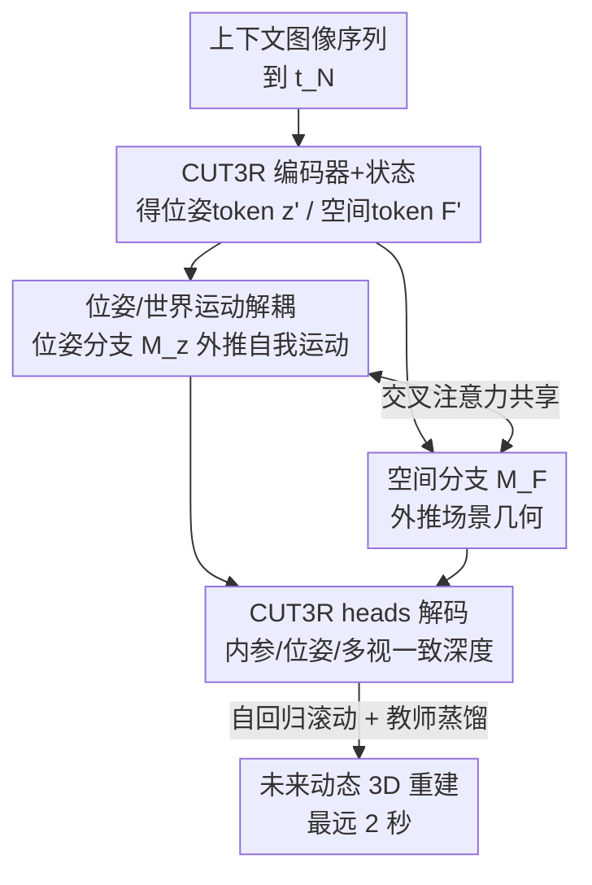

# Future Dynamic 3D Reconstruction: A 3D World Model with Disentangled Ego-Motion

**会议**: ICML2026  
**arXiv**: [2606.18250](https://arxiv.org/abs/2606.18250)  
**代码**: [项目页 fr3d-wm.github.io](https://fr3d-wm.github.io)  
**领域**: 3D视觉 / 世界模型 / 表示学习  
**关键词**: 世界模型, 动态3D重建, 自我运动解耦, 教师学生蒸馏, 零样本泛化

## 一句话总结
这篇论文提出 FR3D——第一个为"未来动态 3D 重建"做的世界模型，它在预训练 3D 重建模型（CUT3R）的潜空间里**把相机自我运动和场景自身运动解耦**，用两个掩码 Transformer 分别外推位姿和几何，并靠教师-学生蒸馏拿到几乎免训练成本的零样本泛化，单目输入也能预测 2 秒后的 3D 场景。

## 研究背景与动机
**领域现状**：生成式世界模型这几年靠 2D 视频扩散模型把"环境模拟"做到了惊人的照片级真实度（Sora 之类），常被用作游戏交互环境或自动驾驶仿真器。它们直接在像素空间里合成环境演化。

**现有痛点**：这些 2D 模型严格在图像平面上工作，于是把**相机轨迹和场景演化混在一起**。这种纠缠从根本上限制了模型在 rollout 全程维持连贯 3D 几何的能力——长时间预测时常出现"幻觉物理"：物体形变、消失、深度相关的运动视差不一致。对要在物理世界里干活的智能体（如自动驾驶）来说，几何完整性必须优先于照片真实度。

**核心矛盾**：现有世界模型要么只在像素/2D 特征空间工作（把世界当作一叠 2D 平面，长时序必然不一致），要么在 3D 里也只做占据栅格预测、传感器数据合成，**不解耦自我运动和世界运动**；而能泛化的大模型靠的是极端规模（22M GPU 小时、20M 小时视频），对具体下游任务极不实用。问题的根子是：自我运动引起的变化和外部实体引起的变化在 2D 特征里分不开，模型搞不清"是我动了还是世界动了"。

**本文目标**：在保持低数据/低算力的前提下，让世界模型维持一个**持续的 3D 潜表示**进入未来，并显式分离两类运动。

**切入角度**：作者发现 3D 重建是"回溯性的"（用已观测帧重建过去），而世界模型是"前瞻性的"。如果能学会在一个**前馈 3D 重建模型的潜空间里做时间外推**，就能天然继承它的 3D 归纳偏置和泛化能力，同时把相机位姿作为一条独立的潜变量轴拎出来——这正好对应"把自我运动当作动作的潜代理"。

**核心 idea**：在 CUT3R 这类前馈重建模型的统一 3D 潜空间里自回归地外推场景状态和智能体位姿，用解耦的位姿/空间双分支消除自我运动与世界运动的歧义，并用教师-学生蒸馏白嫖基础模型的"空间常识"。

## 方法详解

### 整体框架
FR3D 接收一段上下文图像序列（到时刻 $t_N$），自回归地输出从 $t_{N+1}$ 起的统一 3D 场景重建 + 自我相机位姿，**全程不再访问对应的图像**。它的关键是不在像素空间预测，而是在冻结的前馈 3D 重建模型 CUT3R 的潜空间里操作：先用 CUT3R 的编码器把上下文图像编成逐帧 image token，经 CUT3R 的双解码器与一个累积状态 $s$ 交互，得到"富含历史信息"的位姿 token $z'$ 和空间 token $F'$；然后两个掩码 Transformer（位姿分支 $M_z$、空间分支 $M_F$）通过交叉注意力共享信息、协同外推下一帧的 token；最后用 CUT3R 预训练的 heads 把预测 token 解码成相机内参、位姿和多视一致深度，组装出未来 3D 重建。整个学生模型靠模仿冻结教师（CUT3R）的 token 空间来训练，损失是 smooth L1。

### 关键设计

**1. 在冻结 3D 重建模型的潜空间里做时间外推：继承 3D 归纳偏置**

不在像素或 2D 特征空间预测，而是学会在前馈 3D 重建模型 CUT3R 的潜空间里"按时间往前走"。形式上，先用预定义编码器 $\mathcal{E}$ 把 $N$ 帧上下文图像编成 image token $F=\mathcal{E}(I)\in\mathbb{R}^{N\times D\times H_F\times W_F}$；沿用 CUT3R 把历史压进状态 $s_{t-1}\in\mathbb{R}^{768\times768}$，让状态和当前 token 经两个互联解码器 $\mathcal{D}_F$、$\mathcal{D}_s$ 的交叉注意力交互，输出富含历史的 token 和更新后的状态：$[z_t', F_t'], s_t=\mathcal{D}_F([z,F_t])\circlearrowleft\!\circlearrowright\mathcal{D}_s(s_{t-1})$。这样做的好处是直接继承 CUT3R 在 32 个数据集上预训练约一个月得来的强泛化能力和 3D 一致性，而不必自己从头建 3D 先验——这正是绕开"极端规模训练"的关键。

**2. 解耦自我运动与世界运动：把相机位姿拎成独立潜变量轴**

先前世界模型只外推空间 image token，把自我运动和世界运动的动态混在共享的空间特征里。FR3D 额外学会在**相机位姿的潜空间**里操作。这有两个直接好处：一是位姿潜变量直接给出了从单目图像重建动态 3D 环境所需的全部参数（假设内参不变）；二是把位姿和空间潜变量分开，就能区分"自我相机引起的变化"和"真正的 3D 场景动态"。这解决了世界建模里最根本的歧义——到底是相机动了还是物体动了。论文用"把推断出的自我运动当作动作的潜代理"来表述这一点，相当于在没有显式动作标注的驾驶场景里，用估出来的 ego-motion 充当世界模型公式里的动作 $a_t$。

**3. 位姿/几何双掩码 Transformer 交叉注意力：让两个任务互相约束**

为处理位姿 token $z_t'$ 和空间 token $F_t'$，引入两个独立的掩码 Transformer——位姿掩码 Transformer $M_z$ 外推下一个最可能的位姿 token，空间掩码 Transformer $M_F$ 外推对应的空间 token，再由预训练 heads 解码出内参、位姿、多视一致深度。但作者发现两者**共享信息**比各自独立外推更好：$[z_{t_{N+1}}', F_{t_{N+1}}']=M_z([z_{t_1}',...,z_{t_N}'])\circlearrowleft\!\circlearrowright M_F([F_{t_1}',...,F_{t_N}'])$。直觉很清楚——位姿（相机平移旋转）完全决定了静态场景结构在投影里如何从 $t$ 变到 $t+1$，所以推位姿能简化静态深度的外推；反过来，$t+1$ 的深度直接约束了相机能在哪、从哪个视角观测。两分支通过交叉注意力耦合，等于互相收紧了解空间。消融里 A3→A5（加 info share）把 ATE 从 0.489 砍到 0.223，是位姿精度提升最大的一步。

**4. 教师-学生蒸馏 + 自回归滚动训练：免大规模数据的零样本泛化**

训练目标是学会在冻结的前馈 3D 重建模型的潜空间里操作。作者用 CUT3R 当教师：给定长 $N{+}1$ 的图像序列，用教师在每个时刻预计算"富含状态的 3D 场景 token"，同时把前 $N$ 个 token 喂给 $M_z$、$M_F$ 去外推下一个 token，对学生预测和教师 token 之间施加 smooth L1 损失。位姿损失 $\mathcal{L}_{\text{pose}}=\mathbb{E}_{s\sim\mathcal{S}}[\ell(\tilde{z}_{t_{N+1}}', z_{t_{N+1}}')]$，空间损失对所有 token 位置取均值，总损失 $\mathcal{L}=\mathcal{L}_{\text{spatial}}+\lambda\mathcal{L}_{\text{pose}}$（$\lambda{=}10$，只为平衡两项尺度，不声称最优）。此外用**自回归训练范式**：上下文 token 不只来自教师，也包含学生自己预测的（带噪）token，用滑动窗口逐步增大学生预测占比、固定上下文长度 $N_c{=}4$。这既让学生学会在自己产生的噪声 token 上继续预测（对齐训练和测试、改善长上下文表现），又人为扩充了训练序列、减少 rollout 漂移。整个方案让 FR3D 用远低于现有 SOTA 的数据和算力拿到强零样本泛化。

### 损失函数 / 训练策略
仅用 Waymo Open Dataset 训练（因它在 CUT3R 训练分布内，能给学生提供可靠监督），KITTI 和 nuScenes 完全零样本评测（对 FR3D 和 oracle 都是分布外）。空间 Transformer 12 层/8 头/隐维 1152，位姿 Transformer 4 层/4 头/隐维 1152，两者间等距插 4 个交叉注意力层。固定上下文 4 帧、训练 rollout 上限 5 步，CUT3R 特征预计算缓存。AdamW（$\beta_1{=}0.9,\beta_2{=}0.99$），有效 batch 32、8×A100，预训练 lr $1\times10^{-4}$、微调 $5\times10^{-5}$，均 cosine 退火，smooth L1 的 $\beta{=}0.1$。

## 实验关键数据

### 主实验
下表是 KITTI 与 nuScenes 上的零样本深度估计（$\mathrm{AbsR}\downarrow$ 越低越好）。CUT3R 是 oracle 上界（它能看到所有帧），FR3D 在所有未来步上都显著优于 Copy Last 和两个 Foresight 基线，最远到 $t{+}2$ 秒仍领先。

| 数据集 | 步长 | 指标 | Copy Last | DINO-Foresight | FR3D | CUT3R(oracle) |
|--------|------|------|-----------|----------------|------|---------------|
| KITTI | t+0.6s | AbsR↓ | 0.141 | 0.128 | **0.116** | 0.088 |
| KITTI | t+1.0s | AbsR↓ | 0.163 | 0.156 | **0.132** | 0.087 |
| KITTI | t+2.0s | AbsR↓ | 0.190 | 0.197 | **0.178** | 0.086 |
| nuScenes | t+1.25s | AbsR↓ | 0.218 | 0.242 | **0.197** | 0.162 |
| nuScenes | t+2.5s | AbsR↓ | 0.242 | 0.283 | **0.229** | 0.163 |

位姿估计上 FR3D 同样大幅领先唯一可比基线 CUT3R-Foresight+$M_z$：KITTI $t{+}1$s 的 ATE 从 0.424 降到 0.256，nuScenes $t{+}1.25$s 从 0.459 降到 0.192。

### 消融实验
下表是 Waymo 上对 FR3D 关键组件的消融（A0–A6 用 224×224 分辨率），逐步加组件看深度和位姿如何改善。

| ID | 配置 | 深度 AbsR↓ (t+2s) | 位姿 ATE↓ (t+1s) | 说明 |
|------|------|-------------------|------------------|------|
| A0 | CUT3R oracle | 0.132 | 0.137 | 上界（可见全帧） |
| A2 | CUT3R-Foresight | 0.183 | — | 只换 token 的基线 |
| A3 | A2 + 位姿模型 $M_z$ | 0.183 | 0.489 | 加位姿外推 |
| A4 | A3 + 自回归 | 0.179 | 0.405 | 自回归滚动训练 |
| A5 | A3 + 信息共享 | 0.173 | 0.223 | 双分支交叉注意力 |
| A6 | A4+A5 = FR3D | **0.158** | **0.219** | 完整模型 |

### 关键发现
- **信息共享（A5）对位姿贡献最大**：把双分支交叉注意力加上，ATE 从 0.489（A3）骤降到 0.223，验证了"位姿与深度互相约束"的设计核心；自回归训练（A4）主要改善长时序漂移。
- **解耦带来长时序稳定性**：在 $t{+}2$ 秒这种长horizon上，2D 特征基线（DINO-Foresight）反而被 Copy Last 拉近甚至更差（KITTI t+2s 0.197 vs 0.190），而 FR3D 始终最好，说明 3D 解耦确实抑制了长时序的几何漂移。
- **零样本跨数据集成立**：仅用 Waymo 训练，KITTI/nuScenes 完全分布外仍领先，靠的是继承 CUT3R 的泛化先验。
- 高分辨率下（A7–A9，512×336）FR3D t+2s AbsR 0.152，进一步逼近 oracle 的 0.104。

## 亮点与洞察
- **"在重建模型潜空间里做世界模型"是个很聪明的复用**：把回溯性的 3D 重建（CUT3R）和前瞻性的世界模型缝在一起，白嫖了人家一个月 32 数据集的预训练泛化，绕开了 22M GPU 小时那种规模门槛——这个"在冻结基础模型潜空间里外推"的范式可迁移到很多需要 3D 先验的预测任务。
- **把 ego-motion 当作"动作的潜代理"**：在没有显式动作标注的驾驶视频里，用估出来的自我运动充当世界模型公式里的 $a_t$，既解了自我/世界运动的歧义，又让模型可以预测"如果相机这么走、场景会怎样"。
- **双分支互相约束的几何直觉很扎实**：位姿决定静态结构如何投影变化、深度反过来约束相机在哪，这个对称的耦合关系用消融数据（ATE 0.489→0.223）证得很干净。

## 局限与展望
- 强依赖 oracle（CUT3R）的质量与训练分布：训练数据必须落在 CUT3R 分布内（所以选 Waymo），换一个弱一点的重建 backbone 表现如何未知。
- 动态区域是软肋：作者的几何直觉（"相机运动完全决定静态结构投影变化"）只对静态场景和平滑轨迹成立，动态物体区域是例外，论文也承认这点。
- 假设内参恒定，且最远只验证到 2–2.5 秒，更长 horizon 的漂移情况未充分展开；室内动态场景要额外微调（Dynamic-RE10K）。
- 自己的看法：方法本质是"教师 token 的高保真模仿器"，性能天花板被 oracle 卡死（所有指标都明显落后 CUT3R oracle），它学的是预测未来 token 而非真正理解物理，外插到训练中没见过的剧烈运动时可能仍会漂。

## 相关工作与启发
- **vs 特征预测世界模型（DINO-Foresight / DINO-WM / FUTURIST）**：它们在 2D/2.5D 视觉特征空间做前瞻预测，依赖数据集专用的 decoder/head，且不建 3D；FR3D 在统一 3D 潜空间外推、用 oracle 的通用 heads 解码，零样本泛化更强、长时序更稳。
- **vs 3D 世界模型（OccWorld / Copilot4D / DiST-4D / Drive-OccWorld）**：它们做占据栅格预测或点云扩散，常依赖昂贵的占据标注或 LiDAR，且多不显式解耦自我/世界运动；FR3D 用单目输入、显式解耦两类运动。
- **vs 前馈 3D 重建（DUSt3R / MASt3R / VGGT / Spann3R / CUT3R）**：它们重建**已观测**的几何（回溯）；FR3D 把这条线推向"预测**未来**的 3D 场景信息（含动静结构和相机位姿）"，是任务定义上的延伸。

## 评分
- 新颖性: ⭐⭐⭐⭐⭐ 定义了"未来动态 3D 重建"新任务，"在冻结重建模型潜空间做世界模型 + 显式解耦自我/世界运动"是真正新颖的组合
- 实验充分度: ⭐⭐⭐⭐ KITTI/nuScenes 零样本 + Waymo 消融扎实，但缺更长 horizon 和动态区域的专门评测
- 写作质量: ⭐⭐⭐⭐⭐ 动机、几何直觉、双分支耦合的论证链条清晰，图文对应到位
- 价值: ⭐⭐⭐⭐ 对自动驾驶/具身预测有实用意义，且提供了一条低成本复用基础模型做 3D 世界模型的路径

<!-- RELATED:START -->

## 相关论文

- [\[CVPR 2025\] Estimating Body and Hand Motion in an Ego-sensed World](../../CVPR2025/3d_vision/estimating_body_and_hand_motion_in_an_ego-sensed_world.md)
- [\[CVPR 2026\] Motion 3-to-4: 3D Motion Reconstruction for 4D Synthesis](../../CVPR2026/3d_vision/motion_3-to-4_3d_motion_reconstruction_for_4d_synthesis.md)
- [\[CVPR 2026\] DuoMo: Dual Motion Diffusion for World-Space Human Reconstruction](../../CVPR2026/3d_vision/duomo_dual_motion_diffusion_for_world-space_human_reconstruction.md)
- [\[AAAI 2026\] Distilling Future Temporal Knowledge with Masked Feature Reconstruction for 3D Object Detection](../../AAAI2026/3d_vision/distilling_future_temporal_knowledge_with_masked_feature_reconstruction_for_3d_o.md)
- [\[CVPR 2026\] Choreographing a World of Dynamic Objects](../../CVPR2026/3d_vision/choreographing_a_world_of_dynamic_objects.md)

<!-- RELATED:END -->
