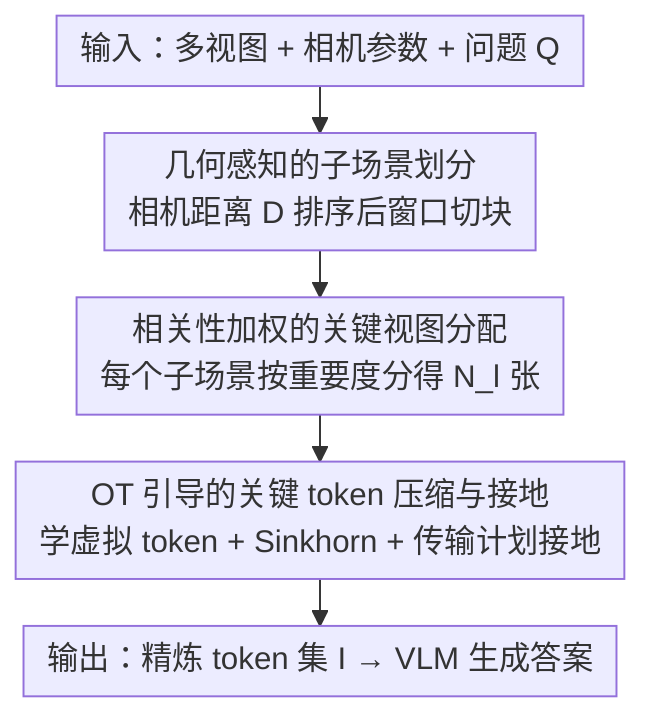

# Zero-Shot 3D Question Answering via Hierarchical View-to-Token Transportation

**会议**: ICML2026  
**arXiv**: [2606.03100](https://arxiv.org/abs/2606.03100)  
**代码**: 待确认  
**领域**: 3D视觉 / 多模态VLM  
**关键词**: 3D问答, 零样本, 关键视图选择, 最优传输, token压缩

## 一句话总结
KeyVT 把"从 3D 点云采样的多视图喂给 2D VLM 做 3D 问答"这件事拆成"先选关键视图、再选关键 token"两级层级流程——视图级用相机几何参数把场景切成空间连续的子场景并按相关性分配预算，token 级用最优传输（OT）压掉跨视图冗余，使免训练方法在 ScanQA/SQA3D/VSI-Bench 上逼近甚至超过需要训练的模型。

## 研究背景与动机
**领域现状**：用 2D 视觉语言模型（VLM，如 GPT-4o、Qwen-VL）做 3D 场景理解正在兴起——从 3D 点云里采样若干 2D 视图，喂给预训练 VLM 就能回答关于场景的问题。相比需要海量"点云-文本"配对数据来对齐几何与语言的 3D-LLM，这条路绕开了稀缺的 3D 标注数据，可扩展性更好。

**现有痛点**：VLM 的输入预算（token 数）有限，远装不下一个场景的全部视图（论文记作 $S\ll|\mathcal{M}|_t$），所以必须挑出一小撮"关键视图"（如 8 或 16 张）。但现有挑视图的方法几乎都只看"视图与问题的语义相关度"，会漏掉那些问题里没明说、却是回答关键的旁证（如被问物体周围的环境）；而且被选中的少数关键视图彼此语义高度重叠，大量 token 是冗余的，白白占着预算。

**核心矛盾**：在固定输入预算下，"保留尽可能多的任务相关 3D 细节"和"只能塞下少量视图/token"之间存在根本冲突。纯语义检索既忽略空间结构、又不处理跨视图冗余，等于把预算浪费在重复信息上。

**本文目标**：在预算约束内找到最优输入上下文 $\mathcal{I}=f(\mathcal{M},Q,S)$，让它既空间连续、又任务相关、还不冗余。

**切入角度**：作者观察到每张视图都带有相机参数（位置、朝向），这天然刻画了视图在 3D 世界里的空间关系——空间上更近的物体往往交互更强。于是把"几何"显式引入视图选择；同时把"压冗余 token"建模成一个分布对齐问题。

**核心 idea**：用"几何感知选视图 + OT 选 token"的两级层级流程，替代单纯的语义检索，在同样预算下塞进更多样、更有代表性的 3D 证据。

## 方法详解

### 整体框架
KeyVT 是一个免训练（tuning-free）的两级输入上下文构造器，夹在"多视图采样"和"VLM 推理"之间。输入是一个 3D 场景的多视图集合 $\mathcal{M}=\{V_1,\dots,V_{|\mathcal{M}|}\}$（每张带相机参数）外加问题 $Q$，输出是满足预算 $S$ 的精炼 token 集合 $\mathcal{I}$，交给 VLM 生成答案 $A=\text{VLM}(\mathcal{I},Q)$。整条流程先在**视图级**用几何把场景切块、按相关性分配关键视图（KeyV），再在 **token 级**用最优传输压掉跨视图冗余、把"虚拟 token"接地回真实 patch（KeyT）。

### 关键设计

**1. 几何感知的子场景划分：用相机参数把场景切成空间连续的块**

纯语义检索只问"这张视图像不像问题"，完全无视视图在 3D 空间里彼此挨着还是隔得远，结果选出的视图可能空间上四散、丢掉了被问物体周围的连续环境。KeyVT 为此定义一个视图距离，同时度量第一张视图 $V_0$ 和第 $i$ 张视图 $V_i$ 的**位置差与朝向差**：

$$D(V_0,V_i)=\|\mathbf{C}_0-\mathbf{C}_i\|+\theta(\mathbf{R}_0,\mathbf{R}_i)$$

其中 $\mathbf{C}=-\mathbf{R}^\top\boldsymbol{t}$ 是世界坐标系下的相机中心，角度差 $\theta(\mathbf{R}_0,\mathbf{R}_i)=\arccos\big(\frac{\text{tr}(\mathbf{R}_0^\top\mathbf{R}_i)-1}{2}\big)$。这个距离直观上刻画了"从第一张视图到第 $i$ 张视图的空间运动轨迹"。把所有视图按 $D$ 排好后，用一个固定窗口大小 $\delta$（论文全程取 $\delta=11$）做窗口切分，得到一串子场景 $\{L_1,\dots,L_{|L|}\}$，每个子场景内部的视图在空间上是连续的、共同捕捉该局部的 3D 细节。这样"周围环境"被天然保留在同一子场景里，而不是被语义检索打散。对没有几何信息的 VSI-Bench，作者用 FastVGGT 从 RGB 帧里估出相机参数，所以方法不强依赖真值标定。

**2. 相关性加权的关键视图分配：把有限的视图预算按子场景重要度分配**

切完子场景后还有个问题：固定只能选 $K$ 张关键视图，怎么在各子场景之间分配？平均分显然不合理——和问题更相关、内容更丰富的子场景该多分几张。KeyVT 先用预训练多模态编码器 BLIP2 给子场景 $L_l$ 算相关性分，把"最大相似度"和"平均相似度"相加：$r_l=\max(O_l)+\text{mean}(O_l)$，其中 $O_{l,i}=\text{BLIP2}(V_i,Q)$。这样既能选出"整体都相关"的子场景，也能捞到"含个别特别显著视图"的子场景。然后按下式分配名额：

$$N_l=\Big\lfloor K\cdot\frac{W_l}{\sum_{l'}W_{l'}}\Big\rfloor,\quad W_l=r_l\cdot\sqrt{|L_l|}$$

权重 $W_l$ 里乘了子场景大小的平方根——因为更大的子场景经验上内容更多样，该多分；但用 $\sqrt{\cdot}$ 而非线性，避免某个超大子场景把预算全吃光。每个子场景内再用 Top-$N_l$ 取相关度最高的视图，最后按时序拼接成关键视图集 $\mathcal{M}^*$。

**3. OT 引导的关键 token 压缩与接地：用最优传输挑出跨视图最有代表性的 token**

选完关键视图后，跨视图仍有大量重叠区域，token 级冗余严重。常见做法是聚类取代表 token，但聚类对密集特征敏感、容易漏掉多样 token。KeyVT 改用最优传输（OT）来求一组数量更少的**虚拟 token** $\mathbf{Q}=\{\mathbf{c}_1,\dots,\mathbf{c}_M\}$，让它覆盖原始 $N$ 个视图 token $\mathbf{P}=\{\mathbf{e}_1,\dots,\mathbf{e}_N\}$（$M<N$）。把两者写成嵌入空间上的离散分布 $\mathbf{P}=\sum_n\alpha_n\boldsymbol{e}_n$、$\mathbf{Q}=\sum_m\beta_m\boldsymbol{c}_m$（无先验时取均匀分布），以余弦距离 $\mathbf{C}_{n,m}=1-\cos(\boldsymbol{e}_n,\boldsymbol{c}_m)$ 为代价，最小化 OT 距离 $d_\mathbf{C}(\mathbf{P},\mathbf{Q})=\min_{\mathbf{T}\in U(\alpha,\beta)}\langle\mathbf{T},\mathbf{C}\rangle$。为提速，用 Cuturi 的熵正则化 Sinkhorn 距离把目标变成完全可微，用 Adam（学习率 1e-2，迭代 10–15 步）轻量优化虚拟 token。

OT 不只给出虚拟 token，还给出传输计划 $\mathbf{T}$——它度量了每个虚拟 token 到各视图 token 的"运输概率"。但虚拟 token 是嵌入空间里学出来的、不对应真实图像 patch，VLM 没法直接吃。于是 KeyVT 用传输计划把每个虚拟 token **接地**回邻近的真实 patch token：对每个 $\mathbf{c}_m$，按 $\mathbf{T}$ 的第 $m$ 列取 Top-$\frac{S}{M}$ 个真实 token，$\text{Nei}(\boldsymbol{c}_m,\mathbf{T})=\{\boldsymbol{e}_i\mid i\in\text{Top-K}(\frac{S}{M},\mathbf{T}_{\cdot,m})\}$，拼起来就是最终输入 $\mathcal{I}$。借 OT 在概率分布空间建模几何结构的能力，挑出的 token 既多样又有代表性，比聚类更稳。

## 实验关键数据

### 主实验
在 ScanQA / SQA3D（基于 ScanNet 的室内 3D-QA）和 VSI-Bench 上，跨三个 2D VLM 骨干评测。对压缩类方法（DivPrune/FLoC/KeyVT）统一先用 KeyV 选 16 帧再压成 8 帧（记作 $8^{\text{eq}}$）以公平对比。

| 骨干 | 方法 | ScanQA CIDEr | ScanQA ROUGE-L | SQA3D EM-1 |
|------|------|--------------|----------------|------------|
| LLaVA-OV-7B | base | 84.0 | 43.1 | 53.9 |
| LLaVA-OV-7B | +AKS | 90.2 | 45.2 | 56.2 |
| LLaVA-OV-7B | +FLoC | 91.1 | 45.6 | 54.8 |
| LLaVA-OV-7B | **+KeyVT** | **93.8** | **46.7** | **57.1** |
| LLaVAVideo-7B | +FLoC | 99.4 | 48.5 | 57.2 |
| LLaVAVideo-7B | **+KeyVT** | **100.7** | **48.8** | **57.9** |

VSI-Bench 平均分上 KeyVT 在三个骨干（LLaVA-OV / LLaVAVideo / Qwen2.5-VL）分别达 33.9 / 34.6 / 37.0，均为对应免训练组最佳，且在 LLaVAVideo 骨干下 ScanQA CIDEr（100.7）超过了需要训练的 Video-3D LLM（同输入设置下 100.6），逼近训练型方法。

### 消融实验

| 配置 | ScanQA CIDEr | 说明 |
|------|--------------|------|
| KeyVT（完整） | 100.7 | 几何划分 + 相关性分配 + OT 压缩 |
| w/o 几何感知设计 | 93.8 | 去掉相机几何，掉 6.9，影响最大 |
| w/o 子场景划分 | 99.8 | 不切子场景 |
| w/o 相关性打分 | 99.4 | 不按相关度加权分配 |

另一组（Table 3）把视图选择单独拎出来比：仅换视图选择不做 token 压缩，KeyV 对 Qwen 骨干在 VSI-Bench 上 37.7 vs AKS 36.4、ScanQA CIDEr 70.2 vs 67.3，说明几何感知的视图选择本身就更强。

### 关键发现
- **几何信息是头号功臣**：去掉几何感知设计 CIDEr 从 100.7 跌到 93.8（−6.9），远超去掉子场景划分（−0.9）或相关性打分（−1.3），印证"相机参数提供的空间结构"是核心增益来源。
- **对相机噪声鲁棒、不依赖真值标定**：注入 1%/5%/10% 相机参数噪声后 CIDEr 仍有 100.1 / 100.0 / 98.4；用 VGGT 估计的相机参数（100.0）几乎追平真值相机（100.7），说明方法可用在没有标定的场景。
- **OT 压缩优于聚类/语义压缩**：相比 DivPrune、FLoC 这类语义/聚类压缩，OT 通过最小化传输距离能保留更多样、代表性更强的 token，多数指标上更优。

## 亮点与洞察
- **把相机外参当成免费的几何先验**：相机的旋转矩阵和平移向量本就附在每张视图上，作者用一个简单的"位置差 + 朝向差"距离就把场景切成空间连续子场景，几乎零额外成本却带来最大增益——这是最巧妙的一点。
- **用 OT 的传输计划做"虚拟 token → 真实 patch"的接地**：很多压缩方法学出来的代表特征没法直接喂 VLM，KeyVT 直接复用 OT 的副产物 $\mathbf{T}$ 来 ranking 真实 token，既解决了"虚拟 token 不可读"的问题，又不引入额外模块，思路干净。
- **层级"先视图后 token"的预算复用**：压掉冗余 token 等于腾出预算塞更多视图（16 压成 8 等效帧），在不增计算量的前提下让 VLM 看到更多场景，这套"省下来再花出去"的预算思路可迁移到长视频理解等任意"输入预算紧张"的任务。

## 局限与展望
- **依赖 BLIP2 的相关性打分**：视图相关性由预训练 BLIP2 度量，其语义偏差会直接传导到子场景分配，对 BLIP2 不擅长的细粒度/专业场景可能选偏。
- **窗口大小固定为单一值**：$\delta=11$ 全程通用、未随场景尺度自适应，过大/过小的场景可能切得不够合理；论文也未充分探讨 $\delta$ 的敏感性。
- **OT 迭代仍有逐场景开销**：虚拟 token 需对每个场景在线优化 10–15 步 Adam，虽轻量但相比纯前向选择仍有额外推理成本，大规模部署时是潜在瓶颈。

## 相关工作与启发
- **vs 3D-LLM（PointLLM / LL3DA / 3D-LLaVA）**: 它们直接拿 3D 点云做输入、靠 3D-文本损失对齐几何与语言，受限于稀缺的高质量配对数据；KeyVT 改走 2D patch 输入，免训练且 pipeline 更简单，反而在细粒度 3D-QA 上更强。
- **vs 视频关键帧选择（AKS / BOLT / Q-Frame）**: 这些方法面向长视频选关键帧，只看 query-frame 相关度、不建模 3D 空间几何；KeyVT 引入相机参数做几何感知划分，且额外做 token 级 OT 压缩，更适配 3D 场景。
- **vs 聚类/语义 token 压缩（DivPrune / FLoC）**: 它们对密集特征敏感、易漏多样 token；KeyVT 用 OT 在分布空间求代表 token，并用传输计划接地回真实 patch，多样性与代表性更好。

## 评分
- 新颖性: ⭐⭐⭐⭐ 把相机几何 + OT 引入零样本 3D-QA 的输入构造，角度新颖且自洽
- 实验充分度: ⭐⭐⭐⭐ 三骨干三 benchmark + 噪声鲁棒性 + 多组消融，较全面
- 写作质量: ⭐⭐⭐⭐ 动机清晰、公式完整，两级流程讲得明白
- 价值: ⭐⭐⭐⭐ 免训练逼近训练型方法，且"先视图后 token"预算复用思路可迁移

<!-- RELATED:START -->

## 相关论文

- [\[CVPR 2025\] DSPNet: Dual-vision Scene Perception for Robust 3D Question Answering](../../CVPR2025/3d_vision/dspnet_dual-vision_scene_perception_for_robust_3d_question_answering.md)
- [\[CVPR 2026\] MV3DIS: Multi-View Mask Matching via 3D Guides for Zero-Shot 3D Instance Segmentation](../../CVPR2026/3d_vision/mv3dis_multi-view_mask_matching_via_3d_guides_for_zero-shot_3d_instance_segmenta.md)
- [\[CVPR 2025\] MVSAnywhere: Zero-Shot Multi-View Stereo](../../CVPR2025/3d_vision/mvsanywhere_zero-shot_multi-view_stereo.md)
- [\[ICML 2026\] HOI-PAGE: Zero-Shot Human-Object Interaction Generation with Part Affordance Guidance](hoi-page_zero-shot_human-object_interaction_generation_with_part_affordance_guid.md)
- [\[CVPR 2026\] Zoo3D: Zero-Shot 3D Object Detection at Scene Level](../../CVPR2026/3d_vision/zoo3d_zero-shot_3d_object_detection_at_scene_level.md)

<!-- RELATED:END -->
