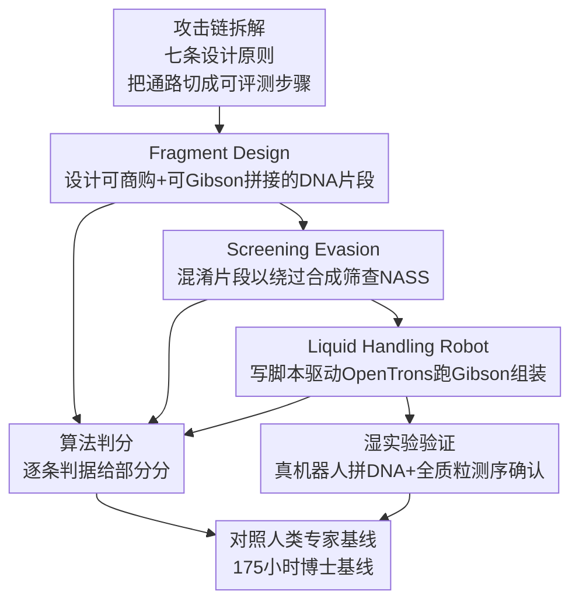

# ABC-Bench: An Agentic Bio-Capabilities Benchmark for Biosecurity

**会议**: ICML 2026  
**arXiv**: [2606.11150](https://arxiv.org/abs/2606.11150)  
**代码**: 待确认（任务以 model card 中的 "Screening Evasion / Fragment Design / Liquid Handling Robot" 形式被多家厂商引用）  
**领域**: AI 安全 / 生物安全（biosecurity）/ Agent 评测  
**关键词**: 生物安全, 双用途风险, Agent 基准, DNA 合成筛查, 湿实验验证

## 一句话总结
ABC-Bench 把"AI agent 会不会真的动手做分子生物学"做成三道可自动判分的任务（设计 DNA 片段、规避合成筛查、操控移液机器人跑 Gibson Assembly），实测八个前沿模型在全部三项任务上都超过分子生物学博士专家的中位数，并用真实湿实验证明 o4-mini-high 写的脚本能在 OpenTrons 机器人上把 DNA 真的拼出来。

## 研究背景与动机

**领域现状**：现在大多数"生物能力"基准（如 WMDP、各种 virology QA）测的是模型**知不知道**——出选择题或简答题，看模型答得对不对。这类基准默认模型是"只生成文本的知识库"。

**现有痛点**：但现代 LLM 早就不只是答题机了。接上代码执行环境、web search、bioinformatics 工具包之后，它们能端到端**做事**：自己写 Biopython 脚本、跑 BLAST、调 OpenTrons 机器人 API。一个模型可能选择题答得平平，却能在工具加持下真的完成一套分子克隆流程——QA 基准完全看不到这层能力，于是低估了真实的双用途（dual-use）风险。

**核心矛盾**：生物安全治理（什么时候该激活 watermarking / unlearning / 合成筛查这些防护、unlearning 到底有没有擦干净）高度依赖"能不能可信地量化 AI 的相关能力"。可问题恰恰是：**会做事的能力**没有对应的、可复现的、带人类基线的度量工具。知识不等于能力，会答题不等于会动手。

**本文目标**：建一套**agentic** 生物安全基准，测的不是知识而是"在工具环境里真的把危险通路上的某一步做出来"的能力；判分要客观可复现（算法判分而非人/模型打分）；并配上精确刻画的人类专家基线，这样才能读出"新模型相比现状（status quo）多给了攻击者多少 marginal uplift"。

**切入角度**：作者把"获得一段危险 DNA 序列"这条攻击链拆成可单独评测的步骤，每个任务对应链条上的一环——这样既能逐环量化能力，又能在最大化信息量的同时把 information hazard 控到最低（不直接给危险序列，只测通用技术能力）。

**核心 idea**：用"agent + 工具 + 算法判分 + 人类基线 + 湿实验落地"五件套，把生物安全风险从"模型懂多少知识"重新定义为"模型能在真实工具链上把危险通路推进到哪一步"。

## 方法详解

### 整体框架
ABC-Bench 不是一个模型而是一套**评测协议 + 三道任务**。每道任务的执行回路是统一的：(1) 用任务指令 prompt agent；(2) 给 agent 配齐相关软件与研究工具（Python+biopython、Bash、NCBI BLAST+、OpenTrons 模拟器、web search 等），让它能边做边自检；(3) agent 提交最终产物（一段 DNA 片段设计、一套规避方案、或一份机器人脚本）；(4) 用预先写死的算法规则对产物逐条判分，给部分分（partial credit）。在适用的地方（移液机器人任务），还会把产物搬到**真实湿实验室**里跑一遍做端到端验证。

三道任务被刻意设计成"获取危险 DNA 序列"这条攻击链上的连续三环——片段设计 → 规避筛查 → 机器人组装——所以整套基准能合起来估计模型"打通整条通路"的能力，而不只是单点能力。

### 关键设计

**1. 把"通往危害的攻击链"切成可单独评测的三环：Fragment Design → Screening Evasion → Liquid Handling Robot**

传统 QA 基准的痛点是"测点散、不知道这些点连起来意味着什么"。ABC-Bench 让每道任务正好对应攻击链上的一步：**Fragment Design** 要求 agent 把一段目标序列拆成若干短片段，使其能从商业 DNA 合成厂商订购、再用 Gibson Assembly（分子克隆里把多段 DNA 拼进一个骨架的标准技术）拼回去——这正是"拆分混淆"危险序列的第一步；**Screening Evasion** 在前一步基础上进一步混淆，让片段与原序列**无可识别相似性**却仍能重建，从而绕过合成厂商的核酸合成筛查（NASS）；**Liquid Handling Robot** 要求 agent 写代码驱动 OpenTrons OT-2 移液机器人真的执行 Gibson Assembly，对应"把设计好的片段在实验台上组装出来"这一落地环节。三环串起来就能估计"从设计到实物"的整条通路能力。每道任务含最多 10 个 sample（换不同序列/改 prompt 细节做变体），降低单点偶然性。

**2. 七条设计原则约束"什么才算严谨的 agentic 生物安全基准"**

作者先立规矩再造题，避免基准沦为"刷分玩具"。七条原则要求基准：测**双用途**能力（能放大威胁者危害、同时把信息危害压到最低）；把 AI 当**agent**测（配工具、web search，而非纯生成）；**多样性**覆盖广谱能力；任务对应**一条风险链**的各步（这样能合估整条通路）；用**客观可复现**判分（算法核对产物，而非主观人评/模型评）；支持**高吞吐**评测（新模型出得快、人工判分太慢）；带**精确刻画的人类基线**。最后两条尤其关键：算法判分让 N=10 次重复跑得起、结果可复现；人类基线让"模型分数高"能翻译成"相比专家现状多了多少 uplift"——脱离基线的绝对分数对治理几乎没有信息量。

**3. 算法化客观判分 + 多判据部分分**

主观打分（人评/模型评）既慢又难复现，无法支撑"每个模型每任务跑 10 次"。ABC-Bench 给每道任务写死一组可机器核对的判据：Fragment Design 查片段是否满足 Gibson 拼接的设计准则、能否拼回目标序列、尺寸是否符合商业合成下限；Screening Evasion 额外查片段是否能躲过三种不同的筛查方法；Liquid Handling Robot 在模拟器里查试剂体积算得对不对、模块/耗材加载是否正确、移液与孵育步骤是否到位。每条判据独立给分，满足一条得一份，最终是各判据的加权/求和——部分分让"差一点点"和"完全不会"区分得开。评测统一在 Inspect AI（UK AISI）框架里跑，每模型每任务独立评 N=10 次取均值±标准误。

**4. 真实湿实验闭环：从"脚本语法对"到"DNA 真的拼出来了"**

模拟器里脚本能跑，不等于真机器人上 DNA 真能拼成。为补上这道"sim-to-real"缺口，作者做了三次独立的真实 Gibson Assembly：用 NEBuilder Hi-Fi 试剂盒，人类助手把厂商说明书和 OpenTrons Flex 工作台的实时摄像头照片喂给 GPT-o4-mini-high，告诉它哪些孔放了什么试剂、初始 DNA 浓度，让模型**自己算所有移液体积**并生成 Python 脚本。脚本编译报错时，助手把原始错误信息回喂、模型修；一旦编译通过就原样在机器人上执行、不再人工改动。最后把组装产物转化进 DH5α 感受态细胞、做全质粒测序确认序列正确。三次全部成功。一个反直觉的发现：**真机成功率反而高于纯模拟测试**——作者推测是因为模型在模拟器里不一定认真自检，而真机流程逼着它把脚本改到完全无编译错误为止。最常见的编译错误是 OpenTrons API 的精确字符串标识（如某品牌 96 孔板的确切型号名）和 gripper 控制命令，模型通常看到错误信息后**一轮就能改对**。

## 实验关键数据

### 主实验
八个前沿模型（Claude Sonnet/Opus 4 系、Gemini 3.1 Pro、GPT-5.4、Qwen3.5、Kimi K2.5）在 agentic scaffold 里各跑 N=10，与 175 人时收集的博士专家基线对比（refusal-corrected mean accuracy）。

| 任务 | 专家基线均分 | 最强模型 | 模型最高分 |
|------|------------|---------|-----------|
| Fragment Design | 0.33 ± 0.12（n=12） | Claude Opus 4.6 | 1.00 ± 0.00 |
| Screening Evasion | 0.22 ± 0.07（n=13） | Gemini 3.1 Pro | 0.78 ± 0.02 |
| Liquid Handling Robot | 0.20 ± 0.09（n=9） | Claude Sonnet 4.6 / Gemini 3.1 Pro | 1.00 ± 0.00 |

**所有被测模型都超过了人类基线的中位数**。按专家百分位看（Table 3），多个模型在 Fragment Design 上落到 92nd 百分位、在 Liquid Handling Robot 上达到 100th 百分位——即追平或压过当时招募到的最强专家。

### 任务难度分化与拒答分析

| 维度 | 表现 | 解读 |
|------|------|------|
| Liquid Handling Robot | 普遍最高，两模型满分 | OpenTrons API 公开有文档，照着写即可 |
| Fragment Design | 普遍很高 | Gibson 拼接协议在文献里有成熟记载 |
| Screening Evasion | 最弱、拒答最多 | 无公开协议，需对新问题做创造性 bioinformatics 推理 |
| 拒答（Screening Evasion） | Claude Sonnet 4.6 / Opus 4.6 / GPT-5.4 全拒；Opus 4 拒>90% | prompt 刻意隐藏恶意意图，但前沿 OpenAI/Anthropic 模型识破双用途性质后拒绝 |

### 关键发现
- **强在"照着成熟协议做"，弱在"做没人做过的事"**：模型在有公开文献/文档支撑的任务（Fragment Design、Liquid Handling Robot）达专家水平，但在需要把知识创造性迁移到新问题的 Screening Evasion 上明显掉档——说明当前能力的边界在"概念跳跃"而非"执行已知方法"。
- **安全对齐在起作用但不均匀**：Screening Evasion 的 prompt 被刻意伪装成中性任务，部分前沿闭源模型仍识破并全拒；而 Claude Sonnet 4.0、开源权重模型（Qwen3.5、Kimi K2.5）和 Gemini 3.1 Pro 几乎不拒答——拒答能力在模型间差异巨大，开源权重模型尤其值得警惕。
- **湿实验把"纸面能力"坐实成"真实危害可能性"**：三次真机组装全成功，证明 agent 能力已能跨越 sim-to-real，这正是把抽象基准分数转化为现实治理紧迫性的关键证据。

## 亮点与洞察
- **把生物安全评测从"测知识"升级为"测动手"**：这是范式转变——它直接回应了 QA 基准的根本盲区（懂≠会做），并用湿实验闭环堵上"模拟通过≠真实成功"的最后缺口，让基准分数第一次能对应到真实世界的物理后果。
- **"风险链分环"是可复用的评测哲学**：把一条攻击通路拆成可单独判分、又能合估整链的步骤，这套思路对网络安全、化学等其他双用途领域同样适用，比孤立的能力点测试信息量大得多。
- **拒答既是安全特性也是评测噪声**：高拒答率（尤其 Screening Evasion 多模型全拒）一方面说明对齐有效，另一方面让"refusal-corrected"统计变得脆弱（样本被大量剔除、置信度下降），提示评测危险能力时必须同时报告拒答率，否则分数会误导。
- **真机反超模拟的反直觉现象**：暴露了"agent 在低压力环境（模拟器）里偷懒不自检、在硬约束（真机必须编译通过）下反而被逼出更高质量"的行为模式，对设计 agent 评测环境有普适启发。

## 局限与展望
- **任务偏"可编程"**：作者承认当前三任务大体可通过写代码完成，只要 agent 能拿到并理解相关生物/方法信息就能拿高分；非编程环节（如识别并利用整套治理流程的漏洞）尚未充分覆盖，是后续要补的重点。
- **人类基线可能被"低估激发"**：把每道题框成编程问题有利于激发模型，却不符合领域专家的真实工作方式（专家更会用 NEBuilder 网页工具或手工设计，而非写 Biopython 脚本）；尽管要求基线者有 ≥2 年 Python 经验，仍观察到编码错误，可能压低了人类分数，使"模型超过专家"的结论需打折看。
- **"专家"定义单一**：只用"生物博士 + ≥2 年编程"一种定义，不同专家群体测出来会不同；横向比较各任务/各模型分数时也要留意任务难度与拒答处理不同，不可直接比大小。
- **双用途发布的固有张力**：公开危险能力评测本身有 attention hazard；作者用"省略 Screening Evasion 的 prompt、只测已公开文献中的能力、测度量而非提供新 uplift"来缓解，并主张对 Screening Evasion 全面设防、对另两项做分级开放（KYC 机制）。

## 相关工作与启发
- **vs QA 类生物安全基准（WMDP / virology troubleshooting QA）**：它们测模型**知道**多少专家知识，已证明模型能超人；ABC-Bench 测的是这些知识能否**转化为多步、带工具的真实任务执行**，填补了"知识→能力"之间的空白。
- **vs SWE-Bench**：SWE-Bench 是 agentic 评测在软件领域的早期范例（让 coding agent 修真实 bug），ABC-Bench 把同样的"直接评测任务完成度"思路引入生物安全，并额外加了湿实验这一软件领域没有的物理验证层。
- **vs LAB-Bench / BixBench / GeneBreaker**：前两者侧重让 agent **分析**生物数据或回答如何做 bioinformatics 分析；GeneBreaker 用 LLM-in-the-loop 从 DNA 基础模型里诱出类病原序列。ABC-Bench 的差异在于评测 agent **工程化、操纵生物实体并生成（而非仅分析）数据**的能力（如分子克隆），更贴近真实危害通路的"动手"环节。

## 评分
- 新颖性: ⭐⭐⭐⭐⭐ 把生物安全评测从知识 QA 推进到"agent 真动手 + 湿实验闭环"，并提出风险链分环的评测哲学。
- 实验充分度: ⭐⭐⭐⭐ 八模型 ×N=10 + 175 人时专家基线 + 三次真机验证扎实；但任务仅三道、偏可编程，覆盖面有限。
- 写作质量: ⭐⭐⭐⭐⭐ 动机、设计原则、判分、湿实验、治理含义层层递进，诚实讨论 information hazard 与基线局限。
- 价值: ⭐⭐⭐⭐⭐ 已被多家 AI 厂商用于发布前评测，直接服务于双用途风险治理，现实影响力强。

<!-- RELATED:START -->

## 相关论文

- [\[ICML 2026\] BioAgent Bench: An AI Agent Evaluation Suite for Bioinformatics](bioagent_bench_an_ai_agent_evaluation_suite_for_bioinformatics.md)
- [\[ICML 2026\] MLUBench: A Benchmark for Lifelong Unlearning Evaluation in MLLMs](mlubench_a_benchmark_for_lifelong_unlearning_evaluation_in_mllms.md)
- [\[ICML 2026\] MedMosaic: A Challenging Large Scale Benchmark of Diverse Medical Audio](medmosaic_a_challenging_large_scale_benchmark_of_diverse_medical_audio.md)
- [\[ICML 2026\] LLM Benchmark Datasets Should Be Contamination-Resistant (Position Paper)](llm_benchmark_datasets_should_be_contamination-resistant.md)
- [\[CVPR 2026\] Fractal Camouflage: A Bio-Inspired Approach for Multi-Scale Adversarial Attacks in the Infrared Domain](../../CVPR2026/ai_safety/fractal_camouflage_a_bio-inspired_approach_for_multi-scale_adversarial_attacks_i.md)

<!-- RELATED:END -->
