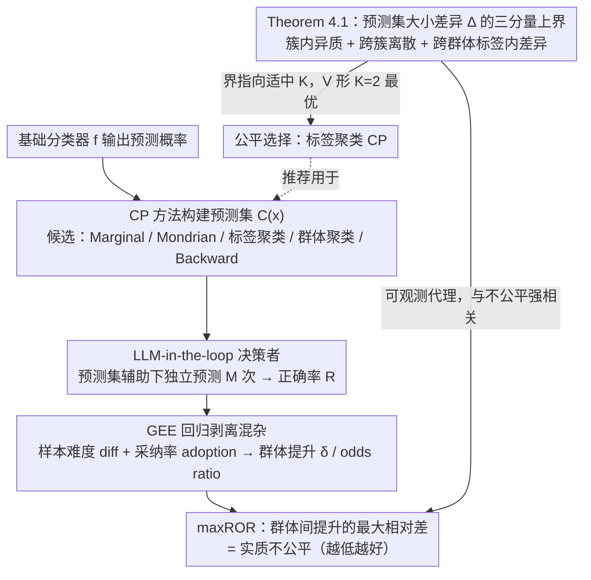

# Beyond Procedure: Substantive Fairness in Conformal Prediction

**会议**: ICML2026  
**arXiv**: [2602.16794](https://arxiv.org/abs/2602.16794)  
**代码**: https://github.com/layer6ai-labs/llm-in-the-loop-conformal-fairness  
**领域**: AI安全/公平性  
**关键词**: 保形预测, 实质公平性, 预测集大小差异, 标签聚类, LLM评估器  

## 一句话总结
本文超越保形预测（CP）的过程公平性视角，从下游决策的实质公平性出发，理论证明并实验验证了**等化预测集大小**（而非等化覆盖率）才是与实质公平强相关的程序指标，并提出基于 LLM-in-the-loop 的可扩展评估框架和标签聚类 CP 方法来有效平衡效用与公平。

## 研究背景与动机

**领域现状**：保形预测（Conformal Prediction, CP）为机器学习模型提供无分布假设的不确定性量化，通过构建满足 $\mathbb{P}[y \in \mathcal{C}(x)] \geq 1-\alpha$ 的预测集来给出统计保证。在公平性方面，现有研究主要关注**过程公平性**（procedural fairness），即保证各人群组的覆盖率相等（Equalized Coverage），例如 Mondrian CP 对每个敏感群体独立校准阈值。

**现有痛点**：覆盖率平等 ≠ 下游决策公平。一个 CP 方法可以对所有群体都达到 90% 覆盖率，但对一个群体产出紧凑有用的预测集，对另一个群体则产出庞大无用的集合。Cresswell et al. (2025) 通过人类实验发现，Mondrian CP 虽然等化了覆盖率，反而加剧了下游预测精度的群体差异（disparate impact）。

**核心矛盾**：覆盖率平等（Equalized Coverage）与预测集大小平等（Equalized Set Size）是两个相互对抗的目标——追求前者往往以牺牲后者为代价，而后者才真正影响下游公平。但这种关联此前缺乏理论解释和大规模实证验证。

**本文目标**：(1) 建立可扩展的实质公平性评估框架替代昂贵的人类实验；(2) 厘清过程指标与实质公平之间的定量关系；(3) 理论分析并验证标签聚类 CP 为何能有效降低集合大小差异。

**切入角度**：作者观察到下游决策者从预测集获得的"准确率提升"才是公平性的真正衡量标准，而非预测集本身的统计属性。利用 LLM 近似人类决策行为，可以低成本地大规模评估这种下游提升的群体差异。

**核心 idea**：用 LLM-in-the-loop 评估器替代人类实验来度量实质公平（maxROR），并通过理论界将预测集大小差异分解为三个可解释分量，指导使用标签聚类 CP 来降低下游不公平。

## 方法详解

### 整体框架

本文不提出新的 CP 算法，而是回答一个诊断性问题：哪个**可观测的过程指标**真正预示下游决策的实质公平？为此它把整条链路看成三层——基础分类器 $f$ 先输出预测概率，CP 方法据校准集构建预测集 $\mathcal{C}(x)$，最后由一个决策者（人类或 LLM）在预测集辅助下做最终预测。关键在于：公平性不在构建预测集的第二层衡量，而在第三层用各群体从预测集获得的"准确率提升"来度量。整套方法由一条理论界、一个评估框架、一种 CP 选择共同支撑：评估框架沿这条链路逐层把"实质不公平"测成可复算的 maxROR，理论界解释该用哪个过程指标做代理、该选哪种 CP。

### 关键设计

**1. 预测集大小差异的理论分解（Theorem 4.1）：把"实质公平"这个不可观测量翻译成可优化的过程量**

实质公平本身无法直接优化——你看不到"如果换一种 CP 决策者会不会更公平"。本文的破局点是证明：群体间预测集大小差异 $\Delta_{a,b}$（一个完全可观测的过程量）才是与下游不公平强相关的代理，并把它的上界对标签聚类映射 $h:\mathcal{Y}\to[K]$ 拆成三个可解释分量——(I) 簇内标签异质性 $\max_k \epsilon_{k,a}$，刻画同一簇里不同标签的集合大小差异；(II) 跨簇差异 $\max_k \mu_{k,a}-\min_k \mu_{k,a}$，刻画不同簇之间期望集合大小的离散度；(III) 跨群体标签内差异 $|\sum_y \mathbb{P}(Y=y\mid A=b)(r_{y,a}-r_{y,b})|$，刻画相同标签下两个群体的集合大小差异。这个分解直接给出了簇数 $K$ 的取舍逻辑：$K=1$（即 Marginal CP）时所有标签混在一起，项 (I) 被推大；$K=|\mathcal{Y}|$ 时每个稀有标签单独校准、样本太少导致阈值不稳，项 (II) 被推大；只有适中的 $K$ 能同时压住两项。后文 V 形曲线的实证（$K=2$ 最优）正是这条界的直接体现。

**2. LLM-in-the-loop 实质公平性评估框架：把昂贵的人类实验换成可大规模复算的代理**

要验证"集合大小差异预示下游不公平"，必须真的测出各群体的下游准确率提升，而这本来依赖人类实验——Cresswell et al. (2025) 那套约 £1500、3 万次响应，根本无法跨方法跨模态系统性铺开。本文改用 LLM 近似人类决策者：对每个测试样本 $x_j$ 和 CP 方法 $t$，让 LLM 在预测集辅助下独立预测 $M$ 次，得正确率 $R_{jt}$；再用 GEE 回归 $\text{logit}(\mathbb{E}[R_{jt}])\sim \text{treat}_t\times\text{group}_j+\text{diff}_j+\text{adoption}_{jt}$ 把样本难度 $\text{diff}_j$、采纳率 $\text{adoption}_{jt}$ 等混杂剥离，提取群体特异性提升 $\delta_{t,a}$。实质不公平指标定义为各群体提升的最大相对差 $\text{maxROR}_t=\max_{a,b}(\text{OR}_{t,a}/\text{OR}_{t,b})-1$，其中 odds ratio 都相对于"无预测集"的 control 基线计算，从而抵消任务难度等共因。这样单次评估从约 £1500 降到约 \$1（60k 预测），还顺带消除了人类疲劳与学习效应；实验进一步确认它与人类评估在定性排序上一致（只是绝对数值不同）。

**3. 标签聚类 CP 作为公平选择：不碰敏感属性也能压低集合大小差异**

既然集合大小差异是要压低的目标，自然要问哪种 CP 能压得最好。直觉做法 Mondrian CP 按敏感群体分别校准阈值，虽然等化了覆盖率，却因为切分校准集、每组样本变少而放大方差，反而制造出人为的群体集合大小差异。标签聚类 CP 换了个轴：它按标签难度相似性把 $\mathcal{Y}$ 聚成 $K$ 簇，每簇共享一个阈值 $\hat{q}_k$，标签 $y$ 进入预测集当且仅当 $s(x_{\text{test}},y)\leq \hat{q}_{h(y)}$。由于同簇阈值跨群体共享、且校准数据被汇聚而非切分，它既绕开了对敏感属性的显式条件化，又避免了 Mondrian 的方差膨胀——相当于在标签层面做自适应、在群体层面保持中立，间接得到更公平的集合分布。这也解释了为何 Mondrian 和同样条件化于群体的 Group-Clustered CP 在实验里实质不公平最严重，而标签聚类反而最优。

## 实验关键数据

### 实验设置
覆盖四种模态（图像/文本/音频/表格），四个数据集（FACET、BiosBias、RAVDESS、ACSIncome），比较五种 CP 方法（Marginal、Mondrian、Label-Clustered、Group-Clustered、Backward），$1-\alpha=0.9$。

### 主实验：实质公平性 maxROR (%)

| CP 方法 | FACET | BiosBias | RAVDESS | ACSIncome | 平均排名 |
|---------|-------|----------|---------|-----------|---------|
| Marginal | 9.0 | 6.9 | 11 | — | 中等 |
| Mondrian | 38 | 8.1 | 79 | — | 最差 |
| Label-Clustered | — | — | 最低之一 | 最低之一 | **最佳** |
| Group-Clustered | 高 | — | 高 | — | 差 |
| Backward | 最低 | 最低 | 较高 | 较高 | 中等 |

> Label-Clustered CP 在 RAVDESS 和 ACSIncome 上 maxROR 显著低于 Backward，同时提供更高的准确率提升（实用性更强）。Mondrian 和 Group-Clustered 在 FACET 和 RAVDESS 上不公平性最严重。

### LLM 评估器验证：与人类实验的对齐

| 评估方式 | 数据集 | Marginal maxROR% | Mondrian maxROR% | 定性排序一致 |
|---------|--------|-------------------|-------------------|------------|
| Human-in-the-loop | FACET | 26 | 51 | ✓ |
| Human-in-the-loop | BiosBias | 12 | 33 | ✓ |
| Human-in-the-loop | RAVDESS | 1.0 | 28 | ✓ |
| LLM-in-the-loop | FACET | 9.0 | 38 | ✓ |
| LLM-in-the-loop | BiosBias | 6.9 | 8.1 | ✓ |
| LLM-in-the-loop | RAVDESS | 11 | 79 | ✓ |

> 所有三个数据集上 LLM 评估器均复现了 Mondrian > Marginal 的不公平排序，验证了其作为人类实验替代的可行性。

### 关键发现：过程指标与实质公平的关系
- **Coverage gap 与 maxROR 负相关**：等化覆盖率反而增加下游不公平（4 个数据集回归斜率均为负）
- **Set size gap 与 maxROR 正相关**：减小集合大小差距能降低下游不公平（4 个数据集回归斜率均为正）
- 标签聚类 CP 的集合大小差异随簇数 $K$ 呈 **V 形曲线**，$K=2$ 时最优，验证了 Theorem 4.1 的预测

## 亮点与洞察
- **颠覆性结论**：CP 公平性研究长期聚焦 Equalized Coverage，本文有力论证了这是错误目标——Equalized Set Size 才是实质公平的正确代理
- **低成本评估**：LLM-in-the-loop 将公平性评估成本从 £1500 降至 $1，使得跨方法、跨模态的系统性比较首次成为可能
- **理论-实证闭环**：Theorem 4.1 的三分量分解在 RAVDESS 上数值验证了界的紧性，且 V 形曲线与实证完全吻合
- **实用建议**：避免按人口统计属性条件化（Mondrian），优先使用标签聚类 CP 并通过 set size gap 诊断选择超参数 $K$

## 局限性 / 可改进方向
- LLM 评估器与人类在**绝对数值**上存在差异（仅定性排序一致），不能完全替代人类实验
- 仅研究了相关性，未建立过程指标→实质公平的**因果关系**（作者提出控制 adoption rate 作为未来方向）
- 标签聚类 CP 的最优 $K$ 对 set size gap 和 maxROR 的最小化点不完全重合，选择 $K$ 仍需下游验证
- 实验仅覆盖 4 个数据集，覆盖率 $\alpha$ 也仅测试 0.1 一个值

## 相关工作与启发
- **Cresswell et al. (2025)** 首次通过人类实验揭示 Mondrian CP 的 disparate impact，本文将其系统化并大幅扩展
- **Ding et al. (2023)** 提出的聚类保形预测原用于改善条件覆盖率，本文发现其在公平性上的意外优势
- **启发**：可将 LLM-in-the-loop 评估范式推广到其他需要人类评估的 AI 公平性场景（如推荐系统、信息检索）

## 评分
- 新颖性: ⭐⭐⭐⭐ (将 CP 公平性从过程指标推向实质结果，LLM 替代人类评估是新颖贡献)
- 实验充分度: ⭐⭐⭐⭐ (4 种模态 × 5 种方法的全面对比 + 理论验证)
- 写作质量: ⭐⭐⭐⭐⭐ (逻辑清晰，理论-实证-实践建议环环相扣)
- 价值: ⭐⭐⭐⭐ (对 CP 公平性研究方向有重要纠偏价值)

<!-- RELATED:START -->

## 相关论文

- [\[AAAI 2026\] Breaking the Dyadic Barrier: Rethinking Fairness in Link Prediction Beyond Demographic Parity](../../AAAI2026/ai_safety/breaking_the_dyadic_barrier_rethinking_fairness_in_link_prediction_beyond_demogr.md)
- [\[ICML 2026\] Position: Beyond Sensitive Attributes, ML Fairness Should Quantify Structural Injustice via Social Determinants](position_beyond_sensitive_attributes_ml_fairness_should_quantify_structural_inju.md)
- [\[ICML 2026\] COFT: Counterfactual-Conformal Decoding for Fair Chain-of-Thought Reasoning in Large Language Models](coft_counterfactual-conformal_decoding_for_fair_chain-of-thought_reasoning_in_la.md)
- [\[ICLR 2026\] Beyond Match Maximization and Fairness: Retention-Optimized Two-Sided Matching](../../ICLR2026/ai_safety/beyond_match_maximization_and_fairness_retention-optimized_two-sided_matching.md)
- [\[ICLR 2026\] Fair Conformal Classification via Learning Representation-Based Groups](../../ICLR2026/ai_safety/fair_conformal_classification_via_learning_representation-based_groups.md)

<!-- RELATED:END -->
