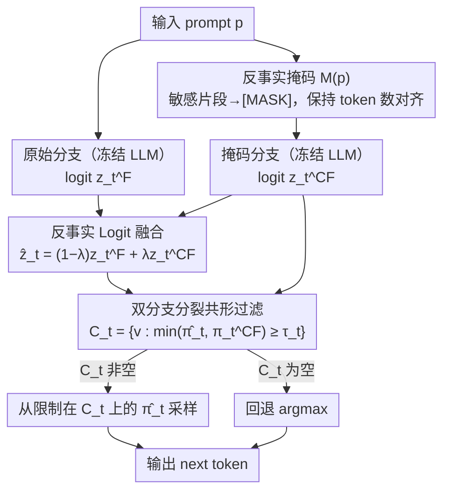

# COFT: Counterfactual-Conformal Decoding for Fair Chain-of-Thought Reasoning in Large Language Models

**会议**: ICML 2026  
**arXiv**: [2605.30641](https://arxiv.org/abs/2605.30641)  
**代码**: 无  
**领域**: LLM安全/公平性  
**关键词**: 反事实公平性, 共形预测, 链式推理去偏, 解码时干预, 无训练去偏  

## 一句话总结

COFT 通过在解码时构造反事实掩码分支并与原始分支进行 logit 融合，再用双分支分裂共形预测过滤 token，以无训练、免梯度的方式在冻结 LLM 上实现了逐步 token 级别的反事实公平性保证，将偏见指标降低 30–55%（中位 38%）且几乎不损失任务性能。

## 研究背景与动机

**领域现状**：大语言模型（LLM）在 CoT（链式推理）生成过程中会逐 token 暴露并放大训练数据中的社会偏见——即使最终答案看似中立，推理轨迹中也可能包含有害的刻板联想。

**现有痛点**：已有的去偏方案各有局限。数据清洗和微调需要重新训练且可能损害通用能力；辅助分类器引导的方法（如 DExperts、GeDi）依赖外部模型并继承其盲区；表示空间去偏（如 INLP）做全局线性投影，无法适应特定 prompt 语义，且可能误删合法内容。

**核心矛盾**：上述方法都缺少两个关键属性的同时满足：(1) **逐步统计保证**——在每一步解码时，无法保证所选 token 在敏感属性替换后仍然稳定；(2) **局部反事实对等**——公平性目标通常只在聚合层面定义，而非逐 token 操作。

**本文目标**：设计一个解码时框架，同时实现三个属性——逐 token 反事实不变性、无梯度/模型无关（适用于冻结权重）、可审计的逐步边际保证。

**切入角度**：将每个 prompt 同时构造为原始（factual）和掩码（masked）两个分支，通过对比两者的 logit 分布差异来定位并消除敏感属性驱动的偏差。再利用共形预测（Conformal Prediction）的分布无关保证来过滤不安全 token。

**核心 idea**：用反事实掩码 + logit 凸插值融合 + 双分支共形过滤，三阶段联合实现无训练的逐 token 反事实公平性解码。

## 方法详解

### 整体框架

COFT 想解决的是：冻结的 LLM 在逐 token 生成推理链时会暴露并放大社会偏见，而我们既不想重训也不想接外部分类器，还希望每一步都有可审计的统计保证。它的做法是把每个 prompt 同时跑成"原始"和"去敏感"两个世界，再用三个串起来的阶段处理每一步解码：先把 prompt 中的敏感词替换成中性哨兵得到掩码 prompt $\tilde{p}=M(p)$，再对原始和掩码两组 logit 做凸插值融合以衰减属性驱动的偏差，最后用离线校准的双分支共形阈值过滤候选，只从两个世界都高概率支持的 token 里采样。整条流水线只多一次缓存的前向传播，不碰梯度、不动权重、不依赖辅助模型。

### 关键设计

**1. 反事实掩码：构造一个与原始 prompt 严格对齐的"去敏感"分支**

要做逐 token 的反事实对比，就必须有一个除了敏感属性以外一切都相同的对照世界。COFT 定义了一个确定性掩码算子 $M$，把 prompt 里每个敏感片段 $s\in S$（性别、种族等标识词）替换成中性哨兵 token `[MASK]`。这里的关键是**保持 token 数量不变**：如果某个敏感片段被 tokenizer 切成 $k$ 个 token，就替换成 $k$ 个哨兵副本，从而保证原始分支和掩码分支在每个绝对位置上严格对齐，逐位的 $z_t^F \leftrightarrow z_t^{CF}$ 配对比较才成立。之所以选"掩码"而不是别的——直接删掉敏感片段会破坏语法和注意力几何，替换成另一个身份又会注入一份新偏见，只有掩码既保住了结构又切断了与敏感属性的直接词汇关联。

**2. 反事实 Logit 融合：在 logit 源头机械地抹掉属性驱动的概率偏差**

有了两个对齐的分支后，两者在同一位置的 logit 之差 $\Delta_t = z_t^F - z_t^{CF}$ 就恰好刻画了"这一步有多少是被敏感属性推着走的"。COFT 不去显式建模这个偏差，而是直接做凸插值得到融合 logit $\hat{z}_t = (1-\lambda) z_t^F + \lambda z_t^{CF}$，其中 $\lambda\in[0,1]$ 控制去偏强度。在概率空间这等价于两个分支分布的归一化几何混合 $\hat{\pi}_t(v) \propto (\pi_t^F(v))^{1-\lambda}(\pi_t^{CF}(v))^{\lambda}$，$\lambda$ 越大越靠近去敏感世界。$\lambda$ 通过验证集偏见-效用 Pareto 曲线的拐点选取，通常落在 $\lambda\approx 0.6$。把融合放在过滤之前是有意为之：先在 logit 层面压掉虚假放大方向，后续的共形过滤就能在已经对齐的高概率区域上工作，少误拒、阈值也不必过度保守。

**3. 双分支分裂共形过滤：给每一步采样集盖上一个分布无关的统计认证**

光做融合还不够——它降低了偏差，却没有"这个 token 在反事实下也稳定"的保证。COFT 为此设计了双分支非一致性得分 $s_t(v) = 1 - \min\{\hat{\pi}_t(v), \pi_t^{CF}(v)\}$：只有当 token $v$ 在融合分布**和**掩码分布里都足够高概率时，得分才低。离线阶段在校准集上对所有真实 next-token 算出这个得分，取 $(1-\alpha)$ 分位数 $q_t$ 当阈值；在线解码时构造候选集 $C_t = \{v : \min\{\hat{\pi}_t(v), \pi_t^{CF}(v)\} \geq \tau_t\}$（$\tau_t = 1 - q_t$），然后从限制在 $C_t$ 上的 $\hat{\pi}_t$ 条件分布采样，若 $C_t$ 为空则回退到 $\arg\max$。借助分裂共形预测的分布无关性质，每步都拿到一个边际覆盖保证。单分支共形只看原始世界、保证不了反事实稳定，而双分支强制 token 同时被两个世界支持，正是把"反事实对等"直接操作化成了一个标准的分位数校准问题。

## 实验关键数据

### 主实验：偏见度量

| 数据集 | 指标 | Vanilla | SDD | DExperts | DT-CD | COFT | 改善(vs DT-CD) |
|--------|------|---------|-----|----------|-------|------|----------------|
| StereoSet (LLaMA-13B) | Bias↓ | 0.41 | 0.36 | 0.33 | 0.31 | **0.26** | -16% |
| CrowS-Pairs (LLaMA-13B) | Acc↑ | 58.7 | 60.1 | 61.0 | 61.3 | **63.5** | +2.2 |
| BBQ (LLaMA-13B) | Bias Rate↓ | 0.27 | 0.22 | 0.20 | 0.19 | **0.14** | -26% |
| BOLD (LLaMA-13B) | Toxicity↓ | 0.123 | 0.105 | 0.099 | 0.094 | **0.079** | -16% |
| Utrecht (LLaMA-13B) | DP Gap↓ | 0.184 | 0.153 | 0.149 | 0.141 | **0.118** | -16% |
| COMPAS (LLaMA-13B) | Bias Gap↓ | 0.161 | 0.147 | 0.141 | 0.136 | **0.119** | -12% |
| BBQ (Mistral-7B-Inst) | Bias Rate↓ | 0.24 | 0.20 | 0.18 | 0.17 | **0.12** | -29% |
| Utrecht (Mistral-7B-Inst) | DP Gap↓ | 0.173 | 0.146 | 0.141 | 0.136 | **0.112** | -18% |

### 消融实验

| 配置 | BiasAvg↓ | UtilityAvg↑ | 说明 |
|------|----------|-------------|------|
| COFT (完整) | **0.129** | 68.0 | 三阶段全开 |
| w/o 融合 (仅CP) | 0.171 | 68.2 | 去掉 logit 融合后偏见指标升高 32% |
| 单分支CP (仅factual) | 0.158 | 68.1 | 无法保证反事实稳定性 |
| 仅融合 (无CP) | 0.149 | 67.9 | 缺少统计认证，残留偏见 |

### 关键发现

- **Logit 融合贡献最大**：单独去掉融合后 BiasAvg 从 0.129 升至 0.171（+33%），是三个组件中贡献最大的，因为它在 logit 源头机械性地衰减了属性驱动的 log-odds 偏差
- **双分支 vs 单分支 CP**：双分支 CP 比单分支额外减少 18% 偏见（0.158→0.129），验证了要求 token 同时在两个世界有高概率支持的必要性
- **任务性能几乎无损**：COFT 在 GSM8K、StrategyQA、ARC-easy、PIQA 上与 Vanilla 差距 ≤ 0.2 点，PPL 和 MAUVE 也几乎无差异
- **效率开销可控**：额外约 10.2% 的吞吐量开销（相当于一次缓存前向传播），峰值显存仅增加 ≤ 0.8 GB
- **$\lambda$ 和 $\alpha$ 的敏感性**：$\lambda$ 在 0.4–0.8 范围内偏见-效用 Pareto 曲线较平稳，默认取拐点 $\lambda \approx 0.6$；$\alpha = 0.10$ 是共形过滤的最佳风险水平

## 亮点与洞察

- **三阶段解耦设计**：掩码→融合→过滤的流水线使每个组件可独立分析和替换，融合先压缩 logit 差异空间再交给共形过滤，二者协同效果远超单独使用，这种"先去噪再认证"的范式可迁移到任何需要在解码时施加约束的场景
- **共形预测在公平性中的创新应用**：将分布无关的统计保证从传统的"置信集"场景拓展到"反事实稳定性认证"，通过双分支得分设计将公平性约束转化为标准的分位数校准问题，方法论上具有通用性
- **完全免训练的实用优势**：只需一次额外缓存前向传播（≤11% 开销），适用于任何冻结 LLM 检查点，无需权重访问、辅助分类器或微调，对于 API-only 部署场景极具实用价值

## 局限与展望

- **敏感片段检测依赖外部工具**：COFT 控制的是解码时对已识别敏感片段的使用，但本身不是万能的隐式偏见检测器；未被识别的代理词（proxy terms）可能逃逸
- **保证为边际覆盖而非条件覆盖**：共形预测提供的是边际（marginal）而非输入条件（conditional）保证，在分布严重偏移时可能失效
- **序列级别保证需要额外处理**：当前逐步保证不直接延伸到整条推理链，需要用联合上界或 rollout score 校准来获得端到端控制
- **$\lambda$ 选取需验证集**：需要一个干净的验证分裂来做 Pareto 拐点选取，在新领域部署时可能需要重新调优

## 相关工作与启发

- **反事实公平性**（Kusner et al. 2017）提供了核心理论框架，COFT 将其操作化为逐 token 局部对等；**共形预测**（Vovk et al. 2005）提供分布无关保证工具，COFT 创新地将其适配到自回归解码的双分支场景
- 与 DExperts/GeDi 等推理时方法相比，COFT 不需要外部分类器，且提供统计保证；与 INLP 等表示去偏方法相比，COFT 是 prompt 级别自适应的而非全局固定投影
- 启发：可将类似的"反事实掩码+共形过滤"范式推广到其他可信 AI 目标（如隐私保护、事实性约束），通过定义不同的掩码算子和非一致性得分来实现不同的安全属性

<!-- RELATED:START -->

## 相关论文

- [\[ICML 2026\] dgMARK: Decoding-Guided Watermarking for Diffusion Language Models](dgmark_decoding-guided_watermarking_for_diffusion_language_models.md)
- [\[ICML 2026\] Forget to Know, Remember to Use: Context-Aware Unlearning for Large Language Models](forget_to_know_remember_to_use_context-aware_unlearning_for_large_language_model.md)
- [\[ICML 2026\] DualOptim+: Bridging Shared and Decoupled Optimizer States for Better Machine Unlearning in Large Language Models](dualoptim_bridging_shared_and_decoupled_optimizer_states_for_better_machine_unle.md)
- [\[ICML 2026\] BYORn: Bootstrap Your Own Responses to Defend Large Vision-Language Models Against Backdoor Attacks](byorn_bootstrap_your_own_responses_to_defend_large_vision-language_models_agains.md)
- [\[ICML 2026\] The Unlearnability Phenomenon in RLVR for Language Models](the_unlearnability_phenomenon_in_rlvr_for_language_models.md)

<!-- RELATED:END -->
