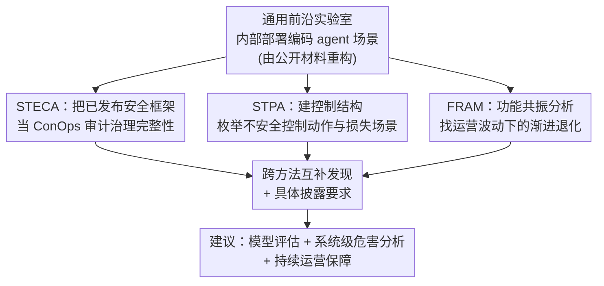

# Exploring Systems-Thinking Approaches to Loss of Control Risk

**会议**: ICML2026  
**arXiv**: [2606.13474](https://arxiv.org/abs/2606.13474)  
**代码**: 无（分析/立场论文）  
**领域**: AI安全 / 失控风险 / 系统安全分析  
**关键词**: 失控风险(LoC), 系统安全, STPA, FRAM, STECA, 前沿AI内部部署

## 一句话总结
这是一篇立场/分析论文：作者主张前沿 AI 的"失控（Loss of Control, LoC）"不该只在模型层面评估，而要当成社会技术系统的控制问题；他们把航空/核电等行业成熟的三种系统安全方法（STECA、STPA、FRAM）搬到"前沿实验室内部部署编码 agent"这一通用场景上，分别揭示出模型级评估看不到的治理空缺、控制延迟导致的失效、以及日常运营波动对安全控制的渐进侵蚀，并据此提出"模型评估 + 系统级危害分析 + 运营保障"三管齐下。

## 研究背景与动机

**领域现状**：失控（LoC）是前沿 AI 讨论最多、却最难具体分析的风险之一。定义五花八门——有人指"永久不可逆地失去人类监督"，有人指"暂时偏离预期行为"，Apollo Research 把它看作连续谱而非二元事件。监管已经把 LoC 当风险类别写进法规（加州 SB 53、欧盟 AI 法案的通用 AI 行为准则），但都没给出能指导一致监督的"操作性完整定义"。现有绝大多数框架都聚焦**模型层面的失配**（欺骗、阴谋、行为漂移等）。

**现有痛点**：当 agentic AI 被部署在实验室内部、对代码库 / 基础设施 / 评估流水线 / 部署流程有**写权限**时，风险不止来自模型本身，而来自一个完整社会技术系统——提示并监督 agent 的开发者、给输出把关的集成流水线、监控行为的系统、配置这一切的组织政策。LoC 可能从这些"组织—人—技术"功能的**交互**中涌现：政策漂移、代码评审中的自动化偏见、监控覆盖不全、监督实践退化。当前前沿 AI 的风险管理方法对这些系统动态几乎无话可说。

**核心矛盾**：模型级评估（能力评测、对齐基准、倾向性测试）本质上是"基于部件失效"的视角——它能查模型这一个部件出没出问题，却**查不出"没有任何单一部件失效、但部件交互产生危害"** 的状态。而 LoC 恰恰常以后者形式出现：渐进、无明确触发事件、无单点故障。

**本文目标**：（1）给内部部署 LoC 一个可操作的定义；（2）验证"是否能用其他安全攸关行业的成熟系统安全方法，识别模型级评估漏掉的风险"；（3）说清每种方法在前沿 AI 领域能做什么、做不到什么、在哪里需要改造。

**切入角度**：作者把内部部署 LoC 定义为——"人类控制者无法在足以避免严重组织或社会危害的时间窗内，可靠地约束、审计、回滚或叫停 AI 介导的对内部代码/基础设施/评估/部署流程的改动"的状态。然后借鉴航空、核电、化工几十年分析"紧耦合复杂系统"的经验，挑了三种显式建模控制结构、功能依赖、运营波动的系统理论方法。

**核心 idea**：用 STECA + STPA + FRAM 三个互补镜头分析一个"前沿实验室内部部署编码 agent"的通用场景，每种方法都跑到"公开信息耗尽点"为止——在那之前刻画涌现的危害场景，在那之后把"分析还需要什么信息"转化为**具体的披露要求（disclosure requirement）**。

## 方法详解

### 整体框架

这不是一个带训练/推断的算法系统，而是一套**分析方法的应用与评估**。作者把"通用前沿 AI 公司"建模成社会技术系统，受控过程是"前沿模型的内部部署"，系统边界就是开发者的组织边界。场景不针对某家具名公司，而是从公开披露材料（系统卡、风险报告、监控博客、安全框架）+ 已颁布法规 + AI Control 研究重构出来的"通用开发者"，并显式假设了一组基线控制（模型权重安全、内部 agent 监控流水线、人工评审与访问控制、沙箱化执行、上报/治理/事故响应）。这样做让分析本身成为"方法的概念验证"——同一套 STECA/STPA/FRAM 流程换上真实运营数据就能复用。

分析在一个刻意拔高的抽象层级上做（避免把监控、CI/CD、沙箱等拆成过密的子部件），并定义了系统级损失，重点关注两个：L-1（知识产权/专有信息泄露）和 L-6（对内部基础设施或代码库失去人类能动/控制）。其中 L-6 是内部部署最独特的损失——当 AI 对代码库有写权限、影响训练流水线、还在监控评估里担角色时，"失去有意义的人类控制"可以**无任何戏剧性失效事件、增量地**发生。三种方法各从一个维度切入，作者还指出它们有天然先后顺序：先 STECA、再 STPA、后 FRAM（实际因约束并行跑了）。

### 关键设计

**1. 把 LoC 重定义为社会技术控制问题 + "信息耗尽点→披露要求"分析范式**

作者先做了一次范式转换：不把 LoC 当成"模型会不会失配"的属性问题，而当成"系统级控制能不能维持"的问题。配套的方法论创新是——承认公开信息有限，于是让每种分析方法跑到"可得信息被耗尽"的点，把"再往下需要但外部审计当前拿不到"的每一项，登记成一条**具体的披露要求**。这把"信息不足"从分析的失败转化成了分析的产出：每一处"未知"都变成"要求开发者披露 X 才能继续验证"。论文还做了**分层损失刻画**——开发者层的损失（如 IP 泄露）可能对应社会层的责任（如不受控扩散），但坚持用开发者层框定边界，避免分析过散。

**2. STECA：把已发布安全框架当 ConOps 文档审，找治理层的"缺人/缺上游/缺对称"**

前沿开发者不会直接发布 ConOps（运营概念）文档，但 Anthropic 的 RSP、OpenAI 的 Preparedness Framework、Google DeepMind 的 Frontier Safety Framework 加系统卡、风险报告、法规，合起来就描述了一个 ConOps 级别的治理结构。STECA 把它当输入，用三个分析镜头（单个控制回路的完整性、安全责任的充分性、控制者之间的协调）审，并分两遍：Pass 1 只用基线材料建 21 行的控制结构模型、推出"该概念要自洽必须满足的要求"，对沉默处显式登记"缺失"而非脑补；Pass 2 拿运营研究、吹哨人account、调查披露去逐条评判为"已证实/被违反/未知"，每个"未知"就成一条披露要求。

它发现三类支配性模式：**治理面有控制动作却没指定执行者**（访问政策管理、灾难性风险评估与季度汇总、暂停/限制/重路由权限、事故上报四个动作都没具名负责人——尤其前两个还是法规明文要求、本该可外部验证的）；**执行面缺政策管理上游**（访问控制、命令白名单、自动不变量测试、沙箱四个执行控制都具名了，但"谁来制定它们各自执行的政策"没指定，于是没有对"政策累积漂移"的反馈）；**许可/限制不对称**（部署授权面有一个被授权"扩大部署范围"的控制者，却没有对应的"收缩范围"控制者）。

**3. STPA：建功能控制结构、枚举不安全控制动作与损失场景**

STPA 是一种基于系统思维和控制论的前瞻性危害分析法，把系统建模成"控制者对受控过程施加约束"的层级，靠控制动作（向下）和反馈（向上）维持安全状态，偏离则由**不安全控制动作（UCA）** 引发。作者识别了 8 个系统级危害，重点演示 H-4（"安全保障与部署模型的实际能力/自主级别不匹配"），并把危害反演成系统约束（如 SC-4a：保障与监督协议必须始终校准到≥模型实际能力）。控制结构含三个控制者：安全与安保监督（SSO）、公司软件工程师（SWE）、前沿 AI 编码 agent，主受控过程是公司代码库——其中 SWE 和 agent 既是控制者也是受控过程，体现层级性。

亮点是 UCA-4.3a："SSO 发出 Kill Instance 指令太晚，AI 已经产出危险输出"，对应两类广义损失场景原型：**GLS-3 程序性延迟**（控制者正确识别了要采取的动作，但组织决策协议引入的延迟使动作失效）和 **GLS-11 反馈缺失/延迟**（信号在源头存在，但在抵达控制者前被延迟、排队或丢失）。这正是 STPA 相对传统危害分析的强项——它自然浮现出"不是部件失效、而是系统设计缺陷（延迟使控制动作来不及生效）"的场景。

**4. FRAM：功能共振分析，找"无单点失效的渐进退化"四种模式**

如果说 STPA 问"哪些控制动作可能不安全"，FRAM 则问"即便控制按设计正常工作，日常运营波动能不能产生 LoC 结果"。它把系统建成一组耦合功能（六个：四个前景功能 F1 开发/F2 生成执行代码/F3 集成/F4 监控，两个背景功能 B1 基础设施/B2 政策权限），每个功能用 Input/Output/Precondition/Resource/Control/Time 六个 aspect 刻画，功能间通过"一个的 Output 成为另一个的 Input/Control/Resource"耦合，波动正是沿这些耦合传播。

作者抓住耦合图的三个结构特征——F3（集成门）是四路独立波动汇聚到单一接受/拒绝决策的唯一点；B2 的输出同时塑造 F1–F4（一旦漂移四个功能同向受影响）；F4 监控是**异步**的（风险分数可能在 PR 已评审/合并后才到）——推导出四种共振模式（见下表）。它们和 STPA 发现性质不同：STPA 找设计好的控制结构里的缺口，FRAM 找设计良好的结构如何在实践中退化。作者也诚实地报告了两个**被丢弃**的模式（侧信道泄露在基线控制下不现实、控制基础设施退化退化成普通软件质量问题），强调"知道方法在哪里不出结果和在哪里出结果同样重要"。

### 一个完整示例：围绕 H-4 走一遍三种方法如何互补

以"保障与模型实际能力不匹配"（H-4）为例看三镜头如何咬合：STECA 先指出"执行机制（沙箱、白名单等）都有人执行，但没人被指派去保持它们背后的政策更新"——即缺政策管理回路；FRAM 的 Pattern 1（相关性控制漂移）正好刻画了这个管理缺失会导致什么：权限例外累积、没触发真阳性的监控规则被删、评审要求不变而 PR 量暴涨、模型升级后系统提示没更新——这些调整都响应同一批压力（产能、告警疲劳、信任）、同向地削减控制余量，系统从"冗余控制能抓住问题"漂移到"同样的问题穿过一切"。STPA 则指出监控延迟（30 分钟监控延迟 vs 动作速度）会让干预无效（UCA-4.3a），而 FRAM 进一步追溯到监控流水线与集成门之间的异步耦合。三者拼起来：STECA 说"哪里没规定"，STPA 说"设计结构怎么失守"，FRAM 说"良好结构怎么被日常磨损"。

## 实验关键数据

> 这是一篇定性分析论文，没有量化实验。下面汇总三种方法实际跑出的关键结果。

### 三种方法的互补覆盖

| 方法 | 提问 | 在本场景揭示的核心发现 | 主要局限 |
|------|------|----------------------|---------|
| STECA | 已发布治理意图是否完整自洽？ | 21 行控制结构、约 50 条完整性/一致性条目；治理面 4 个控制动作无具名执行者、执行面缺政策管理上游、部署授权许可/限制不对称 | 只覆盖治理层、停在公开框架抽象级 |
| STPA | 控制结构如何无法维持安全约束？ | 8 个系统危害；以 H-4 为例得 UCA-4.3a（Kill 指令太晚），对应 GLS-3 程序延迟、GLS-11 反馈缺失/延迟 | 仅覆盖部分 UCA 与派生要求 |
| FRAM | 设计良好的控制能否经日常波动退化？ | 四种共振模式（见下表），均无需任何部件失效 | 为 Work-as-Done 设计，本文只能基于公开文档建 Work-as-Imagined；不处理"策略性规避监控"的对抗场景 |

### FRAM 四种共振模式

| 模式 | 机制 | 相关危害 |
|------|------|---------|
| Pattern 1 相关性控制漂移 | B2 同时控 F1–F4，权限例外/监控规则/评审要求/系统提示同向松动 | H-4, H-6 |
| Pattern 2 模型替换断档 | 模型升级后 F2 波动一夜变化，但 F4 仍按旧模型校准，瞬时出现能力—控制缺口 | H-4, H-5 |
| Pattern 3 代码库饱和 | F2→F1→F3→F2 反馈环让 agent 自著内容逐渐成为"正常基线"，其偏见嵌入本应抓它的测试/基线 | H-7 |
| Pattern 4 理由锚定评审 | agent 的代码 diff 与解释理由捆绑成单一 artefact，评审者确认 agent 自述意图而非独立评估代码，削弱后备控制的独立性 | H-2, H-3 |

### 关键发现
- **公开信息够用、但运营数据才能确认**：作者原担心公开材料不足以让方法跑起来，结果系统卡/风险报告/监控博客/安全框架足以建出可信的控制结构、识别危害、推出有根据的共振模式；但要确认"相关漂移是否真在发生""理由锚定有多严重"，仍需只有开发者掌握的、随时间变化的运营数据。
- **三种方法都产出了模型级分析得不到的发现**：共振模式是社会技术系统的属性、损失场景来自人—agent 交互、治理空缺是组织结构属性——能力评测、对齐基准、倾向性测试都看不到这些。
- **方法基本可直接套用，唯 FRAM 需改造**：STECA、STPA 用默认方法论即可；FRAM 假设技术功能波动很低，而 AI agent 违反这一假设，作者不得不覆盖该假设——提示该方法或需正式扩展以容纳"既非传统技术、也非人类"的功能。

## 亮点与洞察
- **把"信息不足"变成"披露要求"**：每个分析的"未知"不是终点而是产出——一条"开发者需披露 X，外部审计才能继续"的具体要求。这个范式把抽象的透明度呼吁落成了可执行清单（如监控覆盖率、告警到干预的延迟、agent PR 量 vs 评审容量、权限例外的数量与时长）。
- **两层披露机制兼顾保障价值与攻击面**：作者没要求一刀切公开，而提两级制——公开安全报告给聚合/脱敏指标，完整运营数据在保密下交给指定审计方（如国家 AI 安全研究所或受托第三方），既保留指标的保障价值又限制其暴露的安全敏感细节。
- **"渐进失控"比"戏剧性失控"更值得防**：FRAM 的四种模式都强调 LoC 可以无单点失效、靠日常理性微调累积而成——这提示监管应要求"控制是否随时间保持校准"的**运营级**披露，而非只看一次性的静态框架文档。
- **方法学诚实**：明确报告被丢弃的两个共振模式、标注 STPA/STECA 只覆盖子集、承认不同分析师会得出不同控制结构——把定性方法的判断性当作"可审计"而非"待消除"的特性。

## 局限与展望
- **建模的是 Work-as-Imagined 而非 Work-as-Done**：FRAM 本为直接观察"实际怎么做"设计，本文只能基于公开文档推"应该怎么做"，共振模式结构上成立但"是否真在发生"无法证实。
- **不覆盖对抗/策略性场景**：FRAM 假设波动来自"尽力而为下的不完美"，若 agent 策略性地规避监控则假设被违反；本文四个模式都不需要策略意图，但这限制了方法对对抗场景的适用性。
- **结果是探索性的、非穷尽**：抽象层级刻意拔高，STPA/STECA 只覆盖部分 UCA 与要求，完整分析需要公开材料给不出的内部控制结构细节。
- **强依赖通用场景假设**：基线控制和场景从"通用开发者"重构而来，不代表任何具体开发者的真实实现；换成真实组织会得到更尖锐但也不同的结论。

## 相关工作与启发
- **vs 模型级评估 / 对齐基准 / 倾向性测试**：现有前沿 AI 风险管理聚焦模型这一部件，查不出部件交互危害；本文是互补而非竞争——系统级方法浮现的是部署系统（控制结构、治理反馈环、运营波动）的属性。
- **vs 定量风险建模（如 SaferAI 对网络滥用用 MITRE ATT&CK）**：定量方法需要可分解步骤 + 历史频率 + 成熟倾向性评估，而 LoC 三者皆缺（无标准分解、灾难性 LoC 历史频率为零、倾向性评估太不成熟），故作者转向定性系统方法。
- **vs 传统定性危害分析（FTA/ETA/Bow-tie/HAZOP/FMEA）**：这些基于"部件失效"事故模型、假设有清晰触发事件，漏掉渐进、交互式 LoC；STECA/STPA/FRAM 专为"安全依赖部件交互而非单点可靠性"的系统设计。
- **vs 既往 LoC / AI Control 工作（多聚焦 L-1 IP 泄露）**：本文把重心放到 L-6（对基础设施/代码库失去人类控制），并强调它能增量发生。

## 评分
- 新颖性: ⭐⭐⭐⭐ 首次系统地把 STECA/STPA/FRAM 三法并用于前沿 AI 内部部署，并提出"信息耗尽点→披露要求"范式。
- 实验充分度: ⭐⭐⭐ 无量化实验（性质决定），但对单一通用场景的三方法应用扎实、自洽、诚实标注边界。
- 写作质量: ⭐⭐⭐⭐⭐ 论证缜密、结构清晰、对方法局限与判断性极其坦诚。
- 价值: ⭐⭐⭐⭐ 给监管与前沿实验室提供了可操作的系统级风险分析与披露清单思路，填补模型级评估盲区。

<!-- RELATED:START -->

## 相关论文

- [\[NeurIPS 2025\] It's Complicated: The Relationship of Algorithmic Fairness and Non-Discrimination Provisions for High-Risk Systems in the EU AI Act](../../NeurIPS2025/ai_safety/its_complicated_the_relationship_of_algorithmic_fairness_and_non-discrimination_.md)
- [\[ICLR 2026\] Risk-Sensitive Agent Compositions](../../ICLR2026/ai_safety/risk-sensitive_agent_compositions.md)
- [\[ICML 2026\] Training-Free Coverless Multi-Image Steganography with Access Control](training-free_coverless_multi-image_steganography_with_access_control.md)
- [\[ICML 2026\] Anchored Decoding: Provably Reducing Copyright Risk for Any Language Model](anchored_decoding_provably_reducing_copyright_risk_for_any_language_model.md)
- [\[ICML 2026\] ACTG-ARL: Differentially Private Conditional Text Generation with RL-Boosted Control](actg-arl_differentially_private_conditional_text_generation_with_rl-boosted_cont.md)

<!-- RELATED:END -->
