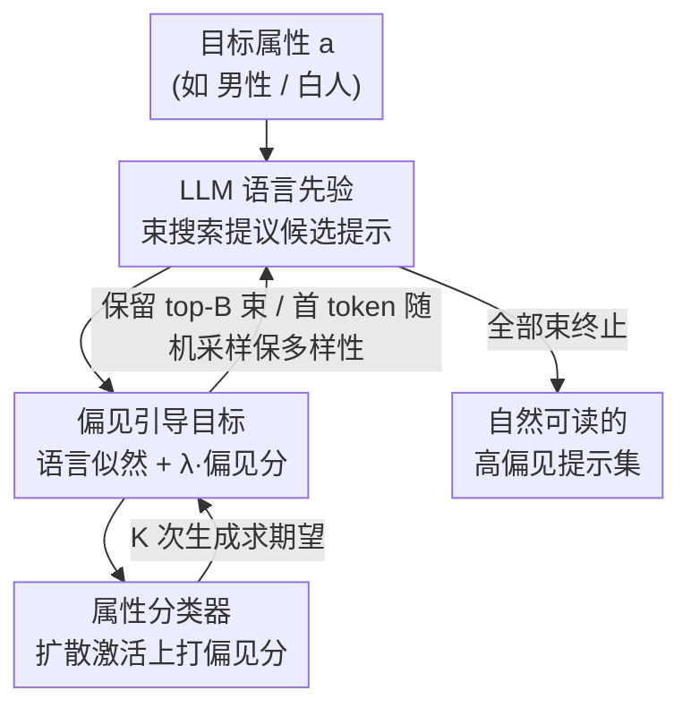

# Exposing Hidden Biases in Text-to-Image Models via Automated Prompt Search

**会议**: ICML2026  
**arXiv**: [2512.08724](https://arxiv.org/abs/2512.08724)  
**代码**: 待确认  
**领域**: AI安全 / 偏见审计  
**关键词**: 文生图偏见, 自动提示搜索, 梯度无关解码, 公平性审计, 扩散模型

## 一句话总结
本文提出 BGPS（Bias-Guided Prompt Search），用扩散模型内部激活上训练的轻量属性分类器去引导一个 LLM 的束搜索解码，自动生成"读起来自然、却能把生成图像往某个性别/种族猛推"的提示词，从而把文生图模型（包括已做过去偏的模型）里隐藏的、人工很难想到的偏见暴露出来。

## 研究背景与动机
**领域现状**：文生图（TTI）扩散模型（SD 1.5、SDXL、Flux、DALL·E 等）画质惊人，但被反复证明会复现甚至放大性别、种族、年龄等社会偏见。要评估和缓解这些偏见，现有做法严重依赖**人工或 LLM 精挑细选的提示数据集**：要么手写一批"a photo of a {职业}"这样的测试提示，要么让 LLM 生成一批，再统计生成图像的人口属性分布是否失衡。

**现有痛点**：策展（curation）有两个硬伤。一是成本高；二是**只覆盖了提示空间里很小的一块**，那些"不显眼但能触发偏见"的提示根本想不到。论文给的例子很直观——"an engineer mentally focusing on a complex design problem, with a serious expression and wearing glasses"在 SD 1.5 上生成 100% 男性脸，而"a doctor with compassionate eyes, warm smile, hands gently folded"生成 85% 女性。这些偏见是被**描述性修饰词和语境线索**编码进去的，而不是显式的"man/woman"。更糟的是：**已经去过偏的模型**在策展基准上看似平衡，却可能对这类语境触发的残余偏见毫无防御。

**核心矛盾**：偏见审计长期卡在"覆盖度 vs 可解释性"的两难上。人工/LLM 策展提示真实可读，但覆盖面太窄；另一条路是**基于梯度的硬提示优化**（如 PEZ），它确实能找到高偏见区域，但产出的是"nurse kerala matplotlib tbody"这种不成句的乱码，既不能给非技术人员看，也无法用来理解偏见机制。

**本文目标**：自动搜出**既自然可读、又能最大化偏见暴露**的提示词，把审计的搜索空间从人工策展扩展到模型自己的语言空间。

**切入角度**：作者借用了 VGD（Visually-Guided Decoding，Kim et al. 2025）这套"梯度无关、用 CLIP 引导 LLM 做硬提示反演"的框架，但做了一个关键替换——把"图像匹配目标"换成"人口属性偏见分数"。这样原本的图像反演工具就变成了偏见发现工具，同时继承了 LLM 的语言先验来保证产出可读。

**核心 idea**：用 LLM 的语言似然当先验、用扩散模型内部激活上的属性分类器当引导信号，在束搜索里联合最大化"提示自然度 + 生成图像偏见度"，从而自动钓出隐藏的偏见提示。

## 方法详解

### 整体框架
BGPS 把"发现偏见提示"形式化成一个联合最大化问题：给定一个目标属性值 $a$（如"男性"），找一个提示 $\bm{s}$，让"生成图像属性 $A=a$ 的概率"和"提示本身的语言先验概率"的乘积最大。直觉上，第一项把提示往偏见区域推，第二项把它拉回"读起来像人话"的区域。

整条流水线是：LLM 逐 token 提议候选续写 → 对每个候选提示，用扩散模型采样 $K$ 张图、过中间层激活、由属性分类器打偏见分 → 把"偏见分 + 语言似然"加权当作束搜索打分 → 留下 top-$B$ 个束继续往下生成，直到所有束都终止。整个过程**梯度无关**（不对扩散过程反传），只需要模型的灰盒访问（拿得到中间激活即可）。

### 关键设计

**1. 偏见引导联合目标：把图像反演目标换成人口偏见分**

这是全文的根基，针对的痛点是"梯度优化能找偏见但产出乱码、LLM 策展可读但覆盖窄"。作者要同时拿到两者的好处，于是定义了一个联合概率最大化目标：让产出的提示 $\bm{s}$ 和"属性 $A=a$"同时成立的概率最大。借助全概率公式并利用"扩散噪声与提示独立"，目标写成

$$\max\;\mathbb{P}(A=a,\bm{s})=\mathbb{E}_{\bm{x}_T,\bm{\epsilon}_{1:T}\sim\mathcal{N}(0,I)}\big[\mathbb{P}(A=a\mid \bm{x}_T,\bm{\epsilon}_{1:T},\bm{s})\big]\,\mathbb{P}(\bm{s}).$$

取对数、用 $K$ 次生成估计期望后，实际优化的打分函数是

$$\max_{\bm{s}} J(a,\bm{s})=\log\mathbb{P}(\bm{s})+\lambda\log\Big(\tfrac{1}{K}\sum_{i=1}^{K}\mathbb{P}(A=a\mid \bm{x}_T^i,\bm{\epsilon}_{1:T}^i,\bm{s})\Big).$$

第一项 $\log\mathbb{P}(\bm{s})$ 是 LLM 给的语言似然，负责把提示约束在自然、合规（不违反指令）的区域，防止退化成乱码；第二项是偏见分，把提示往"更容易生成 $a$ 属性"的方向推。$\lambda$ 是这两股力量的权衡旋钮——后面实验里 $\lambda$ 从 10 调到 100，偏见越拉越猛但困惑度也会上升。妙处在于：这是直接把 VGD 的"图像匹配项"替换成"偏见分项"，一个反演工具就被改造成偏见探测器，而且**梯度无关**，不用对扩散步骤反传。

**2. 扩散激活上的轻量属性分类器：偏见分从哪来**

第二项里的 $\mathbb{P}(A=a\mid\cdot)$ 必须能高效估计，否则束搜索每步都跑不动。作者沿用偏见缓解工作的做法（Shi et al. 2025；Parihar et al. 2024），在 **Stable Diffusion 1.5 UNet 中间层激活**上预训练**线性分类头**来估计"生成图像呈现属性 $a$ 的概率"。用线性头而不是重型分类器，是因为它要在搜索内循环里被反复调用，必须轻。对期望 $\mathbb{E}[\cdot]$ 的处理也很关键：不是用单张图判定偏见，而是对**同一提示采 $K$ 张图取平均**，确保评的是提示的"平均偏见倾向"而非某一次随机的极端样本。这一步只要求灰盒访问（拿得到中间激活），所以 BGPS 能审计很多实际部署的模型。

**3. 带多样性扩展的束搜索解码：既要高分又要钓出不同的偏见提示**

把 $\mathbb{P}(\bm{s})$ 用自回归 LLM 分解成 $\prod_i p(s_i\mid s_{<i})$ 后，提示可以逐 token 打分生成，于是用束搜索选高分续写。但纯束搜索是**确定性**的——同一目标只会吐出同一条提示，没法采样出"多个不同的偏见提示"。作者的解法是：用束宽 $B$、扩展因子 $E$，每步打分 $B\times E$ 个候选并保留 top-$B$；额外再引入一个扩展因子 $E'$ 把初始 LLM 束放大，从放大后的束里**采样** $B\times E$ 个候选；并且因为观察到**第一个 token 对引导方向至关重要**，干脆从完整 LLM logits 分布里采样首 token 来更广地探索提示空间。每步检查哪些束以 EOS 结尾、移出束池存起来，直到所有束终止或到最大长度，再从所有终止束里取最高分返回。这样在"贪心高分"和"探索多样"之间取得平衡。

> 三处一致：框架图里的"LLM 束搜索"对应设计 3，"偏见引导目标 / λ"对应设计 1，"属性分类器 / K 次生成"对应设计 2。

### 损失函数 / 训练策略
没有端到端训练；唯一需要训练的是**激活上的线性属性分类头**，在 SD 1.5 UNet 中间层激活上预训练。搜索阶段全程梯度无关，超参主要是 $\lambda$（偏见 vs 自然度权衡）、$K$（每提示生成次数）、$B/E/E'$（束搜索宽度与多样性）。默认 LLM 先验用 Mistral-7B-v0.2，被指令要求生成"属性中性、像普通用户会输入"的提示。

## 实验关键数据

### 主实验
在 SD 1.5（Base）及其两个去偏变体上评测：**FT**= Shen et al. 2024 的 LoRA 文本编码器微调去偏；**DL**= Shi et al. 2025 的 Difflens 测试时去偏。指标是生成图像里目标属性的**平均频率（越高=越偏，↑）、困惑度 PPL（越低=越自然，↓）、属性泄露率（提示里直接暴露属性而被剔除的比例，↓）**。下表摘 Table 1 性别（male）一列的代表性数字：

| 方法 | Mean Freq (Base) ↑ | PPL (Base) ↓ | 泄露% (Base) ↓ | 说明 |
|------|------|------|------|------|
| Human-curated | 0.53 | 96 | 0 | 人工策展，几乎无偏放大能力 |
| LLM | 0.69 | 71 | 1 | 仅 LLM 生成 |
| LLM (biased) | 0.85 | 119 | 2 | 指令 LLM 生成偏见提示 |
| PEZ（梯度） | 0.80 | 1387 | 94 | 偏见高但**完全不自然**、几乎都泄露属性 |
| BGPS (λ=10) | 0.76 | **53** | 2 | 最自然 |
| **BGPS (λ=100)** | **0.91** | 129 | 17 | 偏见最强 |

关键对比：PEZ 在性别上虽能拉高频率，但 PPL 高达 1387、94% 提示直接泄露属性（基本是乱码且写明性别），毫无审计价值；BGPS 把 PPL 压到几十量级（比 PEZ 自然 **17–26 倍**），同时把男性频率推到 0.91。在种族（Table 2，White 一列）上结论一致：PEZ 的 PPL ≈1773–1897 且泄露率 93–100%，BGPS(λ=100) 把白人频率推到 0.66、PPL 仅 64。

### 去偏模型上的隐藏偏见

| 模型 | 属性 | 人工策展下表现 | BGPS 发现的偏斜 |
|------|------|------|------|
| SD 1.5 (FT 去偏) | 性别 | 看似平衡 | 男性最高 ~76% |
| SDXL | 性别 | — | 男性最高 ~95% |
| SD 1.5 + 'with intense focus' | 性别 | 'scientist' 65% 男 | 加修饰词后升到 95% 男 |

这组结果是最有冲击力的：**去过偏的模型在策展基准上平衡，却挡不住语境触发的残余偏见**。

### 关键发现
- **λ 是偏见–自然度旋钮**：λ=10 时 BGPS 产出最自然（PPL 最低），λ=100 时偏见最强但 PPL 与泄露率上升；二者都远比 PEZ 自然。
- **偏见词有系统性语言关联**：技术/音乐/思考类词（"screens""saxophone""focusing"）关联男性，艺术/手作/文学/情感类词（"creating""library""cozy""tending"）关联女性——说明偏见藏在广义语义关联里，不止职业刻板印象。
- **细微修饰词能剧烈放大偏见**：给"scientist"加"with intense focus"就把性别分布从 65% 男推到 95% 男。
- **偏见超出职业范畴**：把人和物体/活动关联时同样触发偏见（Table 4）。

## 亮点与洞察
- **"换目标项"这一手很优雅**：VGD 原本做图像反演，作者只把 CLIP 匹配项换成激活偏见分，就把一个工具重定向成审计工具，复用了 LLM 语言先验保证可读性——这个"替换目标、复用框架"的思路可迁移到其他属性审计（如安全性、毒性、版权触发）。
- **梯度无关 + 灰盒访问**：不用对扩散反传，只要拿得到中间激活就能审计，工程上比 PEZ 这类需要全程反传的方法便宜得多，也更贴近真实部署模型的审计场景。
- **把"覆盖度 vs 可解释性"两难真正破掉**：以往要么可读但窄、要么广但乱码，BGPS 同时拿到自然度和高偏见，并且产出的提示可直接喂回去偏方法的训练集，形成"发现→缓解"的闭环。

## 局限与展望
- **依赖灰盒访问**：需要扩散模型的中间层激活来训分类器，纯黑盒 API 模型用不了。
- **属性分类器是偏见信号的瓶颈**：线性头在 SD 1.5 中间层激活上训练，分类器本身的偏差/误差会直接污染搜索方向；跨模型迁移（用 SD 1.5 的头去引导 Flux）的有效性需要更仔细的验证。
- **λ 调参与泄露权衡**：偏见拉满时（λ=100）属性泄露率明显上升（性别 17%、种族 16% 的提示因泄露被剔除），说明"自然且强偏见"仍有上限。
- **改进方向**：把单属性扩展到交叉属性（性别×种族×年龄）联合搜索；用更强的非线性分类器或多层激活提升偏见信号质量；把发现的提示系统性回灌到去偏训练里量化"审计→缓解"的收益。

## 相关工作与启发
- **vs PEZ / 梯度硬提示优化**: 都能找高偏见区域，但 PEZ 产出乱码（PPL 上千、泄露率 90%+）、需对扩散反传；BGPS 梯度无关、产出自然可读，PPL 低一两个数量级，是真正能用于审计与机制理解的工具。
- **vs 人工 / LLM 策展（Shen et al. / OpenBias / GELDA）**: 策展提示真实但只覆盖提示空间一小块、对去偏模型的残余偏见无能为力；BGPS 自动扩展搜索空间，能钓出策展想不到的语境触发偏见。
- **vs 偏见缓解方法（Difflens / LoRA 去偏）**: 本文与缓解方法互补——不直接去偏，而是暴露缓解后仍残留的失败模式，发现的偏见提示可加入缓解方法的训练集。
- **vs VGD（Kim et al. 2025）**: 直接借用其梯度无关解码框架，但把图像匹配目标替换为人口属性偏见目标，从图像反演转向偏见发现。

## 评分
- 新颖性: ⭐⭐⭐⭐⭐ 首个自动发现"可解释且最大化偏见"提示的方法，破解覆盖度–可解释性两难。
- 实验充分度: ⭐⭐⭐⭐ 覆盖多模型（SD1.5/2.1/SDXL/SD3.5/Flux）+ 两个去偏模型 + 性别/种族/年龄，对照 PEZ 与策展基线扎实，但部分结论靠分类器质量。
- 写作质量: ⭐⭐⭐⭐ 动机与对比清晰，目标公式推导干净。
- 价值: ⭐⭐⭐⭐⭐ 给文生图偏见审计提供了可落地、可解释、可回灌缓解的新工具，对商业部署审计意义大。

<!-- RELATED:START -->

## 相关论文

- [\[CVPR 2026\] Hidden Dangers of Compositional Generation: Diagnosing Semantic Safety Failures in Text-to-Image Models](../../CVPR2026/ai_safety/hidden_dangers_of_compositional_generation_diagnosing_semantic_safety_failures_i.md)
- [\[CVPR 2026\] PROMPTMINER: Black-Box Prompt Stealing against Text-to-Image Generative Models via Reinforcement Learning and VLM-Guided Optimization](../../CVPR2026/ai_safety/promptminer_black-box_prompt_stealing_against_text-to-image_generative_models_vi.md)
- [\[CVPR 2026\] Towards Human-Imperceptible Backdoor Attacks on Text-to-Image Diffusion Models](../../CVPR2026/ai_safety/towards_human-imperceptible_backdoor_attacks_on_text-to-image_diffusion_models.md)
- [\[CVPR 2026\] JANUS: A Lightweight Framework for Jailbreaking Text-to-Image Models via Distribution Optimization](../../CVPR2026/ai_safety/janus_a_lightweight_framework_for_jailbreaking_text-to-image_models_via_distribu.md)
- [\[CVPR 2026\] GenBreak: Red Teaming Text-to-Image Generation Using Large Language Models](../../CVPR2026/ai_safety/genbreak_red_teaming_text-to-image_generation_using_large_language_models.md)

<!-- RELATED:END -->
