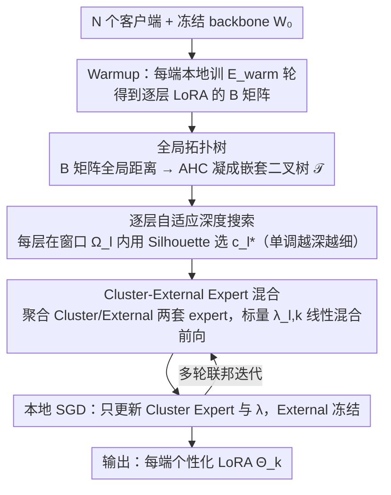

# FedTreeLoRA: Reconciling Statistical and Functional Heterogeneity in Federated LoRA Fine-Tuning

**会议**: ICML2026  
**arXiv**: [2603.13282](https://arxiv.org/abs/2603.13282)  
**代码**: 待确认  
**领域**: llm_safety（联邦学习 / 隐私保护微调）  
**关键词**: 联邦学习, LoRA, 个性化微调, 层级聚类, 异质性  

## 一句话总结
针对联邦 LoRA 微调里"客户端数据异质"和"LLM 各层功能异质"两个维度被现有方法割裂处理的问题，FedTreeLoRA 用一棵全局层次聚类树 + 逐层自适应深度搜索，让浅层尽量共享、深层逐步分化，在 GLUE 和 FLAN 上以最小参数代价把平均指标分别从 91.19 / 61.77 提到 92.36 / 63.19。

## 研究背景与动机

**领域现状**：LoRA + 联邦学习已经是隐私保护下微调 LLM 的标配。主线分两派：要么训一个全局 LoRA（FedIT、SLoRA），要么用 dual-module（FedDPA、FedALT）或客户端聚类（FedLEASE）做个性化。

**现有痛点**：所有现有方法都隐含一个 **Flat-Model Assumption**——不管是 dual module 还是聚类，都把 LoRA 当成一个"整块"，假设"是否共享"这个决策对所有层是统一的。

**核心矛盾**：作者通过两个动机实验指出两个事实：(1) **垂直异质性**——仅聚合浅层比聚合深层好得多，强行聚合深层甚至比纯本地训练还差，因为深层负责语义/任务特化，对客户端数据分布的差异极其敏感；(2) **两种异质性是耦合的**——客户端数据越相似，"安全共享深度"越深；越异质，最优共享边界越往浅层移。所以 flat 假设必然次优。

**本文目标**：设计一个机制，既能给"客户端之间共享多深"这个决策以**逐层不同**的解，又能保持跨层的拓扑一致性（避免相邻层把客户端反复重新分组导致语义不连续）。

**切入角度**：把"客户端关系"建模成一棵**全局层次树**——根代表全员共享，叶代表完全个性化，中间的每一层 cut 对应一种分组方案。每一 Transformer 层只能在这棵树上选一个 cut（且单调地越往深越细），既保证了跨层拓扑一致，又允许逐层自适应。

**核心 idea**：用 **agglomerative hierarchical clustering 在客户端 LoRA $B$ 矩阵上建一棵全局树**，再对每个 Transformer 层用 Silhouette 在"上一层粒度起、最多扩 $K$ 个 cluster"的窗口里搜最优 cluster 数 $c_l^*$，从而把"水平 + 垂直"两个异质维度耦合在一个统一框架里。

## 方法详解

### 整体框架
联邦系统里有 $N$ 个客户端，每端各持私有数据 $\mathcal{D}_k$、共享一个冻结的 backbone $W_0$，目标是给每端学一组个性化 LoRA 参数 $\boldsymbol{\Theta}_k$。FedTreeLoRA 的核心思路是：先让所有客户端 warmup 几轮，把它们之间的关系凝成**一棵全局层次树** $\mathcal{T}$（根=全员共享、叶=全员个性化），然后让每个 Transformer 层独立地在这棵树上选一刀 cut——浅层选靠近根的粗 cut（多客户端共享），深层选靠近叶的细 cut（各自特化），且越深越细单调不回头。选好 cut 后，每层按分组聚合出两套 LoRA expert，用一个可学标量混合做前向。这样"客户端之间共享多深"就从一个全局统一的决策，变成了逐层自适应、又彼此拓扑一致的解。

### 关键设计

**1. 全局拓扑树：把所有候选分组方案塞进一棵树**

直接让每层各自独立聚类会出大问题：相邻两层可能把客户端从 $\{1,2\},\{3,4\}$ 重排成 $\{1,3\},\{2,4\}$，这种"拓扑漂移"会切断前向 pass 的语义连续性，让 expert 特化路径变得不可解释。FedTreeLoRA 的解法是先立一根全局骨架。warmup 阶段每端本地训 $E_{warm}$ 轮得到层级 LoRA $\{A_{l,k}, B_{l,k}\}$；这里**只用 $B$ 矩阵**算客户端距离——因为按 Tian et al. 2024 的观察 $B$ 编码任务特化语义而 $A$ 偏共享——客户端 $i,j$ 的全局距离取所有层的平均 $D^{global}_{i,j} = \frac{1}{L}\sum_l \text{dist}(B_{l,i}, B_{l,j})$，默认用 Frobenius 距离，再用 agglomerative hierarchical clustering（AHC）把 $D^{global}$ 凝聚成一棵二叉合并树 $\mathcal{T}$。这棵树的关键性质是：在它上面切任意一刀都对应一种合法分组，而且相邻两刀是**嵌套**的——粗 cluster 严格包含细 cluster 的成员。正因为有这个嵌套结构，才能保证"浅层被分开的客户端到了深层只会更专、绝不会重新合并到一起"，特化路径天然单调。

**2. 逐层自适应深度搜索：让浅层粗、深层细**

动机实验已经证明"安全共享深度"是数据异质性的函数——客户端越相似能共享得越深——所以共享边界必须逐层可变，而不能一刀切。这一步给每个 Transformer 层 $l$ 在树上选一个最优 cluster 数 $c_l^*$。它先算**层特异**的距离矩阵 $D^{(l)}_{i,j} = \text{dist}(B_{l,i}, B_{l,j})$（注意和全局矩阵不同，这里只看本层的 $B$），再把搜索空间限制成一个从上一层粒度起步、最多扩 $K$ 格的窗口 $\Omega_l = \{c \in \mathbb{Z} \mid c_{l-1}^* \leq c < \min(N, c_{l-1}^* + K)\}$——下界 $c_{l-1}^*$ 强制单调（深层不会比浅层更粗）、窗口 $K$ 限制每层最多细化几格，从而保证整条搜索路径始终沿着树 $\mathcal{T}$ 走、不会乱跳。评分函数为

$$\phi(c; D^{(l)}) = \begin{cases} \tau, & c = 1 \\ \text{Sil}(P_c, D^{(l)}), & c \geq 2 \end{cases}$$

其中 $c=1$（全局共享）用一个阈值 $\tau$ 当门槛，$c \geq 2$ 用 Silhouette 系数衡量分组质量；最终 $c_l^* = \arg\max_{c \in \Omega_l} \phi(c; D^{(l)})$，从根 $c_0^*=1$ 逐层往下解。$\tau$ 在这里扮演"对全局共享的先验偏置"——只有当某层的异质性强到 Silhouette 超过 $\tau$，才值得分裂，否则保留 $c=1$ 的全员共享。

**3. Cluster-External Expert 混合：用一个标量把拓扑落地成可前向的参数**

选好每层的分组 $P_{c_l^*}$ 后，还要把它变成实际能前向的 LoRA。对客户端 $k$ 在层 $l$，记 $\mathcal{S}_k^{(l)}$ 为它所在的 cluster、$\mathcal{R}_k^{(l)}$ 为其余所有客户端，分别聚合出两套 expert：Cluster Expert $\bar{\Phi}_{l,k}^{\text{clus}} = \frac{1}{|\mathcal{S}_k^{(l)}|}\sum_{j \in \mathcal{S}_k^{(l)}} \Phi_{l,j}$ 吸收 peer-group 共识，External Expert $\bar{\Phi}_{l,k}^{\text{ext}} = \frac{1}{|\mathcal{R}_k^{(l)}|}\sum_{j \in \mathcal{R}_k^{(l)}} \Phi_{l,j}$ 保留一条全局知识通道（$\Phi \in \{A, B\}$）。前向把两者用一个**每层每端的可学标量** $\lambda_{l,k} \in [0,1]$ 线性混合：

$$h_l(x) = W_{0,l}x + \lambda_{l,k}(\bar{B}^{\text{clus}}\bar{A}^{\text{clus}}x) + (1-\lambda_{l,k})(\bar{B}^{\text{ext}}\bar{A}^{\text{ext}}x)$$

本地训练只更新 Cluster Expert 和 $\lambda$，External Expert 在该轮冻结；根层 $\mathcal{S}_k = \{1..N\}$（全员一组）时把 External Expert 置零避免冗余。作者刻意用标量混合而非 MoE router，是因为消融显示拓扑对齐本身才是性能主因——光用 Cluster Expert（Cluster-Only）就已超过最强基线 FedLEASE，而换成 MoE router 参数涨 25% 性能反而略降。标量混合把额外可训参数压到约 $0.020\%$，通信成本几乎为零，同时 External Expert 这条全局通路又防止了 cluster 内部信息孤岛。

### 损失函数 / 训练策略
每端只对 Cluster Expert $(\bar{A}^{\text{clus}}_{l,k}, \bar{B}^{\text{clus}}_{l,k})$ 和标量 $\lambda_{l,k}$ 做 $E$ 步本地 SGD，External Expert 冻结。理论上作者在 $\sigma$-smooth + bounded stochastic gradient + LoRA 矩阵有界 + gradient-alignment $(\mu_A, \mu_B > 0)$ 的标准联邦假设下证了 $\mathcal{O}(1/\sqrt{T})$ 收敛率，与 FedAvg、FedSA 同阶，说明树结构聚合没有破坏收敛性。

## 实验关键数据

### 主实验

**NLU (RoBERTa-Large, 20 clients, Dirichlet $\alpha=0.5$, GLUE 四任务平均准确率，rank=4)**

| 方法 | % Param | MNLI | QNLI | SST2 | QQP | Average | $\Delta$ |
|------|---------|------|------|------|-----|---------|----------|
| FedIT | 0.1107% | 83.18 | 87.03 | 93.65 | 84.93 | 87.20 | - |
| FedSA | 0.1107% | 83.63 | 91.32 | 95.87 | 89.33 | 90.04 | +2.84 |
| FedDPA | 0.1107% | 83.97 | 91.31 | 95.72 | 89.74 | 90.19 | +2.99 |
| FedALT | 0.1383% | 84.03 | 90.77 | 96.16 | 89.27 | 90.06 | +2.86 |
| FedLEASE | 0.1521% | 86.21 | 92.56 | 95.63 | 90.36 | 91.19 | +3.99 |
| **FedTreeLoRA** | **0.1107%** | **88.15** | **93.37** | **96.56** | **91.35** | **92.36** | **+5.16** |

**NLG (LLaMA-2-7B 8-bit, 8 clients, FLAN 四任务 ROUGE-1, rank=8)**

| 方法 | % Param | Text Edit | Struct2Text | Sentiment | Reasoning | Average | $\Delta$ |
|------|---------|-----------|-------------|-----------|-----------|---------|----------|
| FedIT | 0.0622% | 59.84 | 51.71 | 44.53 | 74.42 | 57.62 | - |
| FedDPA | 0.0622% | 64.33 | 54.18 | 48.13 | 75.55 | 60.55 | +2.93 |
| FedALT | 0.0699% | 67.61 | 54.06 | 48.57 | 76.84 | 61.77 | +4.15 |
| FedLEASE | 0.0895% | 66.31 | 54.80 | 49.32 | 76.40 | 61.71 | +4.09 |
| **FedTreeLoRA** | **0.0622%** | **68.63** | **55.59** | **51.27** | **77.27** | **63.19** | **+5.57** |

关键：FedTreeLoRA 在两个 benchmark 上**用最少或与 FedIT 持平的参数预算拿到 SOTA**，比最强基线 FedLEASE 还便宜（NLU: 0.1107% vs 0.1521%；NLG: 0.0622% vs 0.0895%）。

### 消融实验

| 配置 | Avg. Acc | 说明 |
|------|----------|------|
| Fixed $k=1$（FedIT 等价的全局共享） | 87.20 | 完全忽视深层异质，underfit |
| Fixed $k=4$ | 91.45 | 粗粒度固定 cluster，比上面好但仍 flat |
| Fixed $k=8$ | 90.74 | 一刀切细粒度反而损伤浅层共享 |
| Layer-wise Adaptive $c_l^*$ | **92.36** | 完整 FedTreeLoRA |
| Independent layer-wise clustering（无全局树） | 89.47 | 跨层拓扑漂移把性能拖下去 3 个点 |
| Cluster-Only（Isolationist，去 External Expert） | 91.40 | 仍然超过 FedLEASE 的 91.19 |
| Decomposed Experts | 92.57 | 略高但通信代价巨大 |
| MoE Router 替 $\lambda$ | 92.02 | 参数涨 25%，性能反而略降 |
| **Scalar-Mixed (Ours)** | **92.36** | 参数仅 +0.020%，性价比最高 |

### 关键发现
- **拓扑对齐才是性能主因**：即使把 External Expert 完全砍掉的 Isolationist 变体（91.40）就已超过最强基线 FedLEASE（91.19），说明"逐层选对 cluster"这件事本身就足以解决大部分异质性问题，复杂路由并非必需。
- **全局树是稳态保证**：去掉全局骨架改用独立聚类掉到 89.47，验证了"相邻层拓扑一致"对前向语义连续性是必要的，不是可有可无的工程细节。
- **固定深度策略全输**：$k=1, 4, 8$ 中最好的 91.45 也明显输给自适应 92.36，且 $k=8$ 比 $k=4$ 还差，证实"一刀切的细粒度"会损伤浅层共享——和动机实验完全一致。

## 亮点与洞察
- **重新解构"联邦异质性"**：把 horizontal（数据分布）和 vertical（层功能）显式拆开并指出二者"源头正交、交互耦合"，这个视角清晰且未被前人系统讨论过；动机实验 2 直接证明"安全共享深度"是数据相似性的函数，足够 motivate 整个树结构。
- **AHC + 单调 cut 这一对组合非常优雅**：用一棵全局树做"候选空间"再逐层在其上做受约束 cut，既给了逐层自适应的自由度、又自动保证了相邻层的拓扑一致性，避免了"自由聚类必然乱跳"的陷阱——这个 trick 完全可以迁移到任何"既要逐位置个性化又要保持全局一致"的多任务/多客户端场景。
- **"拓扑比容量重要"的实证**：消融里 Cluster-Only 已经超 FedLEASE、MoE router 加 25% 参数反而掉点，强烈暗示在联邦 LoRA 这个 setting 下，性能瓶颈不在 expert 容量而在"分组对不对"——这个结论可能比方法本身更有指导意义。

## 局限与展望
- 作者承认收敛只是 $\mathcal{O}(1/\sqrt{T})$ 标准阶，没有给出"树结构带来的快率收益"这一更细的理论，理论与方法新颖性之间略有错位。
- warmup 阶段需要每端先本地训 $E_{warm}$ 轮才能算客户端距离矩阵，对加入/退出动态的客户端不友好；流式或在线刷新 $\mathcal{T}$ 的方案没有讨论。
- 全局距离矩阵只用 $B$ 矩阵，理由是 Tian et al. 2024 的"$B$ 编码任务特化"，但这是个比较强的先验；对某些 backbone/任务可能不成立，缺乏对 $A$、$BA$ 乘积等替代度量的系统比较（虽然附录 C.4 提了 cosine 替换 Frobenius）。
- 阈值 $\tau$ 和窗口 $K$ 是关键先验，论文虽提到附录 C 有 sensitivity 分析，但最优 $\tau$ 如何随客户端数 / 异质度变化，没在正文给出可操作的设定指南。

## 相关工作与启发
- **vs FedLEASE**：FedLEASE 也做聚类，但是 flat 的——所有层用同一组 cluster，并用 top-M router 选 expert。FedTreeLoRA 用全局树承载"嵌套聚类"，每层选不同 cut，且用极轻的标量 $\lambda$ 替代复杂 router，参数从 0.1521% 降到 0.1107% 还涨 1.17%。
- **vs FedDPA / FedALT**：这些 dual-branch 方法用"全局+本地"两套 LoRA 模块，本质仍假设"是否共享"对所有层一致。FedTreeLoRA 让"共享多深"成为逐层自适应变量，本质上把 dual-branch 的二分法连续化、层级化。
- **vs FedPer / LG-FedAvg**：经典的 CNN 上"浅层共享、深层个性化"方法。FedTreeLoRA 可以视为把这一思想推广到 Transformer LoRA 上，但额外解决了"分多少 cluster、cut 在哪一层"这两个 CNN 方法不会问的问题。

## 评分
- 新颖性: ⭐⭐⭐⭐ 把双重异质性显式建模并用 AHC 树做逐层 cut 是一个干净且未被探索的新角度；扣一颗在于核心组件（AHC、Silhouette、$B$-matrix similarity）都是成熟件，新意主要在组合。
- 实验充分度: ⭐⭐⭐⭐ NLU+NLG 双 benchmark + 3 组核心消融 + 多 baseline + 收敛理论；扣一颗在于只测了 RoBERTa 和 LLaMA-2 两个 backbone、客户端数固定 20/8，规模较小。
- 写作质量: ⭐⭐⭐⭐ 动机两个 observation 写得极清楚、概念命名（vertical / horizontal heterogeneity）有辨识度；方法 3 节层层递进易读。
- 价值: ⭐⭐⭐⭐ 在联邦 LoRA 这个活跃方向给出一个"几乎零额外参数、SOTA 性能、思路可迁移"的新范式，对工业部署相对友好。

<!-- RELATED:START -->

## 相关论文

- [\[ICML 2026\] Decoupled Training with Local Reinforcement Fine-Tuning in Federated Learning](decoupled_training_with_local_reinforcement_fine-tuning_in_federated_learning.md)
- [\[ICCV 2025\] LoRA-FAIR: Federated LoRA Fine-Tuning with Aggregation and Initialization Refinement](../../ICCV2025/ai_safety/lora-fair_federated_lora_fine-tuning_with_aggregation_and_initialization_refinem.md)
- [\[ICML 2026\] PFT: Phonon Fine-tuning for Machine Learned Interatomic Potentials](pft_phonon_fine-tuning_for_machine_learned_interatomic_potentials.md)
- [\[ICML 2026\] TCAP: Tri-Component Attention Profiling for Unsupervised Backdoor Detection in MLLM Fine-Tuning](tcap_tri-component_attention_profiling_for_unsupervised_backdoor_detection_in_ml.md)
- [\[ICML 2026\] Towards Fine-Grained Robustness: Attention-Guided Test-Time Prompt Tuning for Vision-Language Models](towards_fine-grained_robustness_attention-guided_test-time_prompt_tuning_for_vis.md)

<!-- RELATED:END -->
