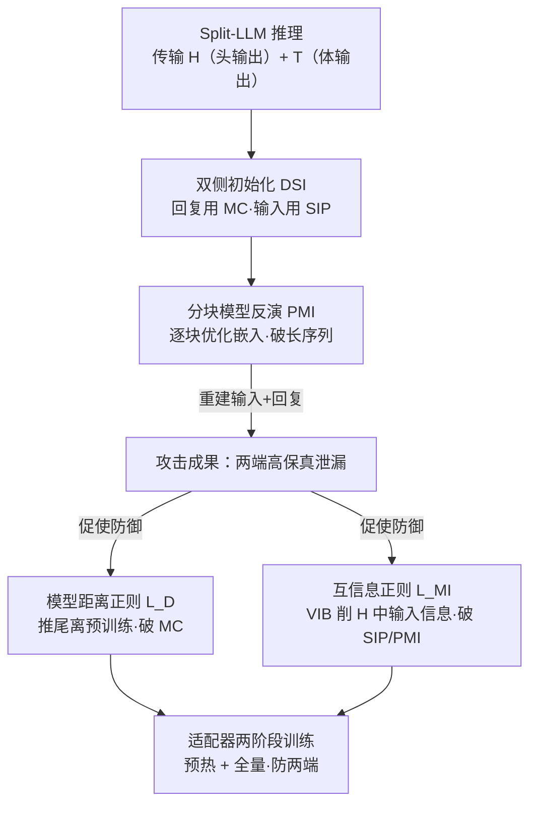

# From Prompts to Responses: Dual-Sided Data Leakage and Defense in Split Large Language Models

**会议**: ICML2026  
**arXiv**: [2606.14210](https://arxiv.org/abs/2606.14210)  
**代码**: https://github.com/FLAIR-THU/VFLAIR-LLM  
**领域**: AI安全 / 隐私攻击与防御  
**关键词**: 拆分学习, 模型反演攻击, 隐私保护, 互信息正则, 大语言模型

## 一句话总结
在「拆分大语言模型（Split-LLM）」里，私有数据其实从模型头和模型尾**两端**都会泄漏；这篇论文一边提出 PIDI 攻击——用双侧初始化 + 分块反演同时高保真地重建出用户的输入提示和模型生成的回复，一边提出 ADMI 防御——用适配器局部预热 + 互信息正则在几乎不掉点的前提下把两端攻击成功率压到接近零。

## 研究背景与动机
**领域现状**：隐私敏感领域（金融、医疗）的用户用 LLM 时左右为难：调外部 API 怕数据外泄，本地全量部署又算力不够。拆分学习（Split Learning）给出折中方案——把一个完整 LLM 切成「头-体-尾（Head-Body-Tail, HBT）」三段，把轻量的头 $M_h$（嵌入层 + 前若干层）和尾 $M_t$（最后若干层 + 输出投影）留在本地数据方，把占大头参数的体 $M_b$ 放到云端模型方，双方只传中间激活而不传原始数据。

**现有痛点**：HBT 的初衷是「两端都留在本地→两端都安全」，但实际并非如此。已有的反演攻击大多只盯着**输入提示**的泄漏（从模型头输出的中间表示 $H$ 里反推输入），或者分类任务里从梯度反推**标签**。生成式任务里**回复输出**这一侧的泄漏，以及「输入和回复如何从两端**联合**泄漏」，几乎没人系统研究过。

**核心矛盾**：自回归生成天然会把已生成 token 追加回输入序列，于是云端模型方在多轮前向里能聚合到模型头输出 $H$ 和模型体输出 $T$，相当于**同时握有重建输入和回复所需的两侧信息**。而现有防御几乎都只加固模型头（防输入泄漏），对模型尾几乎不设防；唯一尝试两端兼顾的 DualGuard 又有结构缺陷。

**本文目标**：（1）攻击侧——系统揭示 Split-LLM 在生成时输入和回复的**双端泄漏**，并造一个能同时高保真重建两者的攻击；（2）防御侧——设计一个真正两端兼防、且尽量不牺牲任务性能的防御。

**切入角度**：攻击方是「诚实但好奇（honest-but-curious）」的模型方，遵守协议、不串谋，但握有原始模型分段 $\bar{M}_{h/b/t}$、微调后的体 $M_b$、以及推理时传输的激活 $H$ 和 $T$，外加可选的少量辅助数据（实验里仅 50 条）。整个攻击只在前向阶段进行、**没有梯度可用**，这与训练时攻击有本质区别。

**核心 idea**：攻击用「先粗初始化、再精细反演」两阶段，且输入侧和回复侧用不同手段分别初始化；防御则用「适配器局部预热 + 互信息正则 + 模型距离正则」破坏攻击赖以成立的两个前提（模型头泄漏 + 微调尾「离预训练尾不太远」的 not-too-far 性质）。

## 方法详解

### 整体框架
论文是「攻防成对」结构：先提出攻击 **PIDI**（Patched Model Inversion with Dual-Sided Initialization），证明 Split-LLM 两端都能被高保真重建；再提出防御 **ADMI**（Adapter-based DualGuard with Mutual Information Defense），针对性地堵住 PIDI 利用的两个漏洞。

PIDI 分两阶段：**双侧初始化（DSI）**先对回复和输入各自做一次粗估计——回复用「模型补全（MC）」（把模型体输出 $T$ 喂回原始尾 $\bar{M}_t$，利用微调尾离预训练尾不远的 not-too-far 性质），输入用 SIP（训一个小模型从 $H$ 直接反推输入）；**分块模型反演（PMI）**再把粗估计的嵌入喂回原始头 $\bar{M}_h$ 得到「假" 隐状态，通过最小化与真实 $H$ 的差距来优化嵌入，并用「分块（patch）」技巧解决长序列难优化的问题。

ADMI 也分两阶段对应地拆解 PIDI 的两个支点：**适配器局部预热**引入一个编码-解码 Adapter 当作 $M_b$ 的替身通路，让本地能在冻结 $M_b$ 的同时仍享受其理解能力，并用模型距离正则 $\mathcal{L}_D$ 快速把尾推离预训练空间（破坏 MC 攻击）；**全量训练**再插入一个变分信息瓶颈（VIB）用互信息正则 $\mathcal{L}_{\text{MI}}$ 削减 $H$ 里关于输入的信息（破坏 SIP 和 PMI）。

### 关键设计

**1. 双侧初始化 DSI：输入和回复「症状不同、对症下药」**

PIDI 的第一步要给输入序列 $X$ 和回复序列 $Y$ 各搭一个粗初始化，关键洞察是这两侧泄漏的「机理不同」，不能用一招通吃。**回复侧**和模型的生成模式强相关，于是用模型补全（MC）：因为微调后的尾 $M_t$ 参数和原始预训练尾 $\bar{M}_t$ 通常「离得不远」（not-too-far 性质），攻击者直接把截获的模型体输出 $T$ 喂进原始尾就能估出回复 $\hat{Y}=\bar{M}_t(T)$。**输入侧**则和生成过程弱相关、主要由头 $M_h$ 的计算行为编码，于是用 SIP（Semi-white-box Forward Inversion）：利用已知变换 $H=M_h(X)$ 和隐状态的语义性质，仅用 50 条辅助数据训一个反演模型 $M_{\text{SIP}}$ 从 $H$ 直接估出输入 $\hat{X}=M_{\text{SIP}}(H)$。

两者拼成联合初始化 $E_0=[a_1^0,\dots,a_L^0]$。但这只是粗估：回复侧因 $M_t$ 与 $\bar{M}_t$ 的差异 + 生成时的采样随机性有系统偏差，输入侧因 SIP 预测误差也会错，所以还需要下一阶段精修。

**2. 分块模型反演 PMI：用因果结构把长序列拆成可优化的小块**

传统模型反演是把初始嵌入 $E_0$ 喂回原始头 $\bar{M}_h$ 得到「假" 隐状态 $\hat{H}$，再最小化反演损失 $\mathcal{L}_{\text{inv}}=\|M_h(E)-H\|$ 来逼近真实 $H$，解出 $E_1=\arg\min_{E_0}\mathcal{L}_{\text{inv}}$。痛点是序列长度 $L$ 一大，直接优化整条长度 $L$ 的嵌入就越来越难收敛。

PMI 的巧思是借力**解码器-only LLM 的因果结构**：把完整嵌入 $E_0\in\mathbb{R}^{L\times d}$ 切成 $N$ 个不重叠、长度为 $l$ 的块 $[E_{p1},\dots,E_{pN}]$，对应的 $H$ 也同样切块。因为某个位置的隐状态只依赖它**之前**的 token，前缀块 $[E_{p1},\dots,E_{pk}]$ 和对应的 $[H_{p1},\dots,H_{pk}]$ 就构成合法的输入-输出对。于是先**逐块迭代**反演：第 $k$ 次迭代只优化 $E_{pk}$、最小化 $\|\hat{H}_{pk}-H_{pk}\|$、冻结前面已优化好的块；全部块单独精修完后，再解冻所有块做一次**联合反演**收尾。这样把一个高维长序列优化问题降解成一串低维短块问题，显著提升了长文本的重建保真度。

**3. 互信息正则 $\mathcal{L}_{\text{MI}}$：从源头削掉 $H$ 里的输入信息**

防御要堵的第一个口子是「$H$ 泄漏输入」（SIP 和 PMI 都靠它）。目标是最小化输入与头输出的互信息 $I(X,H)$，把和任务无关的输入信息从 $H$ 里挤掉，让从 $H$ 反推 $X$ 变难。但 token id 离散、不可导，直接做不了，于是改在连续嵌入 $E=f_e(X)$ 上做：嵌入层固定时是确定性函数，马尔可夫链 $X\to E\to H$ 成立，由数据处理不等式得 $I(X,H)\le I(E,H)$，于是转而最小化 $I(E,H)$。

实现上借变分信息瓶颈（VIB）：在 $M_h$ 和 $M_b$ 之间插一个随机瓶颈 $M_{\text{VIB}}$，编码器把 $H$ 映成高斯参数 $(\boldsymbol{\mu},\boldsymbol{\sigma})$，用重参数化 $Z=\boldsymbol{\mu}+\boldsymbol{\sigma}\odot\boldsymbol{\epsilon}$ 采样后解码成扰动表示 $H'$ 再送进 $M_b$。互信息上界写成可计算的 KL 形式：

$$\mathcal{L}_{\text{MI}}=\frac{1}{N}\sum_{i=1}^{N}\frac{1}{2}\sum_{j=1}^{d}\left(\mu_{ij}^2+\sigma_{ij}^2-\log(\sigma_{ij}^2)-1\right)$$

以权重 $\alpha$ 加进总损失。它同时打击了 PMI 的反演训练和 DSI 的 SIP 初始化。

**4. 适配器局部预热 + 模型距离正则 $\mathcal{L}_D$：破坏 not-too-far、又不牺牲性能**

防御要堵的第二个口子是「MC 攻击靠 $M_t$ 离 $\bar{M}_t$ 不远」。沿用 DualGuard 的距离正则 $\mathcal{L}_D=1/\text{CrossEntropy}(M_t(T),M_t'(T))$，目标是**拉大**微调尾与预训练尾的输出分歧，破坏 not-too-far 让 MC 失效。但 DualGuard 在局部预热阶段把整个 $M_b$ 换成一个轻量投影层，会严重退化表示与最终性能，且因为没改系统结构，全量训练时巨大的 $M_b$ 会把参数「拽回去」，让尾重新变脆弱。

ADMI 的改进是引入一个编码-解码 **Adapter**：前向时编码器 $A_e$ 处理头输出 $H$，$M_b$ 照常算出 $T$，再由解码器 $A_d$（以 $A_e$ 为 memory）把 $T$ 精炼成 $T'$ 喂给尾。反向时数据方**不向模型方传梯度**，$M_b$ 保持冻结只做前向，主任务损失的梯度经 $A_d/A_e$ 回流到 $M_h$ 完成更新。这样既留住了 $M_b$ 的理解能力、又保住了局部预热的安全性质。由于 $\mathcal{L}_D$ 在训练早期 $M_t(T)\approx M_t'(T)$ 时会爆炸大，论文用自适应权重把它的梯度范数压到主任务梯度的 0.1 倍以内：

$$\text{ada}(\beta)=\frac{\min(\|\nabla_{\mathbf{E}}\mathcal{L}_D\|_2,\ 0.1\cdot\|\nabla_{\mathbf{E}}\mathcal{L}_T\|_2)}{\|\nabla_{\mathbf{E}}\mathcal{L}_D\|_2+\epsilon}$$

保证训练稳定、不掉性能。全量训练阶段则把 $\mathcal{L}_{\text{MI}}$ 和 $\mathcal{L}_D$ 一起加到主任务损失 $\mathcal{L}_{\text{ft}}=\mathcal{L}_T+\alpha\mathcal{L}_{\text{MI}}+\text{ada}(\beta)\cdot\mathcal{L}_D$，两端同时设防。

### 损失函数 / 训练策略
ADMI 两阶段训练：**局部预热**目标 $\mathcal{L}_{\text{lw}}=\mathcal{L}_T+\text{ada}(\beta)\cdot\mathcal{L}_D$（只防尾、靠 Adapter 通路更新头）；**全量训练**目标 $\mathcal{L}_{\text{ft}}=\mathcal{L}_T+\alpha\mathcal{L}_{\text{MI}}+\text{ada}(\beta)\cdot\mathcal{L}_D$（插入 VIB、两端同防）。一个信息互补的设计是：VIB 在头部抹掉敏感语义可能误伤有用的提示信息，而 Adapter 编码了 $H$ 的未扰动信息，可在解码时补回，缓解这一损失。

## 实验关键数据

### 攻击主实验
在 3 个 LLM（Llama3.2-3B / Llama3-8B / Qwen2.5-7B）× 3 个数据集（Fin 金融 QA / Med 医疗 QA / Dolly 通用指令）上评估攻击，指标为综合攻击成功率 $\text{AP}_{\alpha=0.5}$（输入侧与回复侧 BLEU 的等权加权，越高泄漏越严重）。

| 攻击方法 | Fin/Llama3.2-3B | Fin/Llama3-8B | Fin/Qwen2.5-7B | Dolly/Qwen2.5-7B |
|----------|----------------|---------------|----------------|------------------|
| **PIDI (DSI+PMI)** | **0.868** | **0.883** | **0.892** | **0.985** |
| DSI+VMI | 0.828 | 0.716 | 0.770 | 0.814 |
| BiSR (SIP+VMI) | 0.665 | 0.610 | 0.546 | 0.667 |
| DSI（仅初始化） | 0.691 | 0.697 | 0.770 | 0.740 |
| SIP（仅输入侧） | 0.391 | 0.347 | 0.546 | 0.450 |
| MC（仅回复侧） | 0.400 | 0.418 | 0.442 | 0.405 |
| VMI（纯反演） | 0.006 | 0.312 | 0.224 | 0.029 |

PIDI 在所有设置上都最强，多数 AP 在 0.8~0.99——意味着输入和回复都能高保真重建。对比之下，单用 SIP 或 MC 只能恢复一侧（~0.4），纯 VMI 在长序列上几乎失效（低至 0.006），凸显「双侧初始化」和「分块反演」缺一不可。

### 防御主实验
防御指标：主任务性能 MP（METEOR，越高越好）、攻击成功率 AP（越低越安全）、综合权衡分 DCS（越高越好）。下表为防御 PIDI 在 Fin 数据集上的结果。

| 防御方法 | Llama3.2-3B (MP/AP/DCS) | Llama3-8B (MP/AP/DCS) | Qwen2.5-7B (MP/AP/DCS) |
|----------|--------------------------|------------------------|-------------------------|
| 无防御 | 0.560 / 0.868 / — | 0.527 / 0.883 / — | 0.550 / 0.892 / — |
| **ADMI** | 0.516 / **0.017** / **0.968** | 0.515 / **0.014** / **0.987** | 0.527 / **0.004** / **0.984** |
| DualGuard | 0.459 / 0.296 / 0.819 | 0.510 / 0.446 / 0.760 | 0.542 / 0.572 / 0.712 |
| MID | 0.510 / 0.167 / 0.890 | 0.497 / 0.023 / 0.974 | 0.515 / 0.290 / 0.829 |
| DPForward | 0.549 / 0.721 / 0.662 | 0.533 / 0.850 / 0.625 | 0.533 / 0.711 / 0.665 |
| SP | 0.554 / 0.617 / 0.696 | 0.527 / 0.649 / — | — |

ADMI 把 PIDI 的攻击成功率从 0.87~0.89 压到 **0.004~0.017**（几乎完全失效），同时 MP 只从 ~0.55 掉到 ~0.52（几乎不掉点），DCS 高达 0.96~0.99，全面优于 DualGuard、MID 等基线——后者要么防不住（DualGuard 在 Qwen 上 AP 仍 0.572），要么掉点更多。

### 关键发现
- **双侧初始化是攻击关键**：DSI 单独就把 AP 从 SIP/MC 的 ~0.4 提到 ~0.7，再叠加 PMI 精修冲到 ~0.88，证明「分别初始化输入/回复 + 联合精修」的设计有效。
- **分块反演解决长序列**：纯 VMI 在长序列上崩溃（Fin/Llama3.2-3B 仅 0.006），PMI 的因果分块让长文本也能高保真重建。
- **ADMI 的两端兼防 + 适配器是性能不掉点的关键**：相比 DualGuard 用投影层替换 $M_b$ 导致掉点，ADMI 用 Adapter 保住理解力，既守住安全又守住 MP。
- **互信息正则同时打击 SIP 与 PMI**：因为两者都依赖 $H$ 里的输入信息，从源头削 $I(E,H)$ 一举两得。

## 亮点与洞察
- **「双端泄漏」这个视角本身就有价值**：以前防御几乎只盯模型头防输入泄漏，这篇论文指出回复侧（模型尾）同样会泄、且能被联合利用，把 Split-LLM 的威胁模型补完整了。
- **用 LLM 的因果结构做反演分块**：把「长序列难优化」转化为「因前缀独立可逐块解」，是个能迁移到其他长序列反演/优化问题的巧思。
- **适配器作为「$M_b$ 替身通路」**：既冻结大模型体保证安全、又让梯度能借道更新头、还能在 VIB 抹信息后补回有用语义，一个模块同时解决了 DualGuard 的两个结构性缺陷。
- **自适应权重 $\text{ada}(\beta)$ 让对抗性正则稳定**：把易爆炸的距离正则梯度钳到主任务梯度的 0.1 倍，是个实用的「防御正则不毁性能」的小技巧。

## 局限与展望
- **攻击假设较强**：模型方需握有原始分段 $\bar{M}_{h/b/t}$、微调体 $M_b$ 和可选辅助数据，虽然是 HBT 标准设定，但现实中辅助数据是否易得会影响 SIP 效果。
- **防御未在更极端强度/更长序列上压力测试**：论文用 $\alpha=\beta=0.5$ 为主，不同隐私-效用偏好下的边界行为讨论有限。
- **仍是经验性隐私保护**：ADMI 提供的是强经验防护而非差分隐私式的形式化保证，面对未来更强的自适应攻击是否依然稳健需进一步验证。
- **VIB 抹信息与任务性能的张力**：靠 Adapter 补回信息是缓解手段，但在高隐私强度下二者的权衡上限尚未充分探明。

## 相关工作与启发
- **vs BiSR / SIP（Chen et al. 2024）**：BiSR 用 SIP 初始化 + 普通模型反演，但只针对输入侧、且原版靠梯度匹配（生成任务无梯度故未用）；PIDI 把它扩成双侧 + 分块反演，输入回复同时重建。
- **vs Model Completion（Fu et al. 2022；Liu et al. 2025）**：MC 只恢复回复侧、且依赖 not-too-far；PIDI 把 MC 当作回复侧初始化的一部分，再叠加输入侧 SIP 和联合精修。
- **vs DualGuard（Liu et al. 2025）**：DualGuard 首倡「局部预热 + 全量训练」两端兼防，但用投影层替换 $M_b$ 导致掉点、且全量训练时尾会被拽回脆弱；ADMI 用 Adapter 保住 $M_b$ 理解力 + VIB 互信息正则，权衡显著更优。
- **vs MID（Zou et al. 2023；Gu et al. 2025）/ DPForward / SanText 等**：这些防御多只加固模型头或注入噪声/扰动，对模型尾保护有限；ADMI 是少数真正两端兼防且几乎不掉点的方案。

## 评分
- 新颖性: ⭐⭐⭐⭐⭐ 首次系统揭示 Split-LLM 生成时的双端联合泄漏，攻防成对、视角完整。
- 实验充分度: ⭐⭐⭐⭐ 覆盖 3 模型 × 3 数据集、多攻击/多防御基线、含消融与序列长度分析。
- 写作质量: ⭐⭐⭐⭐ 攻防对应清晰、动机推导扎实，部分符号（$\bar{M}_t$ 等）排版稍乱。
- 价值: ⭐⭐⭐⭐⭐ 对隐私敏感场景的拆分部署有直接现实意义，且开源接入 VFLAIR-LLM 基准。

<!-- RELATED:START -->

## 相关论文

- [\[ICML 2026\] BYORn: Bootstrap Your Own Responses to Defend Large Vision-Language Models Against Backdoor Attacks](byorn_bootstrap_your_own_responses_to_defend_large_vision-language_models_agains.md)
- [\[ICML 2026\] Differentially Private Preference Data Synthesis for Large Language Model Alignment](differentially_private_preference_data_synthesis_for_large_language_model_alignm.md)
- [\[CVPR 2026\] A Provable Energy-Guided Test-Time Defense Boosting Adversarial Robustness of Large Vision-Language Models](../../CVPR2026/ai_safety/a_provable_energy-guided_test-time_defense_boosting_adversarial_robustness_of_la.md)
- [\[ICML 2026\] Forget to Know, Remember to Use: Context-Aware Unlearning for Large Language Models](forget_to_know_remember_to_use_context-aware_unlearning_for_large_language_model.md)
- [\[ICML 2026\] COFT: Counterfactual-Conformal Decoding for Fair Chain-of-Thought Reasoning in Large Language Models](coft_counterfactual-conformal_decoding_for_fair_chain-of-thought_reasoning_in_la.md)

<!-- RELATED:END -->
